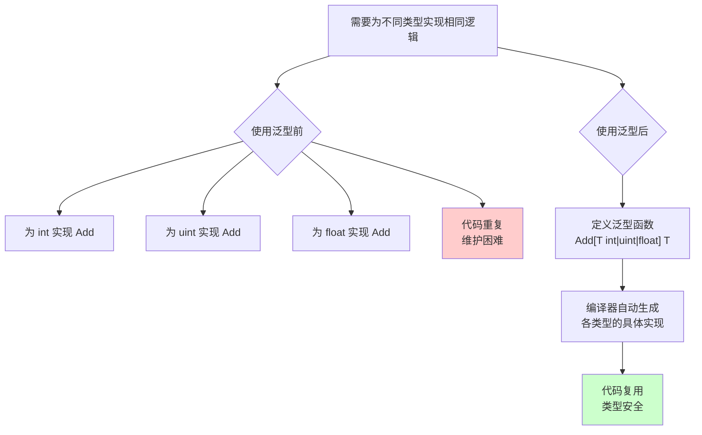
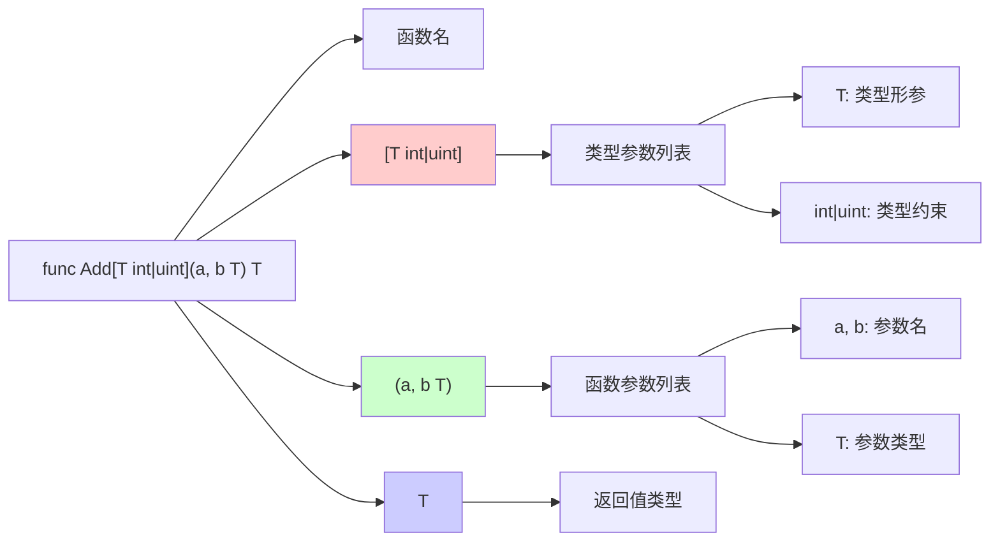
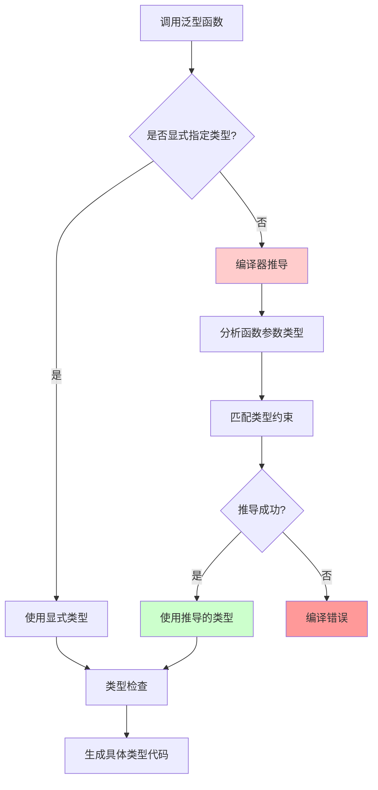
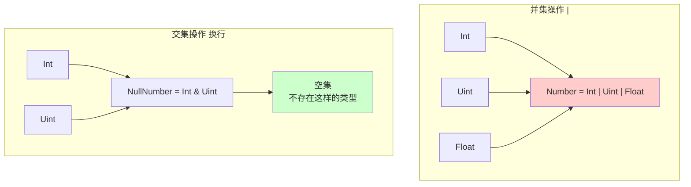
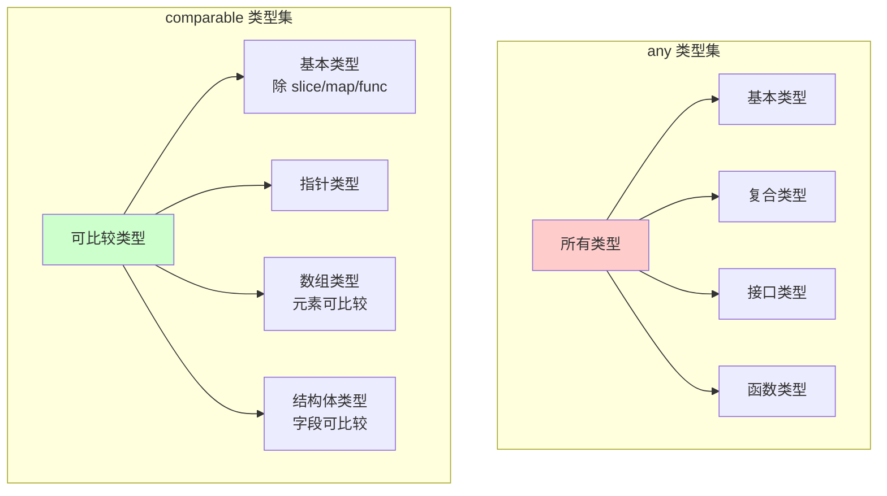
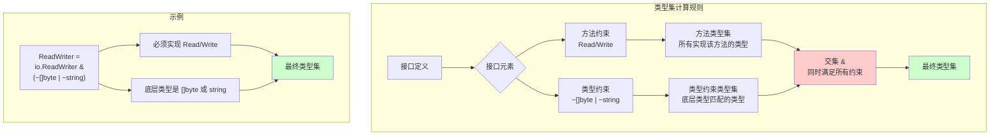
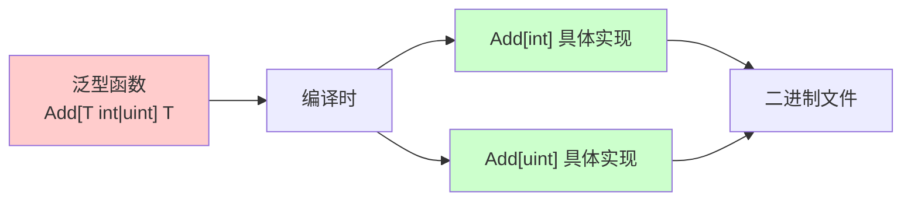

# Go 泛型详解

## 概述

泛型，将类型看成变量，定义类型约束，使类型约束的所有类型皆具有相关代码，是对类型第二个维度的描述。
`golang`中的泛型称做类型参数（Type Parameter）是在编译时将使用的类型都会具体实现一遍，类型越多就会导致编译速度变慢，编译后文件变大。

### 泛型的作用



**泛型的优势**：
- **代码复用**：避免为不同类型重复编写相同逻辑
- **类型安全**：编译时进行类型检查，避免运行时错误
- **性能优化**：编译时生成具体类型代码，无运行时开销
- **更好的抽象**：提高代码的可读性和可维护性

# 函数
```go
// 普通函数
func Add(a, b int) int
func Add(a, b uint) uint

// 泛型函数
func Add[T int|uint](a, b T) T
func Set[K ~int|uint, V float32|float64](a K, b V) bool

//       类型形参 类型约束     函数形参    函数形参类型 返回值
//       ↑       ↑          ↑          ↑          ↑
//       ↑       ↑↑↑↑↑↑↑↑   ↑↑↑↑↑↑↑↑↑↑ ↑          ↑
func Add[T       int|uint] (arg1, arg2 T)         T
```

与普通的Add函数相比，泛型函数多了对参数和返回值类型的定义：
* `[]` 表示声明泛型约束
* `T` 表示类型形参（`type arguments`）
* `int|uint`、`float32|float64` 表示类型约束，多个类型约束用`|`隔开，表示只允许类型约束列表中的类型能作为类型实参
* `a K, b V`表示类型为`K`和`V`的函数形参
* 多个类型参数用`,`隔开
* `~`表示底层类型（`underlying type`），`type MyInt int`表示类型名`MyInt`，底层类型为`int`

### 泛型函数语法结构



**语法说明**：
- **类型参数列表**：`[T Constraint]`，定义类型参数和约束
- **函数参数**：使用类型参数 `T` 作为参数类型
- **返回值**：使用类型参数 `T` 作为返回类型

## 类型推导
类型推导允许调用泛型函数不需要显式传入类型实参，看起来和调用普通函数没有区别

调用泛型函数时，需对类型参数实例化，既可显式写出类型实参，也可由编译器推导，两者等价
```go
Add(1, 2)        // 编译器推导为 Add[int](1, 2)
Add[int](1, 2)   // 显式指定类型
```

### 类型推导流程



类型约束推导，允许多个相关联的类型约束调用时，不需要显式传入类型实参
```go
// 定义切片类型
type intSlice []int
func (intSlice) String() string {}

// 定义函数，函数参数类型可以确定返回值类型
func scale[S ~[]E, E int | uint](s S, e E) S {}

// 可以通过函数参数即可确定返回值类型，也即可以调用String方法
scale(intSlice{}, 0).String()

// 参数无法确定类型参数
func toSlice[S ~[]E, E int | uint](e E) S {
    return append(S{}, e)
}

// 则必须显式声明类型才能使用成员方法，默认会推导成[]int，其没有String方法
toSlice[intSlice, int](1).String()
```

## 匿名函数
匿名函数不支持泛型，但是支持已经定义好的类型参数
```go
// ❌ 匿名函数不支持泛型
var add = func[T int|uint](a, b T) T {}

// ✅ 支持已经定义好的类型参数
func Func[T int | uint](a, b T) T {
    var add = func(a, b T) T {
        return a + b
    }
    return add(a, b)
}
```

## 类型断言
在泛型函数中不能对类型参数所对应的函数形参进行类型断言
但是支持：
* 先将参数转换成any再进行类型断言
* 支持反射（需要思考是否值得）
* 支持类型转换。

```go
// ❌ a和b是类型为T的Add函数的形参，不允许类型断言
func Add[T int | uint](a, b T) T {
    switch a.(type) {
    case int:
    case uint:
    }
}

// ✅ a和b是类型为T的Add函数的形参，先转换为any类型，再进行类型断言
func Add[T int | uint](a, b T) T {
    switch any(a).(type) {
    case int:
    case uint:
    }
}

// ✅ 支持反射
func Add[T int | uint](a, b T) T {
    v := reflect.ValueOf(a)
    switch v.Kind() {
    case reflect.Int:
    case reflect.Uint:
    }
}

// ✅ 支持类型转换
func Add[T int | uint](a T, b any) T {
    bb, _ := b.(T)
    return a + bb
}
```

# 结构
声明结构与声明方法类似，在结构名后面添加类型约束
实例化对象时类型必须显式声明，编译器不会推导
```go
// 声明泛型结构
type Slice[T int|uint|string] []T

// 实例化对象
var arr = Slice[int]{}
var arr Slice[int] = []int{}
```

结构体声明，允许类型形参嵌套，但不允许循环引用
```go
type Struct[T int|uint|float32|float64, S []T] struct {
    t T
    s S
}

var s = Struct[int, []int]{
    t: 0,
    s: []int{1, 2},
}
```

如果泛型约束为子集，则可以嵌套声明`type IntSlice[T int|uint] Slice[T]`，因为`IntSlice`的类型约束是`Slice`类型约束的子集，所以允许嵌套声明；如果不是子集`type IntSlice[T int|int8] Slice[T]`则不允许嵌套声明。

## 声明示例
```go
// ❌ 类型形参不能单独使用
type Type[T int|uint] T

// ❌ 当还用指针时会与乘法定义冲突
type Type[T *int|*uint] []T
// ✅ 在后面加上逗号表示类型参数列表
type Type[T *int|*uint,] []T
// ✅ 改用匿名interface定义
type Type[T interface{*int|*uint}] []T

// ❌ 定义S为[]T，则S的元素类型必须与T类型相同
var s Struct[int, []uint]
// ✅ 类型定义必须相同
var s Struct[int, []int]

// ❌ 匿名结构不支持泛型
var s = struct[T int|uint] {
    t T
    s []T
}{}
```

## 成员方法
成员方法，会对每一个类型约束都实现相应的方法
```go
func (s *Slice[T]) Sum() T {}

// 调用
s := Slice[int]{1, 2, 3}
fmt.Println(s.Sum())
```

golang不支持泛型方法，但支持使用结构泛型的类型参数
```go
// ❌ 不支持成员方法提供类型参数
func (s *Slice[T]) Push[V int|uint](v V)

// ✅ 支持使用结构泛型的类型参数
func (s *Slice[T]) Pop() T
```

## 参数返回值
当泛型结构做参数和返回值时，需要将泛型结构特化成指定类型的结构，也可以使用函数的类型约束
```go
// 特化类型为int，与普通函数没有区别
func append(s Slice[int], i int) Slice[int] {}

// append函数的类型约束必须是Slice类型约束的子集
func append[T int|uint](s Slice[T], t T) Slice[T] {}
```

# 接口
接口用于定义类型约束的集合
```go
type Int interface {
    ~int|int8|int16|int32|int64
}
type Uint interface {
    ~uint|uint16|uint32|uint64
}
type Float interface {
    float32|float64
}
```

接口允许嵌套组合，`|`表示并集，换行表示交集

```go
// 接口可以嵌套
type Number interface {
    Int|Uint|Float
}

// 表示既是Int又是Uint 不存在这样的类型 所以是个空集
type NullNumber interface {
    Int
    Uint
}
```

### 接口类型集关系



**类型集规则**：
- **并集（`|`）**：类型可以是其中任意一种
- **交集（换行）**：类型必须同时满足所有条件
- **空集**：如果交集条件无法满足，类型集为空

### 特殊类型集

* `any`，表示任意类型的集合，是对原有`interface{}`的替代
* `comparable`，表示可以判断是否相等的类型集合，不能与其他类型进行`|`操作



**使用示例**：
```go
// any 可以接受任何类型
func Print[T any](v T) {
    fmt.Println(v)
}

// comparable 可以进行比较操作
func Equal[T comparable](a, b T) bool {
    return a == b
}
```


接口函数，允许类型与函数同时定义，并且语义同上，换行表示交集
```go
// Number 表示类型为Int或Uint或Float的并且实现了Add函数的类型
type Number interface {
    Int | Uint | Float
    Add(a, b int)
}
```

## 接口分类
* 基本接口，表示只有方法约束的接口，`1.18`之前的`interface`
* 一般接口，不止包含方法约束还包括类型约束，只能用于类型约束，不能用于变量声明
* 泛型接口，声明时包含类型约束的接口

```go
// 基本接口
type NumberAdd interface {
    Add(a, b int) int
}

// 一般接口
type IntAdd interface {
    Int
    Add(a, b int) int
}
// ❌ 一般接口不允许定义变量
var iadd IntAdd

// 泛型接口
type IntSub[T Number] interface {
    Int
    Sub(a, b T) T
}
```

### 基本接口（Basic interfaces）
只包含函数约束列表的接口，即原有接口定义形式，兼容原有语义

### 一般接口（General interfaces）
描述兼容泛型的接口，支持函数约束和类型约束，接口类型集规则如下：
* 空接口的类型集是所有非接口类型的集合，`any = interface{}`
* 非空接口的类型集是其接口元素的类型集的交集，每行表示`&`语义
* 方法的类型集是所有非接口类型拥有的方法集中包含该方法，定义实现接口
* 非接口类型的类型集是仅由类型组成的集合，类型的集合，允许`|`操作
* `~T`形式的项的类型集是底层类型为`T`的所有类型的集合
* 项并集`t1|t2|…|tn`是项的类型集的并集

```go
// 定义实现io.ReadWriter且底层类型是[]byte或string或底层类型是Data字段结构的接口
type ReadWriter interface {
    io.ReadWriter
    ~[]byte | ~string | ~struct{ Data int }
}
```

### 一般接口类型集计算



**类型集计算示例**：
```go
// 类型集 = (实现 Read 方法的类型) & (实现 Write 方法的类型) & (底层类型为 []byte 或 string 的类型)
type ReadWriter interface {
    io.ReadWriter           // 方法约束：Read 和 Write
    ~[]byte | ~string      // 类型约束：底层类型匹配
}
```

错误示例
```go
type Invalid interface {
    // ❌ ~不能对底层类型不是自己的类型使用，也不可以对接口使用
    ~MyInt
    ~error
    // ❌ 类型参数不能作为类型约束
    Type
    int | ~Type
    // ❌ 不能自己嵌套自己
    Invalid
    int | Invalid
    // ❌ 接口方法不能拥有类型约束列表
    Func[T int]()
}

// ❌ 不允许循环嵌套
type Bad1 interface {
    Bad2
}
type Bad2 interface {
    Bad1
}
```


### 泛型接口
在定义时拥有类型约束，即表示泛型接口
```go
// 定义泛型接口
type Adder[T ~int | ~uint] interface {
    Add(a, b T) T
}

// IntAdder 定义类型参数为T
// 数据类型为Int|Uint
// 实现了error接口
// 实现了泛型函数Add
type IntAdder[T ~int | ~uint] interface {
    Int | Uint
    error
    Add(a, b T) T
}
```


## 实现接口
类型`T`实现接口`I`的条件
* 类型`T`不是接口并且是类型集`I`的元素
* 类型`T`是一个接口并且类型集`T`是类型集`I`的子集

### 基本接口
和原有逻辑一样，只要实现了函数约束列表中的所有函数即可实现该接口
```go
// 实现error接口
type Error struct {}
func (Error) Error() string {}
```

### 一般接口
一般接口只能用作类型约束不能被实现
```go
// 实现ReadWriter接口
type Bytes []byte
func (Bytes) Read(p []byte) (n int, err error) {}
func (Bytes) Write(p []byte) (n int, err error) {}

// 基于类型约束实现read函数
func read[T ReadWriter](reader T) {
    reader.Read(nil)
}

// ❌ 一般接口只能用于类型约束，不能用于实例化对象
var rwer ReadWriter
```


### 泛型接口
需要先确定接口类型参数，让接口转为具体的实例化接口。实例化后如果是基本接口则即可声明变量又可作类型约束，如果实例化后是一般接口则只可做类型约束。
```go
// 定义实现泛型接口类型
type MyInt int
func (MyInt) Add(a, b int) int {}

// 声明泛型接口变量
var adder Adder[int]

// 将泛型接口作为函数参数类型
func adder(a Adder[int]) {}

// 将泛型接口作为类型约束
func intAdd[T IntAdd[int]](a,b T) T
```

# 常见使用场景

## 容器类型

泛型最常见的用途是实现类型安全的容器：

```go
// 泛型栈
type Stack[T any] struct {
    items []T
}

func (s *Stack[T]) Push(item T) {
    s.items = append(s.items, item)
}

func (s *Stack[T]) Pop() (T, bool) {
    if len(s.items) == 0 {
        var zero T
        return zero, false
    }
    item := s.items[len(s.items)-1]
    s.items = s.items[:len(s.items)-1]
    return item, true
}
```

## 工具函数

实现通用的工具函数，避免类型转换：

```go
// 查找切片中的元素
func Find[T comparable](slice []T, value T) int {
    for i, v := range slice {
        if v == value {
            return i
        }
    }
    return -1
}

// 映射函数
func Map[T, U any](slice []T, fn func(T) U) []U {
    result := make([]U, len(slice))
    for i, v := range slice {
        result[i] = fn(v)
    }
    return result
}
```

## 约束组合

使用接口组合创建复杂的类型约束：

```go
// 数值类型约束
type Numeric interface {
    ~int | ~int8 | ~int16 | ~int32 | ~int64 |
    ~uint | ~uint8 | ~uint16 | ~uint32 | ~uint64 |
    ~float32 | ~float64
}

// 可排序类型约束
type Sortable interface {
    Numeric | ~string
}

func Sort[T Sortable](slice []T) {
    // 排序实现
}
```

# 性能考虑

## 编译时生成

Go 泛型采用**单态化（Monomorphization）**实现：



**特点**：
- 每个使用的类型都会生成一份具体代码
- 运行时无额外开销，性能与手写代码相同
- 编译时间和二进制文件大小会增加

## 最佳实践

1. **合理使用类型约束**：不要过度使用 `any`，尽量使用具体约束
2. **避免过度泛型化**：不是所有场景都需要泛型，简单场景直接写具体类型
3. **注意编译时间**：大量使用泛型会增加编译时间
4. **类型约束设计**：设计良好的类型约束可以提高代码复用性

# 常见错误和注意事项

## 类型约束错误

```go
// ❌ 类型约束不匹配
func Add[T int](a, b T) T {
    return a + b
}
Add(1.0, 2.0)  // 错误：float64 不在约束 int 中

// ✅ 使用正确的约束
func Add[T int | float64](a, b T) T {
    return a + b
}
```

## 类型推导失败

```go
// ❌ 无法推导类型
func Get[T any]() T {
    var zero T
    return zero
}
value := Get()  // 错误：无法推导 T

// ✅ 显式指定类型
value := Get[int]()
```

## 方法不支持泛型

```go
type Stack[T any] struct {
    items []T
}

// ❌ 方法不能有额外的类型参数
func (s *Stack[T]) Push[U any](item U) {}

// ✅ 只能使用结构体的类型参数
func (s *Stack[T]) Push(item T) {}
```

# 总结

* golang实现泛型，减少了对不同类型相同的代码
* 利用先约束后使用的策略，明确代码含义
* 支持了对底层数据类型的支持，弥补了对基础类型不能实现方法的不足
* 有类型约束的类型只能做类型约束，不能实例化对象
* 编译时生成具体类型代码，运行时无额外开销
* 合理使用泛型可以提高代码复用性和类型安全性

# 参考文献
1. [The Go Programming Language Specification](https://go.dev/ref/spec)
2. [Go 1.18 泛型全面讲解：一篇讲清泛型的全部](https://segmentfault.com/a/1190000041634906)
3. [Go泛型是怎么实现的?](https://colobu.com/2021/08/30/how-is-go-generic-implemented/)