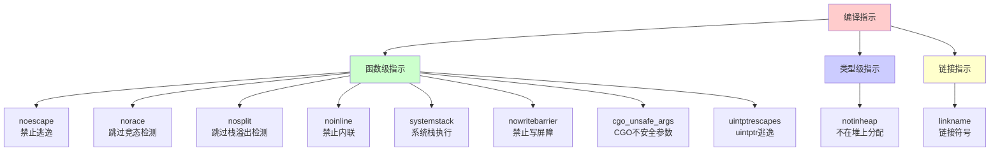
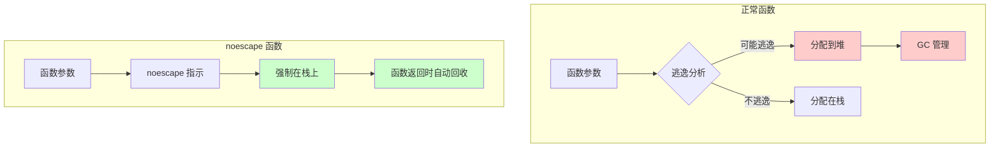
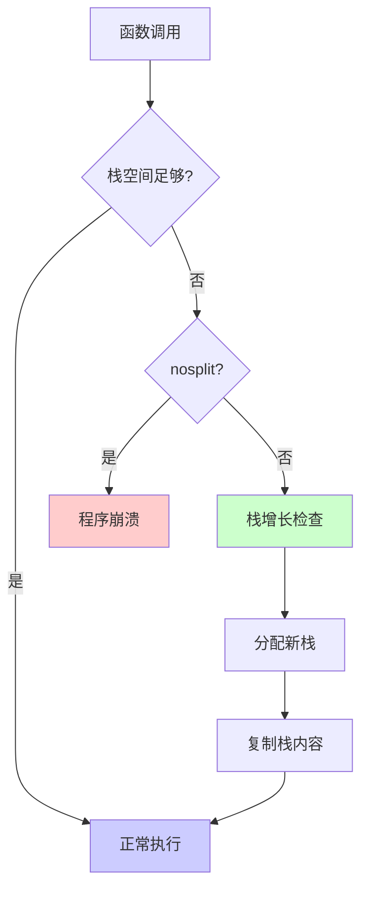

# Go 编译指示详解

## 概述

编译指示（Compiler Directives）是 Go 语言提供的一种编译器指令机制，通过在代码中使用特殊注释来指导编译器进行特定的优化或行为调整。

**基本语法**：
```go
//go:directive
func functionName() {
    // 函数体
}
```

**特点**：
- 必须以 `//go:` 开头（注意没有空格）
- 必须紧邻函数或类型声明（中间不能有空行）
- 主要用于性能优化和运行时控制
- 大部分编译指示是**不可移植的**，可能在不同版本间变化

## 编译指示分类



源码中包含了所有的编译指示定义：

```go
const (
	// Func pragmas.
	Nointerface    syntax.Pragma = 1 << iota
	Noescape                     // func parameters don't escape
	Norace                       // func must not have race detector annotations
	Nosplit                      // func should not execute on separate stack
	Noinline                     // func should not be inlined
	CgoUnsafeArgs                // treat a pointer to one arg as a pointer to them all
	UintptrEscapes               // pointers converted to uintptr escape

	// Runtime-only func pragmas.
	// See ../../../../runtime/README.md for detailed descriptions.
	Systemstack        // func must run on system stack
	Nowritebarrier     // emit compiler error instead of write barrier
	Nowritebarrierrec  // error on write barrier in this or recursive callees
	Yeswritebarrierrec // cancels Nowritebarrierrec in this function and callees

	// Runtime-only type pragmas
	NotInHeap // values of this type must not be heap allocated
)

func pragmaValue(verb string) syntax.Pragma {
	switch verb {
	case "go:nointerface":
		if objabi.Fieldtrack_enabled != 0 {
			return Nointerface
		}
	case "go:noescape":
		return Noescape
	case "go:norace":
		return Norace
	case "go:nosplit":
		return Nosplit
	case "go:noinline":
		return Noinline
	case "go:systemstack":
		return Systemstack
	case "go:nowritebarrier":
		return Nowritebarrier
	case "go:nowritebarrierrec":
		return Nowritebarrierrec | Nowritebarrier // implies Nowritebarrier
	case "go:yeswritebarrierrec":
		return Yeswritebarrierrec
	case "go:cgo_unsafe_args":
		return CgoUnsafeArgs
	case "go:uintptrescapes":
		// For the next function declared in the file
		// any uintptr arguments may be pointer values
		// converted to uintptr. This directive
		// ensures that the referenced allocated
		// object, if any, is retained and not moved
		// until the call completes, even though from
		// the types alone it would appear that the
		// object is no longer needed during the
		// call. The conversion to uintptr must appear
		// in the argument list.
		// Used in syscall/dll_windows.go.
		return UintptrEscapes
	case "go:notinheap":
		return NotInHeap
	}
	return 0
}
```

# 函数级编译指示

## go:nointerface

**作用**：禁止接口方法实现检查

**使用场景**：用于运行时内部实现，普通代码很少使用

**示例**：
```go
//go:nointerface
func (t *Type) method() {
    // 实现
}
```

## go:noescape

**作用**：禁止参数逃逸到堆，告诉编译器函数参数不会逃逸

**特点**：
- 只能用于**只有声明没有主体的函数**
- 绕过编译器的逃逸检查
- 减少 GC 压力
- **危险**：如果参数实际逃逸了，会导致运行时错误

**使用场景**：
- 性能关键路径
- 确定参数不会逃逸的函数
- 运行时内部函数

**示例**：
```go
//go:noescape
func noEscapeFunc(s *string) int

func main() {
    s := "hello"
    result := noEscapeFunc(&s)  // s 不会逃逸到堆
    fmt.Println(result)
}
```

**注意事项**：
- ⚠️ **非常危险**：如果参数实际逃逸，会导致程序崩溃
- 只应在完全确定参数不会逃逸时使用
- 主要用于标准库和运行时内部

### 逃逸分析对比



## go:norace

**作用**：跳过竞态检测器（race detector）的检查

**使用场景**：
- 确定没有数据竞争的函数
- 性能关键路径
- 运行时内部函数

**示例**：
```go
//go:norace
func raceFreeFunc() {
    // 确定没有数据竞争的代码
}
```

**注意事项**：
- 只在确定没有数据竞争时使用
- 主要用于运行时内部

## go:nosplit

**作用**：跳过栈溢出检测，函数不会在单独的栈上执行

**原理**：
- Goroutine 的起始栈大小是 2KB（`_StackMin = 2048`）
- 栈不够时会动态增长
- `nosplit` 跳过栈溢出检测机制

**使用场景**：
- 栈空间需求很小的函数（叶子函数）
- 运行时关键函数
- 不能进行栈增长检查的函数

**示例**：
```go
//go:nosplit
func smallStackFunc() {
    // 只使用少量栈空间的函数
    var x int
    x = 1
}
```

**注意事项**：
- ⚠️ **危险**：如果栈空间不足，会导致程序崩溃
- 只能用于栈空间需求很小的函数
- 主要用于运行时内部

### 栈增长机制



## go:noinline

**作用**：禁止函数内联优化

**使用场景**：
- 需要保留函数调用栈的调试场景
- 性能分析时需要看到函数边界
- 测试函数调用次数
- 避免内联导致的代码膨胀

**示例**：
```go
//go:noinline
func debugFunc(x int) int {
    // 不会被内联，便于调试
    return x * 2
}

func main() {
    result := debugFunc(5)  // 保持函数调用
    fmt.Println(result)
}
```

**对比**：
```go
// 正常函数（可能被内联）
func normalFunc(x int) int {
    return x * 2
}

// 编译后可能变成：
// result := 5 * 2  // 直接内联

// noinline 函数（不会被内联）
//go:noinline
func noInlineFunc(x int) int {
    return x * 2
}

// 编译后保持函数调用
// result := noInlineFunc(5)
```

## go:systemstack

**作用**：函数必须在系统栈（system stack）上运行，而不是 goroutine 栈

**使用场景**：
- 运行时内部函数
- 需要访问系统级资源的函数
- 不能使用 goroutine 栈的函数

**示例**：
```go
//go:systemstack
func systemFunc() {
    // 在系统栈上执行
}
```

**注意事项**：
- 主要用于运行时内部
- 普通代码不应使用

## go:nowritebarrier

**作用**：禁止在函数中使用写屏障（write barrier）

**原理**：
- Go 的 GC 使用写屏障来跟踪指针
- 某些运行时函数不能使用写屏障
- 违反会导致编译错误

**使用场景**：
- 运行时 GC 相关函数
- 不能触发写屏障的关键路径

**示例**：
```go
//go:nowritebarrier
func gcFunc() {
    // 不能使用写屏障
}
```

## go:nowritebarrierrec

**作用**：禁止函数及其递归调用的函数中使用写屏障

**特点**：
- 包含 `nowritebarrier` 的效果
- 递归检查所有被调用的函数

**使用场景**：
- 运行时 GC 实现
- 需要确保整个调用链都没有写屏障

**示例**：
```go
//go:nowritebarrierrec
func recursiveFunc() {
    // 函数及其调用的函数都不能使用写屏障
    otherFunc()  // otherFunc 也不能使用写屏障
}
```

## go:yeswritebarrierrec

**作用**：取消 `nowritebarrierrec` 的限制，允许写屏障

**使用场景**：
- 在 `nowritebarrierrec` 的调用链中，某个函数需要写屏障
- 运行时内部使用

**示例**：
```go
//go:nowritebarrierrec
func parentFunc() {
    // 不能使用写屏障
    childFunc()  // 但 childFunc 可以
}

//go:yeswritebarrierrec
func childFunc() {
    // 可以使用写屏障
}
```

## go:cgo_unsafe_args

**作用**：告诉编译器，CGO 函数的一个指针参数应该被视为所有参数的指针

**使用场景**：
- CGO 调用中，需要传递指针数组
- 与 C 代码交互

**示例**：
```go
/*
#include <stdlib.h>
void process(int* arr, int len);
*/
import "C"

//go:cgo_unsafe_args
func callCGO(arr *int, len int) {
    C.process((*C.int)(arr), C.int(len))
}
```

**注意事项**：
- 主要用于 CGO 场景
- 需要理解 C 内存模型

## go:uintptrescapes

**作用**：告诉编译器，`uintptr` 参数可能是由指针转换而来，需要保留对象直到调用完成

**使用场景**：
- 系统调用中，指针转换为 `uintptr` 传递
- Windows DLL 调用

**示例**：
```go
//go:uintptrescapes
func syscallFunc(ptr uintptr) {
    // ptr 可能是由指针转换而来
    // 需要确保原对象不被 GC 回收
}

func main() {
    obj := &MyStruct{}
    syscallFunc(uintptr(unsafe.Pointer(obj)))
    // obj 在调用期间不会被 GC 回收
}
```

**注意事项**：
- ⚠️ **危险**：错误使用可能导致悬垂指针
- 主要用于系统调用和运行时内部

# 类型级编译指示

## go:notinheap

**作用**：标记类型不能在堆上分配，只能在栈或全局变量中使用

**使用场景**：
- 运行时内部类型
- 需要精确控制内存分配的类型
- 避免 GC 管理的类型

**示例**：
```go
//go:notinheap
type NotInHeap struct {
    x int
}

func main() {
    // ✅ 可以在栈上分配
    var local NotInHeap
    
    // ✅ 可以作为全局变量
    var global NotInHeap
    
    // ❌ 不能在堆上分配
    // obj := new(NotInHeap)  // 编译错误
}
```

**注意事项**：
- 主要用于运行时内部
- 普通代码很少使用


# 链接指示

## go:linkname

**作用**：将本地符号链接到导入路径中的符号，允许访问未导出的函数或变量

**语法**：
```go
//go:linkname localname importpath.name
```

**参数说明**：
- `localname`：当前包中的本地名称
- `importpath.name`：要链接的导入路径和符号名

**使用场景**：
- 访问标准库未导出的函数
- 运行时内部实现
- 性能优化（直接调用内部函数）

**示例**：

### 访问 runtime 内部函数

```go
package main

import (
    "fmt"
    _ "unsafe"  // 必须导入 unsafe 包
)

//go:linkname runtimeNano runtime.nanotime
func runtimeNano() int64

func main() {
    // 直接调用 runtime 的内部函数
    nano := runtimeNano()
    fmt.Println(nano)
}
```

### 访问未导出的变量

```go
package main

import (
    "fmt"
    _ "unsafe"
    "runtime"
)

//go:linkname gomaxprocs runtime.gomaxprocs
func gomaxprocs() int

func main() {
    // 访问未导出的函数
    procs := gomaxprocs()
    fmt.Println("GOMAXPROCS:", procs)
    
    // 对比导出的函数
    fmt.Println("NumCPU:", runtime.NumCPU())
}
```

### 链接变量

```go
package main

import (
    "fmt"
    _ "unsafe"
)

//go:linkname someVar some/package.variable
var someVar int

func main() {
    fmt.Println(someVar)
}
```

**注意事项**：
- ⚠️ **非常危险**：破坏了包的封装性
- ⚠️ **不可移植**：不同 Go 版本可能失效
- ⚠️ **可能崩溃**：如果符号不存在或类型不匹配，会导致运行时错误
- 必须导入 `unsafe` 包
- 主要用于标准库和运行时内部
- 生产代码应避免使用

### linkname 工作原理


**链接过程**：
1. 编译器识别 `//go:linkname` 指令
2. 在链接阶段，将本地符号链接到目标符号
3. 运行时直接调用目标符号

# 编译指示总结

## 使用建议

### 安全级别

| 编译指示 | 安全级别 | 使用场景 |
|---------|---------|---------|
| `noinline` | ⚠️ 较安全 | 调试、性能分析 |
| `norace` | ⚠️ 需谨慎 | 确定无竞态的函数 |
| `noescape` | 🔴 危险 | 运行时内部 |
| `nosplit` | 🔴 危险 | 运行时内部 |
| `systemstack` | 🔴 危险 | 运行时内部 |
| `nowritebarrier` | 🔴 危险 | 运行时内部 |
| `linkname` | 🔴 非常危险 | 运行时内部 |

### 最佳实践

1. **避免在生产代码中使用**：大部分编译指示是运行时内部使用的
2. **理解原理再使用**：错误使用可能导致程序崩溃
3. **文档化**：如果必须使用，要详细注释原因
4. **测试充分**：使用编译指示的代码需要充分测试
5. **版本兼容性**：注意不同 Go 版本的兼容性

## 常见使用场景

### 1. 性能分析

```go
//go:noinline
func benchmarkTarget() {
    // 禁止内联，便于性能分析
}
```

### 2. 调试

```go
//go:noinline
func debugFunction() {
    // 保持函数调用栈，便于调试
}
```

### 3. 运行时内部

```go
//go:nosplit
//go:nowritebarrier
func runtimeInternal() {
    // 运行时关键路径
}
```

## 验证编译指示

### 检查函数是否内联

```bash
# 编译时查看内联信息
go build -gcflags="-m -m" main.go
```

输出会显示哪些函数被内联，哪些没有。

### 检查变量逃逸

```bash
# 查看变量逃逸分析
go build -gcflags="-m" main.go
```

### 检查栈分配

```bash
# 查看栈分配信息
go build -gcflags="-S" main.go
```

## 注意事项

1. **版本兼容性**：编译指示可能在不同 Go 版本间变化
2. **平台差异**：某些编译指示可能只在特定平台有效
3. **编译器优化**：编译器可能会忽略某些指示
4. **文档缺失**：很多编译指示没有官方文档，需要查看源码
5. **调试困难**：使用编译指示的代码更难调试

## 总结

Go 的编译指示提供了强大的编译器控制能力，但：

- ⚠️ **大部分是运行时内部使用的**，普通代码不应使用
- ⚠️ **使用不当可能导致程序崩溃**
- ✅ **合理使用可以优化性能**（如 `noinline` 用于调试）
- ✅ **理解原理很重要**，避免盲目使用

建议：
- 优先使用标准的 Go 特性
- 只在必要时使用编译指示
- 充分测试和文档化

# 参考文献

1. [Go 语言编译器的 "//go:" 详解](https://segmentfault.com/a/1190000016743220)
2. [Command compile](https://golang.org/cmd/compile/)
3. [Go 源码 - cmd/compile/internal/gc/pragma.go](https://github.com/golang/go/blob/master/src/cmd/compile/internal/gc/pragma.go)