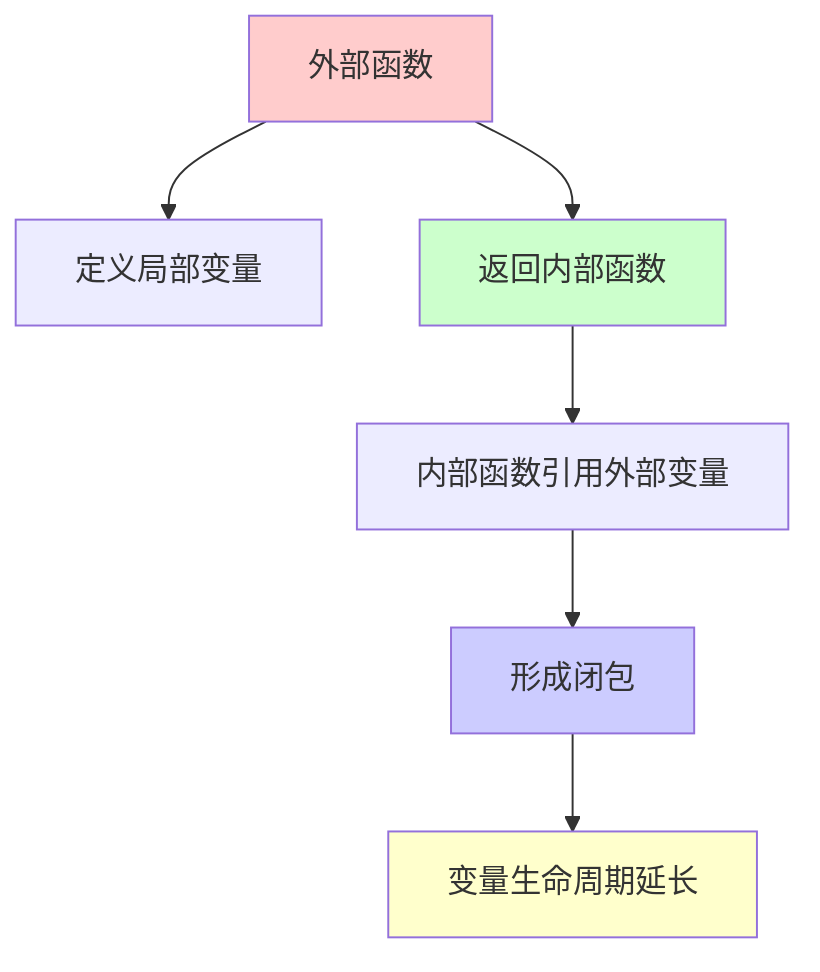
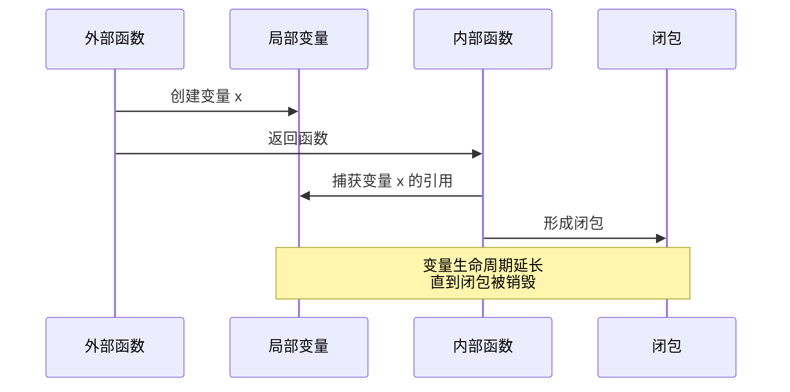
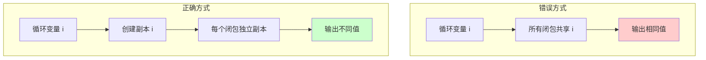
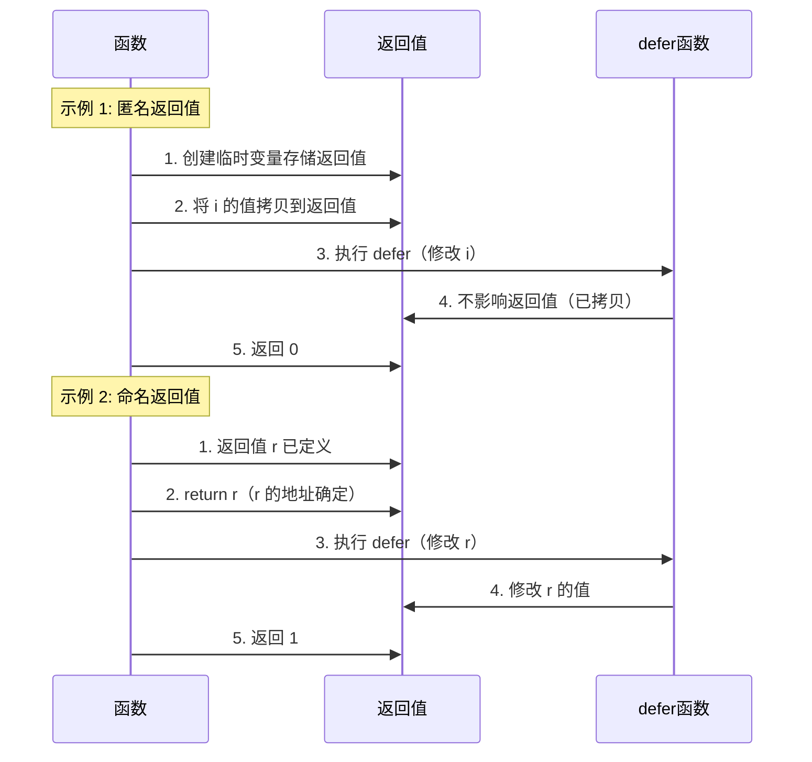
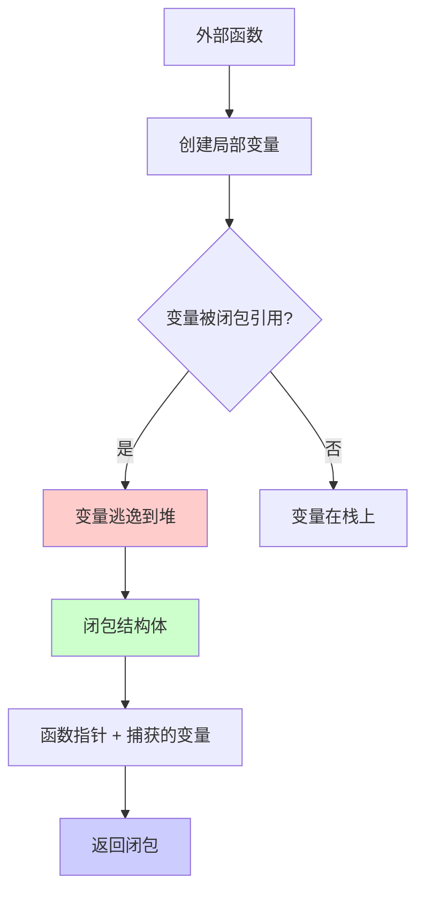

# Go 闭包详解

## 什么是闭包

闭包（Closure）是一个函数和其相关的引用环境组合而成的实体。在 Go 语言中，闭包允许函数访问其外部作用域的变量，即使外部函数已经返回。

参考：[闭包 Wikipedia](https://zh.wikipedia.org/wiki/%E9%97%AD%E5%8C%85_(%E8%AE%A1%E7%AE%97%E6%9C%BA%E7%A7%91%E5%AD%A6))

### 闭包的定义

闭包具有以下特征：
1. **函数**：闭包本身是一个函数
2. **引用环境**：函数可以访问外部作用域的变量
3. **生命周期延长**：被引用的变量生命周期延长到闭包存在期间

### 闭包的工作原理



**关键点**：
- 闭包捕获的是变量的**引用**，而不是值
- 多个闭包可以共享同一个变量
- 变量的生命周期与闭包绑定

# 闭包的创建

## 基本语法

闭包可以让一个函数和一组变量产生关系，让这些变量的生命周期保持持久性。

### 方式 1: 函数内部变量

```go
func incr() func() int {
    var x int  // 局部变量
    return func() int {
        x++ 
        return x 
    } 
}

func main() {
    f1 := incr()
    f2 := incr()
    
    fmt.Println(f1())  // 1
    fmt.Println(f1())  // 2
    fmt.Println(f2())  // 1 (独立的闭包)
    fmt.Println(f1())  // 3
}
```

**特点**：
- 每次调用 `incr()` 都会创建新的变量 `x`
- 不同的闭包实例拥有独立的变量副本
- 变量对外部隐藏，实现封装

### 方式 2: 外部变量

```go
var x int  // 全局变量

func incr() func() int { 
    return func() int {
        x++ 
        return x 
    } 
}

func main() {
    f1 := incr()
    f2 := incr()
    
    fmt.Println(f1())  // 1
    fmt.Println(f1())  // 2
    fmt.Println(f2())  // 3 (共享同一个变量)
    fmt.Println(f1())  // 4
}
```

**特点**：
- 所有闭包共享同一个变量
- 变量可以在任意位置修改
- 可能导致意外的副作用

### 闭包变量捕获机制



## 常见问题：循环中的闭包

### 问题示例

在 Go 中，循环中使用闭包时经常遇到变量捕获问题：

```go
// ❌ 错误示例
for i := 0; i < 3; i++ {
    go func() {
        fmt.Println(i)  // 可能输出 3, 3, 3
    }()
}
```

**问题原因**：
- 所有 goroutine 共享同一个变量 `i` 的引用
- goroutine 启动时，`i` 的值可能已经改变
- 导致所有 goroutine 打印相同的值

### 解决方案

#### 方案 1: 创建局部变量副本

```go
// ✅ 正确方式 1
for i := 0; i < 3; i++ {
    i := i  // 创建局部变量副本
    go func() {
        fmt.Println(i)  // 输出 0, 1, 2
    }()
}
```

#### 方案 2: 通过参数传递

```go
// ✅ 正确方式 2
for i := 0; i < 3; i++ {
    go func(i int) {
        fmt.Println(i)  // 输出 0, 1, 2
    }(i)  // 传递值
}
```

#### 方案 3: 使用 range

```go
// ✅ 正确方式 3
for i := range []int{0, 1, 2} {
    go func(i int) {
        fmt.Println(i)  // 输出 0, 1, 2
    }(i)
}
```

### 变量捕获对比



### 实际示例

```go
package main

import (
    "fmt"
    "time"
)

func main() {
    // 错误示例
    fmt.Println("错误示例：")
    for i := 0; i < 3; i++ {
        go func() {
            fmt.Printf("错误: %d\n", i)
        }()
    }
    time.Sleep(100 * time.Millisecond)
    
    // 正确示例 1
    fmt.Println("\n正确示例 1：")
    for i := 0; i < 3; i++ {
        i := i
        go func() {
            fmt.Printf("正确1: %d\n", i)
        }()
    }
    time.Sleep(100 * time.Millisecond)
    
    // 正确示例 2
    fmt.Println("\n正确示例 2：")
    for i := 0; i < 3; i++ {
        go func(i int) {
            fmt.Printf("正确2: %d\n", i)
        }(i)
    }
    time.Sleep(100 * time.Millisecond)
}
```

# 闭包的应用场景

闭包最大的用处是利用延迟执行特性，进行一些操作。

## 1. 函数工厂

使用闭包创建具有不同行为的函数：

```go
func makeMultiplier(factor int) func(int) int {
    return func(x int) int {
        return x * factor
    }
}

func main() {
    double := makeMultiplier(2)
    triple := makeMultiplier(3)
    
    fmt.Println(double(5))  // 10
    fmt.Println(triple(5))  // 15
}
```

## 2. 状态封装

使用闭包封装私有状态：

```go
func counter() func() int {
    count := 0
    return func() int {
        count++
        return count
    }
}

func main() {
    c1 := counter()
    c2 := counter()
    
    fmt.Println(c1())  // 1
    fmt.Println(c1())  // 2
    fmt.Println(c2())  // 1 (独立的计数器)
}
```

## 3. 资源管理

### 定时任务控制

启动定时任务，且可控制关闭它，可以使用闭包：

```go
func startTicker(dur time.Duration) func() {
    ticker := time.NewTicker(dur)
    go func() {
       for range ticker.C {
            // do something
        }
    }()
    return ticker.Stop  // 返回停止函数
}

func main() {
    stop := startTicker(time.Second)
    defer stop()  // 程序退出时停止
    // ...
}
```

### 文件操作

```go
func openFile(filename string) (func(), error) {
    file, err := os.Open(filename)
    if err != nil {
        return nil, err
    }
    
    return func() {
        file.Close()
    }, nil
}
```

## 4. 中间件模式

使用闭包实现中间件：

```go
func logger(next http.HandlerFunc) http.HandlerFunc {
    return func(w http.ResponseWriter, r *http.Request) {
        start := time.Now()
        next(w, r)
        fmt.Printf("请求耗时: %v\n", time.Since(start))
    }
}

func handler(w http.ResponseWriter, r *http.Request) {
    fmt.Fprintln(w, "Hello")
}
```

## 5. 延迟执行

### defer 中的闭包

常用模式还是在 defer 中使用闭包，而且 defer+return 的组合经常会让人摸不清头脑。

```go
// 示例 1: 匿名返回值
func increaseA() int {
    var i int
    defer func() {
        i++
    }()
    return i
}

// 示例 2: 命名返回值
func increaseB() (r int) {
    defer func() {
        r++
    }()
    return r
}

func main() {
    fmt.Println(increaseA())  // 0
    fmt.Println(increaseB())  // 1
}
```

### defer + return 执行流程



**关键区别**：

| 特性 | 匿名返回值 | 命名返回值 |
|------|-----------|-----------|
| **返回值定义** | 临时变量 | 预先定义的变量 |
| **defer 修改** | 不影响返回值 | 可以影响返回值 |
| **原因** | 值拷贝 | 引用同一变量 |

### 详细说明

**increaseA 函数**：
```go
func increaseA() int {
    var i int           // 1. 定义局部变量 i = 0
    defer func() {
        i++            // 4. defer 执行，i 变为 1
    }()
    return i           // 2. 将 i 的值（0）拷贝到返回值
                       // 3. 返回值已确定，defer 执行
                       // 5. 返回 0（不受 defer 影响）
}
```

**increaseB 函数**：
```go
func increaseB() (r int) {  // 1. 定义命名返回值 r = 0
    defer func() {
        r++                 // 3. defer 执行，r 变为 1
    }()
    return r                // 2. return r（r 的地址已确定）
                           // 4. 返回 1（defer 修改了 r）
}
```

### 实际应用示例

```go
// 使用闭包记录函数执行时间
func measureTime(fn func()) func() {
    start := time.Now()
    return func() {
        fmt.Printf("执行时间: %v\n", time.Since(start))
    }
}

func expensiveOperation() {
    time.Sleep(100 * time.Millisecond)
}

func main() {
    defer measureTime(expensiveOperation)()
    expensiveOperation()
}
```

## 6. 回调函数

使用闭包实现回调：

```go
func processData(data []int, callback func(int)) {
    for _, v := range data {
        callback(v)
    }
}

func main() {
    sum := 0
    processData([]int{1, 2, 3}, func(x int) {
        sum += x  // 闭包捕获 sum
    })
    fmt.Println(sum)  // 6
}
```

## 7. 函数式编程

使用闭包实现函数式编程模式：

```go
// Map 函数
func mapInts(slice []int, fn func(int) int) []int {
    result := make([]int, len(slice))
    for i, v := range slice {
        result[i] = fn(v)
    }
    return result
}

// Filter 函数
func filterInts(slice []int, fn func(int) bool) []int {
    var result []int
    for _, v := range slice {
        if fn(v) {
            result = append(result, v)
        }
    }
    return result
}

func main() {
    numbers := []int{1, 2, 3, 4, 5}
    
    // 使用闭包
    doubled := mapInts(numbers, func(x int) int {
        return x * 2
    })
    
    evens := filterInts(numbers, func(x int) bool {
        return x%2 == 0
    })
    
    fmt.Println(doubled)  // [2 4 6 8 10]
    fmt.Println(evens)   // [2 4]
}
```


# 闭包的实现原理

## 内存模型

闭包在 Go 中的实现涉及堆分配：



**关键点**：
- 被闭包引用的变量会**逃逸到堆**上
- 闭包实际上是一个结构体，包含函数指针和捕获的变量
- 多个闭包可以共享同一个变量（如果捕获的是同一个变量）

## 变量捕获规则

### 值类型 vs 引用类型

```go
// 值类型：捕获的是值的副本
func valueCapture() {
    x := 10
    f := func() {
        x = 20  // 修改的是副本
    }
    f()
    fmt.Println(x)  // 10（未改变）
}

// 引用类型：捕获的是引用
func referenceCapture() {
    x := []int{1, 2, 3}
    f := func() {
        x[0] = 10  // 修改的是原切片
    }
    f()
    fmt.Println(x)  // [10 2 3]（已改变）
}
```

### 指针捕获

```go
func pointerCapture() {
    x := 10
    f := func() {
        x = 20  // 通过指针修改
    }
    f()
    fmt.Println(x)  // 20（已改变）
}
```

# 常见陷阱和解决方案

## 1. 循环变量捕获

**问题**：所有闭包共享循环变量

```go
// ❌ 错误
var funcs []func()
for i := 0; i < 3; i++ {
    funcs = append(funcs, func() {
        fmt.Println(i)  // 都输出 3
    })
}
for _, f := range funcs {
    f()
}
```

**解决**：创建局部副本

```go
// ✅ 正确
var funcs []func()
for i := 0; i < 3; i++ {
    i := i  // 创建副本
    funcs = append(funcs, func() {
        fmt.Println(i)  // 输出 0, 1, 2
    })
}
```

## 2. 切片/映射捕获

**问题**：捕获切片/映射的引用

```go
// ❌ 可能的问题
var funcs []func()
data := []int{1, 2, 3}
for _, v := range data {
    funcs = append(funcs, func() {
        fmt.Println(v)  // 可能都输出最后一个值
    })
}
```

**解决**：捕获值或创建副本

```go
// ✅ 正确方式 1
for _, v := range data {
    v := v  // 创建副本
    funcs = append(funcs, func() {
        fmt.Println(v)
    })
}

// ✅ 正确方式 2
for i := range data {
    funcs = append(funcs, func() {
        fmt.Println(data[i])
    })
}
```

## 3. defer + 闭包

**问题**：defer 中闭包捕获的变量在执行时可能已改变

```go
// ❌ 可能的问题
for i := 0; i < 3; i++ {
    defer func() {
        fmt.Println(i)  // 可能都输出 3
    }()
}
```

**解决**：传递参数

```go
// ✅ 正确
for i := 0; i < 3; i++ {
    defer func(i int) {
        fmt.Println(i)  // 输出 2, 1, 0
    }(i)
}
```

## 4. goroutine + 闭包

**问题**：goroutine 启动时变量可能已改变

```go
// ❌ 错误
for i := 0; i < 3; i++ {
    go func() {
        fmt.Println(i)  // 可能都输出 3
    }()
}
```

**解决**：传递参数或创建副本

```go
// ✅ 正确方式 1
for i := 0; i < 3; i++ {
    i := i
    go func() {
        fmt.Println(i)
    }()
}

// ✅ 正确方式 2
for i := 0; i < 3; i++ {
    go func(i int) {
        fmt.Println(i)
    }(i)
}
```

# 最佳实践

## 1. 明确变量作用域

```go
// ✅ 好的做法：明确变量作用域
func createCounter() func() int {
    count := 0  // 局部变量，封装在闭包中
    return func() int {
        count++
        return count
    }
}
```

## 2. 避免共享可变状态

```go
// ❌ 不好的做法：共享全局状态
var counter int
func increment() {
    counter++  // 全局变量，可能被其他地方修改
}

// ✅ 好的做法：封装状态
func createCounter() func() int {
    var counter int
    return func() int {
        counter++
        return counter
    }
}
```

## 3. 合理使用闭包

```go
// ✅ 适合使用闭包的场景
// 1. 需要封装私有状态
// 2. 需要延迟执行
// 3. 需要函数工厂
// 4. 需要回调函数

// ❌ 不适合使用闭包的场景
// 1. 简单的函数调用
// 2. 不需要状态管理的场景
// 3. 性能敏感的场景（闭包有堆分配开销）
```

## 4. 注意性能影响

闭包会导致变量逃逸到堆，可能影响性能：

```go
// 变量逃逸到堆
func createClosure() func() {
    x := 10  // 逃逸到堆
    return func() {
        fmt.Println(x)
    }
}

// 避免不必要的闭包
func simpleFunction(x int) {
    fmt.Println(x)  // 无闭包，变量在栈上
}
```

# 调试技巧

## 1. 检查变量捕获

使用 `go build -gcflags="-m"` 查看变量逃逸：

```bash
go build -gcflags="-m" main.go
```

输出会显示哪些变量逃逸到堆。

## 2. 打印闭包信息

```go
func debugClosure(fn func()) {
    fmt.Printf("闭包地址: %p\n", fn)
    fn()
}
```

## 3. 使用 race detector

检测闭包导致的并发问题：

```bash
go test -race
go run -race main.go
```

# 总结

闭包是 Go 语言中强大的特性，但需要注意：

1. **变量捕获**：闭包捕获的是变量的引用，不是值
2. **生命周期**：被捕获的变量生命周期延长到闭包存在期间
3. **循环陷阱**：循环中使用闭包要注意变量捕获问题
4. **defer 组合**：defer + 闭包 + return 的组合需要理解执行顺序
5. **性能影响**：闭包会导致变量逃逸到堆，注意性能影响

掌握闭包的使用，可以写出更优雅和灵活的 Go 代码。

# 参考文献

1. [闭包 Wikipedia](https://zh.wikipedia.org/wiki/%E9%97%AD%E5%8C%85_(%E8%AE%A1%E7%AE%97%E6%9C%BA%E7%A7%91%E5%AD%A6))
2. [5 年 Gopher 都不知道的 defer 细节，你别再掉进坑里！](https://mp.weixin.qq.com/s?__biz=MzI2MDA1MTcxMg==&mid=2648466918&idx=2&sn=151a8135f22563b7b97bf01ff480497b&chksm=f2474389c530ca9f3dc2ae1124e4e5ed3db4c45096924265bccfcb8908a829b9207b0dd26047&scene=21#wechat_redirect)
3. [Go 语言规范 - 函数字面量](https://golang.org/ref/spec#Function_literals)
