CPU（Central Processing Unit，中央处理器）是计算机系统的核心组件，负责执行指令和处理数据。理解 CPU 的工作原理和架构对于系统性能优化、程序设计和问题诊断都非常重要。

# CPU 基本概念

## CPU 的作用

CPU 是计算机的大脑，主要功能包括：
- **指令执行**：执行程序指令
- **数据处理**：进行算术和逻辑运算
- **控制协调**：协调各个硬件组件
- **内存管理**：管理内存访问

## CPU 的性能指标

| 指标 | 说明 |
|------|------|
| **主频（Clock Speed）** | CPU 的工作频率，单位 GHz |
| **核心数（Cores）** | CPU 的物理核心数量 |
| **线程数（Threads）** | 支持同时执行的线程数 |
| **缓存大小（Cache）** | 各级缓存的大小 |
| **指令集（ISA）** | 支持的指令集架构（x86、ARM等） |
| **功耗（TDP）** | 热设计功耗 |

# CPU 时钟

## 什么是 CPU 时钟

CPU 时钟（Clock）是 CPU 的节拍器，它产生周期性的时钟信号，驱动 CPU 的各个部件同步工作。CPU 的每个操作都在时钟信号的驱动下完成。

## 时钟频率

### 主频（Base Clock）

主频是 CPU 的基础工作频率，通常以 GHz（千兆赫兹）为单位：

```sh
# 查看 CPU 主频
➜ lscpu | grep "CPU MHz"
CPU MHz:                         2400.000

# 或使用 /proc/cpuinfo
➜ cat /proc/cpuinfo | grep "cpu MHz"
cpu MHz         : 2400.000
```

### 时钟周期

时钟周期是时钟信号一个完整周期的时间：

$$时钟周期 = \frac{1}{时钟频率}$$

例如，3.0 GHz 的 CPU：
- 时钟频率：3.0 × 10⁹ Hz
- 时钟周期：1 / (3.0 × 10⁹) = 0.33 纳秒

## CPU 时钟的作用

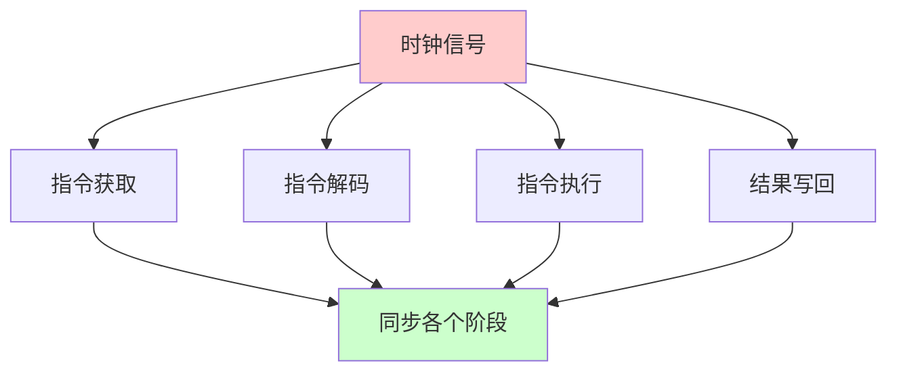

### 1. 同步操作

时钟信号确保 CPU 各个部件同步工作：
- 指令获取、解码、执行、写回等阶段按时钟节拍进行
- 避免不同部件之间的时序冲突

### 2. 性能基准

时钟频率是 CPU 性能的重要指标：
- 更高的时钟频率通常意味着更快的执行速度
- 但性能还受其他因素影响（缓存、指令集、架构等）

### 3. 功耗控制

现代 CPU 支持动态频率调整：
- **降频**：降低功耗，减少发热
- **升频**：提高性能（Turbo Boost）
- **节能模式**：空闲时降低频率

## CPU 频率管理

### 查看当前频率

```sh
# 查看所有 CPU 核心的频率
➜ cat /proc/cpuinfo | grep "cpu MHz"

# 使用 cpupower（需要安装）
➜ cpupower frequency-info

# 查看频率范围
➜ cat /sys/devices/system/cpu/cpu0/cpufreq/scaling_available_frequencies
```

### CPU 频率调节器（Governor）

Linux 支持多种频率调节策略：

| 调节器 | 说明 |
|--------|------|
| **performance** | 始终以最高频率运行 |
| **powersave** | 始终以最低频率运行 |
| **ondemand** | 根据负载动态调整（已废弃） |
| **conservative** | 保守的动态调整 |
| **schedutil** | 基于调度器的动态调整（推荐） |

### 设置频率调节器

```sh
# 查看当前调节器
➜ cat /sys/devices/system/cpu/cpu0/cpufreq/scaling_governor

# 设置调节器（需要 root）
➜ echo performance > /sys/devices/system/cpu/cpu0/cpufreq/scaling_governor

# 设置所有 CPU
➜ for cpu in /sys/devices/system/cpu/cpu*/cpufreq/scaling_governor; do
    echo performance | sudo tee $cpu
  done
```

### Turbo Boost / Turbo Core

现代 CPU 支持动态超频技术：

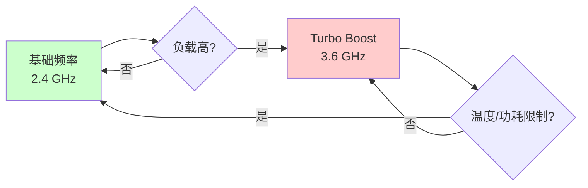

**特点：**
- 在温度、功耗允许的情况下自动超频
- 提高单线程性能
- 多核心负载时可能降频

## 时钟与性能的关系

### 性能公式

$$性能 = 时钟频率 \times IPC \times 核心数$$

其中：
- **IPC（Instructions Per Cycle）**：每个时钟周期执行的指令数
- **时钟频率**：CPU 的工作频率
- **核心数**：并行处理能力

### 性能优化方向

1. **提高时钟频率**：增加主频
2. **提高 IPC**：优化架构、指令集
3. **增加核心数**：并行处理

# CPU 多级缓存

## 为什么需要缓存

CPU 和内存之间存在巨大的速度差异：

| 组件 | 访问延迟 | 相对速度 |
|------|---------|---------|
| **CPU 寄存器** | 1 个时钟周期 | 1× |
| **L1 缓存** | 3-4 个时钟周期 | ~10× |
| **L2 缓存** | 10-20 个时钟周期 | ~100× |
| **L3 缓存** | 40-75 个时钟周期 | ~1000× |
| **内存（RAM）** | 100-300 个时钟周期 | ~10000× |
| **磁盘** | 数百万个时钟周期 | ~1000000× |

**缓存的作用：**
- 减少 CPU 等待内存的时间
- 提高数据访问速度
- 降低内存带宽压力

## 缓存层次结构

现代 CPU 通常采用三级缓存结构：

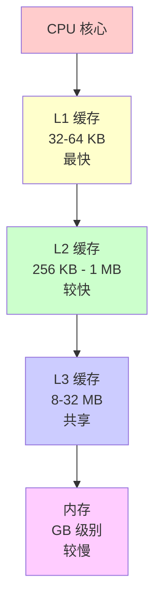

### L1 缓存（一级缓存）

**特点：**
- **容量**：通常 32-64 KB（指令缓存 + 数据缓存）
- **延迟**：3-4 个时钟周期
- **位置**：每个 CPU 核心独享
- **速度**：最快

**结构：**
- **L1i（Instruction Cache）**：指令缓存
- **L1d（Data Cache）**：数据缓存

### L2 缓存（二级缓存）

**特点：**
- **容量**：通常 256 KB - 1 MB
- **延迟**：10-20 个时钟周期
- **位置**：每个 CPU 核心独享
- **速度**：较快

### L3 缓存（三级缓存）

**特点：**
- **容量**：通常 8-32 MB（现代 CPU 可能更大）
- **延迟**：40-75 个时钟周期
- **位置**：多个 CPU 核心共享
- **速度**：较慢（但仍比内存快得多）

## 缓存的工作原理

### 缓存命中与未命中

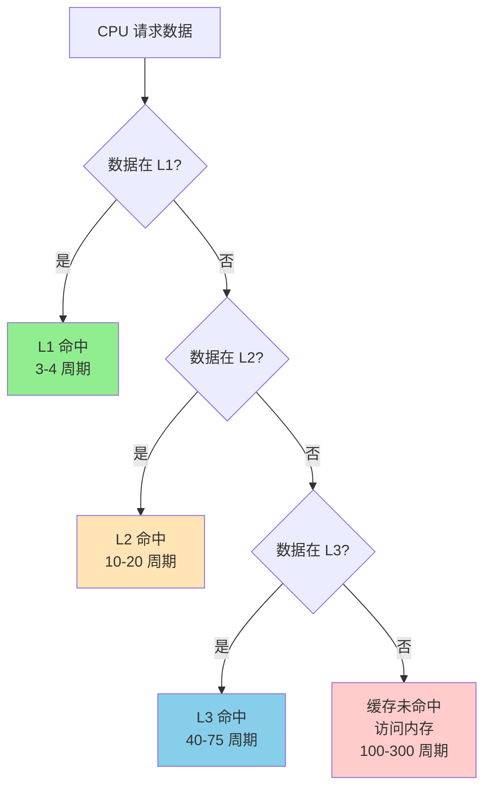

### 缓存替换策略

当缓存满时，需要替换旧数据，常用策略：

| 策略 | 说明 | 特点 |
|------|------|------|
| **LRU（Least Recently Used）** | 替换最近最少使用的数据 | 效果好，实现复杂 |
| **FIFO（First In First Out）** | 替换最早进入的数据 | 实现简单，效果一般 |
| **随机替换** | 随机选择替换 | 实现简单，效果差 |

### 缓存一致性（Cache Coherence）

在多核系统中，多个核心可能缓存同一数据，需要保证一致性：

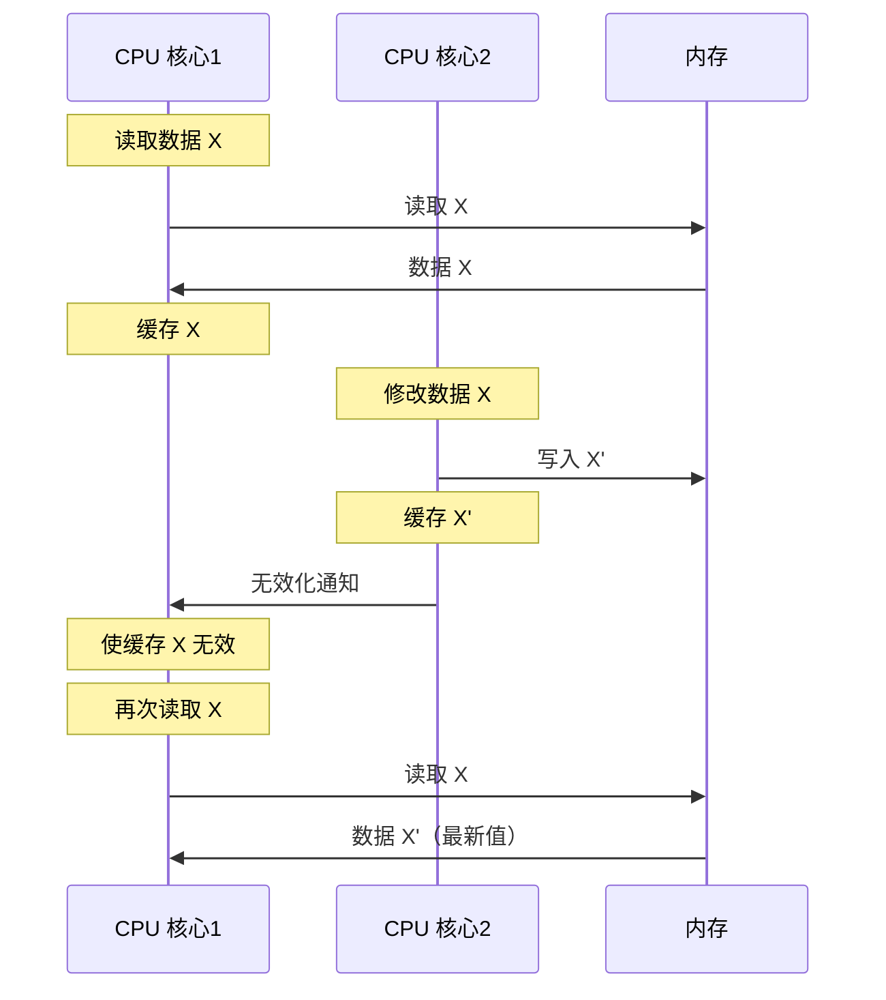

**一致性协议：**
- **MESI 协议**：Modified、Exclusive、Shared、Invalid
- **MOESI 协议**：在 MESI 基础上增加 Owned 状态

## 查看缓存信息

### Linux 系统

```sh
# 查看缓存信息
➜ lscpu | grep -i cache
L1d cache:                       32K
L1i cache:                       32K
L2 cache:                        256K
L3 cache:                        8192K

# 或查看 /proc/cpuinfo
➜ cat /proc/cpuinfo | grep cache

# 查看缓存层次结构
➜ lstopo --of png > cache.png
```

### 缓存统计

```sh
# 查看缓存命中率（需要 perf）
➜ perf stat -e cache-references,cache-misses ./program

# 输出示例：
# 1,234,567 cache-references
# 123,456 cache-misses
# 命中率 = (1,234,567 - 123,456) / 1,234,567 = 90%
```

## 缓存优化技巧

### 1. 数据局部性

**时间局部性**：最近访问的数据很可能再次访问
**空间局部性**：相邻的数据很可能被访问

```c
// 好的代码：顺序访问，空间局部性好
int sum = 0;
for (int i = 0; i < n; i++) {
    sum += array[i];  // 顺序访问
}

// 差的代码：随机访问，缓存命中率低
int sum = 0;
for (int i = 0; i < n; i++) {
    sum += array[random_index[i]];  // 随机访问
}
```

### 2. 数据结构对齐

```c
// 未对齐的结构（可能跨缓存行）
struct Bad {
    char a;      // 1 字节
    int b;       // 4 字节（可能跨缓存行）
    char c;      // 1 字节
};  // 总大小：6 字节（未对齐）

// 对齐的结构（缓存友好）
struct Good {
    int b;       // 4 字节
    char a;      // 1 字节
    char c;      // 1 字节
    // 编译器会自动填充对齐
};  // 总大小：8 字节（对齐）
```

### 3. 避免伪共享（False Sharing）

```c
// 伪共享：两个变量在同一缓存行
struct {
    int counter1;  // CPU 1 频繁修改
    int counter2;  // CPU 2 频繁修改
} counters;  // 两个变量在同一缓存行，导致缓存行无效化

// 解决：使用缓存行对齐
struct {
    int counter1;
    char padding[60];  // 填充到缓存行边界
    int counter2;
} counters;
```

# CPU Cache Line

## 什么是 Cache Line

Cache Line（缓存行）是缓存的最小单位，CPU 从内存读取数据时，不是只读取需要的数据，而是读取整个缓存行。

### Cache Line 的大小

现代 CPU 的 Cache Line 大小通常是 **64 字节**：

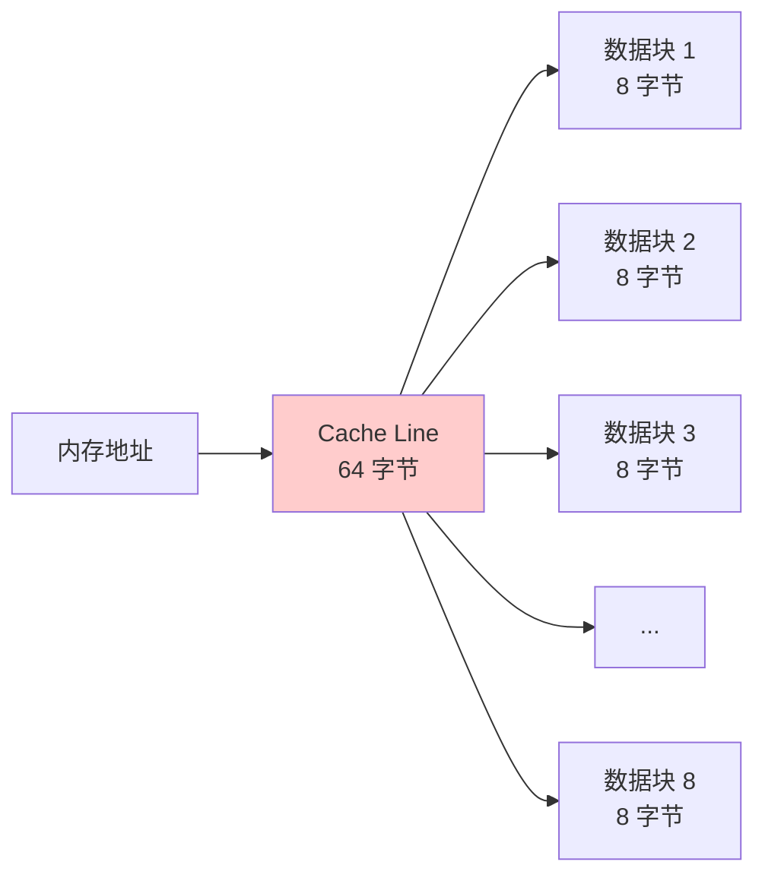

### Cache Line 对齐

数据在内存中的地址会影响缓存性能：

```c
// 未对齐：可能跨两个缓存行
char data[65];  // 65 字节，跨越两个 64 字节的缓存行

// 对齐：在一个缓存行内
char data[64];  // 64 字节，正好一个缓存行
```

## Cache Line 的工作原理

### 读取过程

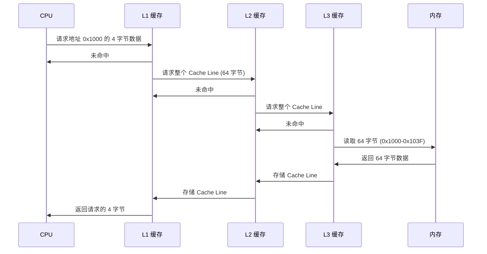

### 写入过程

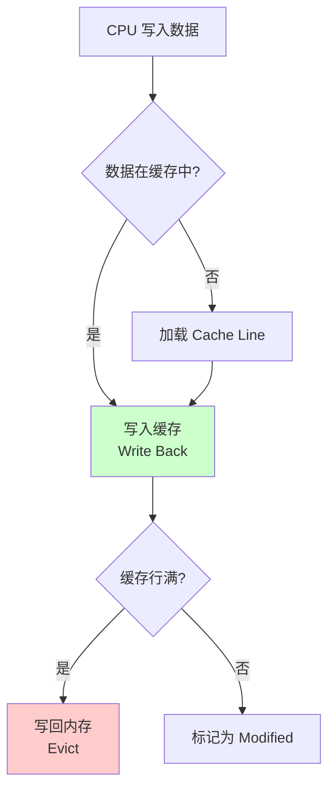

## Cache Line 的性能影响

### 1. 缓存行未命中

```c
// 示例：访问间隔大于缓存行大小
int array[1024 * 1024];  // 4MB 数组

// 每次访问间隔 64 字节（一个缓存行）
for (int i = 0; i < 1024 * 1024; i += 16) {
    sum += array[i];  // 每次访问都可能导致缓存未命中
}
```

### 2. 缓存行对齐优化

```c
// 结构体对齐到缓存行边界
struct alignas(64) CacheLineAligned {
    int data[16];  // 64 字节，正好一个缓存行
};

// 避免伪共享
struct {
    alignas(64) int counter1;  // 对齐到缓存行
    alignas(64) int counter2;  // 对齐到缓存行
} counters;
```

### 3. 缓存行预取（Prefetching）

现代 CPU 支持硬件预取：

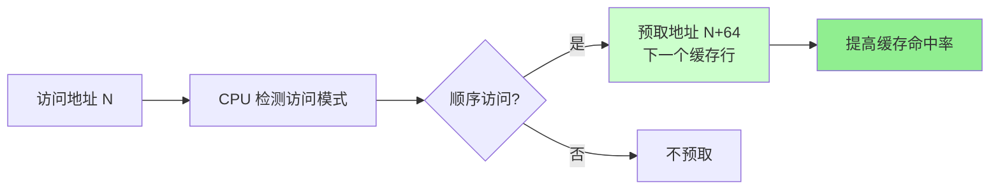

## 查看 Cache Line 大小

```sh
# 查看缓存行大小
➜ getconf LEVEL1_DCACHE_LINESIZE
64

# 或使用 sysfs
➜ cat /sys/devices/system/cpu/cpu0/cache/index0/coherency_line_size
64

# 使用 lscpu
➜ lscpu | grep "cache line"
Cache line size(s): 64
```

## Cache Line 优化实践

### 1. 数据结构设计

```c
// 优化前：可能跨缓存行
struct Unoptimized {
    char flag;      // 1 字节
    int data[100];  // 400 字节，跨多个缓存行
};

// 优化后：考虑缓存行大小
struct Optimized {
    int data[100];  // 400 字节
    char flag;      // 1 字节
    // 编译器会自动对齐
};
```

### 2. 循环优化

```c
// 优化前：步长过大
for (int i = 0; i < n; i += 100) {
    process(array[i]);
}

// 优化后：利用缓存局部性
for (int i = 0; i < n; i++) {
    process(array[i]);  // 顺序访问，缓存友好
}
```

### 3. 多线程优化

```c
// 避免伪共享
#define CACHE_LINE_SIZE 64

struct alignas(CACHE_LINE_SIZE) PerThreadData {
    int counter;
    char padding[CACHE_LINE_SIZE - sizeof(int)];
};

// 每个线程使用独立的数据结构
PerThreadData thread_data[MAX_THREADS];
```

# CPU 架构进阶

## 指令流水线（Pipeline）

现代 CPU 使用指令流水线技术，将指令执行分为多个阶段：


**流水线优势：**
- 提高指令吞吐量
- 充分利用 CPU 资源
- 提高整体性能

**流水线冒险：**
- **数据冒险**：数据依赖导致等待
- **控制冒险**：分支指令导致流水线清空
- **结构冒险**：资源冲突

## 分支预测（Branch Prediction）

分支预测是 CPU 的重要优化技术：

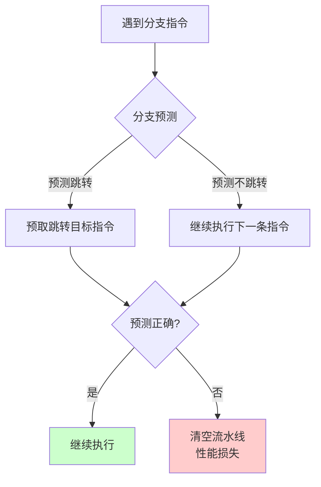

**分支预测策略：**
- **静态预测**：总是预测不跳转或总是跳转
- **动态预测**：基于历史记录预测
- **BTB（Branch Target Buffer）**：存储分支目标地址

## 乱序执行（Out-of-Order Execution）

现代 CPU 支持乱序执行，提高指令级并行度：

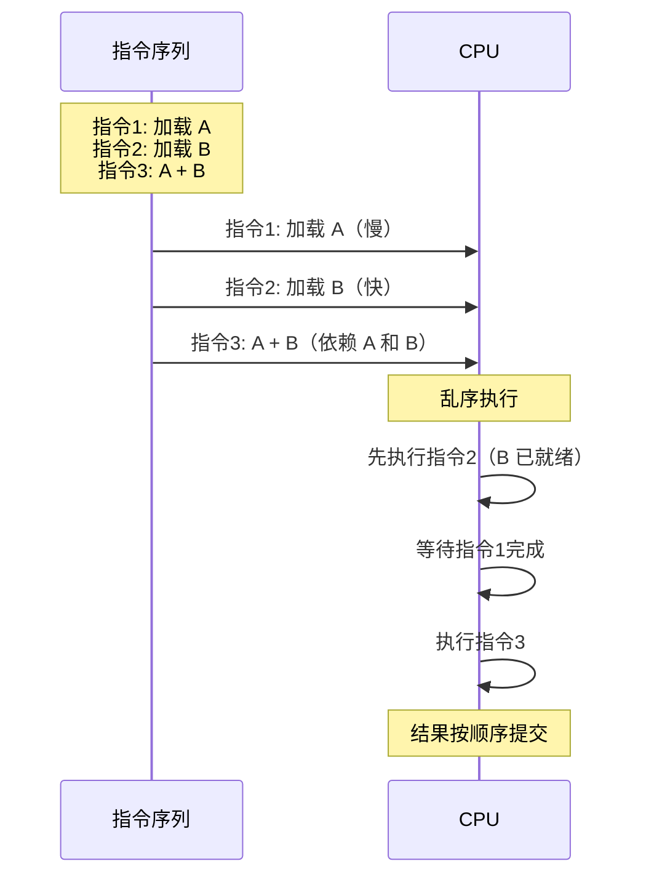

**乱序执行的优势：**
- 提高 CPU 利用率
- 隐藏内存访问延迟
- 提高整体性能

## 超线程（Hyper-Threading）

超线程技术让一个物理核心可以同时执行两个线程：

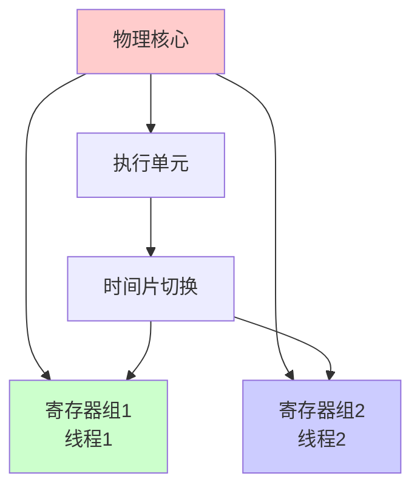

**超线程的特点：**
- 共享执行单元
- 独立的寄存器组
- 提高资源利用率
- 性能提升有限（通常 10-30%）

## NUMA（Non-Uniform Memory Access）

NUMA 是多处理器系统中的内存架构：

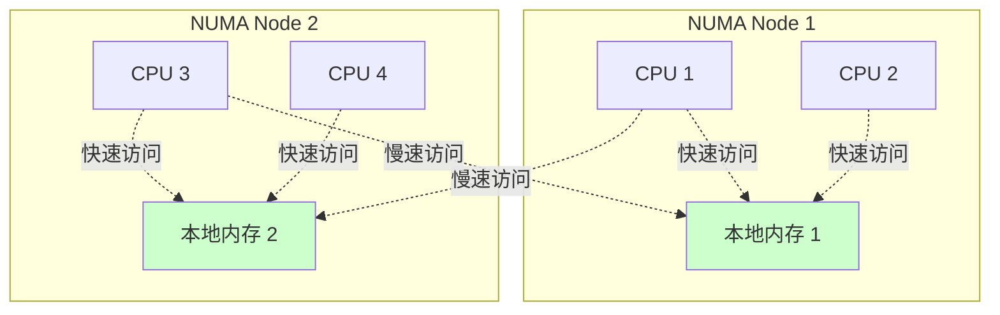

**NUMA 的特点：**
- 每个 CPU 有本地内存（访问快）
- 访问远程内存较慢
- 需要 NUMA 感知的调度

### 查看 NUMA 信息

```sh
# 查看 NUMA 拓扑
➜ numactl --hardware

# 查看 NUMA 节点
➜ ls /sys/devices/system/node/

# 查看 CPU 和内存的 NUMA 关系
➜ numastat
```

### NUMA 优化

```sh
# 绑定进程到特定 NUMA 节点
➜ numactl --membind=0 --cpunodebind=0 ./program

# 查看进程的 NUMA 信息
➜ numastat -p <pid>
```

# CPU 性能优化

## 性能分析工具

### perf

```sh
# 安装 perf
sudo apt-get install linux-perf

# 性能分析
➜ perf stat ./program

# CPU 性能计数器
➜ perf stat -e cycles,instructions,cache-references,cache-misses ./program

# 火焰图分析
➜ perf record -g ./program
➜ perf script | stackcollapse-perf.pl | flamegraph.pl > flame.svg
```

### top/htop

```sh
# 实时监控 CPU 使用
➜ top

# 更友好的界面
➜ htop

# 查看每个 CPU 核心的使用率
➜ htop
# 按 F2 -> Display options -> 启用 "Show CPU usage"
```

### vmstat

```sh
# 查看系统统计信息
➜ vmstat 1

# 输出说明：
# us: 用户空间 CPU 使用率
# sy: 内核空间 CPU 使用率
# id: 空闲 CPU 百分比
# wa: 等待 I/O 的 CPU 百分比
```

## 性能优化技巧

### 1. CPU 亲和性

```sh
# 绑定进程到特定 CPU
➜ taskset -c 0,1 ./program

# 查看进程的 CPU 亲和性
➜ taskset -p <pid>
```

### 2. 避免上下文切换

- 减少线程数量
- 使用线程池
- 避免频繁创建/销毁线程

### 3. 缓存优化

- 提高数据局部性
- 避免伪共享
- 合理使用数据结构对齐

### 4. 分支优化

```c
// 优化前：分支难以预测
if (random() % 2) {
    // 分支1
} else {
    // 分支2
}

// 优化后：使用位运算或查表
result = lookup_table[value];
```

## 常见性能问题

### 1. CPU 使用率过高

**诊断：**
```sh
# 查看 CPU 使用率
➜ top

# 查看进程的 CPU 使用
➜ ps aux --sort=-%cpu | head -10
```

**解决：**
- 优化算法
- 减少不必要的计算
- 使用缓存
- 并行化处理

### 2. 缓存未命中率高

**诊断：**
```sh
# 使用 perf 分析
➜ perf stat -e cache-references,cache-misses ./program
```

**解决：**
- 优化数据访问模式
- 提高数据局部性
- 调整数据结构

### 3. 上下文切换频繁

**诊断：**
```sh
# 查看上下文切换次数
➜ vmstat 1
# 查看 cs（context switch）列
```

**解决：**
- 减少线程数量
- 使用线程池
- 优化锁竞争

# 总结

CPU 是计算机系统的核心，理解 CPU 的工作原理对于：

1. **性能优化**：通过理解缓存、流水线等机制优化程序
2. **问题诊断**：分析 CPU 相关的性能问题
3. **系统调优**：合理配置 CPU 参数
4. **架构设计**：设计高性能的系统架构

都非常重要。

## 关键要点

- **CPU 时钟**：驱动 CPU 工作的节拍器
- **多级缓存**：L1、L2、L3 缓存层次结构
- **Cache Line**：缓存的最小单位（通常 64 字节）
- **流水线**：提高指令吞吐量
- **分支预测**：减少分支带来的性能损失
- **乱序执行**：提高指令级并行度
- **NUMA**：非统一内存访问架构

# 参考文献

* [CPU Cache - Wikipedia](https://en.wikipedia.org/wiki/CPU_cache)
* [Memory Hierarchy - Wikipedia](https://en.wikipedia.org/wiki/Memory_hierarchy)
* [What Every Programmer Should Know About Memory](https://people.freebsd.org/~lstewart/articles/cpumemory.pdf)
* [Intel 64 and IA-32 Architectures Optimization Reference Manual](https://www.intel.com/content/www/us/en/architecture-and-technology/64-ia-32-architectures-optimization-manual.html)
