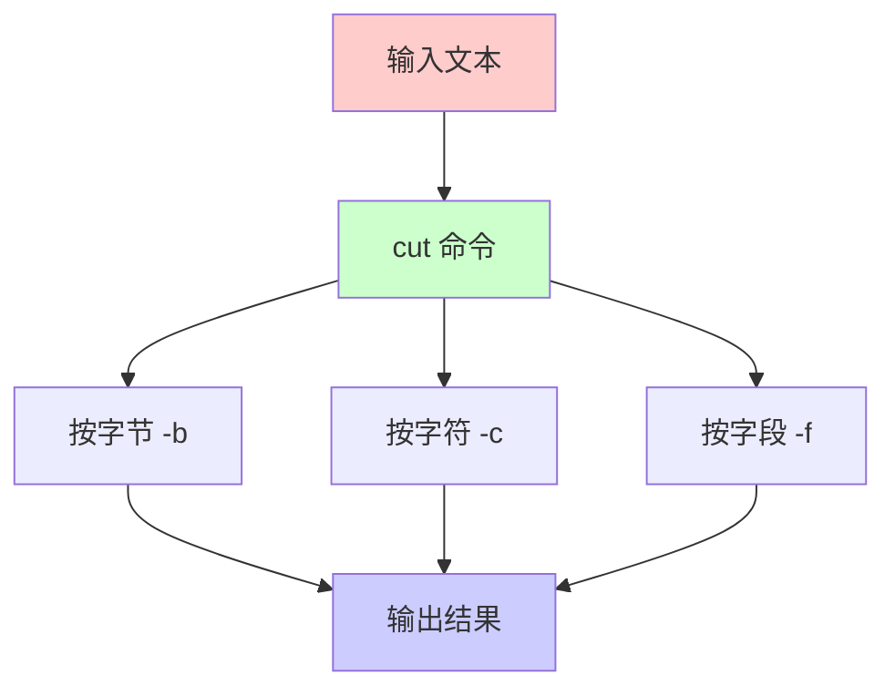

# 基本概念

在 Linux 中，`cut` 常用于修剪出指定位置的数据，`cut` 是按行为单位进行裁剪。它有三个裁剪模式：

1. **按字节裁剪**（-b）：按照字节位置裁剪
2. **按字符裁剪**（-c）：按照字符位置裁剪
3. **按字段裁剪**（-f）：按照分隔符分隔的字段裁剪



# 命令语法

## 基本语法

```bash
cut [选项]... [文件]...
```

## 完整帮助信息

```text
用法：cut [选项]... [文件]...
  -b, --bytes=列表		只选中指定的这些字节
  -c, --characters=列表	只选中指定的这些字符
  -d, --delimiter=分界符	使用指定分界符代替制表符作为区域分界
  -f, --fields=LIST       select only these fields;  also print any line
                            that contains no delimiter character, unless
                            the -s option is specified
  -n                      with -b: don't split multibyte characters
      --complement		补全选中的字节、字符或域
  -s, --only-delimited		不打印没有包含分界符的行
      --output-delimiter=字符串	使用指定的字符串作为输出分界符，默认采用输入
				的分界符
      --help		显示此帮助信息并退出
      --version		显示版本信息并退出

仅使用 -b, -c 或-f 中的一个。每一个列表都是专门为一个类别作出的，或者您可以用逗号隔
开要同时显示的不同类别。您的输入顺序将作为读取顺序，每个仅能输入一次。
每种参数格式表示范围如下：
    N	第N 个字节、字符或域
    N-	从第N 个开始到所在行结束的所有字符、字节或域
    N-M	从第N 个开始到第M 个之间(包括第M 个)的所有字符、字节或域
    -M	从第1 个开始到第M 个之间(包括第M 个)的所有字符、字节或域

当没有文件参数，或者文件不存在时，从标准输入读取
```

# 常用选项

## 核心选项

| 选项 | 长选项 | 说明 |
|------|--------|------|
| `-b` | `--bytes=列表` | 按字节位置裁剪 |
| `-c` | `--characters=列表` | 按字符位置裁剪 |
| `-f` | `--fields=列表` | 按字段位置裁剪 |
| `-d` | `--delimiter=分界符` | 指定字段分隔符（默认为制表符） |
| `-s` | `--only-delimited` | 只输出包含分隔符的行 |
| `--complement` | | 反向选择（输出未选中的部分） |
| `--output-delimiter=字符串` | | 指定输出分隔符 |
| `-n` | | 与 -b 一起使用，不分割多字节字符 |

## 范围表示

- `N`：第 N 个字节、字符或字段
- `N-`：从第 N 个开始到行尾
- `N-M`：从第 N 个到第 M 个（包含 M）
- `-M`：从第 1 个到第 M 个（包含 M）
- `N,M`：第 N 个和第 M 个（用逗号分隔多个位置）

# 使用示例

## 按字节裁剪（-b）

### 基本用法

```bash
# 提取第 1-3 个字节
echo "hello world" | cut -b 1-3
# 输出: hel

# 提取第 1 和第 5 个字节
echo "hello world" | cut -b 1,5
# 输出: ho

# 提取从第 5 个字节到行尾
echo "hello world" | cut -b 5-
# 输出: o world

# 提取前 5 个字节
echo "hello world" | cut -b -5
# 输出: hello
```

### 多字节字符处理

```bash
# 对于多字节字符（如中文），-b 可能截断字符
echo "你好:哈哈" | cut -b 1-3
# 输出: 你（只输出了第一个字符的部分字节）

# 使用 -n 选项避免分割多字节字符
echo "你好:哈哈" | cut -nb 1-3
# 输出: 你（完整字符）
```

## 按字符裁剪（-c）

### 基本用法

```bash
# 提取第 1-2 个字符
echo "你好:哈哈" | cut -c 1-2
# 输出: 你好

# 提取第 1 和第 3 个字符
echo "hello" | cut -c 1,3
# 输出: hl

# 提取从第 3 个字符到行尾
echo "hello world" | cut -c 3-
# 输出: llo world

# 提取前 5 个字符
echo "hello world" | cut -c -5
# 输出: hello
```

### 处理多字节字符

```bash
# -c 选项正确处理多字节字符
echo "你好世界" | cut -c 1-2
# 输出: 你好

echo "你好世界" | cut -c 3-4
# 输出: 世界
```

## 按字段裁剪（-f）

### 基本用法

```bash
# 使用冒号作为分隔符，提取第 1 个字段
echo "你好:哈哈:hello" | cut -d: -f 1
# 输出: 你好

# 提取第 1 和第 2 个字段
echo "你好:哈哈:hello" | cut -d: -f 1,2
# 输出: 你好:哈哈

# 提取第 1 到第 2 个字段
echo "你好:哈哈:hello" | cut -d: -f 1-2
# 输出: 你好:哈哈

# 提取从第 2 个字段到行尾
echo "你好:哈哈:hello" | cut -d: -f 2-
# 输出: 哈哈:hello

# 提取前 2 个字段
echo "你好:哈哈:hello" | cut -d: -f -2
# 输出: 你好:哈哈
```

### 使用不同分隔符

```bash
# 使用空格作为分隔符
echo "apple banana cherry" | cut -d' ' -f 1
# 输出: apple

# 使用逗号作为分隔符
echo "name,age,city" | cut -d',' -f 2
# 输出: age

# 使用制表符作为分隔符（默认）
echo -e "col1\tcol2\tcol3" | cut -f 1
# 输出: col1
```

### 只输出包含分隔符的行（-s）

```bash
# 创建测试文件
cat > test.txt << EOF
line1:field1:field2
line2
line3:field1:field2
EOF

# 默认输出所有行（没有分隔符的行会输出整行）
cut -d: -f 1 test.txt
# 输出:
# line1
# line2
# line3

# 使用 -s 只输出包含分隔符的行
cut -d: -f 1 -s test.txt
# 输出:
# line1
# line3
```

## 反向选择（--complement）

```bash
# 提取第 1 和第 4 个字节
echo "12 34 56 67" | cut -b 1,4
# 输出: 13

# 反向选择：提取除了第 1 和第 4 个字节外的所有字节
echo "12 34 56 67" | cut -b 1,4 --complement
# 输出: 2 4 56 67

# 反向选择：提取除了第 1-4 个字节外的所有字节
echo "12 34 56 67" | cut -b 1-4 --complement
# 输出: 4 56 67

# 反向选择字段
echo "a:b:c:d" | cut -d: -f 2 --complement
# 输出: a:c:d（除了第 2 个字段）
```

## 自定义输出分隔符（--output-delimiter）

```bash
# 默认使用输入分隔符
echo "你好:哈哈:hello" | cut -d: -f 1-2
# 输出: 你好:哈哈

# 使用自定义输出分隔符
echo "你好:哈哈:hello" | cut -d: -f 1-2 --output-delimiter='!'
# 输出: 你好!哈哈

# 使用空格作为输出分隔符
echo "a:b:c" | cut -d: -f 1,3 --output-delimiter=' '
# 输出: a c
```

# 实际应用场景

## 场景 1：处理 /etc/passwd 文件

```bash
# 提取用户名（第 1 个字段）
cut -d: -f 1 /etc/passwd

# 提取用户 ID（第 3 个字段）
cut -d: -f 3 /etc/passwd

# 提取用户名和用户 ID
cut -d: -f 1,3 /etc/passwd

# 提取用户主目录（第 6 个字段）
cut -d: -f 6 /etc/passwd
```

## 场景 2：处理 CSV 文件

```bash
# 创建 CSV 文件
cat > data.csv << EOF
name,age,city,email
Alice,25,Beijing,alice@example.com
Bob,30,Shanghai,bob@example.com
Charlie,28,Guangzhou,charlie@example.com
EOF

# 提取姓名和城市
cut -d',' -f 1,3 data.csv
# 输出:
# name,city
# Alice,Beijing
# Bob,Shanghai
# Charlie,Guangzhou

# 提取邮箱（第 4 个字段）
cut -d',' -f 4 data.csv
```

## 场景 3：处理日志文件

```bash
# 假设日志格式：2024-01-01 10:00:00 INFO message
# 提取时间部分（前 19 个字符）
cut -c 1-19 access.log

# 提取日志级别（假设在第 20-24 个字符）
cut -c 20-24 access.log
```

## 场景 4：处理系统命令输出

```bash
# 提取 IP 地址（ifconfig 输出）
ifconfig eth0 | grep "inet " | cut -d' ' -f 10

# 提取进程 ID（ps 输出）
ps aux | grep nginx | cut -d' ' -f 2

# 提取磁盘使用率（df 输出）
df -h | cut -d' ' -f 5
```

## 场景 5：处理环境变量

```bash
# 提取 PATH 中的第一个目录
echo $PATH | cut -d: -f 1

# 提取 PATH 中的最后一个目录
echo $PATH | cut -d: -f $(echo $PATH | tr ':' '\n' | wc -l)
```

## 场景 6：处理配置文件

```bash
# 提取配置文件中的键（假设格式：key=value）
grep -v '^#' config.conf | cut -d'=' -f 1

# 提取配置文件中的值
grep -v '^#' config.conf | cut -d'=' -f 2
```

# 与其他命令的配合

## 与 grep 配合

```bash
# 先过滤再提取
grep "ERROR" log.txt | cut -d' ' -f 1-2

# 提取包含特定模式的行中的字段
grep "user=" access.log | cut -d'=' -f 2
```

## 与 sort 配合

```bash
# 提取字段后排序
cut -d: -f 3 /etc/passwd | sort -n

# 按特定字段排序
cut -d',' -f 2 data.csv | sort -n
```

## 与 awk 对比

```bash
# 使用 cut 提取字段
echo "a:b:c" | cut -d: -f 2
# 输出: b

# 使用 awk 提取字段（功能更强大）
echo "a:b:c" | awk -F: '{print $2}'
# 输出: b

# cut 的优势：简单快速
# awk 的优势：支持复杂处理、计算、条件判断
```

## 与 sed 配合

```bash
# 先替换再提取
echo "name=Alice,age=25" | sed 's/,/:/g' | cut -d: -f 2
# 输出: age=25

# 提取后替换
cut -d: -f 1 /etc/passwd | sed 's/^/User: /'
```

## 管道组合

```bash
# 复杂的数据处理流程
cat log.txt | \
  grep "ERROR" | \
  cut -d' ' -f 1,2,5 | \
  sort | \
  uniq
```

# 注意事项

## 1. 字节 vs 字符

```bash
# 对于 ASCII 字符，字节和字符相同
echo "hello" | cut -b 1-3
# 输出: hel

echo "hello" | cut -c 1-3
# 输出: hel

# 对于多字节字符（如中文），字节和字符不同
echo "你好" | cut -b 1-3
# 输出: 你（可能不完整）

echo "你好" | cut -c 1-2
# 输出: 你好（完整字符）

# 建议：处理中文等多字节字符时使用 -c 选项
```

## 2. 分隔符处理

```bash
# 如果行中没有分隔符，-f 选项会输出整行
echo "no delimiter" | cut -d: -f 1
# 输出: no delimiter

# 使用 -s 选项只输出包含分隔符的行
echo -e "has:delimiter\nno delimiter" | cut -d: -f 1 -s
# 输出: has
```

## 3. 多个分隔符

```bash
# cut 不支持多个分隔符，只能使用一个
# 如果需要处理多个分隔符，考虑使用 awk 或 sed

# 使用 awk 处理多个分隔符
echo "a,b;c" | awk -F'[,;]' '{print $2}'
# 输出: b
```

## 4. 字段顺序

```bash
# 字段顺序按照指定顺序输出
echo "a:b:c:d" | cut -d: -f 3,1
# 输出: c:a（按照 3,1 的顺序）

# 不能自动排序，需要手动指定顺序
```

## 5. 空字段处理

```bash
# 如果字段为空，cut 会输出空字符串
echo "a::c" | cut -d: -f 2
# 输出: （空行）

# 连续分隔符被视为多个空字段
echo "a::c" | cut -d: -f 1,2,3
# 输出: a::c
```

# 最佳实践

## 1. 选择合适的选项

```bash
# ✅ 推荐：处理结构化数据使用 -f
cut -d',' -f 1,3 data.csv

# ✅ 推荐：处理固定位置使用 -c
cut -c 1-10 log.txt

# ❌ 不推荐：处理多字节字符使用 -b
echo "你好" | cut -b 1-2  # 可能截断字符

# ✅ 推荐：处理多字节字符使用 -c
echo "你好" | cut -c 1-2  # 正确处理
```

## 2. 处理 CSV 文件

```bash
# CSV 文件可能包含引号和转义字符，cut 无法处理
# 对于复杂 CSV，使用专门的工具

# 简单 CSV 可以使用 cut
cut -d',' -f 1,2 simple.csv

# 复杂 CSV 使用 csvkit 或 Python
csvcut -c 1,2 complex.csv
```

## 3. 性能考虑

```bash
# cut 是流式处理，适合大文件
# 对于大文件，cut 比 awk 更快

# ✅ 推荐：大文件使用 cut
cut -d: -f 1 large_file.txt

# ⚠️ 注意：复杂处理使用 awk
awk -F: '{if($3>1000) print $1}' large_file.txt
```

## 4. 错误处理

```bash
# 检查文件是否存在
if [ -f data.txt ]; then
    cut -d: -f 1 data.txt
else
    echo "File not found"
fi

# 处理空文件
if [ -s data.txt ]; then
    cut -d: -f 1 data.txt
else
    echo "File is empty"
fi
```

## 5. 与其他工具结合

```bash
# ✅ 推荐：简单提取使用 cut
cut -d: -f 1 /etc/passwd

# ✅ 推荐：复杂处理使用 awk
awk -F: '{if($3>1000) print $1":"$3}' /etc/passwd

# ✅ 推荐：模式匹配使用 grep + cut
grep "ERROR" log.txt | cut -d' ' -f 1-2
```

## 6. 实际应用示例

### 提取系统信息

```bash
# 提取所有用户的 UID
cut -d: -f 3 /etc/passwd | sort -n

# 提取所有组名
cut -d: -f 1 /etc/group

# 提取磁盘挂载点
df -h | tail -n +2 | cut -d' ' -f 6
```

### 处理日志

```bash
# 提取访问日志中的 IP 地址
cut -d' ' -f 1 access.log | sort | uniq -c | sort -rn

# 提取错误日志中的时间戳
grep "ERROR" error.log | cut -d' ' -f 1-2
```

### 数据处理

```bash
# 从 CSV 提取特定列
cut -d',' -f 1,3,5 data.csv > output.csv

# 提取文件名（去除路径）
echo "/path/to/file.txt" | cut -d'/' -f $(echo "/path/to/file.txt" | tr '/' '\n' | wc -l)
# 或使用 basename 命令
basename "/path/to/file.txt"
```

# 总结

`cut` 命令是 Linux 中一个简单而强大的文本处理工具：

## 核心特点

1. **简单高效**：语法简单，处理速度快
2. **按行处理**：逐行处理文本数据
3. **三种模式**：字节、字符、字段三种裁剪方式
4. **流式处理**：适合处理大文件

## 适用场景

- ✅ 提取结构化数据的特定字段
- ✅ 处理固定格式的文本
- ✅ 快速提取简单字段
- ✅ 与其他命令配合使用

## 不适用场景

- ❌ 复杂的文本处理（使用 awk）
- ❌ 需要条件判断（使用 awk）
- ❌ 需要计算（使用 awk）
- ❌ 多个分隔符（使用 awk 或 sed）

## 选择建议

- **简单字段提取**：使用 `cut`
- **复杂文本处理**：使用 `awk`
- **模式匹配和替换**：使用 `sed` 或 `grep`
- **多工具组合**：根据需求组合使用

掌握 `cut` 命令能够提高文本处理的效率，是 Linux 系统管理和数据处理的重要工具。

# 参考文献

- [GNU Coreutils - cut](https://www.gnu.org/software/coreutils/manual/html_node/cut-invocation.html)
- [Linux 命令手册](https://man7.org/linux/man-pages/man1/cut.1.html)
