# 什么是 epoll

epoll（event poll）是 Linux 内核 2.6+ 版本引入的一种高效的 I/O 事件通知机制，是 select 和 poll 的改进版本。它主要用于实现 I/O 多路复用，能够同时监控多个文件描述符，当其中任何一个文件描述符就绪时，通知应用程序进行相应的 I/O 操作。

## 核心概念

### I/O 多路复用

I/O 多路复用允许一个进程同时监控多个文件描述符，当某个文件描述符就绪（可读、可写或异常）时，通知进程进行相应的操作。

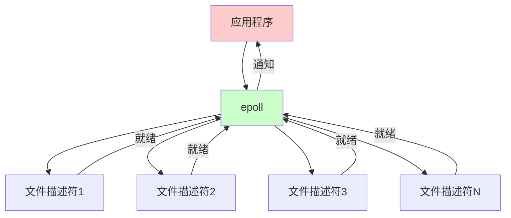

### epoll 的特点

1. **高效**：O(1) 时间复杂度，性能优于 select/poll
2. **无文件描述符数量限制**：可以监控大量文件描述符
3. **边缘触发和水平触发**：支持两种工作模式
4. **内核事件通知**：内核主动通知，无需轮询

## epoll 的工作原理

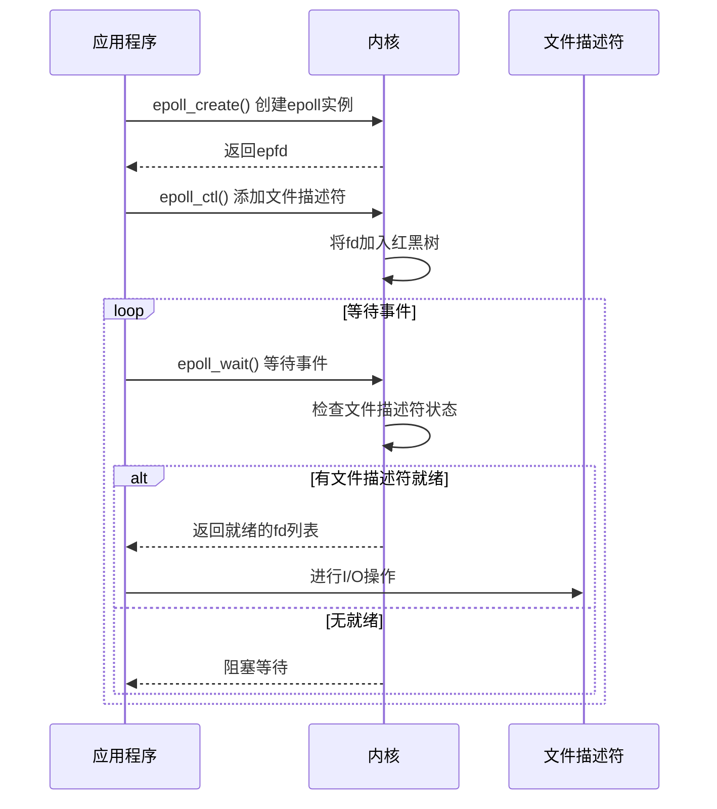

## epoll 的优势

1. **性能优势**：
   - select/poll：O(n) 时间复杂度，需要遍历所有文件描述符
   - epoll：O(1) 时间复杂度，只返回就绪的文件描述符

2. **扩展性优势**：
   - select：文件描述符数量限制（通常 1024）
   - poll：无硬性限制，但性能随数量下降
   - epoll：无限制，性能稳定

3. **内存优势**：
   - select/poll：每次调用都需要传递所有文件描述符
   - epoll：内核维护事件表，只需传递变化的文件描述符

# epoll 对比 poll 和 select

## 三种 I/O 多路复用机制对比

| 特性 | select | poll | epoll |
|------|--------|------|-------|
| **文件描述符数量限制** | 有（通常1024） | 无硬性限制 | 无限制 |
| **时间复杂度** | O(n) | O(n) | O(1) |
| **内核实现** | 轮询 | 轮询 | 事件通知 |
| **内存拷贝** | 每次调用都拷贝 | 每次调用都拷贝 | 内核维护，无需拷贝 |
| **触发模式** | 水平触发 | 水平触发 | 水平触发/边缘触发 |
| **跨平台** | 是 | 是 | Linux 特有 |
| **适用场景** | 少量文件描述符 | 中等数量 | 大量文件描述符 |

## 性能对比

### 时间复杂度

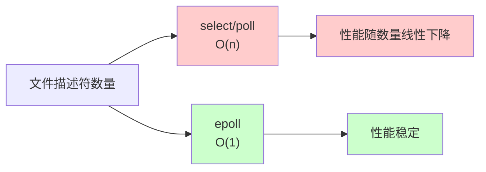

### 内存使用

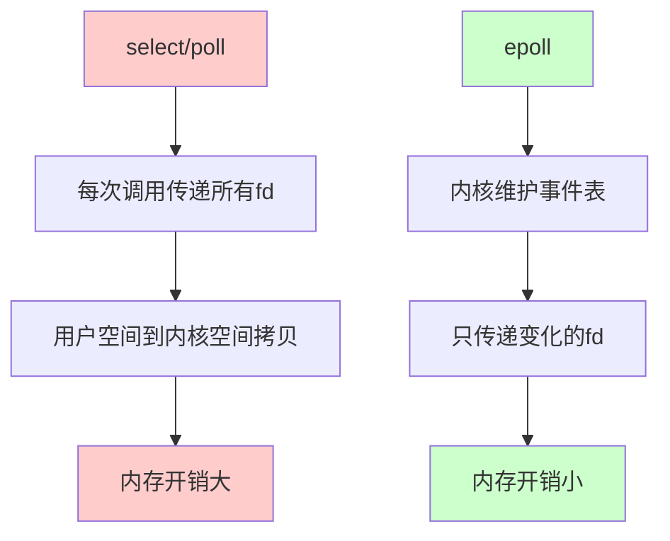

## 详细对比

### 1. 文件描述符数量

**select**：
```c
// select 使用 fd_set 位图，大小固定
fd_set readfds;
// 通常限制为 FD_SETSIZE (1024)
```

**poll**：
```c
// poll 使用数组，理论上无限制
struct pollfd fds[MAX_FDS];
// 但性能随数量下降
```

**epoll**：
```c
// epoll 使用红黑树，无限制
int epfd = epoll_create(1);
// 可以监控数万个文件描述符
```

### 2. 工作方式

**select/poll**：
- 每次调用都需要传递所有文件描述符
- 内核需要遍历所有文件描述符检查状态
- 返回所有就绪的文件描述符

**epoll**：
- 文件描述符注册到内核事件表（红黑树）
- 内核通过回调机制通知就绪事件
- 只返回就绪的文件描述符

### 3. 使用示例对比

#### select 示例

```c
#include <sys/select.h>
#include <stdio.h>

int main() {
    fd_set readfds;
    int max_fd = 0;
    int fds[10];
    
    // 初始化文件描述符
    for (int i = 0; i < 10; i++) {
        fds[i] = socket(...);
        FD_SET(fds[i], &readfds);
        if (fds[i] > max_fd) max_fd = fds[i];
    }
    
    while (1) {
        fd_set tmpfds = readfds;  // 需要复制
        
        // 每次都要传递所有文件描述符
        int ret = select(max_fd + 1, &tmpfds, NULL, NULL, NULL);
        
        if (ret > 0) {
            // 需要遍历所有文件描述符
            for (int i = 0; i < 10; i++) {
                if (FD_ISSET(fds[i], &tmpfds)) {
                    // 处理就绪的文件描述符
                }
            }
        }
    }
}
```

#### poll 示例

```c
#include <poll.h>
#include <stdio.h>

int main() {
    struct pollfd fds[10];
    
    // 初始化文件描述符
    for (int i = 0; i < 10; i++) {
        fds[i].fd = socket(...);
        fds[i].events = POLLIN;
    }
    
    while (1) {
        // 每次都要传递所有文件描述符
        int ret = poll(fds, 10, -1);
        
        if (ret > 0) {
            // 需要遍历所有文件描述符
            for (int i = 0; i < 10; i++) {
                if (fds[i].revents & POLLIN) {
                    // 处理就绪的文件描述符
                }
            }
        }
    }
}
```

#### epoll 示例

```c
#include <sys/epoll.h>
#include <stdio.h>

int main() {
    int epfd = epoll_create(1);
    struct epoll_event event;
    struct epoll_event events[10];
    
    // 添加文件描述符到 epoll
    for (int i = 0; i < 10; i++) {
        int fd = socket(...);
        event.events = EPOLLIN;
        event.data.fd = fd;
        epoll_ctl(epfd, EPOLL_CTL_ADD, fd, &event);
    }
    
    while (1) {
        // 只返回就绪的文件描述符
        int ret = epoll_wait(epfd, events, 10, -1);
        
        if (ret > 0) {
            // 只遍历就绪的文件描述符
            for (int i = 0; i < ret; i++) {
                // 处理 events[i].data.fd
            }
        }
    }
}
```

## 性能测试数据

| 文件描述符数量 | select (ms) | poll (ms) | epoll (ms) |
|---------------|-------------|-----------|------------|
| 100 | 0.1 | 0.1 | 0.05 |
| 1000 | 1.0 | 1.0 | 0.05 |
| 10000 | 10.0 | 10.0 | 0.05 |
| 100000 | 100.0 | 100.0 | 0.05 |

**结论**：epoll 的性能不随文件描述符数量增加而下降。

# 怎么操作 epoll

## epoll API

epoll 提供了三个主要的系统调用：

1. **epoll_create**：创建 epoll 实例
2. **epoll_ctl**：控制 epoll 实例（添加、删除、修改文件描述符）
3. **epoll_wait**：等待事件发生

## 1. epoll_create

创建 epoll 实例，返回文件描述符。

### 函数原型

```c
#include <sys/epoll.h>

int epoll_create(int size);
int epoll_create1(int flags);
```

### 参数说明

- **size**：提示内核要监听的文件描述符数量（Linux 2.6.8+ 后忽略，但必须 > 0）
- **flags**：控制 epoll 行为（EPOLL_CLOEXEC）

### 返回值

- 成功：返回 epoll 文件描述符（epfd）
- 失败：返回 -1，并设置 errno

### 示例

```c
int epfd = epoll_create(1);
if (epfd == -1) {
    perror("epoll_create");
    exit(1);
}

// 使用 epoll_create1（推荐）
int epfd = epoll_create1(EPOLL_CLOEXEC);
```

## 2. epoll_ctl

控制 epoll 实例，添加、删除或修改文件描述符。

### 函数原型

```c
int epoll_ctl(int epfd, int op, int fd, struct epoll_event *event);
```

### 参数说明

- **epfd**：epoll 文件描述符
- **op**：操作类型
  - `EPOLL_CTL_ADD`：添加文件描述符
  - `EPOLL_CTL_MOD`：修改文件描述符
  - `EPOLL_CTL_DEL`：删除文件描述符
- **fd**：要操作的文件描述符
- **event**：事件结构体指针

### epoll_event 结构

```c
struct epoll_event {
    uint32_t events;      // epoll 事件
    epoll_data_t data;    // 用户数据
};

typedef union epoll_data {
    void *ptr;
    int fd;
    uint32_t u32;
    uint64_t u64;
} epoll_data_t;
```

### 事件类型

| 事件 | 说明 |
|------|------|
| EPOLLIN | 文件描述符可读 |
| EPOLLOUT | 文件描述符可写 |
| EPOLLRDHUP | 对端关闭连接 |
| EPOLLPRI | 紧急数据可读 |
| EPOLLERR | 错误条件 |
| EPOLLHUP | 挂起 |
| EPOLLET | 边缘触发模式（默认水平触发） |
| EPOLLONESHOT | 一次性事件 |
| EPOLLWAKEUP | 防止系统休眠 |

### 示例

```c
struct epoll_event event;

// 添加文件描述符
event.events = EPOLLIN | EPOLLET;  // 可读 + 边缘触发
event.data.fd = sockfd;
if (epoll_ctl(epfd, EPOLL_CTL_ADD, sockfd, &event) == -1) {
    perror("epoll_ctl: EPOLL_CTL_ADD");
    exit(1);
}

// 修改文件描述符
event.events = EPOLLIN | EPOLLOUT;
epoll_ctl(epfd, EPOLL_CTL_MOD, sockfd, &event);

// 删除文件描述符
epoll_ctl(epfd, EPOLL_CTL_DEL, sockfd, NULL);
```

## 3. epoll_wait

等待事件发生，返回就绪的文件描述符。

### 函数原型

```c
int epoll_wait(int epfd, struct epoll_event *events, 
               int maxevents, int timeout);
```

### 参数说明

- **epfd**：epoll 文件描述符
- **events**：用于存储就绪事件的数组
- **maxevents**：events 数组的大小
- **timeout**：超时时间（毫秒）
  - `-1`：阻塞等待
  - `0`：非阻塞，立即返回
  - `> 0`：超时时间

### 返回值

- 成功：返回就绪的文件描述符数量
- 超时：返回 0
- 失败：返回 -1，并设置 errno

### 示例

```c
#define MAX_EVENTS 10
struct epoll_event events[MAX_EVENTS];

while (1) {
    // 等待事件，阻塞等待
    int nfds = epoll_wait(epfd, events, MAX_EVENTS, -1);
    
    if (nfds == -1) {
        perror("epoll_wait");
        break;
    }
    
    // 处理就绪的事件
    for (int i = 0; i < nfds; i++) {
        if (events[i].events & EPOLLIN) {
            // 可读事件
            int fd = events[i].data.fd;
            // 处理读操作
        }
        
        if (events[i].events & EPOLLOUT) {
            // 可写事件
            int fd = events[i].data.fd;
            // 处理写操作
        }
    }
}
```

## 完整示例：TCP 服务器

```c
#include <sys/socket.h>
#include <sys/epoll.h>
#include <netinet/in.h>
#include <arpa/inet.h>
#include <fcntl.h>
#include <unistd.h>
#include <stdio.h>
#include <stdlib.h>
#include <string.h>
#include <errno.h>

#define MAX_EVENTS 10
#define PORT 8080
#define BUFFER_SIZE 1024

// 设置文件描述符为非阻塞
int setnonblocking(int fd) {
    int flags = fcntl(fd, F_GETFL, 0);
    if (flags == -1) {
        return -1;
    }
    return fcntl(fd, F_SETFL, flags | O_NONBLOCK);
}

int main() {
    int listen_fd, epfd, nfds;
    struct sockaddr_in server_addr, client_addr;
    struct epoll_event event, events[MAX_EVENTS];
    socklen_t client_len = sizeof(client_addr);
    
    // 创建监听套接字
    listen_fd = socket(AF_INET, SOCK_STREAM, 0);
    if (listen_fd == -1) {
        perror("socket");
        exit(1);
    }
    
    // 设置地址重用
    int opt = 1;
    setsockopt(listen_fd, SOL_SOCKET, SO_REUSEADDR, &opt, sizeof(opt));
    
    // 绑定地址
    memset(&server_addr, 0, sizeof(server_addr));
    server_addr.sin_family = AF_INET;
    server_addr.sin_addr.s_addr = INADDR_ANY;
    server_addr.sin_port = htons(PORT);
    
    if (bind(listen_fd, (struct sockaddr *)&server_addr, 
             sizeof(server_addr)) == -1) {
        perror("bind");
        exit(1);
    }
    
    // 监听
    if (listen(listen_fd, 128) == -1) {
        perror("listen");
        exit(1);
    }
    
    // 创建 epoll 实例
    epfd = epoll_create1(0);
    if (epfd == -1) {
        perror("epoll_create1");
        exit(1);
    }
    
    // 将监听套接字添加到 epoll
    event.events = EPOLLIN;
    event.data.fd = listen_fd;
    if (epoll_ctl(epfd, EPOLL_CTL_ADD, listen_fd, &event) == -1) {
        perror("epoll_ctl: listen_fd");
        exit(1);
    }
    
    printf("Server listening on port %d\n", PORT);
    
    // 事件循环
    while (1) {
        nfds = epoll_wait(epfd, events, MAX_EVENTS, -1);
        if (nfds == -1) {
            perror("epoll_wait");
            break;
        }
        
        for (int i = 0; i < nfds; i++) {
            // 新连接
            if (events[i].data.fd == listen_fd) {
                int client_fd = accept(listen_fd, 
                                      (struct sockaddr *)&client_addr, 
                                      &client_len);
                if (client_fd == -1) {
                    perror("accept");
                    continue;
                }
                
                // 设置非阻塞
                setnonblocking(client_fd);
                
                // 添加到 epoll
                event.events = EPOLLIN | EPOLLET;  // 边缘触发
                event.data.fd = client_fd;
                if (epoll_ctl(epfd, EPOLL_CTL_ADD, client_fd, &event) == -1) {
                    perror("epoll_ctl: client_fd");
                    close(client_fd);
                }
                
                printf("New client connected: %s:%d\n",
                       inet_ntoa(client_addr.sin_addr),
                       ntohs(client_addr.sin_port));
            } else {
                // 客户端数据
                int client_fd = events[i].data.fd;
                char buffer[BUFFER_SIZE];
                
                if (events[i].events & EPOLLIN) {
                    ssize_t n = read(client_fd, buffer, BUFFER_SIZE);
                    if (n > 0) {
                        // 回显数据
                        write(client_fd, buffer, n);
                    } else if (n == 0) {
                        // 客户端关闭连接
                        printf("Client disconnected\n");
                        epoll_ctl(epfd, EPOLL_CTL_DEL, client_fd, NULL);
                        close(client_fd);
                    } else {
                        if (errno != EAGAIN && errno != EWOULDBLOCK) {
                            perror("read");
                            epoll_ctl(epfd, EPOLL_CTL_DEL, client_fd, NULL);
                            close(client_fd);
                        }
                    }
                }
            }
        }
    }
    
    close(listen_fd);
    close(epfd);
    return 0;
}
```

## 水平触发 vs 边缘触发

### 水平触发（LT - Level Triggered）

- **默认模式**：如果不指定 `EPOLLET`，默认是水平触发
- **特点**：只要文件描述符处于就绪状态，就会持续通知
- **优点**：编程简单，不容易遗漏事件
- **缺点**：可能重复通知，效率略低

```c
// 水平触发示例
event.events = EPOLLIN;  // 默认水平触发

// 如果数据没有读完，下次 epoll_wait 还会返回
while (1) {
    nfds = epoll_wait(epfd, events, MAX_EVENTS, -1);
    for (int i = 0; i < nfds; i++) {
        if (events[i].events & EPOLLIN) {
            // 如果只读了一部分数据，下次还会通知
            read(events[i].data.fd, buffer, BUFFER_SIZE);
        }
    }
}
```

### 边缘触发（ET - Edge Triggered）

- **需要指定**：必须设置 `EPOLLET` 标志
- **特点**：只在文件描述符状态变化时通知一次
- **优点**：效率高，减少重复通知
- **缺点**：必须一次性处理完所有数据，否则可能丢失事件

```c
// 边缘触发示例
event.events = EPOLLIN | EPOLLET;  // 边缘触发

// 必须一次性读完所有数据
while (1) {
    nfds = epoll_wait(epfd, events, MAX_EVENTS, -1);
    for (int i = 0; i < nfds; i++) {
        if (events[i].events & EPOLLIN) {
            // 必须循环读取，直到读完所有数据
            while (1) {
                ssize_t n = read(events[i].data.fd, buffer, BUFFER_SIZE);
                if (n < 0) {
                    if (errno == EAGAIN || errno == EWOULDBLOCK) {
                        break;  // 数据读完了
                    }
                    // 错误处理
                    break;
                } else if (n == 0) {
                    // 连接关闭
                    break;
                } else {
                    // 处理数据
                    // 继续读取
                }
            }
        }
    }
}
```

### 对比

| 特性 | 水平触发（LT） | 边缘触发（ET） |
|------|---------------|---------------|
| **通知频率** | 持续通知 | 状态变化时通知一次 |
| **数据读取** | 可以分多次读取 | 必须一次性读完 |
| **编程复杂度** | 简单 | 复杂 |
| **性能** | 略低 | 更高 |
| **适用场景** | 一般场景 | 高性能场景 |

# epoll 底层实现

## 内核数据结构

epoll 在内核中使用以下数据结构：

### 1. eventpoll 结构

```c
// 内核中的 epoll 实例结构
struct eventpoll {
    // 等待队列，用于 epoll_wait 阻塞
    wait_queue_head_t wq;
    
    // 就绪队列，存储就绪的事件
    struct list_head rdllist;
    
    // 红黑树根节点，存储所有监控的文件描述符
    struct rb_root rbr;
    
    // 自旋锁
    spinlock_t lock;
    
    // 互斥锁
    struct mutex mtx;
};
```

### 2. epitem 结构

```c
// epoll 项，代表一个文件描述符
struct epitem {
    // 红黑树节点
    struct rb_node rbn;
    
    // 链表节点（用于就绪队列）
    struct list_head rdllink;
    
    // 文件描述符
    struct epoll_filefd ffd;
    
    // 关联的 eventpoll
    struct eventpoll *ep;
    
    // 用户设置的事件
    struct epoll_event event;
    
    // 等待队列项
    wait_queue_entry_t wait;
};
```

## 内核实现流程

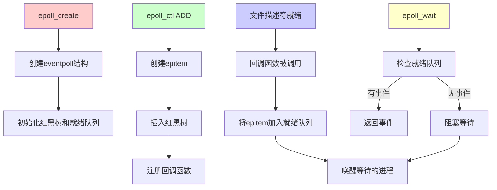

## 关键机制

### 1. 红黑树

epoll 使用红黑树存储所有监控的文件描述符：

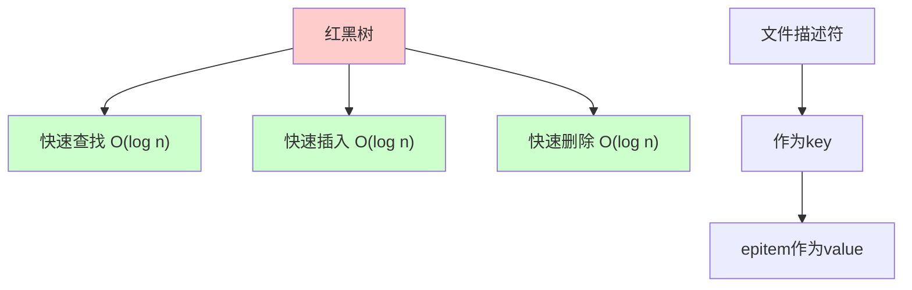

**优势**：
- 有序存储，便于查找
- 平衡树，性能稳定
- 支持大量文件描述符

### 2. 就绪队列

epoll 使用双向链表存储就绪的事件：

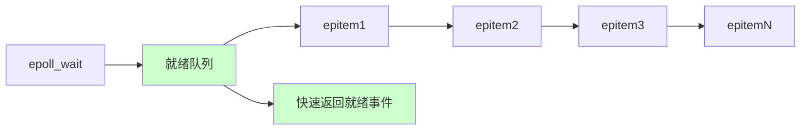

**优势**：
- O(1) 时间复杂度添加事件
- O(1) 时间复杂度获取事件
- 只返回就绪的事件

### 3. 回调机制

当文件描述符就绪时，内核通过回调函数通知 epoll：

```c
// 伪代码：回调函数
static void ep_poll_callback(wait_queue_entry_t *wait, 
                             unsigned mode, int sync, void *key) {
    struct epitem *epi = ep_item_from_wait(wait);
    struct eventpoll *ep = epi->ep;
    
    // 将 epitem 加入就绪队列
    if (!ep_is_linked(&epi->rdllink)) {
        list_add_tail(&epi->rdllink, &ep->rdllist);
    }
    
    // 唤醒等待的进程
    if (waitqueue_active(&ep->wq)) {
        wake_up(&ep->wq);
    }
}
```

### 4. 事件通知流程

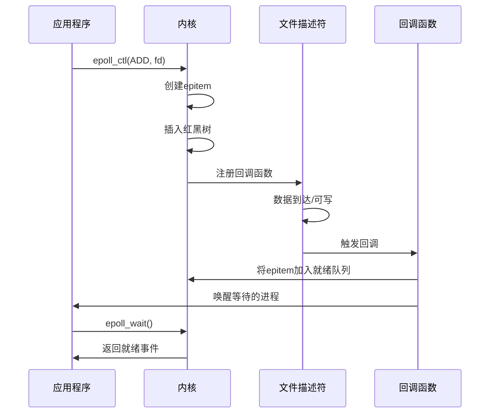

## 性能优化

### 1. 共享内存

epoll 使用 `mmap` 共享内存，减少用户空间和内核空间的数据拷贝：

```c
// 内核使用 mmap 将就绪事件映射到用户空间
// 减少数据拷贝开销
```

### 2. 事件合并

多个事件可能合并通知，减少系统调用次数。

### 3. 零拷贝

在某些情况下，epoll 支持零拷贝技术，进一步提高性能。

## 与 select/poll 的内核实现对比

### select/poll 实现

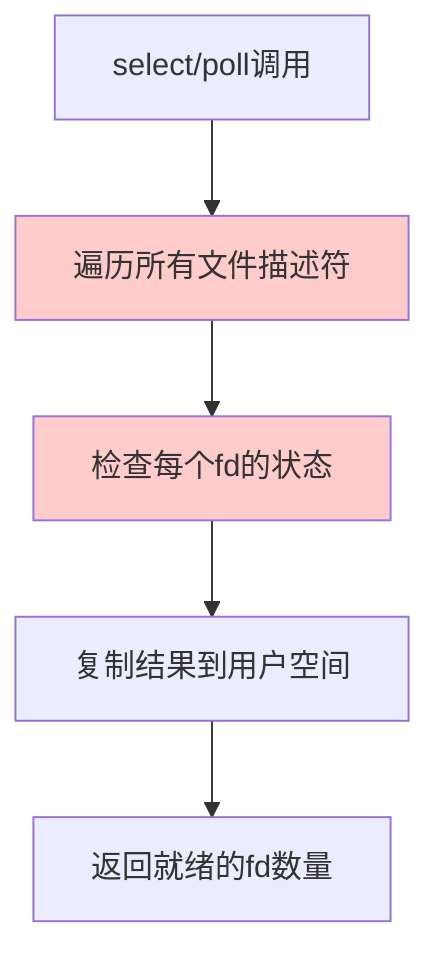

**问题**：
- 每次调用都要遍历所有文件描述符
- 需要将结果从内核拷贝到用户空间
- 时间复杂度 O(n)

### epoll 实现

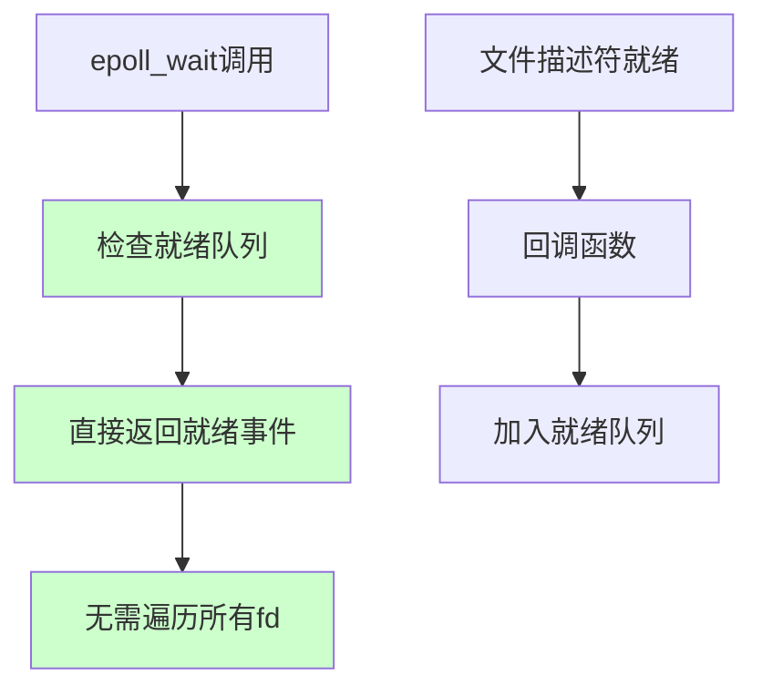

**优势**：
- 只检查就绪队列，无需遍历所有文件描述符
- 内核维护状态，减少数据拷贝
- 时间复杂度 O(1)

## 源码位置

epoll 的内核实现主要在以下文件中：

- `fs/eventpoll.c`：epoll 核心实现
- `include/linux/eventpoll.h`：epoll 数据结构定义
- `include/uapi/linux/eventpoll.h`：用户空间 API 定义

## 关键函数

1. **epoll_create**：`SYSCALL_DEFINE1(epoll_create, int, size)`
2. **epoll_ctl**：`SYSCALL_DEFINE4(epoll_ctl, int, epfd, int, op, int, fd, struct epoll_event __user *, event)`
3. **epoll_wait**：`SYSCALL_DEFINE4(epoll_wait, int, epfd, struct epoll_event __user *, events, int, maxevents, int, timeout)`

# TCP 零窗口处理

## 什么是 TCP 零窗口

TCP 零窗口（Zero Window）是 TCP 流控机制的一部分。当接收方的接收缓冲区满时，会向发送方发送窗口大小为 0 的 ACK，告诉发送方暂停发送数据。当接收方缓冲区有空间时，会发送窗口更新（Window Update）通知，告诉发送方可以继续发送。

## 零窗口场景

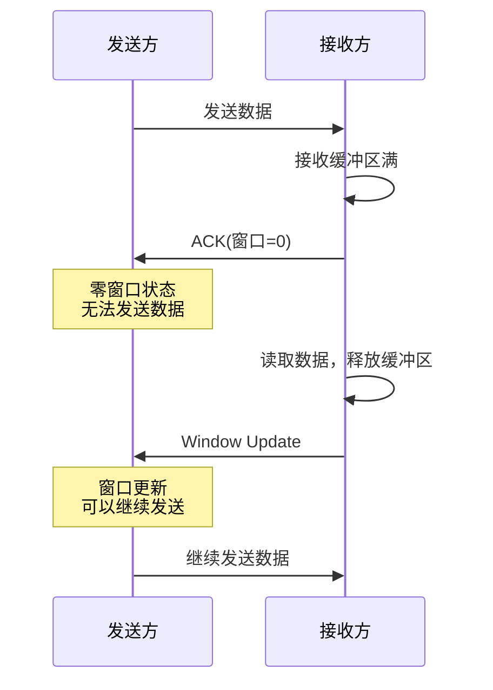

## epoll 中的零窗口处理

### 问题场景

当发送数据时遇到零窗口，`write()` 或 `send()` 会阻塞或返回 `EAGAIN`（非阻塞模式）。需要等待窗口更新后才能继续发送。

### 解决方案：监听 EPOLLOUT 事件

当遇到零窗口时，应该监听 `EPOLLOUT` 事件。当接收方窗口更新时，`EPOLLOUT` 事件会触发，表示可以继续发送数据。

## 实现方法

### 方法 1: 动态添加/删除 EPOLLOUT

```c
#include <sys/epoll.h>
#include <sys/socket.h>
#include <errno.h>
#include <unistd.h>

#define BUFFER_SIZE 4096

// 发送数据的函数
int send_data(int epfd, int sockfd, const char *data, size_t len) {
    size_t total_sent = 0;
    int need_wait_write = 0;  // 是否需要等待可写事件
    
    while (total_sent < len) {
        ssize_t n = send(sockfd, data + total_sent, 
                        len - total_sent, MSG_NOSIGNAL);
        
        if (n > 0) {
            total_sent += n;
            need_wait_write = 0;  // 成功发送，不需要等待
        } else if (n == -1) {
            if (errno == EAGAIN || errno == EWOULDBLOCK) {
                // 发送缓冲区满或零窗口
                need_wait_write = 1;
                break;
            } else if (errno == EPIPE) {
                // 连接已关闭
                return -1;
            } else {
                // 其他错误
                perror("send");
                return -1;
            }
        }
    }
    
    // 如果还有数据未发送，需要监听 EPOLLOUT
    if (need_wait_write || total_sent < len) {
        struct epoll_event event;
        event.events = EPOLLIN | EPOLLOUT;  // 同时监听读写
        event.data.fd = sockfd;
        
        if (epoll_ctl(epfd, EPOLL_CTL_MOD, sockfd, &event) == -1) {
            perror("epoll_ctl: EPOLL_CTL_MOD");
            return -1;
        }
    }
    
    return total_sent;
}

// 主事件循环
void handle_epollout(int epfd, int sockfd) {
    // 当 EPOLLOUT 触发时，继续发送剩余数据
    // 这里需要保存待发送的数据（可以使用连接上下文）
    
    // 尝试发送剩余数据
    // send_remaining_data(sockfd);
    
    // 如果数据发送完成，移除 EPOLLOUT 监听
    struct epoll_event event;
    event.events = EPOLLIN;  // 只监听读事件
    event.data.fd = sockfd;
    epoll_ctl(epfd, EPOLL_CTL_MOD, sockfd, &event);
}
```

### 方法 2: 使用连接上下文管理

```c
// 连接上下文结构
typedef struct {
    int fd;
    char *send_buffer;      // 待发送的数据
    size_t send_len;        // 待发送的数据长度
    size_t send_offset;     // 已发送的偏移量
    int need_write;         // 是否需要监听写事件
} connection_t;

// 发送数据（带上下文）
int send_data_with_context(connection_t *conn, const char *data, size_t len) {
    // 如果之前有未发送完的数据，追加到缓冲区
    if (conn->send_offset < conn->send_len) {
        // 重新分配缓冲区，追加新数据
        size_t new_len = conn->send_len - conn->send_offset + len;
        char *new_buffer = realloc(conn->send_buffer, new_len);
        if (!new_buffer) {
            return -1;
        }
        
        memcpy(new_buffer, conn->send_buffer + conn->send_offset, 
               conn->send_len - conn->send_offset);
        memcpy(new_buffer + (conn->send_len - conn->send_offset), data, len);
        
        free(conn->send_buffer);
        conn->send_buffer = new_buffer;
        conn->send_len = new_len;
        conn->send_offset = 0;
    } else {
        // 新的数据
        conn->send_buffer = malloc(len);
        if (!conn->send_buffer) {
            return -1;
        }
        memcpy(conn->send_buffer, data, len);
        conn->send_len = len;
        conn->send_offset = 0;
    }
    
    // 尝试发送
    return try_send(conn);
}

// 尝试发送数据
int try_send(connection_t *conn) {
    while (conn->send_offset < conn->send_len) {
        ssize_t n = send(conn->fd, 
                        conn->send_buffer + conn->send_offset,
                        conn->send_len - conn->send_offset,
                        MSG_NOSIGNAL);
        
        if (n > 0) {
            conn->send_offset += n;
        } else if (n == -1) {
            if (errno == EAGAIN || errno == EWOULDBLOCK) {
                // 发送缓冲区满或零窗口，需要等待
                conn->need_write = 1;
                return 0;  // 部分发送成功
            } else {
                // 其他错误
                return -1;
            }
        }
    }
    
    // 全部发送完成
    conn->need_write = 0;
    free(conn->send_buffer);
    conn->send_buffer = NULL;
    conn->send_len = 0;
    conn->send_offset = 0;
    return 1;  // 全部发送成功
}

// 处理 EPOLLOUT 事件
void handle_write_event(int epfd, connection_t *conn) {
    // 继续发送剩余数据
    int ret = try_send(conn);
    
    if (ret == 1) {
        // 全部发送完成，移除 EPOLLOUT 监听
        struct epoll_event event;
        event.events = EPOLLIN;
        event.data.fd = conn->fd;
        epoll_ctl(epfd, EPOLL_CTL_MOD, conn->fd, &event);
        conn->need_write = 0;
    } else if (ret == 0) {
        // 还有数据未发送，保持 EPOLLOUT 监听
        // 已经在 try_send 中设置了 need_write
    } else {
        // 发送失败，关闭连接
        close_connection(epfd, conn);
    }
}
```

### 方法 3: 完整的服务器示例

```c
#include <sys/epoll.h>
#include <sys/socket.h>
#include <netinet/in.h>
#include <arpa/inet.h>
#include <fcntl.h>
#include <unistd.h>
#include <stdio.h>
#include <stdlib.h>
#include <string.h>
#include <errno.h>

#define MAX_EVENTS 64
#define BUFFER_SIZE 4096

// 连接状态
typedef struct {
    int fd;
    char read_buffer[BUFFER_SIZE];
    char send_buffer[BUFFER_SIZE];
    size_t send_len;
    size_t send_offset;
    int need_write;
} connection_state_t;

// 全局连接表（实际应该用哈希表等）
connection_state_t connections[1000];

// 设置非阻塞
int setnonblocking(int fd) {
    int flags = fcntl(fd, F_GETFL, 0);
    return fcntl(fd, F_SETFL, flags | O_NONBLOCK);
}

// 尝试发送数据
int try_send_data(connection_state_t *conn) {
    while (conn->send_offset < conn->send_len) {
        ssize_t n = send(conn->fd,
                        conn->send_buffer + conn->send_offset,
                        conn->send_len - conn->send_offset,
                        MSG_NOSIGNAL);
        
        if (n > 0) {
            conn->send_offset += n;
        } else if (n == -1) {
            if (errno == EAGAIN || errno == EWOULDBLOCK) {
                // 零窗口或发送缓冲区满
                conn->need_write = 1;
                return 0;  // 需要等待
            } else {
                // 其他错误
                return -1;
            }
        }
    }
    
    // 全部发送完成
    conn->need_write = 0;
    conn->send_len = 0;
    conn->send_offset = 0;
    return 1;
}

// 更新 epoll 事件
void update_epoll_events(int epfd, connection_state_t *conn) {
    struct epoll_event event;
    uint32_t events = EPOLLIN;
    
    // 如果需要发送数据，添加 EPOLLOUT
    if (conn->need_write || conn->send_offset < conn->send_len) {
        events |= EPOLLOUT;
    }
    
    event.events = events;
    event.data.fd = conn->fd;
    epoll_ctl(epfd, EPOLL_CTL_MOD, conn->fd, &event);
}

int main() {
    int listen_fd, epfd, nfds;
    struct sockaddr_in server_addr;
    struct epoll_event event, events[MAX_EVENTS];
    
    // 创建监听套接字
    listen_fd = socket(AF_INET, SOCK_STREAM, 0);
    setnonblocking(listen_fd);
    
    // 绑定和监听
    memset(&server_addr, 0, sizeof(server_addr));
    server_addr.sin_family = AF_INET;
    server_addr.sin_addr.s_addr = INADDR_ANY;
    server_addr.sin_port = htons(8080);
    
    bind(listen_fd, (struct sockaddr *)&server_addr, sizeof(server_addr));
    listen(listen_fd, 128);
    
    // 创建 epoll
    epfd = epoll_create1(0);
    
    // 添加监听套接字
    event.events = EPOLLIN;
    event.data.fd = listen_fd;
    epoll_ctl(epfd, EPOLL_CTL_ADD, listen_fd, &event);
    
    printf("Server listening on port 8080\n");
    
    while (1) {
        nfds = epoll_wait(epfd, events, MAX_EVENTS, -1);
        
        for (int i = 0; i < nfds; i++) {
            int fd = events[i].data.fd;
            
            // 新连接
            if (fd == listen_fd) {
                struct sockaddr_in client_addr;
                socklen_t len = sizeof(client_addr);
                int client_fd = accept(listen_fd, 
                                      (struct sockaddr *)&client_addr, &len);
                
                if (client_fd >= 0) {
                    setnonblocking(client_fd);
                    
                    // 初始化连接状态
                    connection_state_t *conn = &connections[client_fd];
                    memset(conn, 0, sizeof(connection_state_t));
                    conn->fd = client_fd;
                    
                    // 添加到 epoll（只监听读）
                    event.events = EPOLLIN;
                    event.data.fd = client_fd;
                    epoll_ctl(epfd, EPOLL_CTL_ADD, client_fd, &event);
                    
                    printf("New client: %d\n", client_fd);
                }
            } else {
                connection_state_t *conn = &connections[fd];
                
                // 可读事件
                if (events[i].events & EPOLLIN) {
                    ssize_t n = read(fd, conn->read_buffer, BUFFER_SIZE);
                    
                    if (n > 0) {
                        // 收到数据，准备回显
                        memcpy(conn->send_buffer, conn->read_buffer, n);
                        conn->send_len = n;
                        conn->send_offset = 0;
                        
                        // 尝试发送
                        int ret = try_send_data(conn);
                        
                        // 更新 epoll 事件
                        update_epoll_events(epfd, conn);
                    } else if (n == 0) {
                        // 连接关闭
                        printf("Client %d disconnected\n", fd);
                        epoll_ctl(epfd, EPOLL_CTL_DEL, fd, NULL);
                        close(fd);
                    } else {
                        if (errno != EAGAIN && errno != EWOULDBLOCK) {
                            perror("read");
                            epoll_ctl(epfd, EPOLL_CTL_DEL, fd, NULL);
                            close(fd);
                        }
                    }
                }
                
                // 可写事件（零窗口恢复）
                if (events[i].events & EPOLLOUT) {
                    // 继续发送剩余数据
                    int ret = try_send_data(conn);
                    
                    if (ret == 1) {
                        // 全部发送完成，移除 EPOLLOUT
                        update_epoll_events(epfd, conn);
                    } else if (ret == -1) {
                        // 发送失败，关闭连接
                        printf("Send error, closing connection %d\n", fd);
                        epoll_ctl(epfd, EPOLL_CTL_DEL, fd, NULL);
                        close(fd);
                    }
                    // ret == 0 表示还有数据未发送，保持 EPOLLOUT
                }
            }
        }
    }
    
    close(listen_fd);
    close(epfd);
    return 0;
}
```

## 零窗口处理流程

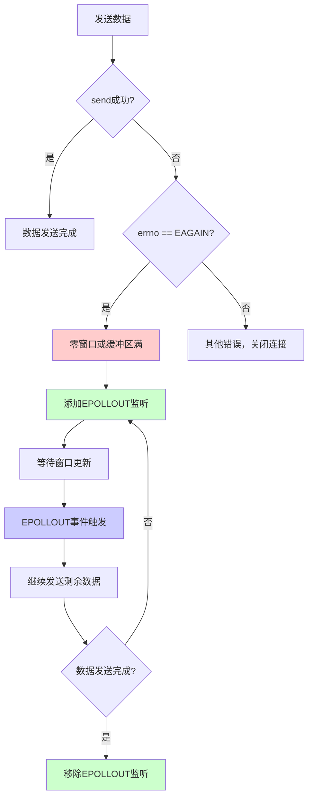

## 关键要点

### 1. 何时添加 EPOLLOUT

- **发送数据时遇到 EAGAIN**：表示发送缓冲区满或零窗口
- **有数据待发送**：需要等待可写事件

### 2. 何时移除 EPOLLOUT

- **数据全部发送完成**：不再需要监听写事件
- **避免不必要的触发**：EPOLLOUT 在可写时会持续触发（水平触发）

### 3. 边缘触发模式下的处理

```c
// 边缘触发模式下，EPOLLOUT 只在状态变化时触发一次
event.events = EPOLLIN | EPOLLOUT | EPOLLET;

// 必须一次性发送完所有数据
while (conn->send_offset < conn->send_len) {
    ssize_t n = send(conn->fd, ...);
    if (n > 0) {
        conn->send_offset += n;
    } else if (errno == EAGAIN) {
        // 需要重新添加 EPOLLOUT 监听
        update_epoll_events(epfd, conn);
        break;
    }
}
```

### 4. 水平触发模式下的处理

```c
// 水平触发模式下，EPOLLOUT 会持续触发
// 需要及时移除，避免 CPU 空转
if (events[i].events & EPOLLOUT) {
    int ret = try_send_data(conn);
    if (ret == 1) {
        // 发送完成，立即移除 EPOLLOUT
        update_epoll_events(epfd, conn);
    }
}
```

## 注意事项

### 1. 避免 EPOLLOUT 空转

在水平触发模式下，如果一直保持 `EPOLLOUT` 监听，当套接字可写时会持续触发事件，导致 CPU 空转。应该在数据发送完成后立即移除 `EPOLLOUT` 监听。

### 2. 正确处理部分发送

当 `send()` 返回的值小于请求发送的字节数时，需要继续发送剩余数据。

### 3. 错误处理

- **EPIPE**：对端关闭连接
- **ECONNRESET**：连接被重置
- **EAGAIN/EWOULDBLOCK**：零窗口或缓冲区满（正常情况）

### 4. 性能优化

- 使用边缘触发模式减少事件触发次数
- 批量发送数据，减少系统调用
- 合理设置发送缓冲区大小

## 最佳实践总结

1. **按需添加 EPOLLOUT**：只在需要时添加，发送完成后立即移除
2. **保存待发送数据**：使用连接上下文保存未发送完的数据
3. **正确处理部分发送**：循环发送直到全部完成或遇到 EAGAIN
4. **及时移除监听**：避免不必要的 EPOLLOUT 事件触发
5. **错误处理**：区分正常阻塞（EAGAIN）和错误情况

# 最佳实践

## 1. 使用边缘触发模式

对于高性能场景，使用边缘触发模式：

```c
event.events = EPOLLIN | EPOLLET;
```

**注意**：必须一次性处理完所有数据。

## 2. 设置非阻塞 I/O

使用边缘触发时，必须设置文件描述符为非阻塞：

```c
int flags = fcntl(fd, F_GETFL, 0);
fcntl(fd, F_SETFL, flags | O_NONBLOCK);
```

## 3. 合理设置 maxevents

`epoll_wait` 的 `maxevents` 参数应该根据实际情况设置：

```c
// 不要设置太大，避免内存浪费
// 不要设置太小，避免多次调用
#define MAX_EVENTS 64
```

## 4. 错误处理

正确处理各种错误情况：

```c
int nfds = epoll_wait(epfd, events, MAX_EVENTS, -1);
if (nfds == -1) {
    if (errno == EINTR) {
        // 被信号中断，继续等待
        continue;
    } else {
        // 其他错误
        perror("epoll_wait");
        break;
    }
}
```

## 5. 资源清理

及时清理不再使用的文件描述符：

```c
// 从 epoll 中删除
epoll_ctl(epfd, EPOLL_CTL_DEL, fd, NULL);

// 关闭文件描述符
close(fd);
```

# 总结

epoll 是 Linux 下高效的 I/O 多路复用机制：

## 核心特点

- **高性能**：O(1) 时间复杂度，性能不随文件描述符数量下降
- **无限制**：可以监控大量文件描述符
- **事件驱动**：内核主动通知，无需轮询
- **灵活**：支持水平触发和边缘触发两种模式

## 适用场景

- **高并发服务器**：Web 服务器、游戏服务器
- **网络编程**：需要同时处理大量连接
- **实时系统**：需要快速响应 I/O 事件

## 与 select/poll 对比

- **性能更好**：O(1) vs O(n)
- **无数量限制**：vs select 的 1024 限制
- **更高效**：事件驱动 vs 轮询

理解 epoll 的工作原理有助于：
- 编写高性能的网络程序
- 优化 I/O 密集型应用
- 选择合适的 I/O 多路复用机制
- 深入理解 Linux 内核机制
