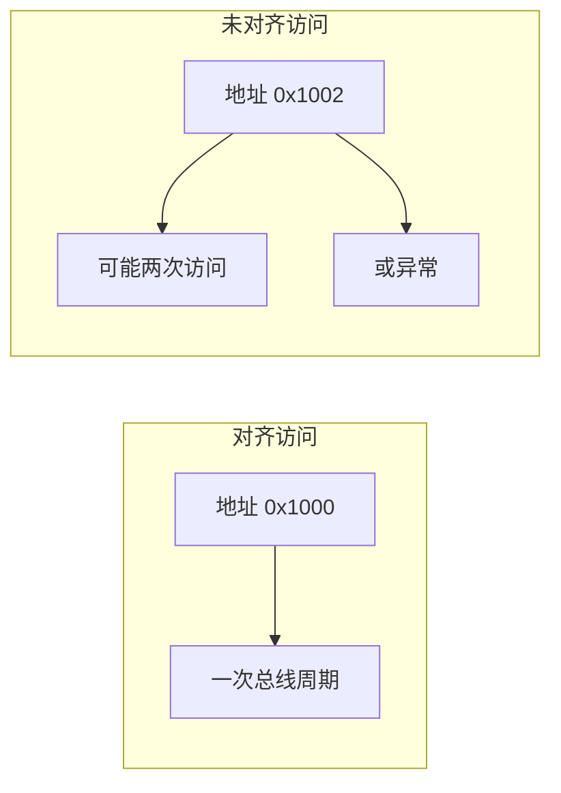

# 概述

**内存对齐（Memory Alignment）** 是指数据在内存中的起始地址必须满足某种“边界”要求：例如 4 字节的 `int` 通常要求其地址是 4 的倍数，8 字节的 `double` 要求地址是 8 的倍数。编译器会通过插入**填充字节（padding）** 来满足这些要求。

理解内存对齐有助于写出更高效、可移植的代码，也能避免在结构体布局、网络协议、硬件访问等场景下的隐蔽错误。

# 为什么需要内存对齐

## 硬件原因

许多 CPU（如 x86、ARM）对未对齐访问的处理方式：

- **允许但更慢**：x86 允许未对齐访问，但可能触发多次总线访问或内部微操作，性能下降。
- **直接报错**：部分 RISC（如早期 ARM、MIPS）对未对齐访问会触发**总线错误**或**对齐异常**，程序崩溃。



## 性能原因

- 对齐后，CPU 可用**单次**内存访问取到完整数据。
- 未对齐时可能跨越缓存行或页边界，增加延迟和总线周期。
- 向量化指令（SIMD）通常**强制**要求对齐（如 16 字节、32 字节边界）。

# 对齐规则（自然对齐）

常见类型的**自然对齐**要求（典型 32/64 位系统）：

| 类型           | 大小（字节） | 对齐要求（字节） |
|----------------|-------------|------------------|
| char           | 1           | 1                |
| short          | 2           | 2                |
| int            | 4           | 4                |
| long           | 4/8         | 4/8              |
| long long      | 8           | 8                |
| float          | 4           | 4                |
| double         | 8           | 8                |
| 指针           | 4/8         | 4/8              |

**规则**：变量的地址必须是其“对齐要求”的整数倍。

# 结构体与内存对齐

结构体的对齐会带来**成员之间的填充**和**整个结构体大小的对齐**。

## 两条规则

1. **成员对齐**：每个成员放在“其对齐值”的整数倍偏移处，否则中间填 padding。
2. **结构体整体对齐**：结构体总大小必须是“所有成员中最大对齐值”的整数倍，以便在数组中每个元素也满足对齐。

## 示例一：简单结构体

```c
struct S1 {
    char  a;    // 偏移 0，占 1 字节
    // 3 字节 padding，使 int 从 4 的倍数开始
    int   b;    // 偏移 4，占 4 字节
    char  c;    // 偏移 8，占 1 字节
    // 3 字节 padding，使结构体大小为最大对齐(4)的倍数
};
// sizeof(S1) = 12，而不是 6
```

内存布局示意（每格 1 字节）：

| 偏移 | 0 | 1 | 2 | 3 | 4 | 5 | 6 | 7 | 8 | 9 | 10 | 11 |
|------|---|---|---|---|---|---|---|---|---|---|-----|
| 内容 | a | pad | pad | pad | b | b | b | b | c | pad | pad | pad |

## 示例二：调整顺序减少 padding

```c
struct S2 {
    char  a;
    char  c;    // 两个 char 连续，无 padding
    int   b;
};
// sizeof(S2) = 8
```

相同成员、不同顺序，结构体大小从 12 变为 8，在大量使用时能节省内存。

## 示例三：嵌套结构体

嵌套结构体的对齐值取“其内部最大对齐值”，整体大小也要按该对齐值向上取整。

```c
struct Inner {
    char  x;
    int   y;    // 对齐 4
};              // sizeof = 8

struct Outer {
    char  a;
    struct Inner in;   // 对齐 4，从 4 的倍数开始
    char  b;
};
// in 前可能有 padding，Outer 总大小是 4 的倍数
```

# 如何控制对齐

## C11 / C++11：_Alignas 与 alignof

```c
#include <stdalign.h>

_Alignas(16) char buffer[256];   // 缓冲区按 16 字节对齐
alignas(8) int x;                // C++ 用 alignas

printf("int alignment: %zu\n", alignof(int));
```

## GCC/Clang 扩展：__attribute__((aligned))

```c
char buf[64] __attribute__((aligned(32)));  // 32 字节对齐
```

## 取消结构体 padding：__attribute__((packed))

**慎用**：去掉成员间填充，结构体可能未对齐，访问成员可能变慢或在某些平台出错。

```c
struct Packed {
    char  a;
    int   b;
} __attribute__((packed));
// sizeof(Packed) = 5，b 可能未对齐
```

常用于与硬件寄存器、网络协议字节流一一对应的场景，此时往往需要手动按字节访问或做拷贝。

# 常见问题与建议

## 1. sizeof 与预期不符

多半是 padding 导致。用 `offsetof(struct S, member)` 看成员偏移，或打印各成员地址分析。

## 2. 序列化/网络协议

- 若协议要求“无 padding”的紧凑布局，可使用 `__attribute__((packed))`，并注意字节序。
- 更稳妥的方式是**显式按字段序列化**，不依赖结构体内存布局。

## 3. 跨平台

不同平台的对齐、`long` 和指针大小可能不同，涉及二进制布局时要用固定宽度类型（如 `uint32_t`）和静态断言检查 `sizeof`/`offsetof`。

## 4. 性能敏感代码

- 把**大对齐、热访问**的成员放在前面，减少 padding。
- 对 SIMD 或 DMA 缓冲区使用 `alignas` 或 `aligned` 属性满足 16/32 字节对齐。

# 小结

| 要点         | 说明                                       |
|--------------|--------------------------------------------|
| 对齐目的     | 满足硬件要求、提高访问效率                 |
| 结构体大小   | 受成员顺序影响，可重排以减小 padding       |
| 控制方式     | `_Alignas`/`alignof`、`__attribute__((aligned/packed))` |
| 使用 packed  | 仅在对齐和布局有明确需求时使用，注意可移植性 |

理解内存对齐后，在写 C/嵌入式/高性能代码时能更好地兼顾正确性、可移植性和性能。
