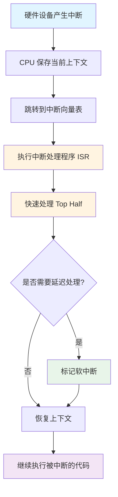
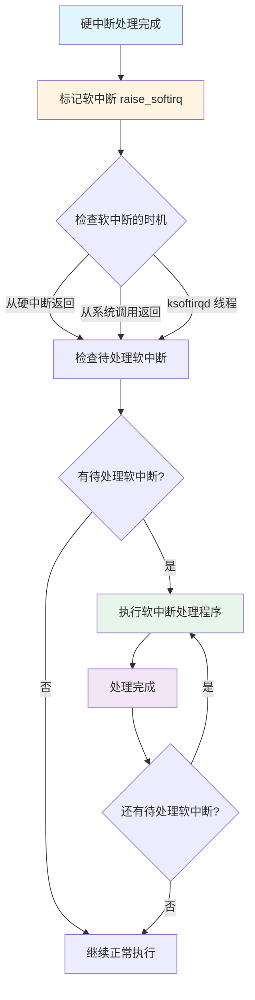

中断（Interrupt）是计算机系统中一种重要的机制，用于处理异步事件。当硬件设备需要 CPU 的注意时，会通过中断通知 CPU。Linux 内核通过中断机制来响应硬件事件，提高系统的响应性和效率。

# 中断的基本概念

## 什么是中断

中断是一种硬件和软件机制，用于：
- **异步事件处理**：硬件设备可以在任何时候通知 CPU
- **提高效率**：避免 CPU 轮询设备状态
- **实时响应**：快速响应硬件事件

## 中断的分类

Linux 系统中的中断主要分为两类：

| 类型 | 来源 | 特点 | 处理方式 |
|------|------|------|----------|
| **硬中断（Hard Interrupt）** | 硬件设备 | 异步、不可预测 | 中断处理程序（ISR） |
| **软中断（Soft Interrupt）** | 软件触发 | 可延迟、可调度 | 软中断处理程序 |

## 中断处理的目标

1. **快速响应**：尽快响应硬件事件
2. **最小化延迟**：减少中断处理时间
3. **避免阻塞**：不阻塞其他中断和进程
4. **负载均衡**：在多核系统中平衡中断负载

# 硬中断

硬中断（Hardware Interrupt）是由硬件设备产生的中断，是 CPU 与外部设备通信的主要方式。

## 硬中断的特点

1. **异步性**：硬件设备可以在任何时候产生中断
2. **不可预测**：无法预知中断何时发生
3. **高优先级**：硬中断可以打断正在执行的代码
4. **快速处理**：需要在中断上下文中快速处理

## 硬中断的触发

### 硬件中断源

常见的硬件中断源包括：

| 设备 | 中断类型 | 说明 |
|------|---------|------|
| **键盘** | IRQ 1 | 按键按下 |
| **鼠标** | IRQ 12 | 鼠标移动/点击 |
| **网卡** | IRQ 11 | 数据包到达 |
| **硬盘** | IRQ 14/15 | 磁盘 I/O 完成 |
| **定时器** | IRQ 0 | 时钟中断 |
| **串口** | IRQ 3/4 | 串口数据到达 |

### 中断请求（IRQ）

每个硬件设备都有一个唯一的中断请求线（IRQ）：

```sh
# 查看系统中断信息
➜ cat /proc/interrupts
           CPU0       CPU1       CPU2       CPU3
  0:         45          0          0          0   IO-APIC   2-edge      timer
  1:          3          0          0          0   IO-APIC   1-edge      i8042
  8:          0          0          0          1   IO-APIC   8-edge      rtc0
  9:          0          0          0          0   IO-APIC   9-fasteoi   acpi
 11:       1234          0          0          0   IO-APIC  11-edge      eth0
 14:         56          0          0          0   IO-APIC  14-edge      ata_piix
NMI:          0          0          0          0   Non-maskable interrupts
LOC:     123456     123456     123456     123456   Local timer interrupts
```

**输出说明：**
- **第一列**：IRQ 号
- **CPU0-CPU3**：每个 CPU 处理的中断次数
- **类型**：中断类型（edge/level）
- **设备**：产生中断的设备名称

## 硬中断处理流程



### 详细步骤

#### 1. 中断产生

```c
// 硬件设备产生中断信号
// CPU 检测到中断请求
```

#### 2. CPU 响应中断

```c
// CPU 执行以下操作：
// 1. 保存当前执行上下文（寄存器、程序计数器等）
// 2. 禁用中断（避免嵌套）
// 3. 跳转到中断处理程序
```

#### 3. 中断处理程序（ISR）

```c
// 中断处理程序的特点：
// - 在中断上下文中执行
// - 不能睡眠、不能阻塞
// - 必须快速执行
// - 不能访问用户空间

irqreturn_t my_interrupt_handler(int irq, void *dev_id) {
    // 1. 快速处理关键操作
    // 2. 读取设备状态
    // 3. 清除中断标志
    // 4. 标记软中断（如果需要进一步处理）
    
    return IRQ_HANDLED;
}
```

#### 4. 中断处理的两部分（Top Half / Bottom Half）

**Top Half（上半部）：**
- 在中断上下文中执行
- 必须快速完成
- 只做最关键的处理
- 不能阻塞

**Bottom Half（下半部）：**
- 延迟处理
- 可以执行较长时间的操作
- 可以睡眠和阻塞
- 通过软中断、tasklet、工作队列实现

## 硬中断处理示例

### 内核模块中的中断处理

```c
#include <linux/interrupt.h>
#include <linux/module.h>
#include <linux/kernel.h>

static int irq = 10;  // IRQ 号
static int irq_counter = 0;

// 中断处理函数
static irqreturn_t my_interrupt_handler(int irq, void *dev_id) {
    irq_counter++;
    printk(KERN_INFO "Interrupt %d occurred, count: %d\n", 
           irq, irq_counter);
    
    // 处理硬件事件
    // ...
    
    return IRQ_HANDLED;
}

static int __init my_init(void) {
    // 注册中断处理程序
    if (request_irq(irq, my_interrupt_handler, 
                    IRQF_SHARED, "my_device", NULL)) {
        printk(KERN_ERR "Failed to register IRQ %d\n", irq);
        return -EIO;
    }
    
    printk(KERN_INFO "IRQ %d registered\n", irq);
    return 0;
}

static void __exit my_exit(void) {
    // 释放中断
    free_irq(irq, NULL);
    printk(KERN_INFO "IRQ %d freed\n", irq);
}

module_init(my_init);
module_exit(my_exit);
MODULE_LICENSE("GPL");
```

## 中断上下文的特点

在硬中断处理程序中：

**可以做的：**
- 快速处理硬件事件
- 读取/写入设备寄存器
- 标记软中断
- 使用自旋锁（spinlock）

**不能做的：**
- 睡眠（sleep）
- 阻塞操作
- 访问用户空间
- 使用可能睡眠的函数（如 kmalloc(GFP_KERNEL)）

# 软中断

软中断（Soft Interrupt）是由软件触发的中断，用于延迟处理硬中断中无法完成的工作。

## 软中断的特点

1. **可延迟**：可以在合适的时机执行
2. **可调度**：由内核调度执行
3. **可中断**：可以被硬中断打断
4. **可并发**：可以在多个 CPU 上并发执行

## 软中断的类型

Linux 内核预定义了多种软中断类型：

| 软中断类型 | 说明 |
|-----------|------|
| **HI_SOFTIRQ** | 高优先级 tasklet |
| **TIMER_SOFTIRQ** | 定时器软中断 |
| **NET_TX_SOFTIRQ** | 网络发送软中断 |
| **NET_RX_SOFTIRQ** | 网络接收软中断 |
| **BLOCK_SOFTIRQ** | 块设备软中断 |
| **IRQ_POLL_SOFTIRQ** | IRQ 轮询软中断 |
| **TASKLET_SOFTIRQ** | 普通 tasklet |
| **SCHED_SOFTIRQ** | 调度器软中断 |
| **HRTIMER_SOFTIRQ** | 高精度定时器软中断 |
| **RCU_SOFTIRQ** | RCU 软中断 |

## 软中断处理流程



### 软中断的触发时机

软中断在以下时机被检查和执行：

1. **从硬中断返回时**
   ```c
   // 硬中断处理完成后
   // 内核检查是否有待处理的软中断
   ```

2. **从系统调用返回时**
   ```c
   // 系统调用返回用户空间前
   // 检查并处理软中断
   ```

3. **ksoftirqd 内核线程**
   ```c
   // 专门的内核线程处理软中断
   // 避免软中断占用过多 CPU
   ```

## 软中断处理示例

### 查看软中断统计

```sh
# 查看软中断统计信息
➜ cat /proc/softirqs
                    CPU0       CPU1       CPU2       CPU3
          HI:          0          0          0          0
       TIMER:     123456     123456     123456     123456
      NET_TX:        123        456        789       1011
      NET_RX:     456789     456789     456789     456789
       BLOCK:         12         34         56         78
    IRQ_POLL:          0          0          0          0
     TASKLET:         23         45         67         89
       SCHED:     234567     234567     234567     234567
     HRTIMER:          0          0          0          0
         RCU:     345678     345678     345678     345678
```

### 内核中的软中断处理

```c
#include <linux/interrupt.h>
#include <linux/kernel.h>

// 软中断处理函数
static void my_softirq_handler(struct softirq_action *action) {
    // 执行延迟处理工作
    // 可以执行较长时间的操作
    // 可以睡眠（在某些情况下）
    
    printk(KERN_INFO "Soft interrupt handled\n");
}

static int __init my_init(void) {
    // 注册软中断处理函数
    open_softirq(MY_SOFTIRQ, my_softirq_handler);
    
    // 触发软中断
    raise_softirq(MY_SOFTIRQ);
    
    return 0;
}
```

## Tasklet 和工作队列

### Tasklet

Tasklet 是基于软中断的延迟处理机制：

```c
#include <linux/interrupt.h>

// Tasklet 处理函数
void my_tasklet_function(unsigned long data) {
    // 处理延迟工作
    printk(KERN_INFO "Tasklet executed\n");
}

// 声明 Tasklet
DECLARE_TASKLET(my_tasklet, my_tasklet_function, 0);

// 调度 Tasklet
tasklet_schedule(&my_tasklet);
```

**Tasklet 特点：**
- 基于软中断实现
- 同一类型的 tasklet 不能并发执行
- 不能睡眠
- 快速执行

### 工作队列（Work Queue）

工作队列是另一种延迟处理机制：

```c
#include <linux/workqueue.h>

// 工作函数
void my_work_function(struct work_struct *work) {
    // 可以睡眠
    // 可以执行长时间操作
    printk(KERN_INFO "Work executed\n");
}

// 声明工作
DECLARE_WORK(my_work, my_work_function);

// 调度工作
schedule_work(&my_work);
```

**工作队列特点：**
- 在进程上下文中执行
- 可以睡眠
- 可以执行长时间操作
- 由内核线程执行

## 硬中断 vs 软中断对比

| 特性 | 硬中断 | 软中断 |
|------|--------|--------|
| **触发源** | 硬件设备 | 软件 |
| **执行上下文** | 中断上下文 | 中断上下文或进程上下文 |
| **优先级** | 高 | 较低 |
| **执行时间** | 必须快速 | 可以较长 |
| **能否睡眠** | 不能 | 不能（但工作队列可以） |
| **并发性** | 可能嵌套 | 可以并发 |
| **使用场景** | 快速响应硬件 | 延迟处理工作 |

# 中断处理的最佳实践

## Top Half / Bottom Half 设计

```c
// Top Half: 快速处理
static irqreturn_t my_interrupt_handler(int irq, void *dev_id) {
    struct my_device *dev = dev_id;
    
    // 1. 快速读取设备状态
    u32 status = readl(dev->regs + STATUS_REG);
    
    // 2. 清除中断标志
    writel(status, dev->regs + STATUS_REG);
    
    // 3. 将数据复制到缓冲区
    memcpy(dev->buffer, dev->data, sizeof(dev->data));
    
    // 4. 标记软中断，延迟处理
    raise_softirq(MY_SOFTIRQ);
    
    return IRQ_HANDLED;
}

// Bottom Half: 延迟处理
static void my_softirq_handler(struct softirq_action *action) {
    struct my_device *dev = get_device();
    
    // 处理数据
    process_data(dev->buffer);
    
    // 通知用户空间
    wake_up_interruptible(&dev->wait_queue);
}
```

## 中断处理的原则

1. **快速处理**：Top Half 必须快速完成
2. **延迟处理**：耗时操作放到 Bottom Half
3. **避免阻塞**：中断处理中不能睡眠
4. **保护数据**：使用适当的锁机制
5. **避免嵌套**：合理设计避免中断嵌套过深

# 中断相关的系统工具

## 查看中断信息

```sh
# 查看所有中断统计
➜ cat /proc/interrupts

# 查看特定 CPU 的中断
➜ cat /proc/interrupts | grep CPU0

# 查看软中断统计
➜ cat /proc/softirqs

# 实时监控中断
➜ watch -n 1 'cat /proc/interrupts'
```

## CPU 亲和性（CPU Affinity）

CPU 亲和性是指将中断或进程绑定到特定的 CPU 核心上执行。在多核系统中，合理设置 CPU 亲和性可以：

1. **提高缓存命中率**：同一中断始终在同一 CPU 处理，数据更可能在缓存中
2. **减少 CPU 迁移开销**：避免中断在不同 CPU 间迁移
3. **负载均衡**：合理分配中断负载到不同 CPU
4. **性能隔离**：将关键中断隔离到特定 CPU

### CPU 亲和性的原理

每个中断都有一个 CPU 亲和性掩码（affinity mask），用位图表示哪些 CPU 可以处理该中断：

```sh
# 查看中断的 CPU 亲和性
➜ cat /proc/irq/11/smp_affinity
00000001  # 16 进制格式，表示 CPU 0

# 查看详细格式（二进制）
➜ cat /proc/irq/11/smp_affinity_list
0  # 十进制格式，表示 CPU 0
```

### smp_affinity 格式说明

`smp_affinity` 使用位掩码（bitmask）表示 CPU 亲和性：

**格式：**
- **十六进制**：`00000001` 表示 CPU 0，`00000003` 表示 CPU 0 和 1
- **二进制对应**：每一位代表一个 CPU
  - `00000001` (0x1) = `0000 0001` (二进制) = CPU 0
  - `00000003` (0x3) = `0000 0011` (二进制) = CPU 0 和 1
  - `0000000f` (0xf) = `0000 1111` (二进制) = CPU 0, 1, 2, 3
  - `ffffffff` (0xffffffff) = 所有 CPU

**计算示例：**

```sh
# CPU 0:  0x1 = 0000 0001 (二进制)
# CPU 1:  0x2 = 0000 0010 (二进制)
# CPU 2:  0x4 = 0000 0100 (二进制)
# CPU 3:  0x8 = 0000 1000 (二进制)

# CPU 0 和 1:  0x3 = 0000 0011 = 0x1 | 0x2
# CPU 0,1,2,3: 0xf = 0000 1111 = 0x1 | 0x2 | 0x4 | 0x8
```

### 查看中断亲和性

```sh
# 查看所有中断的亲和性
➜ for irq in /proc/irq/*/smp_affinity; do
    echo "IRQ $(basename $(dirname $irq)): $(cat $irq)"
  done

# 查看特定中断的亲和性（两种格式）
➜ cat /proc/irq/11/smp_affinity      # 十六进制位掩码
00000001

➜ cat /proc/irq/11/smp_affinity_list # 十进制列表
0

# 查看网卡中断的亲和性
➜ cat /proc/interrupts | grep eth0
 11:   123456          0          0          0   eth0
➜ cat /proc/irq/11/smp_affinity
00000001  # 只绑定到 CPU 0
```

### 设置中断亲和性

#### 基本设置

```sh
# 绑定到单个 CPU
# CPU 0
➜ echo 1 > /proc/irq/11/smp_affinity
➜ echo 0 > /proc/irq/11/smp_affinity_list

# CPU 1
➜ echo 2 > /proc/irq/11/smp_affinity
➜ echo 1 > /proc/irq/11/smp_affinity_list

# CPU 2
➜ echo 4 > /proc/irq/11/smp_affinity
➜ echo 2 > /proc/irq/11/smp_affinity_list

# 绑定到多个 CPU
# CPU 0 和 1
➜ echo 3 > /proc/irq/11/smp_affinity
➜ echo 0-1 > /proc/irq/11/smp_affinity_list

# CPU 0, 1, 2, 3
➜ echo f > /proc/irq/11/smp_affinity
➜ echo 0-3 > /proc/irq/11/smp_affinity_list
```

#### 高级设置

```sh
# 对于超过 32 个 CPU 的系统，需要使用扩展格式
# 查看系统 CPU 数量
➜ nproc
64

# 设置大系统的 CPU 亲和性（使用逗号分隔）
➜ echo 0,1,2,3 > /proc/irq/11/smp_affinity_list

# 使用位掩码（64 位系统）
➜ echo 00000000,0000000f > /proc/irq/11/smp_affinity
# 前 32 位：CPU 0-31
# 后 32 位：CPU 32-63
```

### CPU 亲和性的应用场景

#### 1. 网络中断绑定

将网卡中断绑定到特定 CPU，提高网络性能：

```sh
# 查找网卡中断号
➜ cat /proc/interrupts | grep eth0
 11:   123456          0          0          0   eth0

# 绑定到 CPU 0（避免与其他 CPU 竞争）
➜ echo 1 > /proc/irq/11/smp_affinity

# 或者绑定到 CPU 0 和 1（负载均衡）
➜ echo 3 > /proc/irq/11/smp_affinity
```

#### 2. 多队列网卡的中断绑定

现代网卡支持多队列，每个队列有独立的中断：

```sh
# 查看网卡队列和中断
➜ cat /proc/interrupts | grep eth0
 11:   12345          0          0          0   eth0-TxRx-0
 12:       0      12345          0          0   eth0-TxRx-1
 13:       0          0      12345          0   eth0-TxRx-2
 14:       0          0          0      12345   eth0-TxRx-3

# 将每个队列绑定到不同 CPU
➜ echo 1 > /proc/irq/11/smp_affinity  # 队列 0 -> CPU 0
➜ echo 2 > /proc/irq/12/smp_affinity  # 队列 1 -> CPU 1
➜ echo 4 > /proc/irq/13/smp_affinity  # 队列 2 -> CPU 2
➜ echo 8 > /proc/irq/14/smp_affinity  # 队列 3 -> CPU 3
```

#### 3. 磁盘 I/O 中断绑定

将磁盘中断绑定到特定 CPU，减少 I/O 延迟：

```sh
# 查找磁盘中断
➜ cat /proc/interrupts | grep sda
 14:       56          0          0          0   ata_piix

# 绑定到 CPU 0
➜ echo 1 > /proc/irq/14/smp_affinity
```

#### 4. 隔离关键中断

将关键中断隔离到专用 CPU，避免被其他任务干扰：

```sh
# 将网卡中断绑定到 CPU 0（专用 CPU）
➜ echo 1 > /proc/irq/11/smp_affinity

# 将其他任务隔离到其他 CPU
➜ taskset -cp 1-7 <pid>  # 将进程绑定到 CPU 1-7
```

### 中断负载均衡策略

#### 策略 1：单 CPU 绑定（性能优先）

```sh
# 所有中断绑定到 CPU 0
# 优点：缓存命中率高
# 缺点：CPU 0 负载高
for irq in 11 12 13 14; do
    echo 1 > /proc/irq/$irq/smp_affinity
done
```

#### 策略 2：轮询分配（负载均衡）

```sh
# 将中断轮询分配到不同 CPU
# 优点：负载均衡
# 缺点：可能降低缓存命中率
echo 1 > /proc/irq/11/smp_affinity  # CPU 0
echo 2 > /proc/irq/12/smp_affinity  # CPU 1
echo 4 > /proc/irq/13/smp_affinity  # CPU 2
echo 8 > /proc/irq/14/smp_affinity  # CPU 3
```

#### 策略 3：多 CPU 共享（高吞吐量）

```sh
# 每个中断可以处理多个 CPU
# 优点：高吞吐量
# 缺点：可能增加延迟
echo f > /proc/irq/11/smp_affinity  # CPU 0-3
```

### CPU 亲和性与进程绑定的配合

```sh
# 1. 将网卡中断绑定到 CPU 0
➜ echo 1 > /proc/irq/11/smp_affinity

# 2. 将网络处理进程也绑定到 CPU 0
➜ taskset -cp 0 <network_process_pid>

# 这样中断和处理进程在同一 CPU，减少跨 CPU 通信
```

### 使用脚本自动化设置

```bash
#!/bin/bash
# 设置网卡中断的 CPU 亲和性

INTERFACE="eth0"
CPUS="0,1"  # 使用 CPU 0 和 1

# 获取网卡中断号
IRQS=$(cat /proc/interrupts | grep $INTERFACE | awk '{print $1}' | cut -d: -f1)

for irq in $IRQS; do
    # 计算 CPU 掩码（CPU 0 和 1 = 0x3）
    if [ "$CPUS" = "0,1" ]; then
        MASK="3"
    elif [ "$CPUS" = "0" ]; then
        MASK="1"
    else
        # 使用 affinity_list 格式
        echo "$CPUS" > /proc/irq/$irq/smp_affinity_list
        continue
    fi
    
    echo "Setting IRQ $irq to CPUs $CPUS (mask: $MASK)"
    echo $MASK > /proc/irq/$irq/smp_affinity
done

# 验证设置
echo "Current affinity settings:"
for irq in $IRQS; do
    echo "IRQ $irq: $(cat /proc/irq/$irq/smp_affinity)"
done
```

### CPU 亲和性的监控

```sh
# 实时监控中断分布
➜ watch -n 1 'cat /proc/interrupts | head -20'

# 查看每个 CPU 的中断负载
➜ for cpu in 0 1 2 3; do
    echo "CPU $cpu interrupts:"
    cat /proc/interrupts | awk -v cpu=$cpu "NR==1 || \$$((cpu+2)) > 0" | head -10
  done

# 使用 mpstat 查看 CPU 中断统计
➜ mpstat -I SUM 1
```

### CPU 亲和性的最佳实践

1. **网络密集型应用**
   - 将网卡中断绑定到专用 CPU
   - 将网络处理进程绑定到同一 CPU
   - 使用多队列网卡时，每个队列绑定不同 CPU

2. **I/O 密集型应用**
   - 将磁盘中断绑定到特定 CPU
   - 避免与计算密集型任务竞争同一 CPU

3. **实时系统**
   - 将实时任务隔离到专用 CPU
   - 将中断绑定到非实时 CPU

4. **多核系统**
   - 使用 irqbalance 自动平衡（适合大多数场景）
   - 手动设置（适合特定性能要求）

### CPU 亲和性的注意事项

1. **持久性**：通过 `/proc` 设置的亲和性在重启后会丢失
   - 需要写入启动脚本或使用 systemd 服务

2. **权限**：设置 CPU 亲和性需要 root 权限

3. **irqbalance 冲突**：如果启用了 irqbalance，手动设置可能被覆盖
   ```sh
   # 禁用 irqbalance 以使用手动设置
   sudo systemctl stop irqbalance
   sudo systemctl disable irqbalance
   ```

4. **性能测试**：设置前后进行性能测试，验证效果

### 持久化 CPU 亲和性设置

#### 方法 1：使用 systemd 服务

创建服务文件 `/etc/systemd/system/set-irq-affinity.service`：

```ini
[Unit]
Description=Set IRQ CPU Affinity
After=network.target

[Service]
Type=oneshot
ExecStart=/usr/local/bin/set-irq-affinity.sh
RemainAfterExit=yes

[Install]
WantedBy=multi-user.target
```

#### 方法 2：使用启动脚本

在 `/etc/rc.local` 中添加：

```bash
#!/bin/bash
# 设置网卡中断亲和性
echo 3 > /proc/irq/11/smp_affinity
exit 0
```

## 使用 irqbalance

```sh
# 安装 irqbalance（自动平衡中断负载）
sudo apt-get install irqbalance

# 启动服务
sudo systemctl start irqbalance

# 查看状态
sudo systemctl status irqbalance
```

## 使用 perf 分析中断

```sh
# 安装 perf
sudo apt-get install linux-perf

# 监控中断事件
sudo perf top -e irq:*

# 记录中断事件
sudo perf record -e irq:* -a sleep 10

# 查看报告
sudo perf report
```

# 中断性能优化

## 中断合并（Interrupt Coalescing）

网卡等设备支持中断合并，减少中断频率：

```sh
# 查看网卡中断合并设置
ethtool -c eth0

# 设置中断合并
ethtool -C eth0 rx-usecs 100
```

## CPU 亲和性设置（详细说明见上方章节）

CPU 亲和性是将中断绑定到特定 CPU 核心的机制，详细说明、设置方法和最佳实践请参考上方的"CPU 亲和性（CPU Affinity）"章节。

**快速参考：**

```sh
# 查看当前设置
cat /proc/irq/11/smp_affinity

# 设置到 CPU 0
echo 1 > /proc/irq/11/smp_affinity

# 设置到 CPU 0 和 1
echo 3 > /proc/irq/11/smp_affinity
```

## 中断负载均衡

在多核系统中，合理分配中断负载是性能优化的关键。有两种主要方式：

### 自动负载均衡（irqbalance）

```sh
# 安装和启用 irqbalance（自动平衡中断负载）
sudo apt-get install irqbalance
sudo systemctl enable irqbalance
sudo systemctl start irqbalance

# 查看状态
sudo systemctl status irqbalance

# 配置 irqbalance（/etc/default/irqbalance）
# IRQBALANCE_ARGS="--foreground"
```

**irqbalance 的工作原理：**
- 监控每个 CPU 的中断负载
- 自动将中断迁移到负载较低的 CPU
- 考虑 CPU 拓扑和缓存局部性
- 适合大多数通用场景

### 手动负载均衡

```sh
# 手动设置中断亲和性（适合特定性能要求）
for irq in $(cat /proc/interrupts | grep eth0 | awk '{print $1}' | cut -d: -f1); do
    echo 3 > /proc/irq/$irq/smp_affinity  # 绑定到 CPU 0 和 1
done

# 或者使用轮询分配
irqs=($(cat /proc/interrupts | grep eth0 | awk '{print $1}' | cut -d: -f1))
cpus=(1 2 4 8)  # CPU 0, 1, 2, 3 的掩码
for i in "${!irqs[@]}"; do
    echo ${cpus[$i]} > /proc/irq/${irqs[$i]}/smp_affinity
done
```

**选择建议：**
- **通用场景**：使用 irqbalance（自动、智能）
- **特定优化**：手动设置（精确控制、性能调优）
- **实时系统**：手动设置（可预测性）

# 常见问题和调试

## 中断风暴（Interrupt Storm）

**问题**：某个设备产生大量中断，占用 CPU

**诊断：**
```sh
# 查看中断统计
watch -n 1 'cat /proc/interrupts'

# 查看 CPU 使用率
top
```

**解决：**
- 启用中断合并
- 调整中断处理逻辑
- 检查硬件设备

## 中断延迟过高

**问题**：中断响应时间过长

**诊断：**
```sh
# 使用 ftrace 跟踪中断延迟
echo function_graph > /sys/kernel/debug/tracing/current_tracer
echo irq_handler_entry > /sys/kernel/debug/tracing/set_event
cat /sys/kernel/debug/tracing/trace
```

**解决：**
- 优化中断处理函数
- 减少 Top Half 处理时间
- 使用 NAPI（网络设备）

## 软中断占用 CPU 过高

**问题**：ksoftirqd 线程占用大量 CPU

**诊断：**
```sh
# 查看软中断统计
cat /proc/softirqs

# 查看 ksoftirqd 线程
top -H -p $(pgrep ksoftirqd)
```

**解决：**
- 优化软中断处理函数
- 使用工作队列替代
- 调整软中断处理策略

# 实际应用场景

## 网络数据包处理

```c
// 网卡接收数据包的中断处理流程
// 1. 硬中断：快速接收数据包到缓冲区
// 2. 软中断：处理数据包，传递给协议栈

// 硬中断处理
static irqreturn_t net_interrupt_handler(int irq, void *dev_id) {
    // 快速接收数据包
    receive_packets();
    
    // 禁用网卡中断，启用 NAPI
    disable_interrupts();
    napi_schedule();
    
    return IRQ_HANDLED;
}

// 软中断处理（NET_RX_SOFTIRQ）
static void net_rx_action(struct softirq_action *action) {
    // 轮询处理数据包
    while (has_packets()) {
        process_packet();
    }
    
    // 处理完成，重新启用中断
    enable_interrupts();
}
```

## 定时器中断

```c
// 定时器中断处理
// 1. 更新系统时间
// 2. 检查定时器
// 3. 调度进程

void timer_interrupt_handler(void) {
    // 更新 jiffies
    jiffies++;
    
    // 更新系统时间
    update_wall_time();
    
    // 触发定时器软中断
    raise_softirq(TIMER_SOFTIRQ);
}

// 定时器软中断处理
static void run_timer_softirq(struct softirq_action *action) {
    // 处理到期的定时器
    run_timers();
    
    // 触发调度器软中断
    raise_softirq(SCHED_SOFTIRQ);
}
```

# 总结

Linux 系统的中断机制是系统响应性和效率的关键：

1. **硬中断**：快速响应硬件事件，在中断上下文中执行
2. **软中断**：延迟处理耗时操作，可以并发执行
3. **Top Half / Bottom Half**：分离快速处理和延迟处理
4. **性能优化**：通过中断合并、CPU 亲和性等提高性能

理解中断机制对于：
- 系统性能优化
- 设备驱动开发
- 系统调试和故障排查
- 实时系统设计

都非常重要。

# 参考文献

* [Linux 内核中断处理](https://www.kernel.org/doc/html/latest/core-api/interrupts.html)
* [Understanding the Linux Kernel](https://www.oreilly.com/library/view/understanding-the-linux/0596005652/)
* [Linux Device Drivers](https://lwn.net/Kernel/LDD3/)
* [Linux 内核源码 - interrupt.c](https://elixir.bootlin.com/linux/latest/source/kernel/irq/)
