进程（Process）和线程（Thread）是操作系统中两个核心概念。理解它们的区别、特点和使用场景对于系统编程和性能优化非常重要。

# 进程

## 什么是进程

进程是程序的一次执行过程，是操作系统进行资源分配和调度的基本单位。每个进程都有独立的地址空间和系统资源。

### 进程的定义

从不同角度看进程：

1. **程序执行角度**：进程是正在执行的程序
2. **资源分配角度**：进程是资源分配的基本单位
3. **系统调度角度**：进程是 CPU 调度的实体

### 进程的特点

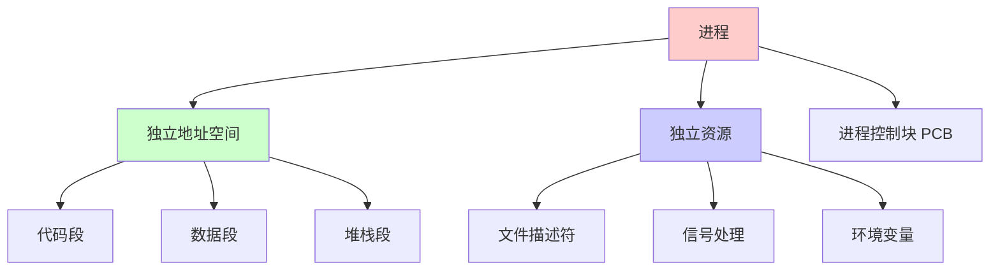

## 进程的结构

### 进程的组成部分

一个进程通常包含以下部分：

| 组成部分 | 说明 |
|---------|------|
| **代码段（Text）** | 程序的机器指令 |
| **数据段（Data）** | 全局变量和静态变量 |
| **堆（Heap）** | 动态分配的内存 |
| **栈（Stack）** | 局部变量、函数参数、返回地址 |
| **进程控制块（PCB）** | 进程的状态信息 |

### 进程的内存布局

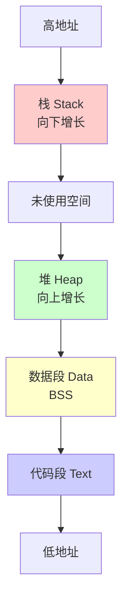

### 进程控制块（PCB）

PCB 是操作系统管理进程的数据结构，包含：

```c
// PCB 的主要字段（简化）
struct task_struct {
    // 进程标识
    pid_t pid;              // 进程 ID
    pid_t ppid;             // 父进程 ID
    
    // 进程状态
    int state;              // 运行、就绪、阻塞等
    
    // 内存信息
    struct mm_struct *mm;    // 内存描述符
    
    // 文件信息
    struct files_struct *files;  // 打开的文件
    
    // 调度信息
    int priority;            // 优先级
    unsigned long runtime;   // 运行时间
    
    // 信号处理
    struct signal_struct *signal;  // 信号处理
};
```

## 进程的状态

### 进程状态转换

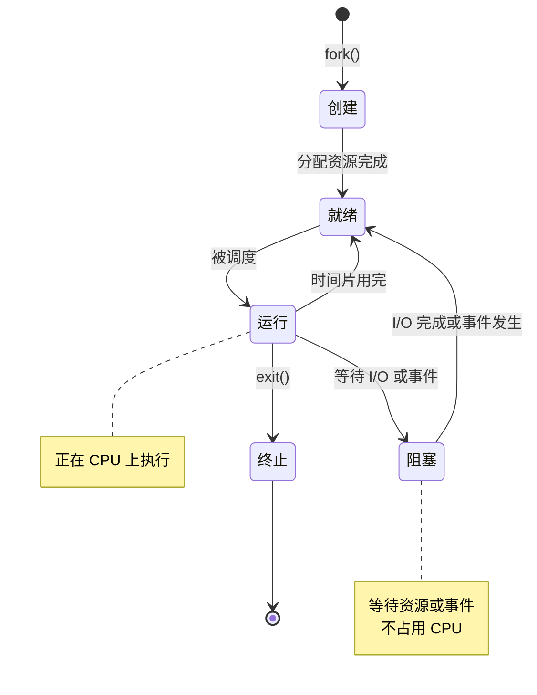

### 进程状态说明

| 状态 | 说明 | 特点 |
|------|------|------|
| **创建（New）** | 进程刚被创建 | 分配资源，初始化 PCB |
| **就绪（Ready）** | 进程已准备好运行 | 等待 CPU 调度 |
| **运行（Running）** | 进程正在 CPU 上执行 | 占用 CPU |
| **阻塞（Blocked）** | 进程等待某个事件 | 不占用 CPU |
| **终止（Terminated）** | 进程执行完毕 | 释放资源 |

## 进程的创建

### fork() 系统调用

`fork()` 是 Linux 中创建进程的主要方式：

```c
#include <unistd.h>
#include <sys/types.h>

pid_t fork(void);
```

**fork() 的特点：**
- 创建子进程，是父进程的副本
- 子进程获得父进程的代码、数据、堆栈的副本
- 返回两次：父进程返回子进程 PID，子进程返回 0
- 失败返回 -1

### fork() 示例

```c
#include <stdio.h>
#include <unistd.h>
#include <sys/types.h>

int main() {
    pid_t pid;
    
    printf("Before fork, PID: %d\n", getpid());
    
    pid = fork();
    
    if (pid < 0) {
        // fork 失败
        perror("fork");
        return 1;
    } else if (pid == 0) {
        // 子进程
        printf("Child process, PID: %d, PPID: %d\n", 
               getpid(), getppid());
    } else {
        // 父进程
        printf("Parent process, PID: %d, Child PID: %d\n", 
               getpid(), pid);
    }
    
    return 0;
}
```

**输出示例：**
```
Before fork, PID: 1234
Parent process, PID: 1234, Child PID: 1235
Child process, PID: 1235, PPID: 1234
```

### fork() 的执行流程

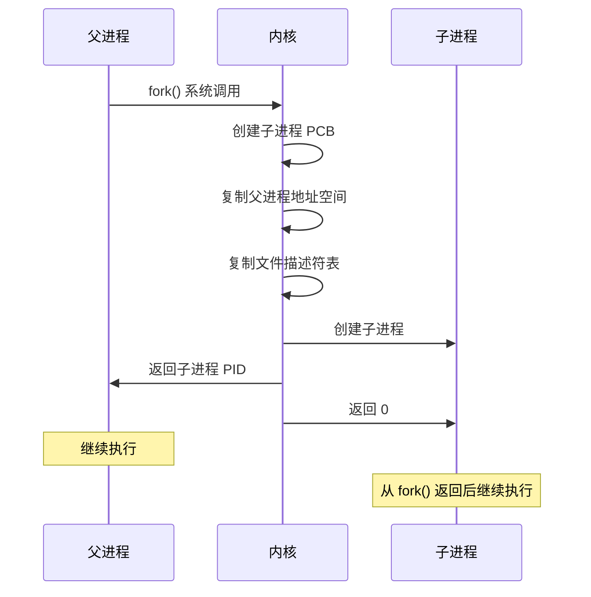

### fork() 的写时复制（COW）

现代 Linux 使用写时复制（Copy-On-Write）优化：

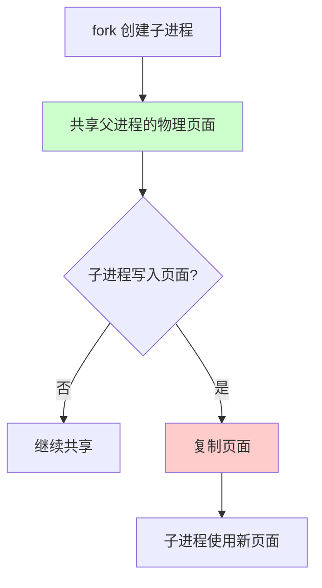

**COW 的优势：**
- 减少内存复制
- 提高 fork() 性能
- 节省内存空间

## 进程的终止

### 正常终止

```c
// 方式1：从 main 返回
int main() {
    return 0;  // 正常退出
}

// 方式2：调用 exit()
#include <stdlib.h>
exit(0);  // 正常退出

// 方式3：调用 _exit()
#include <unistd.h>
_exit(0);  // 立即退出，不执行清理
```

### 异常终止

```c
// 方式1：调用 abort()
#include <stdlib.h>
abort();  // 产生 SIGABRT 信号

// 方式2：收到信号
// 如 SIGKILL、SIGSEGV 等
```

### exit() 与 _exit() 的区别

| 函数 | 说明 | 执行清理 |
|------|------|---------|
| **exit()** | 标准库函数 | 是（刷新缓冲区、调用退出处理函数） |
| **_exit()** | 系统调用 | 否（立即退出） |

## 进程的等待

### wait() 和 waitpid()

父进程可以等待子进程结束：

```c
#include <sys/wait.h>

// 等待任意子进程
pid_t wait(int *status);

// 等待指定子进程
pid_t waitpid(pid_t pid, int *status, int options);
```

**示例：**

```c
#include <stdio.h>
#include <unistd.h>
#include <sys/wait.h>

int main() {
    pid_t pid, wpid;
    int status;
    
    pid = fork();
    
    if (pid == 0) {
        // 子进程
        printf("Child process, PID: %d\n", getpid());
        sleep(2);
        exit(0);
    } else {
        // 父进程
        printf("Parent waiting for child...\n");
        wpid = wait(&status);
        printf("Child %d exited with status %d\n", wpid, status);
    }
    
    return 0;
}
```

## 进程间通信（IPC）

进程间通信的方式包括：

1. **管道（Pipe）**
2. **命名管道（FIFO）**
3. **消息队列（Message Queue）**
4. **共享内存（Shared Memory）**
5. **信号量（Semaphore）**
6. **信号（Signal）**
7. **Socket**

详细说明请参考《进程间通信》文档。

## 进程分类

在 Linux 操作系统中，进程可以按照其生命周期和角色分为不同类型，常见的有以下几类：

### 用户进程

用户进程是直接或间接由用户启动的进程，包括通过终端、图形界面或脚本启动的各种应用程序（如 bash shell、vim、firefox、gcc 等）。它们的资源与权限受当前用户身份和系统策略限制。

**特点：**
- 由用户发起（登录 shell、双击程序、脚本等）
- 提供具体的应用功能
- 拥有与所属用户相同的权限
- 终止不影响系统核心服务

### 内核进程

内核进程（kernel thread）由操作系统内核管理，不属于任何一个用户空间程序。这些进程运行在内核态，通常用于内核任务调度、内存管理、IO 处理等。它们没有用户空间地址映射，不与用户进程直接交互，也没有控制终端。

**典型内核进程：**
- kswapd（内存回收）
- ksoftirqd（软中断处理）
- kthreadd（内核线程调度器）
- kworker、kblockd 等异步任务处理

**特点：**
- 仅运行在内核态，无用户空间
- 不受用户直接控制或终止
- 负责系统底层功能和硬件管理


### 孤儿进程

孤儿进程指的是其父进程退出（终止）后仍然运行的进程。孤儿进程不会被系统遗弃，而是由 `init` 进程（PID 1，现代系统为 systemd）接管，成为其子进程。这样做的目的是保证内核能够正常跟踪和管理这些孤儿进程资源。

- 产生原因：父进程先于子进程终止。
- 处理方式：init 进程负责调用 `wait()` 或 `waitpid()`，释放其资源。

### 僵尸进程

僵尸进程是指已经终止（退出）的子进程，但其父进程尚未调用 `wait()` 或 `waitpid()` 回收其资源（如退出状态等），进而在进程表中留下一个占位符。僵尸进程本身不占用 CPU 和内存，但会占用有限的进程号（PID），积累过多会导致系统无法创建新进程。

- 产生原因：父进程没有及时回收子进程资源。
- 解决方法：父进程应及时调用 `wait()` 或 `waitpid()`；如果父进程退出，init 进程会自动清理僵尸进程。

**僵尸进程的状态通常会显示为 “Z” (zombie) 在 ps 或 top 命令中。**

### 守护进程

守护进程（Daemon Process）是在后台运行的特殊进程，脱离了控制终端，通常用于执行系统服务（如 crond、sshd、nginx 等）。

- 典型特点：
  - 没有控制终端（与任何终端无关）
  - 以 root 或特定系统用户身份运行
  - 生命周期通常较长，随系统启动而启动
- 实现方法：
  1. fork 两次，父进程退出，孙进程成为真正的守护进程
  2. 关闭文件描述符，重定向输入输出
  3. 脱离控制终端，设置为新会话首进程（setsid）

守护进程是保证系统和服务长期稳定运行的重要角色。


# 线程

## 什么是线程

线程是进程内的执行流，是 CPU 调度的基本单位。多个线程共享进程的地址空间和资源。

### 线程的定义

从不同角度看线程：

1. **执行角度**：线程是进程内的执行流
2. **资源角度**：线程共享进程的资源
3. **调度角度**：线程是 CPU 调度的基本单位

### 线程的特点

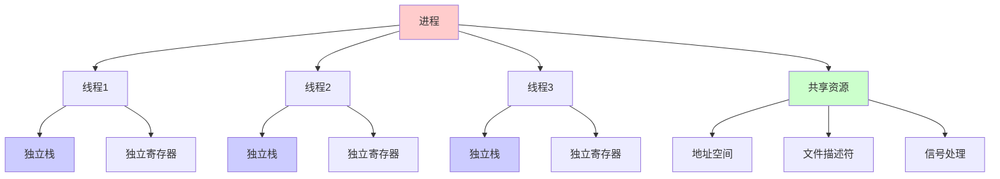

## 线程的结构

### 线程的组成部分

线程共享进程的资源，但拥有独立的部分：

| 共享部分 | 独立部分 |
|---------|---------|
| 代码段 | 栈（Stack） |
| 数据段 | 寄存器 |
| 堆（Heap） | 程序计数器（PC） |
| 文件描述符 | 线程局部存储（TLS） |
| 信号处理 | 线程 ID |

### 线程的内存布局

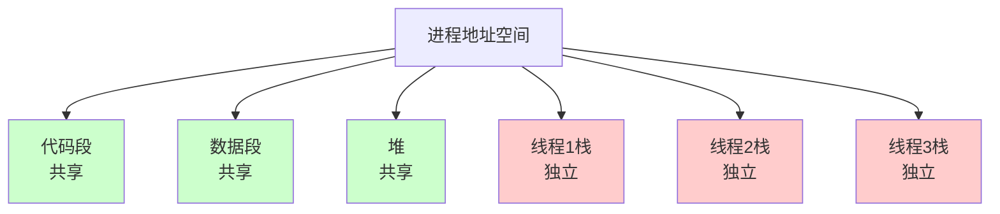

## 线程的状态

### 线程状态转换

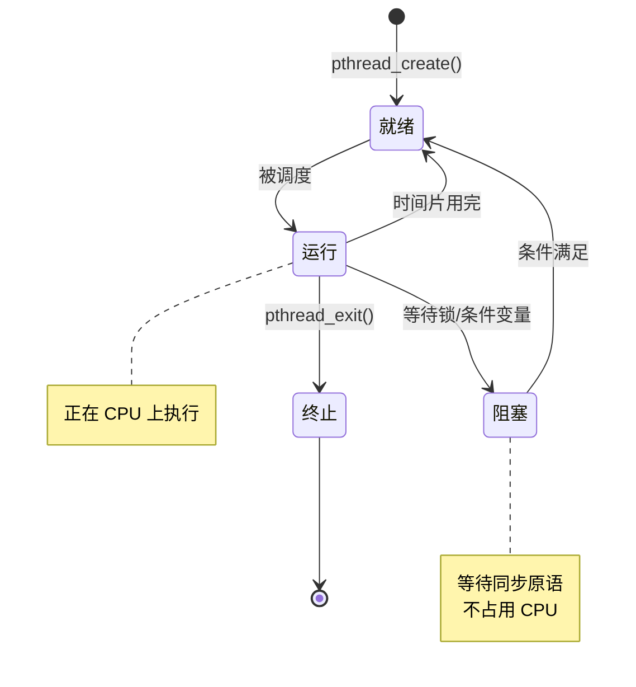

## 线程的创建

### pthread_create()

POSIX 线程（pthread）是 Linux 中创建线程的标准方式：

```c
#include <pthread.h>

int pthread_create(pthread_t *thread,
                   const pthread_attr_t *attr,
                   void *(*start_routine)(void *),
                   void *arg);
```

**参数说明：**
- `thread`：线程 ID 的指针
- `attr`：线程属性（NULL 使用默认属性）
- `start_routine`：线程函数
- `arg`：传递给线程函数的参数

### pthread_create() 示例

```c
#include <stdio.h>
#include <pthread.h>
#include <unistd.h>

void *thread_function(void *arg) {
    int thread_id = *(int *)arg;
    printf("Thread %d is running, PID: %d, TID: %lu\n", 
           thread_id, getpid(), pthread_self());
    sleep(2);
    printf("Thread %d is exiting\n", thread_id);
    return NULL;
}

int main() {
    pthread_t threads[3];
    int thread_ids[3];
    
    printf("Main thread, PID: %d\n", getpid());
    
    // 创建 3 个线程
    for (int i = 0; i < 3; i++) {
        thread_ids[i] = i;
        if (pthread_create(&threads[i], NULL, 
                          thread_function, &thread_ids[i]) != 0) {
            perror("pthread_create");
            return 1;
        }
    }
    
    // 等待所有线程结束
    for (int i = 0; i < 3; i++) {
        pthread_join(threads[i], NULL);
    }
    
    printf("All threads completed\n");
    return 0;
}
```

### 编译和运行

```sh
# 编译（需要链接 pthread 库）
gcc -o thread_demo thread_demo.c -lpthread

# 运行
./thread_demo
```

## 线程的分类

线程可以根据实现方式和管理层次进行分类，主要包括用户级线程和内核级线程，以及不同的线程实现模型。

### 用户级线程（User-level Thread, ULT）

用户级线程是由用户空间的线程库（如 pthread）管理的线程，内核不知道这些线程的存在。

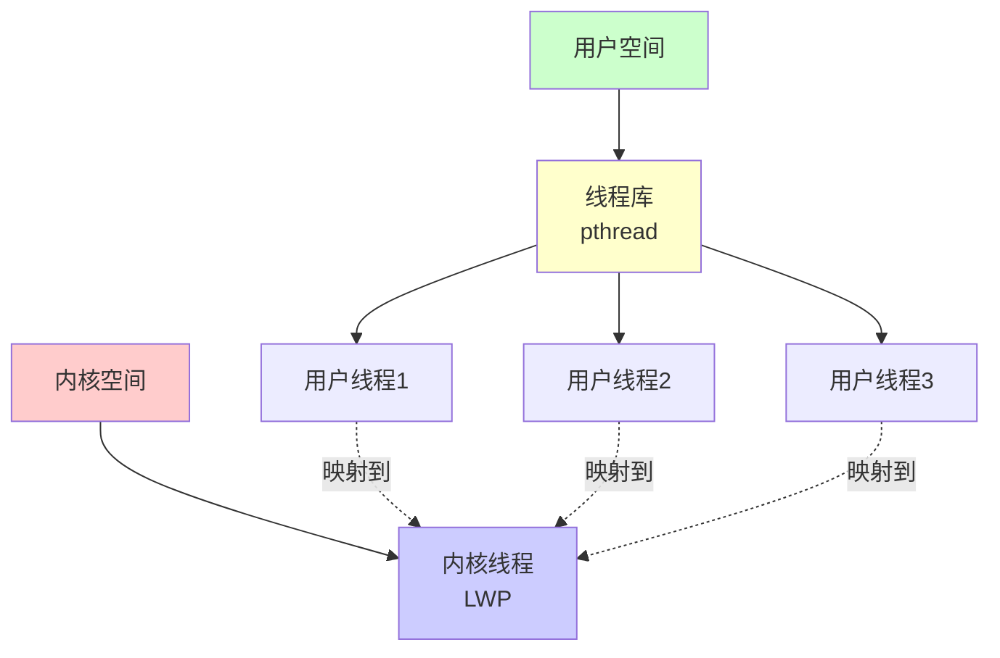

**特点：**
- **管理位置**：用户空间线程库管理
- **内核感知**：内核不知道用户线程的存在
- **调度**：由线程库在用户空间调度
- **阻塞影响**：一个线程阻塞会导致整个进程阻塞
- **切换开销**：小（用户空间切换）
- **实现**：完全在用户空间实现

**优点：**
- 线程切换不需要系统调用，开销小
- 线程库可以自定义调度策略
- 不占用内核资源

**缺点：**
- 一个线程阻塞会导致整个进程阻塞
- 无法利用多核 CPU（内核只看到一个进程）
- 内核无法调度用户线程

### 内核级线程（Kernel-level Thread, KLT）

内核级线程是由内核直接管理的线程，每个线程在内核中都有对应的数据结构。

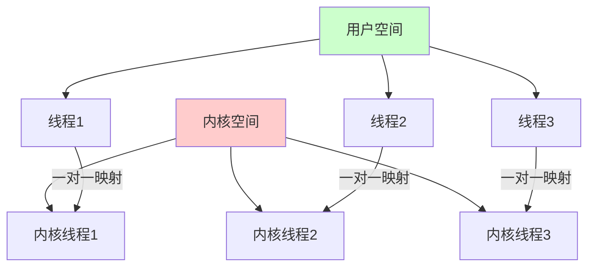

**特点：**
- **管理位置**：内核直接管理
- **内核感知**：内核知道每个线程
- **调度**：由内核调度器调度
- **阻塞影响**：一个线程阻塞不影响其他线程
- **切换开销**：较大（需要系统调用）
- **实现**：内核实现

**优点：**
- 一个线程阻塞不影响其他线程
- 可以利用多核 CPU
- 内核可以更好地调度和负载均衡

**缺点：**
- 线程切换需要系统调用，开销较大
- 占用更多内核资源
- 调度策略由内核决定

### 线程实现模型

根据用户线程和内核线程的映射关系，可以分为三种模型：

#### 1. 一对一模型（One-to-One Model）

每个用户线程映射到一个内核线程。

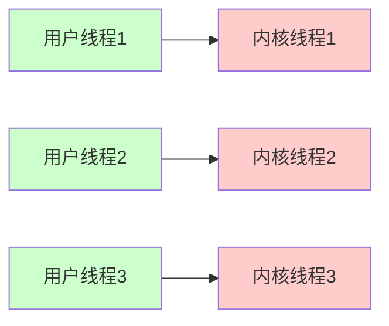

**特点：**
- 每个用户线程对应一个内核线程
- 真正的并行执行
- 线程切换开销较大
- 受内核线程数量限制

**实现：**
- Linux 的 NPTL（Native POSIX Thread Library）
- Windows 线程

**示例：**
```c
// Linux NPTL 实现
// 每个 pthread 对应一个内核线程（轻量级进程）
pthread_t thread1, thread2, thread3;

pthread_create(&thread1, NULL, func1, NULL);  // 创建内核线程1
pthread_create(&thread2, NULL, func2, NULL);  // 创建内核线程2
pthread_create(&thread3, NULL, func3, NULL);  // 创建内核线程3
```

#### 2. 多对一模型（Many-to-One Model）

多个用户线程映射到一个内核线程。

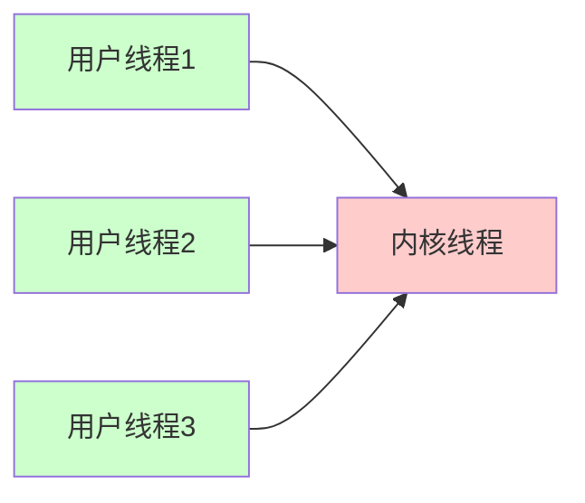

**特点：**
- 多个用户线程共享一个内核线程
- 线程切换在用户空间完成，开销小
- 一个线程阻塞会导致整个进程阻塞
- 无法利用多核 CPU

**实现：**
- GNU Portable Threads（已废弃）
- 某些旧的操作系统

**缺点：**
- 无法真正并行执行
- 一个线程阻塞影响所有线程
- 现代系统很少使用

#### 3. 多对多模型（Many-to-Many Model）

多个用户线程映射到多个内核线程（数量可以不同）。

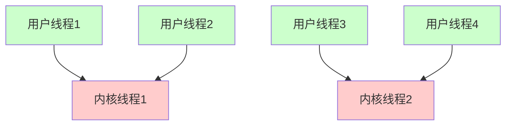

**特点：**
- 灵活的用户线程和内核线程映射
- 可以动态调整内核线程数量
- 结合了一对一和多对一的优点
- 实现复杂

**实现：**
- Solaris 的线程实现
- 某些研究性操作系统

### Linux 的线程实现

#### NPTL（Native POSIX Thread Library）

Linux 使用 NPTL 实现 POSIX 线程，采用一对一模型：

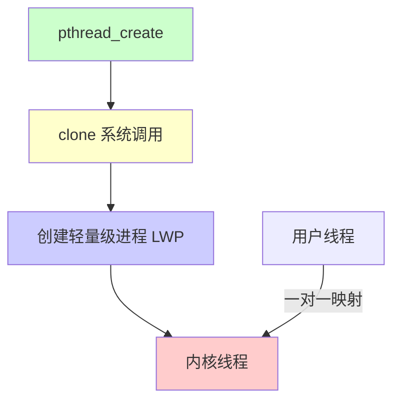

**NPTL 的特点：**
- **一对一模型**：每个 pthread 对应一个内核线程（LWP）
- **轻量级进程（LWP）**：Linux 将线程实现为轻量级进程
- **共享资源**：多个 LWP 共享地址空间
- **独立调度**：每个 LWP 可以独立调度

#### 轻量级进程（LWP）

Linux 中的线程实际上是通过轻量级进程（Lightweight Process, LWP）实现的：

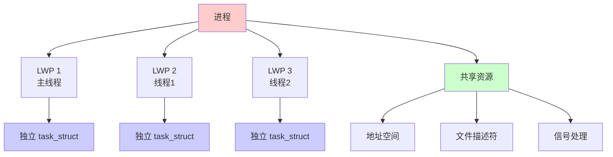

**LWP 的特点：**
- 每个线程在内核中都有一个 `task_struct`
- 共享进程的地址空间（mm_struct）
- 独立的栈和寄存器
- 可以独立调度

#### clone() 系统调用

Linux 使用 `clone()` 系统调用创建线程：

```c
#include <sched.h>

// clone() 用于创建线程或进程
// flags 参数决定共享哪些资源
pid_t clone(int (*fn)(void *), void *stack, int flags, void *arg, ...);
```

**关键 flags：**
- `CLONE_VM`：共享地址空间（线程）
- `CLONE_FILES`：共享文件描述符表
- `CLONE_SIGHAND`：共享信号处理
- `CLONE_THREAD`：属于同一线程组

**示例：**
```c
// pthread_create() 内部使用 clone()
// 大致等价于：
clone(thread_function, stack, 
      CLONE_VM | CLONE_FILES | CLONE_SIGHAND | CLONE_THREAD,
      arg);
```

### 查看线程实现

#### 查看线程信息

```sh
# 查看进程的所有线程（LWP）
➜ ps -eLf | grep <process_name>

# 查看线程的 LWP ID（轻量级进程 ID）
➜ ps -T -p <pid>

# 输出示例：
# PID   LWP TID      CMD
# 1234  1234 1234    main
# 1234  1235 1235    thread1
# 1234  1236 1236    thread2

# 使用 top 查看线程
➜ top -H -p <pid>
```

#### 查看线程和进程的关系

```sh
# 查看进程的线程组
➜ cat /proc/<pid>/task/
# 每个线程都有一个目录，目录名是线程的 TID

# 查看主线程
➜ ls /proc/<pid>/task/
1234  1235  1236

# 查看线程详细信息
➜ cat /proc/<pid>/task/1235/status
```

### 线程模型的对比

| 特性 | 一对一模型 | 多对一模型 | 多对多模型 |
|------|-----------|-----------|-----------|
| **并行性** | 高（真正并行） | 低（无法并行） | 高（可并行） |
| **切换开销** | 较大 | 小 | 中等 |
| **阻塞影响** | 无（独立线程） | 有（整个进程） | 无（独立线程） |
| **实现复杂度** | 中等 | 简单 | 复杂 |
| **多核利用** | 是 | 否 | 是 |
| **典型实现** | Linux NPTL, Windows | GNU Pth（已废弃） | Solaris |

### Linux 线程实现的历史

#### LinuxThreads（已废弃）

- **模型**：多对一模型（部分实现）
- **问题**：
  - 信号处理问题
  - 进程 ID 和线程 ID 混乱
  - 性能问题
  - POSIX 兼容性问题

#### NPTL（当前实现）

- **模型**：一对一模型
- **优势**：
  - 真正的并行执行
  - 更好的 POSIX 兼容性
  - 更好的性能
  - 更好的信号处理

**查看 NPTL 版本：**
```sh
# 查看 glibc 版本（包含 NPTL）
➜ getconf GNU_LIBC_VERSION
glibc 2.31

# 查看线程库信息
➜ /lib/x86_64-linux-gnu/libpthread.so.0
```

## 线程的同步

### 互斥锁（Mutex）

互斥锁用于保护共享资源：

```c
#include <pthread.h>

pthread_mutex_t mutex = PTHREAD_MUTEX_INITIALIZER;

void *thread_function(void *arg) {
    pthread_mutex_lock(&mutex);
    // 临界区代码
    // 访问共享资源
    pthread_mutex_unlock(&mutex);
    return NULL;
}
```

### 条件变量（Condition Variable）

条件变量用于线程间通信：

```c
#include <pthread.h>

pthread_mutex_t mutex = PTHREAD_MUTEX_INITIALIZER;
pthread_cond_t cond = PTHREAD_COND_INITIALIZER;
int condition = 0;

// 等待线程
void *waiter(void *arg) {
    pthread_mutex_lock(&mutex);
    while (condition == 0) {
        pthread_cond_wait(&cond, &mutex);
    }
    // 条件满足，执行操作
    pthread_mutex_unlock(&mutex);
    return NULL;
}

// 通知线程
void *notifier(void *arg) {
    pthread_mutex_lock(&mutex);
    condition = 1;
    pthread_cond_signal(&cond);
    pthread_mutex_unlock(&mutex);
    return NULL;
}
```

### 信号量（Semaphore）

信号量用于控制资源访问：

```c
#include <semaphore.h>

sem_t sem;

// 初始化信号量
sem_init(&sem, 0, 1);  // 初始值为 1

// 等待（P 操作）
sem_wait(&sem);
// 临界区
sem_post(&sem);  // 释放（V 操作）
```

## 进程 vs 线程

## 详细对比

| 特性 | 进程 | 线程 |
|------|------|------|
| **定义** | 资源分配的基本单位 | CPU 调度的基本单位 |
| **地址空间** | 独立地址空间 | 共享进程地址空间 |
| **资源** | 独立资源（文件、信号等） | 共享进程资源 |
| **通信方式** | IPC（管道、共享内存等） | 共享内存（直接访问） |
| **切换开销** | 大（切换页表、刷新 TLB） | 小（只需保存寄存器） |
| **创建开销** | 大（复制地址空间） | 小（共享地址空间） |
| **独立性** | 高（进程崩溃不影响其他进程） | 低（线程崩溃可能影响整个进程） |
| **同步** | 不需要（天然隔离） | 需要（共享资源需要同步） |
| **适用场景** | 需要隔离的任务 | 需要协作的任务 |

## 内存对比

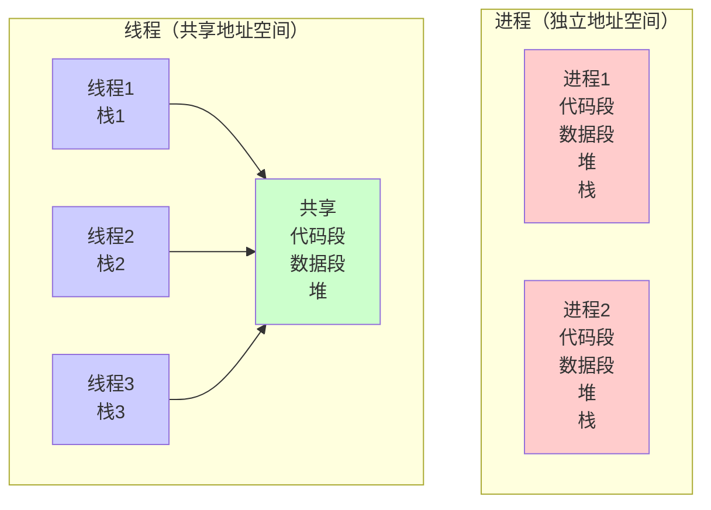

## 切换开销对比

### 进程切换

```mermaid
flowchart TD
    A[保存当前进程上下文] --> B[切换页表]
    B --> C[刷新 TLB]
    C --> D[切换内核栈]
    D --> E[恢复新进程上下文]
    E --> F[切换完成]
    
    Note over A,F: 开销大<br/>通常需要微秒级时间
    
    style A fill:#ffcccc
    style F fill:#ccffcc
```

### 线程切换

```mermaid
flowchart TD
    A[保存寄存器] --> B[切换栈指针]
    B --> C[恢复寄存器]
    C --> D[切换完成]
    
    Note over A,D: 开销小<br/>通常需要纳秒级时间
    
    style A fill:#ccffcc
    style D fill:#90EE90
```

## 使用场景

### 适合使用进程的场景

1. **需要隔离的任务**
   - Web 服务器（每个请求一个进程）
   - 系统服务（相互独立）
   - 安全要求高的应用

2. **需要利用多核 CPU**
   - CPU 密集型任务
   - 并行计算
   - 批处理任务

3. **容错性要求高**
   - 一个任务失败不影响其他任务
   - 需要进程级别的隔离

### 适合使用线程的场景

1. **需要协作的任务**
   - 多线程服务器（共享连接池）
   - GUI 应用（UI 线程 + 工作线程）
   - 生产者-消费者模式

2. **I/O 密集型任务**
   - 网络 I/O（多线程处理连接）
   - 文件 I/O（并行读写）
   - 数据库操作

3. **需要共享数据**
   - 共享缓存
   - 共享数据结构
   - 实时协作

## 线程分类

## 用户线程
## 内核线程

## 实际应用示例

### 示例1：多进程 Web 服务器

```c
#include <stdio.h>
#include <unistd.h>
#include <sys/wait.h>
#include <sys/socket.h>

void handle_request(int client_fd) {
    // 处理客户端请求
    // ...
    close(client_fd);
}

int main() {
    int server_fd, client_fd;
    
    // 创建服务器套接字
    server_fd = socket(AF_INET, SOCK_STREAM, 0);
    // bind, listen...
    
    while (1) {
        client_fd = accept(server_fd, NULL, NULL);
        
        pid_t pid = fork();
        if (pid == 0) {
            // 子进程处理请求
            close(server_fd);
            handle_request(client_fd);
            exit(0);
        } else {
            // 父进程继续监听
            close(client_fd);
            waitpid(-1, NULL, WNOHANG);  // 非阻塞等待
        }
    }
    
    return 0;
}
```

### 示例2：多线程 Web 服务器

```c
#include <stdio.h>
#include <pthread.h>
#include <sys/socket.h>

void *handle_request(void *arg) {
    int client_fd = *(int *)arg;
    // 处理客户端请求
    // ...
    close(client_fd);
    free(arg);
    return NULL;
}

int main() {
    int server_fd, client_fd;
    pthread_t thread;
    
    // 创建服务器套接字
    server_fd = socket(AF_INET, SOCK_STREAM, 0);
    // bind, listen...
    
    while (1) {
        client_fd = accept(server_fd, NULL, NULL);
        
        int *client_ptr = malloc(sizeof(int));
        *client_ptr = client_fd;
        
        pthread_create(&thread, NULL, handle_request, client_ptr);
        pthread_detach(thread);  // 分离线程
    }
    
    return 0;
}
```

## 性能考虑

### 进程 vs 线程性能对比

| 操作 | 进程 | 线程 |
|------|------|------|
| **创建时间** | 较慢（毫秒级） | 较快（微秒级） |
| **切换时间** | 较慢（微秒级） | 较快（纳秒级） |
| **内存占用** | 较大（独立地址空间） | 较小（共享地址空间） |
| **通信开销** | 较大（需要 IPC） | 较小（直接访问） |

### 选择建议

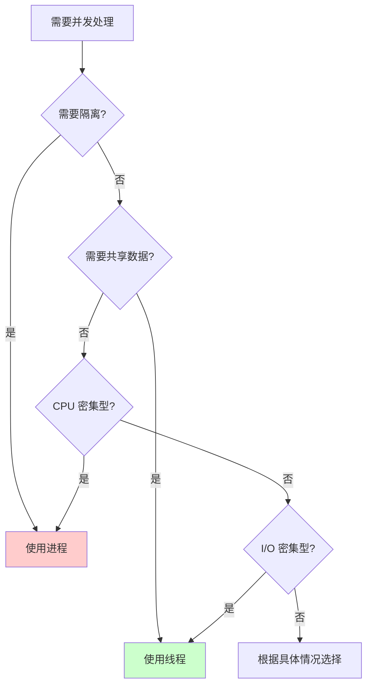

## 查看进程和线程

### 查看进程

```sh
# 查看所有进程
➜ ps aux

# 查看进程树
➜ pstree

# 查看进程详细信息
➜ ps -ef

# 查看特定进程
➜ ps -p <pid>
```

### 查看线程

```sh
# 查看线程（ps -T 或 ps -eLf）
➜ ps -eLf | grep <process_name>

# 查看进程的所有线程
➜ ps -T -p <pid>

# 使用 top 查看线程
➜ top -H -p <pid>

# 使用 htop 查看线程
➜ htop
# 按 H 键显示线程
```

### 查看进程和线程数量

```sh
# 查看进程数量
➜ ps aux | wc -l

# 查看线程数量
➜ ps -eLf | wc -l

# 查看特定进程的线程数
➜ ps -T -p <pid> | wc -l
```

## 常见问题

### 问题1：进程 vs 线程的选择

**选择进程的情况：**
- 需要强隔离
- 需要容错性
- CPU 密集型任务
- 需要利用多核

**选择线程的情况：**
- 需要共享数据
- I/O 密集型任务
- 需要快速通信
- 资源受限

### 问题2：多进程 vs 多线程的性能

**多进程优势：**
- 更好的隔离性
- 更好的容错性
- 可以利用多核 CPU

**多线程优势：**
- 更低的创建和切换开销
- 更快的通信速度
- 更少的内存占用

### 问题3：线程安全问题

**问题：**
- 多个线程访问共享数据
- 可能导致数据竞争
- 需要同步机制

**解决方案：**
- 使用互斥锁
- 使用条件变量
- 使用原子操作
- 使用无锁数据结构

## 最佳实践

### 1. 进程设计

- **合理使用进程池**：避免频繁创建/销毁进程
- **进程间通信**：选择合适的 IPC 方式
- **资源管理**：及时清理子进程，避免僵尸进程
- **错误处理**：正确处理 fork() 失败等情况

### 2. 线程设计

- **线程数量**：不要创建过多线程（通常 CPU 核心数 × 2）
- **线程同步**：正确使用锁和同步原语
- **避免死锁**：按顺序获取锁，使用超时机制
- **线程安全**：确保共享数据的线程安全

### 3. 混合使用

在实际应用中，可以混合使用进程和线程：

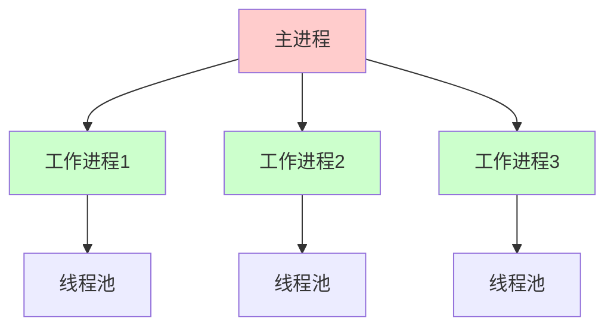

**示例：**
- 主进程管理多个工作进程
- 每个工作进程使用线程池处理任务
- 结合进程隔离和线程效率的优势

# 总结

进程和线程是操作系统的核心概念：

## 核心要点

1. **进程**：资源分配的基本单位，独立地址空间
2. **线程**：CPU 调度的基本单位，共享地址空间
3. **选择**：根据需求选择进程或线程
4. **性能**：线程开销小，但需要同步
5. **隔离**：进程隔离性好，线程需要同步

## 使用建议

- **需要隔离**：使用进程
- **需要协作**：使用线程
- **CPU 密集型**：使用进程或多线程
- **I/O 密集型**：使用多线程
- **混合场景**：进程 + 线程池

理解进程和线程的区别和特点，对于系统设计、性能优化和问题诊断都非常重要。

# 参考文献

* [Linux 进程管理](https://www.kernel.org/doc/html/latest/)
* [POSIX Threads Programming](https://computing.llnl.gov/tutorials/pthreads/)
* [Advanced Programming in the UNIX Environment](https://www.apuebook.com/)
* [Operating System Concepts](https://www.os-book.com/)
