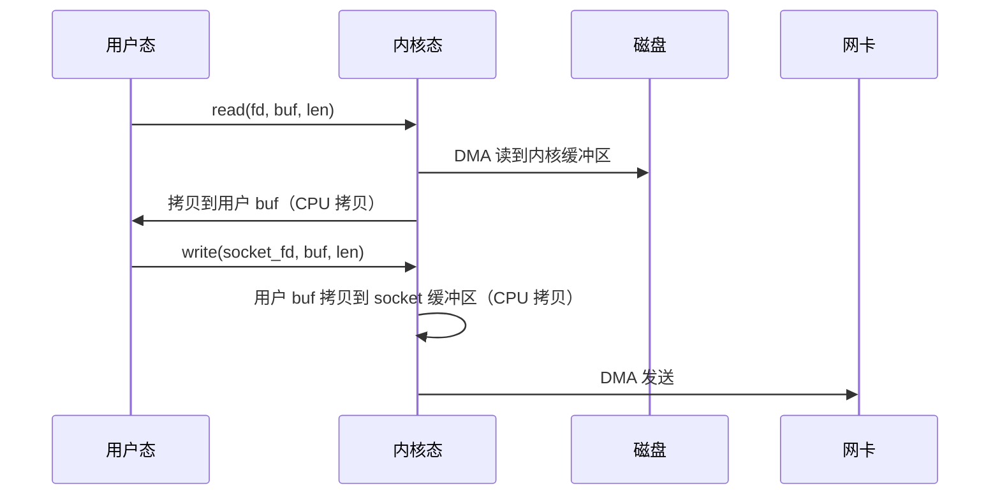
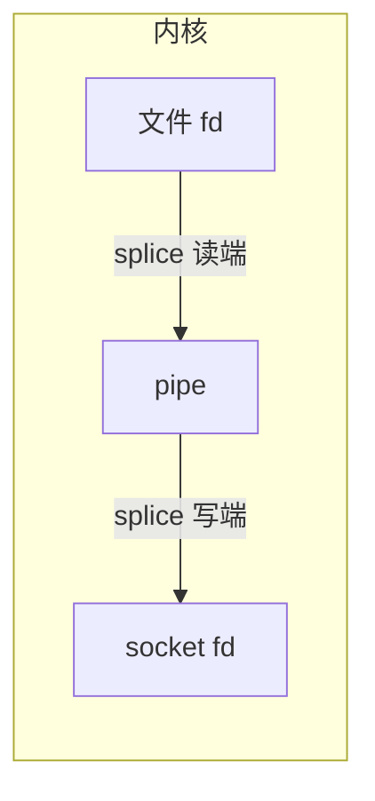

# 概述

**零拷贝（Zero-Copy）** 指在数据传递过程中，尽量减少甚至避免在用户态与内核态之间、以及内核内部多次拷贝数据，从而降低 CPU 占用和延迟，提高吞吐，常用于文件服务、代理、网关等场景。

传统 `read()` + `write()` 方式在“从文件发到网络”时，数据会经历：**磁盘 → 内核缓冲区 → 用户缓冲区 → 内核 socket 缓冲区 → 网卡**，多次拷贝和上下文切换。零拷贝系统调用把部分或全部工作放在内核完成，减少或去掉用户态参与的数据拷贝。

# 传统方式的数据拷贝

以“从文件读取并发送到网络”为例：



- **至少 2 次 CPU 参与的数据拷贝**：内核缓冲区 → 用户缓冲区，用户缓冲区 → socket 缓冲区。
- **2 次系统调用**：read、write，带来上下文切换。
- 数据量大时 CPU 和内存带宽浪费明显。

# sendfile

`sendfile()` 在内核中把数据从一个文件描述符“搬”到另一个文件描述符，**不经过用户态缓冲区**，实现零拷贝。

## 原型

```c
#include <sys/sendfile.h>

ssize_t sendfile(int out_fd, int in_fd, off_t *offset, size_t count);
```

- **out_fd**：写目标，必须是支持类似 `write()` 语义的 fd（如 socket）。
- **in_fd**：读来源，必须是支持类似 `mmap()` 的文件 fd（普通文件，不能是 socket）。
- **offset**：从 in_fd 的何处开始读；调用后会被更新为下一次应读的位置。
- **count**：最多拷贝的字节数。
- **返回值**：成功为拷贝的字节数，0 表示读到 in_fd 末尾；失败为 -1 并设置 `errno`。

## 数据流


数据从 in_fd 对应的内核缓冲区直接到 out_fd 对应的内核缓冲区（再到网卡），**不经过用户态**。

## 使用示例（C）

```c
#include <fcntl.h>
#include <sys/sendfile.h>
#include <sys/stat.h>
#include <unistd.h>

int send_file_to_socket(int file_fd, int socket_fd, off_t *offset, size_t count) {
    ssize_t sent = sendfile(socket_fd, file_fd, offset, count);
    if (sent < 0)
        return -1;
    return (int)sent;
}

// 典型用法：发整个文件
int send_whole_file(int file_fd, int socket_fd) {
    struct stat st;
    if (fstat(file_fd, &st) != 0)
        return -1;
    off_t off = 0;
    size_t total = st.st_size;
    while (total > 0) {
        ssize_t n = sendfile(socket_fd, file_fd, &off, total);
        if (n <= 0)
            return n == 0 ? 0 : -1;
        total -= (size_t)n;
    }
    return 0;
}
```

## 特点与限制

- **优点**：零拷贝、少系统调用、适合“文件 → 网络”场景（如静态文件服务）。
- **限制**：
  - in_fd 必须是**可 mmap 的文件**（如普通文件），不能是 socket、管道等。
  - out_fd 通常是 **socket**；在 Linux 2.6.33+ 也可以是普通文件（此时相当于内核内文件拷贝）。
- 部分平台或老内核上 out_fd 必须是 socket，可查 `man sendfile`。

---

# splice

`splice()` 在内核中在**两个文件描述符**之间移动数据，且**至少有一端是管道（pipe）**。数据可以不经过用户态，实现零拷贝。

## 原型

```c
#define _GNU_SOURCE
#include <fcntl.h>
#include <unistd.h>

ssize_t splice(int fd_in, off_t *off_in, int fd_out, off_t *off_out, size_t len, unsigned int flags);
```

- **fd_in / fd_out**：源、目标 fd。
- **off_in / off_out**：偏移；若 fd 是管道则必须为 NULL。
- **len**：移动的字节数上限。
- **flags**：如 `SPLICE_F_MOVE`（尝试移动页而非拷贝）、`SPLICE_F_NONBLOCK`（非阻塞）等。
- **返回值**：成功为移动的字节数，0 表示无数据可移动（如管道写端关闭）；失败为 -1。

## 典型用法：文件 → 管道 → socket



- 第一次 `splice(file_fd, ..., pipe_wr, ..., len, flags)`：从文件“搬”到管道写端。
- 第二次 `splice(pipe_rd, ..., socket_fd, ..., len, flags)`：从管道读端“搬”到 socket。
- 数据在内核中流动，用户态不触碰数据内容，实现零拷贝。

## 使用示例（C）

```c
#define _GNU_SOURCE
#include <fcntl.h>
#include <unistd.h>

int send_file_to_socket_via_pipe(int file_fd, int socket_fd, size_t count) {
    int pipefd[2];
    if (pipe(pipefd) != 0)
        return -1;

    size_t total = 0;
    while (total < count) {
        ssize_t n = splice(file_fd, NULL, pipefd[1], NULL, count - total, SPLICE_F_MOVE);
        if (n <= 0)
            break;
        total += (size_t)n;

        size_t to_send = (size_t)n;
        while (to_send > 0) {
            ssize_t m = splice(pipefd[0], NULL, socket_fd, NULL, to_send, SPLICE_F_MOVE);
            if (m <= 0)
                goto out;
            to_send -= (size_t)m;
        }
    }
out:
    close(pipefd[0]);
    close(pipefd[1]);
    return total == count ? 0 : -1;
}
```

## 特点与限制

- **优点**：可连接任意“可 splice”的 fd（文件、socket、管道等），灵活；数据可在内核中移动，零拷贝。
- **限制**：**至少一端必须是管道**，所以“文件 → socket”需要借助一个管道做“中转”，代码比 sendfile 复杂。
- **适用**：需要在内核里把“任意两个 fd”串起来时（如代理、转发），或不能直接用 sendfile 的场景。

---

# copy_file_range

`copy_file_range()` 在内核中从一个文件描述符拷贝一段数据到另一个文件描述符，**不经过用户态**，适合“文件到文件”的零拷贝。

## 原型

```c
#define _GNU_SOURCE
#include <unistd.h>

ssize_t copy_file_range(int fd_in, off_t *off_in, int fd_out, off_t *off_out, size_t len, unsigned int flags);
```

- **fd_in / fd_out**：源、目标文件 fd（通常都是普通文件）。
- **off_in / off_out**：输入、输出偏移；可为 NULL 表示使用各自当前偏移。
- **len**：拷贝字节数。
- **flags**：当前多为 0。
- **返回值**：成功为拷贝的字节数，失败为 -1。

## 特点

- 专门用于**文件 → 文件**，内核内完成拷贝，零拷贝、少上下文切换。
- 不涉及 socket，若目标是网络需配合 sendfile 或其他方式。

---

# 对比小结

| 系统调用           | 典型场景           | 是否零拷贝 | 备注                         |
|--------------------|--------------------|------------|------------------------------|
| read + write       | 通用                | 否         | 数据经用户态，多次拷贝       |
| sendfile           | 文件 → socket       | 是         | 使用简单，in 须为可 mmap 文件 |
| splice             | fd ↔ fd（经管道）   | 是         | 至少一端为管道，灵活         |
| copy_file_range    | 文件 → 文件         | 是         | 文件间拷贝专用               |

# 使用建议

- **静态文件发到网络**（如 HTTP 静态资源、下载）：优先考虑 **sendfile**，接口简单、零拷贝。
- **两 fd 间搬数据且有一端或两端不是普通文件**（如 socket ↔ socket、设备等）：用 **splice** + 管道。
- **纯文件到文件**（如备份、镜像）：可用 **copy_file_range**。
- 使用前用 `man sendfile`、`man splice`、`man copy_file_range` 确认本机内核与平台限制。
