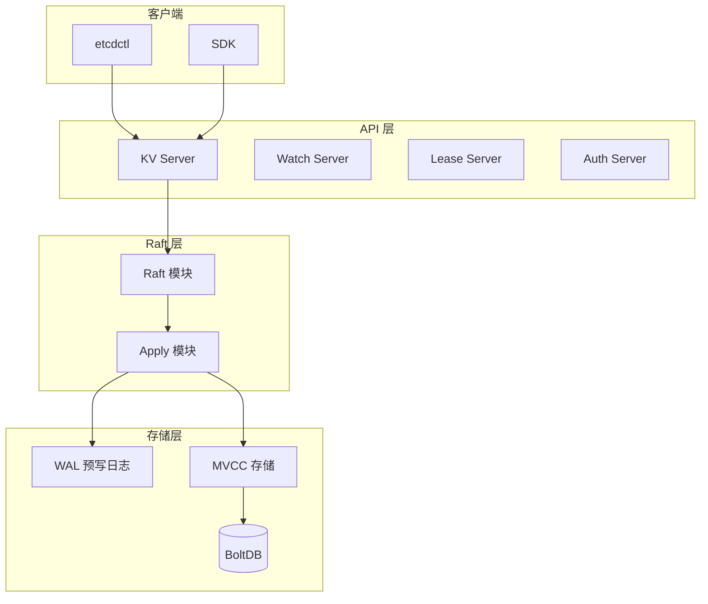
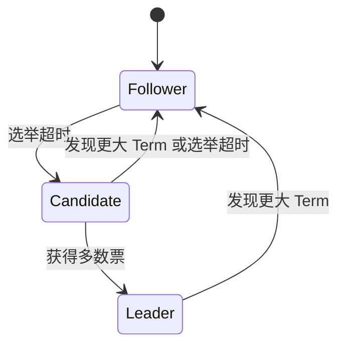
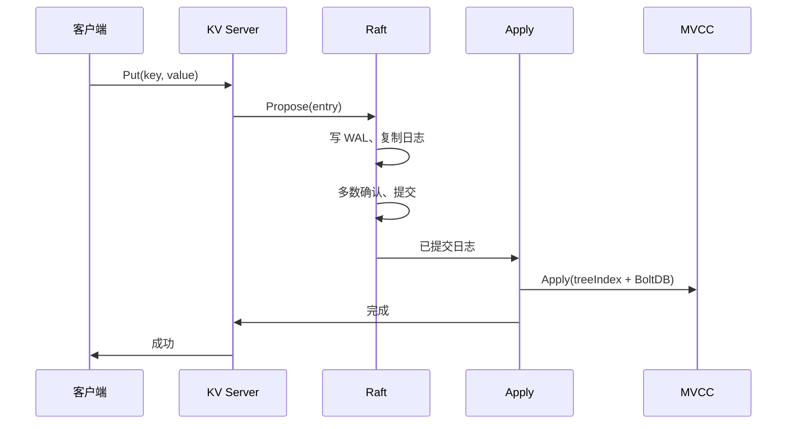

# 简介

etcd 是一个**分布式一致性键值存储**，由 CoreOS 发起、现由 CNCF 托管，使用 Go 编写。它基于 **Raft** 一致性算法管理高可用复制日志，广泛应用于 Kubernetes 集群元数据存储、服务发现与配置中心等场景。

核心特性：
- **简单**：基于 gRPC 的清晰 API（KV、Watch、Lease、Auth 等）
- **安全**：支持 TLS 与客户端证书认证
- **可靠**：通过 Raft 在多数节点间复制数据，保证强一致性
- **高性能**：v3 API 采用 MVCC 多版本并发控制，读写分离，适合读多写少场景

本文从整体架构、核心组件、数据模型与请求流程等方面介绍 etcd 的架构设计。

# 整体架构

etcd 从逻辑上可分为 **API 层**、**Raft 层**和**存储层**：客户端请求经 gRPC 进入，经 Raft 达成一致后，再在存储层持久化并对外提供查询。



- **API 层**：对外暴露 gRPC 接口（KV、Watch、Lease、Auth 等），将请求转为 Raft 提案或直接读本地状态机。
- **Raft 层**：负责 Leader 选举、日志复制与提交；提交后的日志由 Apply 模块应用到本地状态机。
- **存储层**：WAL 保证崩溃可恢复；MVCC + BoltDB 提供多版本键值存储与持久化。

## 代码：API 层 Put 到 Raft 提案

gRPC 收到 Put 后，封装为 `InternalRaftRequest`，再通过 `raftRequest` → `processInternalRaftRequestOnce` 序列化并提交给 Raft（`server/etcdserver/v3_server.go`）：

```go
// Put 入口：写请求统一走 Raft
func (s *EtcdServer) Put(ctx context.Context, r *pb.PutRequest) (*pb.PutResponse, error) {
    resp, err := s.raftRequest(ctx, pb.InternalRaftRequest{Put: r})
    if err != nil {
        return nil, err
    }
    return resp.(*pb.PutResponse), nil
}

// 序列化请求、注册等待、Propose、等待 Apply 结果
func (s *EtcdServer) processInternalRaftRequestOnce(ctx context.Context, r pb.InternalRaftRequest) (*apply2.Result, error) {
    // ...
    data, err = r.Marshal()
    ch := s.w.Register(id)
    err = s.r.Propose(cctx, data)  // 提交给 Raft
    if err != nil {
        s.w.Trigger(id, nil)
        return nil, err
    }
    select {
    case x := <-ch:  // 等待 Apply 完成并带回结果
        return x.(*apply2.Result), nil
    case <-cctx.Done():
        return nil, s.parseProposeCtxErr(cctx.Err(), start)
    // ...
    }
}
```

# 核心组件

## Raft 模块

etcd 使用 **Raft** 实现分布式共识，保证多副本间数据一致。

- **节点角色**：Leader（处理写请求、复制日志）、Follower（接收复制、参与投票）、Candidate（参与选举）。
- **任期（Term）**：单调递增，用于区分不同选举轮次。
- **日志复制**：写请求先落盘为 Raft 日志，由 Leader 复制到多数节点，提交后再应用到各节点状态机。
- **Leader 选举**：Follower 超时未收到 Leader 心跳则变为 Candidate，发起投票；获得多数票的节点成为新 Leader。



### 代码：Raft Ready 与 WAL 持久化

Raft 层在 `start()` 循环中处理 `Ready()`：先写快照（若有）、再 **Save(HardState, Entries)** 到 WAL，最后把已提交条目通过 `applyc` 发给 Apply 模块（`server/etcdserver/raft.go`）：

```go
// toApply：已提交条目与快照，交给 Apply 消费
type toApply struct {
    entries  []raftpb.Entry
    snapshot raftpb.Snapshot
    notifyc  chan struct{}
}

case rd := <-r.Ready():
    ap := toApply{
        entries: rd.CommittedEntries,
        snapshot: rd.Snapshot,
        notifyc:  notifyc,
    }
    r.applyc <- ap   // 发给 Apply 应用到状态机

    if !raft.IsEmptySnap(rd.Snapshot) {
        r.storage.SaveSnap(rd.Snapshot)  // 持久化快照
    }
    r.storage.Save(rd.HardState, rd.Entries)  // 写 WAL：硬状态 + 日志条目
    r.raftStorage.Append(rd.Entries)
    r.Advance()
```

## 存储层：WAL 与 BoltDB

### WAL（Write Ahead Log）

- **作用**：在修改内存/磁盘状态前，先把 Raft 状态与日志条目写入 WAL，保证崩溃后可按顺序重放，恢复状态。
- **文件**：通常位于 `member/wal/`，命名如 `0000000000000000-0000000000000000.wal`（`seq-index.wal`）。
- **内容**：Raft 硬状态（如 term、vote）、日志条目、快照元数据等，记录 8 字节对齐，带 CRC 校验。

### BoltDB（持久化后端）

- **作用**：etcd 使用 **bbolt**（B+ 树）作为持久化 KV 引擎，存放已应用到状态机的数据、成员与鉴权信息、以及 `consistent_index`（最后应用的 WAL 位置）等。
- **文件**：主库为 `member/snap/db`；从 Leader 拉取的完整快照为 `member/snap/*.snap.db`，用于落后节点追赶或恢复。

## MVCC 多版本存储

v2 使用全局大锁，并发与 Watch 能力受限。v3 引入 **MVCC**，实现无锁读与完整历史版本查询。

- **Revision（版本号）**：全局单调递增的 64 位整数，每次事务性写（Put/Delete 等）产生新 Revision。
- **treeIndex**：内存中的 B-tree，维护 **用户 key → revision** 的索引；每个 key 对应一个 keyIndex，记录其多代（generations）的 revision 历史。
- **Backend（BoltDB）**：实际存储键值，key 为 `revision` 编码，value 为具体数据；通过 treeIndex 从用户 key 查到 revision，再在 Backend 中取 value。

因此：
- **读**：根据 treeIndex 找到当前（或指定 revision）的 revision，再读 Backend，无需写锁。
- **写**：分配新 revision，更新 treeIndex 和 Backend，与读并发互不阻塞。
- **Watch**：可按 revision 订阅，避免事件丢失，并支持历史事件回放。

### 代码：Apply 解析 Raft 条目并应用

Apply 模块从 Raft 拿到已提交的 `Entry`，反序列化为 `InternalRaftRequest`，再交给具体 Applier 执行（如 KV Put）（`server/etcdserver/apply/apply.go`）：

```go
func Apply(lg *zap.Logger, e *raftpb.Entry, uberApply UberApplier, w wait.Wait, shouldApplyV3 membership.ShouldApplyV3) (ar *Result, id uint64) {
    var raftReq pb.InternalRaftRequest
    if !pbutil.MaybeUnmarshal(&raftReq, e.Data) {
        // 兼容 v2 请求格式
        var r pb.Request
        pbutil.MustUnmarshal(&r, e.Data)
        raftReq = v2ToV3Request(lg, (*RequestV2)(&r))
    }
    id = raftReq.ID
    if id == 0 {
        id = raftReq.Header.ID
    }
    needResult := w.IsRegistered(id)
    if needResult || !noSideEffect(&raftReq) {
        return uberApply.Apply(&raftReq, shouldApplyV3), id  // 真正执行 Put/Txn 等
    }
    return nil, id
}
```

### 代码：MVCC store 与 treeIndex

MVCC 存储由 `store` 内嵌 `kvindex`（treeIndex）和 Backend 组成；Revision 由 `currentRev` 维护（`server/storage/mvcc/kvstore.go`、`index.go`）：

```go
// store：读视图 + 写视图 + 索引 + 后端
type store struct {
    ReadView
    WriteView
    mu      sync.RWMutex
    b       backend.Backend
    kvindex index              // treeIndex，key -> revision 索引
    le      lease.Lessor
    revMu   sync.RWMutex
    currentRev  int64          // 最后完成的事务 revision
    compactMainRev int64
    // ...
}

// treeIndex：内存 B-tree，key 为 keyIndex
type treeIndex struct {
    sync.RWMutex
    tree *btree.BTree[*keyIndex]
}

// Put：若 key 已存在则更新其 keyIndex，否则插入新 keyIndex
func (ti *treeIndex) Put(key []byte, rev Revision) {
    keyi := &keyIndex{key: key}
    ti.Lock()
    defer ti.Unlock()
    okeyi, ok := ti.tree.Get(keyi)
    if !ok {
        keyi.put(ti.lg, rev.Main, rev.Sub)
        ti.tree.ReplaceOrInsert(keyi)
        return
    }
    okeyi.put(ti.lg, rev.Main, rev.Sub)
}
```

# 数据模型

## Revision

- 每次**写事务**提交时，全局 Revision +1。
- 一次事务中多个 key 的修改共享同一 Revision。
- 客户端可通过 **revision** 做快照读、历史查询和 Watch 起点。

## keyIndex 与 Generations

每个用户 key 在 treeIndex 中对应一个 **keyIndex**，包含：

- **key**：用户可见的 key。
- **modified revision**：该 key 最后一次修改对应的 revision。
- **generations**：该 key 的“代”列表；每次从无到有创建为一代开始，删除为一代结束，用于压缩与历史清理。

这样可支持“按 key 查历史版本”“按 revision 查全局快照”以及 Compact 等运维能力。

### 代码：keyIndex 与 generation

每个用户 key 对应一个 `keyIndex`，内部按“代”（generation）组织版本；Put 追加版本，Tombstone 结束当前代并开启新的空代（`server/storage/mvcc/key_index.go`）：

```go
// keyIndex：key 的多代版本信息
type keyIndex struct {
    key         []byte
    modified    Revision   // 最后一次修改的 revision
    generations []generation
}

// generation：一代内的多个 revision（如 put; put; tombstone 为一代）
type generation struct {
    ver     int64
    created Revision
    revs    []Revision
}

// put：在当前代追加 revision，新 key 则创建新 keyIndex 并设 created
func (ki *keyIndex) put(lg *zap.Logger, main int64, sub int64) {
    rev := Revision{Main: main, Sub: sub}
    if len(ki.generations) == 0 {
        ki.generations = append(ki.generations, generation{})
    }
    g := &ki.generations[len(ki.generations)-1]
    if len(g.revs) == 0 {
        g.created = rev
    }
    g.revs = append(g.revs, rev)
    g.ver++
    ki.modified = rev
}

// tombstone：在当前代追加墓碑 revision，并开启新的空代
func (ki *keyIndex) tombstone(lg *zap.Logger, main int64, sub int64) error {
    ki.put(lg, main, sub)
    ki.generations = append(ki.generations, generation{})
    return nil
}
```

# 请求流程

## 写请求（Put/Delete 等）

1. 客户端通过 gRPC 调用 KV API。
2. KV Server 将请求封装为 Raft 提案，提交给 Raft 模块。
3. Leader 将提案写入本地 WAL，并复制到多数 Follower。
4. 多数节点持久化并确认后，Leader 将日志标记为已提交。
5. Apply 模块将已提交日志应用到 MVCC：更新 treeIndex 与 BoltDB。
6. 返回成功给客户端。



## 读请求（Range）

- **串行读（Serializable）**：走 Raft 读，保证线性一致：先确认当前 Leader 与已提交进度，再读状态机，保证能看到此前全部已提交写。
- **本地读**：仅读本节点状态机，延迟低但不保证线性一致，适合对一致性要求稍弱的场景。

### 代码：Range 与线性一致读

当 `RangeRequest.Serializable == false` 时，先通过 `linearizableReadNotify` 与 Raft 达成“当前已提交进度”，再在本地 KV 上执行 Range，从而得到线性一致读（`server/etcdserver/v3_server.go`）：

```go
func (s *EtcdServer) Range(ctx context.Context, r *pb.RangeRequest) (*pb.RangeResponse, error) {
    var resp *pb.RangeResponse
    var err error
    if !r.Serializable {
        err = s.linearizableReadNotify(ctx)  // 与 Raft 同步：等已提交索引追上
        if err != nil {
            return nil, err
        }
    }
    chk := func(ai *auth.AuthInfo) error {
        return s.authStore.IsRangePermitted(ai, r.Key, r.RangeEnd)
    }
    get := func() { resp, _, err = txn.Range(ctx, s.Logger(), s.KV(), r) }  // 读本地 MVCC
    if serr := s.doSerialize(ctx, chk, get); serr != nil {
        return nil, serr
    }
    return resp, err
}
```

# 集群与高可用

- **节点数量**：建议 3、5、7 等奇数，便于多数派决策（如 3 节点容忍 1 故障，5 节点容忍 2 故障）。
- **数据一致性**：写仅在多数节点持久化并提交后才返回，读可选用串行读以获线性一致性。
- **故障恢复**：节点重启后从 WAL 重放；落后过多的节点可从 Leader 拉取快照（`snap.db`）再追 WAL，加快恢复。

# 小结

| 层次   | 组件        | 职责简述 |
|--------|-------------|----------|
| API 层 | gRPC Server | 暴露 KV/Watch/Lease/Auth 等接口 |
| Raft 层| Raft + Apply| 共识、日志复制、应用到状态机 |
| 存储层 | WAL         | 持久化 Raft 日志，保证可恢复 |
| 存储层 | MVCC + BoltDB | 多版本索引与键值持久化 |

etcd 通过 **Raft 保证多副本一致**，通过 **WAL + BoltDB 保证持久化与恢复**，通过 **MVCC 实现高并发读与历史版本**，共同构成其高可用、强一致的分布式键值存储架构。配合 [etcdctl 命令行交互](/middleware/etcd/etcdctl命令行交互.html) 可完成日常运维与排障。
