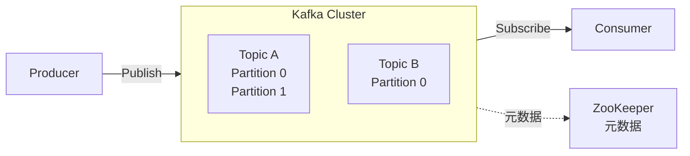
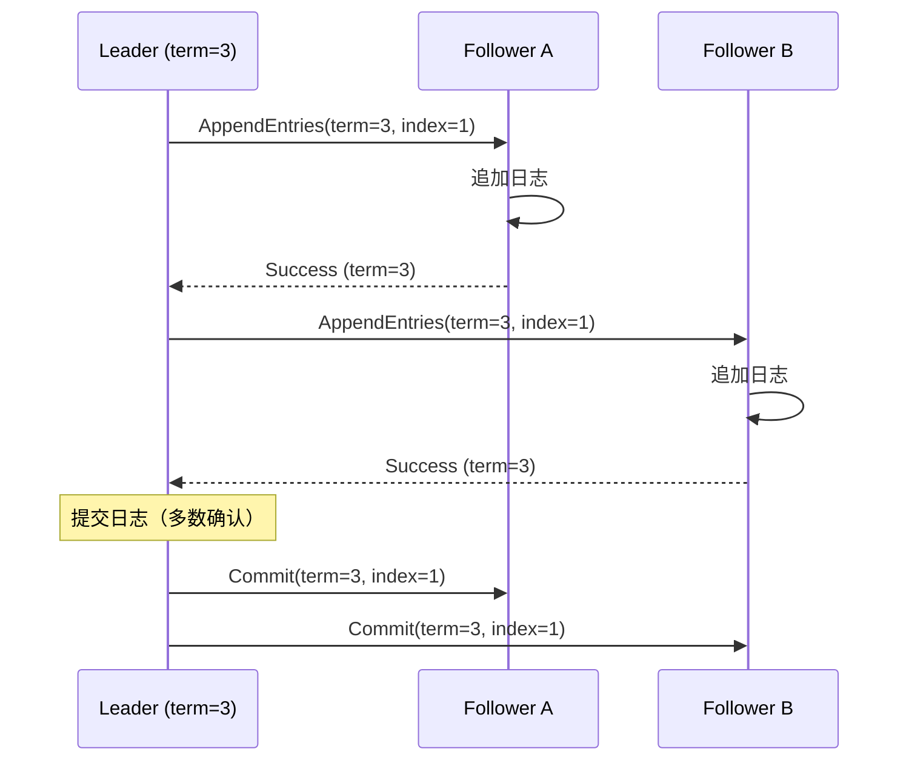
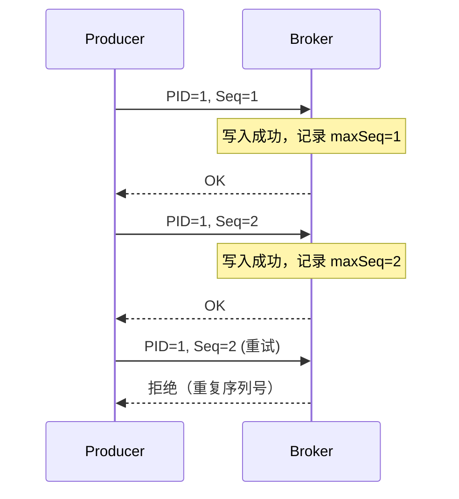
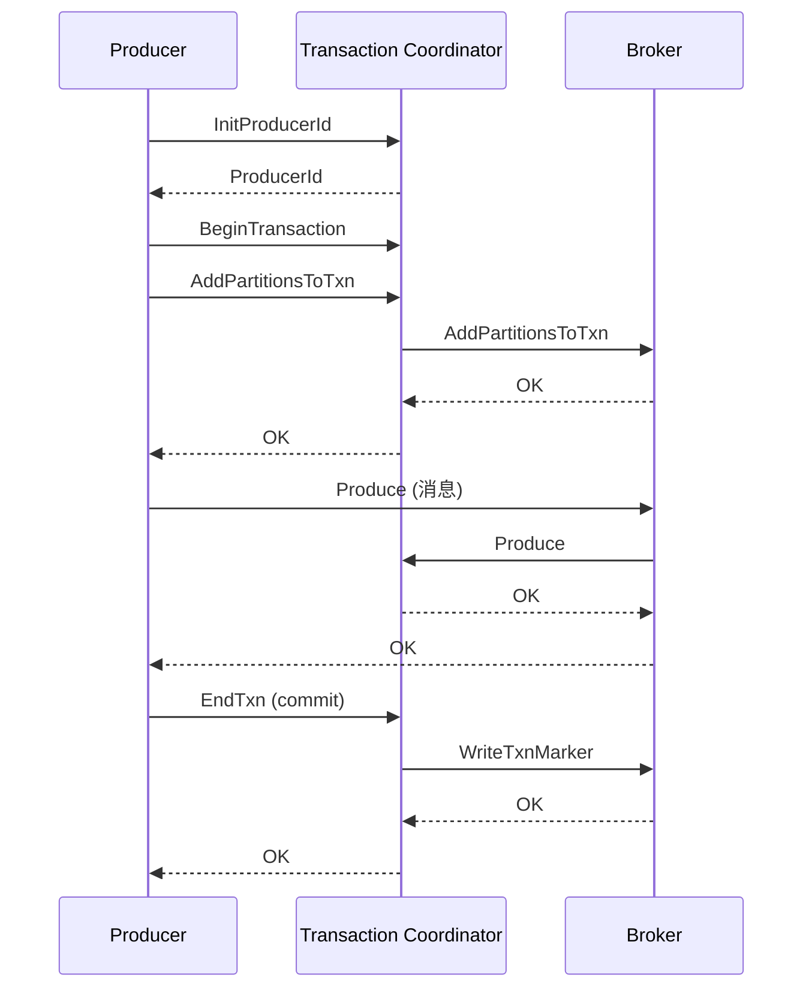
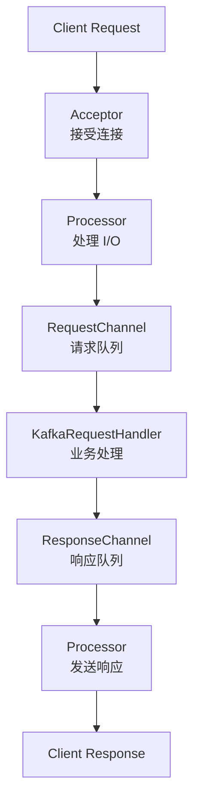

# Kafka核心模块详解

Apache Kafka 是一个分布式流处理平台，具有高吞吐量、低延迟、可扩展性强等特点，广泛应用于消息队列、流处理、日志收集等场景。本文详细介绍 Kafka 的核心模块及其工作原理。

## 1. Kafka架构概述

### 1.1 核心概念

Kafka 架构包含以下核心组件：

- **Broker**：Kafka 服务器节点，负责消息存储和转发
- **Topic**：消息主题，逻辑上的消息分类
- **Partition**：主题分区，物理上的消息存储单元
- **Producer**：消息生产者，向 Kafka 发送消息
- **Consumer**：消息消费者，从 Kafka 读取消息
- **Consumer Group**：消费者组，实现负载均衡和容错
- **Replica**：副本，实现高可用性
- **Leader/Follower**：主从副本，Leader 负责读写，Follower 负责同步

### 1.2 架构图



## 2. Broker核心模块

### 2.1 Broker架构

Broker 是 Kafka 的核心服务节点，负责消息的存储、转发和管理。每个 Broker 包含多个核心模块：

#### 2.1.1 网络层（Network Layer）

Kafka 使用 NIO（Non-blocking I/O）实现高性能网络通信：

```java
// Kafka 网络层核心组件
public class SocketServer {
    private Acceptor acceptor;           // 接受连接
    private Processor[] processors;      // 处理请求
    private RequestChannel requestChannel; // 请求通道
}
```

**工作流程**：

1. **Acceptor**：监听端口，接受客户端连接
2. **Processor**：处理网络 I/O，将请求放入请求队列
3. **KafkaRequestHandler**：从请求队列取出请求，执行业务逻辑
4. **Response**：将响应写入响应队列，由 Processor 发送给客户端

**关键特性**：

- 使用 Reactor 模式，一个 Acceptor 对应多个 Processor
- 每个 Processor 绑定一个 Selector，处理多个连接
- 请求和响应通过队列异步处理，提高吞吐量

#### 2.1.2 日志存储模块（Log Manager）

Kafka 的日志存储是其核心，所有消息都存储在日志文件中：

```scala
// Kafka Log 结构（简化）
class Log(val dir: File, 
          val config: LogConfig,
          val recoveryPoint: Long) {
  private val segments = new ConcurrentSkipListMap[java.lang.Long, LogSegment]
  private var activeSegment: LogSegment
}
```

**日志结构**：

```
topic-partition/
  ├── 00000000000000000000.log  (日志段文件)
  ├── 00000000000000000000.index (偏移量索引)
  ├── 00000000000000000000.timeindex (时间索引)
  ├── 00000000000001000000.log
  ├── 00000000000001000000.index
  └── ...
```

**日志段（Log Segment）**：

- **日志文件（.log）**：存储实际消息数据
- **索引文件（.index）**：偏移量索引，快速定位消息
- **时间索引（.timeindex）**：时间戳索引，按时间查找消息

**日志滚动（Log Rolling）**：

- 当日志段达到 `log.segment.bytes`（默认 1GB）时创建新段
- 当日志段超过 `log.roll.hours`（默认 7 天）时创建新段
- 旧日志段根据保留策略删除

#### 2.1.3 副本管理器（Replica Manager）

副本管理器负责管理分区的副本，确保数据的一致性和可用性：

```scala
// ReplicaManager 核心功能
class ReplicaManager {
  def appendMessages(): Unit        // 追加消息到副本
  def fetchMessages(): Unit         // 从副本读取消息
  def becomeLeaderOrFollower(): Unit // Leader 选举
  def stopReplicas(): Unit          // 停止副本
}
```

**副本同步机制**：

1. **Leader 副本**：
   - 处理所有读写请求
   - 维护 ISR（In-Sync Replicas）列表
   - 向 Follower 副本同步数据

2. **Follower 副本**：
   - 定期从 Leader 拉取数据
   - 向 Leader 发送拉取请求
   - 同步到 Leader 的最新 LEO（Log End Offset）

3. **ISR（In-Sync Replicas）**：
   - 与 Leader 保持同步的副本集合
   - Follower 在 `replica.lag.time.max.ms` 时间内追上 Leader 的 LEO
   - 只有 ISR 中的副本才能参与 Leader 选举

#### 2.1.4 控制器（Controller）

Controller 是 Kafka 集群的大脑，负责集群元数据管理和分区管理：

```scala
// Controller 核心职责
class KafkaController {
  def onControllerFailover(): Unit     // Controller 选举
  def onBrokerFailure(): Unit          // Broker 故障处理
  def onPartitionReassignment(): Unit  // 分区重分配
  def onLeaderAndIsrChange(): Unit     // Leader 变更
}
```

**Controller 功能**：

1. **Broker 管理**：
   - 监听 Broker 的上线和下线
   - 维护 Broker 列表
   - 处理 Broker 故障

2. **分区管理**：
   - 创建和删除分区
   - Leader 选举
   - 分区重分配
   - ISR 变更通知

3. **元数据管理**：
   - 维护集群元数据
   - 向所有 Broker 同步元数据
   - 响应客户端元数据请求

**Controller 选举**：

Kafka 支持两种 Controller 选举方式：

1. **ZooKeeper 模式**（传统模式，Kafka 2.8.0 之前）：
   - 使用 ZooKeeper 实现 Controller 选举
   - `/controller` 临时节点，第一个创建的 Broker 成为 Controller
   - Controller 故障时，其他 Broker 重新选举

2. **KRaft 模式**（Kafka 2.8.0+，推荐）：
   - 使用 Raft 协议实现 Controller 选举和元数据管理
   - 不再依赖 ZooKeeper
   - 提供更好的性能和可扩展性

### 2.1.4.1 Raft 协议详解

Raft 是一种分布式一致性算法，用于管理复制日志的一致性。Kafka 使用 Raft 协议（KRaft）实现元数据管理和 Controller 选举。

#### Raft 协议基本原理

Raft 协议通过选举 Leader 来管理复制日志，确保集群中所有节点的一致性。

**核心概念**：

1. **Leader（领导者）**：
   - 处理所有客户端请求
   - 管理日志复制
   - 只有一个 Leader

2. **Follower（跟随者）**：
   - 被动接收 Leader 的日志条目
   - 不处理客户端请求
   - 可以参与选举

3. **Candidate（候选者）**：
   - 选举过程中的临时状态
   - 发起选举请求
   - 获得多数票后成为 Leader

**节点状态转换**：

```
Follower -> Candidate -> Leader
    ^         |            |
    |         |            |
    +---------+------------+
```

#### Raft 协议核心机制

**1. Leader 选举（Leader Election）**

**选举触发条件**：

- Follower 在 `election timeout` 内未收到 Leader 的心跳
- 节点启动时没有发现 Leader

**选举流程**：

```
1. Follower 超时，转换为 Candidate
2. Candidate 增加自己的 term（任期）
3. Candidate 向所有节点发送 RequestVote 请求
4. 节点投票（每个 term 只能投一次票）
5. Candidate 获得多数票后成为 Leader
6. Leader 向所有节点发送心跳，阻止新的选举
```

**选举示例**：

```
集群：3 个节点（A, B, C）

初始状态：
A: Leader (term=1)
B: Follower (term=1)
C: Follower (term=1)

A 故障：
B: Follower (term=1) -> 超时 -> Candidate (term=2)
C: Follower (term=1) -> 超时 -> Candidate (term=2)

B 和 C 同时发起选举：
B 发送 RequestVote(term=2) -> C 投票给 B
C 发送 RequestVote(term=2) -> B 投票给 C

结果：B 和 C 各得 1 票，未达到多数（2票）
重新选举...

B 先超时：
B: Candidate (term=3) -> 发送 RequestVote
C: Follower (term=2) -> 收到请求，投票给 B
B: 获得 2 票（多数）-> Leader (term=3)
```

**选举超时（Election Timeout）**：

- 随机时间：150ms - 300ms（避免同时选举）
- 必须大于心跳间隔（Heartbeat Interval）
- 超时后发起新选举

**2. 日志复制（Log Replication）**

**复制流程**：

```
1. Leader 接收客户端请求
2. Leader 将日志条目追加到本地日志
3. Leader 并行向所有 Follower 发送 AppendEntries
4. Follower 收到后追加到本地日志，返回成功
5. Leader 收到多数 Follower 的确认后，提交日志条目
6. Leader 通知 Follower 提交日志条目
```

**日志条目结构**：

```
Term: 任期号（单调递增）
Index: 日志索引（单调递增）
Command: 命令内容
```

**复制示例**：



**3. 安全性保证（Safety）**

**选举安全性**：

- 每个 term 只能有一个 Leader
- Leader 必须包含所有已提交的日志条目

**日志匹配（Log Matching）**：

- 如果两个日志条目有相同的 term 和 index，则内容相同
- 如果两个日志条目有相同的 term 和 index，则前面的条目也相同

**提交规则（Commit Rule）**：

- Leader 只能提交当前 term 的日志条目
- 必须等待多数节点确认后才能提交

#### Kafka 中的 Raft 协议（KRaft）

**KRaft 架构**：

Kafka 使用 Raft 协议管理元数据，包括：

- Controller 选举
- 元数据存储和复制
- 配置管理
- Topic 和 Partition 管理

**KRaft 节点角色**：

1. **Controller（元数据 Leader）**：
   - 使用 Raft 协议选举
   - 管理集群元数据
   - 处理元数据变更

2. **Broker**：
   - 从 Controller 获取元数据
   - 不参与 Raft 选举（仅 Controller 参与）

**KRaft 元数据存储**：

```
__cluster_metadata/
  ├── 0/  # Partition 0
  │   ├── 00000000000000000000.log
  │   ├── 00000000000000000000.index
  │   └── ...
  └── ...
```

**KRaft 工作流程**：

```
1. Controller 选举：
   - 多个 Controller 候选者参与 Raft 选举
   - 获得多数票的节点成为 Controller Leader
   - Controller Leader 管理元数据

2. 元数据变更：
   - Broker 向 Controller 发送元数据变更请求
   - Controller 将变更追加到 Raft 日志
   - 等待多数 Controller 节点确认
   - 提交元数据变更
   - 通知所有 Broker 更新元数据

3. 元数据同步：
   - Controller Follower 从 Leader 复制元数据
   - Broker 从 Controller 获取元数据
   - 保证所有节点元数据一致
```

**KRaft 配置**：

```properties
# 启用 KRaft 模式
process.roles=controller,broker  # 或 controller 或 broker

# Controller 配置
controller.quorum.voters=1@localhost:9093,2@localhost:9094,3@localhost:9095
controller.quorum.election.timeout.ms=1000
controller.quorum.fetch.timeout.ms=2000

# 元数据存储
metadata.log.dir=/var/lib/kafka/metadata
```

**KRaft vs ZooKeeper**：

| 特性 | ZooKeeper 模式 | KRaft 模式 |
|------|---------------|-----------|
| 依赖 | 需要 ZooKeeper | 无需外部依赖 |
| 性能 | 元数据操作较慢 | 元数据操作更快 |
| 扩展性 | 受 ZooKeeper 限制 | 更好的扩展性 |
| 复杂度 | 需要维护 ZooKeeper | 简化架构 |
| 版本 | Kafka < 2.8.0 | Kafka 2.8.0+ |

#### Raft 协议优势

**1. 强一致性**：

- 保证所有节点数据一致
- 通过多数确认保证安全性
- 防止数据丢失和冲突

**2. 高可用性**：

- Leader 故障时自动选举新 Leader
- 容忍少数节点故障（N 个节点容忍 (N-1)/2 个故障）
- 快速故障恢复

**3. 可理解性**：

- 算法简单易懂
- 状态机清晰
- 易于实现和调试

**4. 性能优化**：

- Leader 处理所有写请求，避免冲突
- 批量复制提高效率
- 减少网络往返

#### Raft 协议在 Kafka 中的应用场景

**1. Controller 选举**：

- 使用 Raft 选举 Controller Leader
- 保证只有一个活跃 Controller
- 快速故障恢复

**2. 元数据管理**：

- 使用 Raft 日志存储元数据
- 保证元数据一致性
- 支持元数据快照

**3. 配置管理**：

- 动态配置变更
- 配置版本控制
- 配置回滚

**4. Topic 和 Partition 管理**：

- Topic 创建和删除
- Partition 分配和重分配
- ISR 变更管理

#### Raft 协议实现细节

**1. 任期（Term）**：

- 单调递增的整数
- 每次选举增加
- 用于检测过期的 Leader

**2. 日志索引（Log Index）**：

- 单调递增的整数
- 每个日志条目有唯一索引
- 用于日志匹配和复制

**3. 提交索引（Commit Index）**：

- 已提交的最大日志索引
- 只有已提交的日志条目才能应用
- 通过多数确认更新

**4. 匹配索引（Match Index）**：

- 每个 Follower 已复制的最大索引
- Leader 用于跟踪复制进度
- 用于更新提交索引

**5. 下一索引（Next Index）**：

- Leader 发送给每个 Follower 的下一个索引
- 用于日志复制
- 失败时回退

#### Raft 协议故障处理

**1. Leader 故障**：

```
1. Follower 检测到 Leader 心跳超时
2. Follower 转换为 Candidate
3. 发起新选举
4. 选举新 Leader
5. 新 Leader 继续服务
```

**2. Follower 故障**：

```
1. Leader 检测到 Follower 无响应
2. Leader 继续服务（不影响多数）
3. Follower 恢复后从 Leader 同步日志
4. 追上后重新加入集群
```

**3. 网络分区**：

```
场景：5 个节点，分为 3+2 两个分区

大分区（3个节点）：
- 可以选举新 Leader
- 继续服务
- 处理客户端请求

小分区（2个节点）：
- 无法选举 Leader（未达到多数）
- 停止服务
- 等待网络恢复
```

**4. 日志不一致**：

```
1. Leader 检测到 Follower 日志不一致
2. Leader 回退 Next Index
3. 重新发送日志条目
4. Follower 删除冲突条目
5. 追加新条目
6. 同步完成
```

#### KRaft 迁移指南

**从 ZooKeeper 迁移到 KRaft**：

1. **准备阶段**：
   - 升级到 Kafka 2.8.0+
   - 准备 KRaft 配置
   - 备份元数据

2. **迁移步骤**：
   - 启动 KRaft Controller 节点
   - 迁移元数据到 KRaft
   - 验证元数据一致性
   - 切换 Broker 到 KRaft 模式
   - 停止 ZooKeeper

3. **验证**：
   - 验证元数据一致性
   - 验证功能正常
   - 监控性能指标

#### Raft 协议最佳实践

**1. 节点数量**：

- 建议奇数个节点（3, 5, 7）
- 容忍 (N-1)/2 个故障
- 3 节点：容忍 1 个故障
- 5 节点：容忍 2 个故障

**2. 超时配置**：

```properties
# 选举超时（必须大于心跳间隔）
controller.quorum.election.timeout.ms=1000

# 心跳间隔
controller.quorum.heartbeat.interval.ms=200

# 拉取超时
controller.quorum.fetch.timeout.ms=2000
```

**3. 网络优化**：

- 使用专用网络
- 减少网络延迟
- 保证网络带宽

**4. 监控指标**：

- Leader 选举次数
- 日志复制延迟
- 节点健康状态
- 元数据变更频率

#### Raft 协议总结

Kafka 使用 Raft 协议（KRaft）实现：

1. **Controller 选举**：通过 Raft 选举 Controller Leader
2. **元数据管理**：使用 Raft 日志存储和复制元数据
3. **一致性保证**：通过多数确认保证强一致性
4. **高可用性**：自动故障恢复，容忍少数节点故障

**KRaft 优势**：

- ✅ 无需 ZooKeeper，简化架构
- ✅ 更好的性能和可扩展性
- ✅ 强一致性保证
- ✅ 快速故障恢复

**适用场景**：

- ✅ 新部署的 Kafka 集群（推荐使用 KRaft）
- ✅ 需要简化架构的场景
- ✅ 需要更好性能的场景
- ✅ 大规模集群部署

#### 2.1.5 协调器（Coordinator）

Kafka 使用协调器管理消费者和事务：

**消费者组协调器（Group Coordinator）**：

```scala
// GroupCoordinator 核心功能
class GroupCoordinator {
  def handleJoinGroup(): Unit      // 处理加入组请求
  def handleSyncGroup(): Unit      // 处理同步组请求
  def handleHeartbeat(): Unit      // 处理心跳请求
  def handleLeaveGroup(): Unit     // 处理离开组请求
}
```

**职责**：

- 管理消费者组状态
- 处理消费者组 Rebalance
- 检测消费者故障（心跳超时）
- 分配分区给消费者

**事务协调器（Transaction Coordinator）**：

```scala
// TransactionCoordinator 核心功能
class TransactionCoordinator {
  def handleInitProducerId(): Unit    // 初始化 Producer ID
  def handleAddPartitionsToTxn(): Unit // 添加分区到事务
  def handleEndTxn(): Unit             // 提交或中止事务
}
```

**职责**：

- 管理事务状态
- 处理事务提交/中止
- 维护事务日志
- 处理事务超时

## 3. Topic 和 Partition

### 3.1 Topic 概念

Topic 是消息的逻辑分类，类似于数据库中的表：

- **命名规则**：可以使用字母、数字、下划线、连字符
- **分区**：每个 Topic 可以分为多个 Partition
- **副本**：每个 Partition 可以有多个 Replica

### 3.2 Partition 详解

Partition 是消息的物理存储单元，实现了水平扩展：

#### 3.2.1 Partition 的作用

- **水平扩展**：通过增加 Partition 提高吞吐量
- **并行处理**：不同 Partition 可以并行读写
- **负载均衡**：消息分散到多个 Partition

#### 3.2.2 Partition 分配

**Producer 分区分配策略**：

```java
// 分区分配策略
public interface Partitioner {
    int partition(String topic, Object key, byte[] keyBytes, 
                  Object value, byte[] valueBytes, Cluster cluster);
}
```

**常见策略**：

1. **指定分区**：直接指定 Partition ID
2. **Key 哈希**：根据 Key 的哈希值分配（相同 Key 到同一 Partition）
3. **轮询（Round-Robin）**：按顺序轮询分配
4. **随机**：随机分配（不推荐）

**Consumer 分区分配策略**：

1. **RangeAssignor**（默认）：
   - 按 Topic 的 Partition 范围分配
   - 可能导致分配不均

2. **RoundRobinAssignor**：
   - 轮询分配所有 Partition
   - 分配更均匀

3. **StickyAssignor**：
   - 尽量保持上次分配结果
   - 减少 Rebalance 时的分区迁移

4. **CooperativeStickyAssignor**：
   - 增量 Rebalance，减少停顿时间
   - Kafka 2.4+ 支持

### 3.3 Offset 管理

Offset 是消息在 Partition 中的位置，用于标识消息的顺序：

#### 3.3.1 Offset 存储

**Consumer Offset 存储位置**：

- **Kafka 内部 Topic**：`__consumer_offsets`
- **ZooKeeper**：旧版本使用（已废弃）

**`__consumer_offsets` 结构**：

```
Key: group_id + topic + partition
Value: offset + metadata + timestamp
```

#### 3.3.2 Offset 提交策略

1. **自动提交**：
   ```properties
   enable.auto.commit=true
   auto.commit.interval.ms=5000
   ```

2. **手动提交**：
   ```java
   consumer.commitSync();  // 同步提交
   consumer.commitAsync(); // 异步提交
   ```

3. **精确一次（Exactly Once）**：
   - 使用事务保证
   - 需要配置 `isolation.level=read_committed`

### 3.3.3 精确一次（Exactly Once）语义详解

精确一次（Exactly Once）语义保证消息既不丢失也不重复，是分布式系统中最严格的语义保证。

#### 3.3.3.1 精确一次语义的含义

- **不丢失（No Loss）**：消息一定会被处理
- **不重复（No Duplication）**：消息只会被处理一次
- **幂等性（Idempotence）**：重复操作产生相同结果

#### 3.3.3.2 Kafka 精确一次实现机制

Kafka 通过**幂等性（Idempotence）**和**事务（Transaction）**两个机制实现精确一次语义：

**1. 幂等性（Producer 端去重）**

幂等性保证单分区内消息不重复：

```properties
# Producer 配置
enable.idempotence=true
acks=all
retries=Integer.MAX_VALUE
max.in.flight.requests.per.connection=5
```

**工作原理**：

- **Producer ID（PID）**：每个 Producer 分配唯一的 PID
- **Sequence Number**：每个消息分配递增的序列号
- **Broker 去重**：Broker 维护每个 PID 的最大序列号，拒绝重复序列号的消息

**去重机制**：



**限制**：

- 只能保证单分区内的幂等性
- 不能保证跨分区的原子性
- 需要配合事务实现跨分区精确一次

**2. 事务（跨分区原子性）**

事务保证跨分区的原子性操作：

```properties
# Producer 配置
transactional.id=my-transactional-id
enable.idempotence=true  # 幂等性是事务的前提
acks=all
```

**事务流程**：

```java
// Producer 事务使用示例
Properties props = new Properties();
props.put("transactional.id", "my-transactional-id");
props.put("enable.idempotence", "true");
props.put("acks", "all");

KafkaProducer<String, String> producer = new KafkaProducer<>(props);

// 初始化事务
producer.initTransactions();

try {
    // 开始事务
    producer.beginTransaction();
    
    // 发送多条消息（可能跨多个分区）
    producer.send(new ProducerRecord<>("topic1", "key1", "value1"));
    producer.send(new ProducerRecord<>("topic2", "key2", "value2"));
    
    // 提交事务
    producer.commitTransaction();
} catch (Exception e) {
    // 中止事务
    producer.abortTransaction();
}
```

**事务两阶段提交（2PC）**：



**事务协调器（Transaction Coordinator）**：

- 管理事务状态
- 分配 Producer ID
- 处理事务提交/中止
- 维护事务日志（`__transaction_state` Topic）

**事务状态**：

- **Empty**：初始状态
- **Ongoing**：事务进行中
- **PrepareCommit**：准备提交
- **PrepareAbort**：准备中止
- **CompleteCommit**：提交完成
- **CompleteAbort**：中止完成

#### 3.3.3.3 Consumer 端精确一次保证

Consumer 端通过事务隔离级别和 Offset 事务提交实现精确一次：

**1. 事务隔离级别**

```properties
# Consumer 配置
isolation.level=read_committed  # 只读取已提交的消息
```

**隔离级别**：

- **read_uncommitted**（默认）：
  - 可以读取未提交的消息
  - 可能读取到事务中止的消息
  - 性能高，但不保证精确一次

- **read_committed**：
  - 只读取已提交的消息
  - 等待事务完成后再读取
  - 保证精确一次，但可能有延迟

**2. Offset 事务提交**

Consumer 的 Offset 提交也参与事务，保证"读-处理-写"的原子性：

```java
// Consumer 事务使用示例
Properties props = new Properties();
props.put("isolation.level", "read_committed");
props.put("enable.auto.commit", "false");

KafkaConsumer<String, String> consumer = new KafkaConsumer<>(props);
KafkaProducer<String, String> producer = new KafkaProducer<>(producerProps);

producer.initTransactions();

while (true) {
    ConsumerRecords<String, String> records = consumer.poll(Duration.ofMillis(100));
    
    try {
        producer.beginTransaction();
        
        // 处理消息
        for (ConsumerRecord<String, String> record : records) {
            // 业务处理
            String processed = process(record.value());
            
            // 发送处理结果
            producer.send(new ProducerRecord<>("output-topic", processed));
        }
        
        // 提交 Offset（参与事务）
        Map<TopicPartition, OffsetAndMetadata> offsets = new HashMap<>();
        for (TopicPartition partition : records.partitions()) {
            List<ConsumerRecord<String, String>> partitionRecords = 
                records.records(partition);
            long offset = partitionRecords.get(partitionRecords.size() - 1).offset();
            offsets.put(partition, new OffsetAndMetadata(offset + 1));
        }
        producer.sendOffsetsToTransaction(offsets, consumer.groupMetadata());
        
        // 提交事务
        producer.commitTransaction();
    } catch (Exception e) {
        // 中止事务
        producer.abortTransaction();
    }
}
```

**关键方法**：

- `sendOffsetsToTransaction()`：将 Offset 提交纳入事务
- 事务提交时，Offset 和消息一起提交
- 事务中止时，Offset 和消息一起回滚

#### 3.3.3.4 精确一次语义保证范围

Kafka 的精确一次语义保证：

**1. Producer 端**：
- ✅ 单分区内消息不重复（幂等性）
- ✅ 跨分区消息原子性（事务）
- ✅ 消息不丢失（acks=all + 事务）

**2. Consumer 端**：
- ✅ 不重复消费（事务 Offset 提交）
- ✅ 不丢失消息（手动提交 Offset）
- ✅ 只读取已提交消息（read_committed）

**3. 端到端（E2E）**：
- ✅ 从 Producer 到 Consumer 的精确一次
- ✅ 需要 Producer 和 Consumer 都使用事务
- ✅ Offset 提交参与事务

#### 3.3.3.5 精确一次语义的限制

**1. 性能影响**：

- 事务需要两阶段提交，增加延迟
- `read_committed` 需要等待事务完成，可能增加消费延迟
- 事务日志需要持久化，影响吞吐量

**2. 使用限制**：

- 必须使用事务 Producer
- Consumer 必须设置 `isolation.level=read_committed`
- 必须手动提交 Offset（禁用自动提交）
- Offset 提交必须参与事务

**3. 故障场景**：

- Producer 故障：事务可能处于中间状态，需要事务超时机制
- Broker 故障：事务状态可能不一致，需要事务恢复机制
- Consumer 故障：Offset 未提交，可能重复消费

#### 3.3.3.6 精确一次最佳实践

**1. 配置建议**：

```properties
# Producer 配置
transactional.id=my-transactional-id
enable.idempotence=true
acks=all
retries=Integer.MAX_VALUE
max.in.flight.requests.per.connection=5
transaction.timeout.ms=60000

# Consumer 配置
isolation.level=read_committed
enable.auto.commit=false
```

**2. 代码模式**：

```java
// 标准的事务模式
producer.initTransactions();

while (true) {
    try {
        producer.beginTransaction();
        
        // 1. 读取消息
        ConsumerRecords<String, String> records = consumer.poll(Duration.ofMillis(100));
        
        // 2. 处理消息
        for (ConsumerRecord<String, String> record : records) {
            // 业务逻辑
            process(record);
            
            // 3. 发送结果
            producer.send(new ProducerRecord<>("output-topic", result));
        }
        
        // 4. 提交 Offset（参与事务）
        producer.sendOffsetsToTransaction(offsets, consumer.groupMetadata());
        
        // 5. 提交事务
        producer.commitTransaction();
    } catch (Exception e) {
        // 6. 中止事务
        producer.abortTransaction();
        // 可选：记录错误日志
    }
}
```

**3. 事务超时处理**：

```properties
transaction.timeout.ms=60000  # 事务超时时间
```

- 事务超时后自动中止
- 防止长时间未提交的事务阻塞
- 需要根据业务处理时间合理设置

**4. 幂等性 Producer（无事务）**：

如果只需要单分区精确一次，可以使用幂等性 Producer（无需事务）：

```properties
# 简单场景：单分区精确一次
enable.idempotence=true
acks=all
```

- 性能更好
- 配置更简单
- 只保证单分区内不重复

#### 3.3.3.7 精确一次语义总结

Kafka 通过以下机制实现精确一次语义：

1. **幂等性**：Producer 端单分区去重
2. **事务**：跨分区原子性操作
3. **事务隔离**：Consumer 只读取已提交消息
4. **事务 Offset**：Offset 提交参与事务

**适用场景**：

- ✅ 金融交易系统
- ✅ 订单处理系统
- ✅ 数据一致性要求高的场景
- ✅ 需要端到端精确一次的场景

**不适用场景**：

- ❌ 对延迟敏感的场景（事务增加延迟）
- ❌ 对吞吐量要求极高的场景（事务影响性能）
- ❌ 可以容忍少量重复的场景（使用幂等性即可）

## 4. Producer 核心模块

### 4.1 Producer 架构

Producer 负责向 Kafka 发送消息，包含以下核心组件：

```java
// Producer 核心组件
public class KafkaProducer<K, V> {
    private ProducerInterceptors<K, V> interceptors;  // 拦截器
    private Serializer<K> keySerializer;              // Key 序列化器
    private Serializer<V> valueSerializer;            // Value 序列化器
    private Partitioner partitioner;                  // 分区器
    private RecordAccumulator accumulator;            // 消息累加器
    private Sender sender;                            // 发送线程
}
```

### 4.2 消息发送流程

#### 4.2.1 发送步骤

1. **序列化**：将 Key 和 Value 序列化为字节数组
2. **分区分配**：根据分区策略选择 Partition
3. **消息累加**：将消息放入 RecordAccumulator
4. **批量发送**：Sender 线程批量发送消息
5. **响应处理**：处理 Broker 响应，触发回调

#### 4.2.2 RecordAccumulator

消息累加器用于批量发送，提高吞吐量：

```java
// RecordAccumulator 结构
public class RecordAccumulator {
    private final ConcurrentMap<TopicPartition, Deque<ProducerBatch>> batches;
    private BufferPool bufferPool;  // 内存池
}
```

**工作原理**：

- 按 TopicPartition 分组缓存消息
- 当达到 `batch.size` 或 `linger.ms` 时触发发送
- 使用内存池管理缓冲区，减少 GC

#### 4.2.3 Sender 线程

Sender 是后台线程，负责实际的消息发送：

```java
// Sender 工作流程
public class Sender implements Runnable {
    public void run() {
        while (running) {
            // 1. 获取可发送的批次
            Map<Node, List<ProducerBatch>> batches = accumulator.ready();
            
            // 2. 创建请求
            List<ClientRequest> requests = createProduceRequests(batches);
            
            // 3. 发送请求
            client.send(requests);
            
            // 4. 处理响应
            handleResponses();
        }
    }
}
```

### 4.3 Producer 配置

**关键配置参数**：

```properties
# 基础配置
bootstrap.servers=localhost:9092
key.serializer=org.apache.kafka.common.serialization.StringSerializer
value.serializer=org.apache.kafka.common.serialization.StringSerializer

# 可靠性配置
acks=all                    # 等待所有副本确认
retries=3                   # 重试次数
max.in.flight.requests.per.connection=5  # 并发请求数

# 性能配置
batch.size=16384            # 批次大小（字节）
linger.ms=10                # 等待时间（毫秒）
buffer.memory=33554432      # 缓冲区大小
compression.type=gzip       # 压缩类型

# 分区配置
partitioner.class=org.apache.kafka.clients.producer.internals.DefaultPartitioner
```

### 4.4 消息可靠性保证

#### 4.4.1 acks 配置

- **acks=0**：不等待确认，可能丢失消息，吞吐量最高
- **acks=1**：只等待 Leader 确认，可能丢失消息（Leader 故障）
- **acks=all/-1**：等待所有 ISR 副本确认，最可靠，吞吐量较低

#### 4.4.2 幂等性（Idempotence）

开启幂等性，Producer 自动重试，避免重复消息：

```properties
enable.idempotence=true
```

**工作原理**：

- 每个 Producer 分配唯一的 PID（Producer ID）
- 每个消息分配唯一的序列号（Sequence Number）
- Broker 去重：相同 PID + 序列号的消息只写入一次

#### 4.4.3 事务（Transaction）

实现跨分区的事务语义：

```java
producer.initTransactions();
try {
    producer.beginTransaction();
    producer.send(record1);
    producer.send(record2);
    producer.commitTransaction();
} catch (Exception e) {
    producer.abortTransaction();
}
```

**事务配置**：

```properties
transactional.id=my-transactional-id
enable.idempotence=true  # 幂等性是事务的前提
```

## 5. Consumer 核心模块

### 5.1 Consumer 架构

Consumer 负责从 Kafka 读取消息，包含以下核心组件：

```java
// Consumer 核心组件
public class KafkaConsumer<K, V> {
    private ConsumerCoordinator coordinator;      // 协调器
    private Fetcher<K, V> fetcher;                // 消息拉取器
    private ConsumerInterceptors<K, V> interceptors; // 拦截器
    private SubscriptionState subscriptions;      // 订阅状态
}
```

#### 5.1.1 Fetch 连接与心跳连接的关系

在 Kafka Consumer 架构中，**Fetch 连接**和**心跳连接**是两个核心但相互独立的网络连接：

- **Fetch 连接**：Consumer 与 Broker（Leader节点）之间用于拉取实际消息数据的连接（由 `Fetcher` 组件发起）。每个目标分区对应一个与 Broker 的 Fetch 请求和连接，主要承担数据流量。
- **心跳连接**：Consumer 与 Group Coordinator 之间的连接，用于发送心跳（`Heartbeat`）、加入/离开组（`JoinGroup`/`LeaveGroup`）、分区分配、Offset 提交等 Group 管理相关的交互。

##### 关系与区别

- **对象不同**：Fetch 连接面向各个分区 Leader 的 Broker，心跳连接专用于与 Group Coordinator（专门管理 Group 的 Broker）通信。
- **功能不同**：
  - **Fetch 连接**只传递数据，不参与 Group 管理。
  - **心跳连接**负责维持 Consumer Group 状态、检测 Consumer 存活、触发和协同 Rebalance。
- **独立性**：二者连接和请求流量互不影响。即使 Fetch 拉取阻塞，心跳依然会周期性发送，以防止被 Group 移除导致 Rebalance。
- **时钟与容错性**：心跳有严格的超时 (`session.timeout.ms`、`heartbeat.interval.ms`)，而 Fetch 可以由应用自由控制拉取速率和间隔。

##### 注意事项

- 实际 Kafka 客户端通常使用单一物理连接池复用底层 Socket，但 Protocol 层面两类 API 相互独立。
- 如果 Consumer 长时间只拉 Fetch 不发心跳，可能会因超时被踢出 Group，发生 Rebalance。因此需要保证心跳线程和 Fetch 线程相互独立、互不阻塞。

**总结**：  
Consumer 和 Kafka Broker 之间有两种主要交互通道——Fetch 连接“取数据”，心跳连接“报平安”。二者协同保证消费高效和 Group 活性，但架构上各自独立，互不阻塞。


### 5.2 Consumer Group

Consumer Group 实现负载均衡和容错：

#### 5.2.1 Group 工作原理

- **一个 Partition 只能被一个 Consumer 消费**：保证消息顺序
- **一个 Consumer 可以消费多个 Partition**：实现负载均衡
- **Consumer 故障时，其 Partition 重新分配给其他 Consumer**

#### 5.2.2 Rebalance 机制

Rebalance 是 Consumer Group 重新分配分区的过程，确保分区在 Consumer 之间均匀分配。

**触发条件**：

1. Consumer 加入组
2. Consumer 离开组（主动或故障）
3. Partition 数量变化
4. 订阅的 Topic 变化
5. Consumer 心跳超时（`session.timeout.ms`）
6. Consumer 处理超时（`max.poll.interval.ms`）

### 5.2.2.1 Rebalance 实现细节

#### Group Coordinator 的作用

Group Coordinator 是负责管理 Consumer Group 的 Broker，每个 Consumer Group 都有一个 Coordinator：

**Coordinator 选择**：

```java
// Coordinator 选择算法
int partition = Math.abs(groupId.hashCode()) % __consumer_offsets.partitionCount;
int coordinatorId = __consumer_offsets.partition(partition).leader;
```

- 使用 `__consumer_offsets` Topic 的 Partition 确定 Coordinator
- 通过 `groupId` 的哈希值选择 Partition
- 该 Partition 的 Leader 就是 Coordinator

**Coordinator 职责**：

1. 管理 Consumer Group 状态
2. 处理 Rebalance 请求
3. 检测 Consumer 故障
4. 维护 Group 元数据

#### Rebalance 协议流程

Rebalance 使用多个协议实现，包括 JoinGroup、SyncGroup、Heartbeat 等：

**1. FindCoordinator（查找 Coordinator）**

Consumer 首先需要找到自己 Group 的 Coordinator：

```
Consumer                    Broker
    |                          |
    |--- FindCoordinator ----->|
    |   (groupId)              |
    |                          |
    |<-- Coordinator Info ------|
    |   (coordinator_id)       |
```

**2. JoinGroup（加入组）**

Consumer 向 Coordinator 发送 JoinGroup 请求：

```
Consumer                    Coordinator
    |                          |
    |--- JoinGroup ----------->|
    |   (groupId, memberId,    |
    |    protocolType,         |
    |    protocols)            |
    |                          |
    |<-- JoinGroup Response ---|
    |   (memberId, generation, |
    |    groupProtocol,        |
    |    leaderId, members)    |
```

**JoinGroup 请求参数**：

- `groupId`：消费者组 ID
- `memberId`：成员 ID（首次为空，后续使用 Coordinator 分配的）
- `protocolType`：协议类型（"consumer"）
- `protocols`：支持的分区分配策略列表

**JoinGroup 响应**：

- `memberId`：Coordinator 分配的成员 ID
- `generation`：Generation ID（每次 Rebalance 递增）
- `groupProtocol`：选中的分区分配策略
- `leaderId`：Group Leader 的 memberId
- `members`：所有成员信息（只有 Leader 收到）

**3. SyncGroup（同步分配结果）**

Group Leader 执行分区分配，所有成员同步分配结果：

```
Consumer (Leader)          Coordinator          Consumer (Follower)
    |                          |                        |
    |--- SyncGroup ----------->|                        |
    |   (groupId, generation,  |                        |
    |    memberId, assignments)|                        |
    |                          |                        |
    |                          |--- SyncGroup --------->|
    |                          |   (groupId, generation,|
    |                          |    memberId)           |
    |                          |                        |
    |<-- SyncGroup Response ---|                        |
    |   (assignments)          |<-- SyncGroup Response -|
    |                          |   (assignments)        |
```

**SyncGroup 请求参数**：

- `groupId`：消费者组 ID
- `generation`：Generation ID
- `memberId`：成员 ID
- `assignments`：分区分配结果（只有 Leader 发送）

**SyncGroup 响应**：

- `assignments`：分配给该成员的分区列表

#### Rebalance 详细流程

**完整 Rebalance 流程**：

```
阶段 1：发现 Coordinator
Consumer -> FindCoordinator -> Broker
Broker -> Coordinator Info -> Consumer

阶段 2：加入组（JoinGroup）
Consumer -> JoinGroup -> Coordinator
Coordinator -> JoinGroup Response -> Consumer

阶段 3：分区分配（仅 Leader）
Consumer (Leader) -> 执行分区分配算法
Consumer (Leader) -> SyncGroup (assignments) -> Coordinator

阶段 4：同步分配结果（SyncGroup）
Coordinator -> SyncGroup Response (assignments) -> Consumer (Leader)
Coordinator -> SyncGroup Response (assignments) -> Consumer (Follower)

阶段 5：恢复消费
Consumer -> 开始消费分配的分区
```

**详细步骤**：

**步骤 1：Consumer 发现 Coordinator**

```java
// Consumer 查找 Coordinator
FindCoordinatorRequest request = new FindCoordinatorRequest(groupId);
FindCoordinatorResponse response = coordinator.findCoordinator(request);
Node coordinator = response.coordinator();
```

**步骤 2：Consumer 加入组**

```java
// Consumer 发送 JoinGroup 请求
JoinGroupRequest request = new JoinGroupRequest(
    groupId,
    memberId,           // 首次为空
    sessionTimeoutMs,
    rebalanceTimeoutMs,
    memberId,           // 成员 ID
    protocolType,       // "consumer"
    protocols           // 支持的分区分配策略
);

JoinGroupResponse response = coordinator.joinGroup(request);

if (response.leaderId().equals(response.memberId())) {
    // 当前 Consumer 是 Leader
    performAssignment(response.members());
}
```

**步骤 3：Group Leader 执行分区分配**

```java
// Group Leader 执行分区分配
public Map<String, List<TopicPartition>> performAssignment(
    Map<String, ConsumerProtocolSubscription> members) {
    
    // 1. 收集所有订阅的 Topic
    Set<String> topics = collectTopics(members);
    
    // 2. 获取所有 Partition
    List<TopicPartition> partitions = getPartitions(topics);
    
    // 3. 执行分配策略
    PartitionAssignor assignor = getAssignor();
    Map<String, List<TopicPartition>> assignments = 
        assignor.assign(partitions, members);
    
    return assignments;
}
```

**步骤 4：同步分配结果**

```java
// Leader 发送分配结果
SyncGroupRequest request = new SyncGroupRequest(
    groupId,
    generation,
    memberId,
    assignments  // 分区分配结果
);
SyncGroupResponse response = coordinator.syncGroup(request);

// Follower 同步分配结果
SyncGroupRequest request = new SyncGroupRequest(
    groupId,
    generation,
    memberId,
    null  // Follower 不发送分配结果
);
SyncGroupResponse response = coordinator.syncGroup(request);
List<TopicPartition> assignments = response.partitionAssignments();
```

#### 分区分配策略实现

**1. RangeAssignor（默认策略）**

按 Topic 的 Partition 范围分配：

```java
// RangeAssignor 实现
public Map<String, List<TopicPartition>> assign(
    List<TopicPartition> partitions,
    Map<String, ConsumerProtocolSubscription> members) {
    
    Map<String, List<TopicPartition>> assignments = new HashMap<>();
    
    // 按 Topic 分组
    Map<String, List<TopicPartition>> partitionsByTopic = 
        groupPartitionsByTopic(partitions);
    
    // 对每个 Topic 进行分配
    for (Map.Entry<String, List<TopicPartition>> entry : partitionsByTopic.entrySet()) {
        String topic = entry.getKey();
        List<TopicPartition> topicPartitions = entry.getValue();
        List<String> consumers = new ArrayList<>(members.keySet());
        Collections.sort(consumers);
        
        int partitionsPerConsumer = topicPartitions.size() / consumers.size();
        int consumersWithExtraPartition = topicPartitions.size() % consumers.size();
        
        int index = 0;
        for (int i = 0; i < consumers.size(); i++) {
            int start = index;
            int length = partitionsPerConsumer + 
                (i < consumersWithExtraPartition ? 1 : 0);
            
            List<TopicPartition> assigned = 
                topicPartitions.subList(start, start + length);
            assignments.computeIfAbsent(consumers.get(i), k -> new ArrayList<>())
                .addAll(assigned);
            
            index = start + length;
        }
    }
    
    return assignments;
}
```

**分配示例**：

```
Topic: test-topic
Partitions: [0, 1, 2, 3, 4, 5, 6, 7, 8, 9]
Consumers: [C1, C2, C3]

分配结果：
C1: [0, 1, 2, 3]      (4个分区)
C2: [4, 5, 6]         (3个分区)
C3: [7, 8, 9]         (3个分区)
```

**2. RoundRobinAssignor**

轮询分配所有 Partition：

```java
// RoundRobinAssignor 实现
public Map<String, List<TopicPartition>> assign(
    List<TopicPartition> partitions,
    Map<String, ConsumerProtocolSubscription> members) {
    
    Map<String, List<TopicPartition>> assignments = new HashMap<>();
    
    // 收集所有订阅的 Topic
    Set<String> allTopics = collectAllTopics(members);
    
    // 过滤出所有成员都订阅的 Partition
    List<TopicPartition> availablePartitions = partitions.stream()
        .filter(tp -> allTopics.contains(tp.topic()))
        .sorted()
        .collect(Collectors.toList());
    
    // 轮询分配
    List<String> consumers = new ArrayList<>(members.keySet());
    Collections.sort(consumers);
    
    for (int i = 0; i < availablePartitions.size(); i++) {
        String consumer = consumers.get(i % consumers.size());
        assignments.computeIfAbsent(consumer, k -> new ArrayList<>())
            .add(availablePartitions.get(i));
    }
    
    return assignments;
}
```

**分配示例**：

```
Topic: test-topic
Partitions: [0, 1, 2, 3, 4, 5, 6, 7, 8, 9]
Consumers: [C1, C2, C3]

分配结果：
C1: [0, 3, 6, 9]      (轮询分配)
C2: [1, 4, 7]         (轮询分配)
C3: [2, 5, 8]         (轮询分配)
```

**3. StickyAssignor**

尽量保持上次分配结果，减少分区迁移：

```java
// StickyAssignor 实现
public Map<String, List<TopicPartition>> assign(
    List<TopicPartition> partitions,
    Map<String, ConsumerProtocolSubscription> members) {
    
    // 1. 获取上次分配结果
    Map<String, List<TopicPartition>> previousAssignments = 
        getPreviousAssignments(members);
    
    // 2. 计算需要重新分配的分区
    Set<TopicPartition> allAssigned = previousAssignments.values().stream()
        .flatMap(List::stream)
        .collect(Collectors.toSet());
    
    List<TopicPartition> unassigned = partitions.stream()
        .filter(tp -> !allAssigned.contains(tp))
        .collect(Collectors.toList());
    
    // 3. 尽量保持原有分配
    Map<String, List<TopicPartition>> assignments = 
        new HashMap<>(previousAssignments);
    
    // 4. 分配未分配的分区（使用轮询）
    roundRobinAssign(unassigned, assignments, members);
    
    // 5. 平衡分配（如果需要）
    balanceAssignments(assignments, members);
    
    return assignments;
}
```

**4. CooperativeStickyAssignor（增量 Rebalance）**

支持增量 Rebalance，减少停顿时间：

```java
// CooperativeStickyAssignor 实现
public Map<String, List<TopicPartition>> assign(
    List<TopicPartition> partitions,
    Map<String, ConsumerProtocolSubscription> members) {
    
    // 1. 识别需要撤销的分区
    Map<String, List<TopicPartition>> revocations = 
        identifyRevocations(partitions, members);
    
    // 2. 识别需要分配的分区
    List<TopicPartition> unassigned = 
        identifyUnassigned(partitions, members);
    
    // 3. 增量分配（只分配新分区，不重新分配已有分区）
    Map<String, List<TopicPartition>> assignments = 
        incrementalAssign(unassigned, members);
    
    return assignments;
}
```

#### 心跳机制（Heartbeat）

Consumer 定期向 Coordinator 发送心跳，证明自己存活：

**心跳流程**：

```
Consumer                    Coordinator
    |                          |
    |--- Heartbeat ----------->|
    |   (groupId, generation,  |
    |    memberId)            |
    |                          |
    |<-- Heartbeat Response ---|
    |   (error_code)           |
```

**心跳配置**：

```properties
# 心跳配置
heartbeat.interval.ms=3000        # 心跳间隔（3秒）
session.timeout.ms=10000          # 会话超时（10秒）
max.poll.interval.ms=300000       # 最大轮询间隔（5分钟）
```

**心跳超时处理**：

1. Consumer 在 `session.timeout.ms` 内未发送心跳
2. Coordinator 认为 Consumer 故障
3. Coordinator 触发 Rebalance
4. 其他 Consumer 重新分配分区

**处理超时处理**：

1. Consumer 在 `max.poll.interval.ms` 内未调用 `poll()`
2. Coordinator 认为 Consumer 处理过慢
3. Coordinator 触发 Rebalance
4. 该 Consumer 被移出组

#### Generation 机制

Generation 用于标识 Rebalance 的版本，每次 Rebalance 递增：

**Generation 作用**：

1. **防止过期请求**：拒绝旧 Generation 的请求
2. **保证一致性**：确保所有 Consumer 使用相同的分配结果
3. **防止重复消费**：旧 Generation 的 Offset 提交被拒绝

**Generation 使用**：

```java
// Generation 在请求中的使用
JoinGroupRequest request = new JoinGroupRequest(
    groupId,
    memberId,
    generation  // 当前 Generation（首次为 -1）
);

// Coordinator 返回新的 Generation
JoinGroupResponse response = coordinator.joinGroup(request);
int newGeneration = response.generation();  // 新的 Generation

// 后续请求使用新的 Generation
SyncGroupRequest syncRequest = new SyncGroupRequest(
    groupId,
    newGeneration,  // 使用新的 Generation
    memberId,
    assignments
);
```

#### Rebalance 状态机

Consumer 在 Rebalance 过程中经历多个状态：

```
UNKNOWN -> FINDING_COORDINATOR -> JOINING -> STABLE
    |              |                |         |
    |              |                |         |
    +--------------+----------------+---------+
                    (Rebalance 触发)
```

**状态说明**：

1. **UNKNOWN**：初始状态，未找到 Coordinator
2. **FINDING_COORDINATOR**：正在查找 Coordinator
3. **JOINING**：正在加入组（Rebalance 进行中）
4. **STABLE**：稳定状态，正常消费

**状态转换**：

```java
// Consumer 状态转换
public enum MemberState {
    UNKNOWN,              // 未知状态
    FINDING_COORDINATOR,  // 查找 Coordinator
    JOINING,              // 加入组
    STABLE,               // 稳定状态
    LEAVING               // 离开组
}

// 状态转换逻辑
if (coordinator == null) {
    state = FINDING_COORDINATOR;
} else if (rebalanceInProgress) {
    state = JOINING;
} else {
    state = STABLE;
}
```

#### 增量 Rebalance（Cooperative Rebalancing）

Kafka 2.4+ 引入增量 Rebalance，减少停顿时间：

**传统 Rebalance（Stop The World）**：

```
1. 所有 Consumer 停止消费
2. 撤销所有分区分配
3. 重新分配所有分区
4. 恢复消费

问题：所有 Consumer 都停止消费
```

**增量 Rebalance（Cooperative Rebalancing）**：

```
1. 识别需要撤销的分区
2. 撤销需要撤销的分区（其他分区继续消费）
3. 重新分配新分区
4. 恢复消费

优势：只撤销需要撤销的分区，其他分区继续消费
```

**增量 Rebalance 实现**：

```java
// 增量 Rebalance 流程
public void onJoinComplete(int generation, String memberId, 
                          String groupProtocol,
                          ByteBuffer memberAssignment) {
    
    // 1. 解析新的分配结果
    Assignment assignment = deserializeAssignment(memberAssignment);
    Set<TopicPartition> newPartitions = assignment.partitions();
    
    // 2. 获取当前分配的分区
    Set<TopicPartition> currentPartitions = subscriptions.assignedPartitions();
    
    // 3. 计算需要撤销的分区
    Set<TopicPartition> revokedPartitions = new HashSet<>(currentPartitions);
    revokedPartitions.removeAll(newPartitions);
    
    // 4. 计算需要分配的新分区
    Set<TopicPartition> addedPartitions = new HashSet<>(newPartitions);
    addedPartitions.removeAll(currentPartitions);
    
    // 5. 撤销分区（如果使用增量 Rebalance，只撤销需要撤销的）
    if (revokedPartitions.isEmpty() || isIncrementalRebalance()) {
        // 增量 Rebalance：只撤销需要撤销的分区
        revokePartitions(revokedPartitions);
    } else {
        // 完整 Rebalance：撤销所有分区
        revokeAllPartitions();
    }
    
    // 6. 分配新分区
    assignPartitions(newPartitions);
}
```

**增量 Rebalance 配置**：

```properties
# 使用增量 Rebalance
partition.assignment.strategy=org.apache.kafka.clients.consumer.CooperativeStickyAssignor
```

#### Rebalance 性能优化

**1. 减少 Rebalance 频率**：

```properties
# 增加超时时间
session.timeout.ms=30000        # 30秒（默认10秒）
heartbeat.interval.ms=10000     # 10秒（默认3秒）
max.poll.interval.ms=600000     # 10分钟（默认5分钟）
```

**2. 使用增量 Rebalance**：

```properties
# 使用 CooperativeStickyAssignor
partition.assignment.strategy=org.apache.kafka.clients.consumer.CooperativeStickyAssignor
```

**3. 优化分区分配策略**：

- 使用 `StickyAssignor` 或 `CooperativeStickyAssignor`
- 减少分区迁移
- 保持分配稳定性

**4. 监控 Rebalance**：

```java
// 监控 Rebalance 指标
ConsumerRebalanceListener listener = new ConsumerRebalanceListener() {
    @Override
    public void onPartitionsRevoked(Collection<TopicPartition> partitions) {
        // 记录撤销的分区
        log.info("Partitions revoked: {}", partitions);
    }
    
    @Override
    public void onPartitionsAssigned(Collection<TopicPartition> partitions) {
        // 记录分配的分区
        log.info("Partitions assigned: {}", partitions);
    }
};

consumer.subscribe(topics, listener);
```

#### Rebalance 问题诊断

**常见问题**：

1. **频繁 Rebalance**：
   - 检查 `session.timeout.ms` 和 `heartbeat.interval.ms`
   - 检查 Consumer 处理时间是否超过 `max.poll.interval.ms`
   - 检查网络延迟

2. **Rebalance 时间过长**：
   - 检查分区数量
   - 检查 Consumer 数量
   - 检查 Coordinator 负载

3. **分区分配不均**：
   - 检查分区分配策略
   - 检查 Consumer 订阅的 Topic 是否一致

**诊断工具**：

```bash
# 查看 Consumer Group 状态
kafka-consumer-groups.sh --bootstrap-server localhost:9092 \
  --group my-group --describe

# 查看 Rebalance 历史
kafka-consumer-groups.sh --bootstrap-server localhost:9092 \
  --group my-group --describe --state
```

#### Rebalance 实现总结

Kafka 的 Rebalance 机制通过以下协议实现：

1. **FindCoordinator**：查找 Group Coordinator
2. **JoinGroup**：Consumer 加入组
3. **SyncGroup**：同步分区分配结果
4. **Heartbeat**：维持 Consumer 存活状态
5. **LeaveGroup**：Consumer 主动离开组

**关键机制**：

- **Generation**：标识 Rebalance 版本
- **Group Leader**：执行分区分配
- **心跳机制**：检测 Consumer 故障
- **增量 Rebalance**：减少停顿时间

**性能优化**：

- ✅ 使用增量 Rebalance（Cooperative Rebalancing）
- ✅ 合理配置超时时间
- ✅ 使用 StickyAssignor 减少分区迁移
- ✅ 监控 Rebalance 频率和耗时

### 5.3 消息拉取流程

#### 5.3.1 Fetcher 工作流程

```java
// Fetcher 核心逻辑
public class Fetcher<K, V> {
    public synchronized Map<TopicPartition, List<ConsumerRecord<K, V>>> fetchRecords() {
        // 1. 构建拉取请求
        Map<Node, FetchRequest> requests = buildFetchRequests();
        
        // 2. 发送拉取请求
        Map<Node, FetchResponse> responses = client.send(requests);
        
        // 3. 解析响应
        return parseResponses(responses);
    }
}
```

#### 5.3.2 拉取策略

**批量拉取**：

```properties
fetch.min.bytes=1           # 最小拉取字节数
fetch.max.wait.ms=500       # 最大等待时间
max.partition.fetch.bytes=1048576  # 每个分区最大拉取字节数
```

**拉取优化**：

- 设置合理的 `fetch.min.bytes`，减少网络请求
- 设置合理的 `max.partition.fetch.bytes`，避免单次拉取过多数据
- 使用批量消费，提高吞吐量

### 5.4 Consumer 配置

**关键配置参数**：

```properties
# 基础配置
bootstrap.servers=localhost:9092
group.id=my-consumer-group
key.deserializer=org.apache.kafka.common.serialization.StringDeserializer
value.deserializer=org.apache.kafka.common.serialization.StringDeserializer

# 消费配置
auto.offset.reset=latest    # earliest/latest/none
enable.auto.commit=true     # 自动提交 Offset
auto.commit.interval.ms=5000

# 性能配置
fetch.min.bytes=1
fetch.max.wait.ms=500
max.partition.fetch.bytes=1048576

# Group 配置
session.timeout.ms=10000    # 会话超时
heartbeat.interval.ms=3000  # 心跳间隔
max.poll.interval.ms=300000 # 最大轮询间隔
max.poll.records=500        # 每次拉取的最大记录数

# 分区分配策略
partition.assignment.strategy=org.apache.kafka.clients.consumer.RangeAssignor
```

### 5.5 消费模式

#### 5.5.1 订阅模式（Subscribe）

自动分配分区，支持 Rebalance：

```java
consumer.subscribe(Arrays.asList("topic1", "topic2"));
```

#### 5.5.2 分配模式（Assign）

手动指定分区，不支持 Rebalance：

```java
TopicPartition partition = new TopicPartition("topic", 0);
consumer.assign(Arrays.asList(partition));
```

## 6. 副本机制（Replication）

### 6.1 副本概念

副本是 Partition 的多个副本，实现高可用性：

- **副本因子（Replication Factor）**：每个 Partition 的副本数量
- **Leader 副本**：处理读写请求
- **Follower 副本**：同步 Leader 数据，不处理读请求

### 6.2 副本同步

#### 6.2.1 同步流程

```
Leader                    Follower
  |                          |
  |<-------- Fetch Request---|
  |-------- Fetch Response-->|
  |                          |
```

**Follower 同步步骤**：

1. Follower 向 Leader 发送 Fetch 请求
2. Leader 返回指定 Offset 之后的消息
3. Follower 写入本地日志
4. 更新 LEO（Log End Offset）
5. 定期同步，保持与 Leader 一致

#### 6.2.2 ISR 机制

**ISR（In-Sync Replicas）**：与 Leader 保持同步的副本集合

**加入 ISR 条件**：

- Follower 的 LEO >= Leader 的 HW（High Watermark）
- Follower 在 `replica.lag.time.max.ms` 内追上 Leader

**移出 ISR 条件**：

- Follower 超过 `replica.lag.time.max.ms` 未追上 Leader
- Follower 故障

### 6.3 Leader 选举

#### 6.3.1 选举条件

1. Leader 副本故障
2. Controller 检测到 Leader 下线
3. 从 ISR 中选择新的 Leader

#### 6.3.2 选举策略

**优先策略**：

1. 优先选择 ISR 中的副本
2. 如果 ISR 为空，选择第一个可用副本（可能丢失数据）
3. 选择 LEO 最大的副本（Unclean Leader Election）

**Unclean Leader Election**：

```properties
unclean.leader.election.enable=false  # 默认关闭
```

- **开启**：允许从 ISR 外选择 Leader，可用性高但可能丢失数据
- **关闭**：只从 ISR 中选择 Leader，可靠性高但可能不可用

### 6.4 High Watermark（HW）

HW 是已经同步到所有 ISR 副本的最大 Offset：

- **作用**：标识已提交的消息，Consumer 只能读取 HW 之前的消息
- **更新**：Leader 根据所有 ISR 副本的 LEO 更新 HW
- **机制**：保证消息不会丢失（至少有一个副本保存）

## 7. 日志存储（Log）

### 7.1 日志结构

Kafka 的日志存储采用顺序写入，性能优异：

```
topic-partition/
  ├── 00000000000000000000.log      # 日志段文件
  ├── 00000000000000000000.index    # 偏移量索引
  ├── 00000000000000000000.timeindex # 时间索引
  ├── 00000000000001000000.log
  ├── 00000000000001000000.index
  └── ...
```

### 7.1.1 日志存储性能优化技术

Kafka 通过多种技术实现优异的日志存储性能：

#### 1. 顺序写入（Sequential Write）

**原理**：

- Kafka 只追加写入（Append-Only），不修改已有数据
- 顺序写入磁盘，避免随机 I/O
- 充分利用磁盘顺序写入性能（比随机写入快 100-1000 倍）

**性能优势**：

```
顺序写入：~600 MB/s（机械硬盘）
随机写入：~100 KB/s（机械硬盘）
性能提升：6000 倍
```

**实现方式**：

```scala
// Kafka Log 追加写入
class LogSegment {
  def append(records: MemoryRecords): Unit = {
    // 顺序追加到日志文件
    logFile.append(records)
    // 更新索引
    indexFile.append(offset, position)
  }
}
```

#### 2. 零拷贝（Zero Copy）

**原理**：

- 使用 `sendfile()` 系统调用，数据直接从内核空间传输到网络
- 避免用户空间和内核空间之间的数据拷贝
- 减少 CPU 开销和内存带宽消耗

**传统方式（4 次拷贝）**：

```
磁盘 -> 内核缓冲区 -> 用户缓冲区 -> Socket 缓冲区 -> 网络
```

**零拷贝方式（2 次拷贝）**：

```
磁盘 -> 内核缓冲区 -> 网络
```

**性能提升**：

- 减少 50% 的数据拷贝
- 减少 CPU 使用率
- 提高网络传输效率

**实现方式**：

```java
// Kafka 使用零拷贝传输
public class FileRecords {
    public long transferTo(FileChannel channel, long position, long count) {
        // 使用 transferTo 实现零拷贝
        return channel.transferTo(position, count, channel);
    }
}
```

**配置**：

```properties
# 启用零拷贝（默认启用）
socket.send.buffer.bytes=102400
```

#### 3. 页缓存（Page Cache）

**原理**：

- 利用操作系统页缓存（Page Cache）缓存热点数据
- 写入时先写入页缓存，由操作系统异步刷盘
- 读取时优先从页缓存读取，减少磁盘 I/O

**工作流程**：

```
写入流程：
Producer -> 页缓存 -> 异步刷盘 -> 磁盘

读取流程：
磁盘 -> 页缓存 -> Consumer
```

**性能优势**：

- 内存读写速度：~10 GB/s
- 磁盘读写速度：~600 MB/s
- 性能提升：16 倍

**配置**：

```properties
# 日志刷盘策略
log.flush.interval.messages=10000    # 每 N 条消息刷盘
log.flush.interval.ms=1000            # 每 N 毫秒刷盘
log.flush.scheduler.interval.ms=2000 # 刷盘调度间隔
```

**刷盘策略**：

- **同步刷盘**：每条消息都刷盘，性能低但可靠性高
- **异步刷盘**：批量刷盘，性能高但可能丢失数据（断电）

#### 4. 批量写入（Batching）

**原理**：

- 将多条消息合并成批次（Batch）写入
- 减少系统调用次数
- 提高磁盘 I/O 效率

**性能对比**：

```
单条写入：1000 条消息 = 1000 次系统调用
批量写入：1000 条消息 = 1 次系统调用（批次大小 1000）
性能提升：1000 倍（系统调用开销）
```

**实现方式**：

```scala
// Kafka 批量写入
class RecordAccumulator {
  def append(topic: String, partition: Int, record: Record): Unit = {
    val batch = getOrCreateBatch(topic, partition)
    batch.append(record)
    
    // 批次满了或超时，触发发送
    if (batch.isFull || batch.isExpired) {
      sendBatch(batch)
    }
  }
}
```

**配置**：

```properties
# Producer 批量配置
batch.size=16384              # 批次大小（字节）
linger.ms=10                  # 等待时间（毫秒）
buffer.memory=33554432        # 缓冲区大小
```

#### 5. 稀疏索引（Sparse Index）

**原理**：

- 索引文件不记录每条消息，而是稀疏索引
- 只记录部分消息的 Offset 和 Position 映射
- 通过二分查找定位，然后顺序扫描

**索引结构**：

```
Offset: 相对偏移量（4字节）
Position: 物理位置（4字节）

示例：
Offset: 0    -> Position: 0
Offset: 1000 -> Position: 102400
Offset: 2000 -> Position: 204800
```

**查找流程**：

1. 二分查找索引文件，找到最近的索引条目
2. 从对应位置开始顺序扫描日志文件
3. 最多扫描一个索引间隔的消息

**性能优势**：

- 索引文件小，内存占用少
- 查找速度快（二分查找 + 小范围顺序扫描）
- 支持快速定位任意 Offset

**配置**：

```properties
# 索引配置
log.index.interval.bytes=4096  # 索引间隔（每 4KB 一条索引）
log.index.size.max.bytes=10485760  # 索引文件最大大小
```

#### 6. 分段存储（Log Segments）

**原理**：

- 日志文件分段存储，每个段大小固定（默认 1GB）
- 旧段只读，新段追加写入
- 便于日志清理和索引管理

**优势**：

- **并行处理**：多个段可以并行处理
- **快速清理**：直接删除整个段文件
- **索引优化**：每个段独立的索引文件
- **恢复快速**：只需恢复活跃段

**段滚动（Rolling）**：

```properties
# 段滚动配置
log.segment.bytes=1073741824   # 段大小（1GB）
log.roll.hours=168             # 时间滚动（7天）
log.roll.jitter.hours=0        # 滚动时间抖动
```

**滚动触发条件**：

1. 段大小达到 `log.segment.bytes`
2. 段时间超过 `log.roll.hours`
3. 索引文件大小达到 `log.index.size.max.bytes`

#### 7. 内存映射（Memory Mapping）

**原理**：

- 使用 `mmap()` 将文件映射到内存
- 操作系统自动管理内存和磁盘同步
- 减少用户空间和内核空间的数据拷贝

**优势**：

- 减少数据拷贝
- 利用操作系统虚拟内存管理
- 提高大文件读写性能

**使用场景**：

- 索引文件读取
- 日志文件读取（部分场景）

#### 8. 预分配（Pre-allocation）

**原理**：

- 创建日志段时预分配磁盘空间
- 避免写入时的空间分配延迟
- 减少文件碎片

**实现方式**：

```scala
// Kafka 预分配日志段
class LogSegment {
  def create(offset: Long): Unit = {
    // 预分配文件空间
    logFile.preallocate(log.segment.bytes)
    // 创建索引文件
    indexFile.create()
  }
}
```

**配置**：

```properties
# 预分配配置
log.preallocate=true  # 启用预分配（默认 false）
```

#### 9. 压缩（Compression）

**原理**：

- 在 Producer 端压缩消息批次
- 减少网络传输和磁盘存储
- 在 Consumer 端自动解压

**压缩算法**：

- **gzip**：压缩率高，CPU 开销大
- **snappy**：压缩率中等，CPU 开销小（推荐）
- **lz4**：压缩率低，CPU 开销最小
- **zstd**：压缩率高，CPU 开销中等（Kafka 2.1+）

**性能对比**：

```
无压缩：100 MB 数据 -> 100 MB 存储
gzip：  100 MB 数据 -> 20 MB 存储（压缩率 80%）
snappy：100 MB 数据 -> 30 MB 存储（压缩率 70%）
```

**配置**：

```properties
# Producer 压缩配置
compression.type=snappy  # 压缩类型
```

#### 10. 文件追加（Append-Only）

**原理**：

- 日志文件只追加，不修改
- 简化并发控制（无需锁）
- 提高写入性能

**优势**：

- **无锁写入**：多个 Producer 可以并发写入不同分区
- **简化恢复**：只需恢复最后一段
- **快速写入**：避免随机写入的性能损失

#### 11. 批量读取（Batch Reading）

**原理**：

- Consumer 批量拉取消息
- 减少网络往返次数
- 提高消费吞吐量

**配置**：

```properties
# Consumer 批量配置
fetch.min.bytes=1              # 最小拉取字节数
fetch.max.wait.ms=500          # 最大等待时间
max.partition.fetch.bytes=1048576  # 每个分区最大拉取字节数
```

#### 12. 时间索引优化

**原理**：

- 时间索引也是稀疏索引
- 支持按时间范围快速查找
- 优化日志清理性能

**使用场景**：

- 按时间范围查询消息
- 日志清理时定位过期消息
- 时间窗口聚合

### 7.1.2 性能优化技术总结

Kafka 通过以下技术实现优异的日志存储性能：

| 技术 | 性能提升 | 适用场景 |
|------|---------|---------|
| 顺序写入 | 100-1000 倍 | 所有场景 |
| 零拷贝 | 50% 减少拷贝 | 消息传输 |
| 页缓存 | 16 倍 | 热点数据 |
| 批量写入 | 1000 倍（系统调用） | Producer |
| 稀疏索引 | 快速定位 | 消息查找 |
| 分段存储 | 并行处理 | 日志管理 |
| 内存映射 | 减少拷贝 | 大文件读取 |
| 预分配 | 减少延迟 | 段创建 |
| 压缩 | 70-80% 空间节省 | 存储优化 |
| 文件追加 | 无锁写入 | 并发写入 |
| 批量读取 | 减少网络往返 | Consumer |

**综合性能**：

- **写入吞吐量**：单机可达 100万+ 消息/秒
- **读取吞吐量**：单机可达 200万+ 消息/秒
- **延迟**：P99 延迟 < 10ms（SSD）
- **存储效率**：压缩后存储空间减少 70-80%

**性能优化建议**：

1. **使用 SSD**：提高磁盘 I/O 性能
2. **合理分区数**：根据吞吐量需求设置
3. **批量大小**：根据延迟和吞吐量权衡
4. **压缩算法**：根据 CPU 和存储权衡选择
5. **页缓存**：确保足够的内存用于页缓存

### 7.2 索引机制

#### 7.2.1 偏移量索引（.index）

用于快速定位消息：

```
Offset: 相对偏移量（4字节）
Position: 物理位置（4字节）
```

**查找流程**：

1. 根据目标 Offset 在索引文件中二分查找
2. 找到最近的索引条目
3. 从对应的位置开始顺序扫描日志文件

#### 7.2.2 时间索引（.timeindex）

用于按时间戳查找消息：

```
Timestamp: 时间戳（8字节）
Offset: 相对偏移量（8字节）
```

**使用场景**：

- 按时间范围查询消息
- 日志清理时定位过期消息

### 7.3 日志清理

#### 7.3.1 删除策略（Delete）

基于时间或大小删除旧日志：

```properties
log.retention.hours=168        # 保留时间（7天）
log.retention.bytes=1073741824 # 保留大小（1GB）
log.segment.bytes=1073741824   # 日志段大小
```

#### 7.3.2 压缩策略（Compact）

保留每个 Key 的最新值：

```properties
log.cleanup.policy=compact
log.cleaner.enable=true
```

**压缩机制**：

- 后台线程定期压缩日志
- 保留每个 Key 的最新消息
- 删除旧消息，释放空间

**适用场景**：

- 变更日志（Change Log）
- 状态存储（State Store）

## 8. 网络层

### 8.1 网络模型

Kafka 使用 NIO 实现高性能网络通信：

```java
// 网络层核心组件
public class SocketServer {
    private Acceptor acceptor;              // 接受连接
    private Processor[] processors;        // 处理请求
    private RequestChannel requestChannel; // 请求通道
    private KafkaRequestHandlerPool handlerPool; // 请求处理器池
}
```

### 8.2 请求处理流程



### 8.3 请求类型

Kafka 定义了多种请求类型：

- **Produce**：Producer 发送消息
- **Fetch**：Consumer 拉取消息
- **Metadata**：获取元数据
- **Offset**：查询 Offset
- **JoinGroup**：加入消费者组
- **SyncGroup**：同步消费者组
- **Heartbeat**：心跳
- **LeaveGroup**：离开消费者组

### Sarama 连接类型及作用
#### 1. Metadata 连接
作用：获取集群元数据（Broker 列表、Topic 信息、Partition Leader 等）
数量：通常 1 条，连接到任意一个 Broker
使用场景：
初始化时获取集群信息
定期刷新元数据（Metadata.RefreshFrequency）
Topic/Partition 变更时更新
#### 2. Producer 连接（仅 Producer 模式）
作用：发送消息到 Broker
数量：每个目标 Broker 至少 1 条（按需建立）
特点：
连接池复用（Net.MaxOpenRequests 控制并发）
按需建立，不活跃时可能关闭
支持多路复用，一个连接可并发发送多个请求
#### 3. Consumer Group Coordinator 连接（仅 Consumer Group 模式）
作用：与 Group Coordinator 通信，管理 Consumer Group
数量：1 条，连接到 Group Coordinator Broker
协议：
FindCoordinator：查找 Coordinator
JoinGroup：加入组
SyncGroup：同步分区分配
Heartbeat：维持存活
LeaveGroup：离开组
CommitOffset：提交 Offset（如果使用 Group Coordinator 提交）
#### 4. Fetch 连接（仅 Consumer 模式）
作用：从各 Partition 的 Leader Broker 拉取消息
数量：每个有分区的 Leader Broker 至少 1 条
特点：
按分区 Leader 分布建立
连接池复用，一个 Broker 可能只有 1 条连接
支持批量 Fetch（fetch.min.bytes、fetch.max.wait.ms）
#### 5. Offset Manager 连接（可选，手动提交 Offset 时）
作用：提交 Offset 到 __consumer_offsets Topic
数量：连接到 __consumer_offsets 的 Leader Broker
注意：如果使用 Group Coordinator 提交 Offset，则复用 Coordinator 连接
#### 连接数量估算
Producer 场景
总连接数 ≈ 1 (Metadata) + N (Producer 连接，N = 目标 Broker 数量)
Consumer Group 场景
总连接数 ≈ 1 (Metadata) + 1 (Coordinator) + M (Fetch 连接，M = 不同 Leader Broker 数量)
示例：
3 个 Broker 的集群
Consumer 消费 2 个 Topic，每个 3 个分区
假设所有分区 Leader 分布在 3 个 Broker 上
连接数：
1 条 Metadata 连接
1 条 Coordinator 连接
3 条 Fetch 连接（每个 Broker 1 条）
总计：约 5 条连接
#### 连接管理特点
连接复用：sarama 使用连接池，同一 Broker 的多个请求复用同一连接
按需建立：非立即需要的连接延迟建立
自动重连：连接断开时自动重建
超时控制：通过 Net.DialTimeout、Net.ReadTimeout、Net.WriteTimeout 控制


## 9. 性能优化

### 9.1 吞吐量优化

#### 9.1.1 Producer 优化

- **批量发送**：增加 `batch.size` 和 `linger.ms`
- **压缩**：启用 `compression.type`
- **异步发送**：使用 `send()` 异步回调
- **合理分区数**：根据吞吐量需求设置分区数

#### 9.1.2 Consumer 优化

- **批量拉取**：调整 `fetch.min.bytes` 和 `fetch.max.wait.ms`
- **批量消费**：增加 `max.partition.fetch.bytes`
- **多线程消费**：使用线程池并行处理消息
- **合理分区数**：分区数 = 消费者数 × 每个消费者处理能力

### 9.2 延迟优化

- **减少批量大小**：降低 `batch.size` 和 `linger.ms`
- **减少网络延迟**：使用本地 Broker
- **减少副本数**：在可靠性和延迟之间权衡
- **使用 SSD**：提高磁盘 I/O 性能

### 9.3 可靠性优化

- **acks=all**：等待所有 ISR 确认
- **min.insync.replicas**：设置最小同步副本数
- **unclean.leader.election.enable=false**：禁用不干净选举
- **事务支持**：使用事务保证原子性

## 10. 监控和运维

### 10.1 关键指标

#### 10.1.1 Broker 指标

- **消息吞吐量**：Messages/sec
- **字节吞吐量**：Bytes/sec
- **请求延迟**：Request Latency
- **磁盘使用率**：Disk Usage
- **网络 I/O**：Network I/O

#### 10.1.2 Consumer 指标

- **消费延迟**：Consumer Lag
- **消费速率**：Consumption Rate
- **Rebalance 频率**：Rebalance Frequency

#### 10.1.3 Producer 指标

- **发送速率**：Send Rate
- **错误率**：Error Rate
- **重试次数**：Retry Count

### 10.2 常用工具

- **kafka-console-producer/consumer**：命令行工具
- **kafka-topics**：Topic 管理
- **kafka-consumer-groups**：消费者组管理
- **JMX**：监控指标
- **Kafka Manager / Kafka UI**：Web 管理界面

## 11. 总结

Kafka 的核心模块协同工作，实现了高性能、高可用的消息队列系统：

1. **Broker**：核心服务节点，负责消息存储和转发
2. **Topic/Partition**：逻辑和物理存储单元
3. **Producer**：高性能消息发送
4. **Consumer/Group**：负载均衡和容错消费
5. **Replication**：高可用性保障
6. **Log**：顺序写入的高性能存储
7. **Controller**：集群元数据管理
8. **Coordinator**：消费者组和事务管理

理解这些核心模块的工作原理，有助于更好地使用和优化 Kafka 系统。

## 参考资源

- [Kafka 官方文档](https://kafka.apache.org/documentation/)
- [Kafka: The Definitive Guide](https://www.confluent.io/resources/kafka-the-definitive-guide/)
- [Kafka 源码](https://github.com/apache/kafka)
