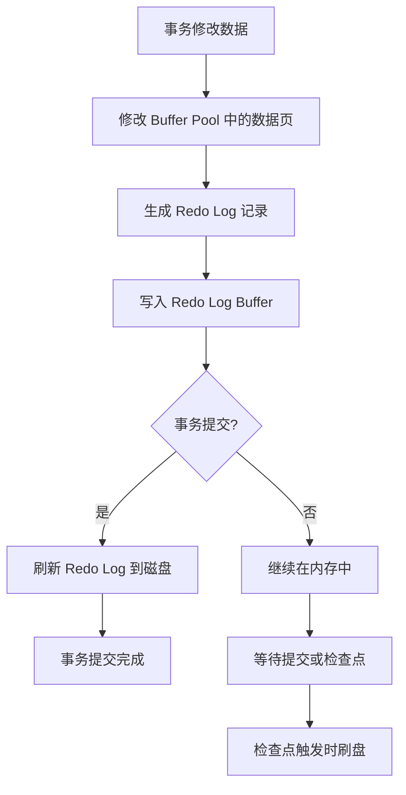
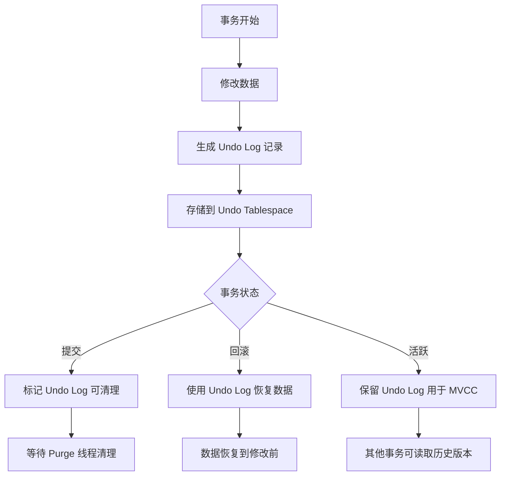
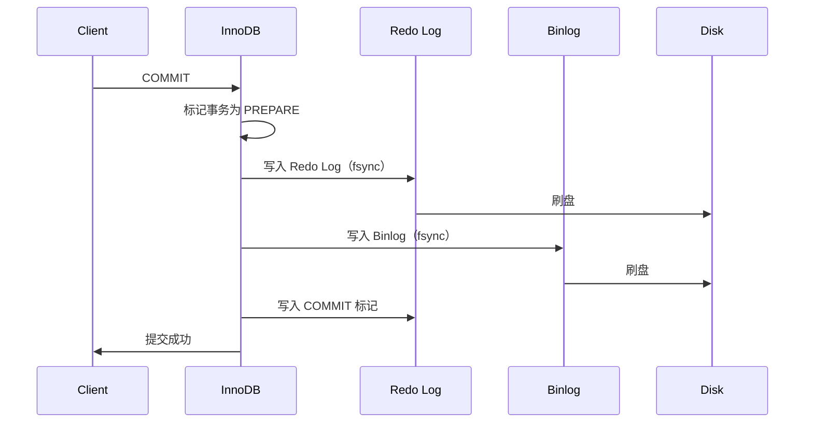
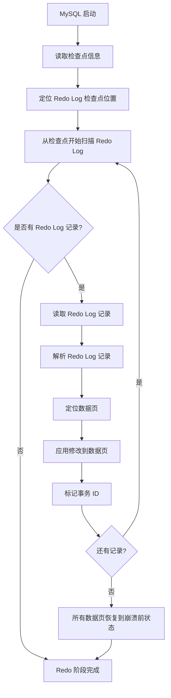
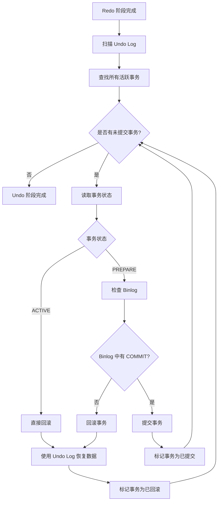
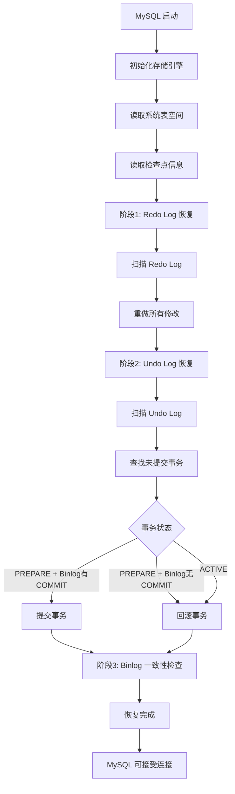
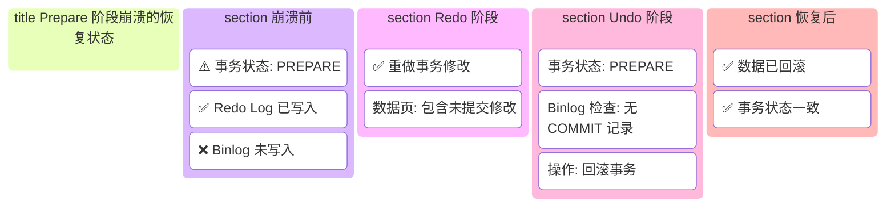
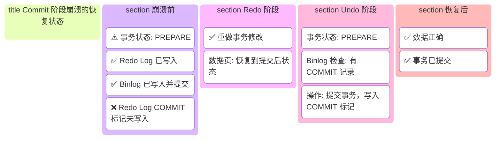

# MySQL 崩溃恢复流程详解

MySQL 的崩溃恢复机制是保证数据一致性和持久性的核心功能。当数据库服务器异常关闭（如断电、系统崩溃）后，MySQL 能够在重启时自动恢复到崩溃前的状态，确保已提交的事务不丢失，未提交的事务能够回滚。本文将详细介绍 MySQL 崩溃恢复的流程、各个日志的作用以及恢复机制的工作原理。

---

# 一、崩溃恢复概述

## 1.1 什么是崩溃恢复

崩溃恢复（Crash Recovery）是指数据库服务器在异常关闭后，重新启动时自动检测并修复数据不一致状态的过程。MySQL 通过多种日志文件（Redo Log、Undo Log、Binlog）来实现崩溃恢复。

## 1.2 崩溃恢复的目标

- **已提交事务的持久性**：确保所有已提交的事务修改都已写入磁盘
- **未提交事务的回滚**：回滚所有未提交的事务，保证数据一致性
- **数据页的一致性**：修复因崩溃导致的数据页损坏或不一致

## 1.3 崩溃恢复的触发时机

- 数据库服务器异常关闭后重启
- 系统断电后重启
- 操作系统崩溃后重启
- 手动执行 `FLUSH LOGS` 后的检查点恢复

---

# 二、相关日志文件详解

MySQL 崩溃恢复主要依赖三种日志：**Redo Log（重做日志）**、**Undo Log（回滚日志）** 和 **Binlog（二进制日志）**。

## 2.1 Redo Log（重做日志）

### 功能说明

Redo Log 记录了 InnoDB 存储引擎中所有已提交事务的物理修改操作，用于在崩溃恢复时重做这些操作，确保已提交事务的持久性。

### 主要特点

1. **物理日志**：记录的是数据页的物理修改（如：在某个数据页的某个偏移量处修改了某个值）
2. **顺序写入**：采用顺序 I/O，性能远高于随机 I/O
3. **循环写入**：采用固定大小的文件组，循环覆盖写入
4. **WAL 机制**：Write-Ahead Logging，先写日志再写数据页

### 记录内容

- 数据页的物理修改
- 索引页的修改
- Undo Log 页的修改
- 系统表空间的修改

### 配置参数

```sql
-- 查看 Redo Log 文件大小
SHOW VARIABLES LIKE 'innodb_log_file_size';

-- 查看 Redo Log 文件组数量
SHOW VARIABLES LIKE 'innodb_log_files_in_group';

-- 查看 Redo Log 缓冲区大小
SHOW VARIABLES LIKE 'innodb_log_buffer_size';

-- 查看 Redo Log 刷盘策略
SHOW VARIABLES LIKE 'innodb_flush_log_at_trx_commit';
```

```ini
# my.cnf 配置
[mysqld]
# Redo Log 文件大小（默认 48MB，建议 256MB-2GB）
innodb_log_file_size = 256M

# Redo Log 文件组数量（默认 2）
innodb_log_files_in_group = 2

# Redo Log 缓冲区大小（默认 16MB）
innodb_log_buffer_size = 16M

# Redo Log 刷盘策略
# 0: 每秒刷盘一次，性能最好但可能丢失 1 秒数据
# 1: 每次事务提交都刷盘，最安全但性能较差（默认）
# 2: 每次事务提交写入 OS 缓存，每秒刷盘一次，平衡性能和安全性
innodb_flush_log_at_trx_commit = 1
```

### 工作原理



---

## 2.2 Undo Log（回滚日志）

### 功能说明

Undo Log 记录了事务执行前的数据状态，用于：
1. **事务回滚**：回滚未提交的事务
2. **MVCC**：实现多版本并发控制，提供一致性读
3. **崩溃恢复**：恢复未提交事务的原始状态

### 主要特点

1. **逻辑日志**：记录的是逻辑操作（如：UPDATE 操作记录旧值）
2. **版本链**：通过版本链实现 MVCC
3. **存储位置**：存储在 Undo Tablespace 中
4. **生命周期**：事务提交后不会立即删除，需要等待没有事务使用该版本

### 记录内容

- INSERT 操作：记录主键值，用于回滚时删除
- UPDATE 操作：记录旧值，用于回滚时恢复
- DELETE 操作：记录完整行数据，用于回滚时恢复

### 配置参数

```sql
-- 查看 Undo Tablespace 数量
SHOW VARIABLES LIKE 'innodb_undo_tablespaces';

-- 查看 Undo Log 段数量
SHOW VARIABLES LIKE 'innodb_undo_log_truncate';

-- 查看 Undo Log 保留时间
SHOW VARIABLES LIKE 'innodb_undo_log_retention';
```

```ini
# my.cnf 配置
[mysqld]
# Undo Tablespace 数量（MySQL 8.0+ 默认 2）
innodb_undo_tablespaces = 2

# 是否启用 Undo Log 自动截断
innodb_undo_log_truncate = ON

# Undo Log 保留时间（秒，默认 0 表示不自动清理）
innodb_undo_log_retention = 900
```

### 工作原理



---

## 2.3 Binlog（二进制日志）

### 功能说明

Binlog 记录了所有修改数据库的 SQL 语句（逻辑日志），主要用于：
1. **主从复制**：从库通过重放 Binlog 实现数据同步
2. **数据恢复**：通过 Binlog 进行时间点恢复
3. **审计**：记录所有数据库变更操作

### 主要特点

1. **逻辑日志**：记录的是 SQL 语句的逻辑操作
2. **追加写入**：采用追加方式写入，不会覆盖
3. **Server 层日志**：由 MySQL Server 层记录，不依赖存储引擎
4. **三种格式**：Statement、Row、Mixed

### 记录格式

#### Statement 格式（SBR）
- 记录 SQL 语句本身
- 优点：日志量小，性能好
- 缺点：可能因函数、触发器导致主从不一致

#### Row 格式（RBR）
- 记录每行数据的修改前后值
- 优点：数据一致性强，主从一致性好
- 缺点：日志量大，性能较差

#### Mixed 格式（MBR）
- 自动选择 Statement 或 Row 格式
- 平衡性能和一致性

### 配置参数

```sql
-- 查看 Binlog 是否开启
SHOW VARIABLES LIKE 'log_bin';

-- 查看 Binlog 格式
SHOW VARIABLES LIKE 'binlog_format';

-- 查看 Binlog 文件大小
SHOW VARIABLES LIKE 'max_binlog_size';

-- 查看 Binlog 过期时间
SHOW VARIABLES LIKE 'binlog_expire_logs_seconds';
```

```ini
# my.cnf 配置
[mysqld]
# 开启 Binlog
log_bin = /var/log/mysql/mysql-bin

# Binlog 格式（推荐 ROW）
binlog_format = ROW

# 单个 Binlog 文件最大大小（默认 1GB）
max_binlog_size = 1G

# Binlog 过期时间（秒，MySQL 8.0+）
binlog_expire_logs_seconds = 604800

# Binlog 同步策略
# 0: 不强制刷盘，依赖 OS
# 1: 每次事务提交都刷盘（最安全）
sync_binlog = 1
```

---

# 三、两阶段提交（2PC）

MySQL 使用两阶段提交（Two-Phase Commit, 2PC）来保证 Redo Log 和 Binlog 的一致性。

## 3.1 为什么需要两阶段提交

在 MySQL 中，一个事务的提交涉及两个日志：
- **Redo Log**：InnoDB 存储引擎层，记录物理修改
- **Binlog**：MySQL Server 层，记录逻辑修改

如果这两个日志不一致，会导致：
- 主从数据不一致
- 数据恢复时数据丢失或不一致

## 3.2 两阶段提交流程

### 阶段 1：Prepare 阶段

1. 事务执行完成，准备提交
2. InnoDB 将事务状态标记为 `PREPARE`
3. 将 Redo Log 写入磁盘（`fsync`）
4. 此时事务已具备提交条件，但还未真正提交

### 阶段 2：Commit 阶段

1. 写入 Binlog 到磁盘（`fsync`）
2. 在 Redo Log 中写入 `COMMIT` 标记
3. 事务提交完成

### 流程图



---

# 四、崩溃恢复流程详解

## 4.1 恢复阶段划分

MySQL 崩溃恢复分为三个阶段：

### 阶段 1：Redo Log 恢复（Redo Phase）

**目标**：重做所有已提交和未提交的事务修改

1. 从 Redo Log 的检查点（Checkpoint）开始扫描
2. 读取所有 Redo Log 记录
3. 重做这些操作，恢复数据页到崩溃前的状态
4. 此时数据页可能包含未提交事务的修改

### 阶段 2：Undo Log 恢复（Undo Phase）

**目标**：回滚所有未提交的事务

1. 扫描 Undo Log，找出所有未提交的事务（状态为 `PREPARE` 或没有 `COMMIT` 标记）
2. 使用 Undo Log 回滚这些事务
3. 恢复数据到事务开始前的状态

### 阶段 3：Binlog 恢复（可选）

**目标**：确保 Binlog 和 Redo Log 的一致性

1. 检查 Binlog 和 Redo Log 的一致性
2. 如果发现不一致，根据 Binlog 进行修复

## 4.2 详细恢复流程

### 4.2.1 Redo Log 恢复流程



**系统状态（Redo 阶段完成后）**：


### 4.2.2 Undo Log 恢复流程



**系统状态（Undo 阶段完成后）**：


### 4.2.3 完整恢复流程图



---

# 五、崩溃恢复场景分析

## 5.1 场景 1：正常提交的事务

### 场景描述

事务已正常提交，Redo Log 和 Binlog 都已写入磁盘。

### 恢复过程

1. **Redo 阶段**：重做该事务的所有修改
2. **Undo 阶段**：发现事务已提交（Redo Log 中有 COMMIT 标记），无需回滚
3. **结果**：数据正确恢复

### 状态图


## 5.2 场景 2：Prepare 阶段崩溃

### 场景描述

事务执行到 Prepare 阶段，Redo Log 已写入，但 Binlog 还未写入或未刷盘。

### 恢复过程

1. **Redo 阶段**：重做该事务的所有修改
2. **Undo 阶段**：
   - 发现事务状态为 `PREPARE`
   - 检查 Binlog，发现没有对应的 COMMIT 记录
   - 判定为未提交事务，执行回滚
3. **结果**：数据回滚到事务开始前的状态

### 状态图



## 5.3 场景 3：Commit 阶段崩溃

### 场景描述

事务执行到 Commit 阶段，Redo Log 和 Binlog 都已写入，但 Redo Log 的 COMMIT 标记可能未写入。

### 恢复过程

1. **Redo 阶段**：重做该事务的所有修改
2. **Undo 阶段**：
   - 发现事务状态为 `PREPARE`（Redo Log 中无 COMMIT 标记）
   - 检查 Binlog，发现有对应的 COMMIT 记录
   - 判定为已提交事务，写入 COMMIT 标记
3. **结果**：数据正确恢复，事务标记为已提交

### 状态图



## 5.4 场景 4：Active 事务崩溃

### 场景描述

事务正在执行中（Active 状态），还未进入 Prepare 阶段。

### 恢复过程

1. **Redo 阶段**：如果 Redo Log 中有该事务的修改记录，会重做这些修改
2. **Undo 阶段**：
   - 发现事务状态为 `ACTIVE` 或不存在
   - 判定为未提交事务，执行回滚
3. **结果**：数据回滚到事务开始前的状态

### 状态图


---

# 六、检查点（Checkpoint）机制

## 6.1 检查点的作用

检查点是崩溃恢复的起始点，记录了：
- Redo Log 的写入位置
- 哪些数据页已被刷盘
- 恢复时从哪个位置开始扫描 Redo Log

## 6.2 检查点类型

### Sharp Checkpoint（完全检查点）

- 将所有脏页刷盘
- 更新检查点位置
- 发生在数据库关闭或手动执行时

### Fuzzy Checkpoint（模糊检查点）

- 只刷部分脏页
- 定期执行，不影响性能
- 发生在以下情况：
  - Redo Log 空间不足
  - 脏页数量达到阈值
  - 后台线程定期刷新

## 6.3 检查点配置

```sql
-- 查看检查点相关参数
SHOW VARIABLES LIKE 'innodb_max_dirty_pages_pct';
SHOW VARIABLES LIKE 'innodb_io_capacity';
```

```ini
# my.cnf 配置
[mysqld]
# 最大脏页比例（默认 75%）
innodb_max_dirty_pages_pct = 75

# IO 容量（用于控制刷盘速度）
innodb_io_capacity = 200
```

---

# 七、崩溃恢复性能优化

## 7.1 优化策略

### 1. 合理设置 Redo Log 大小

- Redo Log 太小：频繁触发检查点，影响性能
- Redo Log 太大：恢复时间变长
- **建议**：设置为 1-2 小时的事务量

### 2. 调整刷盘策略

```ini
# 平衡性能和安全性
innodb_flush_log_at_trx_commit = 2  # 写入 OS 缓存，每秒刷盘
sync_binlog = 100  # 每 100 个事务刷盘一次
```

### 3. 使用 SSD

- SSD 的随机 I/O 性能远好于机械硬盘
- 可以加快恢复速度

### 4. 并行恢复（MySQL 8.0+）

MySQL 8.0 支持并行恢复，可以加快恢复速度：

```sql
-- 查看并行恢复线程数
SHOW VARIABLES LIKE 'innodb_parallel_recovery_threads';
```

```ini
# my.cnf 配置
[mysqld]
# 并行恢复线程数（默认 4）
innodb_parallel_recovery_threads = 4
```

## 7.2 监控恢复进度

```sql
-- 查看恢复状态（MySQL 8.0+）
SELECT * FROM performance_schema.events_stages_current 
WHERE event_name LIKE '%recovery%';

-- 查看 InnoDB 状态
SHOW ENGINE INNODB STATUS;
```

---

# 八、常见问题与解决方案

## 8.1 恢复时间过长

### 问题原因

- Redo Log 文件过大
- 脏页过多
- 磁盘 I/O 性能差

### 解决方案

1. 增加 Redo Log 文件大小，减少检查点频率
2. 优化应用，减少事务量
3. 使用 SSD 提升 I/O 性能
4. 启用并行恢复（MySQL 8.0+）

## 8.2 数据不一致

### 问题原因

- Redo Log 和 Binlog 不一致
- 磁盘损坏
- 文件系统错误

### 解决方案

1. 检查 Redo Log 和 Binlog 的一致性
2. 使用 `mysqlbinlog` 工具检查 Binlog
3. 从备份恢复数据
4. 使用 `innodb_force_recovery` 模式（谨慎使用）

## 8.3 恢复失败

### 问题原因

- Redo Log 文件损坏
- 系统表空间损坏
- 磁盘空间不足

### 解决方案

1. 检查磁盘空间
2. 检查文件系统错误
3. 使用 `innodb_force_recovery` 模式尝试恢复
4. 从备份恢复

---

# 九、总结

MySQL 的崩溃恢复机制通过 Redo Log、Undo Log 和 Binlog 的协同工作，确保了：

1. **数据持久性**：已提交的事务不会丢失
2. **数据一致性**：未提交的事务会被回滚
3. **主从一致性**：通过两阶段提交保证 Redo Log 和 Binlog 一致

理解崩溃恢复机制对于：
- **数据库运维**：优化恢复性能，处理恢复问题
- **应用开发**：理解事务提交的时机和影响
- **系统设计**：设计高可用的数据库架构

都非常重要。在实际生产环境中，应该：
- 定期备份数据
- 监控日志文件大小
- 测试恢复流程
- 优化恢复性能

以确保数据库的高可用性和数据安全性。
