# MySQL 多事务并发修改同一行记录的锁和日志流程

## 一、场景设置

### 1. 测试环境

```sql
-- 创建测试表
CREATE TABLE accounts (
    id INT PRIMARY KEY,
    name VARCHAR(50),
    balance DECIMAL(10,2),
    version INT DEFAULT 0
) ENGINE=InnoDB;

-- 插入测试数据
INSERT INTO accounts VALUES (1, 'Alice', 1000.00, 0);

-- 设置隔离级别（InnoDB 默认 REPEATABLE READ）
SET SESSION TRANSACTION ISOLATION LEVEL REPEATABLE READ;
```

### 2. 并发场景

假设有 3 个事务同时操作同一行记录：

```
事务 A: 读取并修改 balance
事务 B: 读取并修改 balance
事务 C: 只读取 balance（快照读）
```

---

## 二、完整流程详解

### 场景 1: 两个事务同时修改同一行

#### 时间线流程

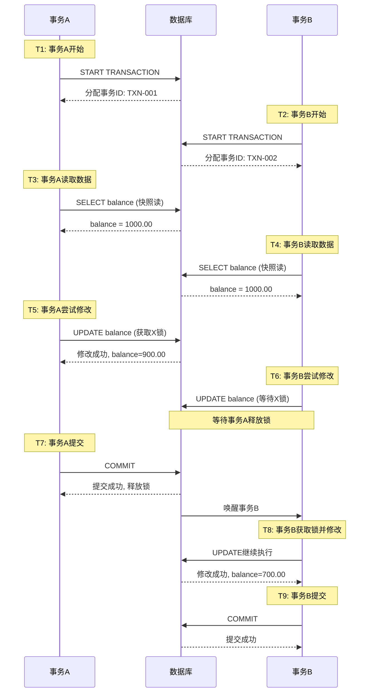

#### 详细步骤

**T1: 事务 A 开始**

```sql
-- 会话 A
START TRANSACTION;
-- 事务 ID: TXN-001
-- 隔离级别: REPEATABLE READ
```

**系统状态**：

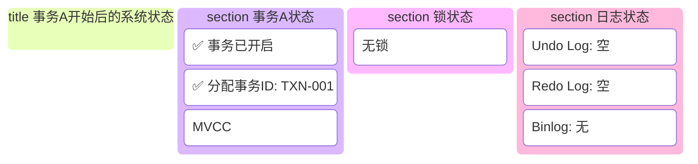

**T2: 事务 B 开始**

```sql
-- 会话 B
START TRANSACTION;
-- 事务 ID: TXN-002
-- 隔离级别: REPEATABLE READ
```

**系统状态**：


**T3: 事务 A 读取数据（快照读）**

```sql
-- 会话 A
SELECT balance FROM accounts WHERE id = 1;
-- 返回: balance = 1000.00
```

**执行流程**：

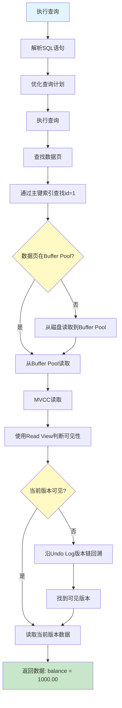

**系统状态**：
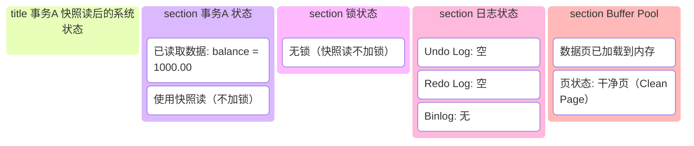


**T4: 事务 B 读取数据（快照读）**

```sql
-- 会话 B
SELECT balance FROM accounts WHERE id = 1;
-- 返回: balance = 1000.00
```

**执行流程**：与事务 A 相同（快照读，不加锁）

**系统状态**：
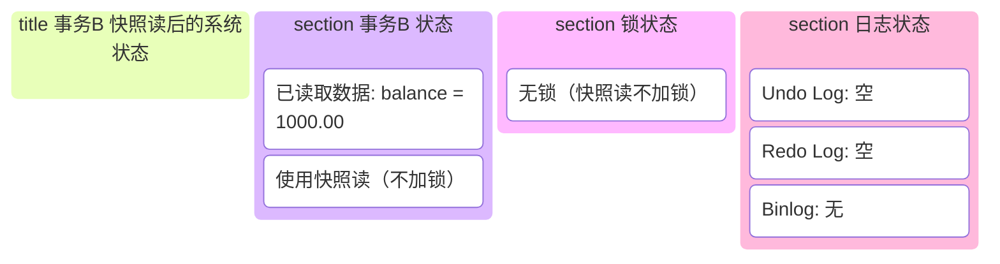

**T5: 事务 A 尝试修改（获取锁）**

```sql
-- 会话 A
UPDATE accounts SET balance = balance - 100 WHERE id = 1;
```

**执行流程**：

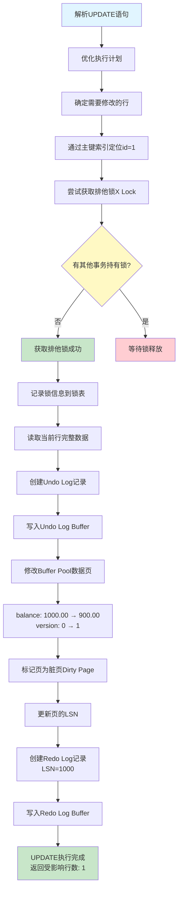

**系统状态**：

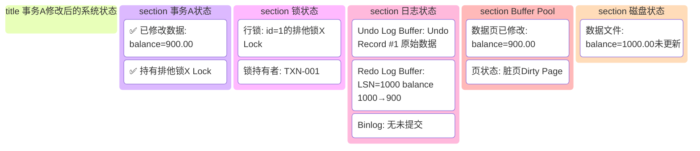

**T6: 事务 B 尝试修改（等待锁）**

```sql
-- 会话 B
UPDATE accounts SET balance = balance - 200 WHERE id = 1;
-- ⏳ 被阻塞，等待事务 A 释放锁
```

**执行流程**：

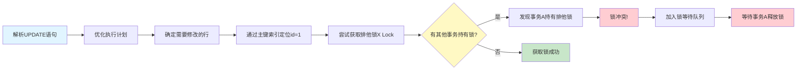

**系统状态**：

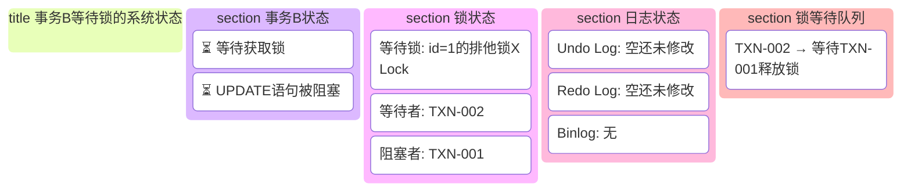

**T7: 事务 A 提交（释放锁）**

```sql
-- 会话 A
COMMIT;
```

**提交流程**：

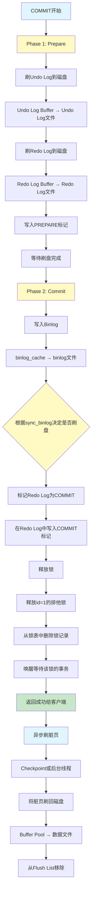

**系统状态**：

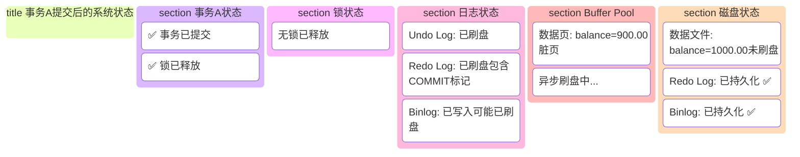

**T8: 事务 B 获取锁并修改**

```sql
-- 会话 B
-- ⏳ 等待结束，获得锁
-- UPDATE 语句继续执行
```

**执行流程**：

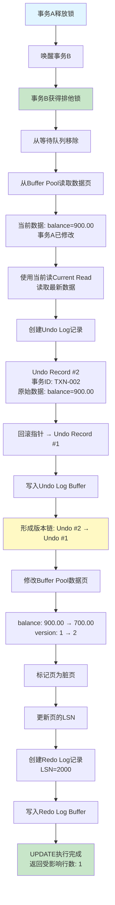

**系统状态**：

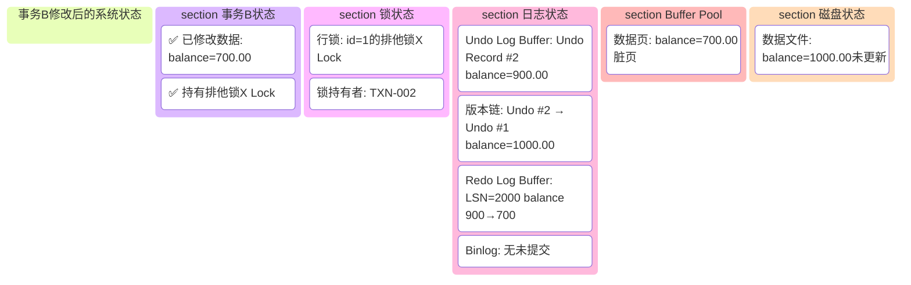

**T9: 事务 B 提交**

```sql
-- 会话 B
COMMIT;
```

**提交流程**：与事务 A 相同（两阶段提交）

**最终状态**：

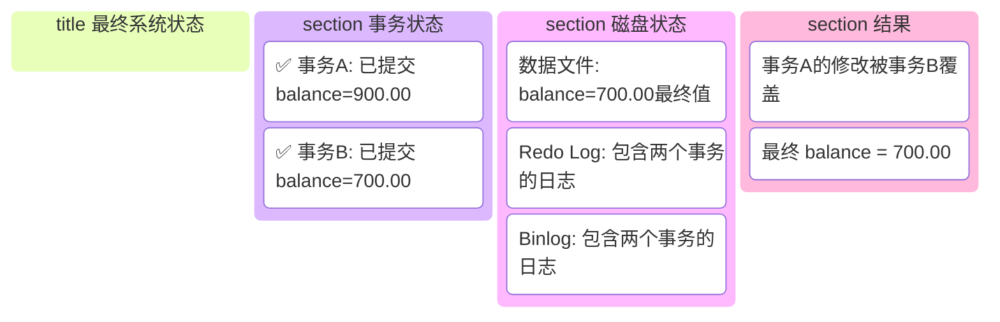

---

## 三、场景 2: 一个事务修改，另一个事务读取

### 场景设置

```
事务 A: 修改 balance
事务 C: 只读取 balance（快照读）
```

### 详细流程

**T1: 事务 A 开始并修改**

```sql
-- 会话 A
START TRANSACTION;
UPDATE accounts SET balance = balance - 100 WHERE id = 1;
-- 执行流程与场景 1 的 T5 相同
```

**系统状态**：

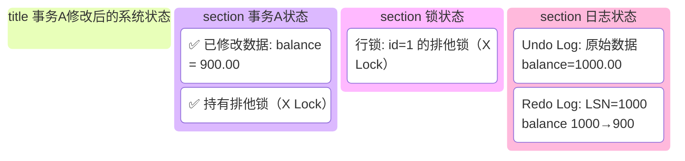

**T2: 事务 C 读取（快照读）**

```sql
-- 会话 C
START TRANSACTION;
SELECT balance FROM accounts WHERE id = 1;
-- 返回: balance = 1000.00（不是 900.00！）
```

**执行流程**：

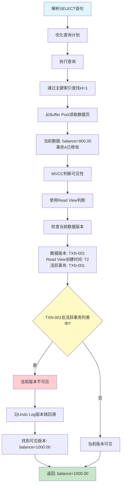

**系统状态**：

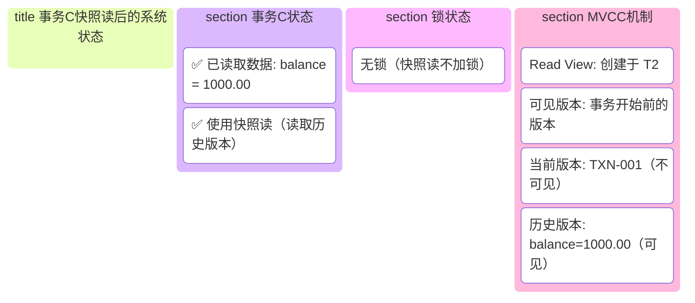

**关键点**：

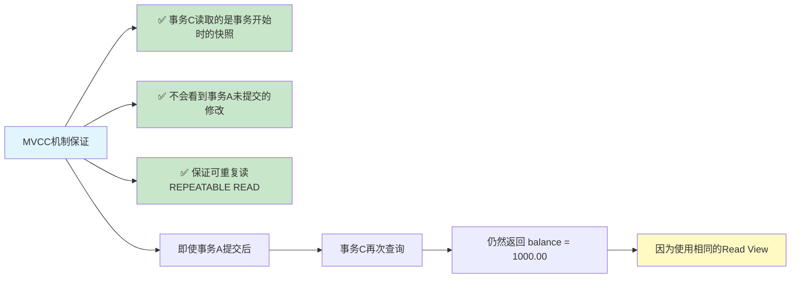

---

## 四、场景 3: 三个事务同时修改（死锁场景）

### 场景设置

```
事务 A: 修改 id=1，然后修改 id=2
事务 B: 修改 id=2，然后修改 id=1
```

### 死锁流程

**T1: 事务 A 开始并修改 id=1**

```sql
-- 会话 A
START TRANSACTION;
UPDATE accounts SET balance = balance - 100 WHERE id = 1;
-- ✅ 获得 id=1 的排他锁
```

**T2: 事务 B 开始并修改 id=2**

```sql
-- 会话 B
START TRANSACTION;
UPDATE accounts SET balance = balance - 200 WHERE id = 2;
-- ✅ 获得 id=2 的排他锁
```

**T3: 事务 A 尝试修改 id=2**

```sql
-- 会话 A
UPDATE accounts SET balance = balance - 50 WHERE id = 2;
-- ⏳ 等待事务 B 释放 id=2 的锁
```

**T4: 事务 B 尝试修改 id=1**

```sql
-- 会话 B
UPDATE accounts SET balance = balance - 30 WHERE id = 1;
-- ⏳ 等待事务 A 释放 id=1 的锁
```

**死锁检测**：

```mermaid
flowchart LR
    A[MySQL死锁检测机制] --> B[定期检查锁等待图]
    B --> C[发现循环等待]
    C --> D[事务A TXN-001<br/>等待 id=2的锁]
    D --> E[事务B TXN-002<br/>持有 id=2的锁]
    E --> F[事务B TXN-002<br/>等待 id=1的锁]
    F --> G[事务A TXN-001<br/>持有 id=1的锁]
    G --> H[形成循环! 死锁!]
    H --> I[选择回滚代价较小的事务]
    I --> J[回滚事务B<br/>修改行数较少]
    J --> K[释放事务B的锁]
    K --> L[事务A获得id=2的锁]
    L --> M[事务A继续执行]
    
    style A fill:#e1f5ff
    style H fill:#ffcdd2
    style J fill:#fff9c4
    style M fill:#c8e6c9
    
    D -.等待.-> E
    F -.等待.-> G
    G -.持有.-> D
    E -.持有.-> F
```

**死锁处理**：

```mermaid
flowchart LR
    A[死锁处理结果] --> B[事务B]
    B --> C[收到死锁错误<br/>ERROR 1213: Deadlock found]
    C --> D[事务自动回滚]
    D --> E[释放所有锁]
    A --> F[事务A]
    F --> G[获得id=2的锁 ✅]
    G --> H[UPDATE语句继续执行]
    H --> I[可以正常提交]
    
    style A fill:#e1f5ff
    style C fill:#ffcdd2
    style D fill:#ffcdd2
    style G fill:#c8e6c9
    style I fill:#c8e6c9
```

## 五、日志详细流程

### 1. Undo Log 版本链

```mermaid
flowchart LR
    A[当前数据 Buffer Pool<br/>id=1, balance=700.00, version=2] --> B[回滚指针]
    B --> C[Undo Record #2<br/>balance=900.00, version=1<br/>事务ID: TXN-002]
    C --> D[回滚指针]
    D --> E[Undo Record #1<br/>balance=1000.00, version=0<br/>事务ID: TXN-001]
    E --> F[回滚指针: NULL]
    
    G[版本链: v2 当前 → v1 → v0]
    
    H[用途]
    H --> I[MVCC: 读取历史版本]
    H --> J[回滚: 恢复原始数据]
    
    style A fill:#c8e6c9
    style C fill:#fff9c4
    style E fill:#fff9c4
    style G fill:#e1f5ff
    style H fill:#e1f5ff
```

### 2. Redo Log 写入流程

```mermaid
flowchart TD
    A[步骤1: 修改数据] --> B[在Buffer Pool中修改数据页]
    B --> C[步骤2: 写入Redo Log Buffer]
    C --> D[记录物理变更<br/>页号、偏移、数据]
    D --> E[追加到Redo Log Buffer]
    E --> F[步骤3: 事务提交时刷盘]
    F --> G[Redo Log Buffer → Redo Log文件]
    G --> H[写入PREPARE标记]
    H --> I[步骤4: Binlog写入后]
    I --> J[写入COMMIT标记]
    J --> K[步骤5: 异步刷脏页]
    K --> L[后台线程将脏页刷回磁盘]
    L --> M[Buffer Pool → 数据文件]
    M --> N[有Redo Log保证<br/>即使崩溃也能恢复]
    
    style A fill:#e1f5ff
    style F fill:#fff9c4
    style I fill:#fff9c4
    style K fill:#e1f5ff
    style N fill:#c8e6c9
```

### 3. Binlog 写入流程

```mermaid
flowchart LR
    A[两阶段提交] --> B[Phase 1: Prepare]
    B --> C[Redo Log刷盘]
    C --> D[写入PREPARE标记]
    D --> E[Phase 2: Commit]
    E --> F[写入Binlog]
    F --> G[binlog_cache → binlog文件]
    G --> H{根据sync_binlog决定是否刷盘}
    H --> I[Redo Log写入COMMIT标记]
    
    J[关键点]
    J --> K[只有Binlog写入成功后才写COMMIT]
    J --> L[保证Redo Log和Binlog的一致性]
    
    style A fill:#e1f5ff
    style B fill:#fff9c4
    style E fill:#fff9c4
    style I fill:#c8e6c9
    style J fill:#e1f5ff
    style H fill:#fff9c4
```

---

## 六、不同隔离级别的影响

### 1. READ COMMITTED

```mermaid
flowchart TD
    A[READ COMMITTED 隔离级别] --> B[特点]
    B --> C[每次SELECT创建新的Read View]
    B --> D[可以看到已提交的数据]
    
    E[场景示例]
    E --> F[事务A: UPDATE balance = 900]
    F --> G[事务A: COMMIT]
    G --> H[事务C: SELECT balance]
    H --> I[返回: 900<br/>看到已提交的数据]
    
    J[锁机制]
    J --> K[读取时不需要加锁<br/>快照读]
    J --> L[修改时需要加锁<br/>排他锁]
    
    style A fill:#e1f5ff
    style E fill:#e1f5ff
    style I fill:#c8e6c9
    style J fill:#e1f5ff
```

### 2. REPEATABLE READ（默认）

```mermaid
flowchart TD
    A[REPEATABLE READ 隔离级别<br/>默认] --> B[特点]
    B --> C[事务开始时创建Read View]
    B --> D[整个事务内复用同一个Read View]
    B --> E[保证可重复读]
    
    F[场景示例]
    F --> G[事务A: UPDATE balance = 900]
    G --> H[事务A: COMMIT]
    H --> I[事务C: SELECT balance]
    I --> J[返回: 1000<br/>使用事务开始时的快照]
    
    K[锁机制]
    K --> L[快照读不加锁]
    K --> M[当前读加锁<br/>SELECT ... FOR UPDATE]
    K --> N[Next-Key Lock防止幻读]
    
    style A fill:#e1f5ff
    style F fill:#e1f5ff
    style J fill:#c8e6c9
    style K fill:#e1f5ff
```

### 3. SERIALIZABLE

```mermaid
flowchart TD
    A[SERIALIZABLE 隔离级别] --> B[特点]
    B --> C[所有SELECT自动加锁]
    B --> D[串行执行]
    
    E[场景示例]
    E --> F[事务C: SELECT balance]
    F --> G[自动转换为<br/>SELECT ... LOCK IN SHARE MODE]
    G --> H[对id=1加共享锁S Lock]
    H --> I[事务A: UPDATE balance = 900]
    I --> J[需要排他锁X Lock]
    J --> K[与共享锁冲突]
    K --> L[等待事务C释放锁]
    
    M[锁机制]
    M --> N[所有读操作都加锁]
    M --> O[读写互斥, 串行执行]
    
    style A fill:#e1f5ff
    style E fill:#e1f5ff
    style K fill:#ffcdd2
    style L fill:#ffcdd2
    style M fill:#e1f5ff
```

---

## 七、锁等待和超时

### 1. 锁等待超时

```sql
-- 查看锁等待超时时间
SHOW VARIABLES LIKE 'innodb_lock_wait_timeout';
-- 默认: 50 秒

-- 设置锁等待超时
SET SESSION innodb_lock_wait_timeout = 10;

-- 如果等待超过超时时间:
-- → 返回错误: ERROR 1205 (HY000): Lock wait timeout exceeded
-- → 事务自动回滚
```

### 2. 查看锁等待

```sql
-- 查看当前锁等待
SELECT * FROM information_schema.INNODB_LOCK_WAITS;

-- 查看锁信息
SELECT * FROM information_schema.INNODB_LOCKS;

-- 查看事务信息
SELECT * FROM information_schema.INNODB_TRX;
```

---

## 八、总结

### 核心要点

1. **锁机制**
   - 快照读（SELECT）不加锁
   - 当前读（UPDATE/DELETE）加排他锁
   - 锁冲突时等待或超时

2. **日志机制**
   - Undo Log: 记录原始数据，支持回滚和 MVCC
   - Redo Log: 记录物理变更，保证持久性
   - Binlog: 记录逻辑变更，用于主从复制

3. **MVCC 机制**
   - 快照读使用 Read View
   - 读取历史版本数据
   - 保证可重复读

4. **两阶段提交**
   - Prepare: Redo Log 刷盘
   - Commit: Binlog 写入 + COMMIT 标记
   - 保证数据一致性

5. **死锁检测**
   - 自动检测死锁
   - 回滚代价较小的事务
   - 保证系统可用性

### 最佳实践

```
✅ 尽量使用快照读（不加锁）
✅ 减少事务持有锁的时间
✅ 按相同顺序访问表（避免死锁）
✅ 合理设置锁等待超时时间
✅ 监控锁等待和死锁情况
✅ 使用合适的隔离级别
```

---

## 九、监控和诊断

### 1. 查看锁信息

```sql
-- 查看当前锁等待
SELECT 
    r.trx_id AS waiting_trx_id,
    r.trx_mysql_thread_id AS waiting_thread,
    r.trx_query AS waiting_query,
    b.trx_id AS blocking_trx_id,
    b.trx_mysql_thread_id AS blocking_thread,
    b.trx_query AS blocking_query
FROM information_schema.INNODB_LOCK_WAITS w
INNER JOIN information_schema.INNODB_TRX b ON b.trx_id = w.blocking_trx_id
INNER JOIN information_schema.INNODB_TRX r ON r.trx_id = w.requesting_trx_id;
```

### 2. 查看死锁信息

```sql
-- 查看最近的死锁信息
SHOW ENGINE INNODB STATUS;
-- 在输出中查找 "LATEST DETECTED DEADLOCK" 部分
```

### 3. 监控事务状态

```sql
-- 查看所有事务
SELECT 
    trx_id,
    trx_state,
    trx_started,
    trx_requested_lock_id,
    trx_wait_started,
    trx_weight,
    trx_mysql_thread_id,
    trx_query
FROM information_schema.INNODB_TRX
ORDER BY trx_started;
```

---

以上是 MySQL 多事务并发修改同一行记录时，锁和日志的完整流程。理解这些机制有助于优化数据库性能和排查问题。
