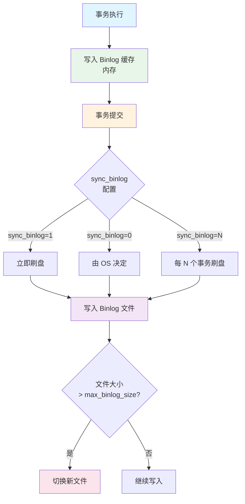
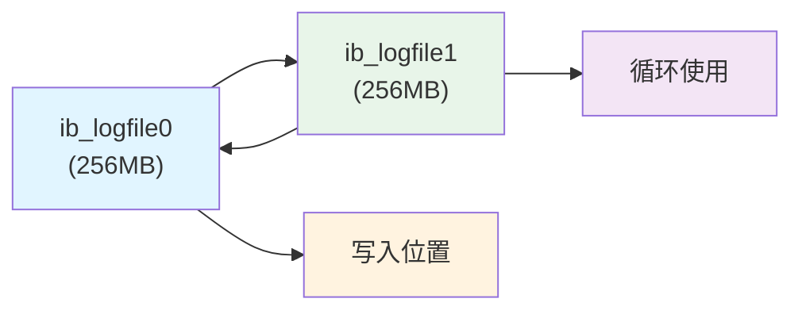
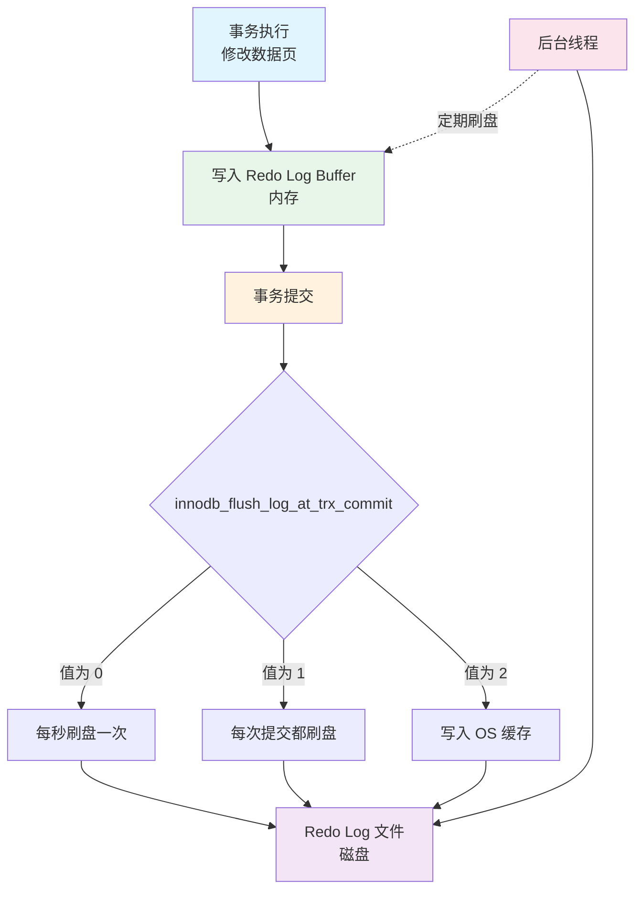
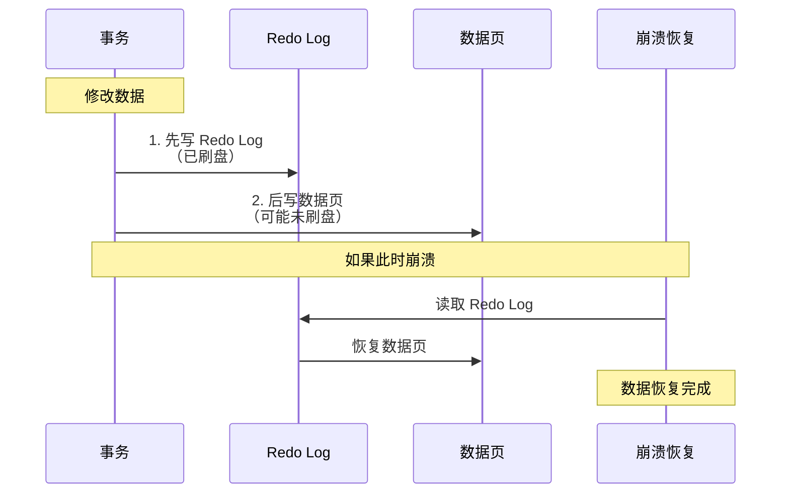
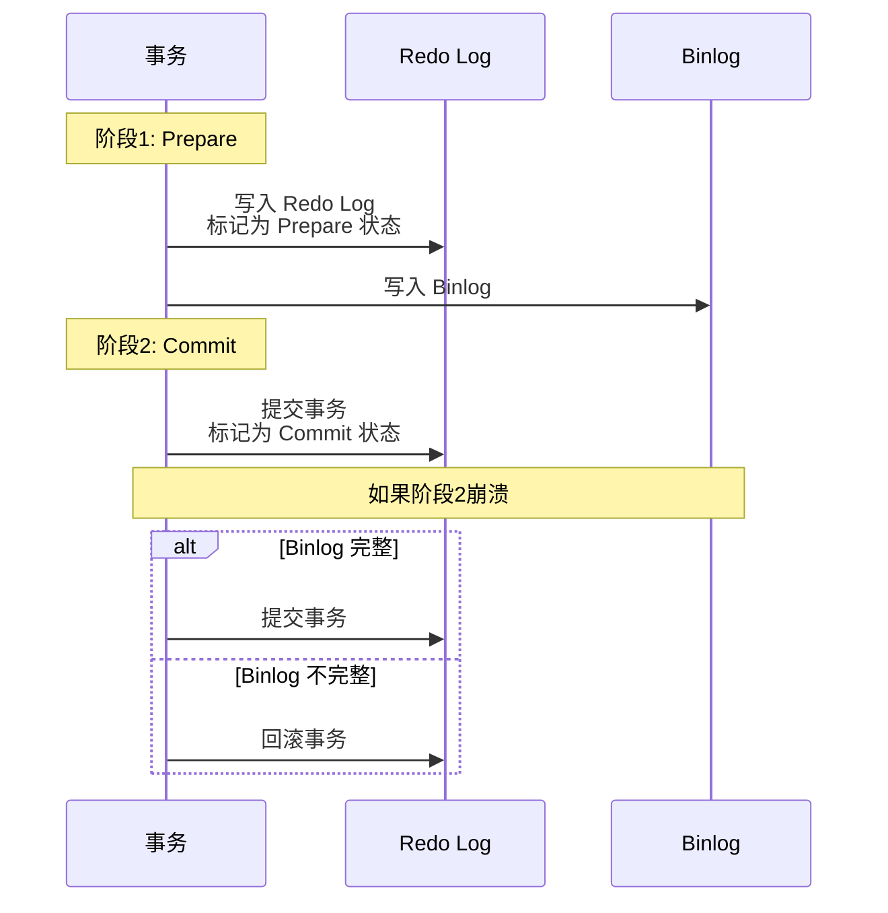
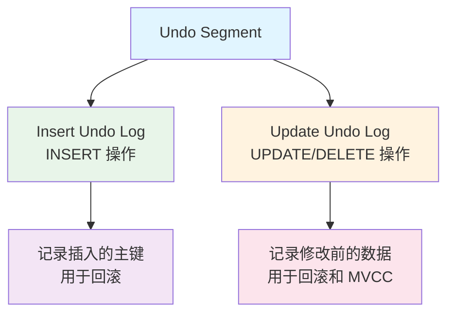
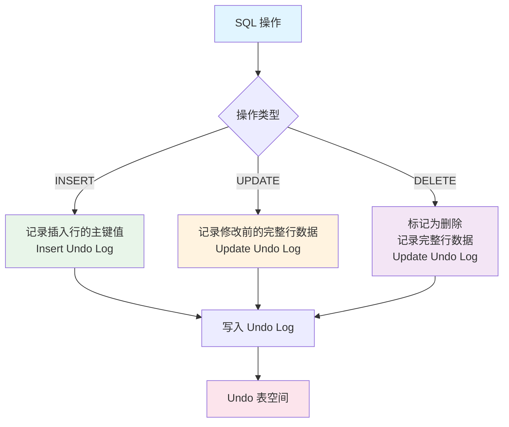
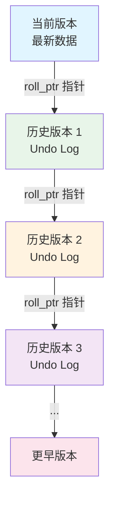
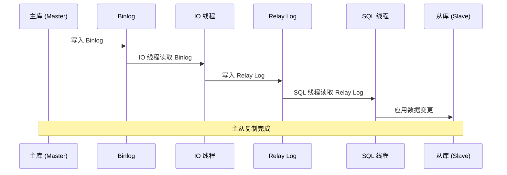

# MySQL 日志详解

MySQL 使用多种日志来保证数据的一致性、可恢复性和可追溯性。这些日志在 MySQL 的运行过程中起着至关重要的作用。本文将详细介绍 MySQL 中各种日志的功能、实现原理和配置方法。

---

# 一、错误日志（Error Log）

## 功能说明

错误日志记录了 MySQL 服务器启动、运行和关闭过程中的错误信息、警告信息以及重要的诊断信息。这是排查 MySQL 问题的重要依据。

## 主要记录内容

- MySQL 启动和关闭过程中的信息
- 服务器运行过程中的错误信息
- 事件调度器运行时的错误信息
- 主从复制过程中的错误信息

## 配置方法

```sql
-- 查看错误日志位置
SHOW VARIABLES LIKE 'log_error';

-- 查看错误日志级别（MySQL 8.0+）
SHOW VARIABLES LIKE 'log_error_verbosity';
```

```ini
# my.cnf 配置
[mysqld]
# 错误日志文件路径
log-error=/var/log/mysql/error.log

# 错误日志级别（MySQL 8.0+）
# 1: 只记录错误
# 2: 记录错误和警告
# 3: 记录错误、警告和通知（默认）
log_error_verbosity=3
```

## 实现原理

错误日志由 MySQL 服务器进程直接写入文件系统，不经过存储引擎。日志写入是同步的，确保重要错误信息不会丢失。

## 查看错误日志

```bash
# 查看错误日志
tail -f /var/log/mysql/error.log

# 查看最近的错误
grep -i error /var/log/mysql/error.log | tail -20
```

---

# 二、慢查询日志（Slow Query Log）

## 功能说明

慢查询日志记录了执行时间超过指定阈值的 SQL 语句，用于性能分析和优化。通过分析慢查询日志，可以找出需要优化的 SQL 语句。

## 主要记录内容

- 执行时间超过 `long_query_time` 的 SQL 语句
- 未使用索引的查询（如果开启 `log_queries_not_using_indexes`）
- 锁等待时间超过 `long_query_time` 的查询（如果开启 `log_slow_admin_statements`）

## 配置方法

```sql
-- 查看慢查询日志是否开启
SHOW VARIABLES LIKE 'slow_query_log';

-- 开启慢查询日志
SET GLOBAL slow_query_log = 'ON';

-- 查看慢查询日志文件位置
SHOW VARIABLES LIKE 'slow_query_log_file';

-- 设置慢查询时间阈值（秒）
SET GLOBAL long_query_time = 2;

-- 记录未使用索引的查询
SET GLOBAL log_queries_not_using_indexes = 'ON';

-- 记录管理语句（如 ALTER TABLE）
SET GLOBAL log_slow_admin_statements = 'ON';
```

```ini
# my.cnf 配置
[mysqld]
# 开启慢查询日志
slow_query_log = 1

# 慢查询日志文件路径
slow_query_log_file = /var/log/mysql/slow.log

# 慢查询时间阈值（秒）
long_query_time = 2

# 记录未使用索引的查询
log_queries_not_using_indexes = 1

# 记录管理语句
log_slow_admin_statements = 1

# 慢查询日志格式（MySQL 5.7+）
# FILE: 文件格式（默认）
# TABLE: 表格式（记录到 mysql.slow_log 表）
log_output = FILE
```

## 实现原理

慢查询日志在 SQL 语句执行完成后，如果执行时间超过阈值，则记录该语句的详细信息。记录内容包括：
- SQL 语句
- 执行时间
- 锁等待时间
- 返回行数
- 扫描行数

## 分析慢查询日志

```bash
# 使用 mysqldumpslow 分析（MySQL 自带工具）
mysqldumpslow /var/log/mysql/slow.log

# 按执行时间排序，显示前 10 条
mysqldumpslow -s t -t 10 /var/log/mysql/slow.log

# 按访问次数排序
mysqldumpslow -s c -t 10 /var/log/mysql/slow.log

# 使用 pt-query-digest 分析（Percona Toolkit）
pt-query-digest /var/log/mysql/slow.log
```

## 慢查询日志格式示例

```
# Time: 2024-01-15T10:30:45.123456Z
# User@Host: root[root] @ localhost []  Id:     5
# Query_time: 3.456789  Lock_time: 0.000123 Rows_sent: 100  Rows_examined: 1000000
SET timestamp=1705315845;
SELECT * FROM large_table WHERE unindexed_column = 'value';
```

---

# 三、二进制日志（Binary Log / Binlog）

## 功能说明

二进制日志记录了所有对数据库进行修改的 SQL 语句（DDL 和 DML），但不包括 SELECT 和 SHOW 等不修改数据的语句。Binlog 是 MySQL 主从复制的核心，也用于数据恢复和审计。

## 主要用途

1. **主从复制**：从库通过读取主库的 Binlog 来同步数据
2. **数据恢复**：通过 Binlog 可以恢复到任意时间点
3. **数据审计**：记录所有数据变更操作

## 配置方法

```sql
-- 查看 Binlog 是否开启
SHOW VARIABLES LIKE 'log_bin';

-- 查看 Binlog 格式
SHOW VARIABLES LIKE 'binlog_format';

-- 查看当前 Binlog 文件
SHOW BINARY LOGS;

-- 查看当前正在使用的 Binlog 文件
SHOW MASTER STATUS;

-- 查看 Binlog 事件
SHOW BINLOG EVENTS IN 'mysql-bin.000001' FROM 4 LIMIT 10;
```

```ini
# my.cnf 配置
[mysqld]
# 开启 Binlog
log-bin=mysql-bin

# Binlog 文件路径（可选，默认在数据目录）
log-bin=/var/lib/mysql/mysql-bin

# Binlog 格式
# STATEMENT: 记录 SQL 语句（默认，性能好但可能不安全）
# ROW: 记录每行数据的变化（安全但文件大）
# MIXED: 混合模式，自动选择
binlog_format=ROW

# Binlog 过期时间（秒），0 表示不过期
expire_logs_days=7

# 单个 Binlog 文件大小（默认 1GB）
max_binlog_size=1G

# Binlog 缓存大小
binlog_cache_size=1M

# 同步 Binlog 到磁盘的方式
# 0: 由操作系统决定何时同步（性能最好，但可能丢失数据）
# 1: 每次事务提交都同步（最安全，但性能较差）
# N: 每 N 个事务提交同步一次
sync_binlog=1
```

## Binlog 格式详解

### 1. STATEMENT 格式

记录 SQL 语句本身，文件小，但可能因为函数、触发器等原因导致主从不一致。

```sql
-- Binlog 中记录的内容
UPDATE users SET balance = balance + 100 WHERE id = 1;
```

### 2. ROW 格式

记录每行数据的变化，文件大，但能保证主从一致性。

```sql
-- Binlog 中记录的内容（伪代码）
UPDATE users SET balance = 200 WHERE id = 1;
-- 实际记录：id=1 的行，balance 从 100 变为 200
```

### 3. MIXED 格式

混合模式，对于可能引起不一致的语句使用 ROW 格式，其他使用 STATEMENT 格式。

## 实现原理

Binlog 由 MySQL 服务器层实现，不依赖存储引擎。写入流程：



## 查看和分析 Binlog

```bash
# 使用 mysqlbinlog 工具查看
mysqlbinlog /var/lib/mysql/mysql-bin.000001

# 查看指定时间范围的 Binlog
mysqlbinlog --start-datetime="2024-01-15 10:00:00" \
            --stop-datetime="2024-01-15 11:00:00" \
            /var/lib/mysql/mysql-bin.000001

# 查看指定位置的 Binlog
mysqlbinlog --start-position=4 --stop-position=100 \
            /var/lib/mysql/mysql-bin.000001

# 将 Binlog 转换为 SQL 语句
mysqlbinlog /var/lib/mysql/mysql-bin.000001 > binlog.sql

# 使用 Binlog 恢复数据
mysqlbinlog --start-position=4 /var/lib/mysql/mysql-bin.000001 | mysql -u root -p
```

---

# 四、重做日志（Redo Log）

## 功能说明

Redo Log 是 InnoDB 存储引擎特有的日志，用于保证事务的持久性（Durability）。它记录了事务对数据页的物理修改，用于崩溃恢复。

## 主要功能

1. **崩溃恢复**：MySQL 重启时，通过 Redo Log 恢复未提交但已写入磁盘的数据
2. **保证持久性**：确保已提交事务的修改不会因为崩溃而丢失
3. **提高性能**：将随机写转换为顺序写

## 配置方法

```sql
-- 查看 Redo Log 相关配置
SHOW VARIABLES LIKE 'innodb_log%';

-- 查看 Redo Log 状态
SHOW ENGINE INNODB STATUS\G
```

```ini
# my.cnf 配置
[mysqld]
# Redo Log 文件组数（默认 2）
innodb_log_files_in_group = 2

# 每个 Redo Log 文件大小（默认 48MB）
# 建议设置为缓冲池大小的 25%-50%
innodb_log_file_size = 256M

# Redo Log 缓冲区大小（默认 16MB）
innodb_log_buffer_size = 16M

# Redo Log 刷盘策略
# 0: 每秒刷盘一次（性能最好，但可能丢失 1 秒数据）
# 1: 每次事务提交都刷盘（最安全，但性能较差，默认）
# 2: 每次事务提交写入 OS 缓存，由 OS 决定何时刷盘
innodb_flush_log_at_trx_commit = 1
```

## 实现原理

### Redo Log 结构

Redo Log 由多个固定大小的文件组成（通常为 2 个），采用循环写入的方式：



### 写入流程



### WAL 机制

Redo Log 实现了 **Write-Ahead Logging（WAL）** 机制：



## Redo Log 与 Binlog 的区别

| 特性 | Redo Log | Binlog |
|------|----------|--------|
| **所属层级** | InnoDB 存储引擎 | MySQL 服务器层 |
| **记录内容** | 物理日志（数据页的修改） | 逻辑日志（SQL 语句或行数据变化） |
| **用途** | 崩溃恢复、保证持久性 | 主从复制、数据恢复、审计 |
| **文件格式** | 固定大小，循环写入 | 追加写入，可配置大小 |
| **事务性** | 支持事务 | 不支持事务 |

## 两阶段提交（2PC）

为了保证 Redo Log 和 Binlog 的一致性，InnoDB 使用两阶段提交：



---

# 五、回滚日志（Undo Log）

## 功能说明

Undo Log 是 InnoDB 存储引擎特有的日志，用于实现事务的回滚和 MVCC（多版本并发控制）。它记录了事务修改前的数据版本。

## 主要功能

1. **事务回滚**：回滚未提交事务的修改
2. **MVCC**：为读操作提供历史版本数据，实现快照读
3. **一致性读**：保证可重复读隔离级别下的读一致性

## 配置方法

```sql
-- 查看 Undo Log 相关配置
SHOW VARIABLES LIKE 'innodb_undo%';

-- 查看 Undo Log 表空间
SELECT * FROM INFORMATION_SCHEMA.INNODB_TABLESPACES 
WHERE SPACE_TYPE = 'Undo';
```

```ini
# my.cnf 配置
[mysqld]
# Undo Log 表空间数量（默认 2，MySQL 8.0+ 可配置）
innodb_undo_tablespaces = 2

# 是否自动清理 Undo Log（默认开启）
innodb_undo_log_truncate = ON

# Undo Log 表空间大小阈值（超过此值触发清理）
innodb_max_undo_log_size = 1G

# Undo Log 清理线程数量
innodb_purge_threads = 4
```

## 实现原理

### Undo Log 结构

Undo Log 存储在 Undo 表空间中，采用段（Segment）的方式管理：



### 写入流程



### MVCC 实现

Undo Log 通过版本链实现 MVCC：



读操作通过 Undo Log 构建历史版本，实现快照读。

## Undo Log 清理

Undo Log 在以下情况会被清理：

1. **事务提交后**：Insert Undo Log 可以立即清理
2. **没有活跃事务使用**：Update Undo Log 需要等待没有事务使用该版本
3. **Purge 线程**：后台线程定期清理不再需要的 Undo Log

---

# 六、通用查询日志（General Query Log）

## 功能说明

通用查询日志记录了所有到达 MySQL 服务器的 SQL 语句，包括 SELECT、INSERT、UPDATE、DELETE 等所有操作。由于记录所有操作，会产生大量日志，通常只在调试时开启。

## 配置方法

```sql
-- 查看通用查询日志是否开启
SHOW VARIABLES LIKE 'general_log';

-- 开启通用查询日志
SET GLOBAL general_log = 'ON';

-- 查看通用查询日志文件位置
SHOW VARIABLES LIKE 'general_log_file';

-- 查看日志输出方式
SHOW VARIABLES LIKE 'log_output';
```

```ini
# my.cnf 配置
[mysqld]
# 开启通用查询日志
general_log = 1

# 通用查询日志文件路径
general_log_file = /var/log/mysql/general.log

# 日志输出方式
# FILE: 输出到文件
# TABLE: 输出到 mysql.general_log 表
# FILE,TABLE: 同时输出到文件和表
log_output = FILE
```

## 注意事项

- 通用查询日志会产生大量 I/O，影响性能
- 生产环境通常不开启，只在调试时使用
- 如果开启，需要定期清理或限制日志文件大小

---

# 七、中继日志（Relay Log）

## 功能说明

中继日志是 MySQL 主从复制中，从库（Slave）特有的日志。它存储从主库（Master）读取的 Binlog 事件，然后由从库的 SQL 线程执行这些事件来同步数据。

## 主要功能

1. **存储 Binlog 事件**：从主库读取的 Binlog 事件先写入 Relay Log
2. **解耦 IO 和 SQL 线程**：IO 线程读取 Binlog，SQL 线程执行 Relay Log
3. **提高复制性能**：避免 IO 线程和 SQL 线程相互等待

## 配置方法

```ini
# my.cnf 配置（从库）
[mysqld]
# 中继日志文件路径
relay-log = /var/lib/mysql/relay-bin

# 中继日志索引文件
relay-log-index = /var/lib/mysql/relay-bin.index

# 中继日志自动清理（默认开启）
relay_log_purge = ON

# 中继日志过期时间（秒）
relay_log_recovery = ON
```

## 实现原理

### 主从复制流程



### Relay Log 结构

Relay Log 的结构和 Binlog 类似，采用追加写入的方式：


---

# 八、日志对比总结

| 日志类型 | 所属层级 | 主要用途 | 是否必需 | 性能影响 |
|---------|---------|---------|---------|---------|
| **错误日志** | 服务器层 | 记录错误和警告 | 是 | 低 |
| **慢查询日志** | 服务器层 | 性能分析 | 否 | 中 |
| **Binlog** | 服务器层 | 主从复制、恢复 | 主从复制必需 | 中 |
| **Redo Log** | InnoDB | 崩溃恢复、持久性 | 是 | 中 |
| **Undo Log** | InnoDB | 回滚、MVCC | 是 | 低 |
| **通用查询日志** | 服务器层 | 调试、审计 | 否 | 高 |
| **Relay Log** | 服务器层 | 主从复制 | 从库必需 | 中 |

## 日志文件位置

```bash
# 查看所有日志文件位置
mysql> SHOW VARIABLES LIKE '%log%';

# 常见日志文件位置
/var/log/mysql/error.log          # 错误日志
/var/log/mysql/slow.log           # 慢查询日志
/var/lib/mysql/mysql-bin.000001   # Binlog
/var/lib/mysql/ib_logfile0        # Redo Log
/var/lib/mysql/undo_001           # Undo Log
/var/lib/mysql/relay-bin.000001   # Relay Log
```

## 日志管理建议

1. **定期清理**：设置日志过期时间，定期清理旧日志
2. **监控大小**：监控日志文件大小，避免占满磁盘
3. **性能优化**：根据业务需求调整日志级别和格式
4. **备份重要日志**：Binlog 和 Redo Log 对数据恢复至关重要

---

# 九、日志相关最佳实践

## 1. 生产环境配置建议

```ini
[mysqld]
# 错误日志
log-error=/var/log/mysql/error.log
log_error_verbosity=2

# 慢查询日志
slow_query_log=1
slow_query_log_file=/var/log/mysql/slow.log
long_query_time=2
log_queries_not_using_indexes=0

# Binlog
log-bin=mysql-bin
binlog_format=ROW
expire_logs_days=7
sync_binlog=1

# Redo Log
innodb_log_file_size=256M
innodb_flush_log_at_trx_commit=1

# Undo Log
innodb_undo_log_truncate=ON
innodb_max_undo_log_size=1G
```

## 2. 日志监控脚本示例

```bash
#!/bin/bash
# 监控日志文件大小

LOG_DIR="/var/log/mysql"
DATA_DIR="/var/lib/mysql"

echo "=== MySQL 日志文件大小 ==="
du -h $LOG_DIR/*.log 2>/dev/null
du -h $DATA_DIR/mysql-bin.* 2>/dev/null
du -h $DATA_DIR/ib_logfile* 2>/dev/null
```

## 3. 日志分析工具

- **mysqldumpslow**：分析慢查询日志
- **pt-query-digest**：Percona Toolkit 中的日志分析工具
- **mysqlbinlog**：查看和分析 Binlog
- **mysql error log**：直接查看错误日志

---

# 参考文献

- [MySQL 官方文档 - The Binary Log](https://dev.mysql.com/doc/refman/8.0/en/binary-log.html)
- [MySQL 官方文档 - InnoDB Redo Log](https://dev.mysql.com/doc/refman/8.0/en/innodb-redo-log.html)
- [MySQL 官方文档 - InnoDB Undo Logs](https://dev.mysql.com/doc/refman/8.0/en/innodb-undo-logs.html)
- 《MySQL 技术内幕：InnoDB 存储引擎》
- 《高性能 MySQL》
