# 时序数据库

时序数据库（Time Series Database，TSDB）是一种专门用于存储和查询时序数据的数据库系统。时序数据是按时间顺序记录的数据点序列，每个数据点包含时间戳和对应的数值。

## 时序数据的特点

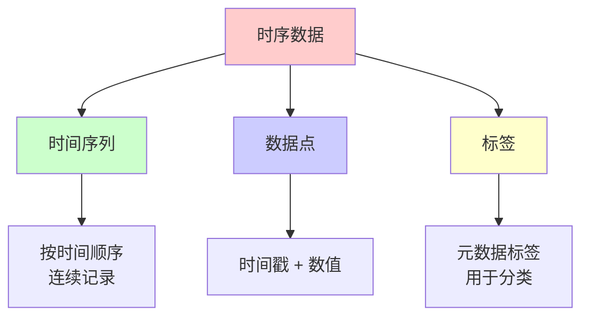

### 1. 时间序列

- **定义**：一系列按时间顺序排列的数据点
- **特点**：时间戳是主键，数据按时间顺序写入
- **示例**：CPU 使用率、内存使用量、请求数量

### 2. 数据点

- **组成**：时间戳 + 数值
- **格式**：`(timestamp, value)`
- **示例**：`(2024-01-01 12:00:00, 75.5)`

### 3. 标签（Labels）

- **用途**：标识和分类时序数据
- **特点**：键值对形式
- **示例**：`{instance="server1", job="web"}`

## 时序数据库 vs 传统数据库

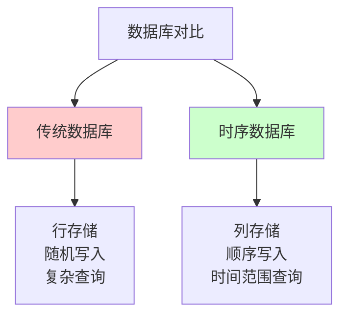

| 特性 | 传统数据库 | 时序数据库 |
|------|----------|-----------|
| **存储方式** | 行存储 | 列存储 |
| **写入模式** | 随机写入 | 顺序写入 |
| **查询模式** | 复杂查询 | 时间范围查询 |
| **压缩** | 一般 | 高效压缩 |
| **适用场景** | 事务处理 | 监控、IoT、日志 |

## 时序数据库应用场景

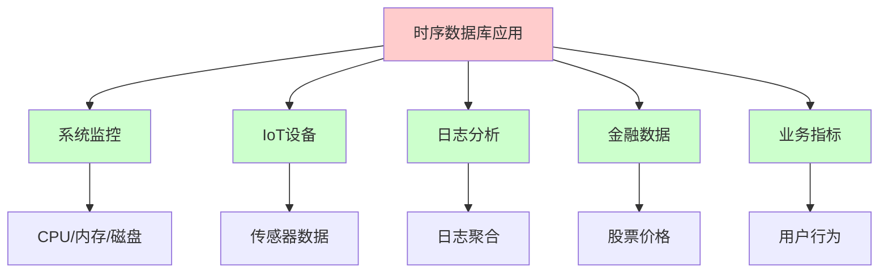

## 主流时序数据库

| 数据库 | 特点 | 适用场景 |
|--------|------|---------|
| **Prometheus** | 开源、Pull 模式 | 监控和告警 |
| **InfluxDB** | 开源、高性能 | IoT、DevOps |
| **TimescaleDB** | 基于 PostgreSQL | 通用时序数据 |
| **OpenTSDB** | 基于 HBase | 大规模监控 |

# Prometheus

## Prometheus 概述

Prometheus 是一个开源的监控和告警系统，最初由 SoundCloud 开发。它采用 Pull 模式从目标收集指标，并存储在时序数据库中，提供强大的查询语言（PromQL）和灵活的告警规则。

## Prometheus 核心特性

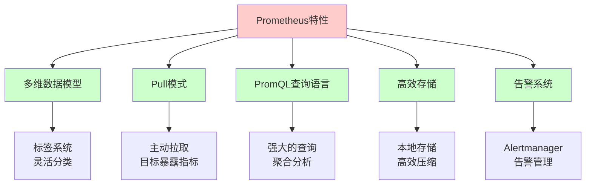

### 1. 多维数据模型

- **指标名称**：标识指标类型
- **标签**：键值对，用于分类和过滤
- **时间序列**：指标名称 + 标签组合

### 2. Pull 模式

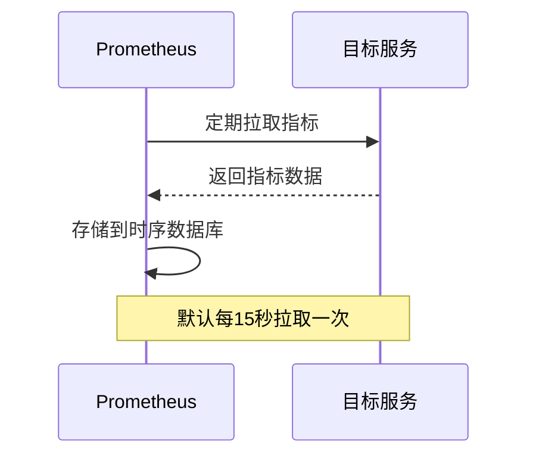

**优势**：
- 集中管理采集配置
- 目标服务无需主动推送
- 易于扩展和监控

### 3. PromQL 查询语言

- **强大的查询能力**：支持聚合、函数、运算符
- **实时计算**：支持实时计算和聚合
- **灵活过滤**：基于标签的灵活过滤

### 4. 高效存储

- **本地存储**：基于本地文件系统
- **数据压缩**：高效的时序数据压缩
- **数据保留**：可配置的数据保留策略

## Prometheus 架构

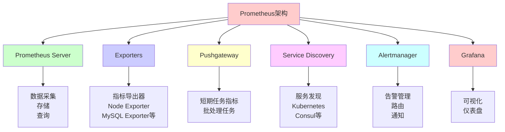

## Prometheus 数据模型

### 指标格式

```promql
metric_name{label1="value1", label2="value2"} value timestamp
```

**示例**：
```promql
http_requests_total{method="GET", status="200", instance="server1:8080"} 1024 1609459200
```

### 指标类型

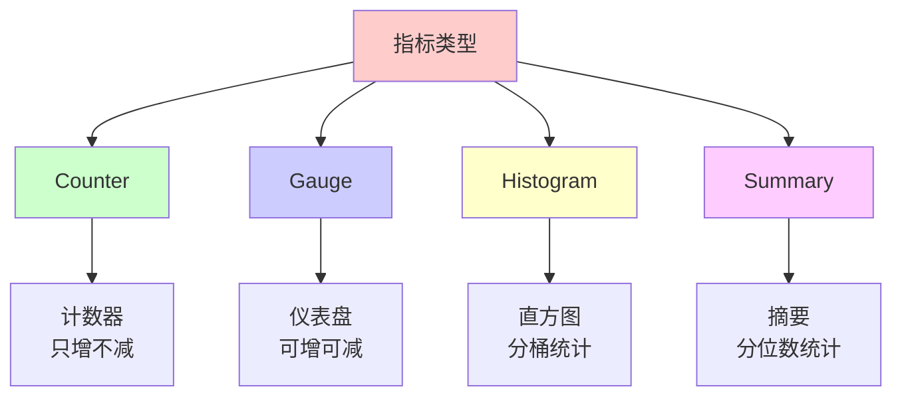

#### 1. Counter（计数器）

- **特点**：只增不减的计数器
- **用途**：累计值，如请求总数、错误总数
- **示例**：`http_requests_total`

#### 2. Gauge（仪表盘）

- **特点**：可增可减的数值
- **用途**：当前值，如 CPU 使用率、内存使用量
- **示例**：`cpu_usage_percent`

#### 3. Histogram（直方图）

- **特点**：将数据分桶统计
- **用途**：分布统计，如请求延迟分布
- **示例**：`http_request_duration_seconds_bucket`

#### 4. Summary（摘要）

- **特点**：计算分位数
- **用途**：分位数统计，如请求延迟分位数
- **示例**：`http_request_duration_seconds{quantile="0.95"}`

## Prometheus 安装和配置

### Docker 安装

```bash
# 创建配置目录
mkdir -p /etc/prometheus

# 创建配置文件
cat > /etc/prometheus/prometheus.yml <<EOF
global:
  scrape_interval: 15s
  evaluation_interval: 15s

scrape_configs:
  - job_name: 'prometheus'
    static_configs:
      - targets: ['localhost:9090']
EOF

# 运行 Prometheus
docker run -d \
  --name=prometheus \
  -p 9090:9090 \
  -v /etc/prometheus:/etc/prometheus \
  prom/prometheus
```

### 二进制安装

```bash
# 下载 Prometheus
wget https://github.com/prometheus/prometheus/releases/download/v2.45.0/prometheus-2.45.0.linux-amd64.tar.gz

# 解压
tar xvfz prometheus-2.45.0.linux-amd64.tar.gz
cd prometheus-2.45.0.linux-amd64

# 启动 Prometheus
./prometheus --config.file=prometheus.yml
```

### 配置文件示例

```yaml
global:
  scrape_interval: 15s      # 抓取间隔
  evaluation_interval: 15s  # 规则评估间隔
  external_labels:
    cluster: 'production'
    replica: '0'

# Alertmanager 配置
alerting:
  alertmanagers:
    - static_configs:
        - targets:
          - alertmanager:9093

# 告警规则
rule_files:
  - "alerts/*.yml"

# 抓取配置
scrape_configs:
  # Prometheus 自身
  - job_name: 'prometheus'
    static_configs:
      - targets: ['localhost:9090']

  # Node Exporter
  - job_name: 'node'
    static_configs:
      - targets: ['node-exporter:9100']

  # 应用服务
  - job_name: 'app'
    static_configs:
      - targets: ['app:8080']
    metrics_path: '/metrics'
    scrape_interval: 10s

  # Kubernetes 服务发现
  - job_name: 'kubernetes-pods'
    kubernetes_sd_configs:
      - role: pod
    relabel_configs:
      - source_labels: [__meta_kubernetes_pod_annotation_prometheus_io_scrape]
        action: keep
        regex: true
```

## PromQL 查询语言

### 基本查询

```promql
# 查询指标
http_requests_total

# 带标签过滤
http_requests_total{method="GET"}

# 多标签过滤
http_requests_total{method="GET", status="200"}

# 标签匹配
http_requests_total{method=~"GET|POST"}
http_requests_total{method!~"DELETE"}
```

### 聚合函数

```promql
# 求和
sum(http_requests_total)

# 平均值
avg(cpu_usage_percent)

# 最大值
max(memory_usage_bytes)

# 最小值
min(disk_free_bytes)

# 计数
count(http_requests_total)

# 分组聚合
sum(http_requests_total) by (method)
avg(cpu_usage_percent) by (instance)
```

### 数学运算

```promql
# 加法
http_requests_total + http_errors_total

# 除法（计算错误率）
rate(http_errors_total[5m]) / rate(http_requests_total[5m])

# 乘法
cpu_usage_percent * 100

# 比较
cpu_usage_percent > 80
memory_usage_bytes < 1024*1024*1024
```

### 时间范围查询

```promql
# 速率（每秒）
rate(http_requests_total[5m])

# 增量
increase(http_requests_total[1h])

# 平均值
avg_over_time(cpu_usage_percent[5m])

# 最大值
max_over_time(memory_usage_bytes[1h])
```

### 常用查询示例

```promql
# CPU 使用率
100 - (avg(irate(node_cpu_seconds_total{mode="idle"}[5m])) * 100)

# 内存使用率
(1 - (node_memory_MemAvailable_bytes / node_memory_MemTotal_bytes)) * 100

# 请求错误率
sum(rate(http_requests_total{status=~"5.."}[5m])) / sum(rate(http_requests_total[5m]))

# 95 分位延迟
histogram_quantile(0.95, rate(http_request_duration_seconds_bucket[5m]))

# 在线实例数
count(up == 1)
```

## Exporters

### Node Exporter（系统指标）

```bash
# 运行 Node Exporter
docker run -d \
  --name=node-exporter \
  -p 9100:9100 \
  prom/node-exporter
```

**指标示例**：
- `node_cpu_seconds_total`：CPU 使用时间
- `node_memory_MemTotal_bytes`：总内存
- `node_disk_io_time_seconds_total`：磁盘 IO 时间
- `node_network_receive_bytes_total`：网络接收字节数

### MySQL Exporter

```bash
# 运行 MySQL Exporter
docker run -d \
  --name=mysql-exporter \
  -p 9104:9104 \
  -e DATA_SOURCE_NAME="user:password@(mysql:3306)/" \
  prom/mysqld-exporter
```

### Redis Exporter

```bash
# 运行 Redis Exporter
docker run -d \
  --name=redis-exporter \
  -p 9121:9121 \
  oliver006/redis_exporter \
  --redis.addr=redis:6379
```

### 自定义 Exporter

```python
# Python 示例
from prometheus_client import start_http_server, Counter, Gauge
import time

# 定义指标
request_count = Counter('http_requests_total', 'Total HTTP requests', ['method', 'status'])
cpu_usage = Gauge('cpu_usage_percent', 'CPU usage percentage')

# 启动 HTTP 服务器
start_http_server(8000)

# 更新指标
while True:
    request_count.labels(method='GET', status='200').inc()
    cpu_usage.set(75.5)
    time.sleep(1)
```

## 告警规则

### 告警规则配置

```yaml
# alerts/cpu.yml
groups:
  - name: cpu_alerts
    interval: 30s
    rules:
      - alert: HighCPUUsage
        expr: 100 - (avg(irate(node_cpu_seconds_total{mode="idle"}[5m])) * 100) > 80
        for: 5m
        labels:
          severity: warning
        annotations:
          summary: "CPU usage is high"
          description: "CPU usage is above 80% for 5 minutes"

      - alert: HighMemoryUsage
        expr: (1 - (node_memory_MemAvailable_bytes / node_memory_MemTotal_bytes)) * 100 > 90
        for: 5m
        labels:
          severity: critical
        annotations:
          summary: "Memory usage is critical"
          description: "Memory usage is above 90% for 5 minutes"
```

### Alertmanager 配置

```yaml
# alertmanager.yml
global:
  resolve_timeout: 5m

route:
  group_by: ['alertname', 'cluster']
  group_wait: 10s
  group_interval: 10s
  repeat_interval: 12h
  receiver: 'default'
  routes:
    - match:
        severity: critical
      receiver: 'critical'
    - match:
        severity: warning
      receiver: 'warning'

receivers:
  - name: 'default'
    webhook_configs:
      - url: 'http://webhook:5000/alerts'

  - name: 'critical'
    email_configs:
      - to: 'admin@example.com'
        subject: 'Critical Alert: {{ .GroupLabels.alertname }}'
    slack_configs:
      - api_url: 'https://hooks.slack.com/services/...'
        channel: '#alerts'

  - name: 'warning'
    email_configs:
      - to: 'ops@example.com'
```

# Prometheus + Grafana

## Grafana 概述

Grafana 是一个开源的可视化平台，用于监控和可视化时序数据。它支持多种数据源，包括 Prometheus、InfluxDB、Elasticsearch 等。

## Grafana 特性

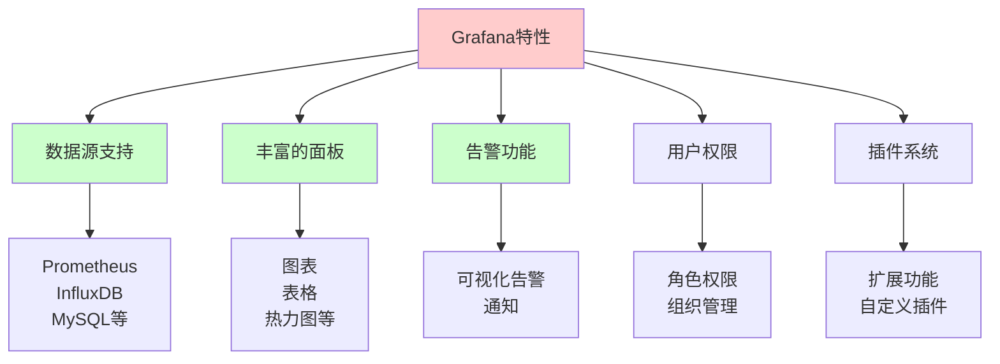

## Grafana 安装

### Docker 安装

```bash
# 运行 Grafana
docker run -d \
  --name=grafana \
  -p 3000:3000 \
  -v grafana-storage:/var/lib/grafana \
  grafana/grafana
```

### 访问 Grafana

- **URL**：http://localhost:3000
- **默认用户名**：admin
- **默认密码**：admin

## 配置 Prometheus 数据源

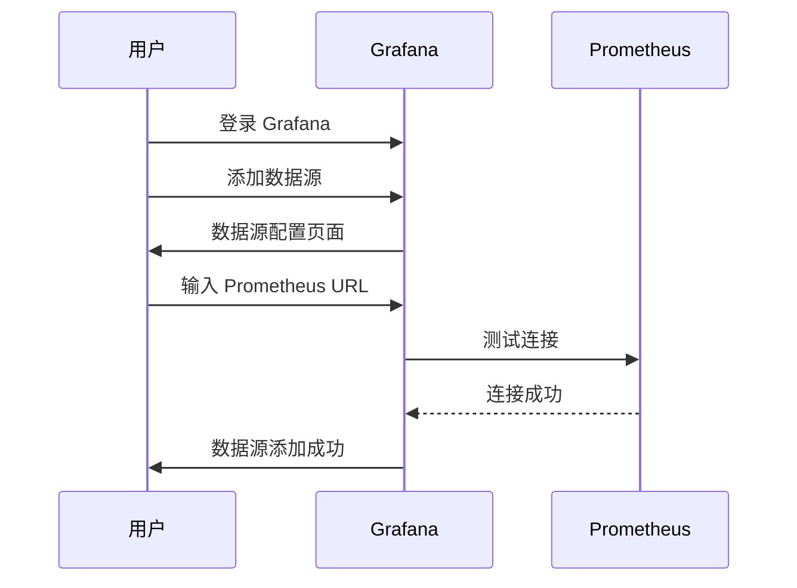

**配置步骤**：
1. 登录 Grafana
2. 进入 Configuration → Data Sources
3. 点击 Add data source
4. 选择 Prometheus
5. 输入 URL：`http://prometheus:9090`
6. 点击 Save & Test

## 创建仪表盘

### 1. 创建新仪表盘

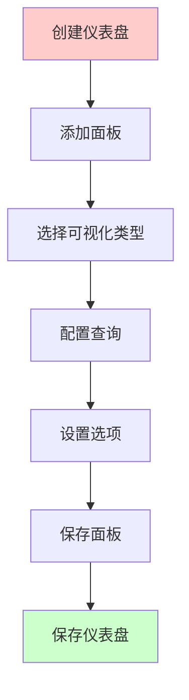

### 2. 常用面板类型

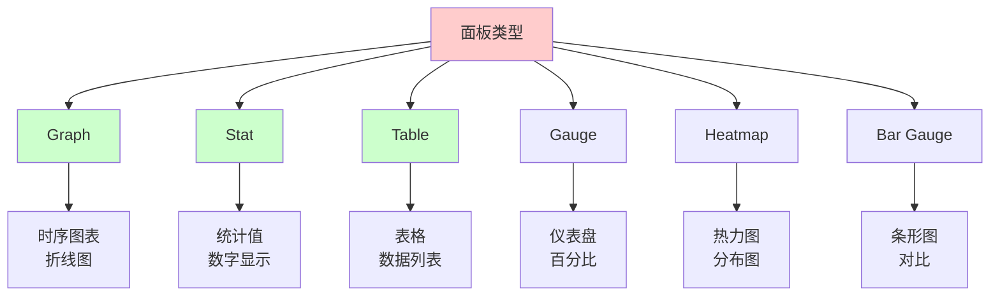

### 3. 面板配置示例

#### CPU 使用率面板

```json
{
  "title": "CPU Usage",
  "targets": [
    {
      "expr": "100 - (avg(irate(node_cpu_seconds_total{mode=\"idle\"}[5m])) * 100)",
      "legendFormat": "CPU Usage"
    }
  ],
  "type": "graph",
  "yaxes": [
    {
      "format": "percent",
      "max": 100,
      "min": 0
    }
  ]
}
```

#### 内存使用率面板

```json
{
  "title": "Memory Usage",
  "targets": [
    {
      "expr": "(1 - (node_memory_MemAvailable_bytes / node_memory_MemTotal_bytes)) * 100",
      "legendFormat": "Memory Usage"
    }
  ],
  "type": "gauge",
  "options": {
    "min": 0,
    "max": 100,
    "thresholds": [
      {
        "value": 80,
        "color": "yellow"
      },
      {
        "value": 90,
        "color": "red"
      }
    ]
  }
}
```

#### 请求速率面板

```json
{
  "title": "HTTP Request Rate",
  "targets": [
    {
      "expr": "sum(rate(http_requests_total[5m])) by (method)",
      "legendFormat": "{{method}}"
    }
  ],
  "type": "graph",
  "stack": true
}
```

## Grafana 告警

### 告警配置

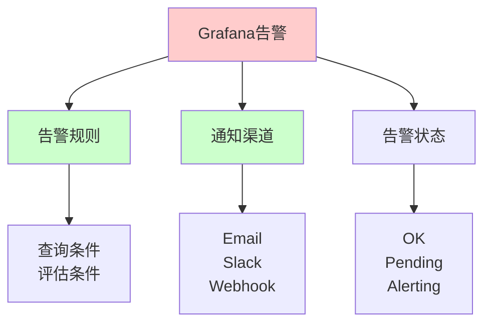

### 告警规则示例

```yaml
# 告警规则
- name: High CPU Usage
  condition: A
  frequency: 30s
  queries:
    - refId: A
      queryType: ''
      relativeTimeRange:
        from: 300
        to: 0
      datasourceUid: prometheus
      model:
        expr: 100 - (avg(irate(node_cpu_seconds_total{mode="idle"}[5m])) * 100) > 80
  noDataState: NoData
  execErrState: Alerting
  for: 5m
  annotations:
    description: CPU usage is above 80%
    summary: High CPU Usage
  labels:
    severity: warning
```

## 完整示例：监控系统搭建

### Docker Compose 配置

```yaml
version: '3.8'

services:
  prometheus:
    image: prom/prometheus:latest
    container_name: prometheus
    ports:
      - "9090:9090"
    volumes:
      - ./prometheus.yml:/etc/prometheus/prometheus.yml
      - prometheus-data:/prometheus
    command:
      - '--config.file=/etc/prometheus/prometheus.yml'
      - '--storage.tsdb.path=/prometheus'
      - '--web.console.libraries=/usr/share/prometheus/console_libraries'
      - '--web.console.templates=/usr/share/prometheus/consoles'

  node-exporter:
    image: prom/node-exporter:latest
    container_name: node-exporter
    ports:
      - "9100:9100"
    command:
      - '--path.procfs=/host/proc'
      - '--path.sysfs=/host/sys'
    volumes:
      - /proc:/host/proc:ro
      - /sys:/host/sys:ro

  grafana:
    image: grafana/grafana:latest
    container_name: grafana
    ports:
      - "3000:3000"
    volumes:
      - grafana-data:/var/lib/grafana
    environment:
      - GF_SECURITY_ADMIN_PASSWORD=admin
    depends_on:
      - prometheus

  alertmanager:
    image: prom/alertmanager:latest
    container_name: alertmanager
    ports:
      - "9093:9093"
    volumes:
      - ./alertmanager.yml:/etc/alertmanager/alertmanager.yml
      - alertmanager-data:/alertmanager

volumes:
  prometheus-data:
  grafana-data:
  alertmanager-data:
```

### Prometheus 配置

```yaml
global:
  scrape_interval: 15s
  evaluation_interval: 15s

scrape_configs:
  - job_name: 'prometheus'
    static_configs:
      - targets: ['localhost:9090']

  - job_name: 'node'
    static_configs:
      - targets: ['node-exporter:9100']
```

### 启动服务

```bash
# 启动所有服务
docker-compose up -d

# 查看服务状态
docker-compose ps

# 访问服务
# Prometheus: http://localhost:9090
# Grafana: http://localhost:3000
# Alertmanager: http://localhost:9093
```

## 最佳实践

### 1. 指标命名规范

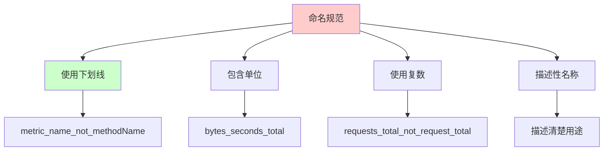

**建议**：
- 使用下划线分隔：`http_requests_total`
- 包含单位：`memory_usage_bytes`
- 使用复数：`requests_total`
- 描述性名称：`cpu_usage_percent`

### 2. 标签使用

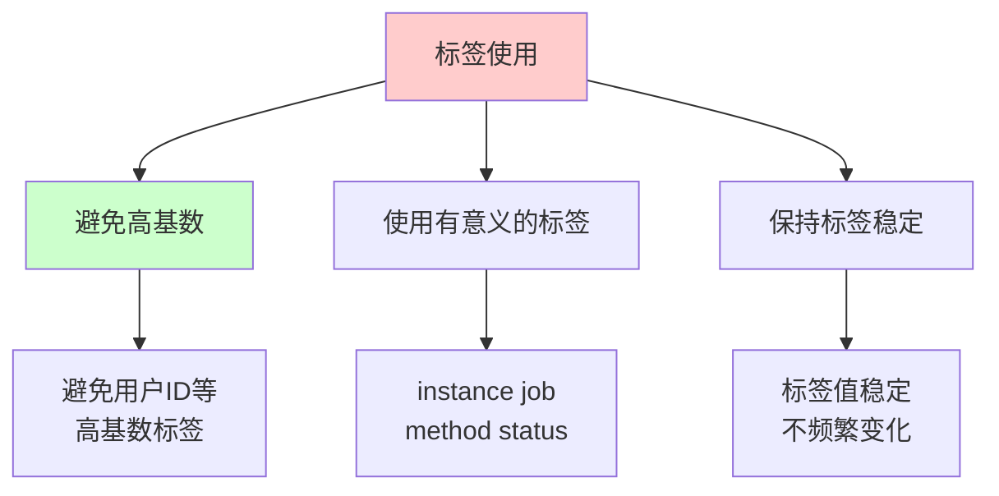

**建议**：
- 避免高基数标签（如用户 ID）
- 使用有意义的标签（instance、job、method）
- 保持标签值稳定

### 3. 查询优化

```mermaid
graph TB
    A[查询优化] --> B[使用 rate]
    A --> C[避免高基数]
    A --> D[使用 recording rules]
    
    B --> B1[rate() 而非 increase()]
    C --> C2[限制标签数量]
    D --> D3[预计算常用查询]
    
    style A fill:#ffcccc
    style B fill:#ccffcc
    style D fill:#ccffcc
```

**建议**：
- 使用 `rate()` 而非 `increase()`
- 避免高基数查询
- 使用 recording rules 预计算

### 4. 存储优化

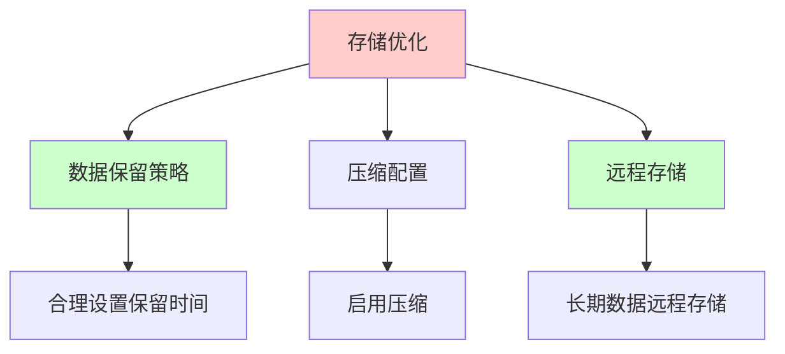

**建议**：
- 合理设置数据保留时间
- 启用数据压缩
- 长期数据使用远程存储

# 总结

Prometheus 是一个强大的监控和告警系统：

## 核心特点

- **多维数据模型**：灵活的标签系统
- **Pull 模式**：主动拉取指标
- **PromQL**：强大的查询语言
- **高效存储**：本地时序数据库
- **告警系统**：灵活的告警规则

## 关键组件

1. **Prometheus Server**：数据采集和存储
2. **Exporters**：指标导出器
3. **Alertmanager**：告警管理
4. **Grafana**：可视化平台

## 应用场景

- 系统监控
- 应用监控
- 业务指标监控
- 告警和通知

理解 Prometheus 有助于：
- 构建监控系统
- 优化系统性能
- 及时发现和解决问题
- 提升系统可靠性

# 参考文献

- [Prometheus Documentation](https://prometheus.io/docs/)
- [Grafana Documentation](https://grafana.com/docs/)
- [PromQL Guide](https://prometheus.io/docs/prometheus/latest/querying/basics/)
