# 什么是向量数据库

向量数据库（Vector Database）是一种专门用于存储、索引和查询高维向量的数据库系统。它通过向量相似度计算，实现高效的相似度搜索，广泛应用于推荐系统、图像搜索、自然语言处理、RAG（检索增强生成）等场景。

## 向量数据库的核心概念

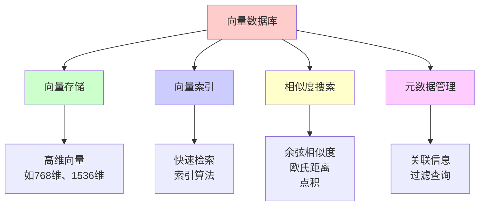

### 1. 向量（Vector）

- **定义**：由多个数值组成的一维数组，表示对象在向量空间中的位置
- **维度**：向量的长度，通常为 128、256、512、768、1536 等
- **示例**：`[0.1, 0.2, -0.3, 0.4, ...]`（768 维）

### 2. 嵌入（Embedding）

- **定义**：将文本、图像等数据转换为向量的过程
- **特点**：语义相似的向量在空间中距离较近
- **应用**：文本嵌入、图像嵌入、多模态嵌入

### 3. 相似度搜索（Similarity Search）

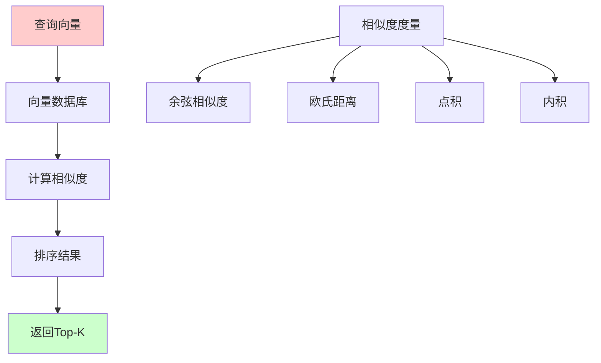

## 向量数据库的特点

### 1. 高维向量支持

- 支持数百到数千维的向量
- 高效处理大规模向量数据
- 内存和磁盘优化

### 2. 快速相似度搜索

```mermaid
graph TB
    A[传统数据库] --> B[精确匹配]
    B --> C[线性搜索<br/>O(n)]
    
    D[向量数据库] --> E[相似度搜索]
    E --> F[索引加速<br/>O(log n)]
    
    style A fill:#ffcccc
    style C fill:#ffcccc
    style D fill:#ccffcc
    style F fill:#ccffcc
```

- 使用索引算法加速搜索
- 支持近似最近邻（ANN）搜索
- 查询延迟通常在毫秒级

### 3. 元数据过滤

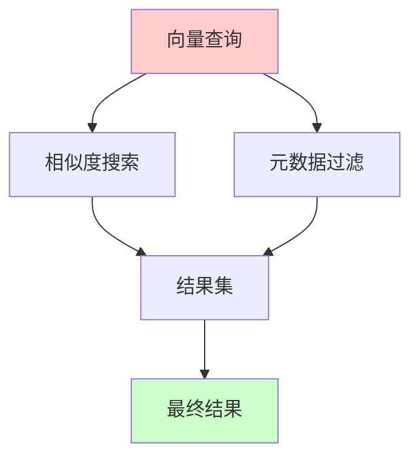

- 支持结构化元数据
- 可以结合向量搜索和元数据过滤
- 灵活的组合查询

### 4. 可扩展性

- 支持水平扩展
- 分布式架构
- 高可用性

## 向量数据库的应用场景

### 1. RAG（检索增强生成）

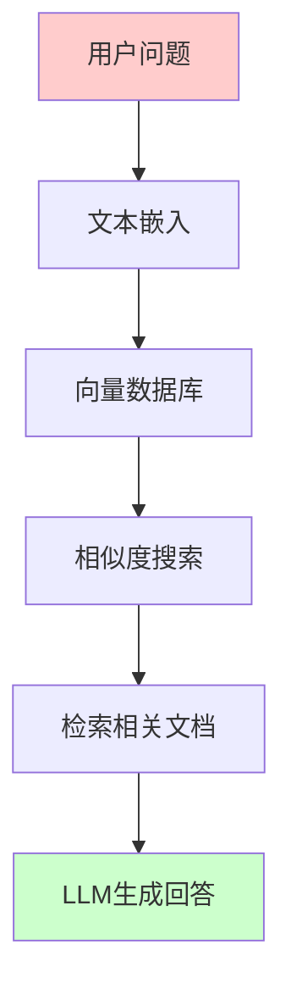

**应用**：
- 知识库问答
- 文档检索
- 智能客服

### 2. 推荐系统

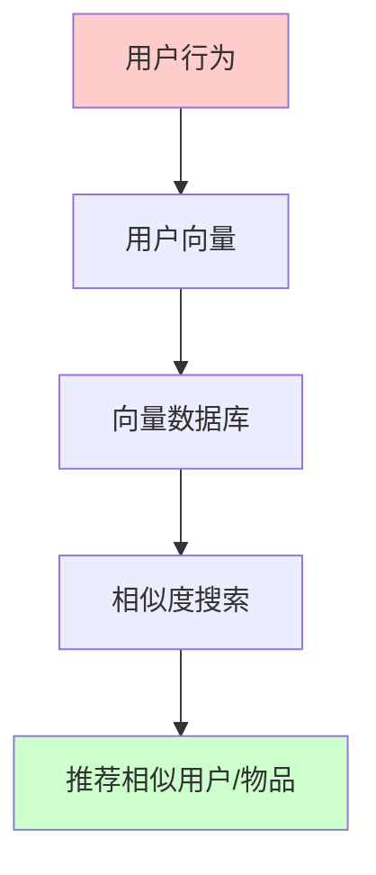

**应用**：
- 商品推荐
- 内容推荐
- 用户相似度匹配

### 3. 图像搜索

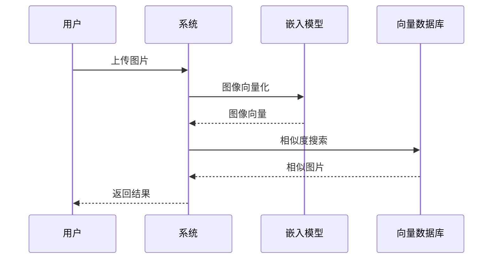

**应用**：
- 以图搜图
- 相似图片推荐
- 图像分类

### 4. 语义搜索

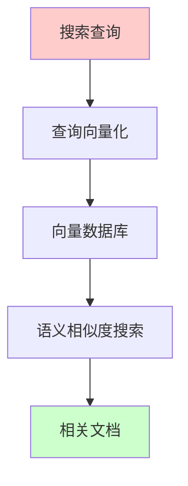

**应用**：
- 语义文档搜索
- 代码搜索
- 知识图谱查询

## 向量数据库 vs 传统数据库

| 特性 | 传统数据库 | 向量数据库 |
|------|----------|-----------|
| **数据类型** | 结构化数据 | 高维向量 |
| **查询方式** | SQL 精确匹配 | 相似度搜索 |
| **索引方式** | B-tree, Hash | 向量索引（HNSW, IVF） |
| **适用场景** | 事务处理 | 相似度检索 |
| **查询性能** | 精确匹配快 | 相似度搜索快 |

# 向量数据库搭建

## 主流向量数据库

### 1. 产品对比

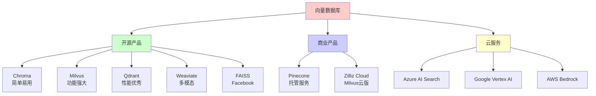

### 2. 产品特性对比

| 产品 | 类型 | 特点 | 适用场景 |
|------|------|------|---------|
| **Chroma** | 开源 | 简单易用，Python 友好 | 小到中型项目 |
| **Milvus** | 开源 | 功能强大，可扩展 | 企业级应用 |
| **Qdrant** | 开源 | 性能优秀，Rust 实现 | 高性能场景 |
| **Weaviate** | 开源 | 多模态，GraphQL | 复杂查询 |
| **Pinecone** | 商业 | 托管服务，易用 | 快速部署 |
| **FAISS** | 开源 | Facebook 开发，库形式 | 研究开发 |

## Chroma 搭建

### 1. 安装

```bash
# 使用 pip 安装
pip install chromadb

# 或使用 conda
conda install -c conda-forge chromadb
```

### 2. 基本使用

```python
import chromadb
from chromadb.config import Settings

# 创建客户端
client = chromadb.Client(Settings(
    chroma_db_impl="duckdb+parquet",
    persist_directory="./chroma_db"
))

# 创建集合（Collection）
collection = client.create_collection(
    name="my_collection",
    metadata={"hnsw:space": "cosine"}  # 使用余弦相似度
)

# 添加数据
collection.add(
    embeddings=[[0.1, 0.2, 0.3], [0.4, 0.5, 0.6]],
    documents=["文档1", "文档2"],
    ids=["id1", "id2"],
    metadatas=[{"source": "doc1"}, {"source": "doc2"}]
)

# 查询
results = collection.query(
    query_embeddings=[[0.1, 0.2, 0.3]],
    n_results=2
)
```

### 3. 持久化存储

```python
import chromadb

# 持久化客户端
client = chromadb.PersistentClient(path="./chroma_db")

# 获取或创建集合
collection = client.get_or_create_collection(
    name="my_collection",
    metadata={"hnsw:space": "cosine"}
)

# 数据会自动持久化
collection.add(
    embeddings=[[0.1, 0.2, 0.3]],
    documents=["文档"],
    ids=["id1"]
)
```

## Milvus 搭建

### 1. Docker 安装

```bash
# 下载 docker-compose.yml
wget https://github.com/milvus-io/milvus/releases/download/v2.3.0/milvus-standalone-docker-compose.yml -O docker-compose.yml

# 启动 Milvus
docker-compose up -d

# 检查状态
docker-compose ps
```

### 2. Python 客户端

```python
from pymilvus import connections, Collection, FieldSchema, CollectionSchema, DataType

# 连接 Milvus
connections.connect(
    alias="default",
    host="localhost",
    port="19530"
)

# 定义字段
fields = [
    FieldSchema(name="id", dtype=DataType.INT64, is_primary=True),
    FieldSchema(name="embedding", dtype=DataType.FLOAT_VECTOR, dim=768),
    FieldSchema(name="text", dtype=DataType.VARCHAR, max_length=500)
]

# 创建集合
schema = CollectionSchema(fields, "文档集合")
collection = Collection("my_collection", schema)

# 创建索引
index_params = {
    "metric_type": "L2",
    "index_type": "IVF_FLAT",
    "params": {"nlist": 1024}
}
collection.create_index("embedding", index_params)

# 加载集合
collection.load()

# 插入数据
data = [
    [1, 2, 3],  # IDs
    [[0.1, 0.2, ...], [0.3, 0.4, ...]],  # Embeddings
    ["文档1", "文档2"]  # Texts
]
collection.insert(data)

# 搜索
search_params = {"metric_type": "L2", "params": {"nprobe": 10}}
results = collection.search(
    data=[[0.1, 0.2, ...]],  # 查询向量
    anns_field="embedding",
    param=search_params,
    limit=10
)
```

## Qdrant 搭建

### 1. Docker 安装

```bash
# 拉取镜像
docker pull qdrant/qdrant

# 运行容器
docker run -p 6333:6333 -p 6334:6334 qdrant/qdrant
```

### 2. Python 客户端

```python
from qdrant_client import QdrantClient
from qdrant_client.models import Distance, VectorParams, PointStruct

# 创建客户端
client = QdrantClient(host="localhost", port=6333)

# 创建集合
client.create_collection(
    collection_name="my_collection",
    vectors_config=VectorParams(size=768, distance=Distance.COSINE)
)

# 插入数据
points = [
    PointStruct(
        id=1,
        vector=[0.1, 0.2, ...],
        payload={"text": "文档1", "source": "doc1"}
    ),
    PointStruct(
        id=2,
        vector=[0.3, 0.4, ...],
        payload={"text": "文档2", "source": "doc2"}
    )
]
client.upsert(collection_name="my_collection", points=points)

# 搜索
results = client.search(
    collection_name="my_collection",
    query_vector=[0.1, 0.2, ...],
    limit=10
)
```

## Weaviate 搭建

### 1. Docker 安装

```bash
# 使用 Docker Compose
docker-compose up -d
```

`docker-compose.yml`:
```yaml
version: '3.4'
services:
  weaviate:
    image: semitechnologies/weaviate:latest
    ports:
      - "8080:8080"
    environment:
      QUERY_DEFAULTS_LIMIT: 25
      AUTHENTICATION_ANONYMOUS_ACCESS_ENABLED: 'true'
      PERSISTENCE_DATA_PATH: '/var/lib/weaviate'
      DEFAULT_VECTORIZER_MODULE: 'none'
      ENABLE_MODULES: 'text2vec-openai'
      CLUSTER_HOSTNAME: 'node1'
```

### 2. Python 客户端

```python
import weaviate

# 创建客户端
client = weaviate.Client("http://localhost:8080")

# 创建类（Collection）
class_obj = {
    "class": "Document",
    "vectorizer": "none",
    "properties": [
        {"name": "text", "dataType": ["text"]},
        {"name": "source", "dataType": ["string"]}
    ]
}
client.schema.create_class(class_obj)

# 插入数据
client.data_object.create(
    data_object={
        "text": "文档内容",
        "source": "doc1"
    },
    class_name="Document",
    vector=[0.1, 0.2, ...]  # 手动提供向量
)

# 搜索
result = client.query.get(
    "Document",
    ["text", "source"]
).with_near_vector({
    "vector": [0.1, 0.2, ...],
    "certainty": 0.7
}).with_limit(10).do()
```

## Pinecone（云服务）

### 1. 注册和创建索引

```python
import pinecone

# 初始化
pinecone.init(api_key="your-api-key", environment="us-west1-gcp")

# 创建索引
pinecone.create_index(
    name="my-index",
    dimension=768,
    metric="cosine"
)

# 连接索引
index = pinecone.Index("my-index")

# 插入向量
index.upsert([
    ("id1", [0.1, 0.2, ...], {"text": "文档1"}),
    ("id2", [0.3, 0.4, ...], {"text": "文档2"})
])

# 搜索
results = index.query(
    vector=[0.1, 0.2, ...],
    top_k=10,
    include_metadata=True
)
```

# 向量数据库索引

## 索引类型

### 1. 索引分类

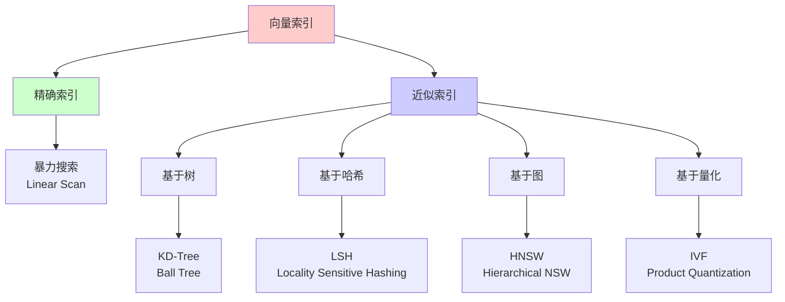

### 2. 常用索引算法

#### HNSW (Hierarchical Navigable Small World)

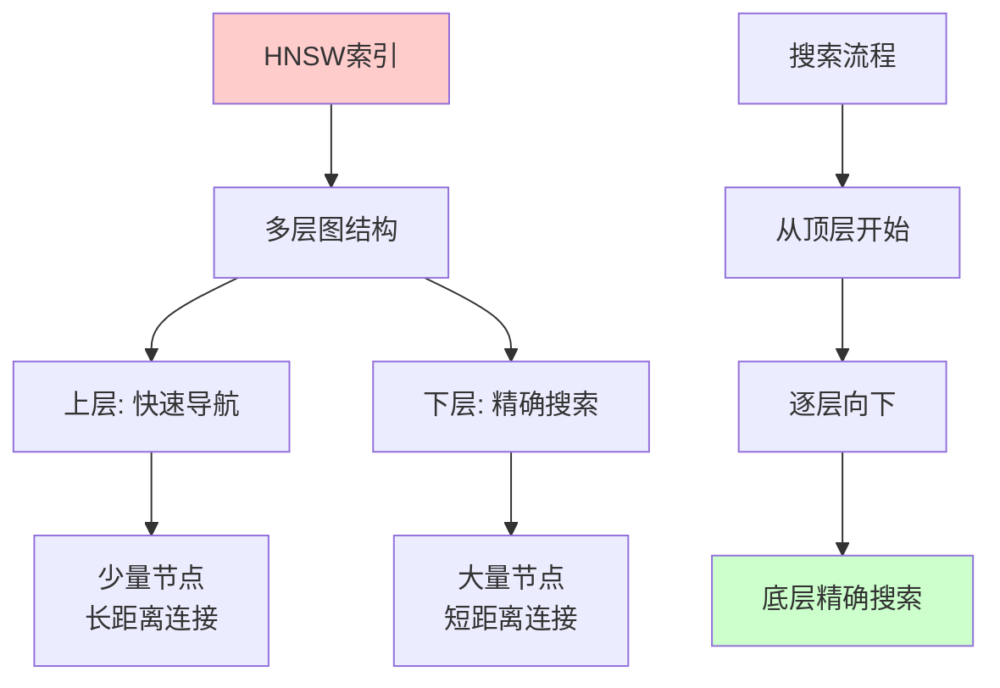

**特点**：
- 基于图的索引
- 支持快速近似搜索
- 适合高维向量
- 查询复杂度：O(log n)

**适用场景**：
- 大规模向量搜索
- 高维向量
- 实时查询

#### IVF (Inverted File Index)

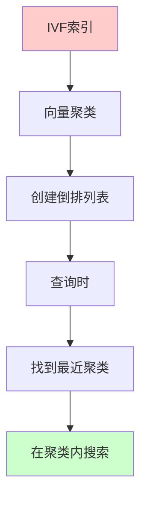

**特点**：
- 基于聚类的索引
- 需要训练阶段
- 查询速度快
- 内存占用相对较小

**适用场景**：
- 大规模数据集
- 批量查询
- 内存受限场景

#### LSH (Locality Sensitive Hashing)

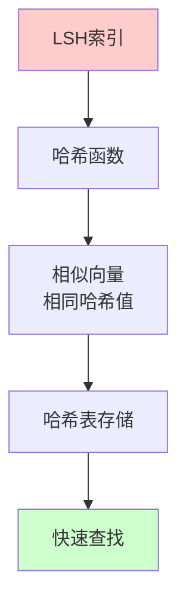

**特点**：
- 基于哈希的索引
- 概率性保证
- 适合高维稀疏向量
- 查询速度快

**适用场景**：
- 高维稀疏向量
- 快速近似搜索
- 内存受限

## 索引选择指南

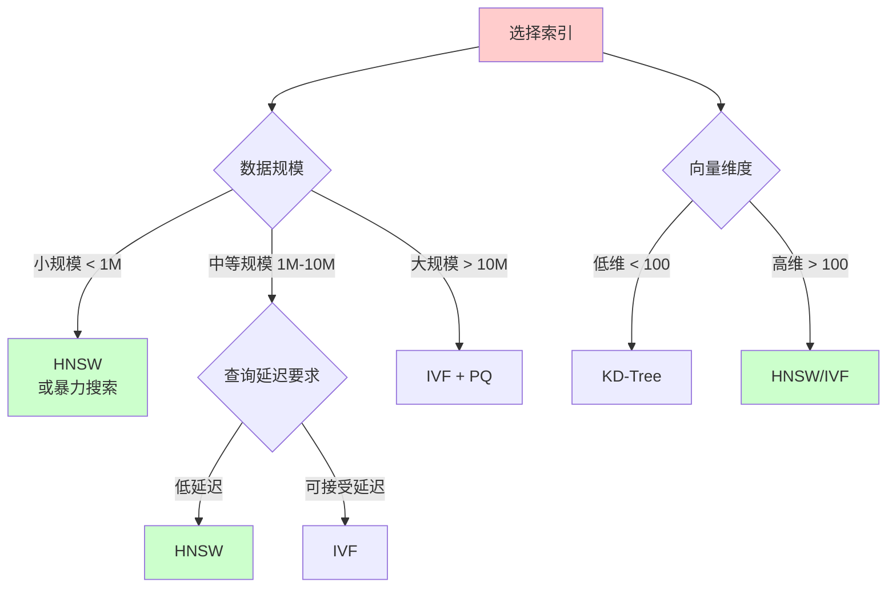

## 相似度度量

### 1. 余弦相似度（Cosine Similarity）

```python
import numpy as np

def cosine_similarity(vec1, vec2):
    """计算余弦相似度"""
    dot_product = np.dot(vec1, vec2)
    norm1 = np.linalg.norm(vec1)
    norm2 = np.linalg.norm(vec2)
    return dot_product / (norm1 * norm2)

# 示例
vec1 = np.array([1, 2, 3])
vec2 = np.array([4, 5, 6])
similarity = cosine_similarity(vec1, vec2)
print(f"余弦相似度: {similarity}")
```

**特点**：
- 范围：[-1, 1]
- 不受向量长度影响
- 适合文本嵌入

### 2. 欧氏距离（Euclidean Distance）

```python
def euclidean_distance(vec1, vec2):
    """计算欧氏距离"""
    return np.linalg.norm(vec1 - vec2)

# 示例
distance = euclidean_distance(vec1, vec2)
print(f"欧氏距离: {distance}")
```

**特点**：
- 范围：[0, +∞)
- 距离越小越相似
- 适合图像嵌入

### 3. 点积（Dot Product）

```python
def dot_product(vec1, vec2):
    """计算点积"""
    return np.dot(vec1, vec2)

# 示例
dot = dot_product(vec1, vec2)
print(f"点积: {dot}")
```

**特点**：
- 范围：(-∞, +∞)
- 计算速度快
- 需要向量归一化

## 索引性能对比

| 索引类型 | 查询速度 | 内存占用 | 索引构建时间 | 精度 |
|---------|---------|---------|------------|------|
| **暴力搜索** | 慢 O(n) | 低 | 无 | 100% |
| **HNSW** | 快 O(log n) | 高 | 中等 | 高 |
| **IVF** | 快 | 中等 | 长 | 中等 |
| **LSH** | 很快 | 低 | 短 | 中等 |

# 向量数据库增删查改

## 基本操作

### 1. 创建集合（Collection）

```python
# Chroma 示例
import chromadb

client = chromadb.Client()
collection = client.create_collection(
    name="documents",
    metadata={"hnsw:space": "cosine"}
)

# Milvus 示例
from pymilvus import Collection, CollectionSchema, FieldSchema, DataType

fields = [
    FieldSchema(name="id", dtype=DataType.INT64, is_primary=True),
    FieldSchema(name="embedding", dtype=DataType.FLOAT_VECTOR, dim=768),
    FieldSchema(name="text", dtype=DataType.VARCHAR, max_length=500)
]
schema = CollectionSchema(fields, "文档集合")
collection = Collection("documents", schema)
```

### 2. 插入数据（Create）

```python
# Chroma 示例
collection.add(
    embeddings=[
        [0.1, 0.2, 0.3, ...],  # 向量1
        [0.4, 0.5, 0.6, ...],  # 向量2
    ],
    documents=["文档内容1", "文档内容2"],
    ids=["doc1", "doc2"],
    metadatas=[
        {"source": "file1.pdf", "page": 1},
        {"source": "file2.pdf", "page": 2}
    ]
)

# Milvus 示例
data = [
    [1, 2],  # IDs
    [[0.1, 0.2, ...], [0.4, 0.5, ...]],  # Embeddings
    ["文档1", "文档2"]  # Texts
]
collection.insert(data)

# Qdrant 示例
from qdrant_client.models import PointStruct

points = [
    PointStruct(
        id=1,
        vector=[0.1, 0.2, ...],
        payload={"text": "文档1", "source": "file1.pdf"}
    )
]
client.upsert(collection_name="documents", points=points)
```

### 3. 查询数据（Read）

```python
# Chroma 示例 - 向量查询
results = collection.query(
    query_embeddings=[[0.1, 0.2, 0.3, ...]],
    n_results=5,
    where={"source": "file1.pdf"},  # 元数据过滤
    include=["documents", "metadatas", "distances"]
)

# Chroma 示例 - 文本查询（需要嵌入函数）
results = collection.query(
    query_texts=["查询文本"],
    n_results=5
)

# Milvus 示例
search_params = {"metric_type": "L2", "params": {"nprobe": 10}}
results = collection.search(
    data=[[0.1, 0.2, ...]],
    anns_field="embedding",
    param=search_params,
    limit=5,
    output_fields=["text"]
)

# Qdrant 示例
results = client.search(
    collection_name="documents",
    query_vector=[0.1, 0.2, ...],
    limit=5,
    query_filter={
        "must": [
            {"key": "source", "match": {"value": "file1.pdf"}}
        ]
    }
)
```

### 4. 更新数据（Update）

```python
# Chroma 示例 - 更新（实际上是删除后重新添加）
collection.delete(ids=["doc1"])
collection.add(
    embeddings=[[0.7, 0.8, 0.9, ...]],
    documents=["更新后的文档"],
    ids=["doc1"],
    metadatas=[{"source": "file1.pdf", "page": 1, "updated": True}]
)

# Qdrant 示例 - 更新
client.upsert(
    collection_name="documents",
    points=[
        PointStruct(
            id=1,
            vector=[0.7, 0.8, ...],
            payload={"text": "更新后的文档", "updated": True}
        )
    ]
)

# Milvus 示例 - 更新（删除后插入）
collection.delete(expr="id in [1]")
collection.insert([
    [1],
    [[0.7, 0.8, ...]],
    ["更新后的文档"]
])
```

### 5. 删除数据（Delete）

```python
# Chroma 示例
collection.delete(
    ids=["doc1", "doc2"],
    where={"source": "file1.pdf"}  # 可选：元数据过滤
)

# Milvus 示例
collection.delete(expr="id in [1, 2]")

# Qdrant 示例
client.delete(
    collection_name="documents",
    points_selector=[1, 2]  # 或使用过滤器
)
```

## 完整示例

### Chroma 完整示例

```python
import chromadb
from chromadb.config import Settings
import numpy as np

# 创建持久化客户端
client = chromadb.PersistentClient(path="./chroma_db")

# 获取或创建集合
collection = client.get_or_create_collection(
    name="documents",
    metadata={"hnsw:space": "cosine"}
)

# 1. 插入数据
documents = [
    "人工智能是计算机科学的一个分支",
    "机器学习是人工智能的核心技术",
    "深度学习是机器学习的一个子领域"
]
embeddings = [
    np.random.rand(768).tolist() for _ in range(3)
]
ids = ["doc1", "doc2", "doc3"]
metadatas = [
    {"source": "ai.txt", "category": "AI"},
    {"source": "ml.txt", "category": "ML"},
    {"source": "dl.txt", "category": "DL"}
]

collection.add(
    embeddings=embeddings,
    documents=documents,
    ids=ids,
    metadatas=metadatas
)

# 2. 查询数据
query_embedding = np.random.rand(768).tolist()
results = collection.query(
    query_embeddings=[query_embedding],
    n_results=2,
    where={"category": "AI"},  # 元数据过滤
    include=["documents", "metadatas", "distances"]
)

print("查询结果:")
for i, doc in enumerate(results["documents"][0]):
    print(f"{i+1}. {doc}")
    print(f"   距离: {results['distances'][0][i]}")
    print(f"   元数据: {results['metadatas'][0][i]}")

# 3. 更新数据
collection.delete(ids=["doc1"])
collection.add(
    embeddings=[np.random.rand(768).tolist()],
    documents=["更新后的人工智能定义"],
    ids=["doc1"],
    metadatas=[{"source": "ai_updated.txt", "category": "AI", "updated": True}]
)

# 4. 删除数据
collection.delete(ids=["doc3"])

# 5. 获取所有数据
all_data = collection.get()
print(f"\n集合中的文档数量: {len(all_data['ids'])}")
```

### Milvus 完整示例

```python
from pymilvus import connections, Collection, FieldSchema, CollectionSchema, DataType
import numpy as np

# 连接 Milvus
connections.connect(
    alias="default",
    host="localhost",
    port="19530"
)

# 定义字段
fields = [
    FieldSchema(name="id", dtype=DataType.INT64, is_primary=True, auto_id=True),
    FieldSchema(name="embedding", dtype=DataType.FLOAT_VECTOR, dim=768),
    FieldSchema(name="text", dtype=DataType.VARCHAR, max_length=500),
    FieldSchema(name="source", dtype=DataType.VARCHAR, max_length=100)
]

# 创建集合
schema = CollectionSchema(fields, "文档集合")
collection = Collection("documents", schema)

# 创建索引
index_params = {
    "metric_type": "L2",
    "index_type": "IVF_FLAT",
    "params": {"nlist": 1024}
}
collection.create_index("embedding", index_params)

# 加载集合
collection.load()

# 1. 插入数据
data = [
    [np.random.rand(768).tolist() for _ in range(3)],  # Embeddings
    ["文档1", "文档2", "文档3"],  # Texts
    ["file1.txt", "file2.txt", "file3.txt"]  # Sources
]
collection.insert(data)

# 2. 查询数据
search_params = {"metric_type": "L2", "params": {"nprobe": 10}}
query_vector = [np.random.rand(768).tolist()]
results = collection.search(
    data=query_vector,
    anns_field="embedding",
    param=search_params,
    limit=2,
    output_fields=["text", "source"]
)

print("查询结果:")
for hits in results:
    for hit in hits:
        print(f"ID: {hit.id}, 距离: {hit.distance}")
        print(f"文本: {hit.entity.get('text')}")
        print(f"来源: {hit.entity.get('source')}")

# 3. 删除数据
collection.delete(expr="id in [1, 2]")

# 4. 释放集合
collection.release()
```

### Qdrant 完整示例

```python
from qdrant_client import QdrantClient
from qdrant_client.models import Distance, VectorParams, PointStruct, Filter, FieldCondition, MatchValue
import numpy as np

# 创建客户端
client = QdrantClient(host="localhost", port=6333)

# 创建集合
client.create_collection(
    collection_name="documents",
    vectors_config=VectorParams(size=768, distance=Distance.COSINE)
)

# 1. 插入数据
points = [
    PointStruct(
        id=1,
        vector=np.random.rand(768).tolist(),
        payload={"text": "文档1", "source": "file1.txt", "category": "AI"}
    ),
    PointStruct(
        id=2,
        vector=np.random.rand(768).tolist(),
        payload={"text": "文档2", "source": "file2.txt", "category": "ML"}
    ),
    PointStruct(
        id=3,
        vector=np.random.rand(768).tolist(),
        payload={"text": "文档3", "source": "file3.txt", "category": "DL"}
    )
]
client.upsert(collection_name="documents", points=points)

# 2. 查询数据（带过滤）
query_filter = Filter(
    must=[
        FieldCondition(key="category", match=MatchValue(value="AI"))
    ]
)

results = client.search(
    collection_name="documents",
    query_vector=np.random.rand(768).tolist(),
    limit=2,
    query_filter=query_filter
)

print("查询结果:")
for result in results:
    print(f"ID: {result.id}, 分数: {result.score}")
    print(f"载荷: {result.payload}")

# 3. 更新数据
client.upsert(
    collection_name="documents",
    points=[
        PointStruct(
            id=1,
            vector=np.random.rand(768).tolist(),
            payload={"text": "更新后的文档1", "source": "file1_updated.txt", "category": "AI", "updated": True}
        )
    ]
)

# 4. 删除数据
client.delete(
    collection_name="documents",
    points_selector=[3]
)

# 5. 获取点信息
point = client.retrieve(
    collection_name="documents",
    ids=[1]
)
print(f"\n点信息: {point}")
```

## 批量操作

### 批量插入

```python
# Chroma 批量插入
def batch_insert(collection, embeddings, documents, ids, batch_size=100):
    """批量插入数据"""
    for i in range(0, len(embeddings), batch_size):
        batch_embeddings = embeddings[i:i+batch_size]
        batch_documents = documents[i:i+batch_size]
        batch_ids = ids[i:i+batch_size]
        
        collection.add(
            embeddings=batch_embeddings,
            documents=batch_documents,
            ids=batch_ids
        )
        print(f"已插入 {min(i+batch_size, len(embeddings))}/{len(embeddings)} 条数据")

# 使用
batch_insert(collection, embeddings, documents, ids, batch_size=100)
```

### 批量查询

```python
# 批量查询
def batch_query(collection, query_embeddings, n_results=5):
    """批量查询"""
    results = collection.query(
        query_embeddings=query_embeddings,
        n_results=n_results
    )
    return results

# 使用
query_embeddings = [np.random.rand(768).tolist() for _ in range(10)]
results = batch_query(collection, query_embeddings, n_results=5)
```

## 元数据过滤

### Chroma 元数据过滤

```python
# 精确匹配
results = collection.query(
    query_embeddings=[query_embedding],
    n_results=5,
    where={"source": "file1.pdf"}
)

# 范围查询
results = collection.query(
    query_embeddings=[query_embedding],
    n_results=5,
    where={"page": {"$gte": 1, "$lte": 10}}
)

# 包含查询
results = collection.query(
    query_embeddings=[query_embedding],
    n_results=5,
    where={"category": {"$in": ["AI", "ML"]}}
)
```

### Qdrant 元数据过滤

```python
from qdrant_client.models import Filter, FieldCondition, MatchValue, Range

# 精确匹配
query_filter = Filter(
    must=[
        FieldCondition(key="source", match=MatchValue(value="file1.pdf"))
    ]
)

# 范围查询
query_filter = Filter(
    must=[
        FieldCondition(
            key="page",
            range=Range(gte=1, lte=10)
        )
    ]
)

# 组合查询
query_filter = Filter(
    must=[
        FieldCondition(key="category", match=MatchValue(value="AI")),
        FieldCondition(
            key="page",
            range=Range(gte=1, lte=10)
        )
    ]
)

results = client.search(
    collection_name="documents",
    query_vector=query_vector,
    query_filter=query_filter,
    limit=10
)
```

# 向量数据库最佳实践

## 1. 向量维度选择

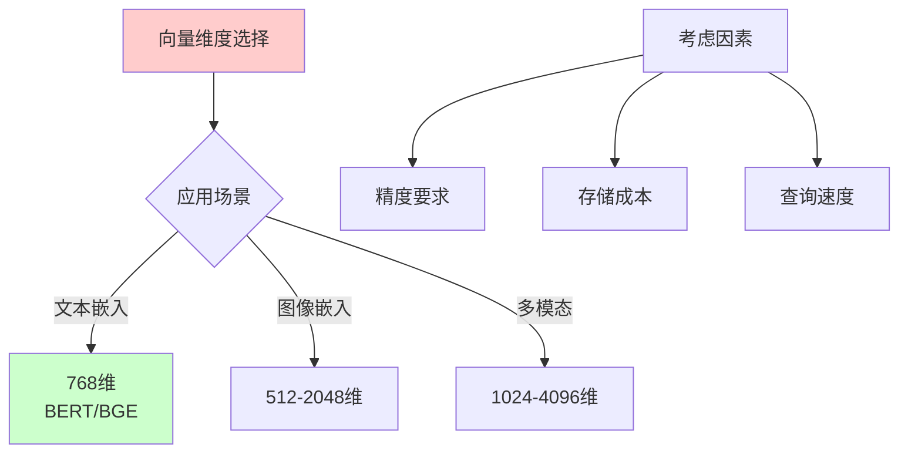

**建议**：
- 文本嵌入：通常 768 或 1536 维
- 图像嵌入：512-2048 维
- 平衡精度和性能

## 2. 索引参数调优

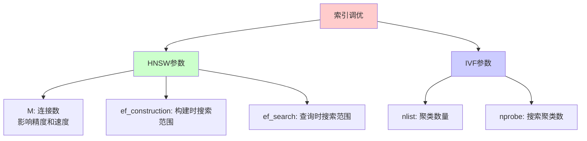

**HNSW 参数**：
- `M`: 每个节点的连接数（通常 16-64）
- `ef_construction`: 构建时的搜索范围（通常 200-400）
- `ef_search`: 查询时的搜索范围（通常 50-200）

**IVF 参数**：
- `nlist`: 聚类数量（通常 1024-16384）
- `nprobe`: 搜索时检查的聚类数（通常 10-256）

## 3. 数据预处理

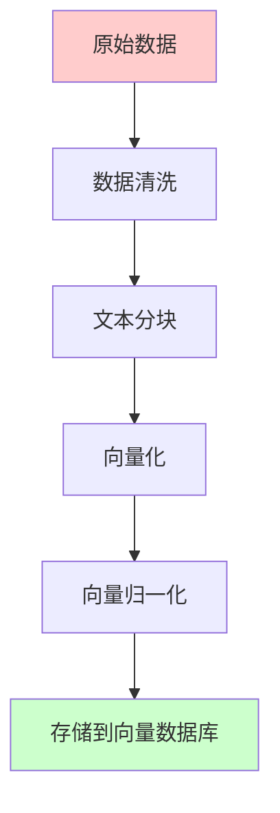

**建议**：
- 清洗无关内容
- 合理分块（通常 500-1000 字符）
- 向量归一化（对于余弦相似度）
- 添加有意义的元数据

## 4. 查询优化

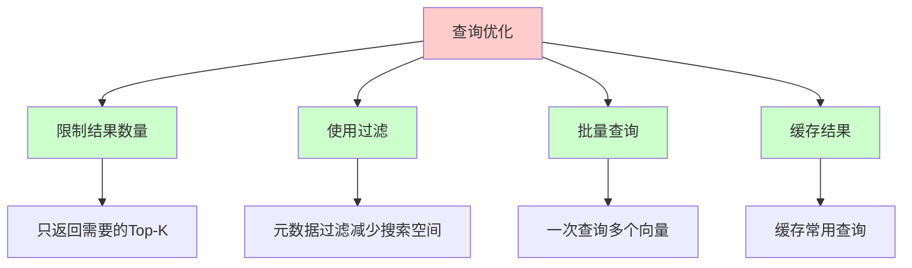

**建议**：
- 合理设置 Top-K（通常 5-20）
- 使用元数据过滤
- 批量查询提高吞吐量
- 缓存常用查询结果

## 5. 性能监控

```python
import time
from functools import wraps

def monitor_performance(func):
    """性能监控装饰器"""
    @wraps(func)
    def wrapper(*args, **kwargs):
        start_time = time.time()
        result = func(*args, **kwargs)
        end_time = time.time()
        print(f"{func.__name__} 执行时间: {end_time - start_time:.4f}秒")
        return result
    return wrapper

# 使用
@monitor_performance
def query_vectors(collection, query_embedding, n_results=5):
    return collection.query(
        query_embeddings=[query_embedding],
        n_results=n_results
    )
```

# 总结

向量数据库是 AI 应用的重要基础设施：

## 核心特点

- **高维向量支持**：处理数百到数千维的向量
- **快速相似度搜索**：毫秒级查询响应
- **元数据过滤**：结合向量搜索和结构化查询
- **可扩展性**：支持大规模数据和高并发

## 主流产品

- **Chroma**：简单易用，适合小到中型项目
- **Milvus**：功能强大，适合企业级应用
- **Qdrant**：性能优秀，适合高性能场景
- **Weaviate**：多模态支持，适合复杂查询
- **Pinecone**：托管服务，适合快速部署

## 关键操作

1. **创建集合**：定义向量维度和相似度度量
2. **插入数据**：批量插入向量和元数据
3. **查询数据**：相似度搜索和元数据过滤
4. **更新数据**：删除后重新插入
5. **删除数据**：按 ID 或条件删除

## 最佳实践

- 合理选择向量维度
- 优化索引参数
- 数据预处理和归一化
- 查询优化和性能监控

理解向量数据库有助于：
- 构建 RAG 系统
- 实现推荐系统
- 开发语义搜索
- 优化 AI 应用性能

# 参考文献

- [Chroma Documentation](https://docs.trychroma.com/)
- [Milvus Documentation](https://milvus.io/docs)
- [Qdrant Documentation](https://qdrant.tech/documentation/)
- [Weaviate Documentation](https://weaviate.io/developers/weaviate)
