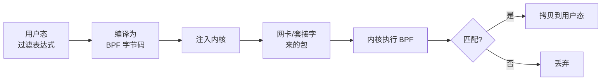
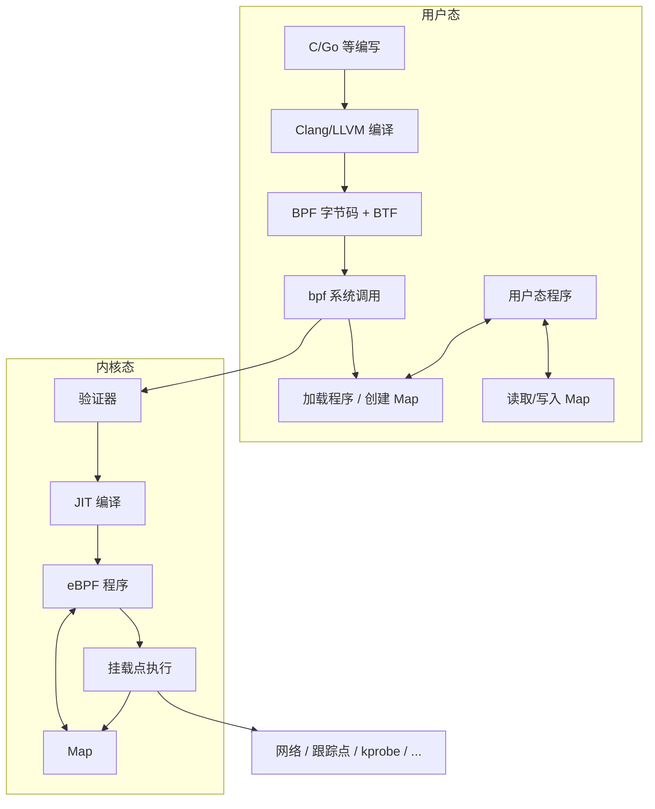
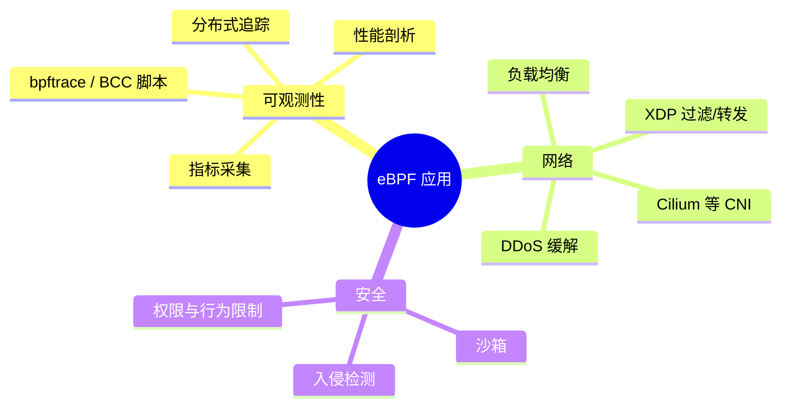

# BPF 和 eBPF

BPF（Berkeley Packet Filter）最初是一种在内核中运行、用于**高效过滤网络包**的机制；eBPF（extended BPF）在其基础上扩展为可在内核中安全运行**通用程序**的框架，被广泛用于可观测性、网络与安全。本文先介绍经典 BPF，再说明 eBPF 的架构与典型用法。

## 经典 BPF（cBPF）

### 历史与要解决的问题

BPF 由 **Steven McCanne 和 Van Jacobson** 于 1992 年在劳伦斯伯克利国家实验室提出，相关论文于 1993 年发表（"The BSD Packet Filter"）。

当时的问题在于：

- 各操作系统有各自的抓包/过滤接口（如 Sun 的 NIT、DEC 的 Packet Filter 等），互不兼容。
- 若把**所有**报文都拷到用户态再过滤，会带来大量拷贝和上下文切换，性能很差。

BPF 的做法是：**在内核里运行一段简单的「过滤器程序」**，只把**匹配的包**交给用户态，从而大幅减少拷贝和 CPU 开销。它与 libpcap、tcpdump 一起成为事实上的抓包与过滤标准。

### 工作原理简述

流程可以概括为：

1. **表达式解析**：用户写出可读的过滤条件（如 `tcp port 80`、`icmp`）。
2. **编译为 BPF 字节码**：由 libpcap 等将表达式编译成在内核中执行的 BPF 指令序列。
3. **注入内核**：通过套接字选项等接口，把这段字节码挂到指定网卡或套接字上。
4. **内核执行**：每个包到达时在内核里跑这段 BPF 程序，只有返回「通过」的包才会被拷贝到用户态。

这样，**过滤发生在内核**，避免「全量拷包再在用户态过滤」的开销。在[旁路流](旁路流.md)场景下，我们用的「BPF 过滤」指的就是这类在内核里执行的过滤逻辑。

### 经典 BPF 的局限

- **寄存器少**：只有 2 个通用寄存器（A、X），表达能力有限。
- **32 位**：寄存器是 32 位，与 64 位架构不能一一对应，JIT 优化受限。
- **无持久状态**：每次包处理彼此独立，不能在内核里维护复杂状态。
- **用途单一**：主要为包过滤和少量场景（如 seccomp），难以做通用内核编程。

这些局限催生了 eBPF。

## eBPF（扩展 BPF）

### 设计目标

eBPF 在保留「在内核中安全、高效执行」的前提下，把 BPF 扩展成一套**通用内核可编程机制**：

- 更丰富的**指令集**与**寄存器**，便于表达复杂逻辑。
- **映射（map）**：在内核中持久保存状态，并在内核与用户态之间共享数据。
- **验证器**：在加载前静态检查程序，保证不会破坏内核稳定性。
- **多种挂载点**：不再限于网卡，可挂到各类内核与用户态事件上。

### cBPF 与 eBPF 对比

| 维度       | 经典 BPF（cBPF）     | 扩展 BPF（eBPF）                    |
|------------|----------------------|-------------------------------------|
| 寄存器     | 2 个（A、X）         | 10 个通用寄存器（R0–R9）+ 只读帧指针 R10 |
| 寄存器宽度 | 32 位                | 64 位                               |
| 状态持久化 | 无                   | 通过 Map 持久化、共享状态           |
| 调用能力   | 无                   | 可调用内核提供的 helper 函数        |
| 挂载点     | 主要为套接字/网卡    | 网络、跟踪、安全等多种挂载点        |
| 程序来源   | 手写/简单编译器      | 常用 C 编写，Clang/LLVM 编译        |
| 典型用途   | tcpdump、seccomp 等  | 可观测、网络、安全、性能调优等      |

在较新的 Linux 内核中，经典 BPF 的过滤逻辑会在内部被转成 eBPF 再执行，因此「写 BPF 过滤」和「内核里跑的」正在统一到 eBPF 上。

### eBPF 整体架构

要点：

1. **编写与编译**：用 C（或 Go 等）写 eBPF 程序，通过 Clang 生成 BPF 字节码；可选 BTF 信息便于可移植性（CO-RE）。
2. **加载**：通过 `bpf(2)` 系统调用加载程序、创建/操作 Map。
3. **验证器**：内核在加载时做静态分析，禁止非法内存访问、无限循环等，保证安全。
4. **JIT**：将字节码编译为本地指令，减少解释开销。
5. **Map**：键值存储，在内核程序之间、内核与用户态之间共享数据与状态。
6. **挂载点**：程序挂到不同事件（网络路径、跟踪点、kprobe 等），在事件发生时执行。

### 验证器（Verifier）

eBPF 程序在加载时会经过内核**验证器**的检查，确保：

- 不会发生越界访问、非法指针解引用。
- 无不可达代码、无可能导致内核挂死的循环（有上限的循环需能被验证器推断）。
- 对 helper 的调用符合约定（参数类型、返回值等）。

只有通过验证的程序才会被 JIT 并挂到指定挂载点执行，这是 eBPF 能安全跑在内核里的基础。

### 映射（Map）

Map 是 eBPF 中**保存状态、交换数据**的设施，类型很多，例如：

| 类型示例           | 典型用途                     |
|--------------------|------------------------------|
| 哈希表             | 连接跟踪、会话状态、键值查找 |
| 数组               | 计数器、配置项、按索引统计   |
| Per-CPU 哈希/数组  | 每 CPU 统计，减少锁竞争     |
| LRU 哈希           | 需要淘汰策略的缓存/会话表   |

用户态通过 `bpf(2)` 或 libbpf 等库创建 Map、读写键值；内核中的 eBPF 程序通过 helper（如 `bpf_map_lookup_elem`、`bpf_map_update_elem`）访问同一份 Map，从而实现「内核逻辑 + 用户态展示/策略」的协作。

### 常见挂载点与程序类型

eBPF 程序可以挂到多种内核路径上，例如：

- **网络**：XDP（网卡驱动收包最早阶段）、TC（traffic control）入口/出口、套接字等；用于过滤、转发、负载均衡、DDoS 缓解等。
- **跟踪**：kprobe/kretprobe（内核函数）、uprobe/uretprobe（用户态函数）、tracepoint、fentry/fexit 等；用于性能分析、调用链、行为观测。
- **安全**：LSM（Linux Security Module）等；用于权限与行为限制。

不同**程序类型**（如 `BPF_PROG_TYPE_XDP`、`BPF_PROG_TYPE_KPROBE`）对应不同的上下文（收到的数据结构、可调用的 helper），需要按挂载点选择。

### 典型应用场景

- **可观测性**：无侵入地采集指标、追踪、剖析（如 bpftrace、BCC、Prometheus exporter、Tracing）。
- **网络**：XDP/TC 做包过滤、转发、负载均衡；Cilium 等基于 eBPF 的 CNI；DDoS 缓解与流量清洗。
- **安全**：限制系统调用、文件与网络访问，检测异常行为等。

## 开发与工具链

- **BCC（BPF Compiler Collection）**：提供大量现成工具和 Python/Lua 绑定，适合快速写跟踪脚本和原型。
- **bpftrace**：高层脚本语言，内建变量和 Map，适合交互式排查和一行式命令。
- **libbpf**：内核推荐的 C 库，配合 BTF/CO-RE 实现「一次编译、多内核运行」，适合生产级 eBPF 程序。
- **Cilium / Tetragon 等**：面向网络与安全的 eBPF 方案，提供策略、可观测与安全能力。

编写 eBPF 时通常：用 C 写内核侧程序，用 C/Go/Python 等写用户态（加载、管理 Map、处理结果）；内核侧通过 Map 和（可选）perf 缓冲区与用户态通信。

## 小结

- **经典 BPF**：在内核里执行简单的包过滤程序，只把匹配的包交给用户态，从而降低拷贝与 CPU 开销，是 tcpdump、libpcap 过滤的基石；在旁路流量分析中，「BPF 过滤」指的就是这类内核过滤。
- **eBPF**：在 BPF 基础上扩展为通用内核可编程框架，具备更多寄存器、Map、验证器、多种挂载点，用于可观测性、网络与安全；cBPF 在新内核中也会被转成 eBPF 执行。
- 理解 BPF/eBPF 有助于在抓包、旁路分析、可观测性与网络策略等场景中，更好使用 tcpdump、gopacket、XDP、Cilium 等工具与项目。
