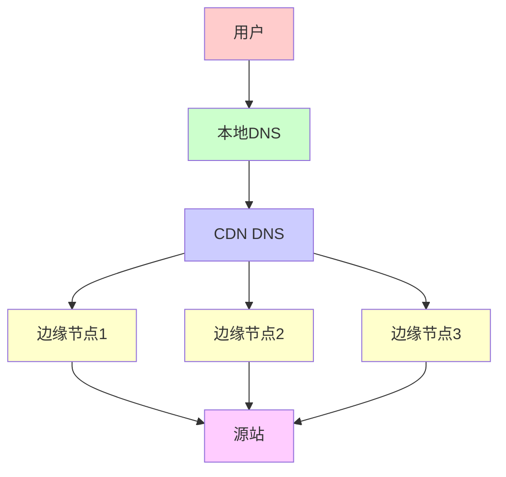
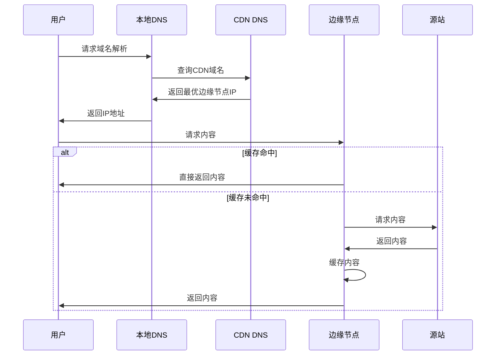
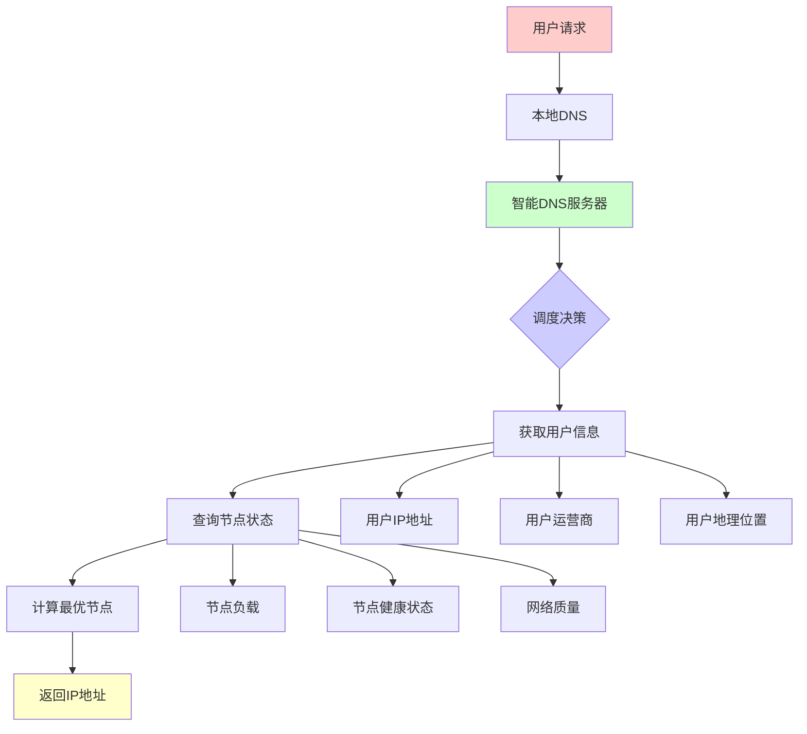
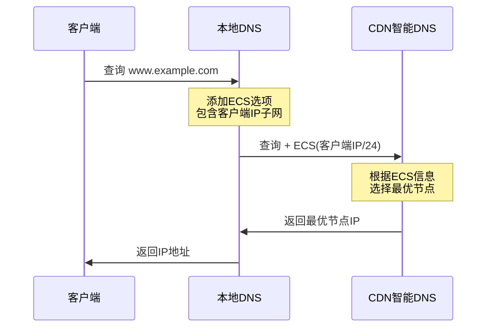
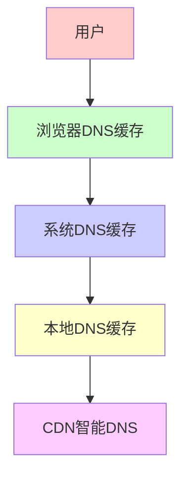
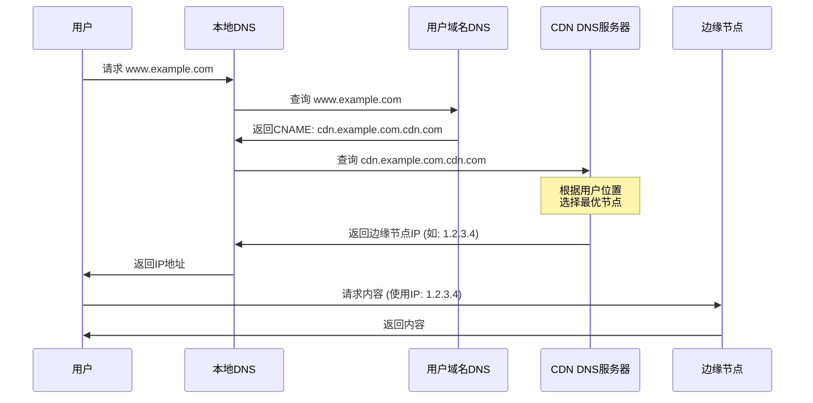
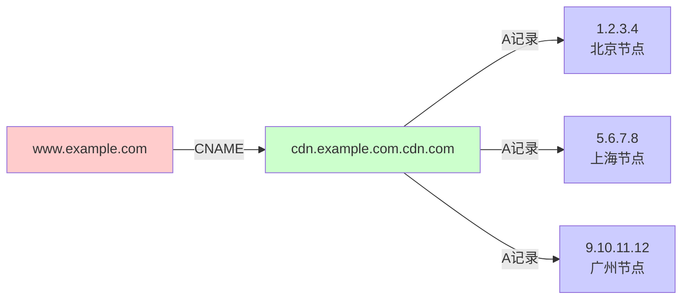
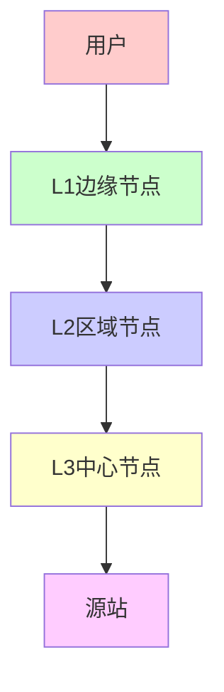

CDN（Content Delivery Network，内容分发网络）是一种分布式网络架构，通过将内容缓存到离用户更近的边缘节点，提高内容访问速度和用户体验。

# 什么是 CDN

## 定义

CDN 是一个由多个分布在不同地理位置的服务器节点组成的网络系统，通过智能调度将用户请求路由到最近的节点，从而减少延迟、提高访问速度。

## 核心目标

1. **降低延迟**：通过就近访问减少网络延迟
2. **提高带宽**：分散流量，减轻源站压力
3. **提高可用性**：多节点冗余，提高服务可用性
4. **节省成本**：减少带宽成本，提高资源利用率

# CDN 架构

## 基本架构



## 主要组件

### 1. 源站（Origin Server）

- **定义**：存储原始内容的服务器
- **作用**：提供内容的原始版本
- **位置**：通常位于数据中心或云服务提供商

### 2. 边缘节点（Edge Node）

- **定义**：分布在全球各地的缓存服务器
- **作用**：缓存内容，就近服务用户
- **特点**：数量多、分布广、离用户近

### 3. CDN 调度系统

- **DNS 调度**：通过 DNS 解析将用户路由到最近的节点
- **HTTP 重定向**：通过 HTTP 302 重定向到最优节点
- **Anycast**：使用 Anycast 技术实现就近路由

### 4. 缓存系统

- **缓存策略**：决定哪些内容缓存、缓存多久
- **缓存更新**：如何更新缓存内容
- **缓存失效**：如何使缓存失效

# CDN 工作流程

## 基本流程

### 1. 用户请求



### 2. 详细步骤

1. **DNS 解析**
   - 用户访问 `example.com`
   - 本地 DNS 查询 CDN 的 DNS 服务器
   - CDN DNS 根据用户位置返回最近的边缘节点 IP

2. **请求路由**
   - 用户请求被路由到最近的边缘节点
   - 边缘节点检查是否有缓存

3. **缓存判断**
   - **缓存命中**：直接返回缓存内容
   - **缓存未命中**：回源获取内容

4. **回源获取**
   - 边缘节点向源站请求内容
   - 源站返回内容
   - 边缘节点缓存内容并返回给用户

5. **内容交付**
   - 边缘节点将内容返回给用户
   - 后续相同请求可直接从缓存获取

## DNS 调度原理

### 智能 DNS

CDN 的 DNS 服务器会根据以下因素选择最优节点：

1. **地理位置**：选择离用户最近的节点
2. **网络质量**：选择网络质量最好的节点
3. **节点负载**：选择负载较低的节点
4. **运营商**：选择相同运营商的节点（减少跨网访问）

### DNS 解析示例

```bash
# 用户在北京，访问 example.com
$ dig example.com

# CDN DNS 返回北京节点的 IP
example.com.    300    IN    A    1.2.3.4

# 用户在上海，访问同一个域名
$ dig example.com

# CDN DNS 返回上海节点的 IP
example.com.    300    IN    A    5.6.7.8
```

# 智能 DNS 详解

## 什么是智能 DNS

智能 DNS（Intelligent DNS）是一种根据用户的地理位置、网络状况、节点负载等因素，动态返回最优 IP 地址的 DNS 解析服务。它是 CDN 实现就近访问和负载均衡的核心技术。

## 智能 DNS 工作原理

### 基本架构



### 工作流程

1. **接收 DNS 查询请求**
   - 用户通过本地 DNS 查询 CDN 域名
   - 智能 DNS 服务器接收查询请求

2. **获取用户信息**
   - 提取本地 DNS 的 IP 地址（EDNS Client Subnet）
   - 识别用户地理位置
   - 识别用户运营商

3. **查询节点信息**
   - 查询各节点的负载情况
   - 查询各节点的健康状态
   - 查询网络质量数据

4. **执行调度算法**
   - 根据调度策略计算最优节点
   - 考虑多个因素的综合评分

5. **返回解析结果**
   - 返回最优节点的 IP 地址
   - 设置合适的 TTL

## 智能 DNS 调度因素

### 1. 地理位置（Geolocation）

根据用户的地理位置选择最近的节点。

#### 实现方式

```python
# 伪代码示例
def select_node_by_location(user_ip):
    user_location = geolocate(user_ip)  # 获取用户位置
    nodes = get_all_nodes()
    
    # 计算距离
    best_node = None
    min_distance = float('inf')
    
    for node in nodes:
        distance = calculate_distance(user_location, node.location)
        if distance < min_distance:
            min_distance = distance
            best_node = node
    
    return best_node
```

#### 位置识别方法

- **IP 地址库**：使用 IP 地理位置数据库（如 MaxMind GeoIP）
- **BGP 路由表**：通过 BGP 路由信息推断位置
- **DNS 递归服务器位置**：通过本地 DNS 的位置推断用户位置

### 2. 运营商识别（ISP Detection）

识别用户的网络运营商，优先选择相同运营商的节点。

#### 运营商分类

- **中国**：电信、联通、移动、教育网、铁通等
- **国际**：根据国家/地区的运营商分类

#### 实现方式

```python
# 伪代码示例
def select_node_by_isp(user_ip, local_dns_ip):
    user_isp = detect_isp(user_ip)  # 识别用户运营商
    local_dns_isp = detect_isp(local_dns_ip)  # 识别本地DNS运营商
    
    nodes = get_all_nodes()
    
    # 优先选择相同运营商的节点
    same_isp_nodes = [n for n in nodes if n.isp == user_isp]
    if same_isp_nodes:
        return select_best_from(same_isp_nodes)
    else:
        return select_best_from(nodes)
```

### 3. 节点负载（Node Load）

根据节点的负载情况选择负载较低的节点。

#### 负载指标

- **CPU 使用率**：节点的 CPU 负载
- **内存使用率**：节点的内存使用情况
- **带宽使用率**：节点的网络带宽使用
- **连接数**：当前处理的连接数
- **请求速率**：每秒处理的请求数

#### 实现方式

```python
# 伪代码示例
def select_node_by_load(nodes):
    # 计算每个节点的负载分数
    scored_nodes = []
    for node in nodes:
        load_score = (
            node.cpu_usage * 0.3 +
            node.memory_usage * 0.2 +
            node.bandwidth_usage * 0.3 +
            node.connection_count / node.max_connections * 0.2
        )
        scored_nodes.append((node, load_score))
    
    # 选择负载最低的节点
    scored_nodes.sort(key=lambda x: x[1])
    return scored_nodes[0][0]
```

### 4. 网络质量（Network Quality）

根据网络质量选择最优路径。

#### 质量指标

- **延迟（Latency）**：RTT 时间
- **丢包率（Packet Loss）**：数据包丢失比例
- **带宽（Bandwidth）**：可用带宽
- **抖动（Jitter）**：延迟变化

#### 实现方式

```python
# 伪代码示例
def select_node_by_quality(user_ip, nodes):
    quality_scores = []
    
    for node in nodes:
        # 测量网络质量
        latency = measure_latency(user_ip, node.ip)
        packet_loss = measure_packet_loss(user_ip, node.ip)
        bandwidth = measure_bandwidth(user_ip, node.ip)
        
        # 计算质量分数（延迟越低、丢包越少、带宽越大，分数越高）
        quality_score = (
            (1 / latency) * 0.5 +
            (1 - packet_loss) * 0.3 +
            (bandwidth / 1000) * 0.2  # 假设1000Mbps为满分
        )
        quality_scores.append((node, quality_score))
    
    # 选择质量最好的节点
    quality_scores.sort(key=lambda x: x[1], reverse=True)
    return quality_scores[0][0]
```

### 5. 节点健康状态（Health Status）

只选择健康状态良好的节点。

#### 健康检查

- **HTTP 健康检查**：定期检查节点 HTTP 服务
- **TCP 健康检查**：检查 TCP 连接
- **自定义检查**：根据业务需求自定义检查

#### 实现方式

```python
# 伪代码示例
def select_healthy_nodes(nodes):
    healthy_nodes = []
    
    for node in nodes:
        if node.health_status == 'healthy':
            healthy_nodes.append(node)
        elif node.health_status == 'degraded':
            # 降级节点，优先级较低
            healthy_nodes.append(node)
        # unhealthy 节点不加入
    
    return healthy_nodes
```

## 智能 DNS 调度算法

### 1. 加权综合评分算法

综合考虑多个因素，给每个节点打分，选择分数最高的节点。

```python
# 伪代码示例
def weighted_scoring(user_info, nodes):
    best_node = None
    best_score = 0
    
    for node in nodes:
        # 地理位置分数（距离越近分数越高）
        location_score = calculate_location_score(user_info.location, node.location)
        
        # 运营商匹配分数
        isp_score = 1.0 if user_info.isp == node.isp else 0.5
        
        # 负载分数（负载越低分数越高）
        load_score = 1.0 - node.load_ratio
        
        # 网络质量分数
        quality_score = calculate_quality_score(user_info, node)
        
        # 综合评分（加权）
        total_score = (
            location_score * 0.3 +
            isp_score * 0.2 +
            load_score * 0.2 +
            quality_score * 0.3
        )
        
        if total_score > best_score:
            best_score = total_score
            best_node = node
    
    return best_node
```

### 2. 分层调度算法

先按地理位置和运营商筛选，再在候选节点中选择最优。

```python
# 伪代码示例
def hierarchical_scheduling(user_info, nodes):
    # 第一层：按地理位置筛选
    regional_nodes = filter_by_region(user_info.location, nodes)
    
    # 第二层：按运营商筛选
    isp_nodes = filter_by_isp(user_info.isp, regional_nodes)
    if not isp_nodes:
        isp_nodes = regional_nodes  # 如果没有同运营商节点，使用区域节点
    
    # 第三层：按负载和健康状态选择
    healthy_nodes = [n for n in isp_nodes if n.health_status == 'healthy']
    if not healthy_nodes:
        healthy_nodes = isp_nodes
    
    # 第四层：选择负载最低的节点
    return min(healthy_nodes, key=lambda n: n.load_ratio)
```

### 3. 动态权重算法

根据实时情况动态调整各因素的权重。

```python
# 伪代码示例
def dynamic_weight_scheduling(user_info, nodes, current_time):
    # 根据时间调整权重（如高峰期更重视负载）
    if is_peak_hour(current_time):
        weights = {
            'location': 0.2,
            'isp': 0.2,
            'load': 0.4,  # 高峰期更重视负载
            'quality': 0.2
        }
    else:
        weights = {
            'location': 0.4,
            'isp': 0.3,
            'load': 0.1,
            'quality': 0.2
        }
    
    # 使用动态权重计算
    return weighted_scoring(user_info, nodes, weights)
```

## EDNS Client Subnet (ECS)

### 什么是 ECS

EDNS Client Subnet 是 DNS 协议的扩展，允许递归 DNS 服务器将客户端 IP 地址的子网信息传递给权威 DNS 服务器，使智能 DNS 能够更准确地识别用户位置。

### ECS 工作流程



### ECS 的优势

1. **更准确的位置识别**：直接使用客户端 IP，而非本地 DNS IP
2. **更好的调度效果**：能够更精确地选择最优节点
3. **隐私保护**：只传递 IP 子网，而非完整 IP

### ECS 配置示例

```bash
# 使用 dig 测试 ECS
dig +subnet=1.2.3.0/24 www.example.com

# 查看是否支持 ECS
dig +edns=0 +noednsneg www.example.com
```

## 智能 DNS 实现技术

### 1. 基于 BIND 的实现

使用 BIND 的视图（View）功能实现智能 DNS。

```dns
# named.conf 配置示例
view "beijing" {
    match-clients { 1.2.3.0/24; };
    zone "example.com" {
        type master;
        file "db.example.com.beijing";
    };
};

view "shanghai" {
    match-clients { 5.6.7.0/24; };
    zone "example.com" {
        type master;
        file "db.example.com.shanghai";
    };
};
```

### 2. 基于 PowerDNS 的实现

使用 PowerDNS 的 Lua 脚本实现智能调度。

```lua
-- PowerDNS Lua 脚本示例
function getbestnode(qname, qtype, localip, remoteip)
    -- 获取用户位置
    local user_location = geolocate(remoteip)
    
    -- 获取所有节点
    local nodes = get_all_nodes()
    
    -- 选择最优节点
    local best_node = select_best_node(user_location, nodes)
    
    -- 返回节点 IP
    return best_node.ip
end
```

### 3. 基于自研 DNS 服务器

CDN 提供商通常自研 DNS 服务器，实现更灵活的调度。

```python
# 自研 DNS 服务器示例
class IntelligentDNS:
    def handle_query(self, query, client_ip, local_dns_ip):
        # 获取用户信息
        user_info = self.get_user_info(client_ip, local_dns_ip)
        
        # 获取所有可用节点
        nodes = self.get_available_nodes()
        
        # 执行调度算法
        best_node = self.schedule(user_info, nodes)
        
        # 返回解析结果
        return self.create_response(query, best_node.ip)
    
    def schedule(self, user_info, nodes):
        # 实现调度算法
        return self.weighted_scoring(user_info, nodes)
```

## 智能 DNS 优化策略

### 1. DNS 缓存优化

```dns
# 设置合理的 TTL
cdn.example.com.    60    IN    A    1.2.3.4    # 短 TTL，快速响应变更
cdn.example.com.    300   IN    A    1.2.3.4    # 中等 TTL，平衡性能和灵活性
cdn.example.com.    3600  IN    A    1.2.3.4    # 长 TTL，减少 DNS 查询
```

### 2. 预解析优化

```html
<!-- HTML 中预解析 CDN 域名 -->
<link rel="dns-prefetch" href="//cdn.example.com">

<!-- 或者使用 preconnect -->
<link rel="preconnect" href="https://cdn.example.com">
```

### 3. 多级 DNS 缓存



### 4. DNS over HTTPS (DoH) / DNS over TLS (DoT)

使用加密的 DNS 查询，提高安全性和隐私保护。

```bash
# 使用 DoH 查询
curl -H "accept: application/dns-json" \
  "https://cloudflare-dns.com/dns-query?name=example.com&type=A"

# 使用 DoT 查询
dig @1.1.1.1 +tls example.com
```

## 智能 DNS 监控和调试

### 监控指标

1. **解析延迟**：DNS 查询响应时间
2. **解析成功率**：DNS 查询成功比例
3. **调度准确性**：用户实际访问的节点是否最优
4. **节点分布**：各节点的请求分布情况

### 调试工具

```bash
# 查看 DNS 解析过程
dig +trace www.example.com

# 查看 CNAME 链
dig +follow www.example.com

# 测试不同地区的解析
dig @8.8.8.8 www.example.com        # Google DNS
dig @114.114.114.114 www.example.com # 114 DNS

# 查看 ECS 支持
dig +subnet=1.2.3.0/24 www.example.com

# 查看 DNS 响应时间
dig +stats www.example.com
```

### 常见问题排查

#### 问题1：DNS 解析慢

```bash
# 检查 DNS 服务器响应时间
time dig www.example.com

# 检查本地 DNS 缓存
# macOS
sudo dscacheutil -q host -a name www.example.com

# Linux
getent hosts www.example.com
```

#### 问题2：解析到错误的节点

```bash
# 检查用户 IP 识别
curl https://ipapi.co/json/

# 检查运营商识别
# 使用在线工具或 API 查询
```

#### 问题3：节点负载不均衡

- 检查负载均衡算法配置
- 检查节点健康状态
- 检查负载权重设置

## 智能 DNS 最佳实践

### 1. TTL 设置

- **短 TTL（60-300秒）**：需要快速响应节点变更的场景
- **中等 TTL（300-1800秒）**：平衡性能和灵活性
- **长 TTL（3600秒以上）**：节点稳定，减少 DNS 查询

### 2. 多线路配置

```dns
# 为不同运营商配置不同节点
# 电信用户
cdn.example.com.    60    IN    A    1.2.3.4

# 联通用户
cdn.example.com.    60    IN    A    5.6.7.8

# 移动用户
cdn.example.com.    60    IN    A    9.10.11.12
```

### 3. 故障转移

```python
# 伪代码：故障转移逻辑
def schedule_with_failover(user_info, nodes):
    # 首先选择最优节点
    best_node = select_best_node(user_info, nodes)
    
    # 检查节点健康状态
    if best_node.health_status != 'healthy':
        # 选择备用节点
        backup_nodes = [n for n in nodes if n.health_status == 'healthy']
        if backup_nodes:
            return select_best_from(backup_nodes)
    
    return best_node
```

### 4. 负载均衡

```python
# 伪代码：负载均衡
def schedule_with_load_balancing(user_info, nodes):
    # 过滤健康节点
    healthy_nodes = [n for n in nodes if n.health_status == 'healthy']
    
    # 按负载排序
    healthy_nodes.sort(key=lambda n: n.load_ratio)
    
    # 选择负载最低的节点
    return healthy_nodes[0]
```

## 智能 DNS 与 CDN 的关系

智能 DNS 是 CDN 实现智能调度的基础：

1. **用户请求** → 通过智能 DNS 解析
2. **智能调度** → 根据多因素选择最优节点
3. **返回 IP** → 用户访问最近的边缘节点
4. **内容交付** → 从边缘节点获取内容

智能 DNS 的质量直接影响 CDN 的性能和用户体验。

## CNAME 实现原理

### 什么是 CNAME

CNAME（Canonical Name，规范名称）是 DNS 记录类型之一，用于将一个域名指向另一个域名，实现域名的别名功能。在 CDN 中，CNAME 用于将用户的业务域名指向 CDN 提供商的域名。

### CNAME 的作用

1. **域名映射**：将用户域名映射到 CDN 域名
2. **灵活配置**：用户无需修改源站配置
3. **统一管理**：CDN 提供商统一管理 DNS 解析
4. **动态调度**：CDN 可以根据用户位置动态返回最优 IP

### CNAME 解析流程



### CNAME 记录配置

#### 1. 在用户域名 DNS 中配置

```dns
# 用户域名 DNS 记录（在域名注册商处配置）
www.example.com.    300    IN    CNAME    cdn.example.com.cdn.com.
api.example.com.    300    IN    CNAME    cdn.example.com.cdn.com.
static.example.com. 300    IN    CNAME    cdn.example.com.cdn.com.
```

#### 2. 在 CDN 提供商处配置

```dns
# CDN 提供商的 DNS 记录（由 CDN 管理）
cdn.example.com.cdn.com.    60    IN    A    1.2.3.4    # 北京节点
cdn.example.com.cdn.com.    60    IN    A    5.6.7.8    # 上海节点
cdn.example.com.cdn.com.    60    IN    A    9.10.11.12 # 广州节点
```

### CNAME 解析过程详解

#### 步骤1：用户请求域名

```bash
# 用户在浏览器访问
https://www.example.com/image.jpg
```

#### 步骤2：本地 DNS 查询

```bash
# 本地 DNS 查询 www.example.com
$ dig www.example.com

# 返回结果
www.example.com.    300    IN    CNAME    cdn.example.com.cdn.com.
cdn.example.com.cdn.com.    60    IN    A    1.2.3.4
```

#### 步骤3：CNAME 解析

```bash
# 本地 DNS 发现是 CNAME，继续查询 CNAME 指向的域名
$ dig cdn.example.com.cdn.com

# CDN DNS 根据用户位置返回最优 IP
cdn.example.com.cdn.com.    60    IN    A    1.2.3.4
```

#### 步骤4：获取最终 IP

```bash
# 完整的解析过程（使用 +trace 查看）
$ dig +trace www.example.com

# 输出示例
.                       518400  IN      NS      a.root-servers.net.
com.                    172800  IN      NS      a.gtld-servers.net.
example.com.            86400   IN      NS      ns1.example.com.
www.example.com.        300     IN      CNAME   cdn.example.com.cdn.com.
cdn.com.                86400   IN      NS      ns1.cdn.com.
cdn.example.com.cdn.com. 60     IN      A       1.2.3.4
```

### CNAME 与 A 记录的区别

| 特性 | CNAME | A 记录 |
|------|-------|--------|
| 记录类型 | 别名记录 | 地址记录 |
| 指向 | 指向另一个域名 | 直接指向 IP 地址 |
| 灵活性 | 高（可动态调整） | 低（需要手动修改） |
| 解析次数 | 需要多次解析 | 一次解析 |
| 使用场景 | CDN、负载均衡 | 直接 IP 访问 |

### CNAME 的优势

1. **灵活调度**
   - CDN 可以根据用户位置动态返回不同 IP
   - 无需用户手动修改 DNS 记录

2. **统一管理**
   - CDN 提供商统一管理所有节点的 IP
   - 节点变更时自动更新，用户无需操作

3. **故障转移**
   - 节点故障时自动切换到备用节点
   - 提高服务可用性

4. **负载均衡**
   - 可以根据节点负载动态分配
   - 避免单点过载

### CNAME 的限制

1. **不能与其他记录共存**
   - 如果域名有 CNAME 记录，不能同时有 A、MX、TXT 等其他记录
   - 根域名（@）通常不能使用 CNAME

2. **解析链长度限制**
   - DNS 规范建议 CNAME 链不超过 8 层
   - 过长的解析链会影响性能

3. **解析延迟**
   - CNAME 需要额外的 DNS 查询
   - 可能增加少量解析时间

### CNAME 配置示例

#### 阿里云 CDN 配置

```dns
# 在阿里云域名解析中配置
www.example.com    CNAME    example.com.w.alikunlun.com
```

#### 腾讯云 CDN 配置

```dns
# 在腾讯云域名解析中配置
www.example.com    CNAME    example.com.cdn.dnsv1.com
```

#### Cloudflare CDN 配置

```dns
# 在 Cloudflare 中配置
www.example.com    CNAME    example.com.cdn.cloudflare.net
```

### CNAME 解析优化

#### 1. TTL 设置

```dns
# 较短的 TTL 可以更快响应节点变更
cdn.example.com.cdn.com.    60    IN    A    1.2.3.4
```

- **短 TTL（60-300秒）**：快速响应节点变更，但增加 DNS 查询
- **长 TTL（3600秒以上）**：减少 DNS 查询，但节点变更响应慢

#### 2. DNS 预解析

```html
<!-- 在 HTML 中预解析 CDN 域名 -->
<link rel="dns-prefetch" href="//cdn.example.com.cdn.com">
```

#### 3. 本地 DNS 缓存

```bash
# 查看本地 DNS 缓存
# macOS
sudo dscacheutil -q host -a name www.example.com

# Linux
getent hosts www.example.com
```

### CNAME 链示例



### 实际测试 CNAME

#### 查看 CNAME 记录

```bash
# 查看 CNAME 记录
$ dig www.example.com CNAME

# 输出示例
www.example.com.    300    IN    CNAME    cdn.example.com.cdn.com.
```

#### 查看完整解析链

```bash
# 查看完整解析过程
$ dig +trace www.example.com

# 或者使用 +follow 自动跟随 CNAME
$ dig +follow www.example.com
```

#### 测试不同地区的解析

```bash
# 使用不同的 DNS 服务器测试
$ dig @8.8.8.8 www.example.com        # Google DNS
$ dig @114.114.114.114 www.example.com # 114 DNS
$ dig @223.5.5.5 www.example.com       # 阿里 DNS

# 不同 DNS 服务器可能返回不同的 IP（根据用户位置）
```

### CNAME 与 CDN 智能调度

CDN 的智能调度依赖于 CNAME：

1. **用户请求** → `www.example.com`
2. **DNS 解析** → 返回 CNAME: `cdn.example.com.cdn.com`
3. **CDN DNS 查询** → 根据以下因素返回最优 IP：
   - 用户 IP 地址（地理位置）
   - 用户运营商（电信/联通/移动）
   - 节点负载情况
   - 网络质量
4. **返回 IP** → 用户访问最近的边缘节点

### 常见问题

#### Q1: 为什么需要 CNAME，不能直接用 A 记录吗？

**A**: 使用 CNAME 可以让 CDN 提供商统一管理所有节点的 IP 地址，实现智能调度。如果使用 A 记录，用户需要手动配置所有节点的 IP，且无法实现动态调度。

#### Q2: CNAME 会影响解析速度吗？

**A**: CNAME 需要额外的 DNS 查询，但影响很小（通常几毫秒）。CDN 提供商会优化 DNS 服务器性能，并且本地 DNS 会缓存结果。

#### Q3: 根域名可以使用 CNAME 吗？

**A**: 根据 DNS 规范，根域名（@）不能使用 CNAME。如果需要为根域名配置 CDN，通常使用 A 记录或者使用 URL 重定向。

#### Q4: 如何验证 CNAME 配置是否正确？

**A**: 
```bash
# 查看 CNAME 记录
dig www.example.com CNAME

# 查看最终解析的 IP
dig +short www.example.com

# 查看完整解析过程
dig +trace www.example.com
```

# CDN 缓存机制

## 缓存策略

### 1. 缓存内容类型

- **静态内容**：图片、CSS、JavaScript、视频等
- **动态内容**：API 响应、数据库查询结果（需要特殊处理）
- **流媒体**：视频流、音频流

### 2. 缓存时间（TTL）

```http
# HTTP 响应头控制缓存
Cache-Control: max-age=3600          # 缓存1小时
Cache-Control: public, max-age=86400 # 缓存1天
Expires: Wed, 21 Oct 2024 07:28:00 GMT
```

### 3. 缓存更新

- **被动更新**：缓存过期后自动回源
- **主动刷新**：通过 API 主动清除缓存
- **版本控制**：通过 URL 版本号强制更新

## 缓存层级

### 多级缓存架构



- **L1 边缘节点**：最靠近用户，数量最多
- **L2 区域节点**：覆盖一个区域，容量较大
- **L3 中心节点**：覆盖更大范围，容量最大
- **源站**：原始内容存储

## 缓存一致性

### 问题

多个边缘节点缓存同一内容，如何保证一致性？

### 解决方案

1. **TTL 机制**：设置合理的缓存时间
2. **版本控制**：URL 中包含版本号
3. **主动刷新**：通过 API 主动清除缓存
4. **回源验证**：定期验证缓存是否有效

# CDN 优势

## 性能优势

1. **降低延迟**
   - 就近访问，减少网络跳数
   - 典型延迟从 100-200ms 降低到 10-50ms

2. **提高带宽**
   - 分散流量到多个节点
   - 支持更高的并发访问

3. **提高可用性**
   - 多节点冗余
   - 单点故障不影响整体服务

## 成本优势

1. **节省带宽成本**
   - 边缘节点带宽成本更低
   - 减少源站带宽压力

2. **节省服务器成本**
   - 减少源站服务器负载
   - 可以降低源站配置

## 安全优势

1. **DDoS 防护**
   - 分散攻击流量
   - CDN 提供商提供防护能力

2. **HTTPS 加速**
   - CDN 节点处理 SSL/TLS
   - 减少源站 SSL 计算压力

3. **访问控制**
   - IP 白名单/黑名单
   - Referer 防盗链
   - Token 鉴权

# CDN 应用场景

## 静态资源加速

### 适用内容

- 图片、CSS、JavaScript
- 字体文件
- 静态 HTML 页面

### 配置示例

```nginx
# Nginx 配置示例
location ~* \.(jpg|jpeg|png|gif|ico|css|js)$ {
    expires 30d;
    add_header Cache-Control "public, immutable";
    access_log off;
}
```

## 视频点播/直播

### 特点

- 文件大，带宽消耗高
- 需要流式传输
- 支持多码率自适应

### CDN 优势

- 就近分发，减少卡顿
- 支持 P2P 加速
- 支持多码率切换

## 软件下载

### 特点

- 文件体积大
- 下载时间长
- 需要断点续传

### CDN 优势

- 多节点并行下载
- 提高下载速度
- 减少源站压力

## API 加速

### 动态内容加速

虽然 CDN 主要针对静态内容，但也可以加速动态内容：

1. **边缘计算**：在边缘节点执行部分逻辑
2. **智能路由**：选择最优路径回源
3. **连接复用**：复用到源站的连接

## 移动应用加速

### 特点

- 移动网络不稳定
- 需要减少流量消耗
- 需要降低延迟

### CDN 优势

- 就近访问，降低延迟
- 图片压缩，减少流量
- 协议优化（HTTP/2、QUIC）

# CDN 技术细节

## HTTP 缓存头

### Cache-Control

```http
# 公共缓存，缓存1小时
Cache-Control: public, max-age=3600

# 私有缓存，只缓存到浏览器
Cache-Control: private, max-age=3600

# 不缓存
Cache-Control: no-cache, no-store, must-revalidate

# 必须重新验证
Cache-Control: must-revalidate
```

### ETag

```http
# 服务器返回 ETag
ETag: "33a64df551425fcc55e4d42a148795d9f25f89d4"

# 客户端请求时带上 If-None-Match
If-None-Match: "33a64df551425fcc55e4d42a148795d9f25f89d4"

# 如果内容未变化，返回 304 Not Modified
HTTP/1.1 304 Not Modified
```

### Last-Modified

```http
# 服务器返回最后修改时间
Last-Modified: Wed, 21 Oct 2024 07:28:00 GMT

# 客户端请求时带上 If-Modified-Since
If-Modified-Since: Wed, 21 Oct 2024 07:28:00 GMT

# 如果内容未变化，返回 304 Not Modified
HTTP/1.1 304 Not Modified
```

## 回源策略

### 回源 Host

```http
# 边缘节点回源时，可以修改 Host 头
GET /path/to/resource HTTP/1.1
Host: origin.example.com  # 源站域名
```

### 回源协议

- **HTTP 回源**：使用 HTTP 协议回源
- **HTTPS 回源**：使用 HTTPS 协议回源（更安全）
- **协议跟随**：根据用户请求协议决定回源协议

## 负载均衡

### 算法

1. **轮询（Round Robin）**：依次分配请求
2. **加权轮询（Weighted Round Robin）**：根据权重分配
3. **最少连接（Least Connections）**：分配给连接数最少的节点
4. **IP 哈希（IP Hash）**：根据客户端 IP 哈希分配
5. **地理位置**：根据地理位置分配

## 健康检查

### 检查方式

1. **HTTP 检查**：发送 HTTP 请求检查节点健康
2. **TCP 检查**：检查 TCP 连接是否正常
3. **ICMP 检查**：发送 ping 检查网络连通性

### 故障转移

- 节点故障时自动切换到备用节点
- 源站故障时返回缓存内容（如果可用）

# CDN 配置示例

## 基本配置

### 域名配置

```bash
# 添加 CDN 域名
# 在 CDN 控制台添加域名 example.com
# 配置源站地址 origin.example.com
# 配置缓存规则
```

### 缓存规则

```json
{
  "rules": [
    {
      "path": "/*.jpg",
      "cache_time": 86400,
      "cache_control": "public, max-age=86400"
    },
    {
      "path": "/*.css",
      "cache_time": 604800,
      "cache_control": "public, max-age=604800"
    },
    {
      "path": "/api/*",
      "cache_time": 0,
      "cache_control": "no-cache"
    }
  ]
}
```

## Nginx CDN 配置示例

```nginx
# CDN 边缘节点配置
server {
    listen 80;
    server_name cdn.example.com;
    
    # 缓存配置
    proxy_cache_path /var/cache/nginx levels=1:2 keys_zone=cdn_cache:10m max_size=10g inactive=60m;
    
    location / {
        # 使用缓存
        proxy_cache cdn_cache;
        proxy_cache_valid 200 1h;
        proxy_cache_key "$scheme$request_method$host$request_uri";
        
        # 回源配置
        proxy_pass http://origin.example.com;
        proxy_set_header Host origin.example.com;
        proxy_set_header X-Real-IP $remote_addr;
        proxy_set_header X-Forwarded-For $proxy_add_x_forwarded_for;
        
        # 缓存头
        add_header X-Cache-Status $upstream_cache_status;
    }
    
    # 清除缓存接口
    location ~ /purge(/.*) {
        proxy_cache_purge cdn_cache "$scheme$request_method$host$1";
    }
}
```

## 缓存刷新 API

```bash
# 刷新单个文件
curl -X POST "https://api.cdn.com/purge" \
  -H "Authorization: Bearer token" \
  -d '{"urls": ["https://cdn.example.com/image.jpg"]}'

# 刷新目录
curl -X POST "https://api.cdn.com/purge" \
  -H "Authorization: Bearer token" \
  -d '{"dirs": ["https://cdn.example.com/static/"]}'

# 刷新所有缓存
curl -X POST "https://api.cdn.com/purge" \
  -H "Authorization: Bearer token" \
  -d '{"purge_all": true}'
```

# CDN 监控和优化

## 监控指标

### 性能指标

1. **响应时间**：从请求到响应的时间
2. **命中率**：缓存命中请求占总请求的比例
3. **带宽使用**：CDN 带宽消耗
4. **错误率**：4xx、5xx 错误比例

### 业务指标

1. **访问量**：PV、UV
2. **流量分布**：各节点流量分布
3. **热门内容**：访问最多的内容
4. **用户分布**：用户地理位置分布

## 优化策略

### 1. 提高缓存命中率

- 合理设置缓存时间
- 使用版本控制而非时间戳
- 分离静态和动态内容

### 2. 减少回源

- 预热热门内容
- 合理设置缓存策略
- 使用边缘计算处理部分逻辑

### 3. 优化内容

- 压缩静态资源（Gzip、Brotli）
- 图片优化（WebP、压缩）
- 代码压缩（Minify）

### 4. 协议优化

- 使用 HTTP/2
- 使用 QUIC/HTTP3
- 启用 HTTPS

# CDN 安全

## 安全功能

### 1. DDoS 防护

- 流量清洗
- 限流保护
- 黑白名单

### 2. HTTPS 支持

- SSL/TLS 证书管理
- HTTPS 强制跳转
- HSTS 支持

### 3. 访问控制

- Referer 防盗链
- IP 白名单/黑名单
- Token 鉴权
- 时间戳签名

### 4. 内容安全

- WAF（Web 应用防火墙）
- 防爬虫
- 内容加密

## 防盗链配置

```nginx
# Nginx 防盗链配置
location ~* \.(jpg|jpeg|png|gif)$ {
    valid_referers none blocked server_names *.example.com;
    if ($invalid_referer) {
        return 403;
    }
}
```

# 主流 CDN 服务商

## 国内 CDN

1. **阿里云 CDN**
   - 覆盖广泛
   - 价格合理
   - 功能丰富

2. **腾讯云 CDN**
   - 与腾讯生态集成好
   - 视频加速能力强

3. **百度云 CDN**
   - 搜索引擎优化
   - 智能调度

4. **网宿科技**
   - 老牌 CDN 服务商
   - 技术成熟

## 国外 CDN

1. **Cloudflare**
   - 免费套餐
   - 全球覆盖
   - 安全功能强大

2. **Amazon CloudFront**
   - AWS 生态集成
   - 全球节点多

3. **Fastly**
   - 实时缓存清除
   - 边缘计算能力强

4. **Akamai**
   - 全球最大 CDN
   - 技术领先

# 常见问题

## Q1: CDN 和缓存有什么区别？

**A**: CDN 是分布式的缓存系统，将缓存节点分布在全球各地，通过智能调度实现就近访问。普通缓存通常只在单一位置。

## Q2: CDN 适合哪些内容？

**A**: 
- **适合**：静态资源（图片、CSS、JS）、视频、软件下载
- **不适合**：实时性要求高的动态内容、需要频繁更新的内容

## Q3: 如何选择 CDN 节点？

**A**: CDN 通过智能 DNS 自动选择，考虑因素包括：
- 用户地理位置
- 网络质量
- 节点负载
- 运营商

## Q4: CDN 缓存如何更新？

**A**: 
- **被动更新**：缓存过期后自动回源
- **主动刷新**：通过 API 或控制台主动清除缓存
- **版本控制**：通过 URL 版本号强制更新

## Q5: CDN 会增加延迟吗？

**A**: 通常不会。CDN 的目标是降低延迟，通过就近访问减少网络跳数。只有在缓存未命中且回源路径较长时，可能会增加少量延迟。

## Q6: 如何测试 CDN 效果？

**A**: 
- 使用 `curl` 测试响应时间
- 使用 `dig` 查看 DNS 解析
- 使用 CDN 提供商的控制台查看统计
- 使用第三方工具（如 WebPageTest）

# 测试 CDN

## 测试 DNS 解析

```bash
# 查看 CDN 域名解析
dig cdn.example.com

# 查看解析过程
dig +trace cdn.example.com

# 测试不同地区的解析
# 使用在线工具或 VPN 切换地区
```

## 测试缓存命中

```bash
# 第一次请求（缓存未命中）
curl -I https://cdn.example.com/image.jpg
# X-Cache-Status: MISS

# 第二次请求（缓存命中）
curl -I https://cdn.example.com/image.jpg
# X-Cache-Status: HIT
```

## 测试响应时间

```bash
# 测试响应时间
curl -o /dev/null -s -w "Time: %{time_total}s\n" https://cdn.example.com/image.jpg

# 对比源站和 CDN
curl -o /dev/null -s -w "CDN: %{time_total}s\n" https://cdn.example.com/image.jpg
curl -o /dev/null -s -w "Origin: %{time_total}s\n" https://origin.example.com/image.jpg
```

# 总结

CDN 通过分布式缓存和智能调度，显著提高了内容访问速度和用户体验。理解 CDN 的工作原理有助于：

1. **优化配置**：合理设置缓存策略
2. **问题排查**：快速定位 CDN 相关问题
3. **成本控制**：优化 CDN 使用成本
4. **性能提升**：提高网站和应用性能

在实际应用中，需要根据业务特点选择合适的 CDN 服务商和配置策略，持续监控和优化 CDN 性能。

# 参考文献
* [CDN 原理详解](https://developer.mozilla.org/zh-CN/docs/Web/Performance/CDN)
* [HTTP 缓存](https://developer.mozilla.org/zh-CN/docs/Web/HTTP/Caching)
* [CDN 最佳实践](https://www.cloudflare.com/learning/cdn/what-is-a-cdn/)

