# IP 协议概述

IP（Internet Protocol，网际协议）是 TCP/IP 协议族的核心协议，位于网络层，为上层协议提供无状态、无连接、不可靠的数据报传输服务。

## IP 协议的特点

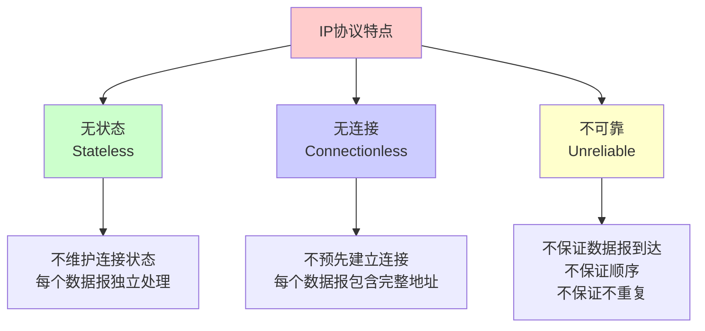

### 1. 无状态（Stateless）

- **定义**：IP 通信双方不同步传输数据的状态信息
- **特点**：所有 IP 数据报的发送、传输和接收都是相互独立的
- **影响**：每个数据报都必须包含完整的路由信息

### 2. 无连接（Connectionless）

- **定义**：IP 通信双方都不长久地维持对方的任何信息
- **特点**：每个 IP 数据报都要带上对方的 IP 地址
- **影响**：无法保证数据报的顺序和完整性

### 3. 不可靠（Unreliable）

- **定义**：IP 协议不能保证 IP 数据报准确到达接收端
- **特点**：
  - 不保证数据报能成功到达
  - 不保证数据报按顺序到达
  - 不保证数据报不重复
- **影响**：上层协议（如 TCP）需要提供可靠性保证

## IP 协议在协议栈中的位置

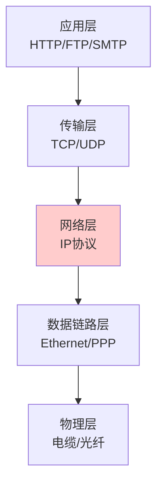

## IP 协议的作用

1. **寻址**：通过 IP 地址标识网络中的主机
2. **路由**：选择数据报从源到目的的最佳路径
3. **分片**：将大数据报分片以适应不同网络的 MTU
4. **重组**：在目的主机重组分片的数据报

# IPv4

## IPv4 头部结构

IPv4 头部结构固定长度为 20 字节，选项最多可有 40 字节，总长度最长为 60 字节。

### 头部字段布局

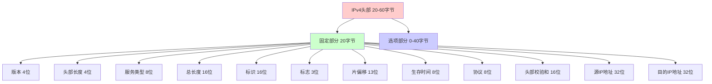

### 详细字段说明

| 字段 | 位数 | 说明 | 示例值 |
|------|------|------|--------|
| **版本（Version）** | 4 | IP 协议版本，IPv4 值为 4 | 4 |
| **头部长度（IHL）** | 4 | IP 头部长度（以 4 字节为单位） | 5（20字节） |
| **服务类型（TOS）** | 8 | 服务质量参数 | 0x00 |
| **总长度（Total Length）** | 16 | 整个 IP 数据报长度（字节） | 1500 |
| **标识（Identification）** | 16 | 数据报唯一标识符 | 0x1234 |
| **标志（Flags）** | 3 | DF（禁止分片）、MF（更多分片） | 0x2 |
| **片偏移（Fragment Offset）** | 13 | 分片相对原始数据报的偏移 | 0 |
| **生存时间（TTL）** | 8 | 数据报可经过的最大跳数 | 64 |
| **协议（Protocol）** | 8 | 上层协议类型 | 6（TCP） |
| **头部校验和（Checksum）** | 16 | IP 头部校验和 | 0xABCD |
| **源 IP 地址** | 32 | 发送方 IP 地址 | 192.168.1.1 |
| **目的 IP 地址** | 32 | 接收方 IP 地址 | 192.168.1.2 |
| **选项（Options）** | 可变 | 可选字段，最多 40 字节 | - |

### 服务类型（TOS）字段

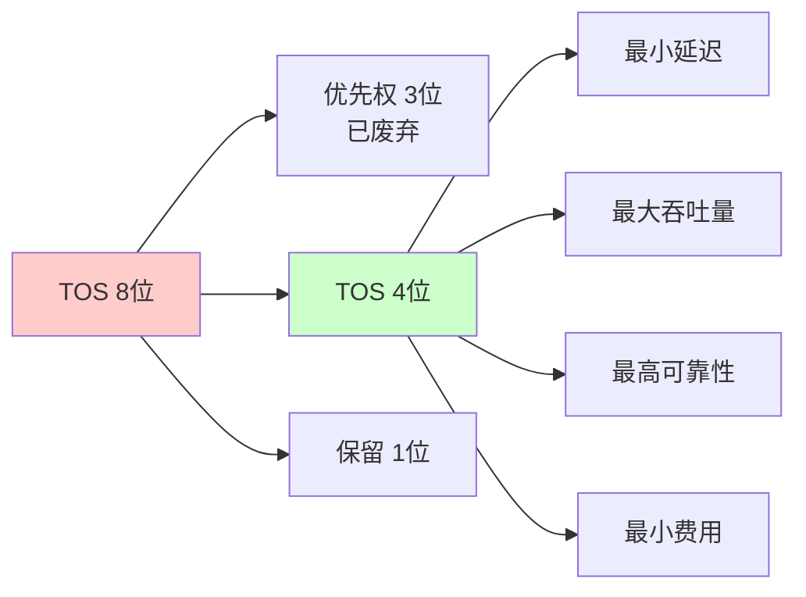

**TOS 位说明**：
- **最小延迟**：适用于交互式应用（如 Telnet）
- **最大吞吐量**：适用于文件传输（如 FTP）
- **最高可靠性**：适用于网络管理（如 SNMP）
- **最小费用**：适用于批量传输

### 协议字段值

常见协议对应的 protocol 字段值：

| 协议 | Protocol 值 | 说明 |
|------|-----------|------|
| ICMP | 1 | Internet 控制消息协议 |
| IGMP | 2 | Internet 组管理协议 |
| TCP | 6 | 传输控制协议 |
| UDP | 17 | 用户数据报协议 |
| ESP | 50 | 封装安全载荷 |
| AH | 51 | 认证头 |
| IPv6 | 41 | IPv6 封装 |

## IP 分片

### 分片的原因

当 IP 数据报的长度超过数据链路层的 MTU（Maximum Transmission Unit，最大传输单元）时，数据报将被分片传输。

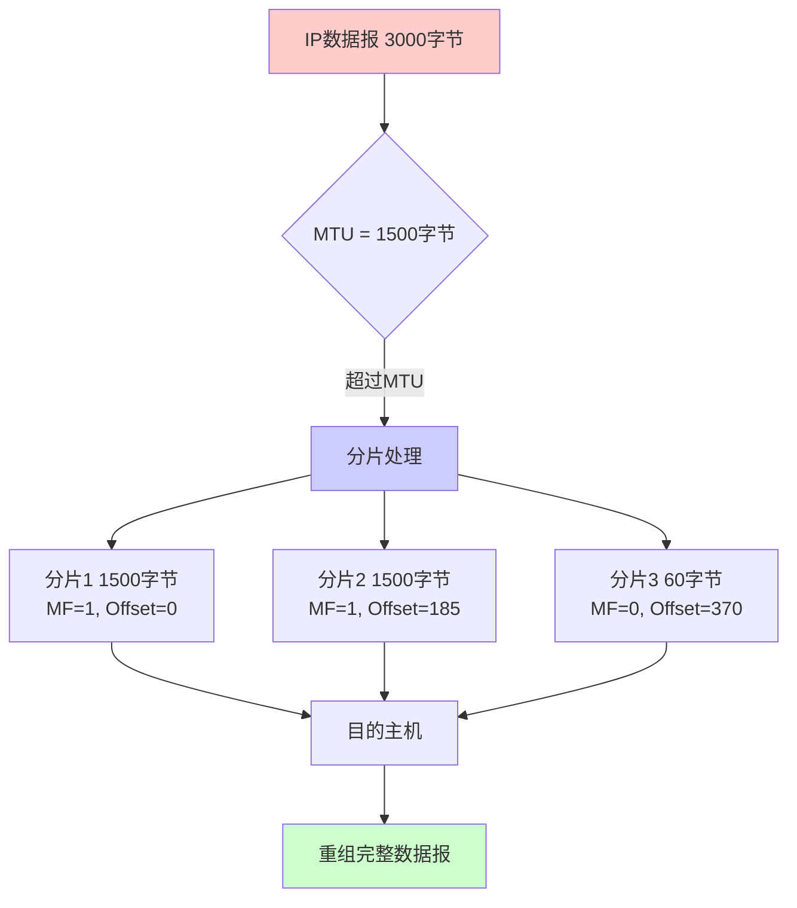

### 分片过程

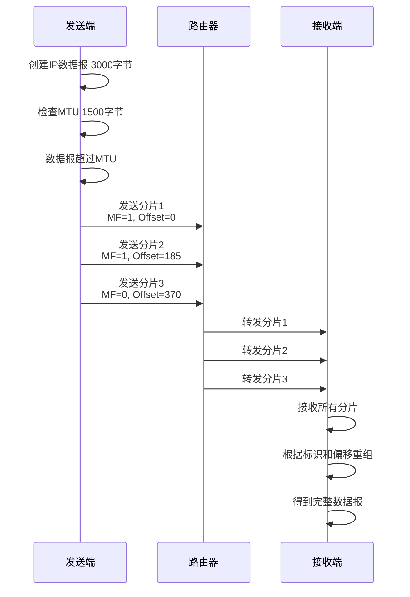

### 分片字段说明

#### 标识（Identification）

- **作用**：唯一标识主机发送的每一个数据报
- **特点**：
  - 初始值由系统随机生成
  - 每发送一个数据报其值加一
  - 分片时复制到每个分片
  - 同一数据报的所有分片具有相同的标识值

#### 标志（Flags）

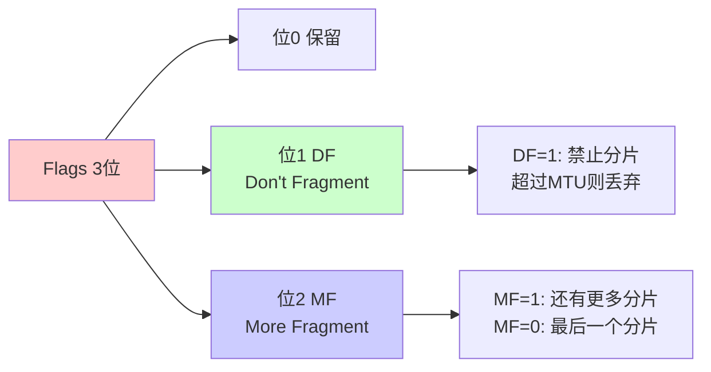

#### 片偏移（Fragment Offset）

- **作用**：标识分片在原始数据报中的位置
- **计算**：实际偏移 = 片偏移值 × 8（字节）
- **限制**：除了最后一个分片外，每个分片的数据长度必须是 8 的整数倍

### 分片示例

假设有一个 3000 字节的 IP 数据报（头部 20 字节，数据 2980 字节），MTU 为 1500 字节：

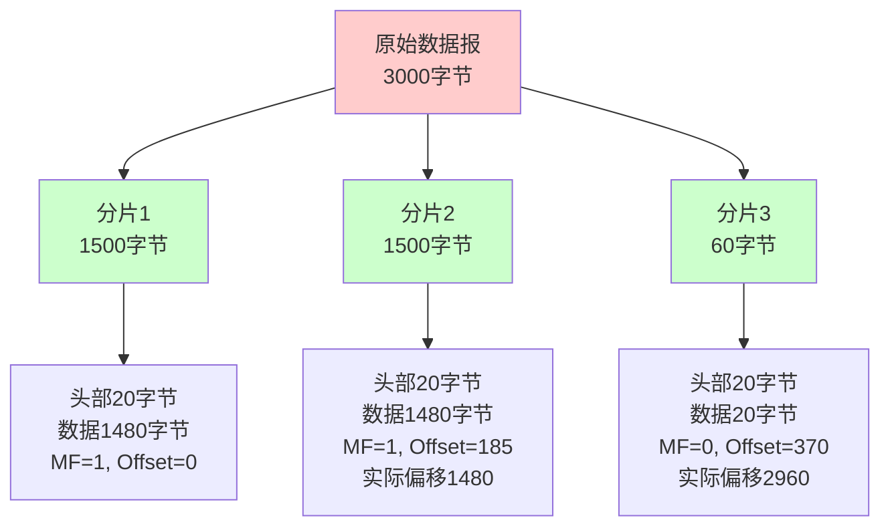

### 分片重组

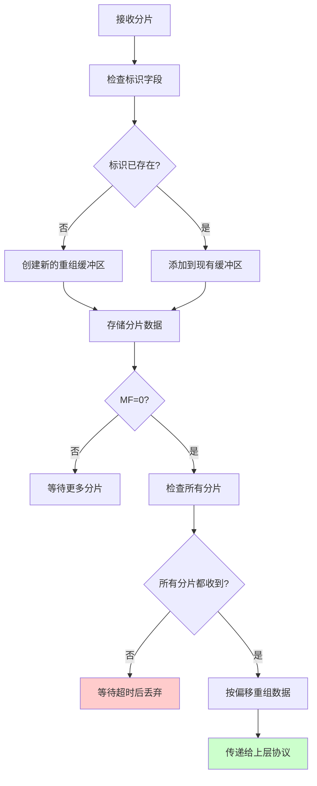

### 分片代码示例

使用 Go 语言模拟 IP 分片：

```go
package main

import (
    "bytes"
    "encoding/binary"
    "fmt"
    "net"
    "time"
)

type ICMP struct {
    Type        uint8
    Code        uint8
    CheckSum    uint16
    Identifier  uint16
    SequenceNum uint16
}

func Checksum(data []byte) uint16 {
    var (
        sum    uint32
        length = len(data)
        index  int
    )
    for length > 1 {
        sum += uint32(data[index])<<8 + uint32(data[index+1])
        index += 2
        length -= 2
    }
    if length > 0 {
        sum += uint32(data[index])
    }
    sum += sum >> 16
    return uint16(^sum)
}

func getICMP(seq uint16) ICMP {
    icmp := ICMP{
        Type:        8,
        Code:        0,
        CheckSum:    0,
        Identifier:  0,
        SequenceNum: seq,
    }
    var buffer bytes.Buffer
    binary.Write(&buffer, binary.BigEndian, icmp)
    icmp.CheckSum = Checksum(buffer.Bytes())
    buffer.Reset()
    return icmp
}

func main() {
    icmp := getICMP(1)
    conn, err := net.DialIP("ip4:icmp", nil, &net.IPAddr{IP: net.IP{220, 181, 38, 150}})
    if err != nil {
        fmt.Println(err.Error())
        return
    }
    defer conn.Close()
    
    // 创建 1473 字节的数据，加上 ICMP 头部 8 字节 = 1481 字节
    // 加上 IP 头部 20 字节 = 1501 字节，超过 MTU 1500，会触发分片
    arr := make([]byte, 1473)
    for i := range arr {
        arr[i] = byte(i)
    }
    arr[1472] = 0
    
    var buffer bytes.Buffer
    binary.Write(&buffer, binary.BigEndian, icmp)
    binary.Write(&buffer, binary.BigEndian, arr)
    
    if _, err := conn.Write(buffer.Bytes()); err != nil {
        fmt.Println(err.Error())
        return
    }
    
    conn.SetReadDeadline(time.Now().Add(time.Second * 5))
    recv := make([]byte, 2048)
    n, err := conn.Read(recv)
    if err != nil {
        fmt.Println(err.Error())
    }
    fmt.Printf("Received %d bytes\n", n)
}
```

**分片计算**：
- 以太网 MTU：1500 字节
- IP 头部：20 字节
- ICMP 头部：8 字节
- 可用数据空间：1500 - 20 - 8 = 1472 字节
- 发送 1473 字节数据 → 总长度 1501 字节 → 触发分片

## IP 路由

IP 协议的核心任务是数据报的路由，即决定发送数据报到目标机器的路径。

### IP 模块工作流程

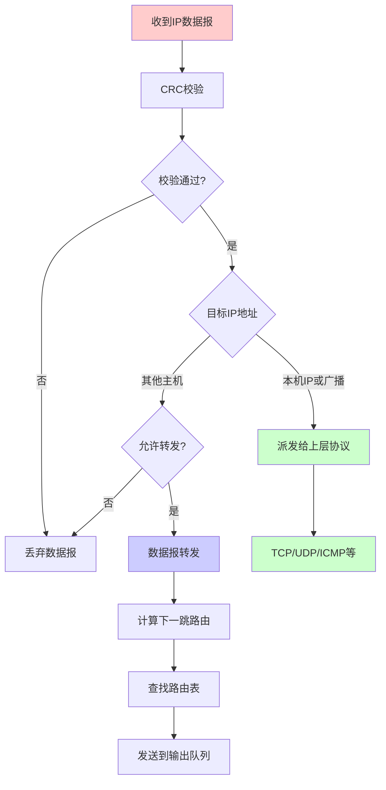

### 路由表结构

路由表是 IP 路由的核心数据结构，包含以下字段：

| 字段 | 说明 | 示例 |
|------|------|------|
| **Destination** | 目标网络或主机 | 192.168.1.0 或 default |
| **Gateway** | 网关地址 | 192.168.1.1 或 * |
| **Genmask** | 网络掩码 | 255.255.255.0 |
| **Flags** | 路由标志 | U（活动）、G（网关）、H（主机） |
| **Metric** | 路由距离 | 到达目标网络的中转数 |
| **Ref** | 引用次数 | Linux 未使用 |
| **Use** | 使用次数 | 该路由项被使用的次数 |
| **Iface** | 网络接口 | eth0、docker0 等 |

### 路由标志说明

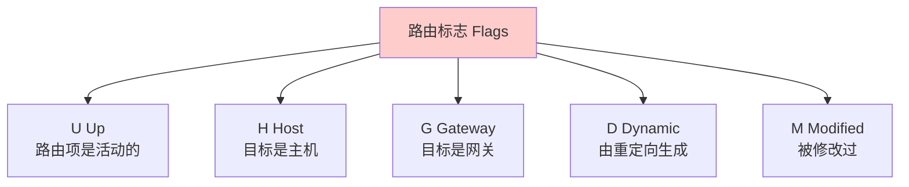

### 路由查找机制

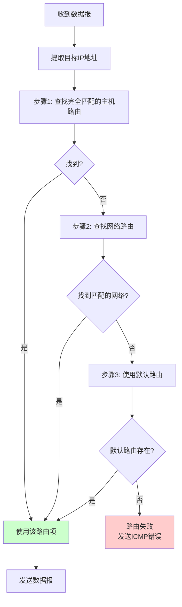

### 路由表示例

```bash
# 查看路由表
$ route -n
Kernel IP routing table
Destination     Gateway         Genmask         Flags Metric Ref    Use Iface
0.0.0.0         192.168.1.1     0.0.0.0         UG    0      0        0 eth0
192.168.1.0     0.0.0.0         255.255.255.0   U     0      0        0 eth0
172.17.0.0      0.0.0.0         255.255.0.0     U     0      0        0 docker0
```

**路由表解析**：

1. **默认路由**（0.0.0.0）：
   - 网关：192.168.1.1
   - 标志：UG（活动 + 网关）
   - 用途：所有非本地网络的数据报都通过此网关

2. **本地网络路由**（192.168.1.0/24）：
   - 网关：0.0.0.0（直接发送）
   - 标志：U（活动）
   - 用途：同一网段的数据报直接发送

3. **Docker 网络路由**（172.17.0.0/16）：
   - 网关：0.0.0.0（直接发送）
   - 标志：U（活动）
   - 用途：Docker 容器网络

### 路由表更新

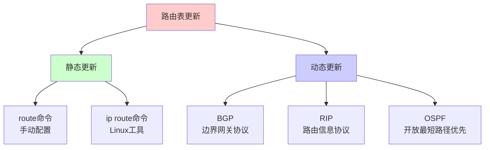

## IP 转发

IP 转发是指路由器将接收到的数据报转发到目标网络的过程。

### 转发流程

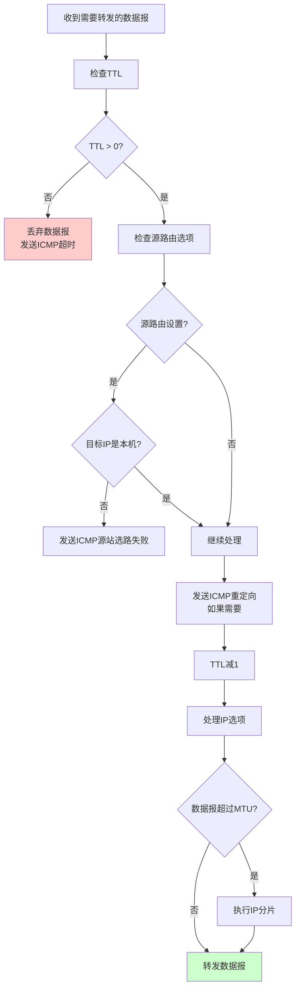

### 启用 IP 转发

```bash
# Linux 系统
# 查看当前设置
cat /proc/sys/net/ipv4/ip_forward

# 临时启用（重启后失效）
echo 1 > /proc/sys/net/ipv4/ip_forward

# 永久启用
# 编辑 /etc/sysctl.conf
net.ipv4.ip_forward = 1
# 然后执行
sysctl -p
```

## ICMP 重定向

### 重定向机制

ICMP 重定向用于优化路由路径，告诉主机使用更合理的下一跳路由器。

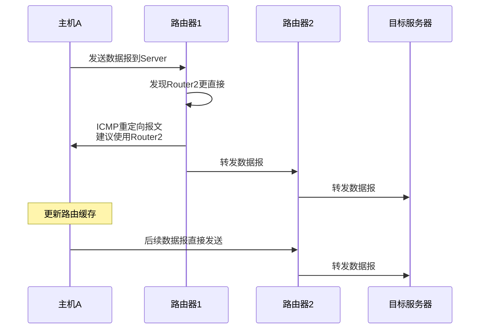

### 重定向类型

| 类型 | 代码 | 说明 |
|------|------|------|
| 网络重定向 | 0 | 对网络的重定向 |
| 主机重定向 | 1 | 对主机的重定向 |
| 服务类型和网络重定向 | 2 | 对服务类型和网络的重定向 |
| 服务类型和主机重定向 | 3 | 对服务类型和主机的重定向 |

### 重定向配置

```bash
# 允许发送 ICMP 重定向报文（路由器）
echo 1 > /proc/sys/net/ipv4/conf/all/send_redirects

# 允许接收 ICMP 重定向报文（主机）
echo 1 > /proc/sys/net/ipv4/conf/all/accept_redirects
```

# IPv6

## IPv6 概述

随着网络技术的发展，IPv4 地址空间已耗尽。IPv6 不仅解决了地址不足问题，还带来了多项改进。

### IPv4 vs IPv6 对比

| 特性 | IPv4 | IPv6 |
|------|------|------|
| **地址长度** | 32 位（4 字节） | 128 位（16 字节） |
| **地址数量** | 约 43 亿 | 约 3.4×10³⁸ |
| **地址表示** | 点分十进制 | 冒号分隔十六进制 |
| **头部长度** | 20-60 字节 | 40 字节（固定） |
| **分片** | 发送端和路由器 | 仅发送端 |
| **校验和** | 有 | 无（由上层协议处理） |
| **选项** | 在头部中 | 在扩展头部中 |
| **配置** | 手动或 DHCP | 自动配置（SLAAC） |
| **安全性** | 可选（IPsec） | 内置（IPsec） |

### IPv6 的优势

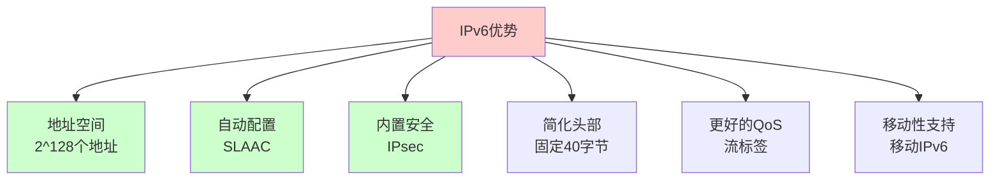

## IPv6 头部结构

IPv6 头部由 40 字节固定头部和可变长的扩展头部组成。

### 固定头部字段

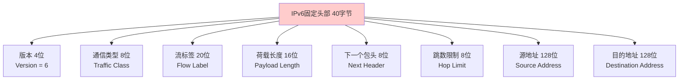

### 字段详细说明

| 字段 | 位数 | 说明 |
|------|------|------|
| **版本（Version）** | 4 | IP 协议版本，IPv6 值为 6 |
| **通信类型（Traffic Class）** | 8 | 数据流通信类型或优先级，类似 IPv4 的 TOS |
| **流标签（Flow Label）** | 20 | 用于标识需要特殊 QoS 处理的数据流 |
| **荷载长度（Payload Length）** | 16 | IPv6 扩展头部和应用程序数据长度之和 |
| **下一个包头（Next Header）** | 8 | 下一个扩展头部或上层协议类型 |
| **跳数限制（Hop Limit）** | 8 | 类似 IPv4 的 TTL |
| **源地址** | 128 | 发送方 IPv6 地址 |
| **目的地址** | 128 | 接收方 IPv6 地址 |

### IPv6 地址表示

#### 完整格式

```
fe80:0000:0000:0000:0000:0000:0000:0001
```

#### 零压缩格式

```
fe80::1
```

**零压缩规则**：
- 可以省略连续的 0 组
- 只能使用一次 `::`
- 不能同时省略前导 0 和尾随 0

#### 地址示例

| 类型 | 示例 | 说明 |
|------|------|------|
| 环回地址 | `::1` | 本地回环 |
| 链路本地 | `fe80::1` | 同一链路内通信 |
| 全局单播 | `2001:0db8::1` | 公网地址 |
| 多播 | `ff02::1` | 多播地址 |

## IPv6 扩展头部

IPv6 使用扩展头部代替 IPv4 的选项字段，提供更灵活的扩展机制。

### 扩展头部链

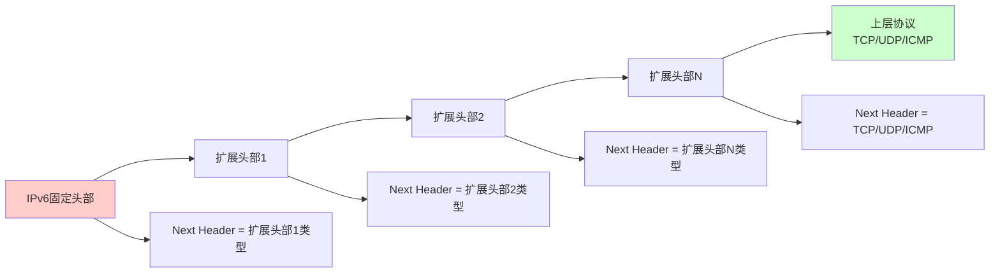

### 扩展头部类型

| 扩展头部 | Next Header 值 | 说明 |
|---------|---------------|------|
| **Hop-by-Hop Options** | 0 | 逐跳选项，每个路由器都必须处理 |
| **Routing** | 43 | 路由头部，指定数据报经过的路由器 |
| **Fragment** | 44 | 分片头部，处理分片和重组 |
| **Encapsulating Security Payload** | 50 | 封装安全载荷，提供加密 |
| **Authentication Header** | 51 | 认证头部，提供认证和完整性 |
| **Destination Options** | 60 | 目的选项，仅由目的节点处理 |
| **No Next Header** | 59 | 没有后续扩展头部 |

### 扩展头部处理顺序

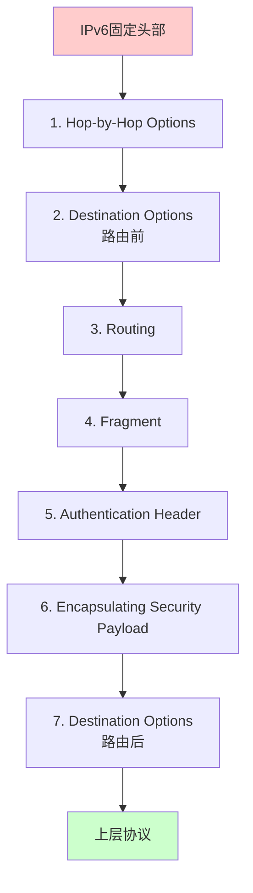

## IPv6 分片

### 与 IPv4 分片的区别

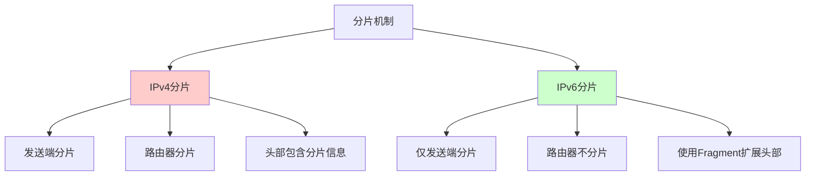

**IPv6 分片特点**：
- 只有发送端可以分片
- 路由器发现数据报超过 MTU 时，丢弃并发送 ICMPv6 Packet Too Big 消息
- 使用 Fragment 扩展头部存储分片信息
- 发送端根据 Path MTU Discovery 确定合适的 MTU

## IPv4 与 IPv6 共存

### 过渡机制

```mermaid
graph TB
    A[IPv4/IPv6共存] --> B[双栈<br/>Dual Stack]
    A --> C[隧道<br/>Tunneling]
    A --> D[翻译<br/>Translation]
    
    B --> B1[同时支持IPv4和IPv6]
    C --> C1[IPv6 over IPv4<br/>6to4, Teredo]
    D --> D1[NAT64<br/>SIIT]
    
    style A fill:#ffcccc
    style B fill:#ccffcc
    style C fill:#ccccff
    style D fill:#ffffcc
```

### 双栈（Dual Stack）

主机同时支持 IPv4 和 IPv6，根据目标地址选择协议版本。

### 隧道（Tunneling）

将 IPv6 数据报封装在 IPv4 数据报中传输。

### 翻译（Translation）

在 IPv4 和 IPv6 之间进行协议转换。

# IP 协议实际应用

## 1. 网络诊断工具

### ping 命令

```bash
# 使用 ICMP Echo Request/Reply
ping 8.8.8.8

# 显示详细信息
ping -v 8.8.8.8

# 设置 TTL
ping -t 64 8.8.8.8
```

### traceroute 命令

利用 TTL 字段实现路由追踪：

```mermaid
sequenceDiagram
    participant Host as 主机
    participant R1 as 路由器1
    participant R2 as 路由器2
    participant Server as 目标服务器
    
    Host->>R1: TTL=1, ICMP Echo
    R1->>Host: TTL=0, ICMP Time Exceeded
    
    Host->>R1: TTL=2, ICMP Echo
    R1->>R2: TTL=1
    R2->>Host: TTL=0, ICMP Time Exceeded
    
    Host->>R1: TTL=3, ICMP Echo
    R1->>R2: TTL=2
    R2->>Server: TTL=1
    Server->>Host: ICMP Echo Reply
```

## 2. 网络配置

### 查看 IP 地址

```bash
# Linux
ip addr show
ifconfig

# 查看路由表
ip route show
route -n
```

### 配置静态路由

```bash
# 添加路由
ip route add 192.168.2.0/24 via 192.168.1.1

# 删除路由
ip route del 192.168.2.0/24

# 添加默认路由
ip route add default via 192.168.1.1
```

## 3. 网络监控

### 使用 tcpdump 抓包

```bash
# 抓取所有 IP 数据报
tcpdump -i eth0 ip

# 抓取特定主机的数据报
tcpdump -i eth0 host 192.168.1.1

# 抓取特定网络的数据报
tcpdump -i eth0 net 192.168.1.0/24
```

### 使用 Wireshark 分析

- 查看 IP 头部字段
- 分析分片情况
- 追踪路由路径
- 分析 TTL 变化

# 常见问题

## 1. MTU 不匹配

**问题**：不同网络的 MTU 不同，导致分片。

**解决**：
- 使用 Path MTU Discovery
- 调整应用层数据大小
- 配置合适的 MTU

## 2. 路由环路

**问题**：数据报在路由器之间循环。

**解决**：
- TTL 机制防止无限循环
- 路由协议检测环路
- 合理配置路由表

## 3. IP 地址冲突

**问题**：同一网络中有相同 IP 地址。

**解决**：
- 使用 DHCP 自动分配
- 静态配置时检查冲突
- 使用 ARP 检测冲突

## 4. 分片丢失

**问题**：分片在传输过程中丢失，无法重组。

**解决**：
- 上层协议（如 TCP）重传
- 使用 DF 标志禁止分片
- 调整数据大小避免分片

# 总结

IP 协议是互联网的基础协议：

## 核心特点

- **无状态**：不维护连接状态
- **无连接**：不需要预先建立连接
- **不可靠**：不保证数据报到达

## IPv4 vs IPv6

| 方面 | IPv4 | IPv6 |
|------|------|------|
| 地址空间 | 32 位 | 128 位 |
| 头部 | 20-60 字节 | 40 字节（固定） |
| 分片 | 发送端和路由器 | 仅发送端 |
| 配置 | 手动/DHCP | 自动配置 |
| 安全性 | 可选 | 内置 |

## 关键机制

1. **路由**：根据路由表选择最佳路径
2. **分片**：适应不同网络的 MTU
3. **转发**：路由器转发数据报到目标网络
4. **重定向**：优化路由路径

理解 IP 协议有助于：
- 理解网络通信原理
- 排查网络问题
- 优化网络性能
- 设计网络架构

# 参考文献

- 《Linux高性能服务器编程》
- [IANA Protocol Numbers](https://www.iana.org/assignments/protocol-numbers/protocol-numbers.xml)
- [RFC 791 - Internet Protocol](https://tools.ietf.org/html/rfc791)
- [RFC 2460 - Internet Protocol, Version 6 (IPv6)](https://tools.ietf.org/html/rfc2460)
