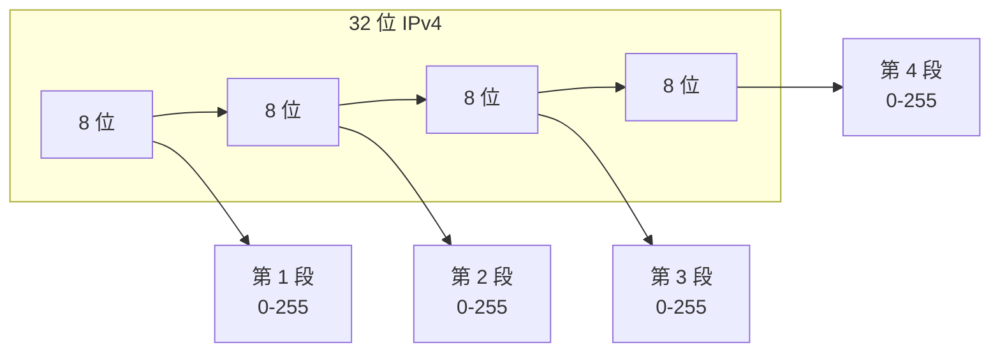

# IP 地址格式与分类详解

IP 地址是网络层用来唯一标识一台设备（或一个网络接口）的逻辑地址，是 TCP/IP 协议栈中寻址与路由的基础。本文从格式和分类两方面说明 IPv4，并简要介绍 IPv6。

---

# 一、IP 地址是什么

- **作用**：在网络中唯一标识一台主机（或接口），用于寻址和路由。
- **与 MAC 的区别**：MAC 是数据链路层地址、通常与网卡绑定；IP 是网络层地址、可配置、可变化，便于分层与聚合路由。
- **版本**：目前广泛使用 **IPv4**（32 位）和 **IPv6**（128 位），二者格式与表示法不同。

---

# 二、IPv4 地址格式

## 2.1 二进制与长度

IPv4 地址共 **32 位（4 字节）**，通常写成 4 个 8 位段（每段 0～255），用点分隔，称为**点分十进制**。

```text
二进制：  11000000 . 10101000 . 00000001 . 00000001
十进制：    192   .   168    .    1     .    1
```

同一地址的两种写法：

- 二进制：`11000000.10101000.00000001.00000001`
- 点分十进制：`192.168.1.1`

## 2.2 点分十进制书写规则

| 规则         | 说明 |
|--------------|------|
| 共 4 段      | 每段 8 位，用 `.` 分隔 |
| 每段范围     | 0～255（无符号 8 位） |
| 不能省略段   | 必须写满 4 段，如 `192.168.1.1`，不能写成 `192.168.1` |



## 2.3 网络部分与主机部分

从**寻址与路由**角度，一个 IPv4 地址在逻辑上分为两部分：

- **网络部分（网络号）**：标识“哪个网络”，用于路由聚合，同一网络内前缀相同。
- **主机部分（主机号）**：在该网络内标识“哪台主机”。

同一网段内的设备网络部分相同，主机部分不同；划分方式由**子网掩码**或 **CIDR 前缀长度**决定（见后文），而不是由“ABC 类”唯一决定。

---

# 三、IPv4 分类（有类编址）

早期 IPv4 采用**有类编址（Classful）**：按固定边界把 32 位分成“网络位 + 主机位”，形成 A、B、C、D、E 五类。现在实际规划更多用**无类编址（CIDR）**，但“分类”仍常用于理解范围和默认掩码。

## 3.1 五类概览


## 3.2 A 类（Class A）

- **首字节（高 8 位）**：`0xxxxxxx` → 十进制 **0～127**（其中 0 和 127 有特殊用途，可用作网络号的主要是 1～126）。
- **默认理解**：网络位 8 位，主机位 24 位。
- **默认子网掩码**：`255.0.0.0`（/8）。
- **范围**：`1.0.0.0`～`126.255.255.255`（单播 A 类）。
- **每网段主机数**：2^24 - 2 = 16,777,214（去掉全 0 与全 1 主机号）。

## 3.3 B 类（Class B）

- **首字节**：`10xxxxxx` → 十进制 **128～191**。
- **默认理解**：网络位 16 位，主机位 16 位。
- **默认子网掩码**：`255.255.0.0`（/16）。
- **范围**：`128.0.0.0`～`191.255.255.255`。
- **每网段主机数**：2^16 - 2 = 65,534。

## 3.4 C 类（Class C）

- **首字节**：`110xxxxx` → 十进制 **192～223**。
- **默认理解**：网络位 24 位，主机位 8 位。
- **默认子网掩码**：`255.255.255.0`（/24）。
- **范围**：`192.0.0.0`～`223.255.255.255`。
- **每网段主机数**：2^8 - 2 = 254。

## 3.5 D 类（Class D）— 组播

- **首字节**：`1110xxxx` → 十进制 **224～239**。
- **用途**：组播（Multicast），不是单播主机地址。
- **范围**：`224.0.0.0`～`239.255.255.255`。

## 3.6 E 类（Class E）— 保留

- **首字节**：`1111xxxx` → 十进制 **240～255**。
- **用途**：保留，不在公网使用。

## 3.7 分类对照表

| 类别 | 首字节（十进制） | 网络位 | 主机位 | 默认掩码     | 用途     |
|------|------------------|--------|--------|--------------|----------|
| A    | 0～127           | 8      | 24     | 255.0.0.0/8  | 单播     |
| B    | 128～191         | 16     | 16     | 255.255.0.0/16| 单播     |
| C    | 192～223         | 24     | 8      | 255.255.255.0/24 | 单播 |
| D    | 224～239         | —      | —      | —            | 组播     |
| E    | 240～255         | —      | —      | —            | 保留     |

---

# 四、子网掩码与 CIDR（无类编址）

## 4.1 子网掩码

**子网掩码**也是 32 位，与 IP 逐位“与”运算得到**网络地址（网段）**。

- **1** 的位对应 IP 的**网络部分**，**0** 的位对应**主机部分**。
- 常用写法：点分十进制，如 `255.255.255.0`；或只写**连续 1 的个数**，即 **CIDR 前缀长度**，如 `/24`。

示例：IP `192.168.1.100`，掩码 `255.255.255.0`（/24）

```text
IP：      192.168.1.100  →  11000000.10101000.00000001.01100100
掩码：    255.255.255.0   →  11111111.11111111.11111111.00000000
与运算 → 网络号：192.168.1.0
```

同一网段内所有主机网络号相同，主机号不同。

## 4.2 CIDR（无类别域间路由）

**CIDR** 不再拘泥于 A/B/C 的固定边界，用“**IP/前缀长度**”表示一个网段：

- **格式**：`网络地址/前缀长度`，如 `192.168.1.0/24`。
- **前缀长度**：表示“网络部分”的位数（即掩码中连续 1 的个数），范围 0～32。
- **主机数**：2^(32 - 前缀长度) - 2（若不用全 0、全 1 主机号）；若允许，则为 2^(32 - 前缀长度)。

| 前缀长度 | 掩码点分十进制   | 主机位 | 可用主机数（常规） |
|----------|------------------|--------|----------------------|
| /8       | 255.0.0.0        | 24     | 2^24 - 2             |
| /16      | 255.255.0.0      | 16     | 2^16 - 2             |
| /24      | 255.255.255.0    | 8      | 254                  |
| /25      | 255.255.255.128  | 7      | 126                  |
| /26      | 255.255.255.192  | 6      | 62                   |

同一段地址可以按需划成不同大小的子网（如把一个 C 类拆成多个 /26），这就是“无类”的含义。

---

# 五、特殊与保留 IPv4 地址

## 5.1 本机回环（Loopback）

- **范围**：`127.0.0.0/8`，常用 `127.0.0.1`。
- **含义**：本机，发往该地址的包不离开本机，用于本机进程间通信、测试。

## 5.2 私有地址（Private）

仅在私有网络内使用，不在公网路由，需经 NAT 才能访问互联网。

| 范围                     | CIDR        | 说明     |
|--------------------------|-------------|----------|
| 10.0.0.0～10.255.255.255 | 10.0.0.0/8  | 单 A 类  |
| 172.16.0.0～172.31.255.255 | 172.16.0.0/12 | 16 个 B 类 |
| 192.168.0.0～192.168.255.255 | 192.168.0.0/16 | 单 B 类（常按 /24 用）|

## 5.3 链路本地（Link-Local）

- **范围**：`169.254.0.0/16`。
- **用途**：无 DHCP、无手工配置时，主机可在此段自动分配一个临时地址，仅在本链路有效。

## 5.4 广播地址

- **主机位全 1**：如 `192.168.1.0/24` 的广播地址为 `192.168.1.255`。
- **用途**：发往该地址的包被该网段内所有主机接收（现在多被组播等替代）。

## 5.5 网络地址

- **主机位全 0**：如 `192.168.1.0/24` 中的 `192.168.1.0` 表示“这个网段本身”，一般不作为单台主机的 IP。

## 5.6 当前网络 / 本机（旧约定）

- `0.0.0.0`：在“绑定地址”时表示“本机所有接口”；在路由中有时表示默认路由的目标。
- 不作为主机的有效单播地址使用。

---

# 六、IPv6 地址格式简介

## 6.1 长度与表示

- **长度**：128 位（16 字节）。
- **书写**：每 16 位一段，共 8 段，用冒号分隔，**十六进制**表示，如：  
  `2001:0db8:85a3:0000:0000:8a2e:0370:7334`。

## 6.2 简写规则

- 每段前导 0 可省略：`2001:db8:85a3:0:0:8a2e:370:7334`。
- **连续多段为 0** 可用 `::` 代替（全址中只能用一次）：  
  `2001:db8:85a3::8a2e:370:7334`。

## 6.3 前缀（子网）

- 用“**IPv6 地址/前缀长度**”表示网段，如 `2001:db8::/32`。
- 前缀长度 0～128，表示网络部分的位数。

## 6.4 与 IPv4 的对比

| 项目       | IPv4           | IPv6               |
|------------|----------------|--------------------|
| 位数       | 32             | 128                |
| 表示法     | 点分十进制     | 冒号十六进制       |
| 段数/分隔符| 4 段，`.`      | 8 段，`:`          |
| 典型私有/特殊 | 10/172.16～31/192.168、127 | 如 fe80::/10 链路本地、fc00::/7 唯一本地等 |

---

# 七、小结

- **IPv4 格式**：32 位，点分十进制四段（0～255），逻辑上分网络部分和主机部分，由子网掩码或 CIDR 决定边界。
- **有类分类**：A（0～127）、B（128～191）、C（192～223）为单播；D 组播、E 保留；对应默认 /8、/16、/24。
- **无类编址**：用 **子网掩码** 或 **CIDR（IP/前缀长度）** 任意划分网段，更灵活。
- **特殊地址**：回环 127、私有 10/172.16～31/192.168、链路本地 169.254、广播（主机位全 1）、网络地址（主机位全 0）。
- **IPv6**：128 位，冒号十六进制，可简写，用“地址/前缀长度”表示子网。

理解 IP 的格式与分类，是理解子网划分、路由和 NAT 的基础。
