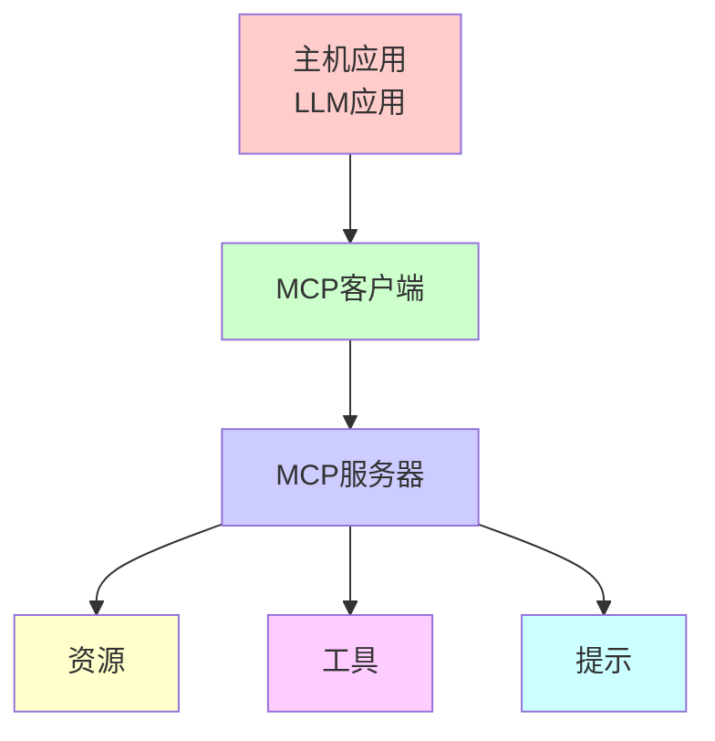
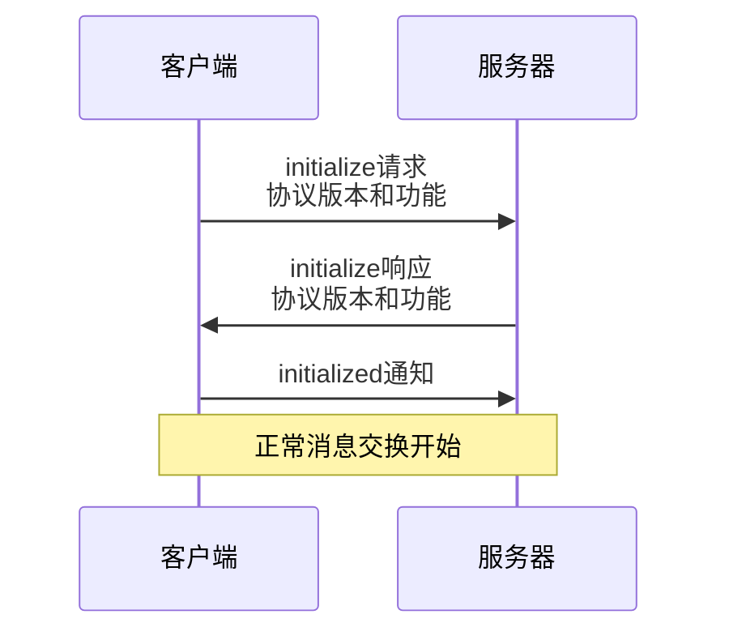
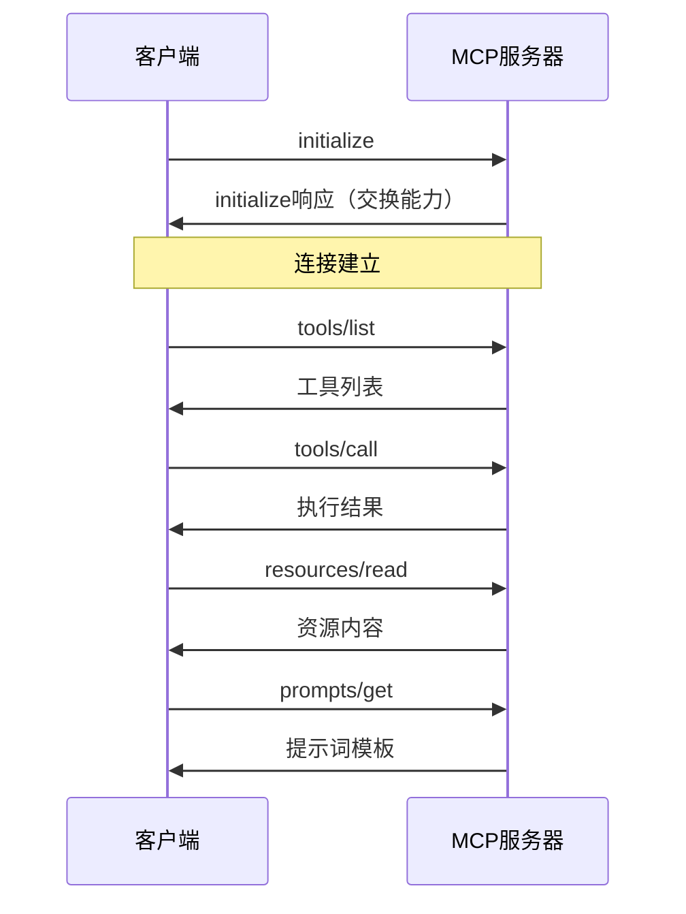
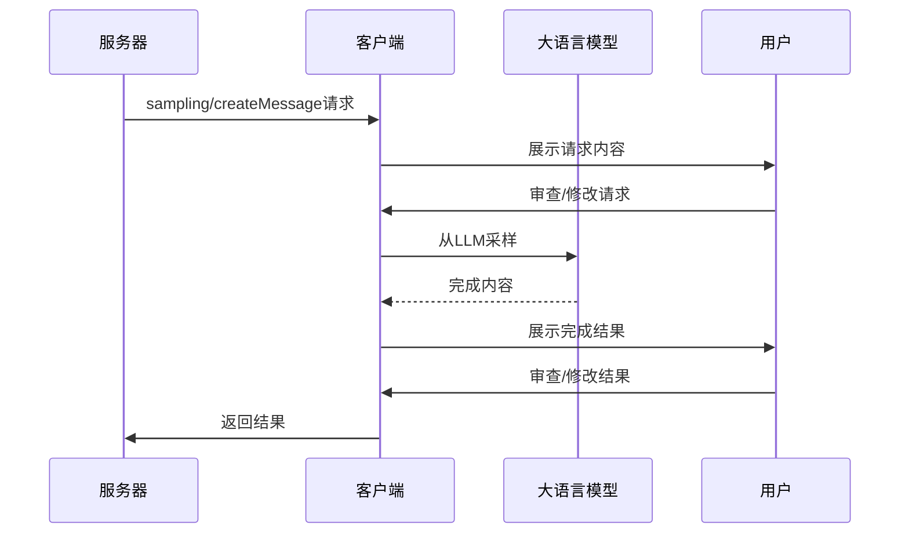

# MCP协议

## 什么是MCP协议

**MCP（Model Context Protocol，模型上下文协议）** 是一个开放标准协议，用于在AI应用程序和外部数据源之间建立安全、双向的连接。MCP允许AI模型访问实时信息、执行操作，并与各种工具和数据源进行交互。

### 核心特性

- **标准化接口**：提供统一的协议规范，使不同AI应用能够与各种数据源和工具集成
- **双向通信**：支持AI应用向数据源发送请求，同时接收实时更新
- **安全性**：内置安全机制，支持认证和授权
- **可扩展性**：支持自定义工具和资源，易于扩展功能
- **跨平台**：支持多种编程语言和平台

### 协议定位

MCP协议工作在应用层，位于AI应用和数据源/工具之间，充当中间层：

```
AI应用 <---> MCP协议 <---> 数据源/工具
```

**官方资源**：
- [官方文档](https://docs.modelcontextprotocol.com/)
- [GitHub仓库](https://github.com/modelcontextprotocol/modelcontextprotocol)

## MCP协议能做什么

MCP协议提供了丰富的功能，使AI应用能够：

### 1. 访问外部数据源

- **文件系统**：读取和写入本地或远程文件
- **数据库**：查询和操作数据库
- **API服务**：调用RESTful API或其他Web服务
- **版本控制**：与Git等版本控制系统交互
- **云存储**：访问云存储服务（如S3、Google Drive等）

### 2. 执行工具操作

- **代码执行**：运行代码片段或脚本
- **系统命令**：执行系统级命令
- **数据处理**：转换和处理数据
- **文件操作**：创建、修改、删除文件
- **网络请求**：发送HTTP请求

### 3. 实时数据交互

- **流式数据**：接收实时数据流
- **事件通知**：订阅和接收事件通知
- **状态同步**：保持应用状态与数据源同步

### 4. 上下文管理

- **上下文注入**：将外部数据注入到AI模型的上下文中
- **上下文更新**：动态更新模型上下文
- **上下文持久化**：保存和恢复上下文状态

# MCP 架构

MCP 采用客户端 - 服务器架构，其中：

- **主机**：发起连接的大语言模型应用程序（如 Claude 桌面应用程序或集成开发环境）
- **客户端**：在主机应用程序内部与服务器保持一对一的连接
- **服务器**：向客户端提供上下文、工具和提示



## 传输层

传输层负责处理客户端与服务器之间的实际通信。MCP 支持多种传输机制：

- **Stdio transport**：使用标准输入/输出进行通信，适用于本地进程
- **Streamable HTTP transport**：使用 HTTP，并可选择通过服务器发送事件（Server-Sent Events）进行流化，使用 HTTP POST 进行客户端到服务器的消息传递

所有传输方式均使用 [JSON-RPC 2.0](https://www.jsonrpc.org/specification) 来交换消息。

## 消息类型

MCP 支持以下消息类型：

### 请求消息（Request）

```typescript
interface Request {
  method: string;
  params?: { ... };
}
```

### 结果消息（Result）

```typescript
interface Result {
  [key: string]: unknown;
}
```

### 错误消息（Error）

```typescript
interface Error {
  code: number;
  message: string;
  data?: unknown;
}
```

### 通知消息（Notification）

```typescript
interface Notification {
  method: string;
  params?: { ... };
}
```

# 连接生命周期

## 初始化



初始化流程：

1. 客户端发送带有协议版本和功能的 `initialize` 请求
2. 服务器以其协议版本和功能进行响应
3. 客户端发送 `initialized` 通知作为确认
4. 正常消息交换开始

## 信息交换

初始化后，支持以下模式：

- **请求 - 响应**：客户端或服务器发送请求，另一方做出响应
- **通知**：任何一方发送单向消息

## 终止

任何一方都可以终止连接：

- 通过 `close()` 正常关闭
- 传输断开连接
- 错误情况

# 错误处理

## MCP标准错误码

```typescript
enum ErrorCode {
  // Standard JSON-RPC error codes
  ParseError = -32700,
  InvalidRequest = -32600,
  MethodNotFound = -32601,
  InvalidParams = -32602,
  InternalError = -32603,
}
```

SDK 和应用程序可以定义高于 -32000 的自定义错误代码。

错误通过以下方式传播：

- 对请求的错误响应
- 传输层的错误事件
- 协议级错误处理程序

# MCP协议格式

MCP协议基于JSON-RPC 2.0规范，使用JSON格式进行消息交换。

## 消息结构

### 请求消息（Request）

```json
{
  "jsonrpc": "2.0",
  "id": 1,
  "method": "tools/call",
  "params": {
    "name": "tool_name",
    "arguments": {
      "arg1": "value1",
      "arg2": "value2"
    }
  }
}
```

**字段说明：**

- **jsonrpc**：协议版本，固定为 `"2.0"`
- **id**：请求ID，用于匹配响应
- **method**：要调用的方法名
- **params**：方法参数

### 响应消息（Response）

```json
{
  "jsonrpc": "2.0",
  "id": 1,
  "result": {
    "content": [
      {
        "type": "text",
        "text": "执行结果"
      }
    ]
  }
}
```

**字段说明：**

- **jsonrpc**：协议版本，固定为 `"2.0"`
- **id**：对应的请求ID
- **result**：执行结果（成功时）
- **error**：错误信息（失败时）

### 错误响应

```json
{
  "jsonrpc": "2.0",
  "id": 1,
  "error": {
    "code": -32603,
    "message": "Internal error",
    "data": {
      "details": "详细错误信息"
    }
  }
}
```

## 核心方法

### 1. 初始化（initialize）

建立连接并交换能力信息。

**请求：**

```json
{
  "jsonrpc": "2.0",
  "id": 1,
  "method": "initialize",
  "params": {
    "protocolVersion": "2024-11-05",
    "capabilities": {
      "tools": {},
      "resources": {},
      "prompts": {}
    },
    "clientInfo": {
      "name": "client_name",
      "version": "1.0.0"
    }
  }
}
```

**响应：**

```json
{
  "jsonrpc": "2.0",
  "id": 1,
  "result": {
    "protocolVersion": "2024-11-05",
    "capabilities": {
      "tools": {
        "listChanged": true
      },
      "resources": {
        "subscribe": true,
        "listChanged": true
      }
    },
    "serverInfo": {
      "name": "server_name",
      "version": "1.0.0"
    }
  }
}
```

### 2. 工具调用（tools/call）

调用服务器提供的工具。

**请求：**

```json
{
  "jsonrpc": "2.0",
  "id": 2,
  "method": "tools/call",
  "params": {
    "name": "read_file",
    "arguments": {
      "path": "/path/to/file.txt"
    }
  }
}
```

**响应：**

```json
{
  "jsonrpc": "2.0",
  "id": 2,
  "result": {
    "content": [
      {
        "type": "text",
        "text": "文件内容..."
      }
    ],
    "isError": false
  }
}
```

### 3. 资源访问（resources/read）

读取资源内容。

**请求：**

```json
{
  "jsonrpc": "2.0",
  "id": 3,
  "method": "resources/read",
  "params": {
    "uri": "file:///path/to/resource"
  }
}
```

**响应：**

```json
{
  "jsonrpc": "2.0",
  "id": 3,
  "result": {
    "contents": [
      {
        "uri": "file:///path/to/resource",
        "mimeType": "text/plain",
        "text": "资源内容..."
      }
    ]
  }
}
```

### 4. 提示词（prompts/get）

获取提示词模板。

**请求：**

```json
{
  "jsonrpc": "2.0",
  "id": 4,
  "method": "prompts/get",
  "params": {
    "name": "prompt_name",
    "arguments": {
      "variable": "value"
    }
  }
}
```

## 消息流程



# MCP 资源

MCP支持的数据内容：

- **File contents**：文件内容
- **Database records**：数据库记录
- **API responses**：API响应
- **Live system data**：实时系统数据
- **Screenshots and images**：截图和图像
- **Log files**：日志文件
- **And more**：更多类型

每个资源都由唯一的URI标识，并且可以包含文本或二进制数据。

## URI格式

URI格式：`[protocol]://[host]/[path]`

例如：
- `file:///home/user/documents/report.pdf`
- `postgres://database/customers/schema`
- `screen://localhost/display1`

协议和路径结构由MCP服务器实现定义。服务器可以定义自己的自定义URI方案。

## 资源类型

### 文本资源

由UTF-8编码的文本内容：
- Source code（源代码）
- Configuration files（配置文件）
- Log files（日志文件）
- JSON/XML data（JSON/XML数据）
- Plain text（纯文本）

### 二进制资源

- Images（图像）
- PDFs
- Audio files（音频文件）
- Video files（视频文件）
- Other non-text formats（其他非文本格式）

## 访问资源

### Direct resources（直接资源）

服务器通过 `resources/list` 请求公开资源列表。每个资源都包括：

```typescript
{
  uri: string;           // Unique identifier for the resource
  name: string;          // Human-readable name
  description?: string;  // Optional description
  mimeType?: string;     // Optional MIME type
  size?: number;         // Optional size in bytes
}
```

### Resource templates（资源模板）

对于动态资源，服务器可以暴露 [URI templates](https://datatracker.ietf.org/doc/html/rfc6570) 给客户端构建有效资源URI的URI模板：

```typescript
{
  uriTemplate: string;   // URI template following RFC 6570
  name: string;          // Human-readable name for this type
  description?: string;  // Optional description
  mimeType?: string;     // Optional MIME type for all matching resources
}
```

### Reading resources（读取资源）

要读取资源，客户端可以通过 `resources/read` 请求资源URI。

服务器以资源内容列表响应：

```typescript
{
  contents: [
    {
      uri: string;        // The URI of the resource
      mimeType?: string;  // Optional MIME type

      // One of:
      text?: string;      // For text resources
      blob?: string;      // For binary resources (base64 encoded)
    }
  ]
}
```

> 服务器可以返回多个资源，以响应一个 `resources/read` 请求。例如，在读取目录时返回目录中的文件列表。

## 资源更新

MCP通过两种机制支持资源的实时更新：

### List changes（列表变更）

当资源列表通过通知 `notifications/resources/list_changed` 更改时，服务器可以通知客户端。

### Content changes（内容变更）

客户端可以订阅更新特定资源：

1. 客户端发送 `resources/subscribe` 资源URI
2. 服务器在资源更改时发送 `notifications/resources/updated`
3. 客户端可以通过 `resources/read` 获取最新内容
4. 客户端可以 `resources/unsubscribe` 退订

# MCP Prompt

MCP Prompt创建可重复使用的提示模板和工作流程。

提示使服务器能够定义可重复使用的提示模板和工作流程，客户端可以轻松地提供给用户和LLM。它们提供了一种标准化和共享常见LLM交互的强大方法。

## 结构

```typescript
{
  name: string;              // Unique identifier for the prompt
  description?: string;      // Human-readable description
  arguments?: [              // Optional list of arguments
    {
      name: string;          // Argument identifier
      description?: string;  // Argument description
      required?: boolean;    // Whether argument is required
    }
  ]
}
```

## 获取和使用 Prompt

- **获取prompt**：客户端可以通过发送 `prompts/list` 请求来发现可用的提示
- **使用prompt**：要使用提示，客户端发送 `prompts/get` 请求

## 动态 Prompt

### 嵌入资源上下文

```json
{
  "name": "analyze-project",
  "description": "Analyze project logs and code",
  "arguments": [
    {
      "name": "timeframe",
      "description": "Time period to analyze logs",
      "required": true
    },
    {
      "name": "fileUri",
      "description": "URI of code file to review",
      "required": true
    }
  ]
}
```

处理 `prompts/get` 请求的响应示例：

```json
{
  "messages": [
    {
      "role": "user",
      "content": {
        "type": "text",
        "text": "Analyze these system logs and the code file for any issues:"
      }
    },
    {
      "role": "user",
      "content": {
        "type": "resource",
        "resource": {
          "uri": "logs://recent?timeframe=1h",
          "text": "[2024-03-14 15:32:11] ERROR: Connection timeout in network.py:127\n[2024-03-14 15:32:15] WARN: Retrying connection (attempt 2/3)\n[2024-03-14 15:32:20] ERROR: Max retries exceeded",
          "mimeType": "text/plain"
        }
      }
    },
    {
      "role": "user",
      "content": {
        "type": "resource",
        "resource": {
          "uri": "file:///path/to/code.py",
          "text": "def connect_to_service(timeout=30):\n    retries = 3\n    for attempt in range(retries):\n        try:\n            return establish_connection(timeout)\n        except TimeoutError:\n            if attempt == retries - 1:\n                raise\n            time.sleep(5)\n\ndef establish_connection(timeout):\n    # Connection implementation\n    pass",
          "mimeType": "text/x-python"
        }
      }
    }
  ]
}
```

### 多步 Workflow

```typescript
const debugWorkflow = {
  name: "debug-error",
  async getMessages(error: string) {
    return [
      {
        role: "user",
        content: {
          type: "text",
          text: `Here's an error I'm seeing: ${error}`,
        },
      },
      {
        role: "assistant",
        content: {
          type: "text",
          text: "I'll help analyze this error. What have you tried so far?",
        },
      },
      {
        role: "user",
        content: {
          type: "text",
          text: "I've tried restarting the service, but the error persists.",
        },
      },
    ];
  },
};
```

# MCP Tools

MCP工具可以让LLM通过服务器执行相关操作，它使服务器能够向客户端公开可执行功能。通过工具，LLM可以与外部系统进行交互，执行计算并采取行动。

> 工具旨在由模型控制，这意味着AI模型能够自动调用它们。工具的目的是将工具从服务器暴露到客户端（循环中的人类以授予批准）。

MCP中的工具允许服务器公开可执行的功能，这些功能可以由客户端调用并由LLM使用来执行操作。工具的关键方面包括：

- **Discovery**：客户端可以通过发送 `tools/list` 请求获得可用工具的列表
- **Invocation**：使用 `tools/call` 请求调用工具，服务器执行请求的操作并返回结果
- **Flexibility**：工具可以从简单计算到复杂的API交互

像资源一样，工具通过唯一名称标识，可以包括描述以指导其使用情况。但是，与资源不同，工具代表可以修改状态或与外部系统交互的动态操作。

## 结构

每个工具都用以下结构来定义：

```typescript
{
  name: string;          // Unique identifier for the tool
  description?: string;  // Human-readable description
  inputSchema: {         // JSON Schema for the tool's parameters
    type: "object",
    properties: { ... }  // Tool-specific parameters
  },
  annotations?: {        // Optional hints about tool behavior
    title?: string;      // Human-readable title for the tool
    readOnlyHint?: boolean;    // If true, the tool does not modify its environment
    destructiveHint?: boolean; // If true, the tool may perform destructive updates
    idempotentHint?: boolean;  // If true, repeated calls with same args have no additional effect
    openWorldHint?: boolean;   // If true, tool interacts with external entities
  }
}
```

## 发现和更新

MCP支持动态工具发现：

- 客户端可以随时列出可用工具
- 当工具使用通知 `notifications/tools/list_changed` 更改工具时，服务器可以通知客户端
- 可以在运行时添加或删除工具
- 工具定义可以更新（尽管应小心进行）

## 错误处理

工具错误应在结果对象中报告，而不是MCP协议级错误。这使LLM可以看到并有可能处理错误。当工具遇到错误时：

- 在结果中设置 `isError: true`
- 在内容数组中包括错误详细信息

这种方法使LLM可以看到发生错误并有可能采取纠正措施或要求人为干预。

## 工具注释

工具注释提供了有关工具行为的其他元数据，帮助客户端了解如何呈现和管理工具。这些注释是描述工具的性质和影响的提示，但不应依靠用于安全决定。

工具注释有几个关键目的：

- 提供特定于UX的信息而不影响模型上下文
- 帮助客户端适当地分类和介绍工具
- 传达有关工具潜在副作用的信息
- 协助开发直观界面以供工具批准

MCP规范定义了工具的以下注释：

| Annotation | Type | Default | Description |
| ---------- | ---- | ------- | ----------- |
| title | string | - | 工具的用户可见名称，用于展示 |
| readOnlyHint | boolean | false | 如果为true，工具不修改其环境 |
| destructiveHint | boolean | false | 如果为true，工具可能执行破坏性更新（只有在ReadOnlyHint为false时才有意义） |
| idempotentHint | boolean | false | 如果为true，重复调用相同参数没有额外效果（只有在ReadOnlyHint为false时有意义） |
| openWorldHint | boolean | false | 如果为true，工具与外部实体交互 |

### 工具注释的最佳实践

- **对副作用保持准确**：清楚地指出工具是否修改其环境以及这些修改是否具有破坏性
- **使用描述性标题**：提供对人类友好的标题，清楚地描述了该工具的目的
- **正确地指出幂等性**：仅当具有相同参数的重复调用确实没有其他效果时，将工具标记为idempotent
- **设置适当的开放/封闭世界提示**：指示工具是否与封闭的系统（例如数据库）或开放系统（例如Web）进行交互
- **请记住注释是提示**：工具注释中的所有属性都是提示，并且不能保证对工具行为的忠实描述。客户端绝不应该仅根据注释做出关键性决策

# MCP Sampling

Sampling是一个强大的MCP功能，它允许服务器通过客户端请求LLM完成，从而在保持安全性和隐私的同时实现复杂的代理行为。

> 基于 `human-in-the-loop` 设计可确保用户保持对LLM看到和生成的内容的控制。

## Sampling 流程



Sampling流程遵循以下步骤：

1. **服务器向客户端发送请求**：服务器向客户端发送一个名为 `sampling/createMessage` 的请求
2. **客户端审查并可修改请求**：客户端收到请求后，会对其进行审查，并且拥有修改请求内容的权限
3. **客户端从大语言模型采样**：客户端依据审查或修改后的请求，从大语言模型（LLM）中获取相应的完成内容
4. **客户端审查完成内容**：客户端得到大语言模型给出的完成内容后，会再次进行审查
5. **客户端将结果返回给服务器**：经过审查后，客户端把最终的结果发送回服务器

## 请求格式

```typescript
{
  messages: [
    {
      role: "user" | "assistant",
      content: {
        type: "text" | "image",

        // For text:
        text?: string,

        // For images:
        data?: string,             // base64 encoded
        mimeType?: string
      }
    }
  ],
  modelPreferences?: {
    hints?: [{
      name?: string                // Suggested model name/family
    }],
    costPriority?: number,         // 0-1, importance of minimizing cost
    speedPriority?: number,        // 0-1, importance of low latency
    intelligencePriority?: number  // 0-1, importance of capabilities
  },
  systemPrompt?: string,
  includeContext?: "none" | "thisServer" | "allServers",
  temperature?: number,
  maxTokens: number,
  stopSequences?: string[],
  metadata?: Record<string, unknown>
}
```

### 字段说明

- **messages**：包含对话历史记录，以发送到LLM。每条消息都有：
  - `role`："用户"或"助手"
  - `content`：消息内容，可以是：
    - `text` 字段的文本内容
    - `data` 和 `mimeType` 字段表示图片内容，data是base64编码的数据

- **modelPreferences**：对象允许服务器指定其模型选择偏好：
  - `hints`：型号名称建议的数组
  - `costPriority`：最小化成本的重要性（0-1）
  - `speedPriority`：低潜伏期响应的重要性（0-1）
  - `intelligencePriority`：高级模型功能的重要性（0-1）

- **systemPrompt**：字段允许服务器请求特定的系统提示。客户端可以修改或忽略此事

- **includeContext**：指定MCP包含的上下文：
  - `none`：没有上下文
  - `thisServer`：包括请求服务器中的上下文
  - `allServers`：包括所有连接的MCP服务器的上下文

- **Sampling 参数**：用以下方式微调LLM抽样
  - `temperature`：控制随机性（0.0至1.0）
  - `maxTokens`：最大令牌生成
  - `stopSequences`：停止生成的序列数组
  - `metadata`：其他特定提供者的参数

## 响应格式

```typescript
{
  model: string,  // Name of the model used
  stopReason?: "endTurn" | "stopSequence" | "maxTokens" | string,
  role: "user" | "assistant",
  content: {
    type: "text" | "image",
    text?: string,
    data?: string,
    mimeType?: string
  }
}
```

## human-in-the-loop

Sampling在设计时就考虑到了人工监督，具体如下：

### 对于提示（prompts）

- 客户端应向用户展示提议的提示内容
- 用户应能够修改或拒绝提示
- 系统提示可以被过滤或修改
- 上下文包含由客户端控制

### 对于完成结果（completions）

- 客户端应向用户展示完成结果
- 用户应能够修改或拒绝完成结果
- 客户端可以过滤或修改完成结果
- 用户控制使用哪个模型

# MCP Roots

Roots是MCP中的一个概念，它定义了服务器可以运行的边界。它们为客户提供了一种通知服务器有关相关资源及其位置的方法。

Roots是客户端建议服务器应重点关注的URI。当客户端连接到服务器时，它会声明该服务器应使用的哪个。虽然主要用于文件系统路径，但根可以是任何有效的URI，包括HTTP URL。

例如：
```typescript
file:///home/user/projects/myapp
https://api.example.com/v1
```

## Roots 的作用

Roots 具有几个重要作用：

- **指引作用（Guidance）**：Roots 能告知服务器相关资源及其所在位置
- **明确性作用（Clarity）**：Roots 能清晰界定哪些资源属于你的工作空间
- **组织作用（Organization）**：多个 Roots 能让你同时处理不同的资源

## Roots 的工作方式

### 在客户端方面

- 当客户端支持 Roots 时，在连接过程中会声明其具备 Roots 相关能力
- 客户端会向服务器提供一系列建议的 Roots 列表
- 如果支持的话，当 Roots 发生变化时，客户端会通知服务器

### 在服务器端方面

- 尽管 Roots 主要是提供信息，并非严格强制要求，但服务器应该尊重客户端提供的 Roots
- 服务器会使用 Root 的统一资源标识符（URI）来定位和访问资源
- 服务器会优先在 Root 的边界范围内执行操作

## 常见的使用场景

- **Project directories**：项目目录，Roots 常被用于定义项目所在的目录位置
- **Repository locations**：存储库位置，Roots 可用来明确存储库所在之处
- **API endpoints**：API 端点，Roots 可用于界定 API 的访问地址
- **Configuration locations**：配置位置，Roots 能够确定配置文件所在的地方
- **Resource boundaries**：资源边界，Roots 可以用来定义资源的范围界限

# MCP Transports

## 消息格式

MCP使用JSON-RPC 2.0作为传输格式。该传输层负责将MCP协议消息转换为JSON-RPC格式，用于传输和转换接收到的JSON-RPC消息回到MCP协议消息。

### Requests（请求）

```typescript
{
  jsonrpc: "2.0",
  id: number | string,
  method: string,
  params?: object
}
```

### Responses（响应）

```typescript
{
  jsonrpc: "2.0",
  id: number | string,
  result?: object,
  error?: {
    code: number,
    message: string,
    data?: unknown
  }
}
```

### Notifications（通知）

```typescript
{
  jsonrpc: "2.0",
  method: string,
  params?: object
}
```

## 传输类型

### 标准输入输出（stdio）

stdio传输可以通过标准输入和输出流进行通信。这对于本地集成和命令行工具特别有用。

**使用stdio时：**

- 构建命令行工具
- 实施本地集成
- 需要简单的过程通信
- 使用Shell脚本

### 流式HTTP（Streamable HTTP）

流式HTTP传输使用HTTP POST请求，用于客户对服务器通信和可选的服务器式事件（SSE）流以服务器到客户通信。

**使用流式HTTP时：**

- 构建基于Web的集成
- 需要通过http的客户端服务器通信
- 需要稳定会话
- 支持多个并发客户
- 实现可重新连接

#### 工作方式

基于流的 HTTP 传输（Streamable HTTP）的工作方式，具体如下：

1. **客户端到服务器的通信**：客户端发送给服务器的每一条 JSON-RPC 消息，都会作为一个新的 HTTP POST 请求，发送到 MCP 端点
2. **服务器的响应**：服务器有两种响应方式：
   - 单个 JSON 响应：内容类型为 `application/json`
   - SSE 流：内容类型为 `text/event-stream`，用于发送多条消息
3. **服务器到客户端的通信**：服务器可以通过以下两种方式向客户端发送请求或通知：
   - 由客户端请求发起的 SSE 流：即客户端发起请求后，服务器利用该请求对应的 SSE 流来发送信息
   - 来自对 MCP 端点的 HTTP GET 请求的 SSE 流：服务器通过客户端对 MCP 端点的 HTTP GET 请求所对应的 SSE 流，向客户端发送数据

#### 会话管理

流式HTTP支持状态会话，以维护多个请求的上下文：

- **会话初始化**：服务器可以在初始化期间分配会话ID，记录在 `Mcp-Session-Id` 响应头中
- **会话持久性**：客户必须使用 `Mcp-Session-Id` 会话ID包含在所有后续请求中
- **会话终止**：可以通过发送带有会话ID的 `HTTP DELETE` 请求来明确终止会话

#### 连接恢复

为了支持恢复断裂的连接，流式HTTP提供：

- **事件ID**：服务器可以将唯一ID附加到SSE事件以进行跟踪
- **上一次活动的恢复**：客户可以通过发送最后一个事件ID标头恢复
- **消息重播**：服务器可以从断开点重播错过的消息

这即使通过不稳定的网络连接也可以确保可靠的消息传递。

### 自定义传输

MCP使实施特定需求的自定义传输变得容易。任何传输实施都只需要符合传输接口：

您可以实施以下自定义传输：

- 自定义网络协议
- 专门的沟通渠道
- 与现有系统集成
- 性能优化

# 怎么使用MCP

## 1. 安装MCP SDK

根据使用的编程语言安装相应的SDK：

**Python：**

```bash
pip install mcp
```

**TypeScript/JavaScript：**

```bash
npm install @modelcontextprotocol/sdk
```

**Go：**

```bash
go get github.com/modelcontextprotocol/go-sdk
```

## 2. 创建MCP服务器

**Python示例：**

```python
from mcp.server import Server
from mcp.server.stdio import stdio_server
from mcp.types import Tool, TextContent

# 定义工具
async def read_file_tool(arguments: dict) -> list[TextContent]:
    path = arguments.get("path")
    with open(path, "r") as f:
        content = f.read()
    return [TextContent(type="text", text=content)]

# 创建服务器
server = Server("my-mcp-server")

# 注册工具
@server.list_tools()
async def list_tools() -> list[Tool]:
    return [
        Tool(
            name="read_file",
            description="读取文件内容",
            inputSchema={
                "type": "object",
                "properties": {
                    "path": {
                        "type": "string",
                        "description": "文件路径"
                    }
                },
                "required": ["path"]
            }
        )
    ]

@server.call_tool()
async def call_tool(name: str, arguments: dict) -> list[TextContent]:
    if name == "read_file":
        return await read_file_tool(arguments)
    raise ValueError(f"Unknown tool: {name}")

# 运行服务器
async def main():
    async with stdio_server() as (read_stream, write_stream):
        await server.run(
            read_stream,
            write_stream,
            server.create_initialization_options()
        )

if __name__ == "__main__":
    import asyncio
    asyncio.run(main())
```

## 3. 创建MCP客户端

**Python示例：**

```python
from mcp import ClientSession, StdioServerParameters
from mcp.client.stdio import stdio_client

async def main():
    # 配置服务器参数
    server_params = StdioServerParameters(
        command="python",
        args=["server.py"]
    )
    
    # 创建客户端会话
    async with stdio_client(server_params) as (read, write):
        async with ClientSession(read, write) as session:
            # 初始化
            await session.initialize()
            
            # 列出可用工具
            tools = await session.list_tools()
            print(f"可用工具: {[tool.name for tool in tools.tools]}")
            
            # 调用工具
            result = await session.call_tool(
                "read_file",
                {"path": "/path/to/file.txt"}
            )
            print(f"结果: {result.content}")

if __name__ == "__main__":
    import asyncio
    asyncio.run(main())
```

## 4. 配置MCP服务器

**配置文件示例（config.json）：**

```json
{
  "mcpServers": {
    "filesystem": {
      "command": "python",
      "args": ["-m", "mcp_server_filesystem", "/path/to/allowed/dir"]
    },
    "git": {
      "command": "node",
      "args": ["/path/to/mcp-server-git/index.js"]
    }
  }
}
```

## 5. 在AI应用中使用

**Cursor IDE配置示例：**

在Cursor的设置中配置MCP服务器：

```json
{
  "mcp": {
    "servers": {
      "filesystem": {
        "command": "python",
        "args": ["-m", "mcp_server_filesystem", "/workspace"]
      }
    }
  }
}
```

## 6. 常用MCP服务器

- **filesystem**：文件系统访问
- **git**：Git版本控制操作
- **brave-search**：Brave搜索引擎
- **github**：GitHub API集成
- **postgres**：PostgreSQL数据库访问
- **sqlite**：SQLite数据库访问

# 最佳实践

## 1. 安全性

- 使用HTTPS或加密传输
- 实现适当的认证和授权机制
- 限制可访问的资源范围
- 验证和清理输入参数

## 2. 错误处理

- 提供详细的错误信息
- 使用标准的错误代码
- 实现重试机制
- 记录错误日志

## 3. 性能优化

- 使用异步操作
- 实现缓存机制
- 批量处理请求
- 限制资源使用

## 4. 可维护性

- 遵循协议规范
- 编写清晰的文档
- 提供示例代码
- 进行充分测试

# 应用场景

## 1. AI代码助手

- 读取和分析代码文件
- 执行代码测试
- 与版本控制系统交互
- 访问项目文档

## 2. 数据分析

- 查询数据库
- 处理数据文件
- 生成报告
- 可视化数据

## 3. 自动化任务

- 文件管理
- 系统监控
- 任务调度
- 通知发送

## 4. 知识管理

- 搜索文档
- 提取信息
- 生成摘要
- 知识图谱构建

# 总结

MCP（Model Context Protocol）是一个强大的开放标准协议，具有以下特点：

## 核心特性

- **标准化接口**：统一的协议规范
- **双向通信**：支持请求-响应和通知
- **安全性**：内置安全机制
- **可扩展性**：支持自定义工具和资源
- **跨平台**：支持多种编程语言和平台

## 关键组件

1. **资源（Resources）**：访问各种数据源
2. **工具（Tools）**：执行操作和交互
3. **提示（Prompts）**：可重复使用的提示模板
4. **采样（Sampling）**：通过客户端请求LLM完成
5. **Roots**：定义服务器运行边界

## 传输方式

- **stdio**：标准输入输出，适用于本地进程
- **Streamable HTTP**：HTTP + SSE，适用于Web集成
- **自定义传输**：可根据需求实现

理解 MCP 协议有助于：
- 构建AI应用与外部系统的连接
- 实现工具和资源的标准化访问
- 提升AI应用的能力和灵活性
- 开发可扩展的AI集成方案

# 参考文献

* [MCP官方文档](https://docs.modelcontextprotocol.com/)
* [MCP GitHub仓库](https://github.com/modelcontextprotocol/modelcontextprotocol)
* [JSON-RPC 2.0规范](https://www.jsonrpc.org/specification)
* [MCP Python SDK](https://github.com/modelcontextprotocol/python-sdk)
* [MCP TypeScript SDK](https://github.com/modelcontextprotocol/typescript-sdk)
