# MQTT协议详解

MQTT（Message Queuing Telemetry Transport，消息队列遥测传输协议）是一种基于发布/订阅模式的轻量级消息传输协议，专为低带宽、高延迟或不稳定的网络环境设计，广泛应用于物联网（IoT）场景。

## 1. MQTT协议概述

### 1.1 协议特点

- **轻量级**：协议头最小只有2字节，适合资源受限的设备
- **发布/订阅模式**：解耦消息生产者和消费者
- **QoS保证**：提供三种消息质量等级
- **低开销**：最小化网络带宽和电池消耗
- **可靠性**：支持持久会话和消息确认机制
- **双向通信**：支持客户端和服务器之间的双向消息传递

### 1.2 应用场景

- **物联网设备**：传感器数据采集、智能家居控制
- **移动应用**：推送通知、实时消息
- **车联网**：车辆状态监控、远程控制
- **工业4.0**：设备监控、远程维护
- **即时通讯**：聊天应用、协作工具

## 2. MQTT协议架构

### 2.1 核心组件

MQTT协议架构包含以下核心组件：

1. **MQTT Broker（代理服务器）**：消息的中间转发节点
2. **MQTT Client（客户端）**：发布消息或订阅主题的设备
3. **Topic（主题）**：消息的分类标识符
4. **Message（消息）**：实际传输的数据

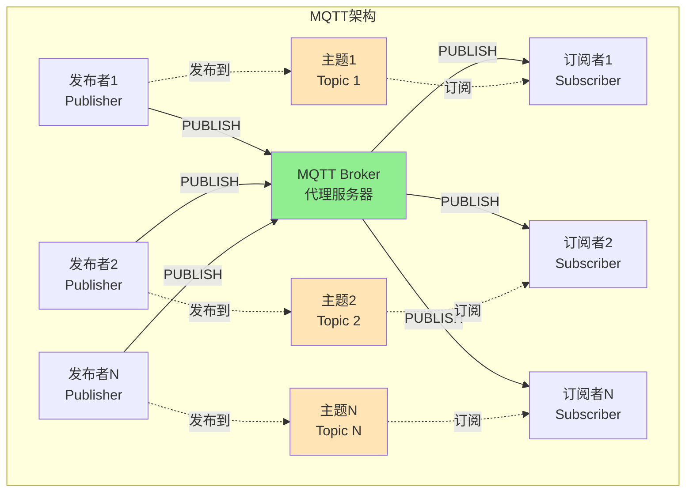

### 2.2 通信模式

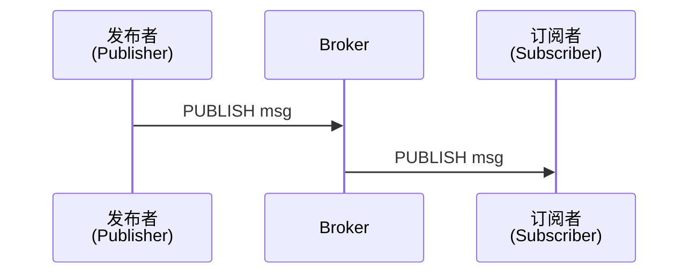

发布者将消息发送到Broker，Broker根据主题将消息分发给所有订阅该主题的订阅者。

## 3. MQTT协议版本

### 3.1 MQTT 3.1.1

- 2014年发布，OASIS标准
- 最广泛使用的版本
- 支持TCP/IP连接

### 3.2 MQTT 5.0

- 2019年发布
- 新增功能：
  - 用户属性（User Properties）
  - 原因码（Reason Codes）
  - 会话过期间隔（Session Expiry Interval）
  - 共享订阅（Shared Subscriptions）
  - 消息过期（Message Expiry）
  - 请求/响应模式

## 4. MQTT消息格式

### 4.1 固定报头（Fixed Header）

所有MQTT消息都以固定报头开始，最少2字节：

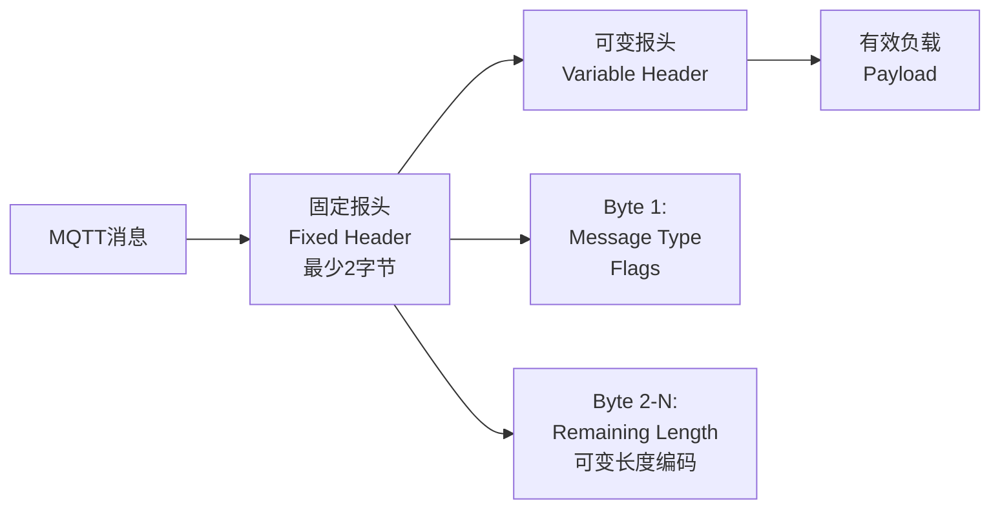

**消息类型（Message Type）**：
- `0001` (1) - CONNECT：客户端连接到服务器
- `0010` (2) - CONNACK：连接确认
- `0011` (3) - PUBLISH：发布消息
- `0100` (4) - PUBACK：发布确认
- `0101` (5) - PUBREC：发布收到（QoS 2第一步）
- `0110` (6) - PUBREL：发布释放（QoS 2第二步）
- `0111` (7) - PUBCOMP：发布完成（QoS 2第三步）
- `1000` (8) - SUBSCRIBE：订阅主题
- `1001` (9) - SUBACK：订阅确认
- `1010` (10) - UNSUBSCRIBE：取消订阅
- `1011` (11) - UNSUBACK：取消订阅确认
- `1100` (12) - PINGREQ：心跳请求
- `1101` (13) - PINGRESP：心跳响应
- `1110` (14) - DISCONNECT：断开连接

**剩余长度（Remaining Length）**：
使用可变长度编码，表示可变报头和负载的总字节数。

### 4.2 可变报头（Variable Header）

根据消息类型不同，包含不同的字段：

**CONNECT消息可变报头**：
- Protocol Name（协议名）："MQTT"
- Protocol Level（协议级别）：3.1.1为4，5.0为5
- Connect Flags（连接标志）：
  - Clean Session：是否清除会话
  - Will Flag：是否设置遗嘱消息
  - Will QoS：遗嘱消息QoS等级
  - Will Retain：遗嘱消息是否保留
  - Username Flag：是否有用户名
  - Password Flag：是否有密码
- Keep Alive：心跳间隔（秒）

**PUBLISH消息可变报头**：
- Topic Name：主题名称
- Packet Identifier：消息ID（QoS > 0时必需）

### 4.3 有效负载（Payload）

包含实际的消息数据，对于PUBLISH消息，就是发布的内容。

## 5. QoS质量等级

MQTT提供三种QoS等级，确保消息传递的可靠性：

### 5.1 QoS 0 - 最多一次（At most once）

- **特点**：发送即忘记，不保证消息送达
- **流程**：Publisher → Broker → Subscriber
- **适用场景**：数据丢失可接受的场景，如传感器采样数据

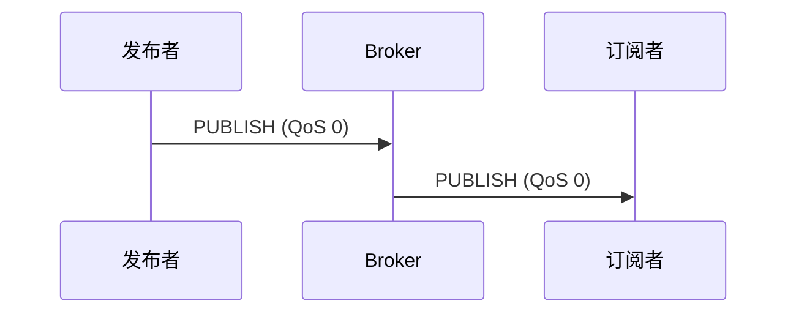

### 5.2 QoS 1 - 至少一次（At least once）

- **特点**：保证消息至少送达一次，可能重复
- **流程**：需要PUBACK确认
- **适用场景**：需要保证消息送达但不介意重复的场景

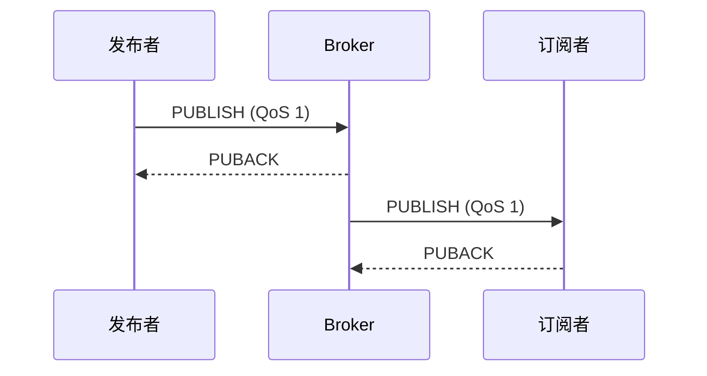

### 5.3 QoS 2 - 恰好一次（Exactly once）

- **特点**：保证消息恰好送达一次，不会重复
- **流程**：四步握手（PUBLISH → PUBREC → PUBREL → PUBCOMP）
- **适用场景**：需要严格保证消息唯一性的场景，如支付系统

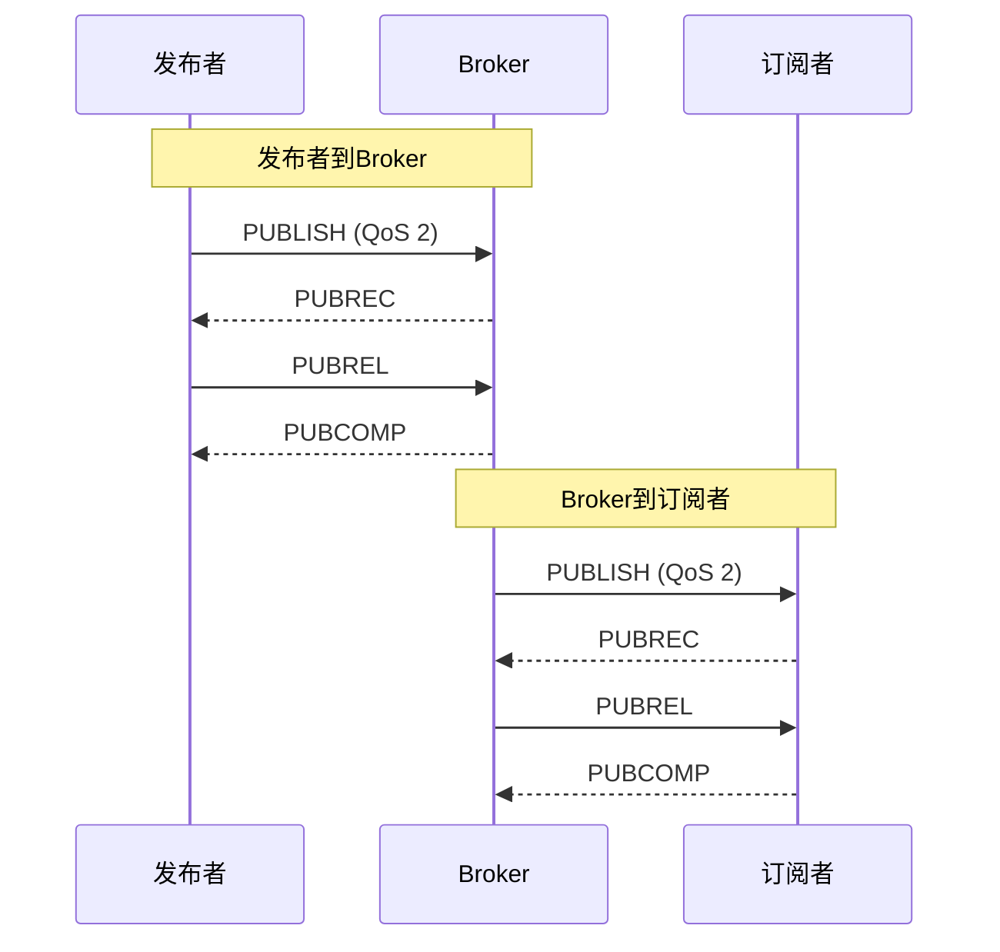

## 6. 主题（Topic）和主题筛选器（Topic Filter）

### 6.1 主题命名规则

主题是字符串，用于标识消息的内容：

- 区分大小写：`sensor/temperature` ≠ `Sensor/Temperature`
- 使用斜杠 `/` 作为层级分隔符
- 支持多级层级：`home/living-room/light/status`
- 不能包含空格和空字符

### 6.2 通配符

**单层通配符 `+`**：
- 匹配单个层级
- 示例：`home/+/temperature` 匹配 `home/living-room/temperature`，但不匹配 `home/living-room/kitchen/temperature`

**多层通配符 `#`**：
- 匹配多个层级（必须放在最后）
- 示例：`home/#` 匹配 `home/living-room/temperature` 和 `home/kitchen/light/status`

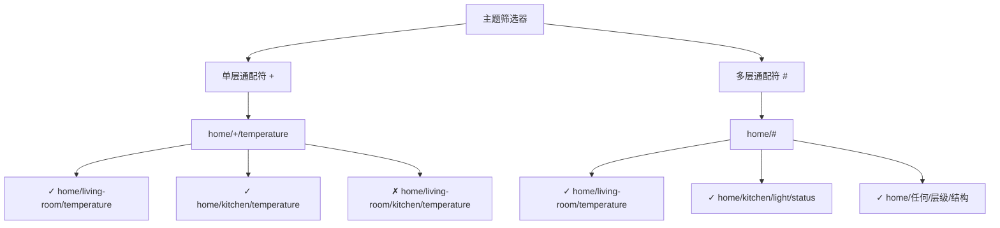

### 6.3 主题筛选器规则

- 订阅时可以使用通配符
- 发布时必须使用完整主题名
- `#` 可以匹配零个或多个层级
- `#` 后不能再有其他字符

## 7. 保留消息（Retained Messages）

### 7.1 概念

Broker可以保存每个主题的最后一条保留消息，当新客户端订阅该主题时，立即收到这条消息。

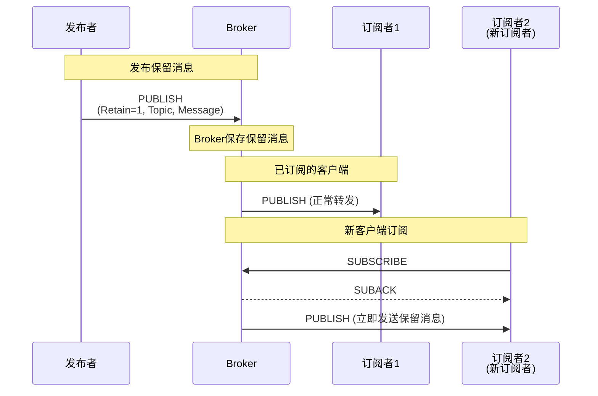

### 7.2 使用场景

- 设备状态：新连接时立即获取最新状态
- 配置信息：新订阅者获取最新配置
- 欢迎消息：向新订阅者发送欢迎信息

### 7.3 设置方法

发布消息时设置Retain标志为1：

```
PUBLISH
  Topic: "device/status"
  Retain: 1
  Payload: "online"
```

## 8. 遗嘱消息（Last Will and Testament, LWT）

### 8.1 概念

客户端在连接时设置遗嘱消息，当客户端异常断开（未发送DISCONNECT）时，Broker自动发布遗嘱消息。

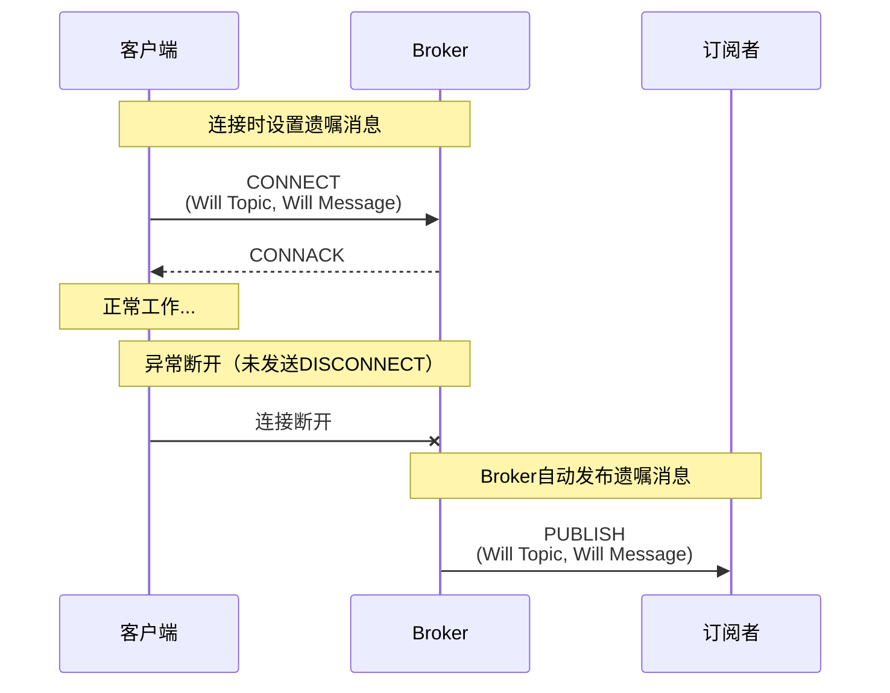

### 8.2 遗嘱消息参数

- **Will Topic**：遗嘱消息的主题
- **Will Message**：遗嘱消息的内容
- **Will QoS**：遗嘱消息的QoS等级
- **Will Retain**：遗嘱消息是否保留

### 8.3 使用场景

- 设备离线通知：设备异常断开时通知其他设备
- 状态监控：检测设备是否在线
- 告警系统：设备故障时触发告警

## 9. 会话（Session）

### 9.1 Clean Session

**Clean Session = 1（临时会话）**：
- 客户端断开后，Broker删除会话信息
- 不会保存未确认的消息
- 重新连接时，订阅信息丢失

**Clean Session = 0（持久会话）**：
- 客户端断开后，Broker保留会话信息
- 保存未确认的消息（QoS > 0）
- 保存订阅信息
- 重新连接时，恢复会话状态

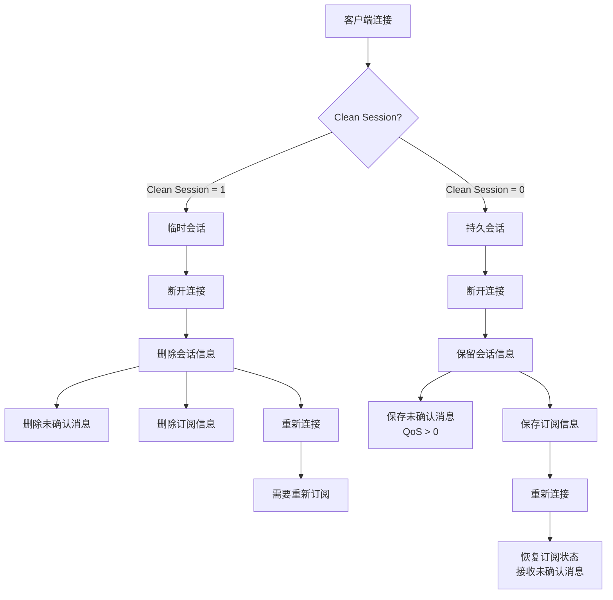

### 9.2 会话过期（MQTT 5.0）

MQTT 5.0引入了Session Expiry Interval，允许设置会话过期时间。

## 10. Keep Alive机制

### 10.1 工作原理

- 客户端在CONNECT消息中设置Keep Alive时间（秒）
- 如果在该时间内没有发送任何消息，客户端发送PINGREQ
- Broker响应PINGRESP
- 如果Broker在1.5倍Keep Alive时间内未收到任何消息，认为客户端断开

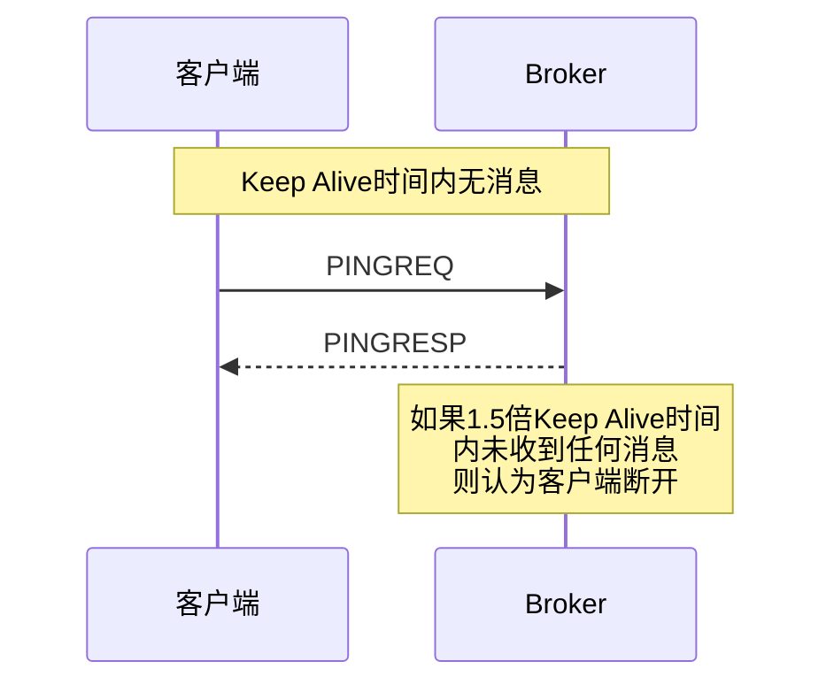

### 10.2 设置建议

- 网络稳定：可以设置较长的Keep Alive（如300秒）
- 网络不稳定：设置较短的Keep Alive（如60秒）
- 电池设备：设置较长的Keep Alive以减少心跳频率

## 11. MQTT连接流程

### 11.1 连接步骤

1. **建立TCP连接**：客户端连接到Broker的TCP端口（默认1883）
2. **发送CONNECT消息**：包含客户端ID、用户名、密码等
3. **接收CONNACK消息**：Broker返回连接结果
   - Return Code 0：连接成功
   - 其他值：连接失败（如拒绝的协议版本、客户端ID被占用等）

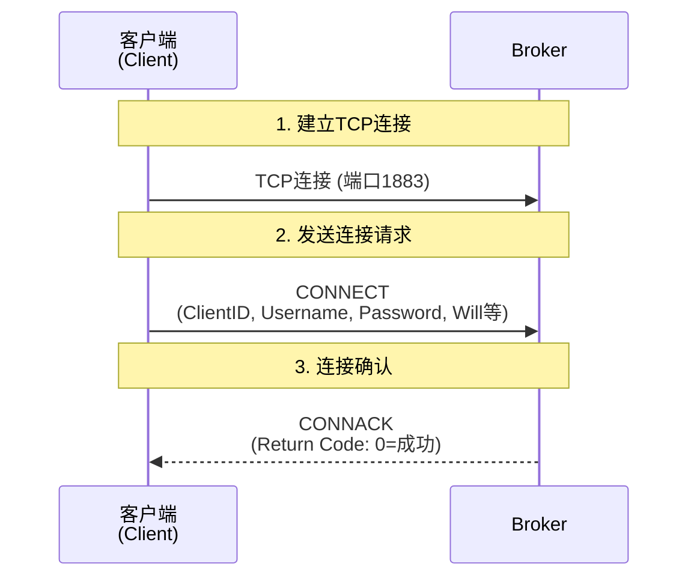

### 11.2 连接报文示例

**CONNECT消息**：
```
Fixed Header:
  Message Type: CONNECT (1)
  Flags: 0x00
  Remaining Length: 可变

Variable Header:
  Protocol Name: "MQTT"
  Protocol Level: 4 (3.1.1)
  Connect Flags: 0xCE
    Bit 7 (User Name Flag): 1
    Bit 6 (Password Flag): 1
    Bit 5 (Will Retain): 0
    Bit 4-3 (Will QoS): 01 (QoS 1)
    Bit 2 (Will Flag): 1
    Bit 1 (Clean Session): 1
    Bit 0 (Reserved): 0
  Keep Alive: 60 (秒)

Payload:
  Client Identifier: "client-001"
  Will Topic: "device/status"
  Will Message: "offline"
  User Name: "user"
  Password: "pass"
```

**CONNACK消息**：
```
Fixed Header:
  Message Type: CONNACK (2)
  Flags: 0x00
  Remaining Length: 2

Variable Header:
  Connect Acknowledge Flags: 0x00
  Return Code: 0x00 (连接已接受)
```

## 12. 订阅和取消订阅

### 12.1 订阅流程

1. **发送SUBSCRIBE消息**：
   - 包含主题筛选器列表
   - 每个主题对应一个QoS等级请求
   - 包含Packet Identifier

2. **接收SUBACK消息**：
   - 包含每个主题的订阅结果
   - 返回实际授予的QoS等级（可能低于请求的QoS）

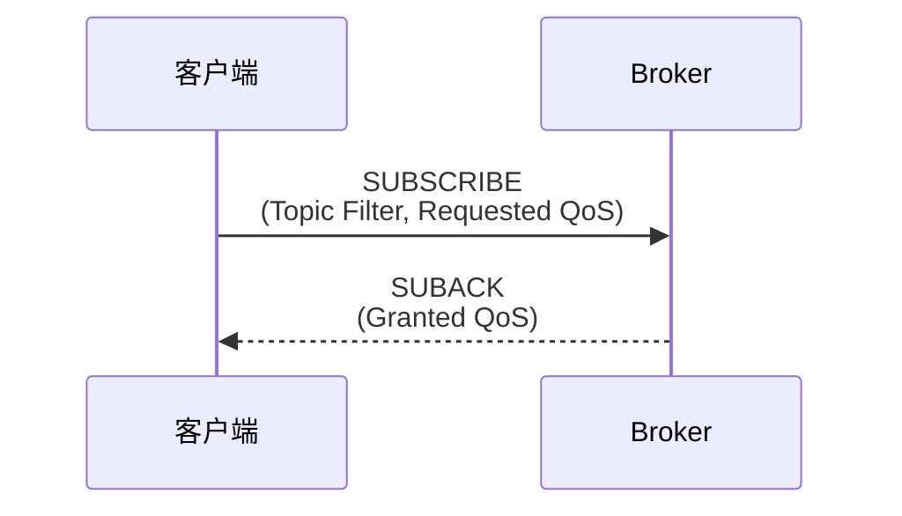

### 12.2 订阅示例

**SUBSCRIBE消息**：
```
Topic Filter: "sensor/+/temperature"
Requested QoS: 1
```

**SUBACK消息**：
```
Return Code: 0x01 (QoS 1 - 订阅成功)
```

### 12.3 取消订阅

发送UNSUBSCRIBE消息，Broker响应UNSUBACK确认。

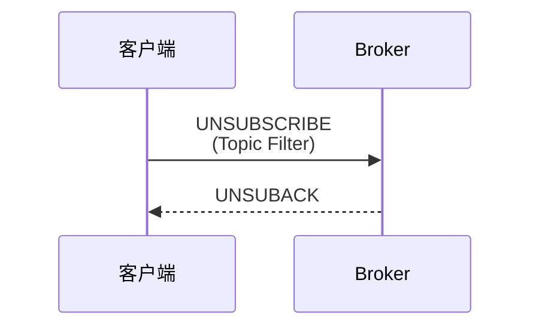

## 13. 消息发布流程

### 13.1 发布步骤

1. **构建PUBLISH消息**：
   - 设置主题名
   - 设置QoS等级
   - 设置Retain标志
   - 添加消息内容（Payload）

2. **发送到Broker**：
   - QoS 0：发送后无需等待
   - QoS 1：等待PUBACK确认
   - QoS 2：执行四步握手

3. **Broker转发**：
   - 根据订阅信息转发给订阅者
   - 如果设置了Retain，保存消息

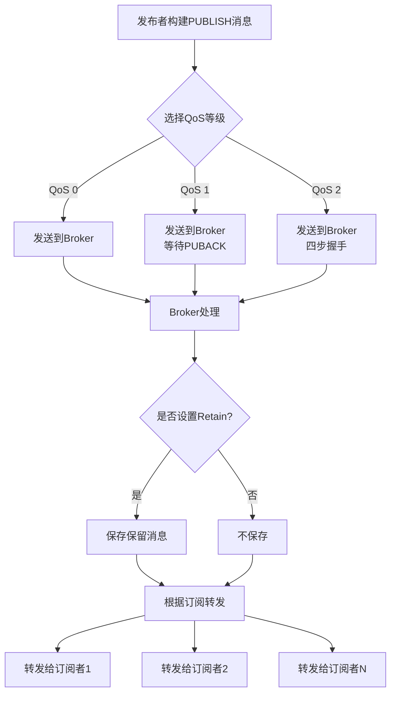

## 14. MQTT安全性

### 14.1 TLS/SSL加密

MQTT over TLS（端口8883）提供传输层加密：

- 加密所有通信内容
- 验证服务器身份
- 防止中间人攻击

### 14.2 认证机制

- **用户名和密码**：在CONNECT消息中传递
- **客户端证书**：使用TLS客户端证书认证
- **Token认证**：使用JWT等token机制（需要Broker支持）

### 14.3 访问控制

通过ACL（Access Control List）控制：
- 哪些客户端可以发布到特定主题
- 哪些客户端可以订阅特定主题

## 15. MQTT 5.0新特性

### 15.1 用户属性（User Properties）

允许在消息中添加自定义键值对，用于传递元数据。

### 15.2 原因码（Reason Codes）

所有响应消息都包含原因码，提供详细的错误信息。

### 15.3 消息过期（Message Expiry）

设置消息的过期时间，过期消息不会被发送。

### 15.4 共享订阅（Shared Subscriptions）

多个客户端可以共享同一个订阅，实现负载均衡。

格式：`$share/{ShareName}/{TopicFilter}`

示例：`$share/group1/sensor/temperature`

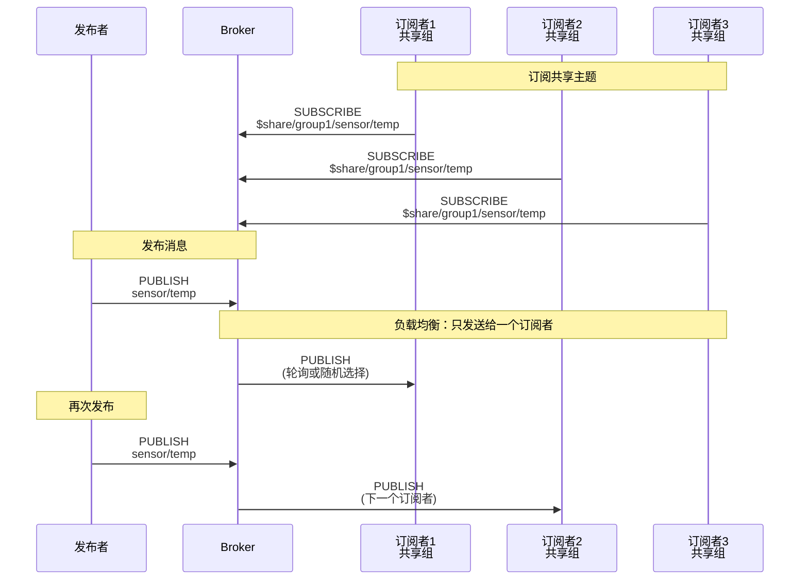

### 15.5 请求/响应模式

使用Response Topic和Correlation Data实现请求/响应模式。

## 16. 常见MQTT Broker

### 16.1 Eclipse Mosquitto

- 轻量级、开源
- 支持MQTT 3.1.1和5.0
- 适合学习和小型项目

### 16.2 EMQ X

- 高性能、可扩展
- 支持集群部署
- 丰富的企业级功能

### 16.3 HiveMQ

- 企业级MQTT Broker
- 高性能、高可用
- 商业支持

### 16.4 AWS IoT Core

- 云服务
- 与AWS生态系统集成
- 按使用量付费

## 17. MQTT客户端库

### 17.1 Python

- **paho-mqtt**：Eclipse官方Python客户端
- **asyncio-mqtt**：异步MQTT客户端

### 17.2 JavaScript/Node.js

- **mqtt.js**：功能完整的MQTT客户端
- **mqtt-packet**：MQTT协议解析库

### 17.3 Java

- **Eclipse Paho Java Client**：官方Java客户端
- **HiveMQ Client**：高性能Java客户端

### 17.4 C/C++

- **Eclipse Paho C Client**：官方C客户端
- **MQTT-C**：轻量级C客户端

## 18. 最佳实践

### 18.1 主题设计

- 使用层级结构：`{domain}/{location}/{device}/{type}`
- 避免过深的层级：最多3-5层
- 使用有意义的名称：避免缩写
- 不要使用特殊字符

### 18.2 QoS选择

- 传感器数据：QoS 0（允许丢失）
- 设备控制：QoS 1（必须送达）
- 关键操作：QoS 2（不能重复）

### 18.3 客户端ID设计

- 使用唯一标识符
- 包含设备信息：`device-{mac-address}`
- 避免使用随机ID（可能导致会话问题）

### 18.4 Keep Alive设置

- 根据网络环境调整
- 考虑电池消耗
- 测试不同的值找到平衡点

### 18.5 错误处理

- 实现重连机制
- 处理网络中断
- 记录错误日志
- 实现指数退避重连策略

## 19. 性能优化

### 19.1 消息大小

- 保持消息尽可能小
- 使用二进制格式而非JSON（如果可能）
- 压缩大型消息

### 19.2 批量操作

- 批量发布消息
- 使用批量订阅（如果Broker支持）

### 19.3 连接池

- 复用连接而不是频繁创建
- 使用连接池管理连接

## 20. 故障排查

### 20.1 常见问题

**连接失败**：
- 检查网络连接
- 验证用户名密码
- 检查防火墙设置
- 确认Broker地址和端口

**消息丢失**：
- 检查QoS设置
- 验证订阅是否正确
- 检查主题名匹配

**性能问题**：
- 检查消息大小
- 优化主题设计
- 调整Keep Alive
- 检查Broker配置

### 20.2 调试工具

- **MQTT.fx**：图形化MQTT客户端
- **mosquitto_sub/mosquitto_pub**：命令行工具
- **Wireshark**：网络抓包分析

## 21. 总结

MQTT协议作为物联网领域的事实标准，具有以下优势：

1. **轻量级**：适合资源受限的设备
2. **可靠性**：通过QoS保证消息传递
3. **灵活性**：支持多种应用场景
4. **可扩展性**：支持大规模部署
5. **标准化**：OASIS标准，生态完善

随着物联网的快速发展，MQTT协议将继续发挥重要作用，特别是在5G、边缘计算等新技术场景中。

## 参考资源

- [MQTT 3.1.1 规范](http://docs.oasis-open.org/mqtt/mqtt/v3.1.1/mqtt-v3.1.1.html)
- [MQTT 5.0 规范](https://docs.oasis-open.org/mqtt/mqtt/v5.0/mqtt-v5.0.html)
- [Eclipse Mosquitto](https://mosquitto.org/)
- [MQTT.org](https://mqtt.org/)
