# QUIC 协议概述

QUIC（Quick UDP Internet Connections）是一种基于 UDP 的传输层协议，由 Google 开发，后来被 IETF 标准化。QUIC 旨在提供比 TCP 更快的连接建立、更好的多路复用和更强的连接迁移能力。

## QUIC 的基本概念

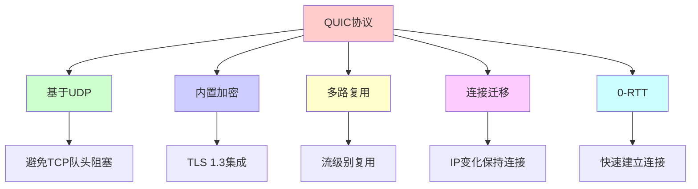

## QUIC 的设计目标

### 1. 低延迟

- **快速连接建立**：0-RTT 或 1-RTT 连接建立
- **减少往返次数**：合并握手和数据传输
- **避免队头阻塞**：流级别的多路复用

### 2. 高可靠性

- **可靠传输**：类似 TCP 的可靠性保证
- **拥塞控制**：改进的拥塞控制算法
- **错误恢复**：快速重传和恢复机制

### 3. 安全性

- **内置加密**：TLS 1.3 集成
- **身份验证**：连接级别的身份验证
- **前向安全**：前向安全保证

### 4. 连接迁移

- **IP 变化**：IP 地址变化时保持连接
- **网络切换**：移动网络切换时不断线
- **连接标识**：使用连接 ID 而非 IP+端口

## QUIC 在协议栈中的位置

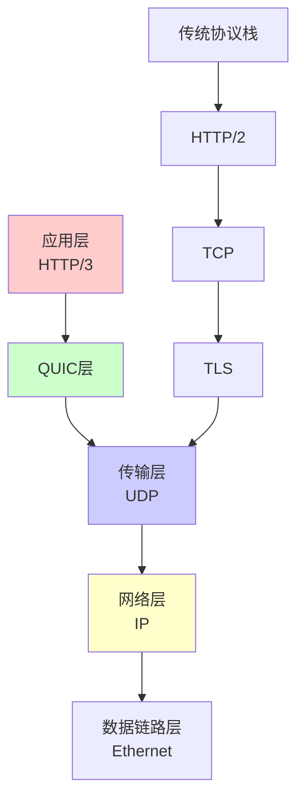

## QUIC vs TCP

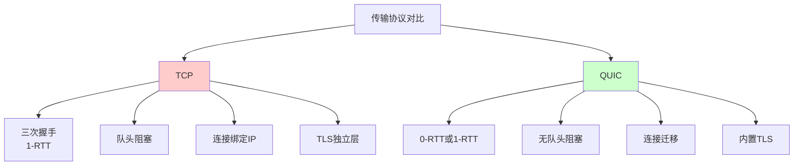

| 特性 | TCP | QUIC |
|------|-----|------|
| **传输协议** | TCP | UDP |
| **连接建立** | 3 次握手（1-RTT） | 0-RTT 或 1-RTT |
| **加密** | TLS 独立层 | TLS 1.3 内置 |
| **多路复用** | 无 | 流级别多路复用 |
| **队头阻塞** | 有 | 无 |
| **连接迁移** | 不支持 | 支持 |
| **拥塞控制** | 传统算法 | 改进算法 |

# QUIC 核心特性

## 1. 基于 UDP

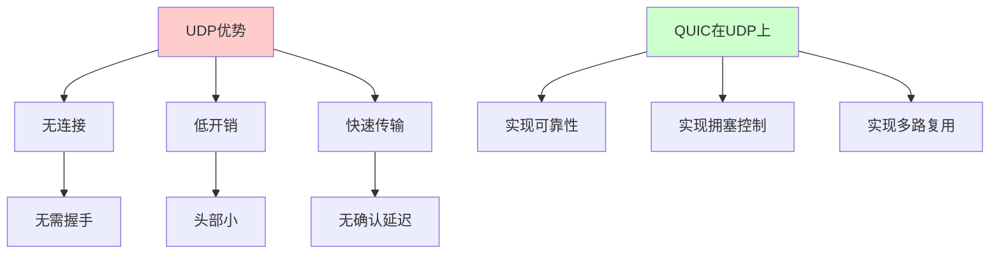

**为什么选择 UDP**：
- UDP 无连接，更灵活
- 避免 TCP 的队头阻塞问题
- 可以在用户空间实现，便于优化
- 绕过中间设备对 TCP 的干扰

## 2. 内置 TLS 1.3

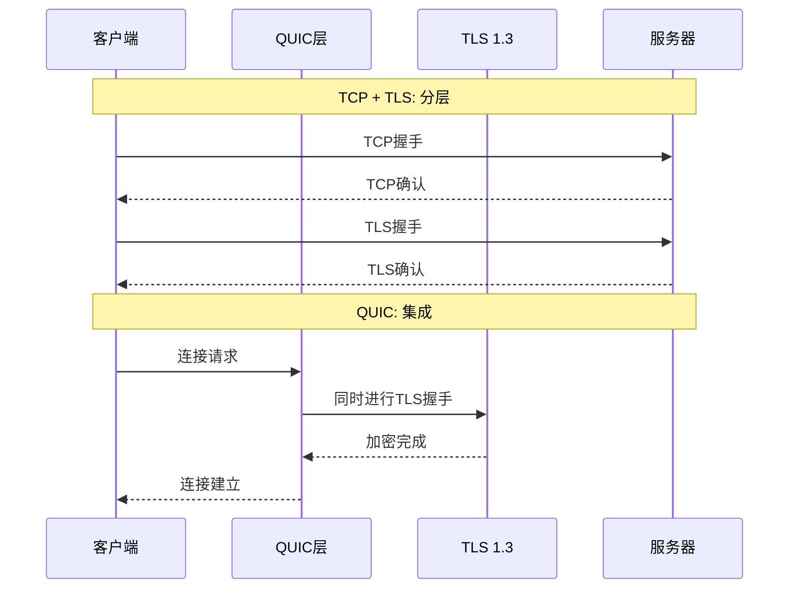

**优势**：
- TLS 握手和 QUIC 连接建立合并
- 减少往返次数
- 更快的连接建立

## 3. 多路复用

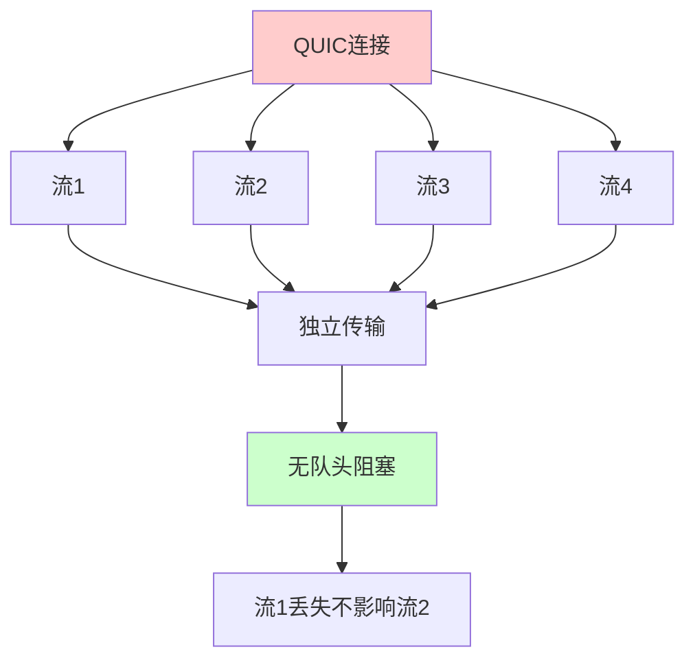

**特点**：
- 流级别的多路复用
- 每个流独立传输
- 一个流的丢包不影响其他流
- 完全解决队头阻塞问题

## 4. 连接迁移

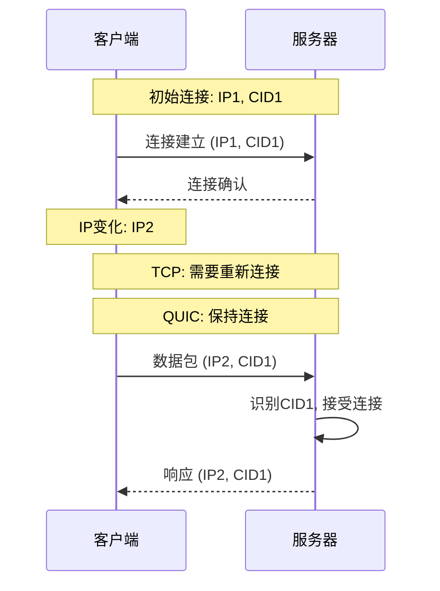

**优势**：
- 使用连接 ID（Connection ID）而非 IP+端口
- IP 地址变化时保持连接
- 移动网络切换时不断线
- 提高连接稳定性

## 5. 0-RTT 连接建立

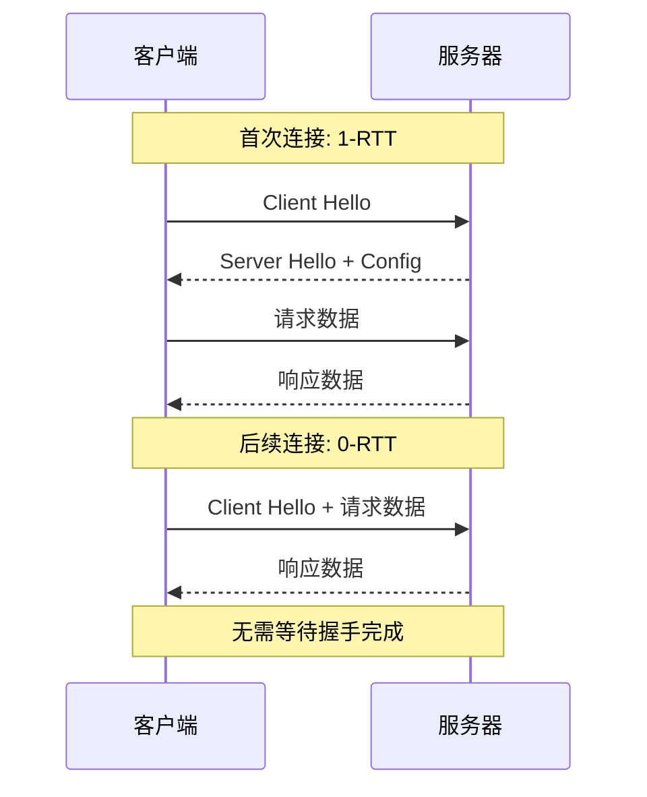

**优势**：
- 首次连接：1-RTT（一次往返）
- 后续连接：0-RTT（零往返）
- 显著减少延迟
- 提高用户体验

# QUIC 连接建立

## 连接建立流程

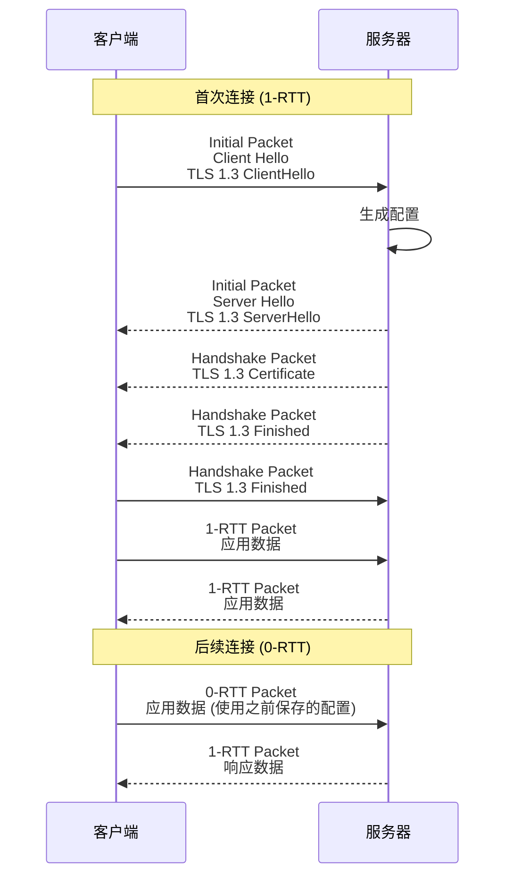

## 连接 ID（Connection ID）

```mermaid
graph TB
    A[连接标识] --> B[TCP方式]
    A --> C[QUIC方式]
    
    B --> B1[IP地址 + 端口]
    B1 --> B2[IP变化需重连]
    
    C --> C1[连接ID (CID)]
    C1 --> C2[IP变化保持连接]
    
    style B fill:#ffcccc
    style C fill:#ccffcc
```

**连接 ID 特点**：
- 每个连接有唯一的连接 ID
- 连接 ID 不依赖 IP 地址和端口
- 支持连接迁移
- 支持多路径传输

## 数据包类型

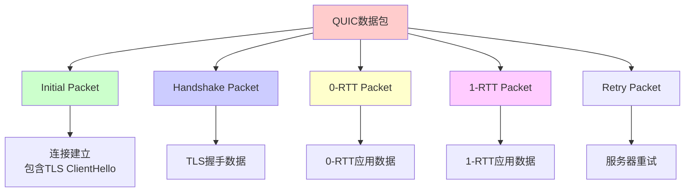

### 1. Initial Packet

- **用途**：首次连接建立
- **内容**：TLS 1.3 ClientHello
- **加密**：使用初始密钥加密

### 2. Handshake Packet

- **用途**：TLS 握手数据
- **内容**：TLS 握手消息
- **加密**：使用握手密钥加密

### 3. 0-RTT Packet

- **用途**：0-RTT 连接的应用数据
- **内容**：应用层数据
- **加密**：使用早期数据密钥加密
- **限制**：只能发送之前连接过的数据

### 4. 1-RTT Packet

- **用途**：正常连接的应用数据
- **内容**：应用层数据
- **加密**：使用应用数据密钥加密

### 5. Retry Packet

- **用途**：服务器要求客户端重试
- **内容**：新的连接 ID 和令牌
- **目的**：防止放大攻击

# QUIC 流和多路复用

## 流的概念

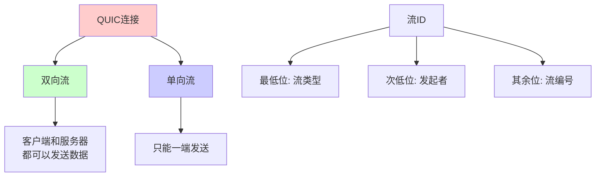

**流的特点**：
- 每个流有唯一的流 ID
- 流 ID 的奇偶性表示流类型
- 流可以独立传输
- 流之间互不影响

## 流的多路复用

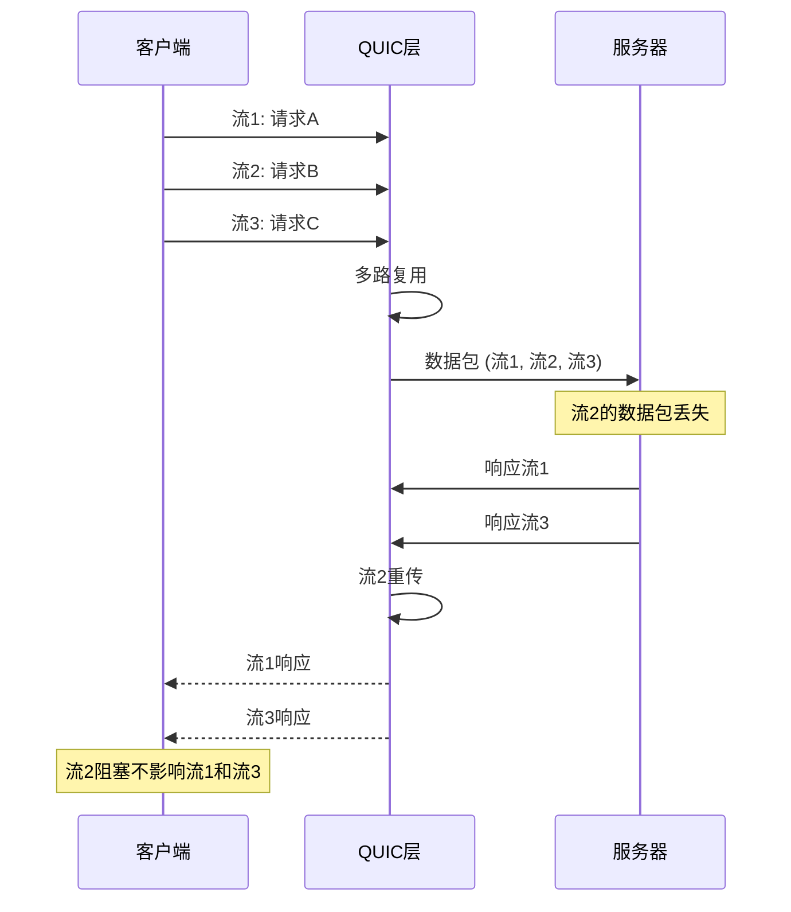

**优势**：
- 流级别的多路复用
- 一个流的丢包不影响其他流
- 完全解决队头阻塞问题
- 提高传输效率

## 流控制

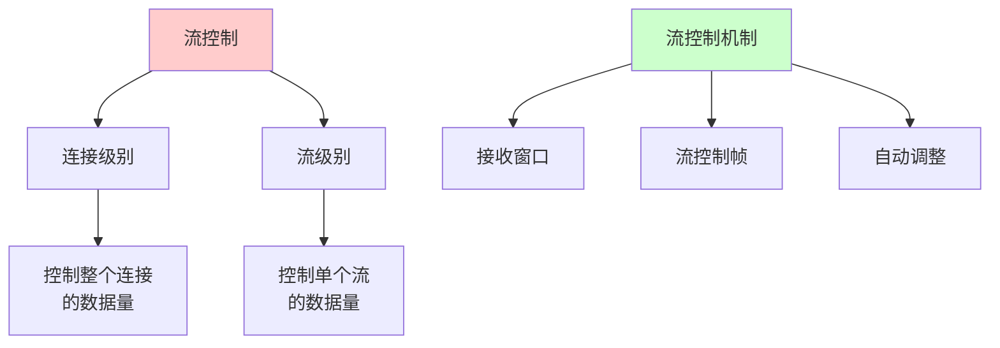

**流控制特点**：
- 连接级别和流级别的流控制
- 使用接收窗口限制数据量
- 通过流控制帧调整窗口大小
- 防止接收方缓冲区溢出

# QUIC 可靠性

## 可靠传输机制

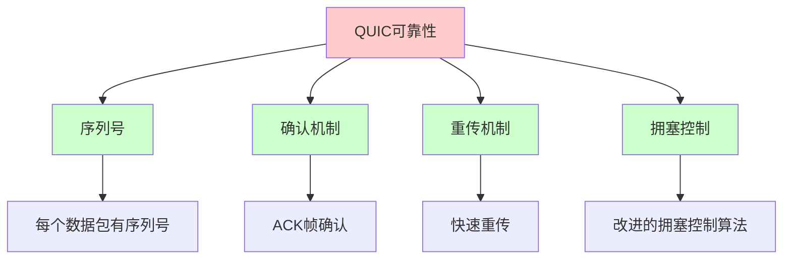

## 序列号和确认

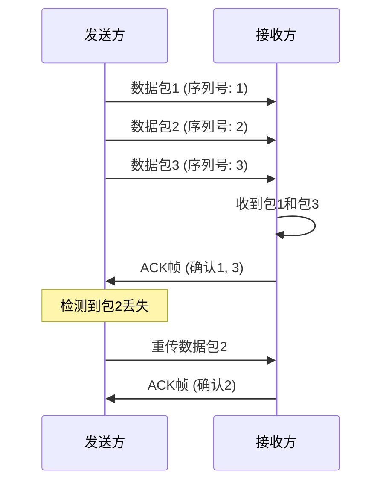

**特点**：
- 每个数据包有唯一的序列号
- 使用 ACK 帧确认接收
- 支持选择性确认
- 支持确认延迟

## 重传机制

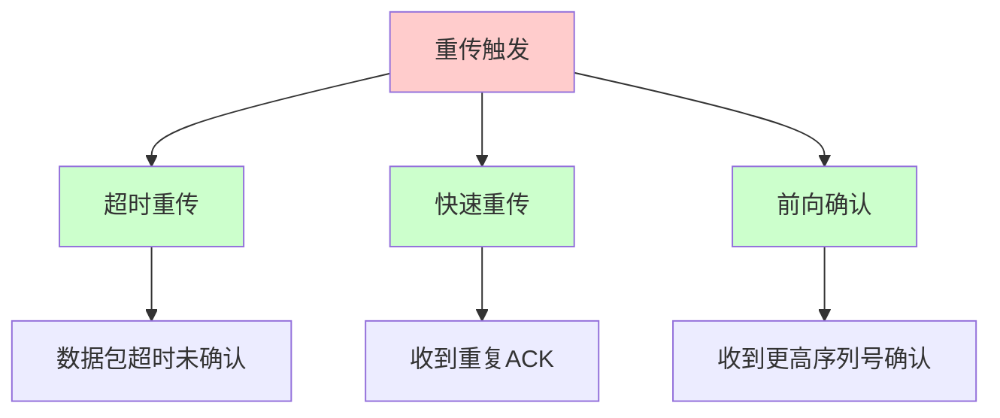

**重传特点**：
- **超时重传**：数据包超时未确认时重传
- **快速重传**：收到重复 ACK 时立即重传
- **前向确认**：收到更高序列号确认时重传
- **重传标记**：重传的数据包有特殊标记

# QUIC 拥塞控制

## 拥塞控制算法

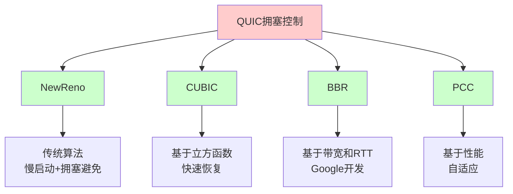

## 拥塞控制参数

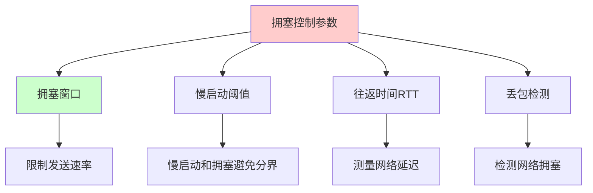

## BBR 算法

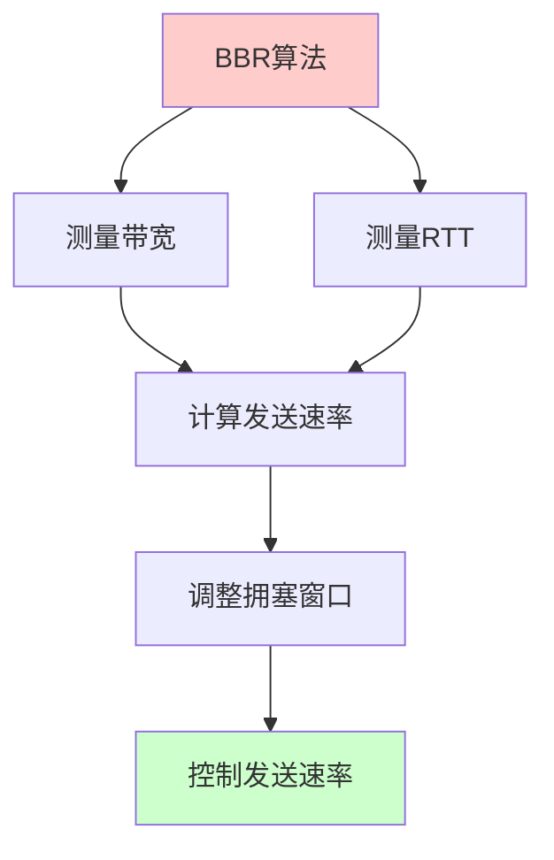

**BBR 特点**：
- 基于带宽和 RTT 测量
- 不依赖丢包检测
- 更好的网络利用率
- 更低的延迟

# QUIC 数据包格式

## 数据包结构

```mermaid
graph TB
    A[QUIC数据包] --> B[公共头部]
    A --> C[数据包负载]
    
    B --> B1[连接ID]
    B --> B2[数据包号]
    B --> B3[数据包类型]
    
    C --> C4[帧1]
    C --> C5[帧2]
    C --> C6[帧N]
    
    style A fill:#ffcccc
    style B fill:#ccffcc
    style C fill:#ccccff
```

## 公共头部字段

```text
0                   1                   2                   3
0 1 2 3 4 5 6 7 8 9 0 1 2 3 4 5 6 7 8 9 0 1 2 3 4 5 6 7 8 9 0 1
+-+-+-+-+-+-+-+-+-+-+-+-+-+-+-+-+-+-+-+-+-+-+-+-+-+-+-+-+-+-+-+-+
|                        连接 ID (0-160 bits)                      |
+-+-+-+-+-+-+-+-+-+-+-+-+-+-+-+-+-+-+-+-+-+-+-+-+-+-+-+-+-+-+-+-+
|                        数据包号 (8/16/24/32 bits)                |
+-+-+-+-+-+-+-+-+-+-+-+-+-+-+-+-+-+-+-+-+-+-+-+-+-+-+-+-+-+-+-+-+
|  类型  |  标志  |
+-+-+-+-+-+-+-+-+
```

### 字段说明

| 字段 | 长度 | 说明 |
|------|------|------|
| **连接 ID** | 0-160 位 | 连接标识符 |
| **数据包号** | 8/16/24/32 位 | 数据包序列号 |
| **类型** | 4 位 | 数据包类型 |
| **标志** | 4 位 | 各种标志位 |

## 帧类型

```mermaid
graph TB
    A[QUIC帧] --> B[STREAM帧]
    A --> C[ACK帧]
    A --> D[CONNECTION_CLOSE帧]
    A --> E[RESET_STREAM帧]
    A --> F[PING帧]
    A --> G[BLOCKED帧]
    
    B --> B1[流数据]
    C --> C2[确认数据包]
    D --> D3[关闭连接]
    E --> E4[重置流]
    F --> F5[保活]
    G --> G6[流控制阻塞]
    
    style A fill:#ffcccc
    style B fill:#ccffcc
    style C fill:#ccffcc
```

### 1. STREAM 帧

- **用途**：传输流数据
- **字段**：流 ID、偏移量、长度、数据
- **特点**：支持分片传输

### 2. ACK 帧

- **用途**：确认数据包接收
- **字段**：确认的数据包范围
- **特点**：支持选择性确认

### 3. CONNECTION_CLOSE 帧

- **用途**：关闭连接
- **字段**：错误码、原因
- **特点**：优雅关闭

### 4. RESET_STREAM 帧

- **用途**：重置流
- **字段**：流 ID、错误码、最终大小
- **特点**：立即终止流

# QUIC 应用场景

## 1. HTTP/3

```mermaid
graph TB
    A[HTTP/3] --> B[基于QUIC]
    B --> C[流级别多路复用]
    B --> D[0-RTT连接]
    B --> E[连接迁移]
    
    style A fill:#ffcccc
    style B fill:#ccffcc
```

**优势**：
- 更快的连接建立
- 无队头阻塞
- 更好的移动网络体验

## 2. 视频流传输

```mermaid
graph TB
    A[视频流] --> B[QUIC传输]
    B --> C[多路复用]
    B --> D[快速恢复]
    B --> E[连接迁移]
    
    C --> F[音视频分离传输]
    D --> G[丢包快速恢复]
    E --> H[网络切换不断线]
    
    style A fill:#ffcccc
    style F fill:#ccffcc
    style G fill:#ccffcc
    style H fill:#ccffcc
```

**优势**：
- 低延迟
- 快速恢复
- 移动网络友好

## 3. 游戏应用

```mermaid
graph TB
    A[游戏应用] --> B[QUIC传输]
    B --> C[低延迟]
    B --> D[可靠性]
    B --> E[多路复用]
    
    C --> F[快速响应]
    D --> G[数据不丢失]
    E --> H[多通道传输]
    
    style A fill:#ffcccc
    style F fill:#ccffcc
    style G fill:#ccffcc
    style H fill:#ccffcc
```

**优势**：
- 低延迟
- 可靠传输
- 多路复用

## 4. 移动应用

```mermaid
sequenceDiagram
    participant App as 移动应用
    participant QUIC as QUIC连接
    participant Server as 服务器
    
    Note over App: WiFi网络
    App->>QUIC: 连接建立
    QUIC->>Server: 数据传输
    
    Note over App: 切换到4G网络
    Note over QUIC: 连接迁移
    App->>QUIC: 数据包 (新IP, 相同CID)
    QUIC->>Server: 继续传输
    Server-->>QUIC: 响应
    QUIC-->>App: 数据
    
    Note over App,Server: 连接保持，无需重连
```

**优势**：
- 网络切换不断线
- 连接迁移
- 更好的用户体验

# QUIC 实现和部署

## 主要实现

```mermaid
graph TB
    A[QUIC实现] --> B[Google QUIC]
    A --> C[IETF QUIC]
    A --> D[Cloudflare quiche]
    A --> E[Facebook mvfst]
    A --> F[Microsoft MsQuic]
    
    B --> B1[Google Chrome]
    C --> C2[标准化版本]
    D --> D3[Rust实现]
    E --> E4[C++实现]
    F --> F5[Windows支持]
    
    style A fill:#ffcccc
    style B fill:#ccffcc
    style C fill:#ccffcc
```

## 浏览器支持

| 浏览器 | QUIC 支持 | 说明 |
|--------|----------|------|
| **Chrome** | 是 | 默认启用 |
| **Firefox** | 是 | 默认启用 |
| **Safari** | 是 | iOS 14+ / macOS 11+ |
| **Edge** | 是 | 基于 Chromium |

## 服务器支持

| 服务器 | QUIC 支持 | 说明 |
|--------|----------|------|
| **Nginx** | 是 | 需要编译支持 |
| **Caddy** | 是 | 默认支持 |
| **Cloudflare** | 是 | 自动支持 |
| **Google Cloud** | 是 | 负载均衡器支持 |

## 部署示例

### Nginx 配置

```nginx
server {
    listen 443 quic reuseport;
    listen 443 ssl;
    
    ssl_certificate /path/to/cert.pem;
    ssl_certificate_key /path/to/key.pem;
    
    add_header Alt-Svc 'h3=":443"; ma=86400';
    
    location / {
        root /var/www/html;
    }
}
```

### Caddy 配置

```caddy
example.com {
    root * /var/www/html
    file_server
}
```

Caddy 自动支持 HTTP/3 和 QUIC。

# QUIC 优势和挑战

## QUIC 优势

```mermaid
graph TB
    A[QUIC优势] --> B[性能优势]
    A --> C[功能优势]
    A --> D[安全优势]
    
    B --> B1[低延迟<br/>0-RTT连接]
    B --> B2[高吞吐<br/>无队头阻塞]
    B --> B3[快速恢复<br/>改进拥塞控制]
    
    C --> C4[连接迁移<br/>IP变化保持连接]
    C --> C5[多路复用<br/>流级别]
    
    D --> D6[内置加密<br/>TLS 1.3]
    D --> D7[前向安全]
    
    style A fill:#ffcccc
    style B fill:#ccffcc
    style C fill:#ccffcc
    style D fill:#ccffcc
```

## QUIC 挑战

```mermaid
graph TB
    A[QUIC挑战] --> B[中间设备]
    A --> C[防火墙]
    A --> D[部署复杂度]
    A --> E[兼容性]
    
    B --> B1[可能被阻止]
    C --> C2[UDP可能被限制]
    D --> D3[需要更新服务器]
    E --> E4[旧设备不支持]
    
    style A fill:#ffcccc
    style B fill:#ffcccc
    style C fill:#ffcccc
```

### 1. 中间设备干扰

- **问题**：某些中间设备可能阻止或干扰 UDP
- **解决**：使用 TCP 回退机制

### 2. 防火墙限制

- **问题**：防火墙可能限制 UDP 流量
- **解决**：配置防火墙规则

### 3. 部署复杂度

- **问题**：需要更新服务器和客户端
- **解决**：逐步迁移，提供回退方案

### 4. 兼容性

- **问题**：旧设备和网络不支持
- **解决**：提供 HTTP/2 或 HTTP/1.1 回退

# QUIC 最佳实践

## 1. 启用 QUIC/HTTP/3

```mermaid
flowchart TD
    A[启用QUIC] --> B{服务器支持?}
    B -->|是| C[配置QUIC]
    B -->|否| D[使用HTTP/2]
    
    C --> E[配置TLS 1.3]
    E --> F[配置Alt-Svc头部]
    F --> G[测试连接]
    
    style A fill:#ffcccc
    style C fill:#ccffcc
    style G fill:#ccffcc
```

**建议**：
- 使用支持 QUIC 的服务器
- 配置 TLS 1.3
- 添加 Alt-Svc 头部
- 提供 HTTP/2 回退

## 2. 监控和调试

```mermaid
graph TB
    A[监控指标] --> B[连接建立时间]
    A --> C[数据传输速率]
    A --> D[丢包率]
    A --> E[RTT]
    
    B --> F[0-RTT vs 1-RTT]
    C --> G[吞吐量]
    D --> H[网络质量]
    E --> I[延迟]
    
    style A fill:#ffcccc
    style F fill:#ccffcc
    style G fill:#ccffcc
```

**建议**：
- 监控连接建立时间
- 监控数据传输性能
- 监控错误率
- 使用 QUIC 调试工具

## 3. 安全配置

```mermaid
graph TB
    A[安全配置] --> B[TLS 1.3]
    A --> C[证书管理]
    A --> D[连接限制]
    
    B --> B1[强制TLS 1.3]
    C --> C2[有效证书]
    D --> D3[防止滥用]
    
    style A fill:#ffcccc
    style B fill:#ccffcc
    style C fill:#ccffcc
    style D fill:#ccffcc
```

**建议**：
- 使用 TLS 1.3
- 配置有效的 SSL 证书
- 限制连接数和速率
- 防止放大攻击

# QUIC vs TCP 详细对比

## 性能对比

| 指标 | TCP | QUIC |
|------|-----|------|
| **连接建立** | 1-RTT | 0-RTT 或 1-RTT |
| **队头阻塞** | 有 | 无 |
| **多路复用** | 无 | 流级别 |
| **连接迁移** | 不支持 | 支持 |
| **加密** | TLS 独立 | TLS 1.3 内置 |
| **拥塞控制** | 传统算法 | 改进算法 |

## 适用场景

```mermaid
flowchart TD
    A[选择传输协议] --> B{需要低延迟?}
    B -->|是| C{需要连接迁移?}
    B -->|否| D[TCP足够]
    
    C -->|是| E[QUIC]
    C -->|否| F{需要多路复用?}
    
    F -->|是| G[QUIC或HTTP/2]
    F -->|否| H[TCP]
    
    style A fill:#ffcccc
    style E fill:#ccffcc
    style G fill:#ccffcc
```

**QUIC 适用场景**：
- 需要低延迟的应用
- 移动网络应用
- 需要连接迁移的场景
- HTTP/3 应用

**TCP 适用场景**：
- 传统应用
- 不需要低延迟的场景
- 网络环境不支持 UDP

# 总结

QUIC 是一种创新的传输协议，具有以下特点：

## 核心优势

- **低延迟**：0-RTT 连接建立
- **高可靠性**：类似 TCP 的可靠性保证
- **无队头阻塞**：流级别多路复用
- **连接迁移**：IP 变化保持连接
- **内置加密**：TLS 1.3 集成

## 关键特性

1. **基于 UDP**：避免 TCP 的队头阻塞
2. **内置 TLS 1.3**：安全和性能结合
3. **多路复用**：流级别多路复用
4. **连接迁移**：使用连接 ID 而非 IP+端口
5. **0-RTT**：快速连接建立

## 应用场景

- HTTP/3
- 视频流传输
- 游戏应用
- 移动应用

理解 QUIC 协议有助于：
- 优化网络性能
- 理解 HTTP/3 基础
- 设计低延迟应用
- 解决移动网络问题

# 参考文献

- [RFC 9000 - QUIC: A UDP-Based Multiplexed and Secure Transport](https://tools.ietf.org/html/rfc9000)
- [RFC 9001 - Using TLS to Secure QUIC](https://tools.ietf.org/html/rfc9001)
- [RFC 9002 - QUIC Loss Detection and Congestion Control](https://tools.ietf.org/html/rfc9002)
- [QUIC Website](https://quicwg.org/)
