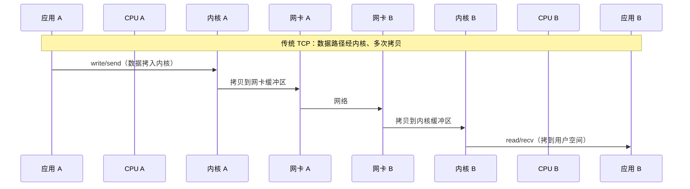
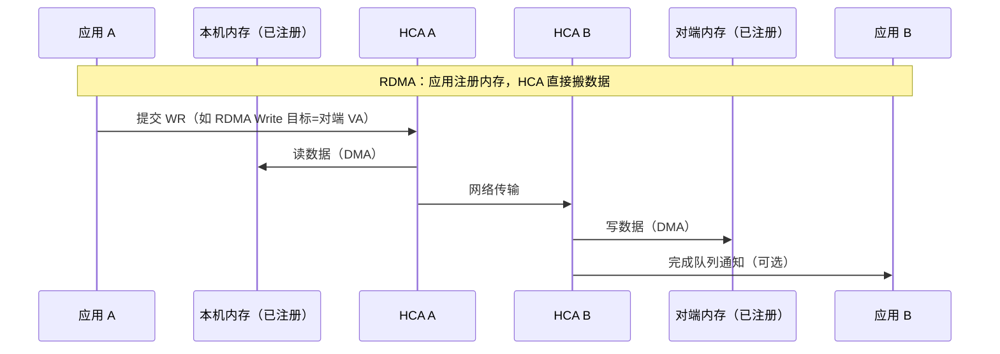
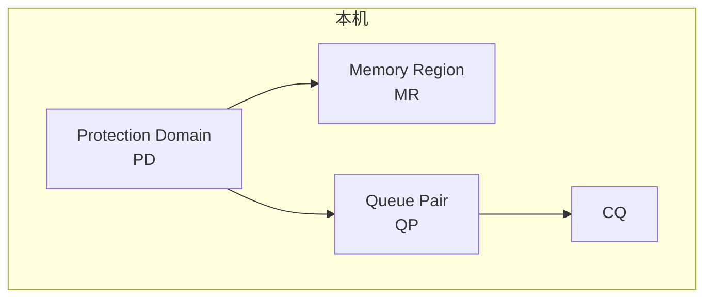

# 概述

**RDMA（Remote Direct Memory Access，远程直接内存访问）** 是一种网络技术，允许一台主机**直接访问另一台主机的内存**，而**无需本机或对端 CPU、操作系统内核参与数据搬运**，从而实现高带宽、低延迟、低 CPU 占用的网络通信。

传统 TCP/IP 栈下，数据要经过：网卡 → 内核缓冲区 → 用户缓冲区（或反过来），多次拷贝和上下文切换。RDMA 下，应用先注册内存、提交“读/写远程内存”的请求到网卡，由**网卡（HCA）** 直接在本机内存与对端内存之间搬数据，实现**内核旁路（Kernel Bypass）** 和 **零拷贝（Zero-Copy）**。

# 与传统网络（TCP）的对比

| 特性         | 传统 TCP/IP        | RDMA                    |
|--------------|--------------------|-------------------------|
| 数据路径     | 经内核、多次拷贝   | 应用 ↔ 网卡，零拷贝     |
| CPU 参与     | 每包参与协议处理   | 仅提交请求与收完成      |
| 延迟         | 较高（内核、拷贝） | 极低（微秒级）          |
| 带宽与 CPU   | 高带宽时 CPU 高    | 高带宽时 CPU 仍较低     |
| 编程模型     | socket API          | Verbs（QP、WR、CQ 等）  |

# 核心概念

## 协议栈与硬件

- **HCA（Host Channel Adapter）**：主机通道适配器，即支持 RDMA 的网卡，负责执行 RDMA 操作（DMA 读本机内存、与对端 HCA 通信、DMA 写对端内存等）。
- **Verbs**：RDMA 的“操作”抽象，如 Post Send、Post Receive、RDMA Read/Write 等，由应用通过 **Verbs API**（如 libibverbs）提交给 HCA。

## 主要抽象

- **PD（Protection Domain）**：保护域，用于关联 MR、QP 等资源，保证只有同一 PD 内的 QP 才能访问该 PD 下的 MR。
- **MR（Memory Region）**：应用向 HCA 注册的一段**连续虚拟地址范围**，只有注册过的内存才能被 RDMA 读/写；注册后得到 **lkey（本地 key）**、**rkey（远程 key）**，对端用 rkey + 虚拟地址访问。
- **QP（Queue Pair）**：队列对，由**发送队列 SQ** 和**接收队列 RQ** 组成。应用把“要做什么”封装成 **WR（Work Request）** 放到 SQ 或 RQ，HCA 异步执行；执行完后在 **CQ（Completion Queue）** 里产生 **CQE（Completion Queue Entry）**，应用轮询或等待 CQ 得到完成通知。
- **CQ（Completion Queue）**：完成队列，用于报告 WR 的完成状态；可与多个 QP 关联。

## 基本流程（单次 RDMA Write）

1. 两端各自 **分配并注册内存**（创建 MR），交换 **虚拟地址 + rkey**（以及 QP 信息）。
2. 发送方 **Post Send**：构造“RDMA Write”类型的 WR，指定本地缓冲区（本机 MR）、远程虚拟地址 + rkey、长度等，提交到 QP 的 SQ。
3. HCA 执行：从本机 MR DMA 读数据，通过网络发到对端 HCA，对端 HCA 根据 rkey 和地址 DMA 写到对端 MR。
4. 发送方（及可选的对端）在 CQ 中收到完成事件，表示本次 WR 已完成。

# 三种 RDMA 网络

| 类型 | 全称 | 物理/链路 | 典型场景 |
|------|------|-----------|----------|
| **IB** | InfiniBand | 专用 IB 网卡与交换机 | HPC、超算、存储后端 |
| **RoCE** | RDMA over Converged Ethernet | 以太网（可带 PFC/ECN 等保证无丢包） | 数据中心、云、存储 |
| **iWARP** | Internet Wide-Area RDMA Protocol | TCP  over 以太网 | 需要跨 IP 网络、与现有 TCP 兼容 |

- **InfiniBand**：原生 RDMA 网络，延迟最低，需专用硬件。
- **RoCE**：在以太网上跑 RDMA，依赖无损或低丢包（如 DCQCN、PFC），常用于数据中心。
- **iWARP**：基于 TCP，可跑在标准以太网上，延迟通常高于 RoCE/IB，但部署简单。

# 编程模型简述（Verbs）

1. **打开设备、分配 PD**：`ibv_open_device`、`ibv_alloc_pd`。
2. **注册内存**：`ibv_reg_mr(pd, addr, length, ...)`，得到 `lkey`、`rkey`。
3. **创建 CQ、QP**：`ibv_create_cq`、`ibv_create_qp`，QP 需关联 CQ。
4. **连接 QP**：通过 out-of-band 方式（如 TCP）交换 QP 号、GID、rkey、地址等，然后双方 `ibv_modify_qp` 将 QP 转为 RTR、RTS 等状态。
5. **收发**：Post Send / Post Receive（填充 WR），然后 `ibv_poll_cq` 或阻塞等待完成。
6. **RDMA 操作**：在 Send WR 中指定操作类型为 RDMA Write / RDMA Read，并填好远程 VA + rkey、本地 MR 等。

应用通常使用 **libibverbs**（底层）或 **librdmacm**（连接管理），或更高层的框架（如 MPI、DPDK 的某些方案）。

# 典型应用场景

- **高性能计算（HPC）**：集群间低延迟通信，MPI over RDMA。
- **分布式存储**：NVMe over Fabrics（NVMe-oF）、分布式块/文件存储，数据路径零拷贝。
- **数据库**：节点间同步、日志复制、远程缓存访问，降低延迟与 CPU。
- **机器学习 / 训练**：多机 GPU 通信、梯度同步，高带宽低 CPU。

## 游戏服务器与后端

在**游戏服务器集群**中，多节点之间需要高频同步状态（位置、血量、技能、视野等），对延迟和抖动非常敏感。使用 RDMA 可以在机房内实现：

- **服务器间状态同步**：游戏逻辑节点通过 RDMA Write/Read 直接读写对端注册好的状态缓冲区，避免经 TCP 栈的多次拷贝与内核调度，降低端到端延迟和尾延迟。
- **共享内存语义**：配合约定的内存布局，可实现“写即可见”的同步语义，减少序列化与协议开销，适合对帧率、Tick 要求高的多人游戏后端。
- **选型**：机房内多为以太网，常用 **RoCE**；需保证网络无丢包或低丢包（PFC/ECN），否则重传会拉高延迟。跨机房或公网不适合 RDMA，仍用 TCP/QUIC 等。

适用于自建游戏服、对战平台后端、大世界/MMO 的服务器集群内网通信，属于**合法、合规**的架构优化。

## 反作弊与安全服务

**反作弊系统**和**安全审计服务**需要在数据中心内采集、汇总大量终端的日志与行为数据（如进程、模块、网络事件），并做实时或准实时分析。这类场景的特点是：

- **数据量大、汇聚集中**：大量客户端或边缘节点向中心节点上报，中心需高吞吐接收并写入存储或消息队列。
- **CPU 希望留给分析**：若用传统 TCP，高带宽下 CPU 易成为瓶颈；改用 RDMA 后，数据从网卡直接 DMA 到应用注册的缓冲区或与存储引擎对接，可显著降低 CPU 占用，把算力留给检测与风控逻辑。
- **典型架构**：采集端与中心之间、或中心与存储/消息中间件之间，在**同一数据中心或同一二层域**内可采用 RoCE，实现日志/行为数据的高性能传输与落盘，不涉及任何“外挂”实现，仅用于提升合法安全服务的吞吐与实时性。

## 通用低延迟数据通道与选型

对**延迟敏感**的业务（如金融交易、实时风控、实时分析、行情分发等），在数据中心内部可选 RDMA 作为节点间或与存储/消息系统之间的数据通道：

- **延迟与带宽**：RDMA 微秒级延迟、高带宽、低 CPU，适合对抖动和吞吐都有要求的链路。
- **选型建议**：
  - **InfiniBand**：延迟最低，适合超算、量化交易等对延迟极敏感且可接受专用网络的场景。
  - **RoCE**：基于以太网，与现有数据中心网络兼容，需配置 PFC/ECN 等保证低丢包，适合多数云与自建机房。
  - **iWARP**：基于 TCP，可跨子网、与现有防火墙/负载均衡兼容，延迟高于 RoCE，适合“既要 RDMA 又要走标准 IP”的折中场景。
- **与 TCP 共存**：控制面、管理接口、跨机房流量仍可用 TCP；仅把**机房内、对延迟/带宽敏感的数据面**迁到 RDMA，逐步灰度。

上述三类（游戏服务器、反作弊/安全服务、通用低延迟通道）均为**合规**的 RDMA 使用场景，选型时需结合现有网络、运维能力和业务延迟要求综合评估。

## 本地反作弊如何检测基于 RDMA 的作弊

部分作弊会利用 RDMA 的**内核旁路、零拷贝**特性：数据不经过 TCP 栈，传统基于 socket 的流量审计难以发现；若采用“本机游戏 + 另一台机器跑作弊逻辑”，可通过 RDMA 低延迟读写本机游戏内存，规避本机进程内的钩子与部分行为检测。**本地反作弊**（或终端安全/EDR）可从以下方向检测或约束这类滥用。

### 为何 RDMA 可能被滥用

- **流量不可见**：RDMA 数据由 HCA 直接 DMA，不经过内核协议栈，基于 netfilter/socket 的监控看不到 payload。
- **低延迟**：适合“另一台机器实时读本机内存、算完再写回”的架构，延迟低、行为隐蔽。
- **无本机作弊进程**：作弊逻辑可完全在另一台机器，本机仅运行合法游戏 + RDMA 客户端，进程内反作弊难以直接扫到作弊代码。

### 检测与约束思路

| 方向 | 说明 |
|------|------|
| **RDMA 设备与驱动** | 枚举本机 RDMA 设备（如通过 sysfs、verbs 设备列表）；若为消费端/游戏环境通常不应存在 HCA，存在则可标记或限制使用；可结合白名单（如仅允许已知虚拟化/专业软件使用）。 |
| **Verbs API 使用** | 监控进程是否加载/调用 **libibverbs、librdmacm** 等；游戏或常见客户端通常不需要 RDMA，若检测到相关符号解析或调用可视为可疑，上报或拦截。 |
| **进程行为** | 检测“游戏进程 + 同机或邻机某进程大量 RDMA 连接/流量”的关联；或本机存在独立进程频繁注册 MR、建 QP、Post WR，且与游戏进程生命周期相关，可作为辅助信号。 |
| **网络侧** | RoCE 仍走以太网，可在交换机/网卡侧做流量统计或 ACL；若游戏客户端所在网段出现异常 RDMA 流量（如非服务器/非白名单 IP），可告警或限速；InfiniBand 则需专用网卡，消费环境少见，存在即需关注。 |
| **权限与策略** | 在受控环境（如网吧、赛事用机）限制 RDMA 设备绑定、驱动加载或 Verbs 设备节点访问权限，从根源上减少滥用可能。 |

### 实现注意点

- **权限**：枚举设备、监控进程加载的库或调用栈，往往需要较高权限（如 root、内核模块或 EDR）；需在隐私与合规前提下使用。
- **误报**：部分合法软件（如专业工具、虚拟化、云盘客户端）可能使用 RDMA，需白名单或策略区分，避免误杀。
- **组合策略**：单点信号不足时，可结合“设备存在 + Verbs 使用 + 进程关联 + 网络异常”等多源信息做综合判定，再上报人工或自动处置。

以上内容仅从**防御与检测**角度说明本地反作弊/安全产品如何应对基于 RDMA 的作弊行为，不涉及任何作弊实现方法。

# 小结

- **RDMA** 通过“应用注册内存 + 向 HCA 提交 WR”，由网卡直接在本机与对端内存间搬数据，实现**内核旁路**和**零拷贝**，降低延迟与 CPU 占用。
- **核心抽象**：PD、MR（lkey/rkey）、QP（SQ/RQ）、CQ；流程为注册内存 → 建 QP → 连接 → Post WR → Poll CQ。
- **三种网络**：InfiniBand（专用）、RoCE（以太网）、iWARP（TCP 以太网）；选型取决于延迟、部署和兼容性需求。
- 适合对**延迟、带宽、CPU 占用**要求高的场景（HPC、存储、数据库、ML 等）；开发和运维复杂度高于普通 socket，需了解 Verbs 与网络配置。
