# 简介
TCP协议是传输层重要的协议，TCP是面向连接、字节流和提供可靠传输。要使用TCP连接的双方必须先建立连接，然后才能开始数据的读写。TCP是全双工的，所以双发的内核都需要一定的资源保存TCP连接的状态和连接上的数据。在完成数据交换之后，通信双方都必须断开连接已释放系统资源。
# 头部结构
头部结构字段：
```text
0                   1                   2                   3 
0 1 2 3 4 5 6 7 8 9 0 1 2 3 4 5 6 7 8 9 0 1 2 3 4 5 6 7 8 9 0 1 
+-+-+-+-+-+-+-+-+-+-+-+-+-+-+-+-+-+-+-+-+-+-+-+-+-+-+-+-+-+-+-+-+
|          Source Port          |       Destination Port        |
+-+-+-+-+-+-+-+-+-+-+-+-+-+-+-+-+-+-+-+-+-+-+-+-+-+-+-+-+-+-+-+-+
|                        Sequence Number                        |
+-+-+-+-+-+-+-+-+-+-+-+-+-+-+-+-+-+-+-+-+-+-+-+-+-+-+-+-+-+-+-+-+
|                    Acknowledgment Number                      |
+-+-+-+-+-+-+-+-+-+-+-+-+-+-+-+-+-+-+-+-+-+-+-+-+-+-+-+-+-+-+-+-+
|  Data |           |U|A|P|R|S|F|                               |
| Offset| Reserved  |R|C|S|S|Y|I|            Window             |
|       |           |G|K|H|T|N|N|                               |
+-+-+-+-+-+-+-+-+-+-+-+-+-+-+-+-+-+-+-+-+-+-+-+-+-+-+-+-+-+-+-+-+
|           Checksum            |         Urgent Pointer        |
+-+-+-+-+-+-+-+-+-+-+-+-+-+-+-+-+-+-+-+-+-+-+-+-+-+-+-+-+-+-+-+-+
|                    Options                    |    Padding    |
+-+-+-+-+-+-+-+-+-+-+-+-+-+-+-+-+-+-+-+-+-+-+-+-+-+-+-+-+-+-+-+-+
|                             data                              |
+-+-+-+-+-+-+-+-+-+-+-+-+-+-+-+-+-+-+-+-+-+-+-+-+-+-+-+-+-+-+-+-+
```

* Source Port:  16 bits
* Destination Port:  16 bits
* Sequence Number:  32 bits
* Acknowledgment Number:  32 bits
* Data Offset:  4 bits
* Reserved:  6 bits
* Control Bits:  6 bits
* Window:  16 bits
* Checksum:  16 bits
* Urgent Pointer:  16 bits
* Options:  variable
* Padding:  variable

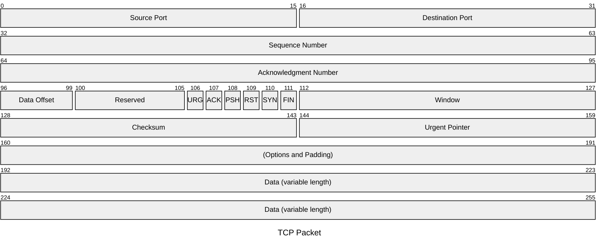
```mermaid
---
title: "TCP Packet"
---
packet
0-15: "Source Port"
16-31: "Destination Port"
32-63: "Sequence Number"
64-95: "Acknowledgment Number"
96-99: "Data Offset"
100-105: "Reserved"
106: "URG"
107: "ACK"
108: "PSH"
109: "RST"
110: "SYN"
111: "FIN"
112-127: "Window"
128-143: "Checksum"
144-159: "Urgent Pointer"
160-191: "(Options and Padding)"
192-255: "Data (variable length)"
```


## Sequence Number
序列号（32位）：标识从TCP源端向目的端发送的数据字节流，它表示在这个报文段中的第一个数据字节的序号。序列号是32位的无符号数，到达2^32-1后从0开始。

## Acknowledgment Number
确认号（32位）：包含发送确认的一端所期望收到的下一个序号。因此，确认号应当是上次已成功收到数据字节序号加1。只有ACK标志为1时确认号字段才有效。

## Data Offset
数据偏移（4位）：指出TCP报文段的数据起始处距离TCP报文段的起始处有多远。实际上就是TCP报文段首部的长度。由于首部长度不固定（有可选字段），因此数据偏移字段是必要的。单位是4字节，所以TCP首部最大长度为60字节（15*4）。

## Control Bits
控制位（6位）：
- **URG**（Urgent）：紧急指针有效标志
- **ACK**（Acknowledgment）：确认序号有效标志
- **PSH**（Push）：接收方应该尽快将这个报文段交给应用层
- **RST**（Reset）：重建连接标志
- **SYN**（Synchronize）：同步序号，用来发起一个连接
- **FIN**（Finish）：发送端完成发送任务标志

## Window
窗口大小（16位）：用于流量控制，表示从确认号开始，本报文段发送方可以接收的字节数，即接收窗口大小。窗口大小是一个16位字段，因而窗口大小最大为65535字节。

## Checksum
检验和是填充一个伪包头加上TCP报文求和算出。
伪包头结构字段：
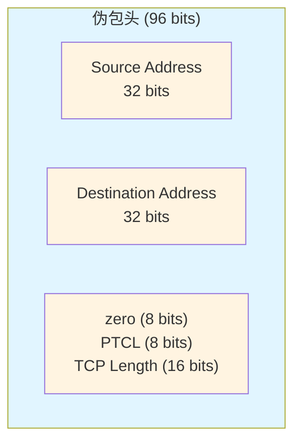
```mermaid
flowchart TB
    subgraph PseudoHeader["伪包头 (96 bits)"]
        SA["Source Address<br/>32 bits"]
        DA["Destination Address<br/>32 bits"]
        ZP["zero (8 bits)<br/>PTCL (8 bits)<br/>TCP Length (16 bits)"]
    end
    
    style PseudoHeader fill:#e1f5ff
    style SA fill:#fff4e1
    style DA fill:#fff4e1
    style ZP fill:#fff4e1
```
  - Source Address: 32 bits
  - Destination Address: 32 bits
  - zero: 8 bits
  - PTCL: 8 bits
  - TCP Length: 16 bits

## Urgent Pointer
紧急指针（16位）：只有当URG标志置1时紧急指针才有效。紧急指针是一个正的偏移量，和序号字段中的值相加表示紧急数据最后一个字节的序号。

## Options
选项字段（可变长度）：当前定义的选项字段包括：

| Kind | Length | Meaning |
| ---- | ------ | ------- |
|  0   |   -  |   End of option list（选项列表结束） |
|  1   |   -  |   No-Operation（无操作） |
|  2   |   4  |  Maximum Segment Size（最大报文段长度） |
|  3   |   3  |  Window Scale（窗口扩大因子） |
|  4   |   2  |  SACK Permitted（允许SACK） |
|  5   |   N  |  SACK（选择性确认） |
|  8   |   10 |  Timestamps（时间戳） |

### 头部选线格式
TCP选项（Options）字段位于TCP头部的最后，长度可变，格式如下：

| Kind (8 bits) | Length (8 bits, 可选) | Data (可选) |

- **Kind**：选项种类（1字节），标明当前选项类型。
- **Length**：本选项的总长度（含Kind和Length字段，1字节），仅当选项需要携带数据时才有该字段。
- **Data**：选项数据部分，长度由具体选项内容决定。

示意图如下：

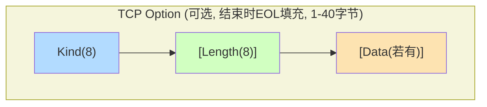
```mermaid
flowchart TB
    subgraph option["TCP Option (可选, 结束时EOL填充, 1-40字节)"]
      a1["Kind(8)"] --> a2["[Length(8)]"] --> a3["[Data(若有)]"]
    end
    style option fill:#F5F5DC
    style a1 fill:#B2DBFF
    style a2 fill:#D1FFC1
    style a3 fill:#FDE3B1
```

**TCP常见选项详解：**

1. **End of Option List (EOL, Kind=0)**  
    - 用于标记TCP选项字段的结束。选项字段不足4字节对齐时，会用EOL或NOP（Kind=1）补齐。
    - 仅占1字节，无Length字段。
    - mermaid bit位结构如下：
    
    ```mermaid
    packet
      0-7: "Kind = 0 (EOL)"
    ```

2. **No-Operation (NOP, Kind=1)**  
    - 用于对齐下一个选项，常用于填充，使选项字段4字节对齐。
    - 仅占1字节，无Length字段。
    - mermaid bit位结构如下：

    ```mermaid
    packet
      0-7: "Kind = 1 (NOP)"
    ```

3. **Maximum Segment Size (MSS, Kind=2, 长度4字节)**  
    - **只允许在SYN报文中出现。**  
    - 用于协商双方最大报文段长度，通常和MTU相关，防止分片。
    - mermaid bit位结构如下：

    ```mermaid
    packet
      0-7:   "Kind = 2 (MSS)"
      8-15:  "Length = 4"
      16-23: "MSS高8位"
      24-31: "MSS低8位"
    ```

4. **Window Scale (窗口扩大因子，Kind=3, 长度3字节)**  
    - 只在SYN时协商扩大窗口比例，最大支持$2^{14}$倍。
    - mermaid bit位结构如下：

    ```mermaid
    packet
      0-7:   "Kind = 3 (Window Scale)"
      8-15:  "Length = 3"
      16-23: "Shift Count"
    ```

5. **SACK Permitted (选择性确认许可, Kind=4, 长度2字节)**  
    - 表示本端支持SACK。只能在SYN报文中协商。
    - mermaid bit位结构如下：

    ```mermaid
    packet
      0-7:   "Kind = 4 (SACK Permitted)"
      8-15:  "Length = 2"
    ```

6. **SACK (选择性确认, Kind=5, 可变长度)**  
    - 告知对方已收到的非连续分段序号区间。通常在乱序或丢包后发送。
    - 一次最多可携带4个区间（32字节）。
    - 仅在双方协商SACK Permitted后才能使用。
    - mermaid bit位结构如下（例如2个区间）：

    ```mermaid
    packet
      0-7:   "Kind = 5 (SACK)"
      8-15:  "Length = N"
      16-47:   "左边界1 (4字节)"
      48-79:   "右边界1 (4字节)"
      80-111:  "左边界2 (4字节)"
      112-143: "右边界2 (4字节)"
      %% 依此类推，最多4个区间
    ```

7. **Timestamp (时间戳, Kind=8, 长度10字节)**  
    - 用于高精度RTT测量和PAWS对序号保护，提升性能。
    - TSval：发送方的时间戳
    - TSecr：回显上次收到对方的时间戳值
    - mermaid bit位结构如下：

    ```mermaid
    packet
      0-7:   "Kind = 8 (Timestamp)"
      8-15:  "Length = 10"
      16-47: "TSval（4字节）"
      48-79: "TSecr（4字节）"
    ```


> **注意：**
> - 选项必须以1字节对齐（某些选项间需要插入NOP (Kind=1)进行填充）。
> - TCP头部最小为20字节（无选项），最大为60字节（选项字段最多40字节）。


# 基本概念

## MTU（Maximum Transmission Unit，最大传输单元）

MTU 指数据链路层（如以太网）一次能够传输的最大数据报（帧）长度，单位为字节。MTU 的典型值为 1500 字节（以太网）。如果一份数据包大于 MTU，就会被拆分为多个小包（分片）进行传输。合理设置 MTU 可提高网络的传输效率，避免过多分片导致性能下降。

## MSS（Maximum Segment Size，最大报文段长度）

MSS 是 TCP 层单个报文段中数据负载部分的最大长度，单位为字节。MSS 由双方连接建立时协商确定，等于 MTU 减去 IP 头和 TCP 头的长度（如常见以太网：$MSS = 1500 - 20 - 20 = 1460$ 字节）。合理设置 MSS 可以避免 IP 分片，提高 TCP 性能。

## MSL（Maximum Segment Lifetime，最大报文段生存时间）

MSL 表示一个 TCP 报文段在网络中存在的最长时间，超出后会被丢弃。它用于 TCP 连接的 TIME-WAIT 状态，保证所有旧报文从网络中消失，防止同一端口新旧连接混淆。常见 MSL 的实现为 2 分钟（120 秒），但实际参数可配置。

## RTT（Round-Trip Time，往返时延）

RTT指的是一个数据包从发送方发送到接收方并返回发送方，所经历的总时间。它包括网络传播时延、排队时延、处理时延等。RTT是衡量网络延迟和连接质量的重要指标之一。

### 作用

- **超时重传的依据**：TCP 用RTT的测量结果动态调整重传超时时间（RTO），确保高效和可靠的数据传输。
- **网络状况监测**：RTT的变化可以反映网络拥塞、链路质量等状态。
- **算法优化**：如拥塞控制、流量控制和拥塞避免算法等都基于RTT的变化进行动态调整。

### 测量方法

TCP在发送数据报文后，会根据收到的ACK确认报文，计算出一个报文段的RTT。例如：

1. 发送报文段Seq=100
2. 记录发送时间t1
3. 收到ACK确认Seq=100
4. 记录收到时间t2
5. $RTT = t_2 - t_1$

> 注意：Karn算法规定，重传的数据包的RTT不可用于测量，以避免重复计时导致误差。

### 平滑RTT（SRTT）

TCP通常采用加权平均（如指数加权移动平均）来估算平滑RTT（smoothed RTT, SRTT），以避免因单次波动导致超时参数剧烈变化。

### RTT与TCP性能

- **RTT越小，TCP反应越快，吞吐能力越强。**
- **RTT较大的链路，若未正确配置超时时间，容易导致不必要的重传。**
- **高RTT但丢包率低时，吞吐能力往往受限于窗口和带宽延迟积（BDP：Bandwidth Delay Product）。**

> **公式：**
> 
> $吞吐量(理论最大) \approx \frac{窗口大小}{RTT}$

## TCP常用控制位（Flags）基本概念

在TCP报文头部有6个基础控制位（Flag），它们决定了该报文的用途和连接的状态变化，另有一些扩展控制信息（如SACK）。主要控制位说明如下：

### 1. SYN（Synchronize Sequence Numbers）
- **含义**：同步序列号，用于发起连接请求。
- **作用**：三次握手中用于建立连接，交换初始序列号。
- **举例**：客户端向服务端发送的第一个握手报文SYN=1。

### 2. ACK（Acknowledgment）
- **含义**：确认应答。
- **作用**：标识报文中ack字段有效，用于确认收到的数据。
- **说明**：除了连接初始化第一步外，几乎所有TCP包都需要设置ACK。

### 3. PSH（Push Function）
- **含义**：推送功能。
- **作用**：提示对端接收到数据后应尽快交付应用层，不必等缓冲区满就传递数据。
- **适用**：及时性要求高的应用。

### 4. RST（Reset）
- **含义**：复位连接。
- **作用**：异常关闭连接或拒绝非法数据包，收到RST说明连接被强制重置。

### 5. FIN（Finish）
- **含义**：结束标志。
- **作用**：用于连接的终止，四次挥手的主角。发送端无更多数据发送。

### 6. URG（Urgent）
- **含义**：紧急指针有效。
- **作用**：表示报文中有紧急数据，需优先处理。通常较少用。
- **配合**：urgent pointer字段。
 

# 连接
## TCP 连接状态机

TCP连接状态转换图如下：

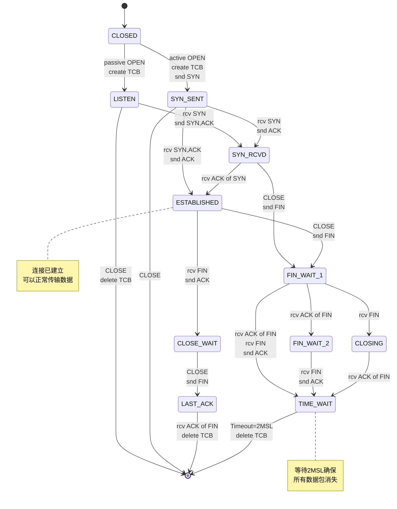
```mermaid
stateDiagram-v2
    [*] --> CLOSED
    
    CLOSED --> LISTEN: passive OPEN<br/>create TCB
    CLOSED --> SYN_SENT: active OPEN<br/>create TCB<br/>snd SYN
    
    LISTEN --> SYN_RCVD: rcv SYN<br/>snd SYN,ACK
    LISTEN --> [*]: CLOSE<br/>delete TCB
    
    SYN_SENT --> ESTABLISHED: rcv SYN,ACK<br/>snd ACK
    SYN_SENT --> SYN_RCVD: rcv SYN<br/>snd ACK
    SYN_SENT --> [*]: CLOSE
    
    SYN_RCVD --> ESTABLISHED: rcv ACK of SYN
    SYN_RCVD --> FIN_WAIT_1: CLOSE<br/>snd FIN
    
    ESTABLISHED --> FIN_WAIT_1: CLOSE<br/>snd FIN
    ESTABLISHED --> CLOSE_WAIT: rcv FIN<br/>snd ACK
    
    FIN_WAIT_1 --> FIN_WAIT_2: rcv ACK of FIN
    FIN_WAIT_1 --> CLOSING: rcv FIN
    FIN_WAIT_1 --> TIME_WAIT: rcv ACK of FIN<br/>rcv FIN<br/>snd ACK
    
    FIN_WAIT_2 --> TIME_WAIT: rcv FIN<br/>snd ACK
    
    CLOSE_WAIT --> LAST_ACK: CLOSE<br/>snd FIN
    
    CLOSING --> TIME_WAIT: rcv ACK of FIN
    
    LAST_ACK --> [*]: rcv ACK of FIN<br/>delete TCB
    
    TIME_WAIT --> [*]: Timeout=2MSL<br/>delete TCB
    
    note right of ESTABLISHED
        连接已建立
        可以正常传输数据
    end note
    
    note right of TIME_WAIT
        等待2MSL确保
        所有数据包消失
    end note
```

### 各个状态说明

| 状态 | 说明 |
|------|------|
| **CLOSED** | 初始状态，表示没有任何连接状态 |
| **LISTEN** | 服务器等待来自任意远程TCP和端口的连接请求 |
| **SYN-SENT** | 客户端已发送连接请求，等待匹配的连接请求 |
| **SYN-RECEIVED** | 服务器已收到并发送连接请求，等待确认 |
| **ESTABLISHED** | 连接已建立，可以正常传输数据 |
| **FIN-WAIT-1** | 等待远程TCP的连接终止请求，或之前发送的连接终止请求的确认 |
| **FIN-WAIT-2** | 等待远程TCP的连接终止请求 |
| **CLOSE-WAIT** | 等待本地用户的连接终止请求 |
| **CLOSING** | 等待远程TCP对连接终止请求的确认 |
| **LAST-ACK** | 等待之前发送给远程TCP的连接终止请求的确认 |
| **TIME-WAIT** | 等待足够的时间以确保远程TCP收到连接终止请求的确认（2MSL） |

## 建立连接（三次握手）

TCP建立连接需要三次握手，过程如下：

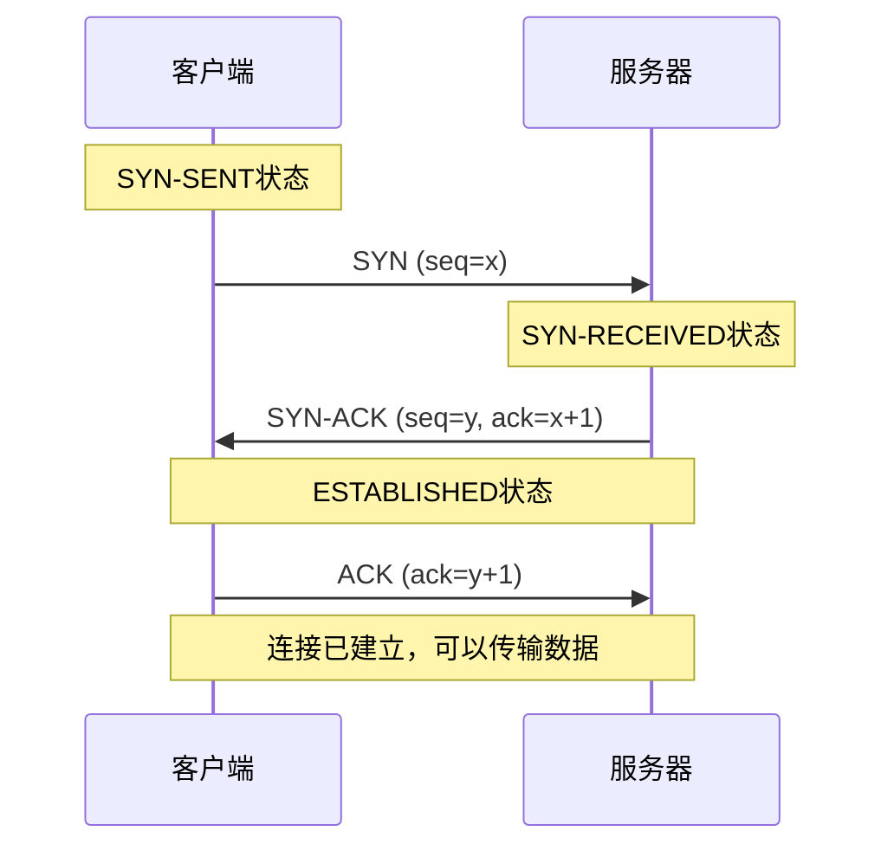
```mermaid
sequenceDiagram
    participant Client as 客户端
    participant Server as 服务器
    
    Note over Client: SYN-SENT状态
    Client->>Server: SYN (seq=x)
    Note over Server: SYN-RECEIVED状态
    Server->>Client: SYN-ACK (seq=y, ack=x+1)
    Note over Client,Server: ESTABLISHED状态
    Client->>Server: ACK (ack=y+1)
    Note over Client,Server: 连接已建立，可以传输数据
```

**详细过程：**

1. **第一次握手（SYN）**：客户端发送SYN报文，其中：
   - SYN标志位设置为1
   - 序列号seq=x（x为随机值）
   - 客户端进入SYN-SENT状态

2. **第二次握手（SYN-ACK）**：服务器收到SYN报文后，发送SYN-ACK报文，其中：
   - SYN和ACK标志位都设置为1
   - 序列号seq=y（y为随机值）
   - 确认号ack=x+1
   - 服务器进入SYN-RECEIVED状态

3. **第三次握手（ACK）**：客户端收到SYN-ACK报文后，发送ACK报文，其中：
   - ACK标志位设置为1
   - 确认号ack=y+1
   - 序列号seq=x+1
   - 客户端和服务器都进入ESTABLISHED状态

**为什么需要三次握手？**
- 防止旧的重复连接请求造成混乱：如果只有两次握手，当客户端发送的SYN报文在网络中滞留，客户端超时重传后建立新连接，此时旧的SYN报文到达服务器，服务器会误认为客户端要建立新连接。
- 确认双方的发送和接收能力：三次握手可以确保双方都能正常发送和接收数据。

## 断开连接（四次挥手）

TCP断开连接需要四次挥手，过程如下：

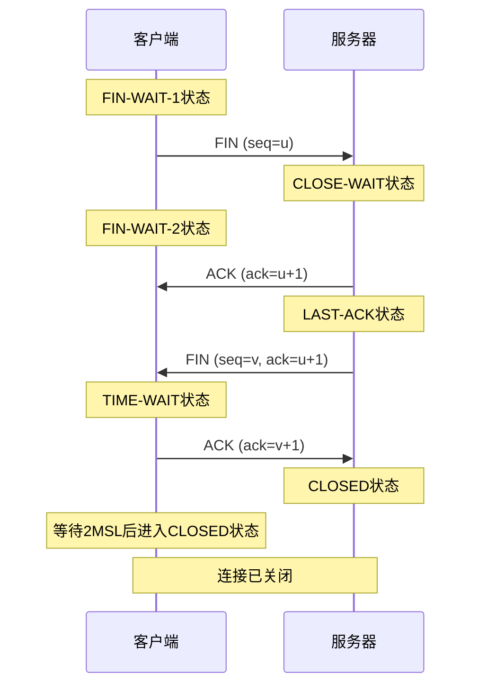
```mermaid
sequenceDiagram
    participant Client as 客户端
    participant Server as 服务器
    
    Note over Client: FIN-WAIT-1状态
    Client->>Server: FIN (seq=u)
    Note over Server: CLOSE-WAIT状态
    Note over Client: FIN-WAIT-2状态
    Server->>Client: ACK (ack=u+1)
    Note over Server: LAST-ACK状态
    Server->>Client: FIN (seq=v, ack=u+1)
    Note over Client: TIME-WAIT状态
    Client->>Server: ACK (ack=v+1)
    Note over Server: CLOSED状态
    Note over Client: 等待2MSL后进入CLOSED状态
    Note over Client,Server: 连接已关闭
```

**详细过程：**

1. **第一次挥手（FIN）**：客户端发送FIN报文，其中：
   - FIN标志位设置为1
   - 序列号seq=u
   - 客户端进入FIN-WAIT-1状态

2. **第二次挥手（ACK）**：服务器收到FIN报文后，发送ACK报文，其中：
   - ACK标志位设置为1
   - 确认号ack=u+1
   - 服务器进入CLOSE-WAIT状态
   - 客户端收到ACK后进入FIN-WAIT-2状态

3. **第三次挥手（FIN）**：服务器发送FIN报文，其中：
   - FIN标志位设置为1
   - 序列号seq=v
   - 确认号ack=u+1
   - 服务器进入LAST-ACK状态

4. **第四次挥手（ACK）**：客户端收到FIN报文后，发送ACK报文，其中：
   - ACK标志位设置为1
   - 确认号ack=v+1
   - 客户端进入TIME-WAIT状态
   - 服务器收到ACK后进入CLOSED状态
   - 客户端等待2MSL（Maximum Segment Lifetime）后进入CLOSED状态

**为什么需要四次挥手？**
- TCP是全双工的，每个方向必须单独进行关闭
- 当一方完成数据发送任务后，发送FIN来终止这个方向的连接
- 另一方收到FIN后，可能还有数据要发送，所以先发送ACK确认，等数据发送完毕后再发送FIN

**TIME-WAIT状态的作用：**
- 确保最后一个ACK能够到达服务器：如果ACK丢失，服务器会重传FIN，客户端需要能够处理这个重传的FIN
- 让旧连接的数据包在网络中消失：等待2MSL可以确保本次连接产生的所有数据包都从网络中消失，避免影响新的连接


## seq与ack的计算规则

在TCP数据传输过程中，序列号（seq）和确认号（ack）的计算关系如下：

### 1. 序列号（seq）

- 客户端或服务器每发送一个字节的数据，其序列号就加1（对于SYN、FIN等控制位，也会占用一个序列号）。
- 每个TCP报文段的`seq`字段，表示该报文段数据部分的**第一个字节**的序列号。

**举例：**
- 客户端初始序列号为`x`，发送100字节数据，则第一个报文的`seq=x`，数据区间为`[x, x+100)`。
- 若SYN报文携带SYN标志，则`seq=x`，但有效数据大小为0，且SYN本身占用一个序列号（即下一个报文的`seq=x+1`）。

### 2. 确认号（ack）

- 确认号代表**期望收到的下一个序列号**，即发送方已经收到的数据最后一个字节的序列号加1。
- ACK报文中的`ack=k`，说明到序列号`k-1`的数据都已被正确收到。

**举例：**
- 如果接收方收到了`seq=1`到`seq=100`的数据，那么回ACK报文`ack=101`，表示期望下一个收到的是序列号101的字节。
- 三次握手中的第3次：若服务端SYN序列号为`y`，客户端确认号`ack=y+1`，表示服务端SYN已收到。

### 3. seq/ack与SYN、FIN

- SYN和FIN各自**消耗一个序列号**，即使并未携带数据。
- 例如：SYN包`seq=x`，下一个带数据的包`seq=x+1`；FIN包同理。

### 4. 乱序与累计确认

- TCP的ack为累计确认：即使多包到达乱序，ack确认号始终是“已连续收到的最大顺序字节+1”。
- 若有SACK选项，会在ACK中说明哪些乱序数据已经收到，但`ack`字段仍代表“左窗最大已收到+1”。

### 图示

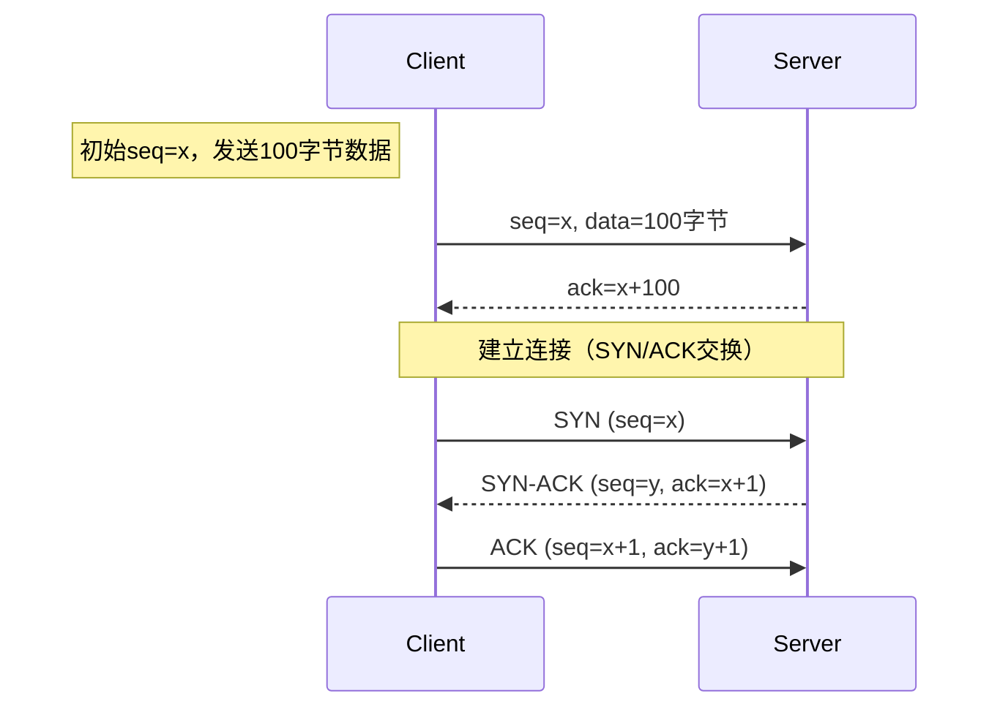
```mermaid
sequenceDiagram
    participant Client
    participant Server

    Note left of Client: 初始seq=x，发送100字节数据
    Client->>Server: seq=x, data=100字节
    Server-->>Client: ack=x+100

    Note over Client,Server: 建立连接（SYN/ACK交换）
    Client->>Server: SYN (seq=x)
    Server-->>Client: SYN-ACK (seq=y, ack=x+1)
    Client->>Server: ACK (seq=x+1, ack=y+1)
```


### 总结公式

- **数据报文段的seq** = 上一包seq + 传输数据字节数（加上1如果包含SYN或FIN）
- **确认号ack** = 已收到的最大顺序字节的序列号 + 1

## 半关闭（Half-Close）

### 概念

**半关闭（Half-Close）**是TCP连接的一个重要特性，允许一方在完成数据发送后关闭发送方向，但仍可以接收对方发送的数据。TCP连接是全双工的，每个方向可以独立关闭。

### 半关闭的状态

在四次挥手过程中，当一方发送FIN后，连接进入半关闭状态：

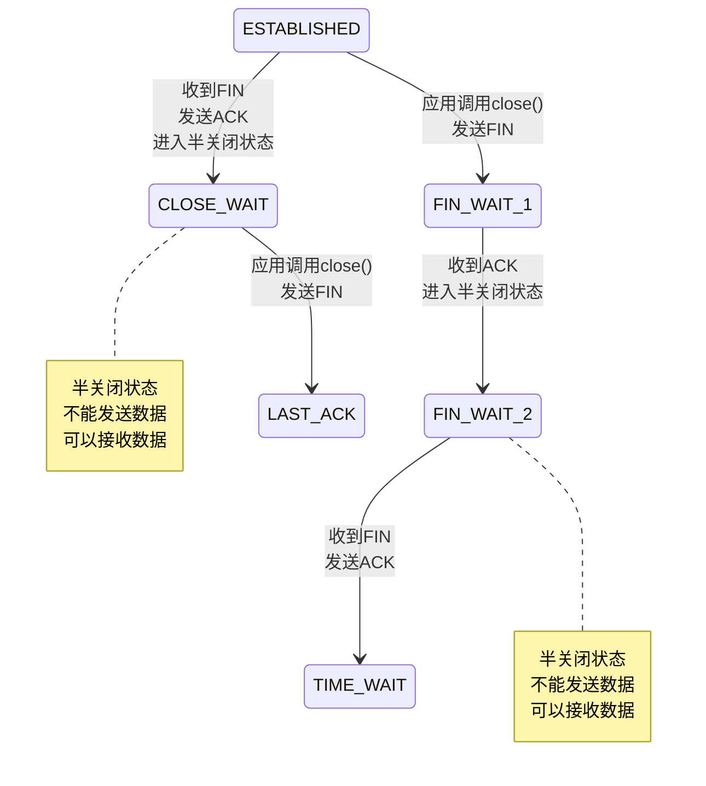
```mermaid
stateDiagram-v2
    ESTABLISHED --> FIN_WAIT_1: 应用调用close()<br/>发送FIN
    FIN_WAIT_1 --> FIN_WAIT_2: 收到ACK<br/>进入半关闭状态
    FIN_WAIT_2 --> TIME_WAIT: 收到FIN<br/>发送ACK
    
    ESTABLISHED --> CLOSE_WAIT: 收到FIN<br/>发送ACK<br/>进入半关闭状态
    CLOSE_WAIT --> LAST_ACK: 应用调用close()<br/>发送FIN
    
    note right of FIN_WAIT_2
        半关闭状态
        不能发送数据
        可以接收数据
    end note
    
    note right of CLOSE_WAIT
        半关闭状态
        不能发送数据
        可以接收数据
    end note
```

### 半关闭的详细过程

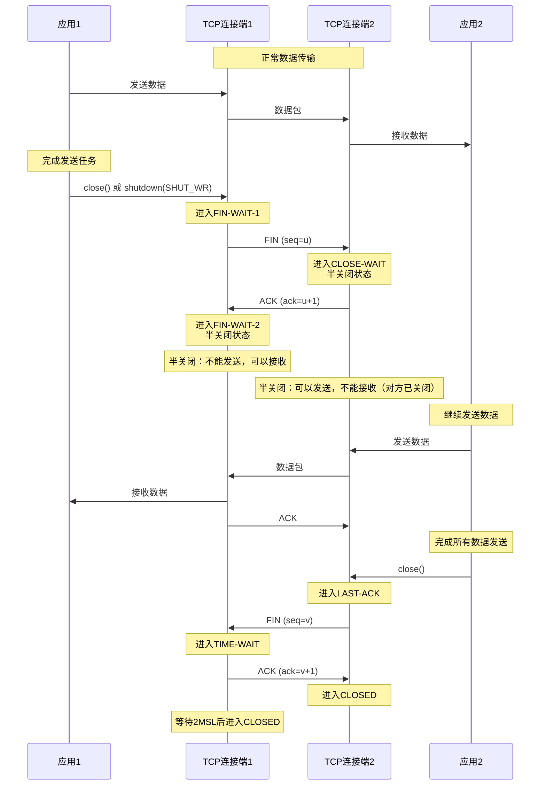
```mermaid
sequenceDiagram
    participant App1 as 应用1
    participant TCP1 as TCP连接端1
    participant TCP2 as TCP连接端2
    participant App2 as 应用2
    
    Note over TCP1,TCP2: 正常数据传输
    App1->>TCP1: 发送数据
    TCP1->>TCP2: 数据包
    TCP2->>App2: 接收数据
    
    Note over App1: 完成发送任务
    App1->>TCP1: close() 或 shutdown(SHUT_WR)
    Note over TCP1: 进入FIN-WAIT-1
    TCP1->>TCP2: FIN (seq=u)
    Note over TCP2: 进入CLOSE-WAIT<br/>半关闭状态
    TCP2->>TCP1: ACK (ack=u+1)
    Note over TCP1: 进入FIN-WAIT-2<br/>半关闭状态
    
    Note over TCP1: 半关闭：不能发送，可以接收
    Note over TCP2: 半关闭：可以发送，不能接收（对方已关闭）
    
    Note over App2: 继续发送数据
    App2->>TCP2: 发送数据
    TCP2->>TCP1: 数据包
    TCP1->>App1: 接收数据
    TCP1->>TCP2: ACK
    
    Note over App2: 完成所有数据发送
    App2->>TCP2: close()
    Note over TCP2: 进入LAST-ACK
    TCP2->>TCP1: FIN (seq=v)
    Note over TCP1: 进入TIME-WAIT
    TCP1->>TCP2: ACK (ack=v+1)
    Note over TCP2: 进入CLOSED
    Note over TCP1: 等待2MSL后进入CLOSED
```

### 半关闭的特点

1. **单向关闭**：
   - 发送FIN的一方关闭了发送方向
   - 接收FIN的一方仍可以继续发送数据

2. **状态转换**：
   - **FIN-WAIT-2**：主动关闭方进入半关闭状态，只能接收数据
   - **CLOSE-WAIT**：被动关闭方进入半关闭状态，只能发送数据

3. **数据流向**：
   - 半关闭后，数据只能从CLOSE-WAIT端流向FIN-WAIT-2端
   - FIN-WAIT-2端不能再发送数据，但可以接收数据并发送ACK

### shutdown() 函数

在应用程序中，可以使用`shutdown()`函数实现半关闭：

#### shutdown() 的参数

```c
int shutdown(int sockfd, int how);
```

**how参数**：
- **SHUT_RD (0)**：关闭读方向，不能再接收数据
- **SHUT_WR (1)**：关闭写方向，不能再发送数据（发送FIN）
- **SHUT_RDWR (2)**：同时关闭读写方向（等同于close()）

#### shutdown() 与 close() 的区别

| 特性 | shutdown() | close() |
|------|-----------|---------|
| **关闭方向** | 可以单独关闭读或写 | 同时关闭读写 |
| **半关闭支持** | 支持 | 不支持 |
| **文件描述符** | 不关闭文件描述符 | 关闭文件描述符 |
| **引用计数** | 不影响引用计数 | 减少引用计数 |
| **使用场景** | 需要半关闭时 | 完全关闭连接时 |

### 半关闭的应用场景

#### 场景1：HTTP/1.0 连接

HTTP/1.0中，服务器发送完响应后可以关闭写方向，但仍保持连接以接收客户端可能的请求：

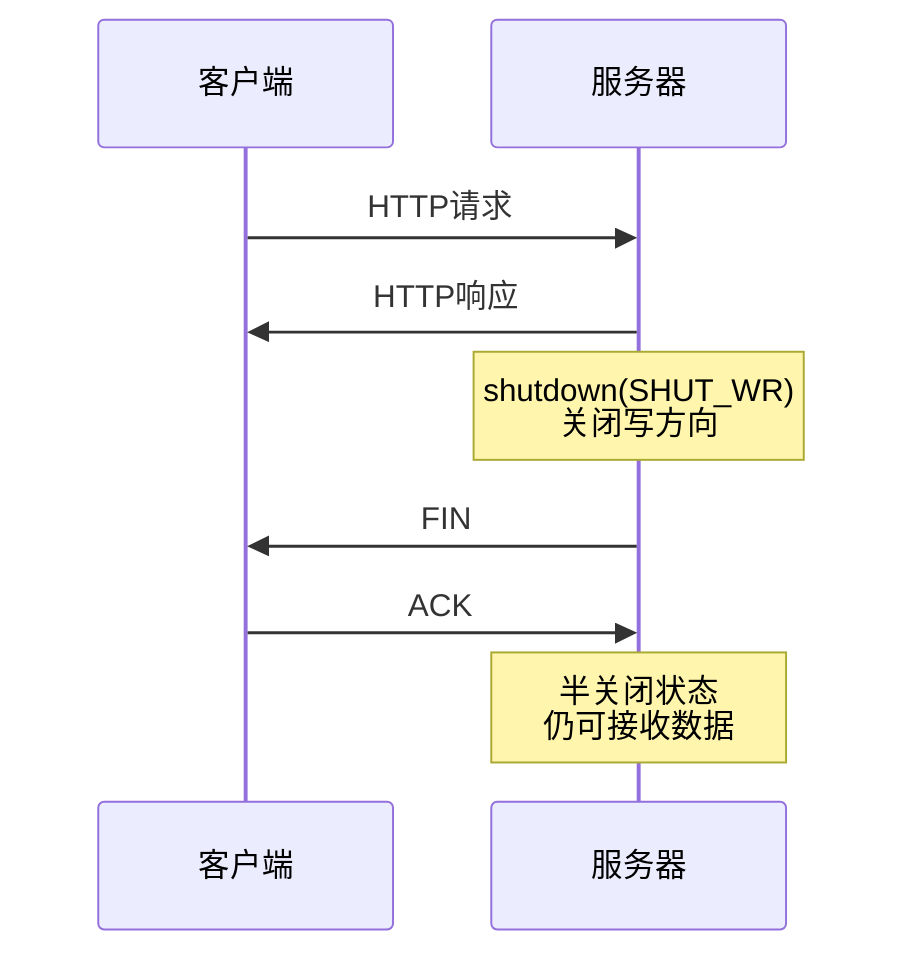
```mermaid
sequenceDiagram
    participant Client as 客户端
    participant Server as 服务器
    
    Client->>Server: HTTP请求
    Server->>Client: HTTP响应
    Note over Server: shutdown(SHUT_WR)<br/>关闭写方向
    Server->>Client: FIN
    Client->>Server: ACK
    Note over Server: 半关闭状态<br/>仍可接收数据
```

#### 场景2：文件传输

文件传输完成后，发送方可以关闭写方向，但仍可以接收确认信息：

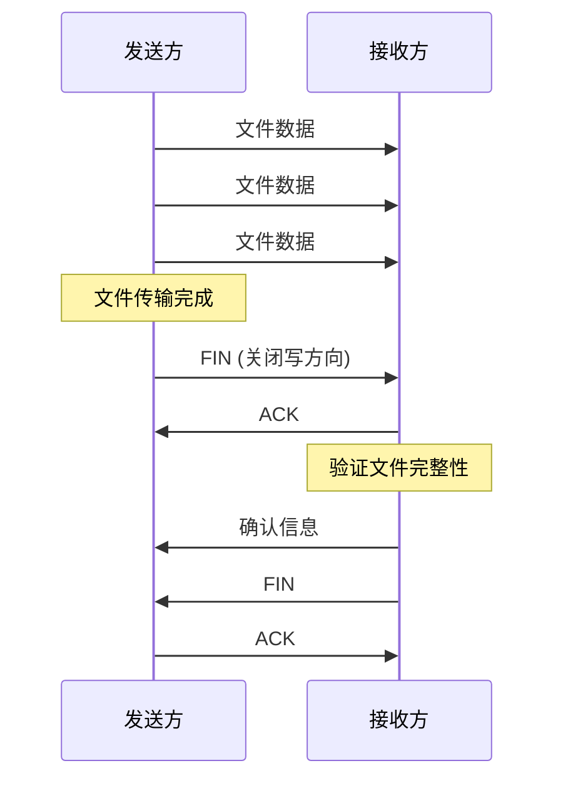
```mermaid
sequenceDiagram
    participant Sender as 发送方
    participant Receiver as 接收方
    
    Sender->>Receiver: 文件数据
    Sender->>Receiver: 文件数据
    Sender->>Receiver: 文件数据
    Note over Sender: 文件传输完成
    Sender->>Receiver: FIN (关闭写方向)
    Receiver->>Sender: ACK
    Note over Receiver: 验证文件完整性
    Receiver->>Sender: 确认信息
    Receiver->>Sender: FIN
    Sender->>Receiver: ACK
```

#### 场景3：优雅关闭

应用程序可以优雅地关闭连接，先关闭写方向，等待对方处理完数据后再完全关闭：

```c
// 优雅关闭示例
shutdown(sockfd, SHUT_WR);  // 关闭写方向，发送FIN
// 继续接收数据
while (recv(sockfd, buffer, size, 0) > 0) {
    // 处理接收到的数据
}
close(sockfd);  // 完全关闭连接
```

### 半关闭状态下的数据流

在半关闭状态下，数据流是单向的：

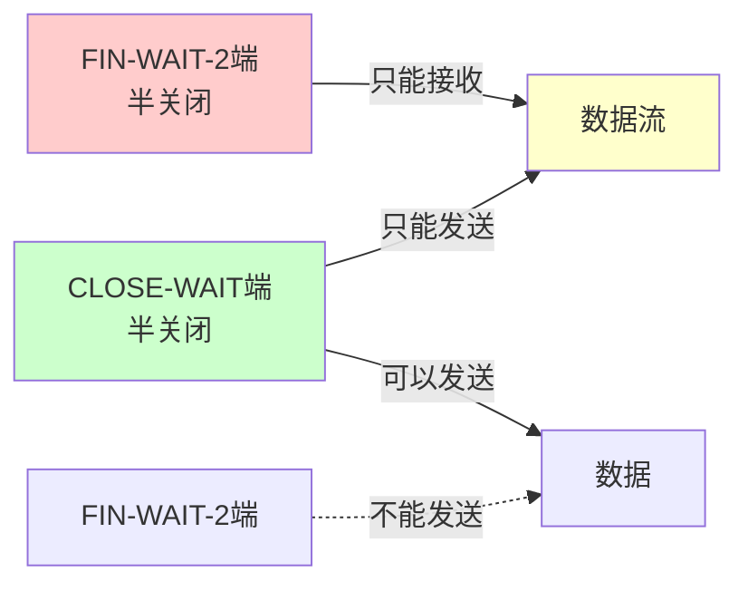
```mermaid
graph LR
    A[FIN-WAIT-2端<br/>半关闭] -->|只能接收| B[数据流]
    C[CLOSE-WAIT端<br/>半关闭] -->|只能发送| B
    
    D[FIN-WAIT-2端] -.->|不能发送| E[数据]
    C -->|可以发送| E
    
    style A fill:#ffcccc
    style C fill:#ccffcc
    style B fill:#ffffcc
```

### 半关闭的注意事项

1. **应用层处理**：
   - 应用层需要正确处理半关闭状态
   - 读取操作返回0表示对方已关闭写方向
   - 写入操作会失败（EPIPE错误）

2. **状态持续时间**：
   - FIN-WAIT-2状态可能持续较长时间
   - 如果对方一直不发送FIN，连接会一直处于半关闭状态
   - 某些系统有超时机制自动关闭长时间处于FIN-WAIT-2的连接

3. **资源占用**：
   - 半关闭状态仍占用系统资源
   - 应该尽快完成关闭过程

4. **编程实践**：
   - 使用`shutdown()`实现半关闭
   - 使用`close()`完全关闭连接
   - 正确处理半关闭状态下的读写操作

### 半关闭的代码示例

#### C语言示例

```c
#include <sys/socket.h>
#include <unistd.h>
#include <stdio.h>
#include <string.h>

// 服务器端：发送完数据后关闭写方向
void server_half_close(int sockfd) {
    // 发送数据
    const char *data = "Hello, Client!";
    send(sockfd, data, strlen(data), 0);
    
    // 关闭写方向，进入半关闭状态
    shutdown(sockfd, SHUT_WR);
    
    // 仍可以接收数据
    char buffer[1024];
    while (recv(sockfd, buffer, sizeof(buffer), 0) > 0) {
        // 处理接收到的数据
    }
    
    // 完全关闭连接
    close(sockfd);
}

// 客户端：接收数据后关闭写方向
void client_half_close(int sockfd) {
    // 接收数据
    char buffer[1024];
    recv(sockfd, buffer, sizeof(buffer), 0);
    
    // 对方已关闭写方向，recv返回0
    // 可以继续发送数据
    const char *response = "Thank you!";
    send(sockfd, response, strlen(response), 0);
    
    // 关闭连接
    close(sockfd);
}
```

#### Python示例

```python
import socket

# 服务器端半关闭
def server_half_close(sock):
    # 发送数据
    sock.send(b"Hello, Client!")
    
    # 关闭写方向
    sock.shutdown(socket.SHUT_WR)
    
    # 仍可以接收数据
    while True:
        data = sock.recv(1024)
        if not data:
            break
        # 处理数据
    
    # 完全关闭
    sock.close()

# 客户端半关闭
def client_half_close(sock):
    # 接收数据
    data = sock.recv(1024)
    
    # 对方已关闭写方向，recv返回空
    # 可以继续发送数据
    sock.send(b"Thank you!")
    
    # 关闭连接
    sock.close()
```

### 半关闭与完全关闭的对比

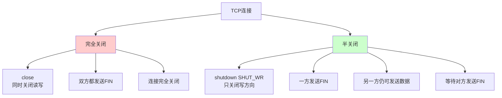
```mermaid
graph TB
    A[TCP连接] --> B[完全关闭]
    A --> C[半关闭]
    
    B --> D[close<br/>同时关闭读写]
    B --> E[双方都发送FIN]
    B --> F[连接完全关闭]
    
    C --> G[shutdown SHUT_WR<br/>只关闭写方向]
    C --> H[一方发送FIN]
    C --> I[另一方仍可发送数据]
    C --> J[等待对方发送FIN]
    
    style B fill:#ffcccc
    style C fill:#ccffcc
```

### 常见问题

#### 问题1：半关闭状态持续过久

**原因**：
- 对方应用没有正确关闭连接
- 网络问题导致FIN丢失

**解决方案**：
- 设置超时机制
- 使用keepalive检测连接状态
- 应用层实现超时关闭

#### 问题2：半关闭后仍尝试发送数据

**现象**：
- 写入操作返回EPIPE错误
- 可能收到SIGPIPE信号

**解决方案**：
- 检查连接状态
- 使用shutdown()明确关闭方向
- 处理EPIPE错误和SIGPIPE信号

#### 问题3：recv()返回0的含义

**说明**：
- recv()返回0表示对方已关闭写方向（发送了FIN）
- 这是正常的半关闭状态，不是错误
- 应用应该正确处理这种情况

### 最佳实践

1. **明确关闭意图**：
   - 使用shutdown()实现半关闭
   - 使用close()完全关闭连接
   - 避免混用导致状态混乱

2. **正确处理返回值**：
   - recv()返回0表示对方关闭写方向
   - send()失败（EPIPE）表示本地已关闭写方向
   - 正确处理这些情况

3. **资源管理**：
   - 及时关闭不再使用的连接
   - 避免长时间处于半关闭状态
   - 使用超时机制防止资源泄漏

4. **协议设计**：
   - 在协议中明确关闭流程
   - 考虑使用半关闭优化性能
   - 确保双方正确理解关闭状态

# 流量控制与窗口机制

## 流量控制概述

TCP使用滑动窗口机制来实现流量控制，防止发送方发送数据过快，导致接收方缓冲区溢出。流量控制是端到端的控制，主要关注接收方的处理能力。

## 接收窗口（Receive Window, rwnd）

### 概念

接收窗口是接收方告诉发送方可以接收多少数据的窗口大小。接收方在每次发送ACK时，会在TCP头部的Window字段中告知发送方当前可用的接收缓冲区大小。

### 接收窗口的计算

$接收窗口 = 接收缓冲区大小 - 已接收但未读取的数据$

接收窗口会随着以下情况变化：
- **数据被应用层读取**：接收窗口增大
- **新数据到达**：接收窗口减小
- **接收缓冲区满**：接收窗口为0（零窗口）

### 接收窗口的更新

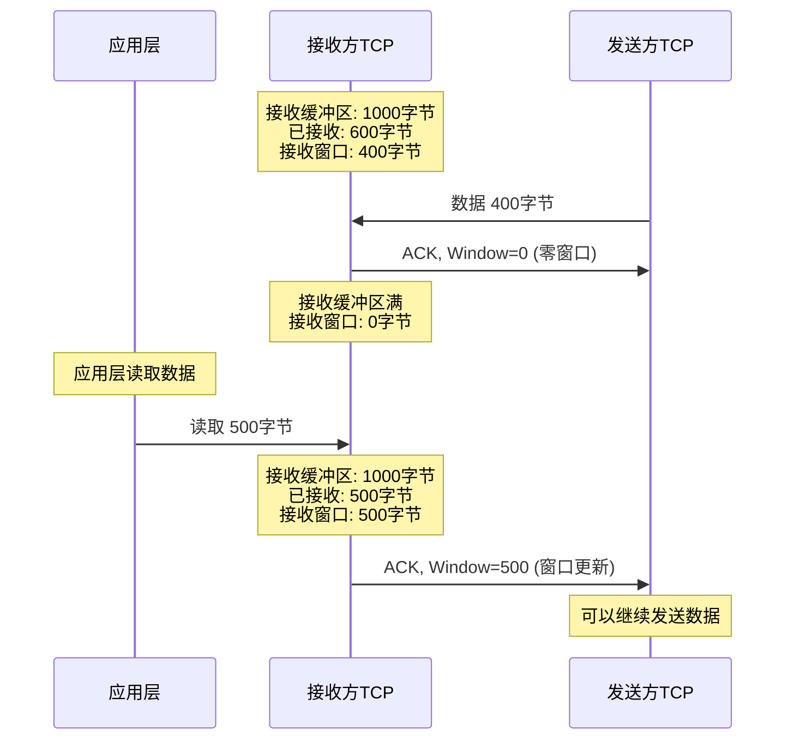
```mermaid
sequenceDiagram
    participant App as 应用层
    participant Recv as 接收方TCP
    participant Send as 发送方TCP
    
    Note over Recv: 接收缓冲区: 1000字节<br/>已接收: 600字节<br/>接收窗口: 400字节
    Send->>Recv: 数据 400字节
    Recv->>Send: ACK, Window=0 (零窗口)
    Note over Recv: 接收缓冲区满<br/>接收窗口: 0字节
    
    Note over App: 应用层读取数据
    App->>Recv: 读取 500字节
    Note over Recv: 接收缓冲区: 1000字节<br/>已接收: 500字节<br/>接收窗口: 500字节
    Recv->>Send: ACK, Window=500 (窗口更新)
    Note over Send: 可以继续发送数据
```

## 发送窗口（Send Window, swnd）

### 概念

发送窗口是发送方实际可以发送的数据量，它受两个因素限制：
1. **接收窗口（rwnd）**：接收方告知的可用空间
2. **拥塞窗口（cwnd）**：拥塞控制限制的窗口大小

### 发送窗口的计算

$发送窗口 = \min(接收窗口, 拥塞窗口)$

发送窗口是流量控制和拥塞控制的结合，取两者中的较小值。

### 发送窗口的组成

发送窗口由三个部分组成：


```mermaid
graph LR
    A[已发送已确认] --> B[已发送未确认]
    B --> C[可发送<br/>发送窗口]
    C --> D[不可发送]
    
    style A fill:#90EE90
    style B fill:#FFE4B5
    style C fill:#87CEEB
    style D fill:#D3D3D3
```

- **已发送已确认**：数据已发送且收到ACK确认
- **已发送未确认**：数据已发送但未收到ACK（在发送窗口中）
- **可发送**：在发送窗口内，可以发送的数据
- **不可发送**：超出发送窗口，暂时不能发送

### 发送窗口的滑动

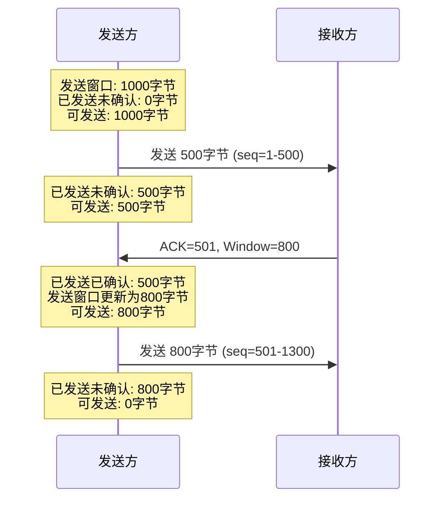
```mermaid
sequenceDiagram
    participant Send as 发送方
    participant Recv as 接收方
    
    Note over Send: 发送窗口: 1000字节<br/>已发送未确认: 0字节<br/>可发送: 1000字节
    
    Send->>Recv: 发送 500字节 (seq=1-500)
    Note over Send: 已发送未确认: 500字节<br/>可发送: 500字节
    
    Recv->>Send: ACK=501, Window=800
    Note over Send: 已发送已确认: 500字节<br/>发送窗口更新为800字节<br/>可发送: 800字节
    
    Send->>Recv: 发送 800字节 (seq=501-1300)
    Note over Send: 已发送未确认: 800字节<br/>可发送: 0字节
```

### 发送窗口滑动示意图

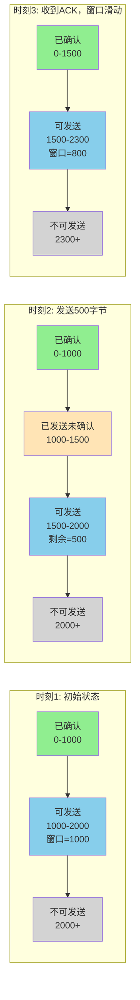
```mermaid
graph LR
    subgraph "时刻1: 初始状态"
        A1[已确认<br/>0-1000] --> B1[可发送<br/>1000-2000<br/>窗口=1000]
        B1 --> C1[不可发送<br/>2000+]
    end
    
    subgraph "时刻2: 发送500字节"
        A2[已确认<br/>0-1000] --> B2[已发送未确认<br/>1000-1500]
        B2 --> C2[可发送<br/>1500-2000<br/>剩余=500]
        C2 --> D2[不可发送<br/>2000+]
    end
    
    subgraph "时刻3: 收到ACK，窗口滑动"
        A3[已确认<br/>0-1500] --> B3[可发送<br/>1500-2300<br/>窗口=800]
        B3 --> C3[不可发送<br/>2300+]
    end
    
    style A1 fill:#90EE90
    style A2 fill:#90EE90
    style A3 fill:#90EE90
    style B1 fill:#87CEEB
    style B2 fill:#FFE4B5
    style C2 fill:#87CEEB
    style B3 fill:#87CEEB
    style C1 fill:#D3D3D3
    style D2 fill:#D3D3D3
    style C3 fill:#D3D3D3
```

## 窗口扩大因子（Window Scale）

### 问题

TCP头部的Window字段只有16位，最大值为65535字节。在现代高速网络中，这个值太小，限制了传输性能。

### 解决方案

TCP通过Window Scale选项（选项3）来扩大窗口：

$实际接收窗口 = Window字段值 \times 2^{Window\_Scale}$

Window Scale是一个0-14之间的值，最大可以将窗口扩大到 $65535 \times 2^{14} = 1,073,725,440$ 字节（约1GB）。

#### 为什么窗口扩大因子（Window Scale）最大为14位？

Window Scale字段本身占用1个字节（8位），但其最大取值被限定为14（2^14倍）。主要原因如下：

- **协议设计规定**：TCP的Window Scale选项（Kind=3）结构为：
  
  | Kind | Length | Shift count |
  |------|--------|-------------|
  |  3   |   3    | 0~14        |

  其中Shift count字段仅采用低4位（0~15），RFC 7323规定最大实际可用的值为14（即2^14倍），15（2^15倍）保留不用。

- **避免溢出**：如果扩大因子过大，实际接收窗口（Window字段×$2^n$）可能超过32位（4GB），而TCP头部接收窗口和相关参数在实现中一般采用32位存储，防止溢出和兼容性问题。

- **实际应用需求**：对于高带宽高时延链路，$2^{14}$倍已经能将最大窗口扩大到1GB，能满足绝大多数实际网络环境需求，因此没有必要设定更大的扩大因子。

**总结**：限制为14位，是协议标准与实现合理性、兼容性及实际需求共同决定的结果。


### Window Scale的使用

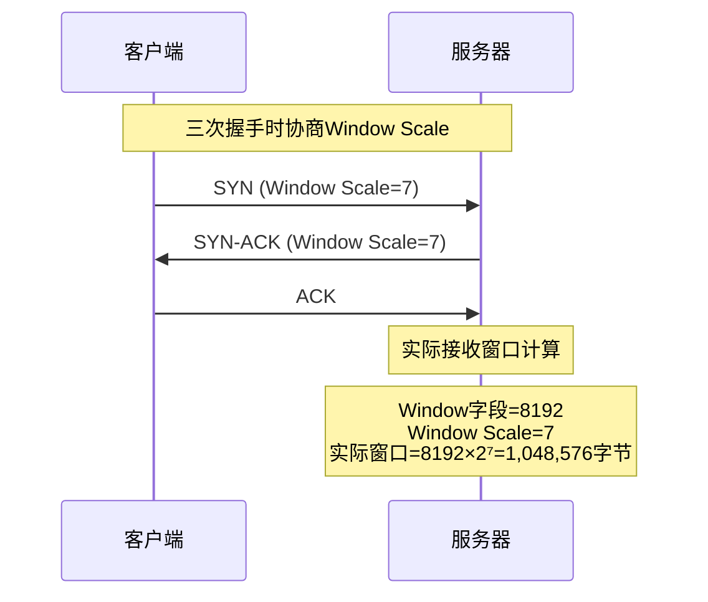
```mermaid
sequenceDiagram
    participant Client as 客户端
    participant Server as 服务器
    
    Note over Client,Server: 三次握手时协商Window Scale
    Client->>Server: SYN (Window Scale=7)
    Server->>Client: SYN-ACK (Window Scale=7)
    Client->>Server: ACK
    
    Note over Server: 实际接收窗口计算
    Note over Server: Window字段=8192<br/>Window Scale=7<br/>实际窗口=8192×2⁷=1,048,576字节
```

## 零窗口问题

### 零窗口的产生

当接收方的接收缓冲区满时，接收窗口变为0，发送方会停止发送数据。

### 零窗口探测（Zero Window Probe）

当发送方收到零窗口通知后，会定期发送零窗口探测报文：

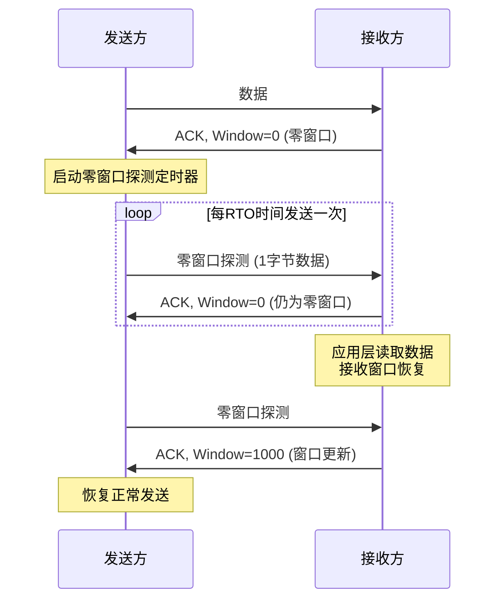
```mermaid
sequenceDiagram
    participant Send as 发送方
    participant Recv as 接收方
    
    Send->>Recv: 数据
    Recv->>Send: ACK, Window=0 (零窗口)
    
    Note over Send: 启动零窗口探测定时器
    
    loop 每RTO时间发送一次
        Send->>Recv: 零窗口探测 (1字节数据)
        Recv->>Send: ACK, Window=0 (仍为零窗口)
    end
    
    Note over Recv: 应用层读取数据<br/>接收窗口恢复
    Send->>Recv: 零窗口探测
    Recv->>Send: ACK, Window=1000 (窗口更新)
    Note over Send: 恢复正常发送
```

### 零窗口探测的特点

- 发送1字节的数据（即使接收窗口为0）
- 使用指数退避策略，初始间隔为RTO，最大不超过60秒
- 收到非零窗口后，立即恢复正常发送

## 窗口更新机制

### 窗口更新的触发

接收方在以下情况会发送窗口更新：

1. **应用层读取数据**：接收缓冲区有空间时
2. **接收窗口达到阈值**：通常为最大窗口的1/2或1/4
3. **零窗口恢复**：从零窗口恢复到非零窗口时

### 窗口更新报文

窗口更新可以通过以下方式发送：

1. **带数据的ACK**：在发送数据时携带窗口更新
2. **纯ACK**：只发送ACK，不携带数据（如果接收窗口变化较大）

### 窗口更新的优化

为了避免窗口更新报文丢失导致的问题，TCP使用以下策略：

- **延迟确认**：延迟发送ACK，等待应用层读取数据或窗口变化较大时再发送
- **窗口更新确认**：某些实现中，窗口更新可能需要确认

## 发送窗口与拥塞窗口的关系

### 实际发送窗口

$实际发送窗口 = \min(接收窗口, 拥塞窗口)$

### 窗口关系图

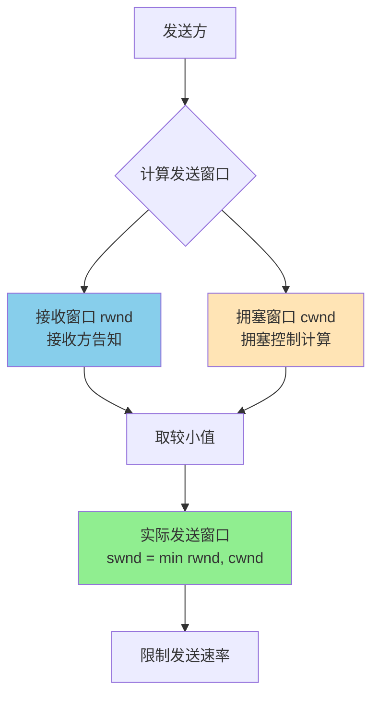
```mermaid
graph TB
    A[发送方] --> B{计算发送窗口}
    B --> C[接收窗口 rwnd<br/>接收方告知]
    B --> D[拥塞窗口 cwnd<br/>拥塞控制计算]
    
    C --> E[取较小值]
    D --> E
    
    E --> F[实际发送窗口<br/>swnd = min rwnd, cwnd]
    
    F --> G[限制发送速率]
    
    style C fill:#87CEEB
    style D fill:#FFE4B5
    style F fill:#90EE90
```

### 窗口变化示例

```mermaid
sequenceDiagram
    participant Send as 发送方
    participant Recv as 接收方
    participant Net as 网络
    
    Note over Send: 初始状态<br/>rwnd=1000, cwnd=500<br/>swnd=min 1000,500=500
    
    Send->>Recv: 发送500字节
    Recv->>Send: ACK, Window=800
    Note over Send: rwnd=800, cwnd=1000<br/>swnd=min 800,1000=800
    
    Note over Net: 网络拥塞
    Note over Send: rwnd=800, cwnd=200<br/>swnd=min 800,200=200
    
    Send->>Recv: 发送200字节
    Recv->>Send: ACK, Window=600
    Note over Send: rwnd=600, cwnd=400<br/>swnd=min 600,400=400
```

## 窗口机制的优势

1. **流量控制**：防止发送方发送过快导致接收方缓冲区溢出
2. **提高效率**：允许发送方连续发送多个报文段，无需等待每个ACK
3. **自适应**：窗口大小根据网络状况和接收方能力动态调整
4. **全双工**：每个方向都有独立的窗口

## 窗口机制的实现细节

### 发送方维护的状态

- **SND.UNA**（Send Unacknowledged）：已发送但未确认的最小序号
- **SND.NXT**（Send Next）：下一个要发送的序号
- **SND.WND**（Send Window）：发送窗口大小
- **SND.WL1**（Send Window Left Edge 1）：窗口左边缘的序号
- **SND.WL2**（Send Window Left Edge 2）：窗口左边缘的确认号

### 接收方维护的状态

- **RCV.NXT**（Receive Next）：期望接收的下一个序号
- **RCV.WND**（Receive Window）：接收窗口大小

### 窗口检查

发送方在发送数据前需要检查：

$SND.UNA \leq 数据序号 < SND.UNA + SND.WND$

只有在这个范围内的数据才能发送。

## 常见问题

### 问题1：窗口过小导致性能下降

**原因**：
- 接收方处理慢，接收缓冲区长期较小
- 应用层读取数据不及时

**解决方案**：
- 增大接收缓冲区大小
- 优化应用层读取逻辑
- 使用Window Scale扩大窗口

### 问题2：零窗口导致发送停滞

**原因**：
- 接收缓冲区满
- 应用层处理慢

**解决方案**：
- 使用零窗口探测机制
- 优化接收方处理速度
- 增大接收缓冲区

### 问题3：窗口更新丢失

**原因**：
- 网络丢包
- 窗口更新ACK丢失

**解决方案**：
- TCP的窗口更新会通过后续的ACK携带
- 零窗口探测机制可以恢复

## 最佳实践

1. **合理设置缓冲区大小**：
   - 接收缓冲区：根据应用需求和网络带宽设置
   - 发送缓冲区：通常与接收缓冲区相同

2. **使用Window Scale**：
   - 在高速网络环境中启用Window Scale
   - 协商合适的Window Scale值

3. **监控窗口状态**：
   - 监控零窗口事件
   - 监控窗口大小变化
   - 分析窗口对性能的影响

4. **优化应用层**：
   - 及时读取接收缓冲区数据
   - 避免阻塞导致窗口变小


# 超时重传

TCP通过超时重传机制来保证数据的可靠传输。当发送方发送数据后，会启动一个定时器，如果在定时器超时之前没有收到对方的确认，发送方就会重传该数据。

## 超时时间的计算

TCP使用自适应重传算法（Adaptive Retransmission Algorithm）来动态调整超时时间：

1. **RTT（Round Trip Time）**：往返时延，数据从发送到收到确认的时间
2. **RTO（Retransmission Timeout）**：重传超时时间

**经典算法（RFC 793）：**

$RTO = RTT + 4 \times RTTVAR$

**Karn算法改进：**
- 在计算RTT时，不采用重传报文的往返时间
- 每次重传时，$RTO = RTO \times 2$（指数退避）

**Jacobson/Karels算法（RFC 6298）：**

$SRTT = (1-\alpha) \times SRTT + \alpha \times RTT$

$RTTVAR = (1-\beta) \times RTTVAR + \beta \times |RTT - SRTT|$

$RTO = SRTT + 4 \times RTTVAR$

其中$\alpha = \frac{1}{8}$，$\beta = \frac{1}{4}$

## 快速重传

除了超时重传，TCP还实现了快速重传机制：

当接收方收到乱序的报文段时，会立即发送重复的ACK（duplicate ACK），发送方收到3个重复的ACK后，会立即重传丢失的报文段，而不等待超时。

```mermaid
sequenceDiagram
    participant Sender as 发送方
    participant Receiver as 接收方
    
    Sender->>Receiver: seq=1 (丢失)
    Note over Receiver: 未收到seq=1
    Sender->>Receiver: seq=2
    Receiver->>Sender: ACK=2 (期望收到seq=1)
    Sender->>Receiver: seq=3
    Receiver->>Sender: ACK=2 (重复ACK)
    Sender->>Receiver: seq=4
    Receiver->>Sender: ACK=2 (重复ACK)
    Sender->>Receiver: seq=5
    Receiver->>Sender: ACK=2 (重复ACK)
    Note over Sender: 收到3个重复ACK<br/>立即重传seq=1
    Sender->>Receiver: seq=1 (重传)
    Receiver->>Sender: ACK=6 (确认收到seq=1-5)
```

### 快速重传的局限性

快速重传机制虽然比超时重传快，但仍有一些局限性：

1. **只能检测单个丢失**：当多个报文段丢失时，快速重传可能无法有效处理
2. **重复ACK信息有限**：重复ACK只告诉发送方期望的序号，不提供已接收数据的详细信息
3. **重传效率低**：可能重传已经正确接收的数据

## SACK（Selective Acknowledgment，选择确认）

### 概念

**SACK（选择性确认）**是TCP的一个扩展机制，允许接收方在ACK中明确告知发送方哪些数据块已经成功接收，即使这些数据块不是按顺序到达的。这样可以提高重传效率，减少不必要的重传。

### SACK的工作原理

#### 传统ACK vs SACK

**传统ACK**：
- 只能确认连续接收的数据
- 如果收到seq=3但seq=1丢失，只能发送ACK=1（期望收到seq=1）
- 发送方不知道seq=3已经到达

**SACK**：
- 可以确认非连续的数据块
- 如果收到seq=3但seq=1丢失，可以发送ACK=1，SACK=[3-4]
- 发送方知道seq=3已经到达，只需重传seq=1

#### SACK工作流程

```mermaid
sequenceDiagram
    participant Sender as 发送方
    participant Receiver as 接收方
    
    Sender->>Receiver: seq=1 (丢失)
    Note over Receiver: 未收到seq=1
    Sender->>Receiver: seq=2
    Receiver->>Sender: ACK=1, SACK=[2-3]
    Note over Receiver: 期望seq=1<br/>已收到seq=2
    Sender->>Receiver: seq=3
    Receiver->>Sender: ACK=1, SACK=[2-4]
    Note over Receiver: 期望seq=1<br/>已收到seq=2-3
    Sender->>Receiver: seq=4
    Receiver->>Sender: ACK=1, SACK=[2-5]
    Note over Sender: 收到3个重复ACK<br/>且SACK显示seq=2-4已收到<br/>只需重传seq=1
    Sender->>Receiver: seq=1 (重传)
    Receiver->>Sender: ACK=5 (确认收到seq=1-4)
```

### SACK选项格式

#### SACK Permitted选项（Kind=4）

在三次握手时协商是否支持SACK：

```
Kind: 4
Length: 2
```

- 客户端在SYN中发送SACK Permitted选项
- 服务器在SYN-ACK中回复SACK Permitted选项
- 双方都支持SACK后，才能使用SACK选项

#### SACK选项（Kind=5）

SACK选项包含一个或多个数据块，每个数据块表示一个已接收的非连续数据范围：

```
Kind: 5
Length: 可变（4 + n×8字节，n为SACK块数量）
SACK Block 1: Left Edge (32 bits) + Right Edge (32 bits)
SACK Block 2: Left Edge (32 bits) + Right Edge (32 bits)
...
SACK Block n: Left Edge (32 bits) + Right Edge (32 bits)
```

**SACK块格式**：
- **Left Edge**：已接收数据块的起始序号（包含）
- **Right Edge**：已接收数据块的结束序号（不包含）
- 每个SACK块表示范围 [Left Edge, Right Edge)

**SACK块数量限制**：
- TCP选项字段最大40字节
- SACK选项头部4字节
- 每个SACK块8字节
- 最多可包含 (40-4)/8 = 4个SACK块

### SACK选项示例

假设接收方收到以下数据：
- seq=100-200（已接收）
- seq=300-400（已接收）
- seq=500-600（已接收）
- seq=200-300（丢失）

SACK选项可能如下：

```
ACK=200, SACK=[300-400, 500-600]
```

或者：

```
ACK=200, SACK=[300-400]
ACK=200, SACK=[500-600]  (在后续ACK中)
```

### SACK的优势

1. **提高重传效率**：
   - 发送方知道哪些数据已接收，只重传丢失的数据
   - 避免重传已正确接收的数据

2. **处理多个丢失**：
   - 可以同时处理多个非连续的丢失
   - 比快速重传更灵活

3. **减少重传延迟**：
   - 更快地恢复丢失的数据
   - 提高整体传输效率

4. **网络利用率**：
   - 减少不必要的重传
   - 提高网络带宽利用率

### SACK的使用场景

#### 场景1：单个数据包丢失

```mermaid
sequenceDiagram
    participant Sender as 发送方
    participant Receiver as 接收方
    
    Sender->>Receiver: seq=1-100
    Sender->>Receiver: seq=101-200 (丢失)
    Sender->>Receiver: seq=201-300
    Receiver->>Sender: ACK=101, SACK=[201-301]
    Note over Sender: 知道seq=201-300已收到<br/>只需重传seq=101-200
    Sender->>Receiver: seq=101-200 (重传)
    Receiver->>Sender: ACK=301
```

#### 场景2：多个数据包丢失

```mermaid
sequenceDiagram
    participant Sender as 发送方
    participant Receiver as 接收方
    
    Sender->>Receiver: seq=1-100
    Sender->>Receiver: seq=101-200 (丢失)
    Sender->>Receiver: seq=201-300
    Sender->>Receiver: seq=301-400 (丢失)
    Sender->>Receiver: seq=401-500
    Receiver->>Sender: ACK=101, SACK=[201-301, 401-501]
    Note over Sender: 知道seq=201-300和seq=401-500已收到<br/>需要重传seq=101-200和seq=301-400
    Sender->>Receiver: seq=101-200 (重传)
    Sender->>Receiver: seq=301-400 (重传)
    Receiver->>Sender: ACK=501
```

#### 场景3：高丢包率网络

在高丢包率网络中，SACK可以显著提高性能：

```
传统ACK：需要等待超时或多次快速重传
SACK：立即知道哪些数据已接收，精确重传丢失数据
```

### SACK与快速重传的结合

SACK通常与快速重传结合使用：

```mermaid
graph TB
    A[数据包丢失] --> B[接收方收到乱序数据]
    B --> C[发送重复ACK + SACK]
    C --> D{收到3个重复ACK?}
    D -->|是| E[快速重传]
    D -->|否| F[继续等待]
    E --> G[根据SACK信息<br/>只重传丢失的数据]
    G --> H[接收方确认]
    
    style A fill:#ffcccc
    style E fill:#fff4e1
    style G fill:#90EE90
```

### SACK的实现细节

#### 接收方实现

1. **维护SACK信息**：
   - 记录已接收但未确认的数据块
   - 维护SACK块列表

2. **发送SACK**：
   - 在ACK中包含SACK选项
   - 优先发送最重要的SACK块（最多4个）

3. **SACK块选择**：
   - 选择最近接收的数据块
   - 选择最大的数据块
   - 避免重复发送相同的SACK块

#### 发送方实现

1. **解析SACK**：
   - 从ACK中提取SACK块
   - 更新已接收数据的信息

2. **重传决策**：
   - 根据SACK信息确定需要重传的数据
   - 避免重传已确认的数据

3. **重传优化**：
   - 可以同时重传多个丢失的数据块
   - 使用SACK信息优化重传顺序

### SACK的限制

1. **选项空间限制**：
   - TCP选项字段最大40字节
   - 最多只能包含4个SACK块
   - 可能无法覆盖所有已接收的数据块

2. **实现复杂性**：
   - 需要维护SACK块列表
   - 需要处理SACK块的合并和更新
   - 增加了实现的复杂性

3. **兼容性**：
   - 需要双方都支持SACK
   - 不支持SACK的旧系统无法使用

4. **网络中间设备**：
   - 某些网络中间设备可能不支持SACK
   - 可能导致SACK选项被丢弃

### SACK的配置和检查

#### Linux系统

```bash
# 检查SACK是否启用
sysctl net.ipv4.tcp_sack

# 启用SACK（默认通常已启用）
sudo sysctl -w net.ipv4.tcp_sack=1

# 查看TCP连接的SACK信息
ss -i

# 使用tcpdump查看SACK选项
sudo tcpdump -i eth0 'tcp[tcpflags] & tcp-ack != 0' -v
```

#### 使用Wireshark查看SACK

在Wireshark中，SACK选项会显示为：
- "SACK Permitted"（在SYN/SYN-ACK中）
- "SACK"（在ACK中，显示SACK块范围）

### SACK性能影响

#### 性能提升

1. **减少重传**：
   - 避免重传已接收的数据
   - 减少网络带宽浪费

2. **提高吞吐量**：
   - 更快恢复丢失数据
   - 提高整体传输效率

3. **降低延迟**：
   - 减少不必要的等待
   - 更快完成数据传输

#### 性能测试

在高丢包率网络中，SACK可以显著提高性能：

```
无SACK：吞吐量下降明显，需要多次重传
有SACK：吞吐量下降较小，精确重传
```

### SACK与其他机制的配合

#### SACK + 快速重传

```mermaid
graph LR
    A[数据丢失] --> B[快速重传触发]
    B --> C[SACK提供详细信息]
    C --> D[精确重传]
    D --> E[快速恢复]
    
    style A fill:#ffcccc
    style D fill:#90EE90
```

#### SACK + 拥塞控制

SACK信息可以帮助拥塞控制算法：
- 更准确地判断网络状况
- 优化拥塞窗口调整
- 提高拥塞控制效率

### 常见问题

#### 问题1：SACK选项被丢弃

**原因**：
- 网络中间设备不支持SACK
- 防火墙过滤TCP选项

**解决方案**：
- 检查网络路径上的设备
- 确保SACK选项不被过滤
- 使用网络分析工具诊断

#### 问题2：SACK块数量不足

**原因**：
- TCP选项空间限制（最多4个SACK块）
- 多个数据包丢失时可能无法全部覆盖

**解决方案**：
- 优先发送最重要的SACK块
- 在后续ACK中更新SACK信息
- 结合其他重传机制

#### 问题3：SACK性能提升不明显

**原因**：
- 网络丢包率低
- 应用层处理慢
- 其他瓶颈限制

**解决方案**：
- 分析网络状况
- 检查应用层性能
- 综合优化网络和应用

### 最佳实践

1. **启用SACK**：
   - 确保系统支持并启用SACK
   - 在连接建立时协商SACK支持

2. **监控SACK使用**：
   - 监控SACK选项的使用情况
   - 分析SACK对性能的影响

3. **网络配置**：
   - 确保网络中间设备支持SACK
   - 避免过滤SACK选项

4. **性能优化**：
   - 结合其他TCP优化机制
   - 根据网络状况调整参数

5. **故障排查**：
   - 使用网络分析工具查看SACK
   - 分析SACK块的内容和数量
   - 诊断SACK相关问题

## 流量控制与拥塞控制的区别

| 特性 | 流量控制 | 拥塞控制 |
|------|----------|----------|
| **关注点** | 接收方的处理能力 | 网络的承载能力 |
| **控制对象** | 接收窗口（rwnd） | 拥塞窗口（cwnd） |
| **控制范围** | 端到端 | 整个网络路径 |
| **目标** | 防止接收方缓冲区溢出 | 防止网络拥塞 |
| **机制** | 滑动窗口 | 拥塞窗口调整 |
| **窗口来源** | 接收方告知 | 发送方根据网络状况计算 |

# 拥塞控制

TCP拥塞控制的目标是在网络出现拥塞时，减少数据的发送速率，避免网络状况进一步恶化。

## 拥塞窗口（cwnd）

拥塞窗口是发送方维护的一个状态变量，用于限制发送方在收到确认之前可以发送的数据量。

$实际发送窗口 = \min(接收窗口, 拥塞窗口)$

发送窗口同时受流量控制和拥塞控制限制，取两者中的较小值。

## 拥塞控制算法

### 1. 慢启动（Slow Start）

连接建立后，拥塞窗口从1个MSS（Maximum Segment Size）开始，每收到一个ACK，cwnd就增加1个MSS。

$cwnd = 1 \times MSS$

每收到一个ACK：$cwnd = cwnd + 1 \times MSS$

慢启动阶段cwnd呈指数增长：$1 \to 2 \to 4 \to 8 \to 16 \to \cdots$

### 2. 拥塞避免（Congestion Avoidance）

当cwnd达到慢启动阈值（ssthresh）时，进入拥塞避免阶段。每收到一个ACK，cwnd增加1/cwnd个MSS。

每收到一个ACK：$cwnd = cwnd + \frac{1}{cwnd} \times MSS$

拥塞避免阶段cwnd呈线性增长。

### 3. 快速恢复（Fast Recovery）

当收到3个重复ACK时，TCP认为网络出现轻微拥塞，进入快速恢复阶段：

$ssthresh = \frac{cwnd}{2}$

$cwnd = ssthresh + 3 \times MSS$

然后每收到一个重复ACK，cwnd增加1个MSS；收到新的ACK后，退出快速恢复，进入拥塞避免。

### 4. 超时重传的处理

当发生超时重传时，TCP认为网络出现严重拥塞：

$ssthresh = \frac{cwnd}{2}$

$cwnd = 1 \times MSS$

然后重新进入慢启动阶段。

## 拥塞控制状态转换

```mermaid
stateDiagram-v2
    [*] --> 慢启动: 连接建立
    
    慢启动 --> 拥塞避免: cwnd >= ssthresh
    
    拥塞避免 --> 快速恢复: 收到3个重复ACK
    
    快速恢复 --> 拥塞避免: 收到新的ACK
    
    拥塞避免 --> 慢启动: 超时重传
    快速恢复 --> 慢启动: 超时重传
    
    note right of 慢启动
        cwnd指数增长
        1 → 2 → 4 → 8 → 16 → ...
    end note
    
    note right of 拥塞避免
        cwnd线性增长
        每RTT增加1个MSS
    end note
    
    note right of 快速恢复
        ssthresh = cwnd / 2
        cwnd = ssthresh + 3 MSS
    end note
```

## 现代拥塞控制算法

除了经典的TCP Reno算法，还有多种改进的拥塞控制算法：

- **TCP BIC**：Binary Increase Congestion control
- **TCP CUBIC**：基于BIC的改进，使用三次函数
- **TCP BBR**：Google提出的基于带宽和RTT的拥塞控制算法
- **TCP Vegas**：基于RTT变化的拥塞检测算法

# 参考文献
* [TRANSMISSION CONTROL PROTOCOL](https://tools.ietf.org/html/rfc793)
* [Requirements for Internet Hosts -- Communication Layers](https://tools.ietf.org/html/rfc1122)
* 《Linux高性能服务器编程》
* [传输控制协议](https://zh.wikipedia.org/wiki/%E4%BC%A0%E8%BE%93%E6%8E%A7%E5%88%B6%E5%8D%8F%E8%AE%AE)
