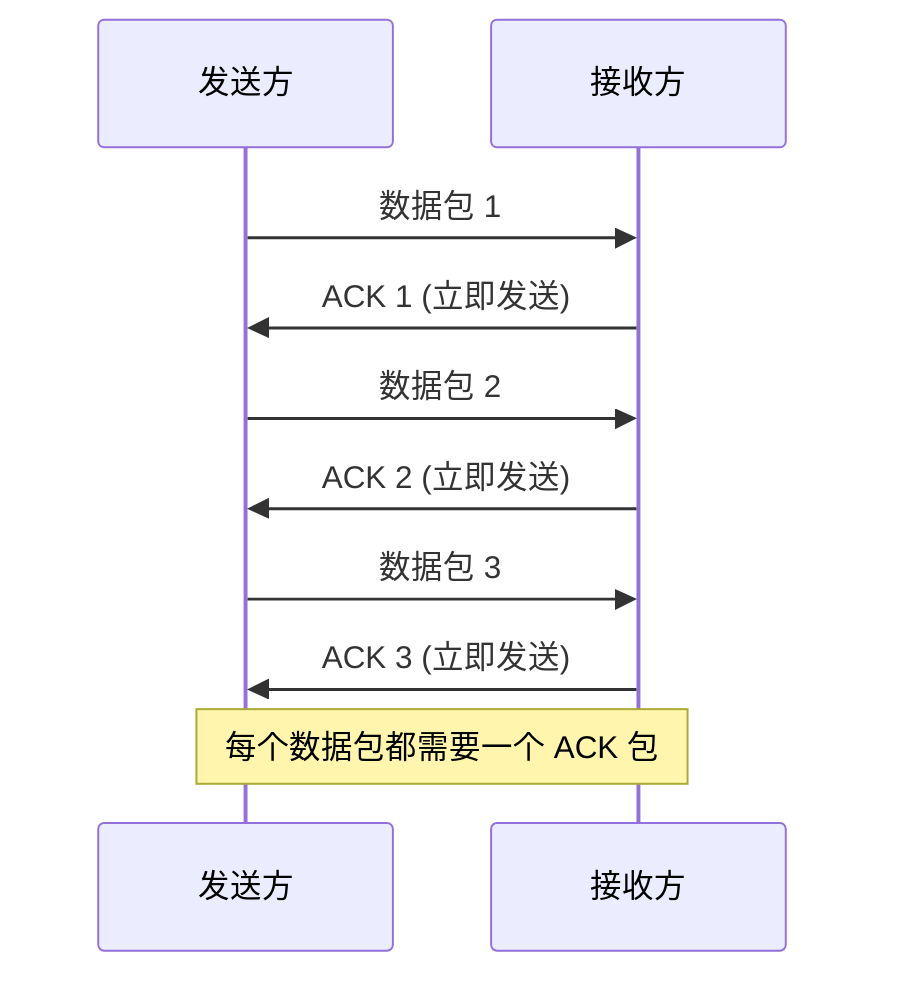
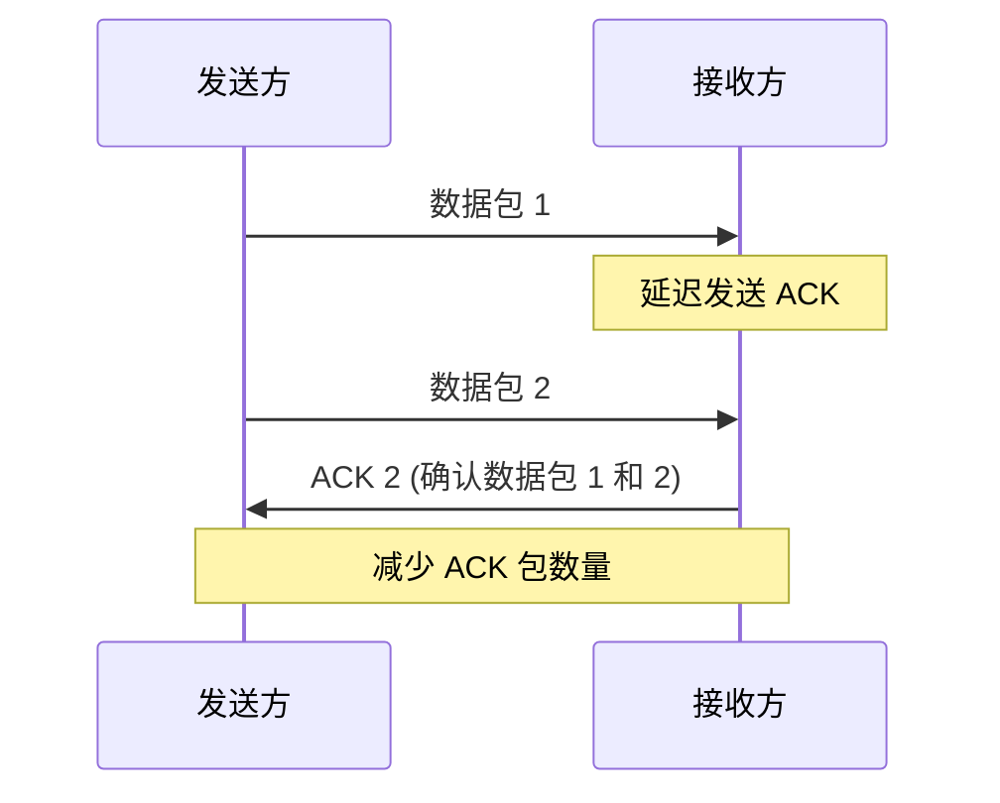
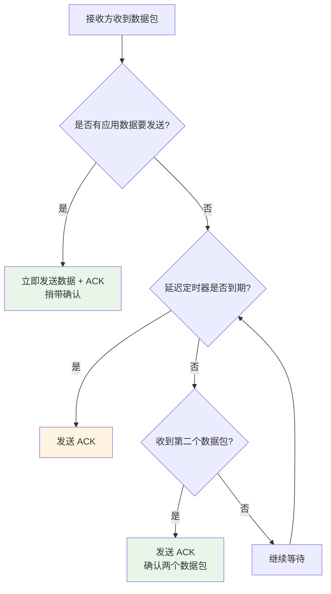
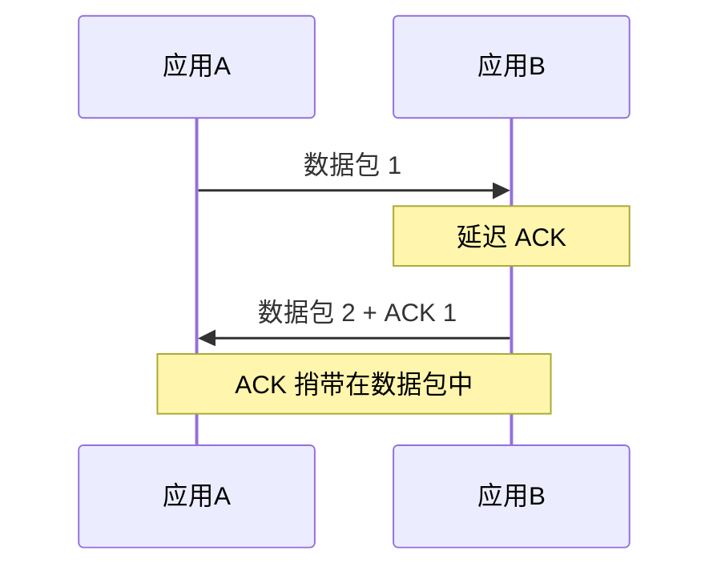
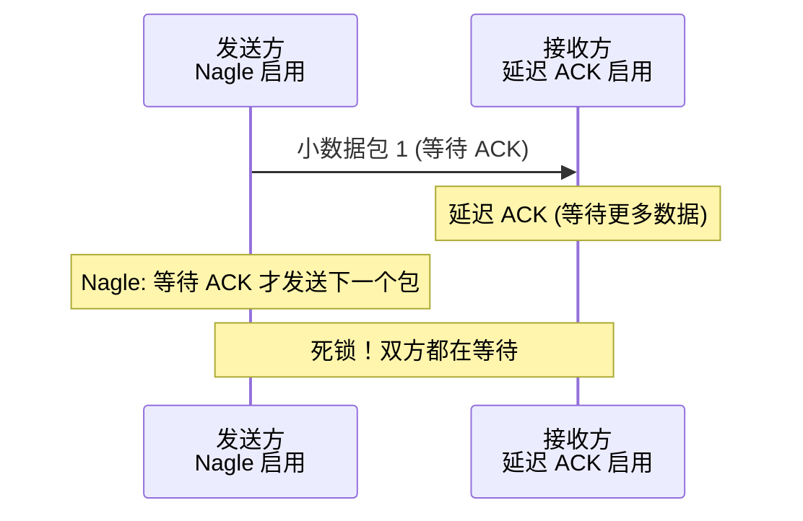
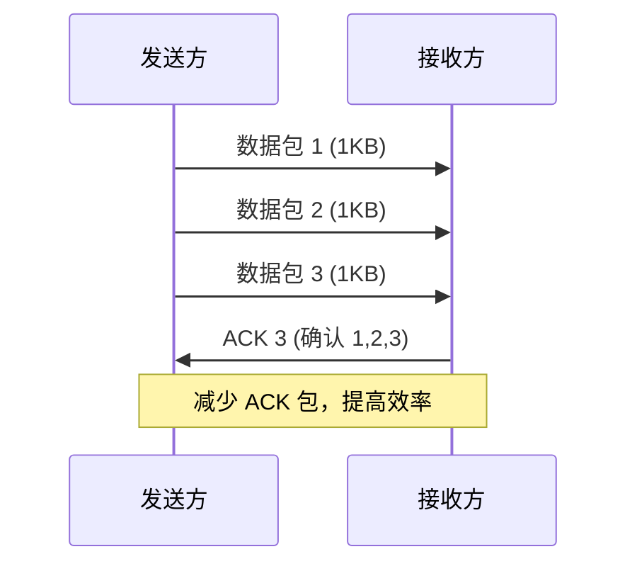
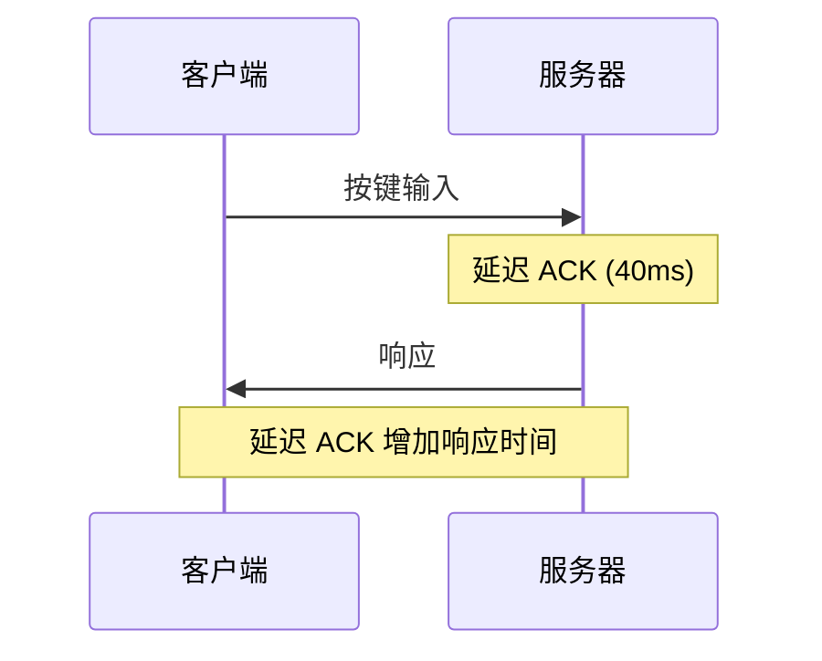
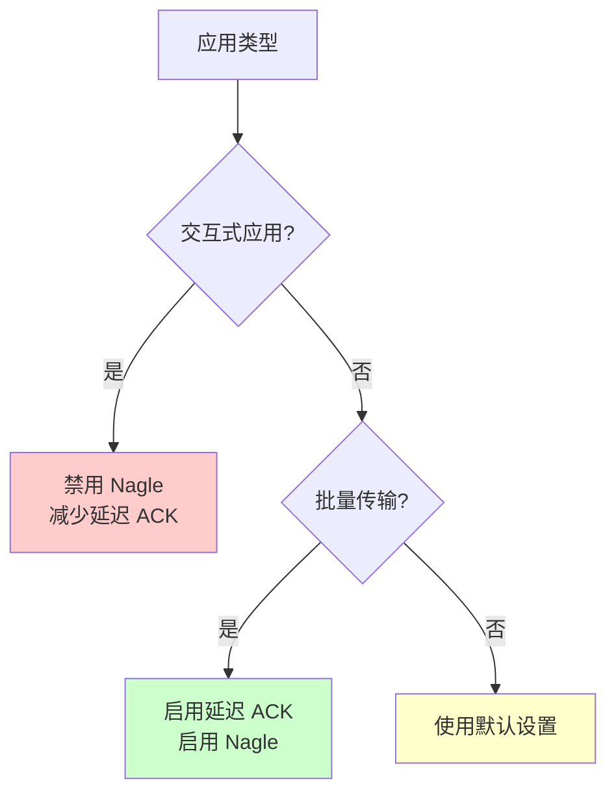
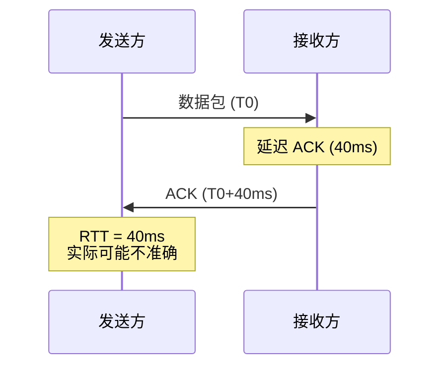

TCP 延迟 ACK（Delayed ACK）是 TCP 协议中的一个重要优化机制。它通过延迟发送确认（ACK）数据包，将 ACK 与数据一起发送，从而减少网络中的数据包数量，提高网络效率。

# 延迟 ACK 的基本概念

## 什么是延迟 ACK

延迟 ACK 是指接收方在收到数据包后，不立即发送 ACK，而是等待一段时间（通常为 40-200ms），期望在这段时间内：
1. 有应用层数据需要发送，可以将 ACK 与数据一起发送（捎带 ACK）
2. 收到更多的数据包，可以合并多个 ACK

## 标准 ACK vs 延迟 ACK

### 标准 ACK（立即确认）



### 延迟 ACK（延迟确认）



## 延迟 ACK 的工作原理



### 延迟 ACK 的触发条件

延迟 ACK 在以下情况下会被发送：

1. **延迟定时器到期**（通常 40-200ms）
   - 如果延迟时间内没有其他数据包到达
   - 没有应用数据要发送
   - 定时器到期后必须发送 ACK

2. **收到第二个数据包**
   - 收到两个数据包后，必须发送 ACK
   - 可以确认两个数据包（累积确认）

3. **有应用数据要发送**
   - 立即发送数据，捎带 ACK
   - 这是最理想的情况（捎带确认）

4. **收到乱序数据包**
   - 收到乱序数据包时，立即发送 ACK
   - 通知发送方重传

# 为什么需要延迟 ACK

## 减少网络数据包数量

**问题：** 在交互式应用中，如果每个数据包都立即确认，会产生大量的 ACK 包。

**示例：**
- 发送方发送 100 个数据包
- 标准 ACK：需要 100 个 ACK 包
- 延迟 ACK：可能只需要 50 个 ACK 包（合并确认）

## 提高网络利用率

延迟 ACK 可以：
1. **减少网络拥塞**：更少的数据包意味着更少的网络拥塞
2. **提高带宽利用率**：将 ACK 与数据合并，减少开销
3. **降低处理开销**：减少数据包处理次数

## 捎带确认（Piggybacking）

最理想的情况是将 ACK 与数据一起发送：



# 延迟 ACK 的配置

## Linux 系统配置

### 查看当前配置

```sh
# 查看 TCP 延迟 ACK 相关参数
➜ sysctl -a | grep tcp_delack
net.ipv4.tcp_delack_min = 40
net.ipv4.tcp_delack_seg = 0

# 查看所有 TCP 相关参数
➜ sysctl -a | grep tcp | grep ack
```

### 配置参数说明

| 参数 | 默认值 | 说明 |
|------|--------|------|
| `net.ipv4.tcp_delack_min` | 40ms | 延迟 ACK 的最小延迟时间 |
| `net.ipv4.tcp_delack_seg` | 0 | 收到多少个数据包后必须发送 ACK（0 表示使用默认值 2） |

### 修改配置

```sh
# 临时修改（重启后失效）
sudo sysctl -w net.ipv4.tcp_delack_min=100

# 永久修改（写入配置文件）
echo "net.ipv4.tcp_delack_min = 100" >> /etc/sysctl.conf
sudo sysctl -p

# 禁用延迟 ACK（设置为 0，不推荐）
sudo sysctl -w net.ipv4.tcp_delack_min=0
```

## 应用程序配置

### 使用 TCP_NODELAY 选项

```c
#include <sys/socket.h>
#include <netinet/tcp.h>

int sock = socket(AF_INET, SOCK_STREAM, 0);

// 禁用 Nagle 算法（可能影响延迟 ACK 行为）
int flag = 1;
setsockopt(sock, IPPROTO_TCP, TCP_NODELAY, &flag, sizeof(flag));

// 设置延迟 ACK（某些系统支持）
int delack = 100;  // 100ms
setsockopt(sock, IPPROTO_TCP, TCP_QUICKACK, &delack, sizeof(delack));
```

### TCP_QUICKACK 选项

```c
// 启用快速 ACK（禁用延迟 ACK）
int quickack = 1;
setsockopt(sock, IPPROTO_TCP, TCP_QUICKACK, &quickack, sizeof(quickack));

// 禁用快速 ACK（启用延迟 ACK）
int quickack = 0;
setsockopt(sock, IPPROTO_TCP, TCP_QUICKACK, &quickack, sizeof(quickack));
```

# 延迟 ACK 与 Nagle 算法的交互

## Nagle 算法

Nagle 算法是发送方的优化算法：
- 如果发送缓冲区中有未确认的数据，且新数据小于 MSS，则延迟发送
- 等待 ACK 或数据积累到 MSS 大小

## 延迟 ACK 与 Nagle 算法的死锁

当延迟 ACK 和 Nagle 算法同时启用时，可能产生死锁：



### 死锁场景

1. **发送方**：发送小数据包，等待 ACK 后才发送下一个包（Nagle）
2. **接收方**：收到数据包，延迟发送 ACK，等待更多数据包
3. **结果**：双方都在等待，产生延迟

### 解决方案

#### 方案 1：禁用 Nagle 算法（推荐）

```c
int flag = 1;
setsockopt(sock, IPPROTO_TCP, TCP_NODELAY, &flag, sizeof(flag));
```

**适用场景：**
- 交互式应用（SSH、Telnet）
- 实时应用（游戏、视频通话）
- 小数据包频繁发送

#### 方案 2：禁用延迟 ACK（不推荐）

```c
int quickack = 1;
setsockopt(sock, IPPROTO_TCP, TCP_QUICKACK, &quickack, sizeof(quickack));
```

**缺点：**
- 增加网络数据包数量
- 降低网络效率

#### 方案 3：调整延迟时间

```sh
# 减少延迟 ACK 时间
sudo sysctl -w net.ipv4.tcp_delack_min=20
```

# 延迟 ACK 的优缺点

## 优点

1. **减少网络数据包**
   - 减少 ACK 包数量
   - 降低网络拥塞

2. **提高带宽利用率**
   - ACK 捎带在数据包中
   - 减少协议开销

3. **降低处理开销**
   - 减少数据包处理次数
   - 降低 CPU 使用率

4. **适合批量传输**
   - 大文件传输时效果明显
   - 减少网络往返次数

## 缺点

1. **增加延迟**
   - 延迟 ACK 会增加响应时间
   - 不适合低延迟应用

2. **可能产生死锁**
   - 与 Nagle 算法交互可能产生死锁
   - 需要合理配置

3. **不适合交互式应用**
   - 交互式应用需要快速响应
   - 延迟 ACK 可能影响用户体验

4. **可能影响拥塞控制**
   - 延迟 ACK 可能影响 RTT 测量
   - 影响拥塞窗口调整

# 实际应用场景

## 适合延迟 ACK 的场景

### 1. 大文件传输



**优势：**
- 数据包连续到达
- 可以合并多个 ACK
- 显著减少网络数据包

### 2. 批量数据传输

- 数据库批量插入
- 日志批量写入
- 批量文件上传

### 3. 高吞吐量应用

- 视频流传输
- 大文件下载
- 数据备份

## 不适合延迟 ACK 的场景

### 1. 交互式应用



**问题：**
- SSH、Telnet 等交互式应用
- 需要快速响应
- 延迟 ACK 会增加延迟

**解决方案：**
- 禁用 Nagle 算法
- 使用 TCP_QUICKACK

### 2. 实时应用

- 在线游戏
- 视频通话
- 实时交易系统

### 3. 小数据包频繁发送

- 心跳包
- 控制消息
- 状态更新

# 延迟 ACK 的调优

## 性能调优策略

### 1. 根据应用类型调整

```sh
# 交互式应用：减少延迟
sudo sysctl -w net.ipv4.tcp_delack_min=20

# 批量传输：增加延迟（提高效率）
sudo sysctl -w net.ipv4.tcp_delack_min=100
```

### 2. 监控和测量

```sh
# 使用 tcpdump 查看 ACK 行为
sudo tcpdump -i eth0 -n 'tcp[tcpflags] & tcp-ack != 0'

# 使用 wireshark 分析
# 查看 ACK 延迟时间
# Statistics -> TCP Stream Graph -> Time Sequence
```

### 3. 应用程序优化

```c
// 对于交互式应用
int flag = 1;
setsockopt(sock, IPPROTO_TCP, TCP_NODELAY, &flag, sizeof(flag));

// 对于批量传输，保持默认设置
// 延迟 ACK 会自动优化
```

## 调优建议

| 应用类型 | 延迟 ACK 设置 | Nagle 算法 | 说明 |
|---------|--------------|-----------|------|
| **交互式应用** | 禁用或短延迟 | 禁用 | 需要快速响应 |
| **批量传输** | 启用（默认） | 启用（默认） | 提高效率 |
| **实时应用** | 禁用 | 禁用 | 低延迟要求 |
| **高吞吐量** | 启用（默认） | 启用（默认） | 最大化吞吐量 |

# 延迟 ACK 的检测和诊断

## 使用 tcpdump 检测

```sh
# 捕获 TCP 数据包
sudo tcpdump -i eth0 -n tcp

# 查看 ACK 延迟
# 观察数据包和 ACK 之间的时间间隔

# 示例输出：
# 10:00:00.100 IP host1 > host2: TCP seq=1, ack=1
# 10:00:00.140 IP host2 > host1: TCP ack=2
# 延迟：40ms
```

## 使用 wireshark 分析

1. **捕获数据包**
2. **查看 TCP 流图**
   - Statistics -> TCP Stream Graph -> Time Sequence
3. **分析 ACK 延迟**
   - 观察数据包和 ACK 的时间间隔
   - 识别延迟 ACK 模式

## 使用 ss 命令查看

```sh
# 查看 TCP 连接状态
ss -i

# 查看 TCP 选项
ss -o

# 查看延迟 ACK 相关信息
ss -i -e
```

## 使用 netstat 查看

```sh
# 查看 TCP 连接详细信息
netstat -o

# 查看 TCP 选项
netstat -v
```

# 常见问题和解决方案

## 问题 1：交互式应用响应慢

**症状：**
- SSH 输入延迟
- Telnet 响应慢
- 交互式应用卡顿

**原因：**
- 延迟 ACK 与 Nagle 算法交互
- 延迟 ACK 增加响应时间

**解决方案：**

```c
// 在应用程序中禁用 Nagle
int flag = 1;
setsockopt(sock, IPPROTO_TCP, TCP_NODELAY, &flag, sizeof(flag));
```

或者：

```sh
# 系统级别减少延迟
sudo sysctl -w net.ipv4.tcp_delack_min=20
```

## 问题 2：网络吞吐量低

**症状：**
- 大文件传输慢
- 网络利用率低
- 大量小数据包

**原因：**
- 延迟 ACK 配置不当
- Nagle 算法被禁用

**解决方案：**

```sh
# 启用延迟 ACK（默认已启用）
# 确保 Nagle 算法启用（默认已启用）

# 检查配置
sysctl net.ipv4.tcp_delack_min
```

## 问题 3：延迟 ACK 与 Nagle 死锁

**症状：**
- 数据传输卡住
- 网络连接正常但无数据传输
- 延迟很高

**原因：**
- 延迟 ACK 和 Nagle 算法同时启用
- 双方都在等待

**解决方案：**

```c
// 禁用 Nagle 算法（推荐）
int flag = 1;
setsockopt(sock, IPPROTO_TCP, TCP_NODELAY, &flag, sizeof(flag));
```

## 问题 4：ACK 延迟过长

**症状：**
- ACK 延迟超过 200ms
- 影响应用性能

**原因：**
- 延迟 ACK 时间配置过长
- 系统负载高

**解决方案：**

```sh
# 减少延迟时间
sudo sysctl -w net.ipv4.tcp_delack_min=40

# 检查系统负载
top
iostat
```

# 延迟 ACK 的最佳实践

## 1. 根据应用类型选择策略



## 2. 监控和调优

1. **监控网络性能**
   - 使用 tcpdump/wireshark 分析
   - 监控 ACK 延迟时间
   - 观察网络吞吐量

2. **根据实际情况调整**
   - 交互式应用：减少延迟
   - 批量传输：保持默认或增加延迟
   - 实时应用：禁用延迟 ACK

3. **测试和验证**
   - 修改前后进行性能测试
   - 验证延迟和吞吐量的变化
   - 确保不影响应用功能

## 3. 应用程序设计

```c
// 交互式应用
void setup_interactive_socket(int sock) {
    int flag = 1;
    // 禁用 Nagle，减少延迟
    setsockopt(sock, IPPROTO_TCP, TCP_NODELAY, &flag, sizeof(flag));
}

// 批量传输应用
void setup_bulk_socket(int sock) {
    // 使用默认设置
    // 延迟 ACK 和 Nagle 会自动优化
}

// 实时应用
void setup_realtime_socket(int sock) {
    int flag = 1;
    int quickack = 1;
    
    // 禁用 Nagle
    setsockopt(sock, IPPROTO_TCP, TCP_NODELAY, &flag, sizeof(flag));
    // 禁用延迟 ACK
    setsockopt(sock, IPPROTO_TCP, TCP_QUICKACK, &quickack, sizeof(quickack));
}
```

# 延迟 ACK 与拥塞控制

## 对 RTT 测量的影响

延迟 ACK 可能影响往返时间（RTT）的测量：



**影响：**
- RTT 测量可能不准确
- 影响拥塞窗口调整
- 可能影响 TCP 性能

## 对拥塞窗口的影响

延迟 ACK 可能影响拥塞窗口的增长：

1. **ACK 频率降低**
   - 拥塞窗口增长依赖于 ACK
   - 延迟 ACK 减少 ACK 频率
   - 可能减缓拥塞窗口增长

2. **批量确认**
   - 一个 ACK 确认多个数据包
   - 拥塞窗口可能增长更快
   - 取决于具体实现

# 总结

TCP 延迟 ACK 是一个重要的网络优化机制：

## 核心要点

1. **目的**：减少网络数据包，提高效率
2. **机制**：延迟发送 ACK，期望捎带或合并
3. **权衡**：在延迟和效率之间平衡
4. **交互**：与 Nagle 算法可能产生死锁

## 使用建议

- **交互式应用**：禁用 Nagle，减少延迟 ACK
- **批量传输**：保持默认设置，利用延迟 ACK
- **实时应用**：禁用延迟 ACK，追求低延迟
- **通用应用**：使用默认设置，让系统自动优化

## 调优原则

1. **测量优先**：先测量，再调优
2. **应用导向**：根据应用类型选择策略
3. **平衡权衡**：在延迟和效率之间找到平衡
4. **持续监控**：调优后持续监控性能

理解延迟 ACK 的工作原理和调优方法，对于网络性能优化和问题诊断都非常重要。

# 参考文献

* [RFC 1122 - Requirements for Internet Hosts](https://tools.ietf.org/html/rfc1122)
* [RFC 5681 - TCP Congestion Control](https://tools.ietf.org/html/rfc5681)
* [TCP/IP Illustrated, Volume 1](https://www.kohala.com/start/tcpipiv1.html)
* [Linux TCP/IP Stack](https://www.kernel.org/doc/html/latest/networking/)

