# 什么是 UDP

UDP（User Datagram Protocol，用户数据报协议）是传输层的一个重要协议，提供无连接、不可靠的数据报传输服务。

## UDP 的特点

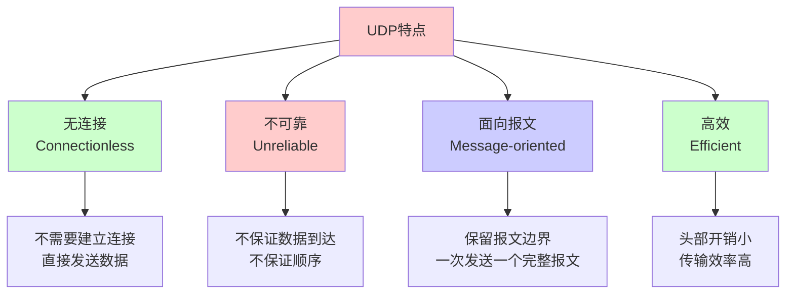

### 1. 无连接（Connectionless）

- **定义**：UDP 在发送数据前不需要建立连接
- **特点**：直接发送数据报，无需握手过程
- **优势**：减少延迟，提高效率
- **劣势**：无法保证数据到达

### 2. 不可靠（Unreliable）

- **定义**：UDP 不提供可靠性保证
- **特点**：
  - 不保证数据报能成功到达
  - 不保证数据报按顺序到达
  - 不保证数据报不重复
  - 不提供流量控制和拥塞控制
- **影响**：应用层需要自己实现可靠性机制

### 3. 面向报文（Message-oriented）

- **定义**：UDP 保留应用层数据的边界
- **特点**：一次发送一个完整的报文，接收方一次接收一个完整的报文
- **对比**：TCP 是面向字节流的，不保留边界

### 4. 高效（Efficient）

- **头部开销小**：UDP 头部只有 8 字节
- **无状态**：不需要维护连接状态
- **无重传**：不需要重传丢失的数据
- **无流量控制**：不需要复杂的流量控制机制

## UDP 在协议栈中的位置

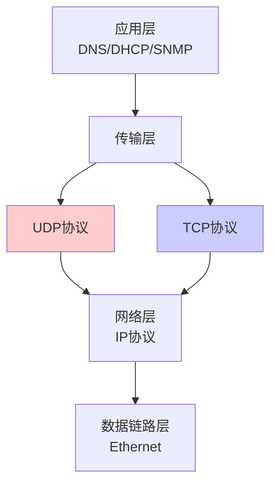

## UDP 的适用场景

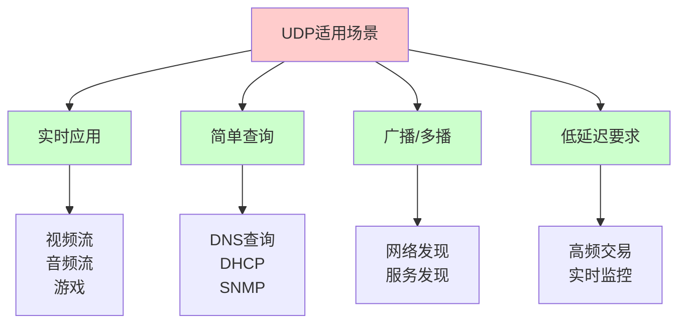

# UDP 报文格式

## 头部结构

UDP 头部非常简单，固定为 8 字节，包含 4 个字段。

### 头部字段布局

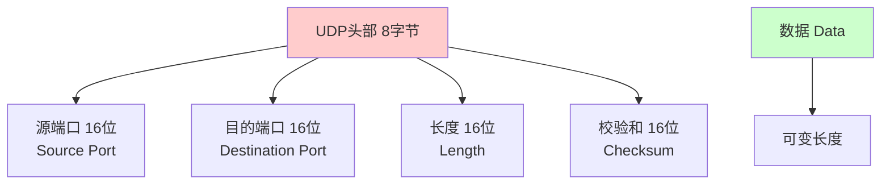

### 详细字段说明

| 字段 | 位数 | 说明 | 示例 |
|------|------|------|------|
| **源端口（Source Port）** | 16 | 发送方的端口号 | 12345 |
| **目的端口（Destination Port）** | 16 | 接收方的端口号 | 53（DNS） |
| **长度（Length）** | 16 | UDP 头部和数据的总长度（字节） | 28 |
| **校验和（Checksum）** | 16 | UDP 头部和数据的校验和 | 0xABCD |

### 头部结构图

```text
0                   1                   2                   3 
0 1 2 3 4 5 6 7 8 9 0 1 2 3 4 5 6 7 8 9 0 1 2 3 4 5 6 7 8 9 0 1 
+-+-+-+-+-+-+-+-+-+-+-+-+-+-+-+-+-+-+-+-+-+-+-+-+-+-+-+-+-+-+-+-+
|          Source Port          |       Destination Port        |
+-+-+-+-+-+-+-+-+-+-+-+-+-+-+-+-+-+-+-+-+-+-+-+-+-+-+-+-+-+-+-+-+
|            Length             |           Checksum            |
+-+-+-+-+-+-+-+-+-+-+-+-+-+-+-+-+-+-+-+-+-+-+-+-+-+-+-+-+-+-+-+-+
|                             Data                               |
+-+-+-+-+-+-+-+-+-+-+-+-+-+-+-+-+-+-+-+-+-+-+-+-+-+-+-+-+-+-+-+-+
```

### Mermaid 数据包图

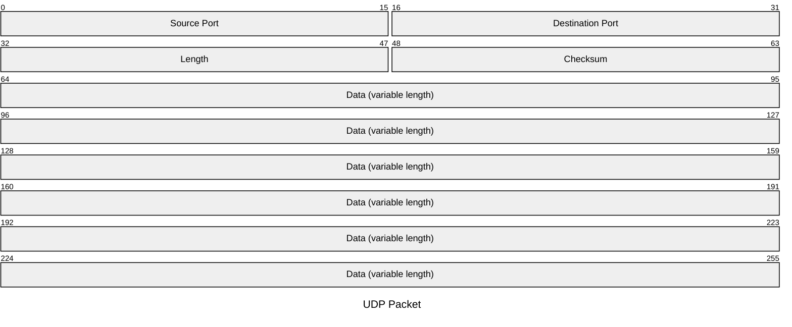

## 字段详细说明

### 1. 源端口（Source Port）

- **作用**：标识发送方的应用程序
- **范围**：0-65535
- **特点**：
  - 客户端通常使用随机端口
  - 服务器使用知名端口（0-1023）
  - 可选字段，可以为 0（表示不指定）

### 2. 目的端口（Destination Port）

- **作用**：标识接收方的应用程序
- **范围**：0-65535
- **特点**：
  - 必须指定
  - 用于将数据报交付给正确的应用程序

### 3. 长度（Length）

- **作用**：指定 UDP 头部和数据的总长度
- **范围**：8-65535 字节
- **计算**：长度 = 8（头部）+ 数据长度
- **最小值**：8 字节（只有头部，无数据）

### 4. 校验和（Checksum）

- **作用**：检测 UDP 头部和数据在传输过程中是否损坏
- **计算**：包括伪头部、UDP 头部和数据
- **可选**：可以为 0（表示不计算校验和，不推荐）

## 伪头部（Pseudo Header）

UDP 校验和计算时使用伪头部，包含 IP 层信息。

### 伪头部结构

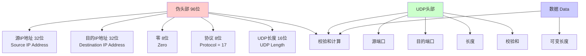

### 伪头部字段

| 字段 | 位数 | 说明 |
|------|------|------|
| **源 IP 地址** | 32 | 发送方的 IP 地址 |
| **目的 IP 地址** | 32 | 接收方的 IP 地址 |
| **零** | 8 | 必须为 0 |
| **协议** | 8 | UDP 协议号为 17 |
| **UDP 长度** | 16 | UDP 头部和数据的长度 |

### 校验和计算

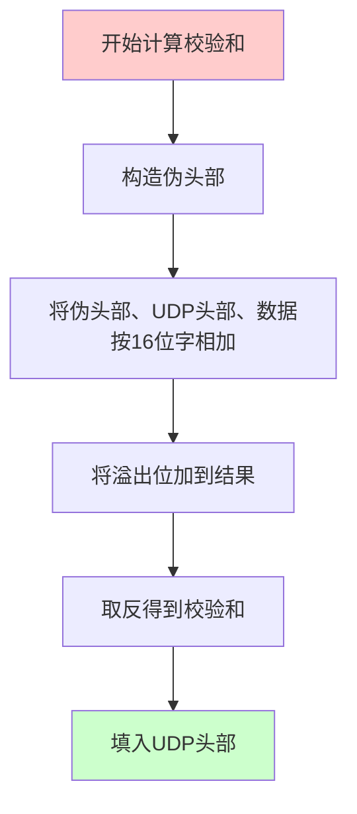

**计算步骤**：
1. 构造伪头部（12 字节）
2. 将伪头部、UDP 头部、数据按 16 位字相加
3. 将溢出位（进位）加到结果
4. 对结果取反（按位取反）
5. 将结果填入 UDP 头部的校验和字段

# UDP vs TCP 对比

## 详细对比表

| 特性 | UDP | TCP |
|------|-----|-----|
| **连接** | 无连接 | 面向连接 |
| **可靠性** | 不可靠 | 可靠 |
| **传输方式** | 面向报文 | 面向字节流 |
| **头部大小** | 8 字节 | 20-60 字节 |
| **传输效率** | 高 | 较低 |
| **延迟** | 低 | 较高 |
| **流量控制** | 无 | 有（滑动窗口） |
| **拥塞控制** | 无 | 有（慢启动、拥塞避免等） |
| **顺序保证** | 无 | 有 |
| **重传机制** | 无 | 有 |
| **适用场景** | 实时应用、简单查询 | 文件传输、Web 浏览 |

## 选择指南

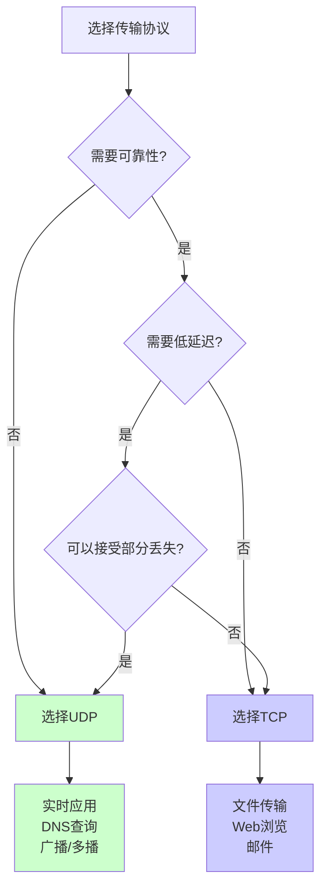

## 性能对比

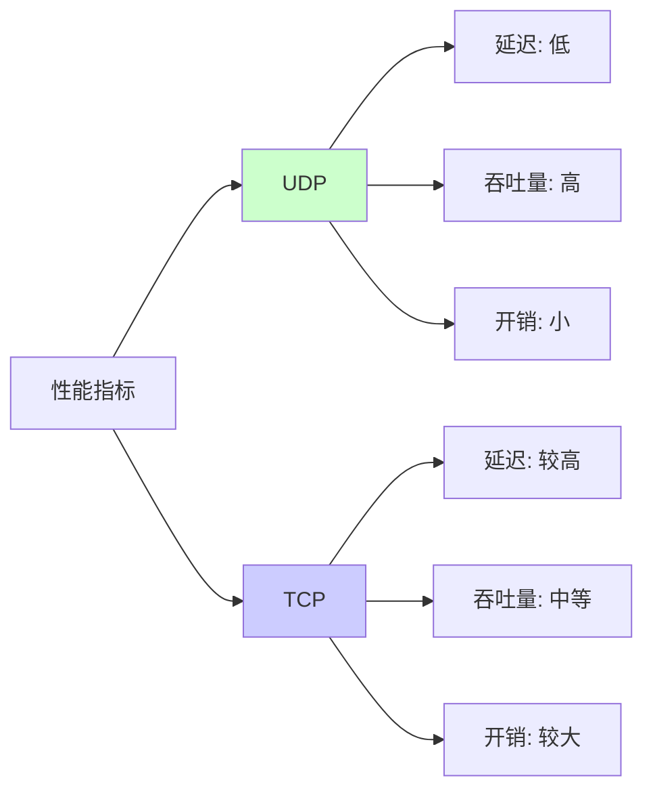

# UDP 使用场景

## 1. DNS（域名系统）

DNS 查询使用 UDP，因为：
- 查询请求小，响应快
- 不需要建立连接，减少延迟
- 查询失败可以重试

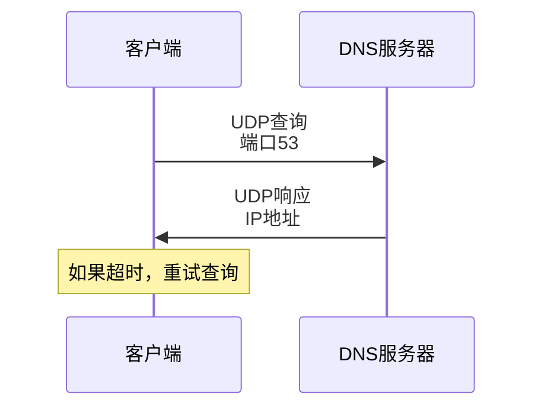

## 2. DHCP（动态主机配置协议）

DHCP 使用 UDP，因为：
- 客户端可能没有 IP 地址
- 需要广播/多播支持
- 配置信息简单

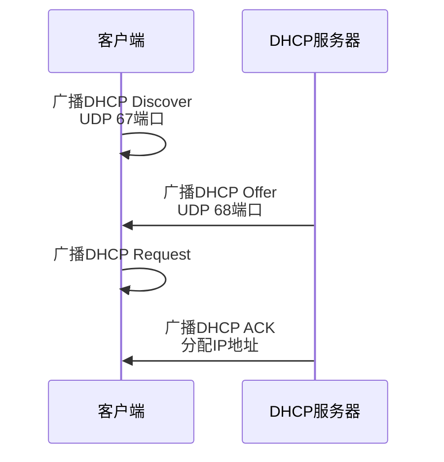

## 3. 实时音视频传输

视频流、音频流使用 UDP，因为：
- 对延迟敏感
- 可以容忍少量数据丢失
- 需要高吞吐量

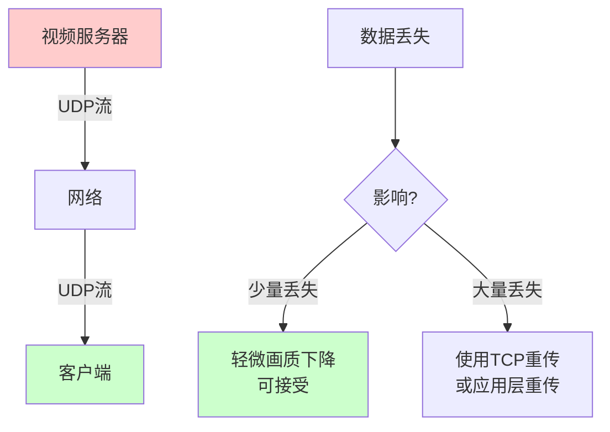

## 4. 网络游戏

在线游戏使用 UDP，因为：
- 需要低延迟
- 实时性要求高
- 可以容忍少量数据丢失
- 状态更新频繁

## 5. SNMP（简单网络管理协议）

SNMP 使用 UDP，因为：
- 查询操作简单
- 不需要可靠传输
- 管理信息传输量小

## 6. 广播和多播

UDP 支持广播和多播，TCP 不支持：

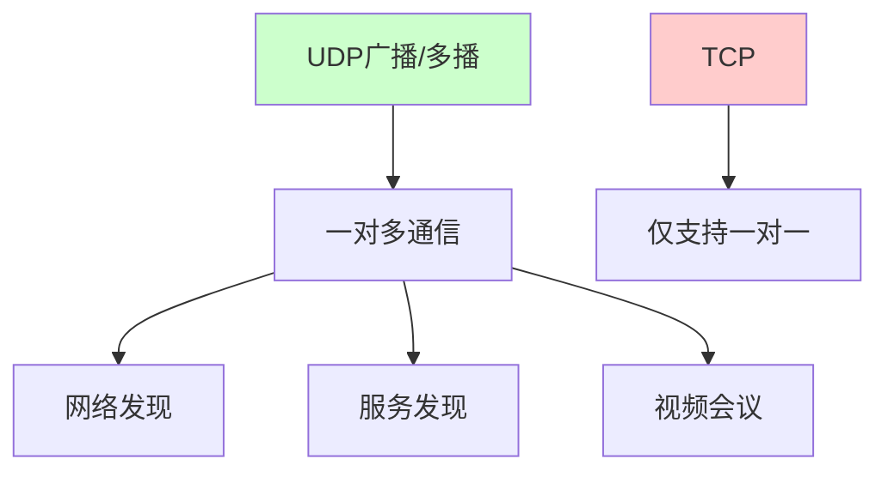

# UDP 编程示例

## Go 语言 UDP 服务器

```go
package main

import (
    "fmt"
    "net"
    "time"
)

func main() {
    // 创建 UDP 地址
    addr, err := net.ResolveUDPAddr("udp", ":8080")
    if err != nil {
        fmt.Printf("ResolveUDPAddr failed: %v\n", err)
        return
    }
    
    // 创建 UDP 连接
    conn, err := net.ListenUDP("udp", addr)
    if err != nil {
        fmt.Printf("ListenUDP failed: %v\n", err)
        return
    }
    defer conn.Close()
    
    fmt.Println("UDP Server listening on :8080")
    
    // 设置读取超时
    conn.SetReadDeadline(time.Now().Add(10 * time.Second))
    
    // 接收数据
    buffer := make([]byte, 1024)
    for {
        n, clientAddr, err := conn.ReadFromUDP(buffer)
        if err != nil {
            if netErr, ok := err.(net.Error); ok && netErr.Timeout() {
                fmt.Println("Read timeout")
                break
            }
            fmt.Printf("ReadFromUDP failed: %v\n", err)
            continue
        }
        
        fmt.Printf("Received %d bytes from %s: %s\n", 
                   n, clientAddr.String(), string(buffer[:n]))
        
        // 回显数据
        _, err = conn.WriteToUDP(buffer[:n], clientAddr)
        if err != nil {
            fmt.Printf("WriteToUDP failed: %v\n", err)
        }
    }
}
```

## Go 语言 UDP 客户端

```go
package main

import (
    "fmt"
    "net"
    "time"
)

func main() {
    // 创建 UDP 地址
    serverAddr, err := net.ResolveUDPAddr("udp", "localhost:8080")
    if err != nil {
        fmt.Printf("ResolveUDPAddr failed: %v\n", err)
        return
    }
    
    // 创建 UDP 连接
    conn, err := net.DialUDP("udp", nil, serverAddr)
    if err != nil {
        fmt.Printf("DialUDP failed: %v\n", err)
        return
    }
    defer conn.Close()
    
    // 发送数据
    message := []byte("Hello, UDP Server!")
    _, err = conn.Write(message)
    if err != nil {
        fmt.Printf("Write failed: %v\n", err)
        return
    }
    
    // 设置读取超时
    conn.SetReadDeadline(time.Now().Add(5 * time.Second))
    
    // 接收响应
    buffer := make([]byte, 1024)
    n, err := conn.Read(buffer)
    if err != nil {
        fmt.Printf("Read failed: %v\n", err)
        return
    }
    
    fmt.Printf("Received: %s\n", string(buffer[:n]))
}
```

## Python UDP 服务器

```python
import socket

# 创建 UDP socket
sock = socket.socket(socket.AF_INET, socket.SOCK_DGRAM)

# 绑定地址
server_address = ('localhost', 8080)
sock.bind(server_address)

print(f"UDP Server listening on {server_address}")

while True:
    # 接收数据
    data, client_address = sock.recvfrom(1024)
    print(f"Received {len(data)} bytes from {client_address}: {data.decode()}")
    
    # 回显数据
    sock.sendto(data, client_address)
```

## Python UDP 客户端

```python
import socket

# 创建 UDP socket
sock = socket.socket(socket.AF_INET, socket.SOCK_DGRAM)

# 服务器地址
server_address = ('localhost', 8080)

# 发送数据
message = b"Hello, UDP Server!"
sock.sendto(message, server_address)

# 接收响应
data, server = sock.recvfrom(1024)
print(f"Received: {data.decode()}")

sock.close()
```

## C 语言 UDP 示例

```c
#include <stdio.h>
#include <stdlib.h>
#include <string.h>
#include <sys/socket.h>
#include <netinet/in.h>
#include <arpa/inet.h>

// UDP 服务器
int udp_server() {
    int sockfd;
    struct sockaddr_in server_addr, client_addr;
    char buffer[1024];
    socklen_t addr_len = sizeof(client_addr);
    
    // 创建 socket
    sockfd = socket(AF_INET, SOCK_DGRAM, 0);
    if (sockfd < 0) {
        perror("socket");
        return -1;
    }
    
    // 设置服务器地址
    memset(&server_addr, 0, sizeof(server_addr));
    server_addr.sin_family = AF_INET;
    server_addr.sin_addr.s_addr = INADDR_ANY;
    server_addr.sin_port = htons(8080);
    
    // 绑定地址
    if (bind(sockfd, (struct sockaddr *)&server_addr, 
             sizeof(server_addr)) < 0) {
        perror("bind");
        close(sockfd);
        return -1;
    }
    
    printf("UDP Server listening on port 8080\n");
    
    // 接收数据
    while (1) {
        int n = recvfrom(sockfd, buffer, sizeof(buffer) - 1, 0,
                        (struct sockaddr *)&client_addr, &addr_len);
        if (n < 0) {
            perror("recvfrom");
            continue;
        }
        
        buffer[n] = '\0';
        printf("Received from %s: %s\n", 
               inet_ntoa(client_addr.sin_addr), buffer);
        
        // 回显数据
        sendto(sockfd, buffer, n, 0,
               (struct sockaddr *)&client_addr, addr_len);
    }
    
    close(sockfd);
    return 0;
}
```

# UDP 的优缺点

## 优点

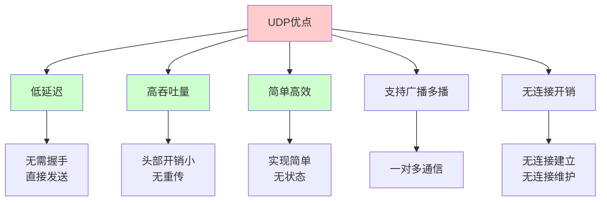

### 1. 低延迟

- 无需建立连接，直接发送数据
- 无握手过程，减少往返时间
- 适合实时应用

### 2. 高吞吐量

- 头部开销小（8 字节）
- 无重传机制，不浪费带宽
- 无流量控制限制

### 3. 简单高效

- 实现简单，无复杂状态机
- 无状态，不需要维护连接
- 资源占用少

### 4. 支持广播和多播

- 可以同时向多个主机发送数据
- 适合服务发现、网络发现等场景

## 缺点

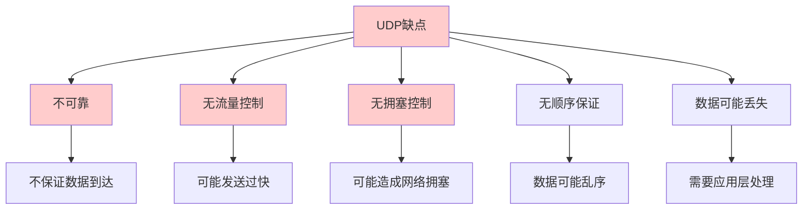

### 1. 不可靠

- 不保证数据报能成功到达
- 不保证数据报按顺序到达
- 不保证数据报不重复

### 2. 无流量控制

- 发送方可能发送过快
- 接收方可能来不及处理
- 可能导致数据丢失

### 3. 无拥塞控制

- 可能造成网络拥塞
- 影响其他网络流量
- 需要应用层实现拥塞控制

### 4. 数据可能丢失

- 网络故障时数据可能丢失
- 需要应用层实现重传机制
- 需要应用层实现可靠性保证

# UDP 可靠性实现

虽然 UDP 本身不可靠，但可以在应用层实现可靠性机制。

## 应用层可靠性方案

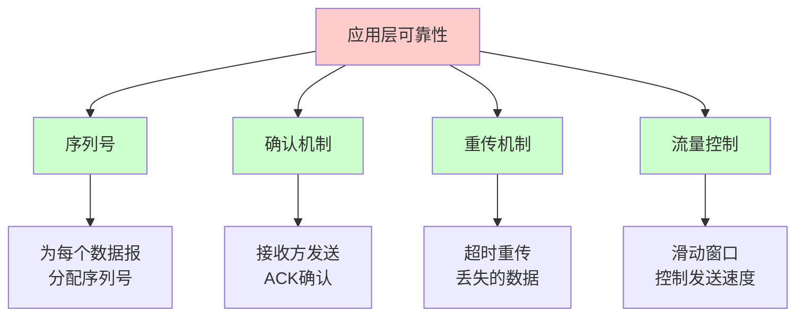

## 实现示例

### 带序列号的 UDP

```go
package main

import (
    "encoding/binary"
    "fmt"
    "net"
    "time"
)

// 数据报结构
type ReliablePacket struct {
    SeqNum  uint32  // 序列号
    Data    []byte  // 数据
}

// 发送带序列号的数据
func sendReliable(conn *net.UDPConn, addr *net.UDPAddr, data []byte, seqNum uint32) error {
    // 构造数据报：序列号（4字节）+ 数据
    packet := make([]byte, 4+len(data))
    binary.BigEndian.PutUint32(packet[0:4], seqNum)
    copy(packet[4:], data)
    
    _, err := conn.WriteToUDP(packet, addr)
    return err
}

// 接收并解析数据
func receiveReliable(conn *net.UDPConn) (*ReliablePacket, *net.UDPAddr, error) {
    buffer := make([]byte, 1024)
    n, addr, err := conn.ReadFromUDP(buffer)
    if err != nil {
        return nil, nil, err
    }
    
    if n < 4 {
        return nil, nil, fmt.Errorf("packet too short")
    }
    
    seqNum := binary.BigEndian.Uint32(buffer[0:4])
    data := make([]byte, n-4)
    copy(data, buffer[4:n])
    
    return &ReliablePacket{
        SeqNum: seqNum,
        Data:   data,
    }, addr, nil
}

// 带确认的发送
func sendWithAck(conn *net.UDPConn, addr *net.UDPAddr, data []byte, seqNum uint32, timeout time.Duration) error {
    // 发送数据
    if err := sendReliable(conn, addr, data, seqNum); err != nil {
        return err
    }
    
    // 等待确认
    conn.SetReadDeadline(time.Now().Add(timeout))
    for {
        packet, recvAddr, err := receiveReliable(conn)
        if err != nil {
            return err  // 超时或错误
        }
        
        // 检查是否是来自目标地址的确认
        if recvAddr.String() != addr.String() {
            continue
        }
        
        // 检查是否是确认（ACK 可以是一个特殊的序列号，如 0xFFFFFFFF）
        // 这里简化处理，实际应该发送 ACK 包
        fmt.Printf("Received ACK for seq %d\n", packet.SeqNum)
        if packet.SeqNum == seqNum {
            return nil  // 收到确认
        }
    }
}
```

# UDP 常见问题

## 1. 数据报丢失

**问题**：UDP 不保证数据报到达，可能丢失。

**解决方案**：
- 应用层实现重传机制
- 使用序列号和确认
- 设置合理的超时时间

## 2. 数据报乱序

**问题**：UDP 不保证数据报按顺序到达。

**解决方案**：
- 使用序列号标识数据报
- 接收方缓存并排序
- 丢弃过期的数据报

## 3. 数据报重复

**问题**：网络重传可能导致数据报重复。

**解决方案**：
- 使用序列号检测重复
- 维护已接收序列号列表
- 丢弃重复的数据报

## 4. 缓冲区溢出

**问题**：接收方缓冲区满，新数据报被丢弃。

**解决方案**：
- 增大接收缓冲区
- 应用层实现流量控制
- 快速处理接收的数据

## 5. 防火墙和 NAT

**问题**：UDP 无连接，NAT 难以维护映射关系。

**解决方案**：
- 使用 STUN/TURN 进行 NAT 穿透
- 保持心跳包维持 NAT 映射
- 使用 UPnP 自动配置端口映射

# UDP 最佳实践

## 1. 数据报大小

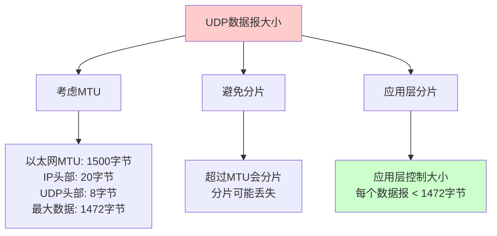

**建议**：
- 单个 UDP 数据报不超过 1472 字节（以太网）
- 如果数据较大，应用层分片
- 使用 Path MTU Discovery 确定合适的 MTU

## 2. 错误处理

```go
// 检查数据报大小
if len(data) > 1472 {
    return fmt.Errorf("data too large for UDP")
}

// 设置超时
conn.SetReadDeadline(time.Now().Add(5 * time.Second))

// 处理超时
data, addr, err := conn.ReadFromUDP(buffer)
if err != nil {
    if netErr, ok := err.(net.Error); ok && netErr.Timeout() {
        // 处理超时
        return
    }
    // 处理其他错误
}
```

## 3. 可靠性实现

如果需要可靠性，考虑：
- 使用现成的可靠 UDP 库（如 QUIC）
- 实现简单的确认和重传机制
- 使用序列号保证顺序

## 4. 性能优化

```go
// 1. 增大接收缓冲区
conn.SetReadBuffer(1024 * 1024)  // 1MB

// 2. 使用连接（减少地址解析）
conn, err := net.DialUDP("udp", nil, serverAddr)
// 使用 conn.Write() 而不是 WriteToUDP()

// 3. 批量发送（如果可能）
// 将多个小数据报合并发送
```

# UDP 协议总结

UDP 是传输层的重要协议，具有以下特点：

## 核心特点

- **无连接**：不需要建立连接，直接发送
- **不可靠**：不保证数据到达、顺序、不重复
- **面向报文**：保留应用层数据边界
- **高效**：头部开销小，传输效率高

## 适用场景

- **实时应用**：视频流、音频流、在线游戏
- **简单查询**：DNS、DHCP、SNMP
- **广播/多播**：服务发现、网络发现
- **低延迟要求**：高频交易、实时监控

## 与 TCP 对比

| 方面 | UDP | TCP |
|------|-----|-----|
| 连接 | 无连接 | 面向连接 |
| 可靠性 | 不可靠 | 可靠 |
| 效率 | 高 | 较低 |
| 延迟 | 低 | 较高 |
| 适用场景 | 实时应用 | 文件传输 |

## 使用建议

1. **实时性要求高**：选择 UDP
2. **可靠性要求高**：选择 TCP 或实现应用层可靠性
3. **简单查询**：使用 UDP
4. **大数据传输**：使用 TCP

理解 UDP 协议有助于：
- 选择合适的传输协议
- 设计高效的网络应用
- 实现实时通信系统
- 优化网络性能

# 参考文献

- [RFC 768 - User Datagram Protocol](https://tools.ietf.org/html/rfc768)
- 《Linux高性能服务器编程》
- 《TCP/IP详解 卷1：协议》
