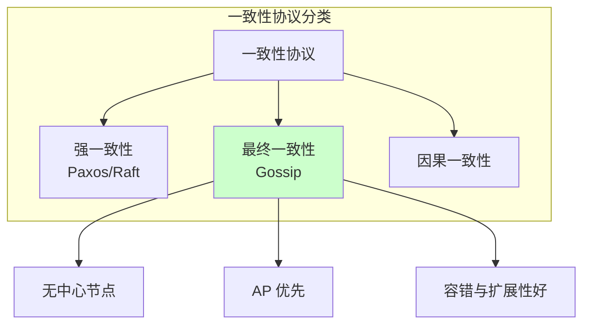
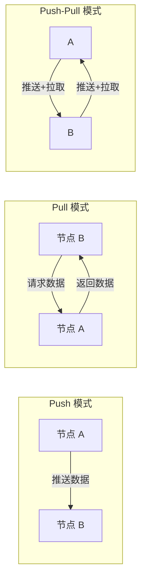
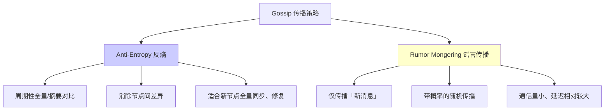
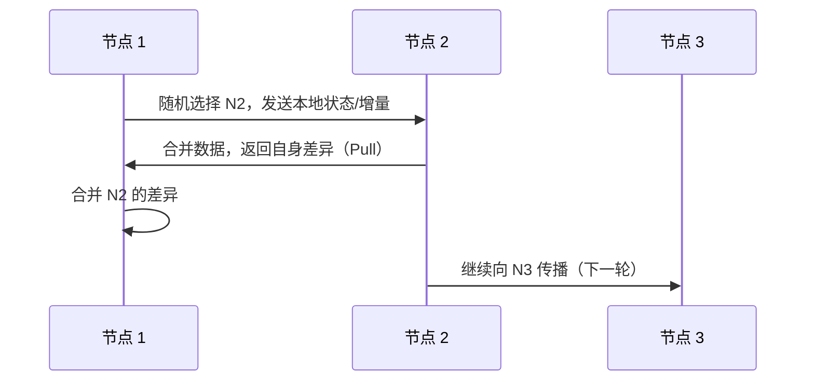
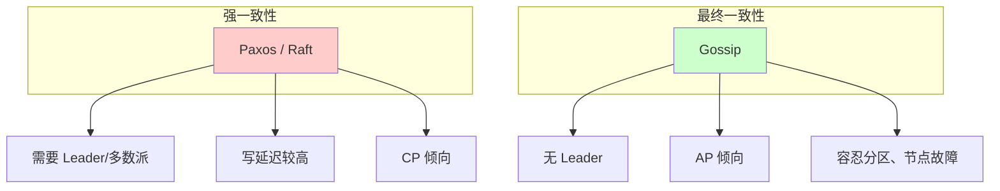
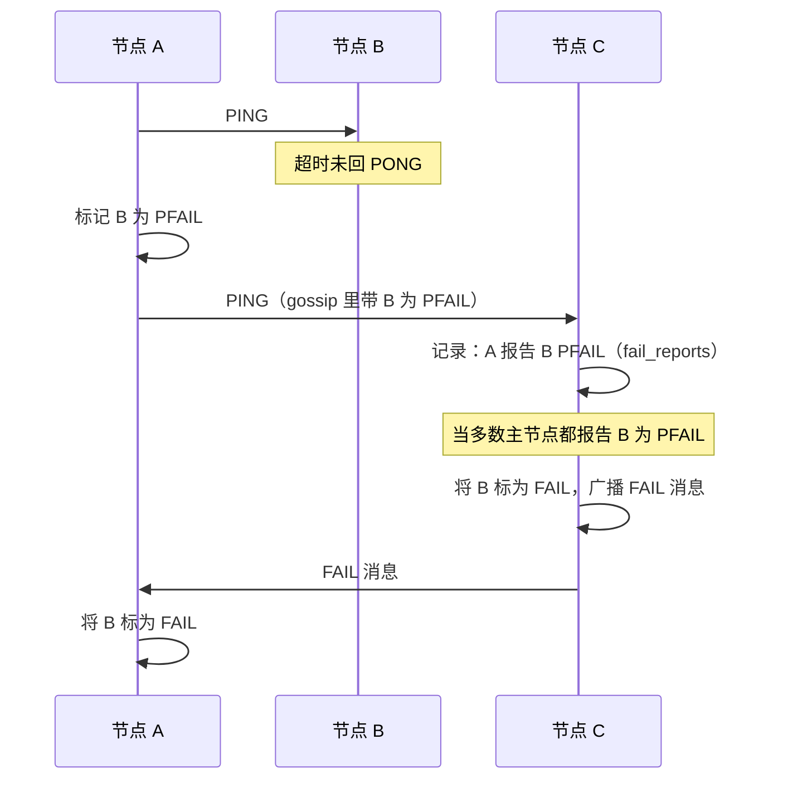

# Gossip 协议概述

Gossip 协议（又称「流言协议」或 Epidemic 协议）是一种**去中心化**的分布式信息传播算法。其思想来源于日常生活中流言、瘟疫的传播方式：每个节点随机选择其他节点交换信息，收到信息的节点再继续向其他节点传播，经过多轮传播后，最终使整个集群中的节点都获得一致的信息，从而实现**最终一致性**。

Gossip 被广泛应用于分布式数据库、服务发现、区块链等场景，如 Redis Cluster、Apache Cassandra、Amazon Dynamo、Consul 等。

## 协议在分布式中的角色



# 核心原理

## 通信模式

Gossip 支持三种通信模式，可单独或组合使用：



| 模式 | 行为 | 优点 | 缺点 |
|------|------|------|------|
| **Push** | 节点主动将本地数据/更新推送给随机选中的节点 | 新数据扩散快 | 通信与冗余较大 |
| **Pull** | 节点主动向随机节点请求数据，对方返回差异 | 通信量小，适合追赶 | 传播较慢 |
| **Push-Pull** | 一次交互中既推送自己的数据又拉取对方数据 | 收敛最快，常用 | 单次交互开销略大 |

实际系统（如 Redis Cluster）多采用 **Push-Pull** 或 Pull 为主、辅以 Push 的混合方式。

## 传播策略

按「交换内容」和「触发方式」可分为两类典型策略：



- **Anti-Entropy（反熵）**：节点周期性地与随机节点交换**全量或摘要**，对比并消除差异。适合做全量同步、新节点加入、数据修复，但通信量较大。
- **Rumor Mongering（谣言传播）**：只传播**增量/新产生的消息**，并以一定概率随机选择节点转发。通信开销小，但消息到达全网需要多轮，存在延迟。

很多系统会同时使用：Rumor 做日常增量同步，Anti-Entropy 做定期「纠偏」或全量修复。

## 基本流程（单轮）



每一轮中，每个节点通常只与**少量**随机节点通信（如 1～3 个），通过多轮传播达到 O(Log N) 轮内覆盖全网。

# 协议特点

## 优势

- **去中心化**：无单点协调者，任意节点可发起或参与传播。
- **高容错**：部分节点宕机或网络分区时，只要存在连通路径，信息仍可逐步扩散。
- **可扩展**：节点数增加时，每个节点通信的邻居数可保持不变，系统负载可水平扩展。
- **最终一致性**：在无持续故障的前提下，经过有限轮传播，所有节点会收敛到相同视图。
- **实现相对简单**：无需复杂选主、日志复制，易于工程实现。

## 劣势

- **延迟**：消息需多轮才能传遍全网，不适合强一致、低延迟场景。
- **冗余**：同一消息可能被同一节点多次接收，需要去重或幂等处理。
- **仅保证最终一致**：某一时刻不同节点可能看到不同状态，不能替代 Paxos/Raft 等强一致协议。

# 与其他一致性协议对比



| 维度 | Gossip | Paxos / Raft |
|------|--------|----------------|
| 一致性 | 最终一致 | 强一致 |
| 中心化 | 无中心 | 有 Leader / 多数派 |
| 延迟 | 多轮传播，延迟较高 | 一次共识轮次，延迟相对可控 |
| 适用场景 | 成员管理、元数据、状态同步 | 日志复制、选主、关键状态机 |

# 实际应用

## Redis Cluster

Redis Cluster 使用 Gossip 进行：

- **集群元信息传播**：节点列表、槽位分配、主从关系等。
- **故障检测与转移**：通过心跳与 Gossip 判定节点 PFAIL/FAIL，并触发主从切换。
- **配置收敛**：新节点加入、节点下线后，各节点通过 Gossip 最终得到一致的集群视图。

### Redis 是怎么实现的

Redis Cluster 的 Gossip 跑在**集群总线**上，和客户端端口分离，消息是二进制协议，只用于节点间通信。

**集群总线与端口**

- 每个节点开两个 TCP 端口：**客户端端口**（如 6379）和**集群总线端口**（客户端端口 + 10000，如 16379）。
- 所有 PING/PONG/MEET/FAIL 等 Gossip 消息都走集群总线端口，保证与业务流量隔离。

**消息类型（同一格式，type 区分）**

PING、PONG、MEET 在协议里是**同一种消息结构**，仅 `type` 不同；FAIL 等另有结构。

```text
CLUSTERMSG_TYPE_PING  0  // 定时心跳，携带自身状态 + 部分其他节点信息
CLUSTERMSG_TYPE_PONG  1  // 对 PING/MEET 的回复，内容与 PING 类似
CLUSTERMSG_TYPE_MEET  2  // 邀请新节点加入，接收方会把发送方加入 nodes
CLUSTERMSG_TYPE_FAIL  3  // 广播某节点已下线（FAIL）
// 还有 PUBLISH、FAILOVER_AUTH_REQUEST/ACK、UPDATE 等
```

**消息结构（简化）**

- **clusterMsg**（消息头 + 发送方信息）：
  - 头：签名 `"RCmb"`、总长度、协议版本、`type`、`port`/`cport`。
  - 发送方：`sender`（节点名）、`currentEpoch`/`configEpoch`、`myslots`（槽位 bitmap）、`slaveof`、`myip`、`flags` 等。
- **PING/PONG/MEET 的 data**：`clusterMsgDataGossip gossip[]`，每条包含：
  - `nodename`、`ping_sent`、`pong_received`、`ip`、`port`、`cport`、`flags`。
- 即：每次 PING/PONG 既带**自己的**状态（在 header 里），又带**其他若干节点的摘要**（在 gossip 数组里），实现“八卦式”扩散。

**节点本地维护的状态**

- **clusterState**：当前节点视角下的集群状态。
  - `myself`：本节点的 `clusterNode`。
  - `nodes`：字典，节点名 → `clusterNode`（所有已知节点）。
  - `slots[16384]`：槽 → 负责该槽的 `clusterNode`。
- **clusterNode**：单个节点的状态。
  - 身份与槽：`name`、`slots`、`numslots`、`slaveof`、`slaves`、`configEpoch` 等。
  - 心跳：`ping_sent`、`pong_received`。
  - 连接：`link`（clusterLink，集群总线 TCP 连接）。
  - **fail_reports**：谁在什么时间报告过该节点 PFAIL，用于后面判定是否升级为 FAIL。

**定时 PING 与选节点策略**

- 由定时任务 **clusterCron** 驱动（约每 100ms 一次）。
- **每约 1 秒**（例如每 10 次 clusterCron）：从 `nodes` 里**随机挑若干节点**（如 5 个），在这几个里选**最久没收到 PONG**（`pong_received` 最小）的节点，对其发一条 **PING**。
- **兜底**：若某节点超过 **cluster_node_timeout/2** 没收到 PONG，就主动发 PING（避免一直没被随机到导致信息陈旧）。
- 发 PING 时：
  - 先填**消息头**（本节点信息、槽位、epoch 等）。
  - 再填 **gossip 段**：从 `nodes` 里选一定数量其他节点（排除 myself、接收方、PFAIL、HANDSHAKE 等），把它们的 `nodename`、`ping_sent`、`pong_received`、`ip`、`port`、`cport`、`flags` 写入 `clusterMsgDataGossip`；数量约为 `min(节点数/10, nodes-2)`，且会带上 PFAIL 节点信息以便扩散。

这样每个节点既定期“被随机到”收 PING，又能在 PING/PONG 里把其他节点的状态带出去，形成 Gossip 扩散。

**新节点加入（CLUSTER MEET）**

1. 客户端对已有节点执行 `CLUSTER MEET <ip> <port>`。
2. 该节点为新节点创建 `clusterNode`（flags 含 MEET/HANDSHAKE），加入 `nodes`，并建立到新节点的集群总线连接。
3. 向新节点发 **MEET** 消息（即 type=MEET 的 PING 格式）。
4. 新节点收到后，把发送方加入自己的 `nodes`，并回复 **PONG**。
5. 发送方收到 PONG 后，再发一次 **PING**，新节点再回 PONG，握手完成；之后新节点参与定时 PING，其信息会通过 Gossip 被其他节点学到。

**PFAIL（疑似下线）与 FAIL（已下线）**



- 若在 **cluster_node_timeout** 内没收到某节点的 PONG，则把该节点标为 **PFAIL**（疑似下线）。
- PFAIL 会通过 PING 里的 **gossip 段** 被带到其他节点；接收方在对应 `clusterNode` 的 **fail_reports** 里记一条“谁在何时报告其 PFAIL”。
- 当有**超过半数主节点**都报告某节点 PFAIL（且报告未过期，如 2 倍 cluster_node_timeout 内），其中某个节点会将该节点升级为 **FAIL**，并立即向集群广播 **FAIL** 消息；其它节点收到后把该节点标为 FAIL，用于触发故障转移（主从切换、槽迁移等）。

**小结表**

| 项 | Redis 的实现方式 |
|----|------------------|
| 传输 | 独立集群总线端口（+10000），二进制协议 |
| 消息 | PING/PONG/MEET 同结构，FAIL 单独；PING 带 header（自己）+ gossip[]（其他节点） |
| 选节点 | 每秒随机若干节点，选最久未收 PONG 的发 PING；超 timeout/2 未收 PONG 则主动 PING |
| 状态 | clusterState（nodes、slots）+ clusterNode（ping_sent、pong_received、fail_reports） |
| 下线 | 超时 → PFAIL；多数主节点报告 PFAIL → FAIL 并广播 FAIL 消息 |

因此，Redis 的 Gossip 实现是：**带外集群总线 + 固定格式的 PING/PONG/MEET + gossip 段携带部分节点状态 + 超时与多数派判定 PFAIL/FAIL**，实现元数据与故障视图的最终一致。

## Apache Cassandra

- **节点发现与成员管理**：新节点通过种子节点加入，随后通过 Gossip 与集群中其他节点交换状态。
- **故障检测**：基于 Gossip 心跳判断节点是否存活，用于副本选择与修复。
- **元数据与 schema 传播**：Schema 变更通过 Gossip 在集群内扩散。

## Consul

- **服务发现**：服务实例的注册与下线通过 Gossip 在数据中心内传播。
- **健康检查与故障检测**：节点与服务的健康状态通过 Gossip 同步，供查询与负载均衡使用。
- **多数据中心**：数据中心内部用 Gossip，跨数据中心通过 RPC 或复制做有限同步。

## 其他

- **Amazon Dynamo**：成员管理、故障检测、元数据同步。
- **区块链（如比特币）**：交易与区块的广播机制与 Gossip 思想类似（inv + getdata 等）。

# Golang 简易实现

下面是一个精简的 Gossip 示例：每个节点维护一份**状态**（key-value + 版本号），周期性地随机选一个邻居做 **Push-Pull** 交换，收到对方状态后按版本号合并，实现最终一致。示例使用 TCP 做节点间通信，便于理解；实际项目常用 UDP 或 gRPC。

## 数据结构与消息

```go
package main

import (
	"encoding/gob"
	"log"
	"net"
	"sync"
	"time"
)

// State 表示节点本地状态：key -> 带版本的值
type State map[string]VersionedValue

// VersionedValue 带版本的值，用于合并时取最新
type VersionedValue struct {
	Value   string
	Version int64
}

// GossipMessage 节点间交换的消息类型
type GossipMessage struct {
	Type  string // "push-pull"
	State State
}
```

## 节点结构

```go
// Node Gossip 节点
type Node struct {
	ID      string
	Addr    string
	Peers   []string   // 已知节点地址列表
	state   State
	version int64
	mu      sync.RWMutex
}

func NewNode(id, addr string, peers []string) *Node {
	return &Node{
		ID:      id,
		Addr:    addr,
		Peers:   peers,
		state:   make(State),
		version: 0,
	}
}

// Set 写入本地状态并增加版本
func (n *Node) Set(key, value string) {
	n.mu.Lock()
	defer n.mu.Unlock()
	n.version++
	n.state[key] = VersionedValue{Value: value, Version: n.version}
}

// Get 读取本地状态
func (n *Node) Get(key string) (string, bool) {
	n.mu.RLock()
	defer n.mu.RUnlock()
	v, ok := n.state[key]
	return v.Value, ok
}

// getStateCopy 复制当前状态，用于发送
func (n *Node) getStateCopy() State {
	n.mu.RLock()
	defer n.mu.RUnlock()
	copy := make(State, len(n.state))
	for k, v := range n.state {
		copy[k] = v
	}
	return copy
}

// merge 合并对方状态：按版本号取较大者（见下节「多节点版本号」）
func (n *Node) merge(other State) {
	n.mu.Lock()
	defer n.mu.Unlock()
	for k, ov := range other {
		if lv, ok := n.state[k]; !ok || ov.Version > lv.Version {
			n.state[k] = ov
		}
	}
}
```

## 多节点版本号如何保证唯一 / 可比较

上面用的是**每个节点本地单调递增**的 `version`。问题在于：节点 A 的 version=1 和节点 B 的 version=1 **无法比较**——谁更新无法区分，合并时会出现歧义。因此需要一种**跨节点可比较**的“版本”，使任意两次更新能分出先后（或至少在同一 key 上能分出先后）。

常见两种做法：

### 方案一：全局逻辑版本（时间戳 + NodeID）

为每次写入生成一个**全局可比较**的版本：先按时间戳比，再按 NodeID 比，保证全序、实现 Last-Write-Wins。

```go
// VersionedValue 带全局可比较版本（时间戳 + 节点 ID 断序）
type VersionedValue struct {
	Value     string
	Timestamp int64  // 如 time.Now().UnixNano()
	NodeID    string // 断序：时间戳相同时按 NodeID 字典序
}

// Less 定义先后：时间戳大的更新；同则 NodeID 大的保留（可任意约定）
func (v VersionedValue) Less(other VersionedValue) bool {
	if v.Timestamp != other.Timestamp {
		return v.Timestamp < other.Timestamp
	}
	return v.NodeID < other.NodeID
}

// Set 写入时使用全局逻辑版本
func (n *Node) Set(key, value string) {
	n.mu.Lock()
	defer n.mu.Unlock()
	n.state[key] = VersionedValue{
		Value:     value,
		Timestamp: time.Now().UnixNano(),
		NodeID:    n.ID,
	}
}

// merge 按全局版本取“更新”的那条
func (n *Node) merge(other State) {
	n.mu.Lock()
	defer n.mu.Unlock()
	for k, ov := range other {
		if lv, ok := n.state[k]; !ok || lv.Less(ov) {
			n.state[k] = ov
		}
	}
}
```

这样**同一 key 上**不同节点的多次写入有全序，合并结果唯一；版本在“时间戳+NodeID”意义下唯一。

### 方案二：版本向量（Vector Clock）

若要**因果序**（区分并发写），可用版本向量：每个节点维护一个向量 `nodeID -> 本地计数`，更新时只把本节点分量 +1，合并时按向量比较（先发生的关系在前）。

```go
// VectorClock 版本向量：NodeID -> 该节点已应用的更新计数
type VectorClock map[string]int64

// VersionedValue 带版本向量的值
type VersionedValue struct {
	Value string
	VC    VectorClock
}

// HappensBefore v1 是否因果先于 v2（v1 的所有分量 <= v2 且至少一个 <）
func (vc VectorClock) HappensBefore(other VectorClock) bool {
	allLE := true
	anyLT := false
	allKeys := make(map[string]struct{})
	for k := range vc {
		allKeys[k] = struct{}{}
	}
	for k := range other {
		allKeys[k] = struct{}{}
	}
	for k := range allKeys {
		a, b := vc[k], other[k]
		if a > b {
			allLE = false
		}
		if a < b {
			anyLT = true
		}
	}
	return allLE && anyLT
}

// Set 写入时：复制当前 key 的 VC（若有），并将本节点分量 +1
func (n *Node) setWithVC(key, value string) {
	n.mu.Lock()
	defer n.mu.Unlock()
	vc := make(VectorClock)
	if old, ok := n.state[key]; ok {
		for k, c := range old.VC {
			vc[k] = c
		}
	}
	vc[n.ID]++
	n.state[key] = VersionedValue{Value: value, VC: vc}
}

// merge 合并：取因果更新者；若并发则需业务层解决冲突（如保留多版本或 LWW）
func (n *Node) merge(other State) {
	n.mu.Lock()
	defer n.mu.Unlock()
	for k, ov := range other {
		lv, ok := n.state[k]
		if !ok || lv.VC.HappensBefore(ov.VC) {
			n.state[k] = ov
		}
		// 若 ov.VC 与 lv.VC 并发，这里简单策略是保留本地；也可合并为多版本
	}
}
```

版本向量不保证“唯一版本号”，但保证**因果可比较**；并发写时仍需业务策略（如 LWW、多版本或 CRDT）。

### 小结

| 需求           | 做法                     | 版本是否“唯一”     |
|----------------|--------------------------|---------------------|
| 简单、全序合并 | 时间戳 + NodeID（方案一）| 同一 key 上全序唯一 |
| 因果序、并发检测 | 版本向量（方案二）     | 因果序唯一，并发不唯一 |

简易实现用**方案一**即可保证多节点下“版本可比较、合并结果确定”；需要因果一致或冲突检测时再上**方案二**。

## Push-Pull 交换与合并

```go
// pushPull 向 peer 做一次 Push-Pull：发送本地状态，接收并合并对方状态
func (n *Node) pushPull(peerAddr string) error {
	conn, err := net.DialTimeout("tcp", peerAddr, 2*time.Second)
	if err != nil {
		return err
	}
	defer conn.Close()

	// Push: 发送本地状态
	myState := n.getStateCopy()
	if err := gob.NewEncoder(conn).Encode(GossipMessage{Type: "push-pull", State: myState}); err != nil {
		return err
	}

	// Pull: 接收对方状态并合并
	var msg GossipMessage
	if err := gob.NewDecoder(conn).Decode(&msg); err != nil {
		return err
	}
	n.merge(msg.State)
	return nil
}
```

## 周期 Gossip 与 TCP 服务

```go
// runGossip 周期性地随机选一个 peer 做 Push-Pull
func (n *Node) runGossip(interval time.Duration) {
	ticker := time.NewTicker(interval)
	defer ticker.Stop()
	for range ticker.C {
		if len(n.Peers) == 0 {
			continue
		}
		peer := n.Peers[time.Now().UnixNano()%int64(len(n.Peers))]
		if peer == n.Addr {
			continue
		}
		if err := n.pushPull(peer); err != nil {
			log.Printf("[%s] gossip to %s: %v", n.ID, peer, err)
		}
	}
}

// handleConn 处理来自其他节点的连接（对方发起 Push-Pull 时）
func (n *Node) handleConn(conn net.Conn) {
	defer conn.Close()
	var msg GossipMessage
	if err := gob.NewDecoder(conn).Decode(&msg); err != nil {
		return
	}
	n.merge(msg.State)
	// 返回本地状态给对方（Pull 的响应）
	_ = gob.NewEncoder(conn).Encode(GossipMessage{Type: "push-pull", State: n.getStateCopy()})
}

// Listen 启动 TCP 监听，接受其他节点的 Gossip 连接
func (n *Node) Listen() error {
	listener, err := net.Listen("tcp", n.Addr)
	if err != nil {
		return err
	}
	go func() {
		for {
			conn, err := listener.Accept()
			if err != nil {
				return
			}
			go n.handleConn(conn)
		}
	}()
	return nil
}
```

## 运行示例（单机多节点）

```go
func main() {
	// 三个节点，互相在 Peers 里
	peers := []string{"127.0.0.1:9001", "127.0.0.1:9002", "127.0.0.1:9003"}

	n1 := NewNode("node1", "127.0.0.1:9001", peers)
	n2 := NewNode("node2", "127.0.0.1:9002", peers)
	n3 := NewNode("node3", "127.0.0.1:9003", peers)

	for _, n := range []*Node{n1, n2, n3} {
		if err := n.Listen(); err != nil {
			log.Fatal(err)
		}
		go n.runGossip(500 * time.Millisecond)
	}

	n1.Set("hello", "world") // 只在 n1 上写入

	time.Sleep(3 * time.Second)
	// 此时 n2、n3 通过多轮 Gossip 也会最终得到 hello=world
	if v, ok := n3.Get("hello"); ok {
		log.Printf("n3 got: hello=%s", v)
	}
	select {} // 保持进程不退出，实际可改为 signal 监听
}
```

## 实现要点小结

| 要点 | 说明 |
|------|------|
| **状态与版本** | 使用 `map[string]VersionedValue` 存 key-value，合并时按 `Version` 取大，保证最终一致。 |
| **Push-Pull** | 一次 TCP 连接内先发本地状态（Push），再收对方状态（Pull）并 `merge`。 |
| **随机邻居** | `runGossip` 里用时间戳取模选一个 peer，实际可改为真随机或固定 fanout。 |
| **并发安全** | 所有读写 `state` 用 `sync.RWMutex` 保护。 |
| **扩展** | 可加反熵（全量对比）、消息去重、节点加入/离开、UDP 等，思路相同。 |

将上述代码合并到一个 `main.go` 中即可运行；多节点时需为每个节点单独进程并配置好各自的 `Addr` 和 `Peers`。

# 小结

Gossip 是一种**最终一致性**、**去中心化**的分布式信息传播协议，通过随机、多轮、小范围通信实现全网状态收敛。它适合**成员管理、元数据同步、服务发现、故障检测**等 AP 场景，而不适合对强一致或低延迟有严格要求的核心业务状态。在实际系统中，常与反熵、谣言传播两种策略结合，并配合超时、版本向量等机制做去重与冲突处理。
