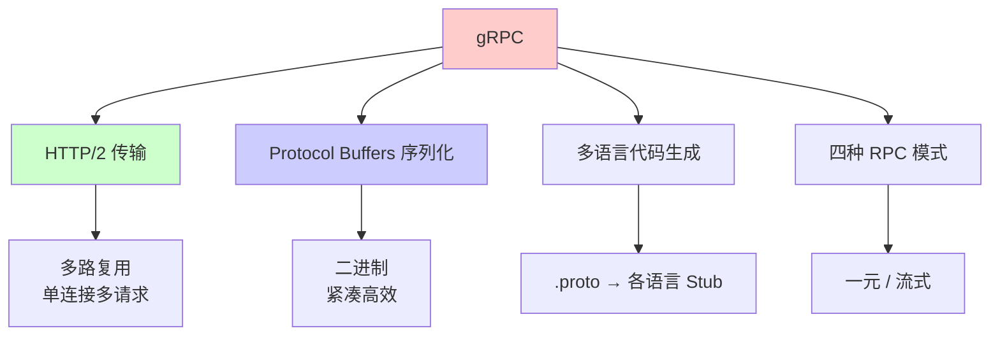
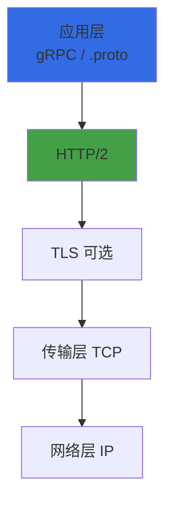
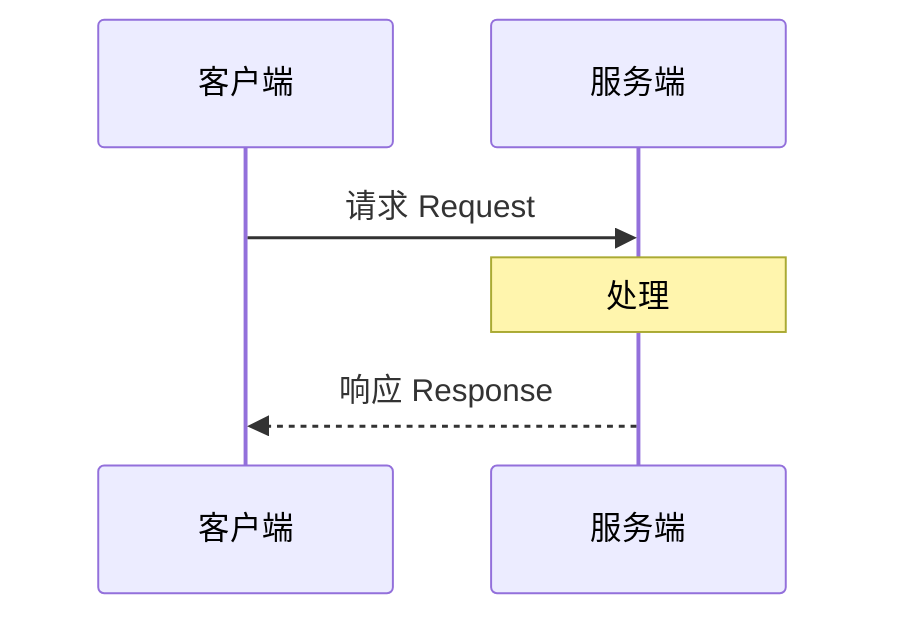
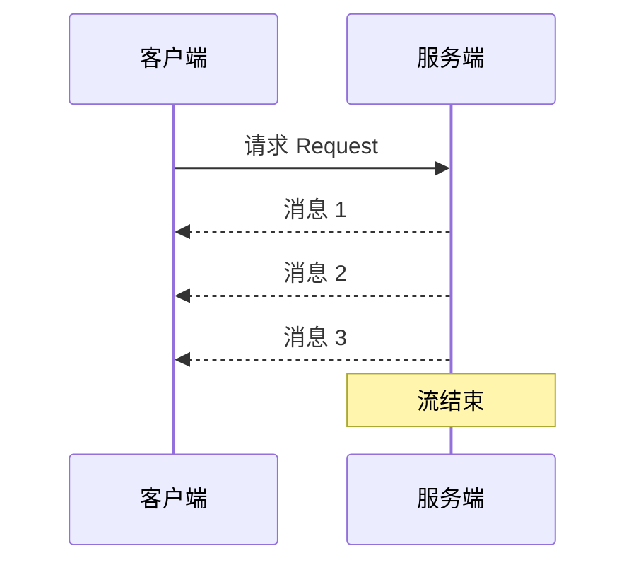
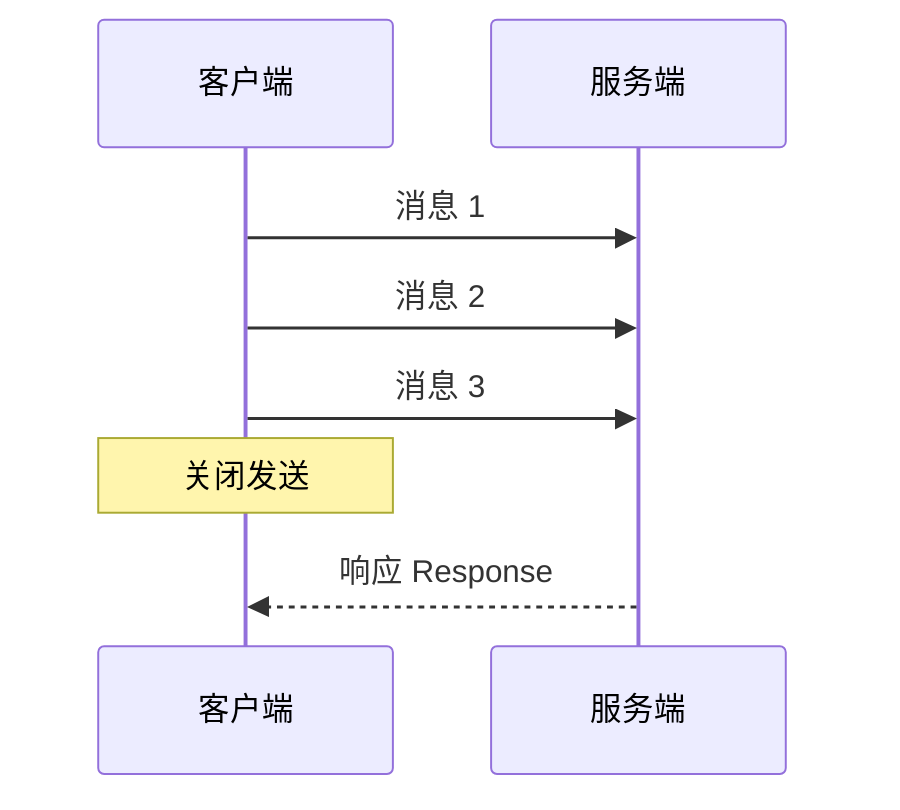
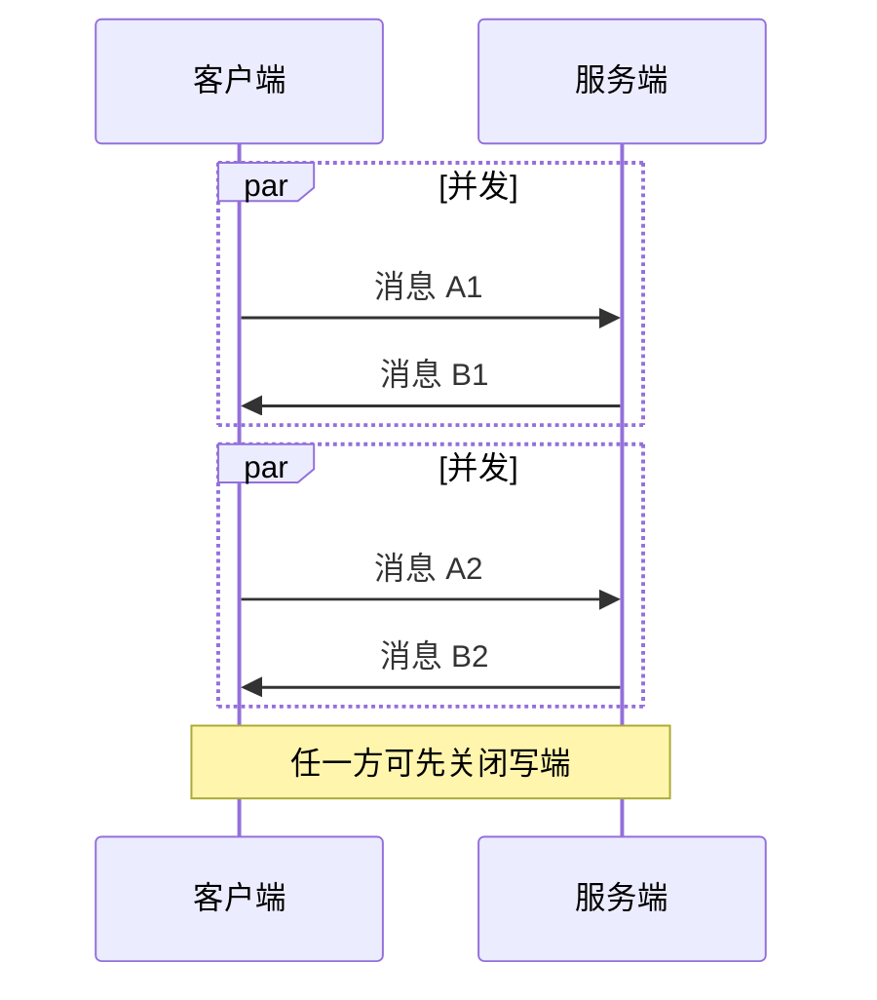
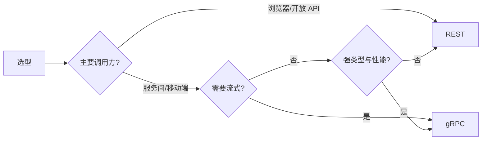
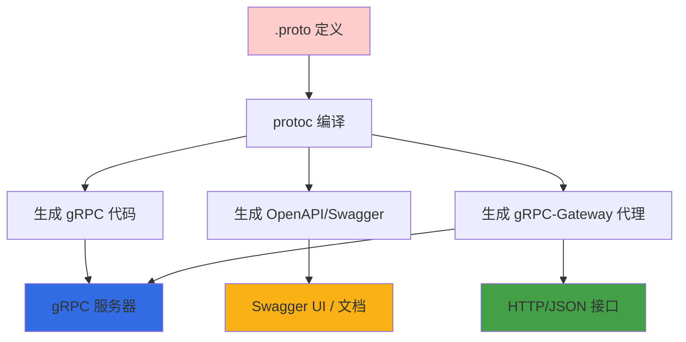
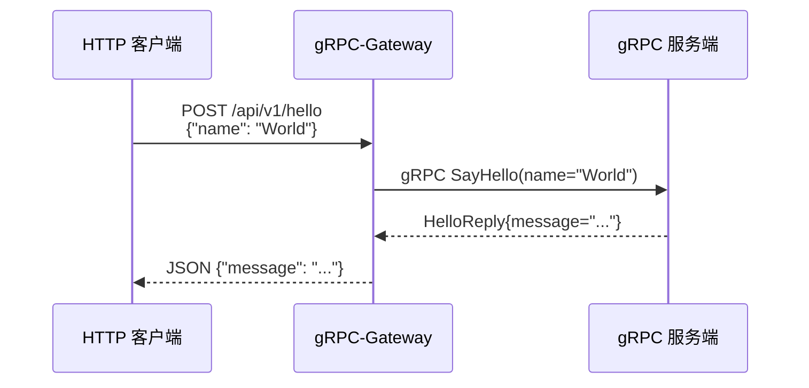
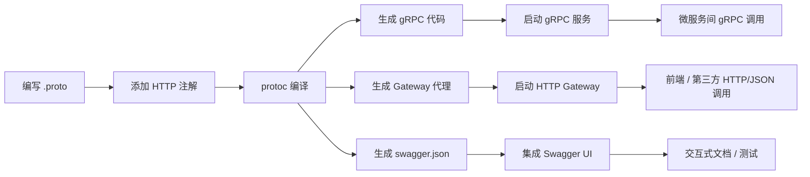

# gRPC 协议详解

gRPC 是 Google 开源的高性能、跨语言的 RPC（远程过程调用）框架，基于 HTTP/2 和 Protocol Buffers，广泛用于微服务、云原生与移动端与后端的通信。本文介绍 gRPC 的架构、四种调用模式与使用方式。

---

# 一、什么是 gRPC

## 定义

**gRPC**（gRPC Remote Procedure Call）是一种 RPC 框架，具备：

- **基于 HTTP/2**：多路复用、头部压缩、二进制分帧
- **默认使用 Protocol Buffers**：二进制序列化，接口通过 `.proto` 定义
- **跨语言**：通过代码生成支持多种语言（Go、Java、Python、C++、Node 等）
- **强类型**：接口与消息格式在 proto 中明确定义，便于契约与演进



## 在协议栈中的位置



gRPC 是应用层协议，承载在 HTTP/2 之上；通常配合 TLS（如 gRPC over HTTPS）。

---

# 二、gRPC 的特点

## 1. 基于 HTTP/2

- **单连接多路复用**：多个 RPC 调用复用一个 TCP 连接，减少握手与连接数
- **头部压缩**：HPACK 压缩请求/响应元数据，降低开销
- **二进制分帧**：帧化传输，便于流控与优先级

## 2. 使用 Protocol Buffers

- **二进制序列化**：比 JSON 等文本格式更省带宽、解析更快
- **强类型与版本化**：字段编号、optional/repeated 支持向后兼容
- **接口定义即文档**：`.proto` 同时作为契约与代码生成输入

## 3. 四种 RPC 模式

| 模式 | 请求 | 响应 | 典型场景 |
|------|------|------|----------|
| **一元 RPC（Unary）** | 单请求 | 单响应 | 普通 API 调用 |
| **服务端流式（Server streaming）** | 单请求 | 流式响应 | 服务端推送、大结果分块 |
| **客户端流式（Client streaming）** | 流式请求 | 单响应 | 上传、批量写入 |
| **双向流式（Bidirectional streaming）** | 流式请求 | 流式响应 | 聊天、实时协作 |

## 4. 多语言与生态

- 官方/社区支持：Go、Java、Python、C++、C#、Node、Ruby、PHP 等
- 与 Kubernetes、Envoy、Istio 等云原生组件集成良好
- 支持拦截器（认证、日志、重试、超时等）

---

# 三、Protocol Buffers 简要

## 3.1 消息定义

```protobuf
syntax = "proto3";

package example;

message HelloRequest {
  string name = 1;
}

message HelloReply {
  string message = 1;
}
```

- **syntax**：proto3 或 proto2
- **message**：对应各语言的结构体/类
- **字段编号**：用于二进制编码，不可随意修改（兼容性）

## 3.2 服务定义（RPC 接口）

```protobuf
service Greeter {
  rpc SayHello (HelloRequest) returns (HelloReply);           // 一元
  rpc ListItems (ListRequest) returns (stream Item);          // 服务端流
  rpc Upload (stream Chunk) returns (UploadReply);            // 客户端流
  rpc Chat (stream ChatMsg) returns (stream ChatMsg);         // 双向流
}
```

- **rpc**：方法名、请求类型、返回类型
- **stream**：放在请求或返回类型前表示流式

## 3.3 代码生成

使用各语言插件根据 `.proto` 生成客户端/服务端代码，例如 Go：

```bash
protoc --go_out=. --go-grpc_out=. *.proto
```

生成内容通常包括：消息的序列化/反序列化、服务端接口与客户端 Stub。

---

# 四、四种 RPC 模式

## 4.1 一元 RPC（Unary）

客户端发一个请求，服务端返回一个响应。



## 4.2 服务端流式（Server streaming）

客户端发一个请求，服务端通过同一调用返回多条消息（流）。



## 4.3 客户端流式（Client streaming）

客户端发送多条消息（流），服务端在处理完后返回一个响应。



## 4.4 双向流式（Bidirectional streaming）

客户端与服务端各自独立地发送消息流，两边可同时读写的全双工流。



---

# 五、gRPC 与 REST 对比

| 维度 | gRPC | REST（常见 JSON over HTTP） |
|------|------|-----------------------------|
| **传输** | HTTP/2，多路复用 | 多为 HTTP/1.1，单请求单连接 |
| **数据格式** | 二进制（Protobuf） | 常见 JSON/XML 文本 |
| **契约** | .proto 强类型 | OpenAPI/手写文档 |
| **流式** | 原生支持四种流式 | 需 SSE/WebSocket 等扩展 |
| **浏览器** | 需 gRPC-Web 等代理 | 直接支持 |
| **典型场景** | 服务间、移动端后端 | 开放 API、前后端 |



---

# 六、Go 语言示例

## 6.1 定义 .proto

```protobuf
syntax = "proto3";

package helloworld;
option go_package = "example.com/helloworld";

service Greeter {
  rpc SayHello (HelloRequest) returns (HelloReply);
}

message HelloRequest {
  string name = 1;
}

message HelloReply {
  string message = 1;
}
```

## 6.2 服务端

```go
package main

import (
    "context"
    "log"
    "net"

    "google.golang.org/grpc"
    "google.golang.org/grpc/reflection"
    pb "example.com/helloworld"
)

type server struct {
    pb.UnimplementedGreeterServer
}

func (s *server) SayHello(ctx context.Context, req *pb.HelloRequest) (*pb.HelloReply, error) {
    return &pb.HelloReply{Message: "Hello, " + req.GetName()}, nil
}

func main() {
    lis, err := net.Listen("tcp", ":50051")
    if err != nil {
        log.Fatalf("listen: %v", err)
    }
    s := grpc.NewServer()
    pb.RegisterGreeterServer(s, &server{})
    reflection.Register(s)
    if err := s.Serve(lis); err != nil {
        log.Fatalf("serve: %v", err)
    }
}
```

## 6.3 客户端

```go
package main

import (
    "context"
    "log"
    "time"

    "google.golang.org/grpc"
    "google.golang.org/grpc/credentials/insecure"
    pb "example.com/helloworld"
)

func main() {
    conn, err := grpc.Dial("localhost:50051",
        grpc.WithTransportCredentials(insecure.NewCredentials()))
    if err != nil {
        log.Fatalf("dial: %v", err)
    }
    defer conn.Close()
    client := pb.NewGreeterClient(conn)

    ctx, cancel := context.WithTimeout(context.Background(), time.Second)
    defer cancel()
    resp, err := client.SayHello(ctx, &pb.HelloRequest{Name: "World"})
    if err != nil {
        log.Fatalf("SayHello: %v", err)
    }
    log.Printf("Reply: %s", resp.GetMessage())
}
```

---

# 七、拦截器与元数据

## 7.1 元数据（Metadata）

gRPC 在每次调用时可携带键值对元数据（类似 HTTP Header），用于认证、链路追踪等。

- **服务端**：从 `context` 中通过 `metadata.FromIncomingContext(ctx)` 读取
- **客户端**：通过 `metadata.AppendToOutgoingContext(ctx, "key", "value")` 附加，再传入 RPC

## 7.2 拦截器（Interceptor）

- **UnaryInterceptor**：对一元 RPC 做统一逻辑（日志、认证、超时）
- **StreamInterceptor**：对流式 RPC 做统一逻辑

可在服务端/客户端分别注册，在请求前或响应后执行，实现认证、重试、指标等横切逻辑。

---

# 八、错误与状态码

gRPC 使用**状态码**表示调用结果，与 HTTP 状态码不完全一致：

| 状态码 | 含义 |
|--------|------|
| OK | 成功 |
| CANCELLED | 调用被取消 |
| INVALID_ARGUMENT | 参数无效 |
| NOT_FOUND | 资源不存在 |
| UNAUTHENTICATED | 未认证 |
| PERMISSION_DENIED | 无权限 |
| DEADLINE_EXCEEDED | 超时 |
| UNAVAILABLE | 服务不可用 |

客户端可根据 `status.Code(err)` 与 `status.msg` 做分支处理；服务端通过 `status.Error(codes.XXX, "message")` 返回错误。

---

# 九、gRPC 与 Swagger 协同开发

gRPC 默认基于 Protocol Buffers，**不直接生成 OpenAPI/Swagger 文档**。但在实际项目中（尤其微服务团队或需对外提供 REST 风格 API），常需同时暴露 gRPC 接口与 HTTP/JSON 接口，并自动生成 Swagger 文档供前端/第三方调用。以下介绍常用方案。

## 9.1 方案概览



| 方案 | 工具 | 说明 |
|------|------|------|
| **gRPC-Gateway** | `protoc-gen-grpc-gateway` | 从 .proto 生成反向代理，将 HTTP/JSON 转为 gRPC 调用 |
| **protoc-gen-openapiv2** | `protoc-gen-openapiv2` | 从 .proto 生成 OpenAPI/Swagger 2.0 规范 |
| **buf** | `buf.build` | 现代化 proto 管理工具，可配合插件生成 Gateway + Swagger |

## 9.2 gRPC-Gateway + OpenAPI 生成

### 9.2.1 原理

- **gRPC-Gateway**：一个反向代理，监听 HTTP 端口，把 HTTP/JSON 请求转为 gRPC 调用后端服务，再把 gRPC 响应转回 JSON。
- **protoc-gen-openapiv2**：插件，在编译 .proto 时生成 OpenAPI 2.0（Swagger）规范，可导入 Swagger UI。



### 9.2.2 安装工具

```bash
# 安装 protoc 插件
go install github.com/grpc-ecosystem/grpc-gateway/v2/protoc-gen-grpc-gateway@latest
go install github.com/grpc-ecosystem/grpc-gateway/v2/protoc-gen-openapiv2@latest
go install google.golang.org/protobuf/cmd/protoc-gen-go@latest
go install google.golang.org/grpc/cmd/protoc-gen-go-grpc@latest
```

### 9.2.3 修改 .proto 添加 HTTP 注解

```protobuf
syntax = "proto3";

package helloworld;
option go_package = "example.com/helloworld";

import "google/api/annotations.proto";

service Greeter {
  rpc SayHello (HelloRequest) returns (HelloReply) {
    option (google.api.http) = {
      post: "/api/v1/hello"
      body: "*"
    };
  }
}

message HelloRequest {
  string name = 1;
}

message HelloReply {
  string message = 1;
}
```

**说明**：
- `import "google/api/annotations.proto"`：gRPC-Gateway 扩展，需从 [googleapis](https://github.com/googleapis/googleapis) 下载到 proto 路径。
- `option (google.api.http)`：定义 HTTP 方法、路径、请求体映射。

### 9.2.4 编译生成代码与 Swagger

```bash
# 生成 gRPC 代码
protoc --go_out=. --go-grpc_out=. helloworld.proto

# 生成 gRPC-Gateway 反向代理代码
protoc --grpc-gateway_out=. --grpc-gateway_opt logtostderr=true helloworld.proto

# 生成 OpenAPI/Swagger 2.0 规范
protoc --openapiv2_out=. --openapiv2_opt logtostderr=true helloworld.proto
```

生成文件：
- `helloworld.pb.go`：消息定义
- `helloworld_grpc.pb.go`：gRPC 服务端/客户端代码
- `helloworld.pb.gw.go`：gRPC-Gateway 反向代理代码
- `helloworld.swagger.json`：OpenAPI 2.0 规范，可导入 Swagger UI

## 9.3 启动 gRPC-Gateway

### 服务端同时启动 gRPC 与 HTTP

```go
package main

import (
    "context"
    "log"
    "net"
    "net/http"

    "github.com/grpc-ecosystem/grpc-gateway/v2/runtime"
    "google.golang.org/grpc"
    "google.golang.org/grpc/credentials/insecure"
    pb "example.com/helloworld"
)

type server struct {
    pb.UnimplementedGreeterServer
}

func (s *server) SayHello(ctx context.Context, req *pb.HelloRequest) (*pb.HelloReply, error) {
    return &pb.HelloReply{Message: "Hello, " + req.GetName()}, nil
}

func main() {
    // 启动 gRPC 服务端
    go func() {
        lis, err := net.Listen("tcp", ":50051")
        if err != nil {
            log.Fatalf("gRPC listen: %v", err)
        }
        s := grpc.NewServer()
        pb.RegisterGreeterServer(s, &server{})
        log.Println("gRPC server on :50051")
        if err := s.Serve(lis); err != nil {
            log.Fatalf("gRPC serve: %v", err)
        }
    }()

    // 启动 gRPC-Gateway HTTP 代理
    ctx := context.Background()
    mux := runtime.NewServeMux()
    opts := []grpc.DialOption{grpc.WithTransportCredentials(insecure.NewCredentials())}
    if err := pb.RegisterGreeterHandlerFromEndpoint(ctx, mux, "localhost:50051", opts); err != nil {
        log.Fatalf("Register gateway: %v", err)
    }

    log.Println("HTTP gateway on :8080")
    if err := http.ListenAndServe(":8080", mux); err != nil {
        log.Fatalf("HTTP serve: %v", err)
    }
}
```

**说明**：
- `:50051` 暴露 gRPC 接口（其它 gRPC 客户端调用）。
- `:8080` 暴露 HTTP/JSON 接口（gRPC-Gateway 转为 gRPC 调用）。

## 9.4 集成 Swagger UI

### 方式一：静态托管 swagger.json

1. 把生成的 `helloworld.swagger.json` 复制到项目 `static/swagger/` 目录。
2. 在服务端添加路由托管 Swagger UI：

```go
import (
    "net/http"
    "github.com/grpc-ecosystem/grpc-gateway/v2/runtime"
)

func main() {
    mux := runtime.NewServeMux()
    // ... 注册 gRPC-Gateway ...

    // 托管 swagger.json
    http.HandleFunc("/swagger/", func(w http.ResponseWriter, r *http.Request) {
        http.ServeFile(w, r, "static/swagger/helloworld.swagger.json")
    })

    // 托管 Swagger UI（可用第三方或下载官方 UI）
    fs := http.FileServer(http.Dir("static/swagger-ui"))
    http.Handle("/docs/", http.StripPrefix("/docs/", fs))

    log.Println("Swagger UI at http://localhost:8080/docs/")
    http.ListenAndServe(":8080", nil)
}
```

### 方式二：使用 buf + swagger-ui Docker

在 `buf.yaml` 配置中加入 openapiv2 插件，生成规范后用 `swagger-ui` Docker 容器托管：

```bash
docker run -p 80:8080 -e SWAGGER_JSON=/swagger/helloworld.swagger.json \
    -v $(pwd)/static/swagger:/swagger swaggerapi/swagger-ui
```

访问 `http://localhost` 即可看到交互式 API 文档。

## 9.5 协同流程总结



**优势**：
- 一份 `.proto` 定义，同时生成 gRPC 接口、HTTP/JSON 接口、Swagger 文档。
- gRPC 用于服务间高性能调用；HTTP/JSON 用于前端或外部集成，Swagger 文档便于测试与对接。
- proto 修改后重新编译，代码与文档自动同步。

---

# 十、小结

- **gRPC** 是基于 HTTP/2 和 Protocol Buffers 的 RPC 框架，支持多语言与四种调用模式（一元、服务端流、客户端流、双向流）。
- **.proto** 定义消息与服务，通过代码生成得到各语言的类型与 Stub。
- **适用场景**：微服务间、移动端与后端、需要流式或高性能的接口；对浏览器需配合 gRPC-Web。
- **实践**：合理使用元数据与拦截器做认证与可观测性；设置超时与重试；注意 proto 字段编号的兼容性。
