# HTTPS 概述

HTTPS（HyperText Transfer Protocol Secure）是 HTTP 的安全版本，通过 TLS/SSL 协议对 HTTP 数据进行加密传输，保证数据传输的安全性和完整性。

## 核心概念

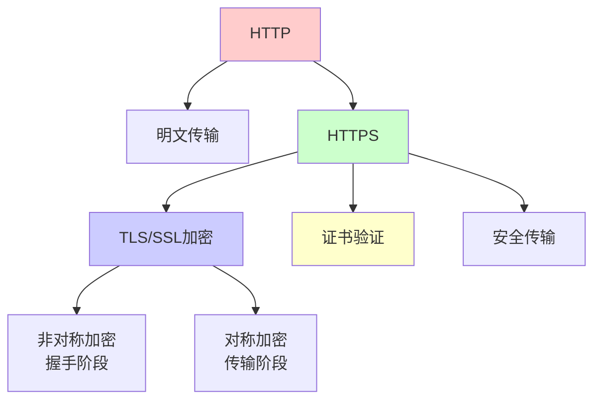
```mermaid
graph TB
    A[HTTP] --> B[明文传输]
    A --> C[HTTPS]
    C --> D[TLS/SSL加密]
    C --> E[证书验证]
    C --> F[安全传输]
    
    D --> G[非对称加密<br/>握手阶段]
    D --> H[对称加密<br/>传输阶段]
    
    style A fill:#ffcccc
    style C fill:#ccffcc
    style D fill:#ccccff
    style E fill:#ffffcc
```

## HTTPS 的优势

1. **数据加密**：防止数据被窃听
2. **身份验证**：通过证书验证服务器身份
3. **数据完整性**：防止数据被篡改
4. **防止中间人攻击**：通过证书链验证

# TLS/SSL 协议

## TLS 概述

TLS（Transport Layer Security，传输层安全性协议）是 SSL（Secure Sockets Layer）的后续版本，用于保证传输层数据的安全。

### TLS 版本演进

- **SSL 1.0/2.0/3.0**：已废弃
- **TLS 1.0**：1999年发布（已废弃）
- **TLS 1.1**：2006年发布（已废弃）
- **TLS 1.2**：2008年发布（广泛使用）
- **TLS 1.3**：2018年发布（最新版本，性能更好）

### TLS 的特点

1. **混合加密**：握手阶段使用非对称加密，传输阶段使用对称加密
2. **证书验证**：通过 CA 证书验证服务器身份
3. **完整性校验**：使用 MAC（消息认证码）保证数据完整性
4. **前向安全性**：即使长期密钥泄露，历史通信仍然安全

## TLS 协议栈

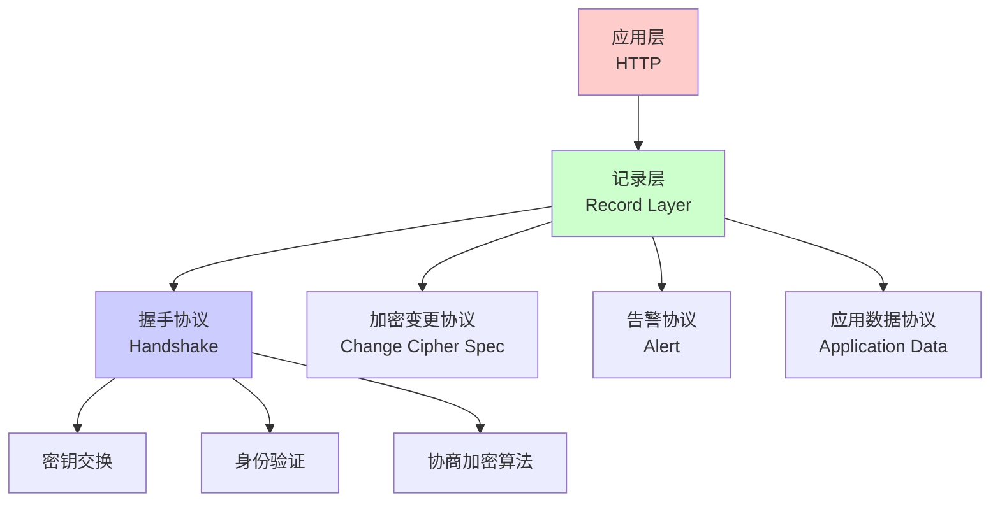
```mermaid
graph TB
    A[应用层<br/>HTTP] --> B[记录层<br/>Record Layer]
    B --> C[握手协议<br/>Handshake]
    B --> D[加密变更协议<br/>Change Cipher Spec]
    B --> E[告警协议<br/>Alert]
    B --> F[应用数据协议<br/>Application Data]
    
    C --> G[密钥交换]
    C --> H[身份验证]
    C --> I[协商加密算法]
    
    style A fill:#ffcccc
    style B fill:#ccffcc
    style C fill:#ccccff
```

## 加密方式

### 非对称加密（握手阶段）

- **RSA**：经典的公钥加密算法
- **ECDHE**：椭圆曲线 Diffie-Hellman 密钥交换（TLS 1.3 推荐）
- **DHE**：Diffie-Hellman 密钥交换

**特点**：
- 安全性高，但计算开销大
- 用于密钥交换和身份验证

### 对称加密（传输阶段）

- **AES**：高级加密标准（最常用）
- **ChaCha20**：流加密算法（移动设备常用）
- **3DES**：三重数据加密标准（已废弃）

**特点**：
- 速度快，适合大量数据传输
- 需要共享密钥

# HTTPS 握手流程

## 完整握手流程

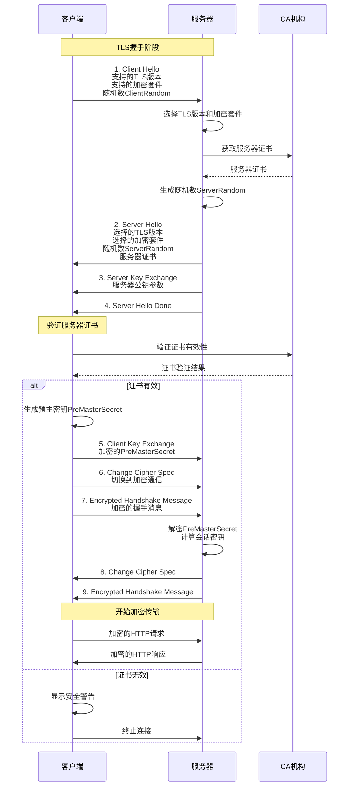
```mermaid
sequenceDiagram
    participant Client as 客户端
    participant Server as 服务器
    participant CA as CA机构
    
    Note over Client,Server: TLS握手阶段
    
    Client->>Server: 1. Client Hello<br/>支持的TLS版本<br/>支持的加密套件<br/>随机数ClientRandom
    Server->>Server: 选择TLS版本和加密套件
    Server->>CA: 获取服务器证书
    CA-->>Server: 服务器证书
    Server->>Server: 生成随机数ServerRandom
    Server->>Client: 2. Server Hello<br/>选择的TLS版本<br/>选择的加密套件<br/>随机数ServerRandom<br/>服务器证书
    Server->>Client: 3. Server Key Exchange<br/>服务器公钥参数
    Server->>Client: 4. Server Hello Done
    
    Note over Client: 验证服务器证书
    Client->>CA: 验证证书有效性
    CA-->>Client: 证书验证结果
    
    alt 证书有效
        Client->>Client: 生成预主密钥PreMasterSecret
        Client->>Server: 5. Client Key Exchange<br/>加密的PreMasterSecret
        Client->>Server: 6. Change Cipher Spec<br/>切换到加密通信
        Client->>Server: 7. Encrypted Handshake Message<br/>加密的握手消息
        Server->>Server: 解密PreMasterSecret<br/>计算会话密钥
        Server->>Client: 8. Change Cipher Spec
        Server->>Client: 9. Encrypted Handshake Message
        
        Note over Client,Server: 开始加密传输
        Client->>Server: 加密的HTTP请求
        Server->>Client: 加密的HTTP响应
    else 证书无效
        Client->>Client: 显示安全警告
        Client->>Server: 终止连接
    end
```

## 详细步骤说明

### 步骤 1: Client Hello

客户端向服务器发送握手请求：

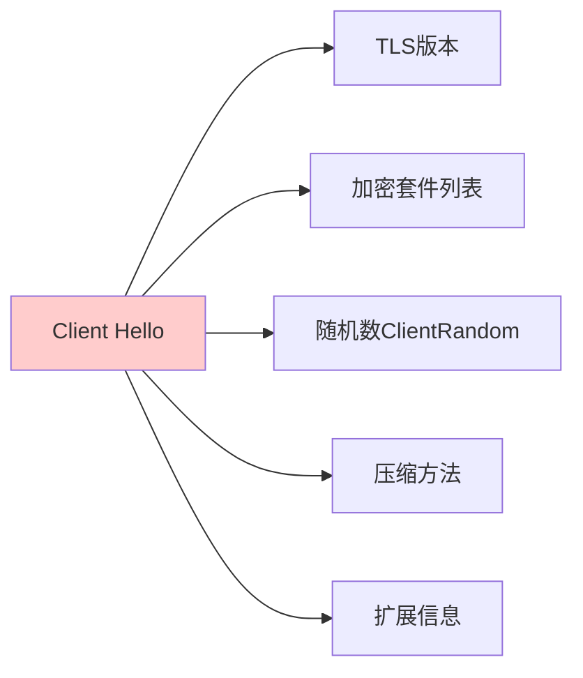
```mermaid
graph LR
    A[Client Hello] --> B[TLS版本]
    A --> C[加密套件列表]
    A --> D[随机数ClientRandom]
    A --> E[压缩方法]
    A --> F[扩展信息]
    
    style A fill:#ffcccc
```

**包含内容**：
- 支持的 TLS 版本（如 TLS 1.2, TLS 1.3）
- 支持的加密套件列表（如 `TLS_ECDHE_RSA_WITH_AES_256_GCM_SHA384`）
- 客户端随机数（ClientRandom）
- 支持的压缩方法
- 扩展信息（SNI、ALPN 等）

### 步骤 2: Server Hello

服务器响应客户端：

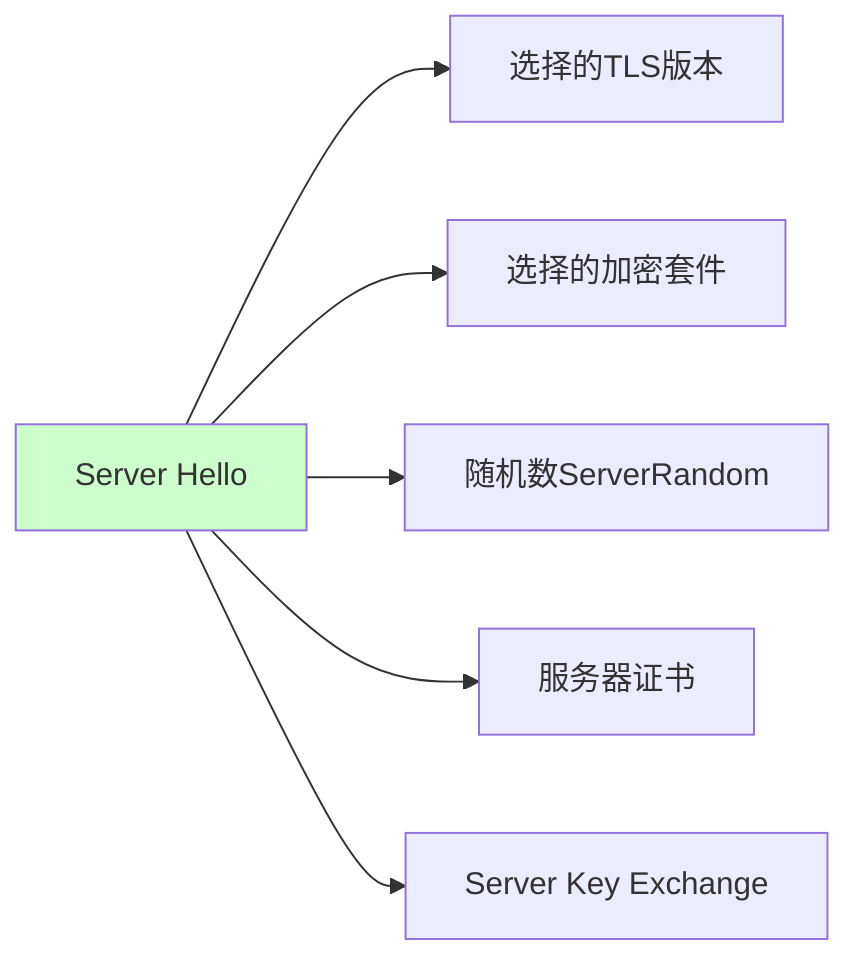
```mermaid
graph LR
    A[Server Hello] --> B[选择的TLS版本]
    A --> C[选择的加密套件]
    A --> D[随机数ServerRandom]
    A --> E[服务器证书]
    A --> F[Server Key Exchange]
    
    style A fill:#ccffcc
```

**包含内容**：
- 选择的 TLS 版本
- 选择的加密套件
- 服务器随机数（ServerRandom）
- 服务器证书（包含公钥）
- 服务器密钥交换参数（如 ECDHE 参数）

### 步骤 3: 证书验证

客户端验证服务器证书：

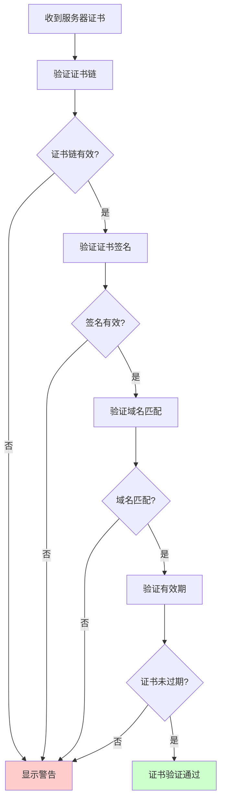
```mermaid
flowchart TD
    A[收到服务器证书] --> B[验证证书链]
    B --> C{证书链有效?}
    C -->|否| D[显示警告]
    C -->|是| E[验证证书签名]
    E --> F{签名有效?}
    F -->|否| D
    F -->|是| G[验证域名匹配]
    G --> H{域名匹配?}
    H -->|否| D
    H -->|是| I[验证有效期]
    I --> J{证书未过期?}
    J -->|否| D
    J -->|是| K[证书验证通过]
    
    style D fill:#ffcccc
    style K fill:#ccffcc
```

**验证内容**：
1. **证书链验证**：验证证书是否由受信任的 CA 签发
2. **签名验证**：使用 CA 公钥验证证书签名
3. **域名验证**：验证证书中的域名是否匹配
4. **有效期验证**：验证证书是否在有效期内
5. **吊销检查**：检查证书是否被吊销（OCSP/CRL）

### 步骤 4: 密钥交换

客户端和服务器交换密钥：

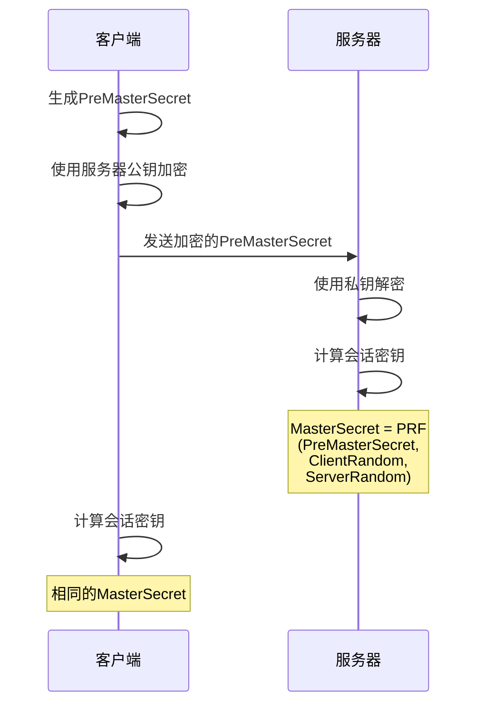
```mermaid
sequenceDiagram
    participant C as 客户端
    participant S as 服务器
    
    C->>C: 生成PreMasterSecret
    C->>C: 使用服务器公钥加密
    C->>S: 发送加密的PreMasterSecret
    
    S->>S: 使用私钥解密
    S->>S: 计算会话密钥
    Note over S: MasterSecret = PRF<br/>(PreMasterSecret,<br/>ClientRandom,<br/>ServerRandom)
    
    C->>C: 计算会话密钥
    Note over C: 相同的MasterSecret
```

**密钥计算**：
```
MasterSecret = PRF(PreMasterSecret, "master secret", ClientRandom + ServerRandom)
```

### 步骤 5: 切换到加密通信

双方切换到加密模式：

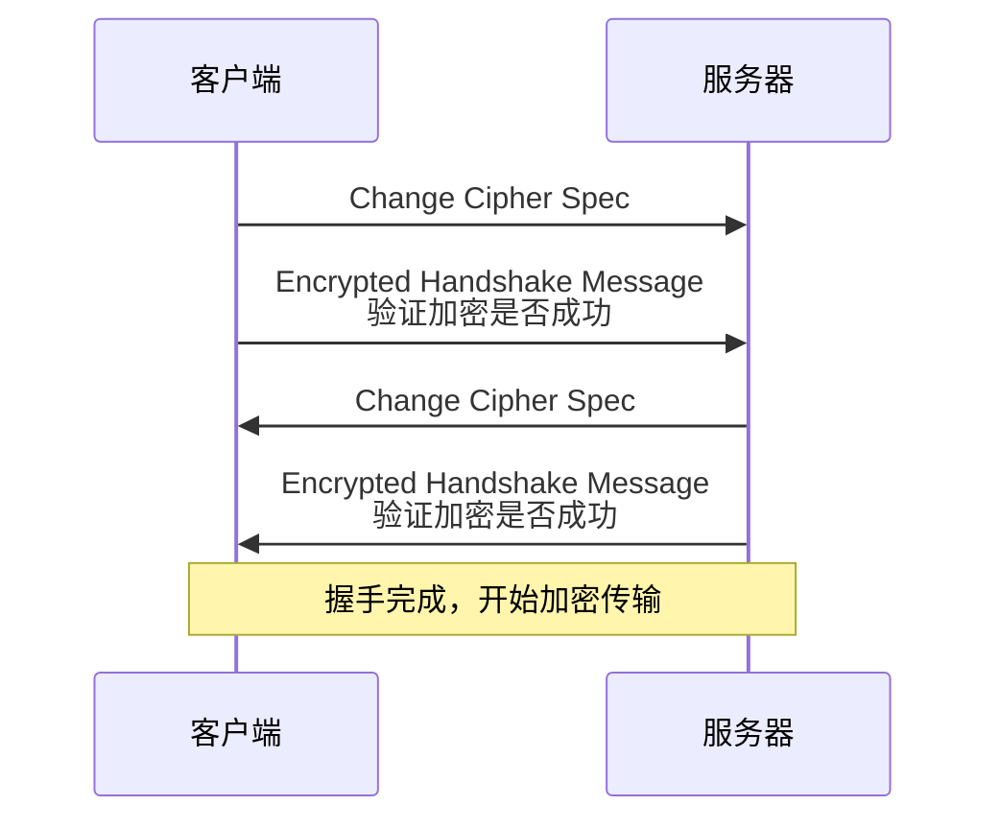
```mermaid
sequenceDiagram
    participant C as 客户端
    participant S as 服务器
    
    C->>S: Change Cipher Spec
    C->>S: Encrypted Handshake Message<br/>验证加密是否成功
    S->>C: Change Cipher Spec
    S->>C: Encrypted Handshake Message<br/>验证加密是否成功
    
    Note over C,S: 握手完成，开始加密传输
```

## TLS 1.3 简化握手

TLS 1.3 优化了握手流程，减少了往返次数：

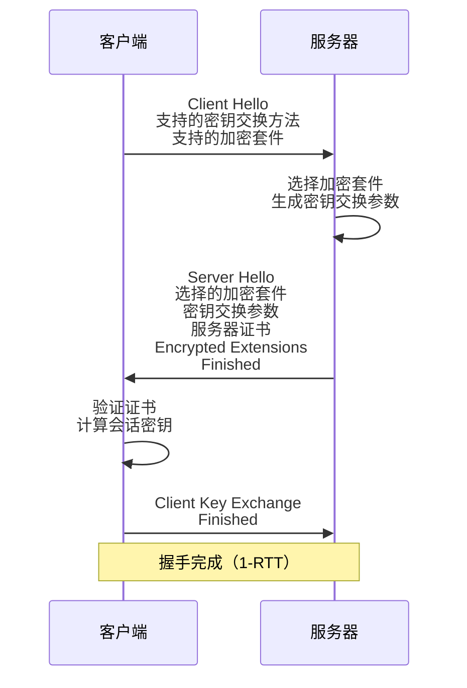
```mermaid
sequenceDiagram
    participant Client as 客户端
    participant Server as 服务器
    
    Client->>Server: Client Hello<br/>支持的密钥交换方法<br/>支持的加密套件
    Server->>Server: 选择加密套件<br/>生成密钥交换参数
    Server->>Client: Server Hello<br/>选择的加密套件<br/>密钥交换参数<br/>服务器证书<br/>Encrypted Extensions<br/>Finished
    Client->>Client: 验证证书<br/>计算会话密钥
    Client->>Server: Client Key Exchange<br/>Finished
    
    Note over Client,Server: 握手完成（1-RTT）
```

**TLS 1.3 优势**：
- **1-RTT 握手**：相比 TLS 1.2 的 2-RTT，减少了一次往返
- **0-RTT 恢复**：支持会话恢复，首次连接后可以 0-RTT 恢复
- **更强的安全性**：移除了不安全的加密套件

# 证书体系

## CA（Certificate Authority）

CA（数字证书认证机构）是受信任的第三方机构，负责签发和管理数字证书。

### CA 的作用

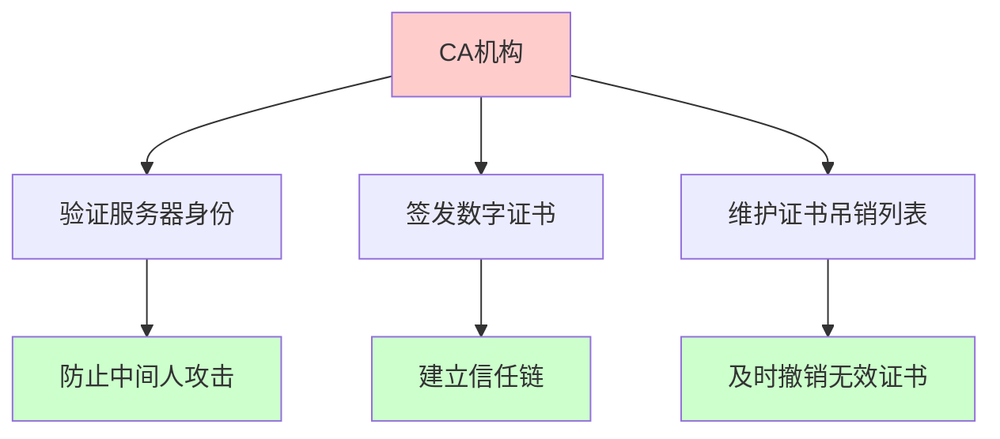
```mermaid
graph TB
    A[CA机构] --> B[验证服务器身份]
    A --> C[签发数字证书]
    A --> D[维护证书吊销列表]
    
    B --> E[防止中间人攻击]
    C --> F[建立信任链]
    D --> G[及时撤销无效证书]
    
    style A fill:#ffcccc
    style E fill:#ccffcc
    style F fill:#ccffcc
    style G fill:#ccffcc
```

### 证书签发流程

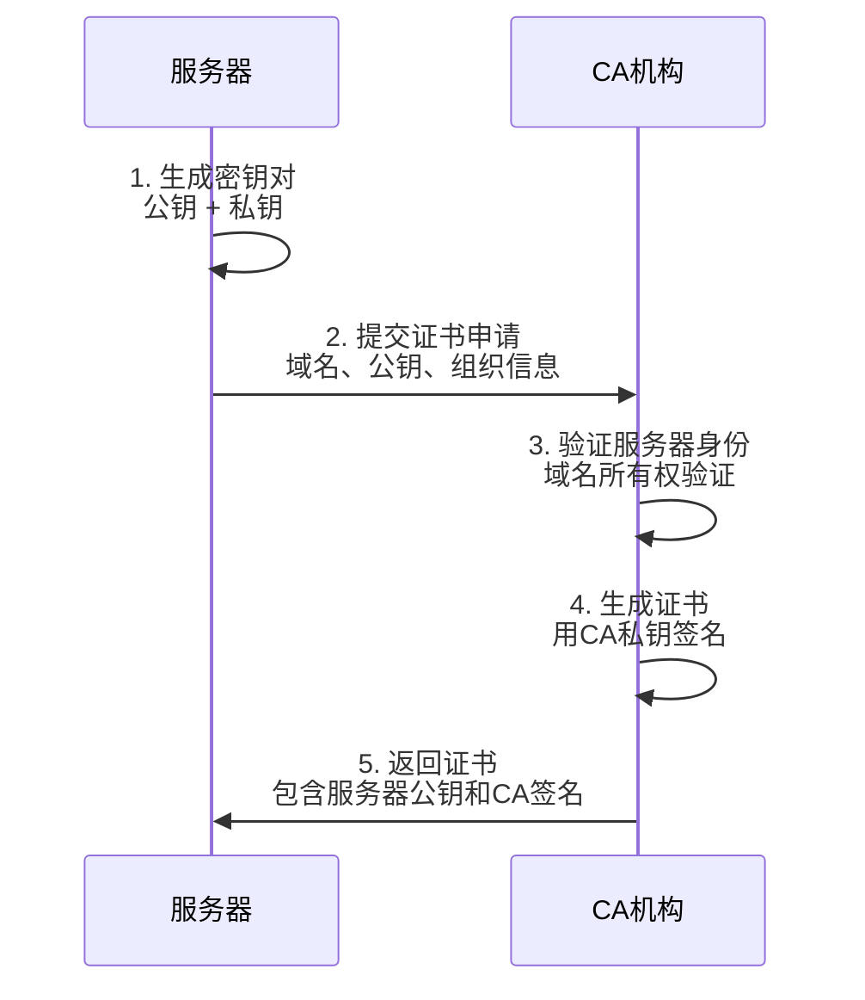
```mermaid
sequenceDiagram
    participant Server as 服务器
    participant CA as CA机构
    
    Server->>Server: 1. 生成密钥对<br/>公钥 + 私钥
    Server->>CA: 2. 提交证书申请<br/>域名、公钥、组织信息
    CA->>CA: 3. 验证服务器身份<br/>域名所有权验证
    CA->>CA: 4. 生成证书<br/>用CA私钥签名
    CA->>Server: 5. 返回证书<br/>包含服务器公钥和CA签名
```

### 知名 CA 机构

- **Let's Encrypt**：免费证书，自动化签发
- **DigiCert**：商业 CA，广泛使用
- **GlobalSign**：全球 CA
- **Comodo**：大型 CA 机构

## 证书结构

### X.509 证书格式

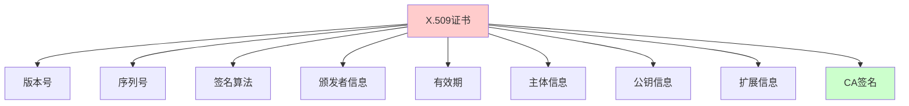
```mermaid
graph TB
    A[X.509证书] --> B[版本号]
    A --> C[序列号]
    A --> D[签名算法]
    A --> E[颁发者信息]
    A --> F[有效期]
    A --> G[主体信息]
    A --> H[公钥信息]
    A --> I[扩展信息]
    A --> J[CA签名]
    
    style A fill:#ffcccc
    style J fill:#ccffcc
```

### 证书字段说明

| 字段 | 说明 |
|------|------|
| 版本号 | 证书格式版本（v1, v2, v3） |
| 序列号 | CA 分配的唯一序列号 |
| 签名算法 | 用于签名的算法（如 SHA256withRSA） |
| 颁发者 | CA 的信息 |
| 有效期 | 证书的有效起止时间 |
| 主体 | 证书持有者的信息（域名、组织等） |
| 公钥 | 服务器的公钥 |
| 扩展 | 扩展信息（密钥用途、SAN 等） |
| 签名 | CA 对证书的签名 |

## 证书链

### 证书链结构

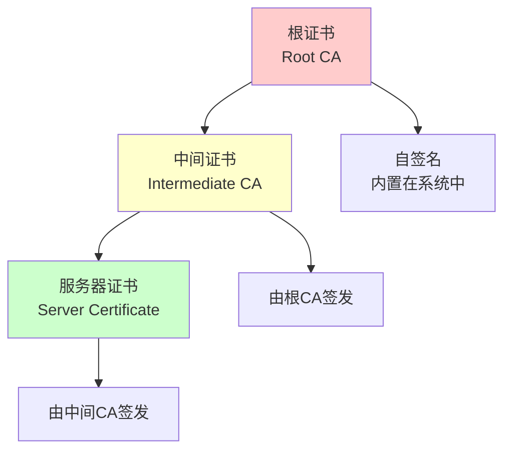
```mermaid
graph TB
    A[根证书<br/>Root CA] --> B[中间证书<br/>Intermediate CA]
    B --> C[服务器证书<br/>Server Certificate]
    
    A --> A1[自签名<br/>内置在系统中]
    B --> B1[由根CA签发]
    C --> C1[由中间CA签发]
    
    style A fill:#ffcccc
    style B fill:#ffffcc
    style C fill:#ccffcc
```

### 证书链验证

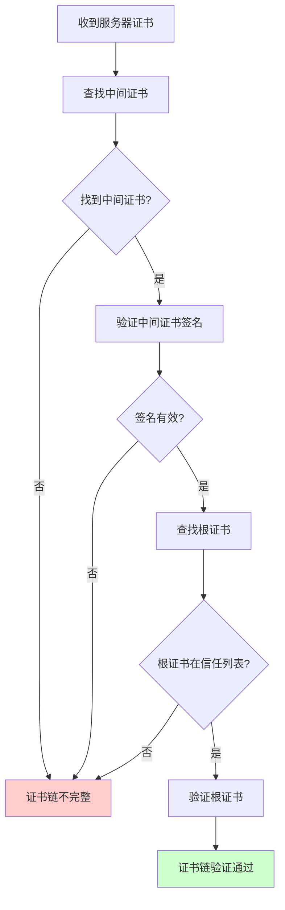
```mermaid
flowchart TD
    A[收到服务器证书] --> B[查找中间证书]
    B --> C{找到中间证书?}
    C -->|是| D[验证中间证书签名]
    C -->|否| E[证书链不完整]
    D --> F{签名有效?}
    F -->|否| E
    F -->|是| G[查找根证书]
    G --> H{根证书在信任列表?}
    H -->|否| E
    H -->|是| I[验证根证书]
    I --> J[证书链验证通过]
    
    style E fill:#ffcccc
    style J fill:#ccffcc
```

## 客户端证书验证流程

### 详细验证步骤

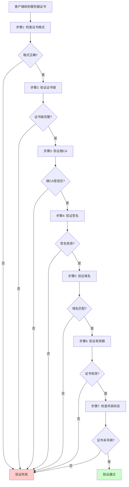
```mermaid
flowchart TD
    A[客户端收到服务器证书] --> B[步骤1: 检查证书格式]
    B --> C{格式正确?}
    C -->|否| D[验证失败]
    C -->|是| E[步骤2: 验证证书链]
    E --> F{证书链完整?}
    F -->|否| D
    F -->|是| G[步骤3: 验证根CA]
    G --> H{根CA受信任?}
    H -->|否| D
    H -->|是| I[步骤4: 验证签名]
    I --> J{签名有效?}
    J -->|否| D
    J -->|是| K[步骤5: 验证域名]
    K --> L{域名匹配?}
    L -->|否| D
    L -->|是| M[步骤6: 验证有效期]
    M --> N{证书有效?}
    N -->|否| D
    N -->|是| O[步骤7: 检查吊销状态]
    O --> P{证书未吊销?}
    P -->|否| D
    P -->|是| Q[验证通过]
    
    style D fill:#ffcccc
    style Q fill:#ccffcc
```

### 验证代码示例

```go
package main

import (
    "crypto/tls"
    "crypto/x509"
    "fmt"
    "net/http"
)

func verifyCertificate(cert *x509.Certificate) error {
    // 1. 验证证书链
    roots := x509.NewCertPool()
    // 加载系统根证书
    // roots.AppendCertsFromPEM(rootCA)
    
    opts := x509.VerifyOptions{
        Roots: roots,
    }
    
    // 2. 验证证书
    _, err := cert.Verify(opts)
    if err != nil {
        return fmt.Errorf("certificate verification failed: %v", err)
    }
    
    // 3. 验证域名
    err = cert.VerifyHostname("example.com")
    if err != nil {
        return fmt.Errorf("hostname verification failed: %v", err)
    }
    
    // 4. 验证有效期
    // cert.NotBefore 和 cert.NotAfter 已由 Verify 检查
    
    return nil
}

// HTTPS 客户端示例
func httpsClient() {
    tr := &http.Transport{
        TLSClientConfig: &tls.Config{
            InsecureSkipVerify: false, // 不跳过证书验证
        },
    }
    
    client := &http.Client{Transport: tr}
    
    resp, err := client.Get("https://example.com")
    if err != nil {
        fmt.Printf("HTTPS request failed: %v\n", err)
        return
    }
    defer resp.Body.Close()
    
    fmt.Println("HTTPS request successful")
}
```

# HTTPS 数据传输

## 加密传输流程

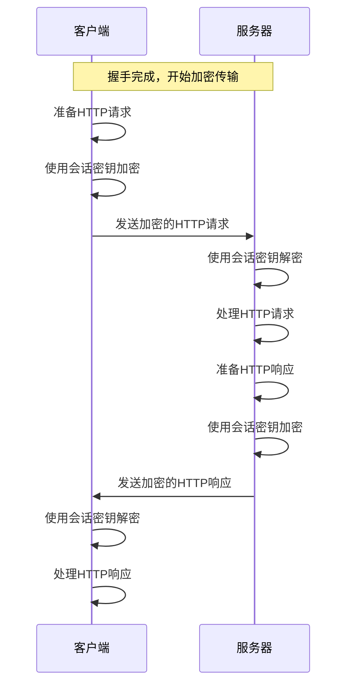
```mermaid
sequenceDiagram
    participant Client as 客户端
    participant Server as 服务器
    
    Note over Client,Server: 握手完成，开始加密传输
    
    Client->>Client: 准备HTTP请求
    Client->>Client: 使用会话密钥加密
    Client->>Server: 发送加密的HTTP请求
    
    Server->>Server: 使用会话密钥解密
    Server->>Server: 处理HTTP请求
    Server->>Server: 准备HTTP响应
    Server->>Server: 使用会话密钥加密
    Server->>Client: 发送加密的HTTP响应
    
    Client->>Client: 使用会话密钥解密
    Client->>Client: 处理HTTP响应
```

## 数据加密过程

### 加密流程

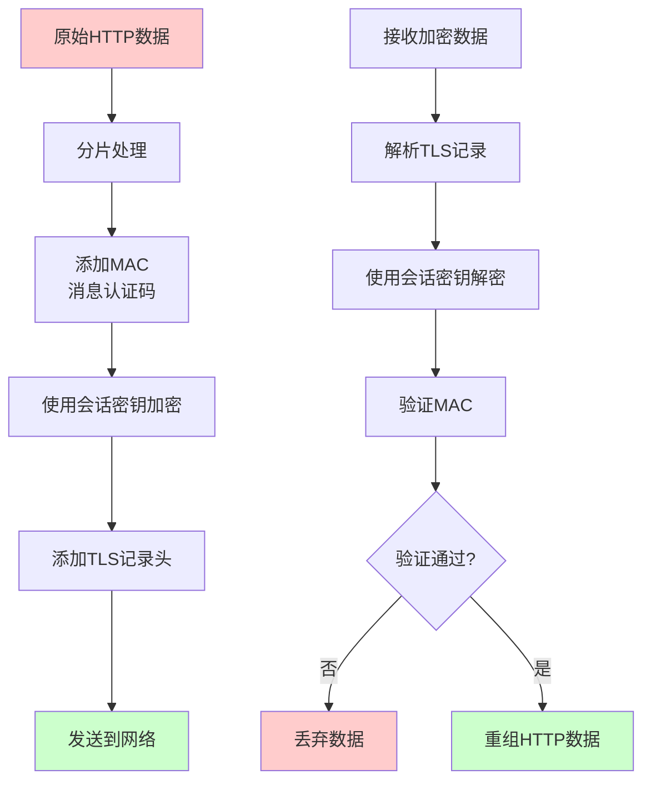
```mermaid
flowchart TD
    A[原始HTTP数据] --> B[分片处理]
    B --> C[添加MAC<br/>消息认证码]
    C --> D[使用会话密钥加密]
    D --> E[添加TLS记录头]
    E --> F[发送到网络]
    
    G[接收加密数据] --> H[解析TLS记录]
    H --> I[使用会话密钥解密]
    I --> J[验证MAC]
    J --> K{验证通过?}
    K -->|否| L[丢弃数据]
    K -->|是| M[重组HTTP数据]
    
    style A fill:#ffcccc
    style F fill:#ccffcc
    style M fill:#ccffcc
    style L fill:#ffcccc
```

### 加密算法组合

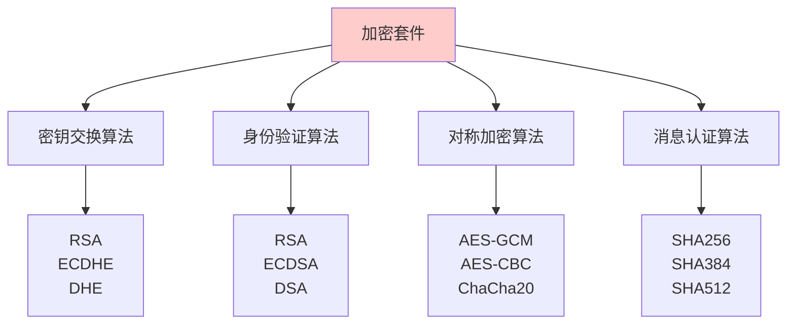
```mermaid
graph TB
    A[加密套件] --> B[密钥交换算法]
    A --> C[身份验证算法]
    A --> D[对称加密算法]
    A --> E[消息认证算法]
    
    B --> B1[RSA<br/>ECDHE<br/>DHE]
    C --> C1[RSA<br/>ECDSA<br/>DSA]
    D --> D1[AES-GCM<br/>AES-CBC<br/>ChaCha20]
    E --> E1[SHA256<br/>SHA384<br/>SHA512]
    
    style A fill:#ffcccc
```

## 会话恢复

为了减少握手开销，TLS 支持会话恢复：

### 会话票证（Session Ticket）

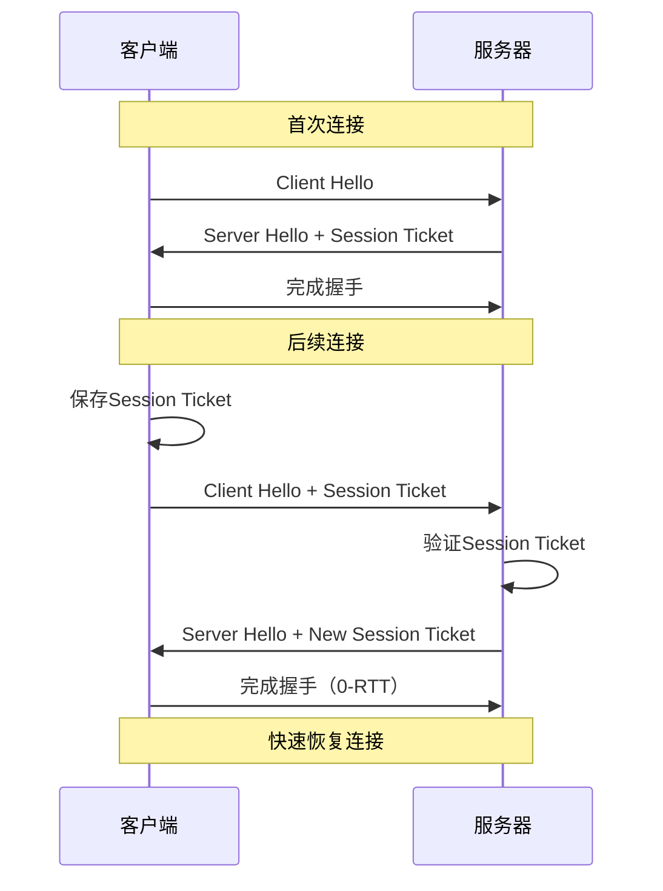
```mermaid
sequenceDiagram
    participant Client as 客户端
    participant Server as 服务器
    
    Note over Client,Server: 首次连接
    Client->>Server: Client Hello
    Server->>Client: Server Hello + Session Ticket
    Client->>Server: 完成握手
    
    Note over Client,Server: 后续连接
    Client->>Client: 保存Session Ticket
    Client->>Server: Client Hello + Session Ticket
    Server->>Server: 验证Session Ticket
    Server->>Client: Server Hello + New Session Ticket
    Client->>Server: 完成握手（0-RTT）
    
    Note over Client,Server: 快速恢复连接
```

### 会话 ID（Session ID）

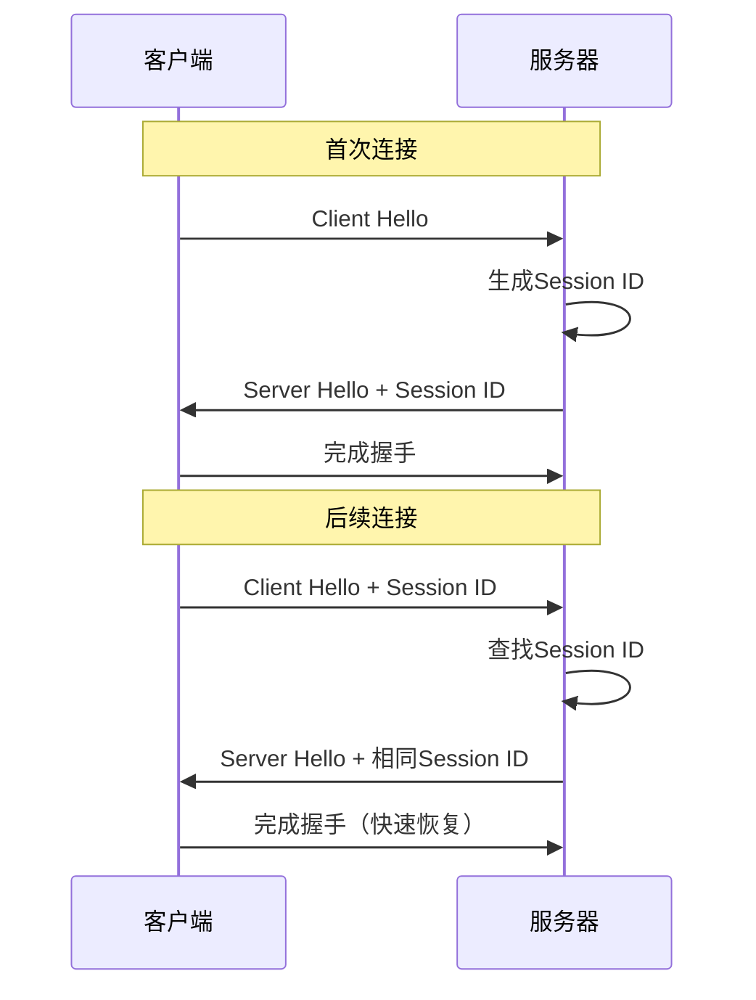
```mermaid
sequenceDiagram
    participant Client as 客户端
    participant Server as 服务器
    
    Note over Client,Server: 首次连接
    Client->>Server: Client Hello
    Server->>Server: 生成Session ID
    Server->>Client: Server Hello + Session ID
    Client->>Server: 完成握手
    
    Note over Client,Server: 后续连接
    Client->>Server: Client Hello + Session ID
    Server->>Server: 查找Session ID
    Server->>Client: Server Hello + 相同Session ID
    Client->>Server: 完成握手（快速恢复）
```

# 安全机制

## 防止中间人攻击

### 中间人攻击场景

```mermaid
sequenceDiagram
    participant Client as 客户端
    participant Attacker as 攻击者
    participant Server as 服务器
    
    Client->>Attacker: HTTPS请求
    Attacker->>Server: 转发请求
    Server->>Attacker: 服务器证书
    Attacker->>Attacker: 伪造证书
    Attacker->>Client: 伪造的证书
    
    alt 无证书验证
        Client->>Client: 接受伪造证书
        Client->>Attacker: 加密数据（使用攻击者密钥）
        Attacker->>Attacker: 解密数据
        Attacker->>Server: 转发数据
    else 有证书验证
        Client->>Client: 验证证书失败
        Client->>Client: 显示安全警告
        Client->>Attacker: 终止连接
    end
```

### 证书验证防护

```mermaid
flowchart TD
    A[中间人攻击] --> B[伪造证书]
    B --> C[客户端验证证书]
    C --> D{证书签名有效?}
    D -->|否| E[验证失败<br/>阻止连接]
    D -->|是| F{CA在信任列表?}
    F -->|否| E
    F -->|是| G{域名匹配?}
    G -->|否| E
    G -->|是| H[攻击者无法获取CA私钥]
    H --> I[无法伪造有效证书]
    I --> J[中间人攻击失败]
    
    style E fill:#ccffcc
    style J fill:#ccffcc
```

## 数据完整性保护

### MAC（消息认证码）

```mermaid
graph LR
    A[原始数据] --> B[计算MAC]
    B --> C[数据 + MAC]
    C --> D[加密]
    D --> E[传输]
    
    E --> F[解密]
    F --> G[验证MAC]
    G --> H{MAC匹配?}
    H -->|是| I[数据完整]
    H -->|否| J[数据被篡改<br/>丢弃]
    
    style I fill:#ccffcc
    style J fill:#ffcccc
```

### HMAC 算法

```go
// HMAC-SHA256 示例
import (
    "crypto/hmac"
    "crypto/sha256"
)

func calculateHMAC(data []byte, key []byte) []byte {
    h := hmac.New(sha256.New, key)
    h.Write(data)
    return h.Sum(nil)
}

func verifyHMAC(data []byte, receivedMAC []byte, key []byte) bool {
    expectedMAC := calculateHMAC(data, key)
    return hmac.Equal(expectedMAC, receivedMAC)
}
```

## 前向安全性

前向安全性（Forward Secrecy）确保即使长期密钥泄露，历史通信仍然安全。

### 实现方式

```mermaid
graph TB
    A[前向安全性] --> B[每次会话使用临时密钥]
    B --> C[会话结束后销毁密钥]
    C --> D[即使长期密钥泄露<br/>历史通信仍安全]
    
    E[ECDHE] --> F[每次握手生成新密钥]
    F --> G[支持前向安全性]
    
    H[RSA] --> I[使用固定密钥]
    I --> J[不支持前向安全性]
    
    style A fill:#ffcccc
    style G fill:#ccffcc
    style J fill:#ffcccc
```

### ECDHE 密钥交换

```mermaid
sequenceDiagram
    participant Client as 客户端
    participant Server as 服务器
    
    Client->>Client: 生成临时密钥对<br/>ClientPrivateKey, ClientPublicKey
    Server->>Server: 生成临时密钥对<br/>ServerPrivateKey, ServerPublicKey
    
    Client->>Server: ClientPublicKey
    Server->>Client: ServerPublicKey
    
    Client->>Client: 计算共享密钥<br/>ECDH(ClientPrivateKey, ServerPublicKey)
    Server->>Server: 计算共享密钥<br/>ECDH(ServerPrivateKey, ClientPublicKey)
    
    Note over Client,Server: 共享密钥相同<br/>用于加密会话数据
    Note over Client,Server: 会话结束后销毁临时密钥
```

# HTTPS 实际应用

## 浏览器中的 HTTPS

### 证书验证流程

```mermaid
flowchart TD
    A[访问HTTPS网站] --> B[收到服务器证书]
    B --> C[检查系统信任的CA列表]
    C --> D{找到根CA?}
    D -->|否| E[显示'不安全'警告]
    D -->|是| F[验证证书链]
    F --> G{证书链有效?}
    G -->|否| E
    G -->|是| H[验证域名]
    H --> I{域名匹配?}
    I -->|否| E
    I -->|是| J[验证有效期]
    J --> K{证书有效?}
    K -->|否| E
    K -->|是| L[检查吊销状态]
    L --> M{证书未吊销?}
    M -->|否| E
    M -->|是| N[显示锁图标<br/>建立安全连接]
    
    style E fill:#ffcccc
    style N fill:#ccffcc
```

### 浏览器安全指示

| 状态 | 图标 | 说明 |
|------|------|------|
| 安全 | 🔒 | 证书有效，连接安全 |
| 警告 | ⚠️ | 证书问题（过期、域名不匹配等） |
| 不安全 | 🚫 | HTTP 连接或证书严重问题 |

## 服务器配置示例

### Nginx HTTPS 配置

```nginx
server {
    listen 443 ssl http2;
    server_name example.com;
    
    # SSL 证书配置
    ssl_certificate /path/to/certificate.crt;
    ssl_certificate_key /path/to/private.key;
    
    # SSL 协议配置
    ssl_protocols TLSv1.2 TLSv1.3;
    
    # SSL 加密套件
    ssl_ciphers 'ECDHE-ECDSA-AES128-GCM-SHA256:ECDHE-RSA-AES128-GCM-SHA256';
    ssl_prefer_server_ciphers on;
    
    # SSL 会话配置
    ssl_session_cache shared:SSL:10m;
    ssl_session_timeout 10m;
    
    # HSTS（HTTP严格传输安全）
    add_header Strict-Transport-Security "max-age=31536000" always;
    
    location / {
        root /var/www/html;
        index index.html;
    }
}

# HTTP 重定向到 HTTPS
server {
    listen 80;
    server_name example.com;
    return 301 https://$server_name$request_uri;
}
```

### Apache HTTPS 配置

```apache
<VirtualHost *:443>
    ServerName example.com
    
    # SSL 证书配置
    SSLEngine on
    SSLCertificateFile /path/to/certificate.crt
    SSLCertificateKeyFile /path/to/private.key
    SSLCertificateChainFile /path/to/chain.crt
    
    # SSL 协议配置
    SSLProtocol all -SSLv2 -SSLv3
    SSLCipherSuite ECDHE-ECDSA-AES128-GCM-SHA256:ECDHE-RSA-AES128-GCM-SHA256
    
    # HSTS
    Header always set Strict-Transport-Security "max-age=31536000"
    
    DocumentRoot /var/www/html
</VirtualHost>
```

## 客户端实现示例

### Go 语言 HTTPS 客户端

```go
package main

import (
    "crypto/tls"
    "crypto/x509"
    "fmt"
    "io"
    "net/http"
    "os"
)

func main() {
    // 创建自定义 TLS 配置
    tlsConfig := &tls.Config{
        // 不跳过证书验证
        InsecureSkipVerify: false,
        
        // 可以指定根证书
        // RootCAs: loadRootCAs(),
        
        // 可以指定服务器名称
        ServerName: "example.com",
    }
    
    // 创建 HTTP 客户端
    client := &http.Client{
        Transport: &http.Transport{
            TLSClientConfig: tlsConfig,
        },
    }
    
    // 发起 HTTPS 请求
    resp, err := client.Get("https://example.com")
    if err != nil {
        fmt.Printf("HTTPS request failed: %v\n", err)
        return
    }
    defer resp.Body.Close()
    
    // 读取响应
    body, err := io.ReadAll(resp.Body)
    if err != nil {
        fmt.Printf("Read response failed: %v\n", err)
        return
    }
    
    fmt.Printf("Response: %s\n", body)
}

// 加载自定义根证书
func loadRootCAs() *x509.CertPool {
    caCert, err := os.ReadFile("/path/to/ca.crt")
    if err != nil {
        panic(err)
    }
    
    caCertPool := x509.NewCertPool()
    caCertPool.AppendCertsFromPEM(caCert)
    
    return caCertPool
}
```

### Python HTTPS 客户端

```python
import ssl
import urllib.request

# 创建 SSL 上下文
context = ssl.create_default_context()

# 可以加载自定义 CA 证书
# context.load_verify_locations('/path/to/ca.crt')

# 发起 HTTPS 请求
try:
    with urllib.request.urlopen('https://example.com', context=context) as response:
        data = response.read()
        print(f"Response: {data.decode()}")
except ssl.SSLError as e:
    print(f"SSL Error: {e}")
except urllib.error.URLError as e:
    print(f"URL Error: {e}")
```

# HTTPS 性能优化

## 性能开销

HTTPS 相比 HTTP 的性能开销主要来自：

1. **握手开销**：TLS 握手需要额外的往返和计算
2. **加密解密**：数据加密和解密需要 CPU 计算
3. **证书验证**：证书链验证需要时间

## 优化策略

### 1. TLS 会话恢复

```mermaid
graph TB
    A[首次连接] --> B[完整握手<br/>2-RTT]
    B --> C[保存会话信息]
    C --> D[后续连接]
    D --> E[会话恢复<br/>1-RTT或0-RTT]
    
    style B fill:#ffcccc
    style E fill:#ccffcc
```

### 2. HTTP/2 多路复用

```mermaid
graph LR
    A[HTTP/1.1] --> B[多个TCP连接]
    B --> C[多个TLS握手]
    
    D[HTTP/2] --> E[单个TCP连接]
    E --> F[单个TLS握手]
    F --> G[多路复用]
    
    style C fill:#ffcccc
    style G fill:#ccffcc
```

### 3. TLS 1.3 优化

- **1-RTT 握手**：减少握手时间
- **0-RTT 恢复**：支持零往返恢复
- **更快的加密算法**：ChaCha20-Poly1305

### 4. 硬件加速

- **SSL 加速卡**：硬件加速加密解密
- **CPU 指令集**：AES-NI 指令加速 AES 加密

# 常见问题

## 1. 证书过期

**问题**：证书有效期通常为 1-3 年，过期后浏览器会显示警告。

**解决**：
- 定期更新证书
- 使用自动续期（如 Let's Encrypt）

## 2. 证书链不完整

**问题**：服务器只发送了服务器证书，没有发送中间证书。

**解决**：
- 配置完整的证书链
- 包含中间证书和根证书

## 3. 混合内容

**问题**：HTTPS 页面中加载 HTTP 资源。

**解决**：
- 所有资源使用 HTTPS
- 使用内容安全策略（CSP）

## 4. HSTS 配置

**问题**：首次访问可能被降级为 HTTP。

**解决**：
- 配置 HSTS 头
- 强制使用 HTTPS

# 总结

HTTPS 通过 TLS/SSL 协议提供安全的 HTTP 传输：

## 核心机制

1. **混合加密**：握手阶段非对称加密，传输阶段对称加密
2. **证书验证**：通过 CA 证书验证服务器身份
3. **数据完整性**：使用 MAC 保证数据不被篡改
4. **前向安全性**：使用临时密钥，保护历史通信

## 安全保证

- **机密性**：数据加密传输
- **完整性**：防止数据被篡改
- **身份验证**：验证服务器身份
- **不可否认性**：通过数字签名

## 最佳实践

1. **使用 TLS 1.2+**：避免使用旧版本
2. **配置完整证书链**：包含中间证书
3. **启用 HSTS**：强制使用 HTTPS
4. **定期更新证书**：避免证书过期
5. **使用强加密套件**：选择安全的加密算法

理解 HTTPS 的工作原理有助于：
- 正确配置 HTTPS 服务器
- 排查 HTTPS 相关问题
- 提高 Web 应用安全性
- 优化 HTTPS 性能
