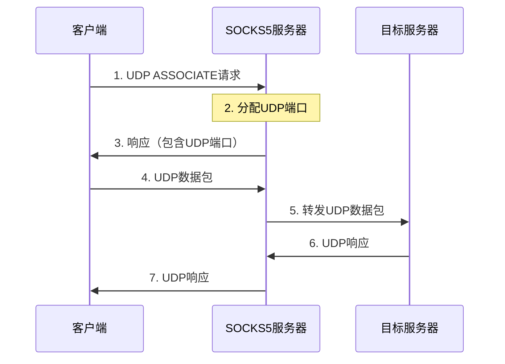
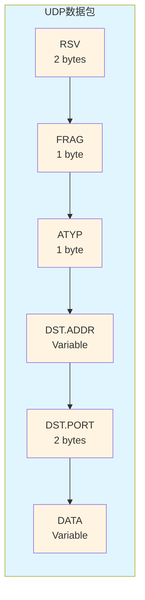

# SOCKS5 协议

## 简介

SOCKS（Socket Secure）是一种网络代理协议，用于在客户端和服务器之间通过代理服务器进行通信。SOCKS5是SOCKS协议的第五版，相比SOCKS4a增加了以下特性：

- **认证机制**：支持多种认证方式，包括无认证、用户名密码认证、GSSAPI等
- **IPv6支持**：支持IPv6地址
- **UDP支持**：支持UDP协议转发
- **域名解析**：支持域名地址类型

SOCKS5协议工作在应用层和传输层之间，可以代理任何基于TCP或UDP的应用层协议。

## 协议流程

SOCKS5协议的完整流程包括三个阶段：

1. **认证协商阶段**：客户端和服务器协商认证方式
2. **认证阶段**：根据协商的认证方式进行认证（如果需要）
3. **请求阶段**：客户端发送连接请求，服务器响应

```mermaid
sequenceDiagram
    participant Client as 客户端
    participant Server as 服务器
    
    Client->>Server: 1. 认证协商请求
    Server->>Client: 2. 认证方式选择
    alt 需要认证
        Client<->>Server: 3. 执行认证
    end
    Client->>Server: 4. 连接请求
    Server->>Client: 5. 连接响应
    Client<->>Server: 6. 数据传输
```

## 认证协商

创建与SOCKS5服务器的TCP连接后，客户端需要先发送请求来协商协议版本及认证方式。

### 客户端认证协商请求

格式（以字节为单位）：

| 字段 | VER | NMETHODS | METHODS |
|------|-----|----------|---------|
| 长度 | 1   | 1        | 1-255   |

- **VER**：SOCKS版本，这里应该是 `0x05`
- **NMETHODS**：METHODS部分的长度（1-255）
- **METHODS**：客户端支持的认证方式列表，每个方法占1字节

**认证方法定义：**

| 值 | 方法 | 说明 |
|----|------|------|
| 0x00 | NO AUTHENTICATION REQUIRED | 不需要认证 |
| 0x01 | GSSAPI | GSSAPI认证 |
| 0x02 | USERNAME/PASSWORD | 用户名、密码认证 |
| 0x03 - 0x7F | IANA ASSIGNED | 由IANA分配（保留） |
| 0x80 - 0xFE | RESERVED FOR PRIVATE METHODS | 为私人方法保留 |
| 0xFF | NO ACCEPTABLE METHODS | 无可接受的方法 |

### 服务器认证协商响应

服务器从客户端提供的方法中选择一个并通过以下消息通知客户端：

| 字段 | VER | METHOD |
|------|-----|--------|
| 长度 | 1   | 1      |

- **VER**：SOCKS版本，这里应该是 `0x05`
- **METHOD**：服务端选中的方法。如果返回 `0xFF` 表示没有一个认证方法被选中，客户端需要关闭连接

之后客户端和服务端根据选定的认证方式执行对应的认证。

**示例：**

客户端发送：`05 01 00`（版本5，1种方法，方法0x00表示不需要认证）
服务器响应：`05 00`（版本5，选择方法0x00）

如果客户端发送：`05 02 00 02`（版本5，2种方法，方法0x00和0x02）
服务器可能响应：`05 02`（版本5，选择方法0x02，即用户名密码认证）

认证结束后客户端就可以发送请求信息。如果认证方法有特殊封装要求，请求必须按照方法所定义的方式进行封装。

## 连接请求

认证成功后，客户端可以向服务器发送连接请求。

### 客户端请求格式

| 字段 | VER | CMD | RSV | ATYP | DST.ADDR | DST.PORT |
|------|-----|-----|-----|------|----------|----------|
| 长度 | 1   | 1   | 1   | 1    | 动态     | 2        |

**字段说明：**

- **VER**：SOCKS版本，固定为 `0x05`
- **CMD**：命令码
  - `0x01`：CONNECT - 建立TCP连接
  - `0x02`：BIND - 绑定端口（用于FTP等需要反向连接的协议）
  - `0x03`：UDP ASSOCIATE - UDP转发
- **RSV**：保留字段，固定为 `0x00`
- **ATYP**：目标地址类型
  - `0x01`：IPv4地址，DST.ADDR为4字节
  - `0x03`：域名，DST.ADDR第一个字节为域名长度（不含\0），后面跟域名
  - `0x04`：IPv6地址，DST.ADDR为16字节
- **DST.ADDR**：目标地址（根据ATYP类型不同而不同）
- **DST.PORT**：目标端口（网络字节序，2字节）

**请求示例：**

1. **连接IPv4地址**：`05 01 00 01 C0 A8 01 01 00 50`
   - VER=0x05, CMD=0x01(CONNECT), RSV=0x00, ATYP=0x01(IPv4)
   - DST.ADDR=192.168.1.1 (C0 A8 01 01)
   - DST.PORT=80 (00 50)

2. **连接域名**：`05 01 00 03 09 65 78 61 6D 70 6C 65 2E 63 6F 6D 00 50`
   - VER=0x05, CMD=0x01(CONNECT), RSV=0x00, ATYP=0x03(域名)
   - 域名长度=9, 域名="example.com"
   - DST.PORT=80

### 服务器响应格式

| 字段 | VER | REP | RSV | ATYP | BND.ADDR | BND.PORT |
|------|-----|-----|-----|------|----------|----------|
| 长度 | 1   | 1   | 1   | 1    | 动态     | 2        |

**字段说明：**

- **VER**：SOCKS版本，固定为 `0x05`
- **REP**：响应码
  - `0x00`：成功
  - `0x01`：普通SOCKS服务器连接失败
  - `0x02`：现有规则不允许连接
  - `0x03`：网络不可达
  - `0x04`：主机不可达
  - `0x05`：连接被拒
  - `0x06`：TTL超时
  - `0x07`：不支持的命令
  - `0x08`：不支持的地址类型
  - `0x09 - 0xFF`：未定义
- **RSV**：保留字段，固定为 `0x00`
- **ATYP**：绑定地址类型（同请求中的ATYP）
- **BND.ADDR**：服务器绑定的地址（通常为0.0.0.0或服务器的IP）
- **BND.PORT**：服务器绑定的端口（网络字节序，2字节）

**响应示例：**

成功响应：`05 00 00 01 00 00 00 00 00 00`
- VER=0x05, REP=0x00(成功), RSV=0x00, ATYP=0x01(IPv4)
- BND.ADDR=0.0.0.0, BND.PORT=0

## 认证方式详解

### 用户名密码认证（USERNAME/PASSWORD）

当客户端和服务器协商使用用户名密码认证（METHOD=0x02）后，需要进行认证交互。

#### 客户端认证请求

| 字段 | VER | ULEN | UNAME | PLEN | PASSWD |
|------|-----|------|-------|------|--------|
| 长度 | 1   | 1    | 1-255 | 1    | 1-255  |

**字段说明：**

- **VER**：认证协议版本，当前为 `0x01`
- **ULEN**：用户名长度（1-255）
- **UNAME**：用户名（1-255字节）
- **PLEN**：密码长度（1-255）
- **PASSWD**：密码（1-255字节）

**示例：**

用户名"admin"，密码"123456"的请求：
```
01 05 61 64 6D 69 6E 06 31 32 33 34 35 36
```
- VER=0x01
- ULEN=0x05, UNAME="admin"
- PLEN=0x06, PASSWD="123456"

#### 服务器认证响应

| 字段 | VER | STATUS |
|------|-----|--------|
| 长度 | 1   | 1      |

**字段说明：**

- **VER**：认证协议版本，当前为 `0x01`
- **STATUS**：认证状态
  - `0x00`：认证成功
  - `0x01`：认证失败

**示例：**

认证成功：`01 00`
认证失败：`01 01`

### 无认证（NO AUTHENTICATION REQUIRED）

如果选择无认证（METHOD=0x00），则跳过认证阶段，直接进入请求阶段。

### GSSAPI认证

GSSAPI（Generic Security Services Application Program Interface）是一种安全认证框架，主要用于企业环境。实现较为复杂，需要支持Kerberos等安全机制。

## 命令详解

### CONNECT命令（0x01）

CONNECT命令用于建立到目标服务器的TCP连接。这是最常用的命令。

**流程：**

```mermaid
sequenceDiagram
    participant Client as 客户端
    participant Proxy as SOCKS5服务器
    participant Target as 目标服务器
    
    Client->>Proxy: 1. CONNECT请求
    Proxy->>Target: 2. 连接到目标服务器
    Target->>Proxy: 3. 连接建立
    Proxy->>Client: 4. 响应（成功）
    Client<->>Proxy: 5. 数据传输
    Proxy<->>Target: 5. 数据传输
```

**使用场景：**
- HTTP/HTTPS代理
- SSH隧道
- 任何基于TCP的应用

### BIND命令（0x02）

BIND命令用于在服务器上绑定一个端口，等待目标服务器连接。主要用于FTP等需要反向连接的协议。

**流程：**

```mermaid
sequenceDiagram
    participant Client as 客户端
    participant Proxy as SOCKS5服务器
    participant Target as 目标服务器
    
    Client->>Proxy: 1. BIND请求
    Note over Proxy: 2. 绑定端口
    Proxy->>Client: 3. 响应（包含绑定地址和端口）
    Note over Client: 4. 通知目标服务器连接BIND端口
    Note over Proxy: 5. 等待连接
    Target->>Proxy: 6. 目标服务器连接
    Proxy->>Client: 7. 响应（连接建立）
    Client<->>Proxy: 8. 数据传输
    Proxy<->>Target: 8. 数据传输
```

**使用场景：**
- FTP协议（需要数据连接）
- 需要反向连接的协议

### UDP ASSOCIATE命令（0x03）

UDP ASSOCIATE命令用于建立UDP转发关联。客户端通过UDP发送数据到服务器，服务器转发到目标地址。

**流程：**



**UDP数据包格式：**



**字段说明：**

- **RSV**：保留字段，固定为 `0x0000`
- **FRAG**：分片标识
  - `0x00`：无分片
  - `0x01 - 0x7F`：分片索引（第一个分片为0x01）
  - `0x80`：最后一个分片
- **ATYP**：地址类型（同TCP请求）
- **DST.ADDR**：目标地址
- **DST.PORT**：目标端口
- **DATA**：数据内容

**使用场景：**
- DNS查询
- 游戏服务器
- 实时通信应用

## 完整交互示例

### 示例1：无认证的TCP连接

```
客户端 -> 服务器: 05 01 00                    # 认证协商：支持无认证
服务器 -> 客户端: 05 00                       # 选择无认证
客户端 -> 服务器: 05 01 00 03 0B 65 78 61 6D 70 6C 65 2E 63 6F 6D 00 50  # CONNECT example.com:80
服务器 -> 客户端: 05 00 00 01 00 00 00 00 00 00  # 连接成功
# 之后开始数据传输
```

### 示例2：用户名密码认证的TCP连接

```
客户端 -> 服务器: 05 02 00 02                 # 认证协商：支持无认证和用户名密码
服务器 -> 客户端: 05 02                       # 选择用户名密码认证
客户端 -> 服务器: 01 05 61 64 6D 69 6E 06 31 32 33 34 35 36  # 用户名admin，密码123456
服务器 -> 客户端: 01 00                       # 认证成功
客户端 -> 服务器: 05 01 00 01 C0 A8 01 01 00 50  # CONNECT 192.168.1.1:80
服务器 -> 客户端: 05 00 00 01 00 00 00 00 00 00  # 连接成功
# 之后开始数据传输
```

## 应用场景

### 1. 网络代理

SOCKS5协议最常见的用途是作为网络代理，帮助客户端访问被防火墙或网络策略限制的资源。

### 2. 科学上网

通过SOCKS5代理服务器，可以绕过网络限制，访问被封锁的网站和服务。

### 3. 企业网络

在企业网络中，SOCKS5代理可以：
- 统一管理网络访问
- 记录和审计网络流量
- 提供安全认证机制

### 4. 游戏加速

通过SOCKS5代理，游戏客户端可以连接到更近的服务器节点，降低延迟。

### 5. 爬虫和数据采集

使用SOCKS5代理可以：
- 隐藏真实IP地址
- 实现IP轮换
- 绕过反爬虫限制

## 安全考虑

1. **认证机制**：建议使用用户名密码认证，避免未授权访问
2. **加密传输**：对于敏感数据，建议在SOCKS5之上使用TLS/SSL加密
3. **访问控制**：服务器应该实现访问控制列表（ACL），限制可访问的目标
4. **日志记录**：记录所有连接请求，便于审计和问题排查

## 参考文献

* [SOCKS Protocol Version 5 (RFC 1928)](https://tools.ietf.org/html/rfc1928)
* [Username/Password Authentication for SOCKS V5 (RFC 1929)](https://tools.ietf.org/html/rfc1929)
* [SOCKS5协议详解](https://zh.wikipedia.org/wiki/SOCKS)
