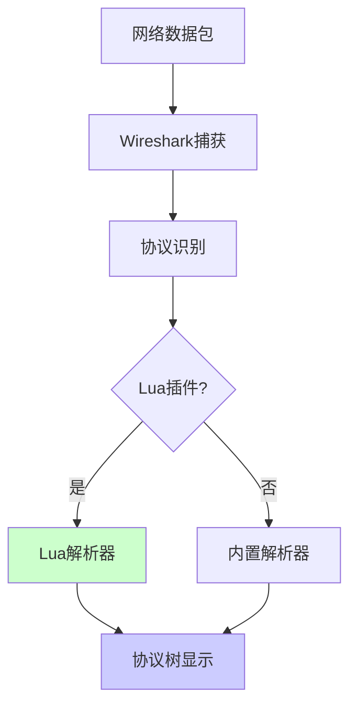
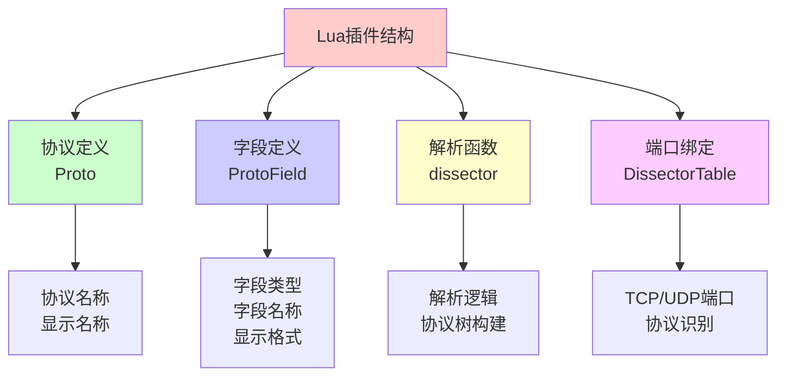
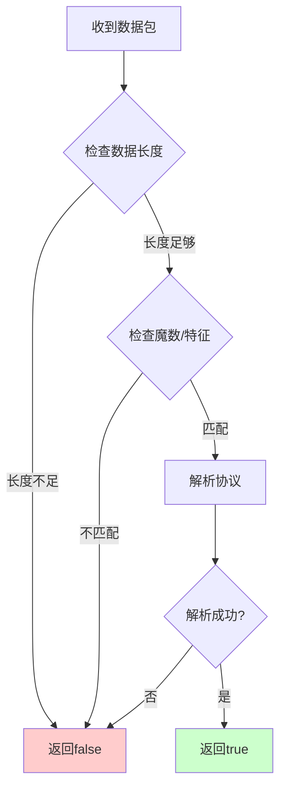

# Wireshark 自定义协议解析概述

Wireshark 支持通过 Lua 脚本扩展协议解析功能，可以解析自定义的私有协议。这对于调试、分析和理解网络通信非常有用。

## 为什么需要自定义协议解析

1. **私有协议**：公司或项目内部使用的自定义协议
2. **协议分析**：需要可视化协议字段和结构
3. **调试工具**：快速定位协议问题
4. **学习研究**：深入理解协议实现

## Wireshark Lua 插件架构



# Lua 脚本基础结构

## 基本框架

Wireshark Lua 插件有固定的代码格式：

```lua
do
    -- 1. 定义协议
    local PROTO = Proto('proto', 'Proto')
    
    -- 2. 定义协议字段
    local field = ProtoField.char("field", "proto field", base.NONE)
    
    -- 3. 协议绑定字段
    PROTO.fields = {
        field,
    }
    
    -- 4. 获取源数据解析器
    local data_dis = Dissector.get("data")
    
    -- 5. 协议解析函数
    local function proto_dissector(buf, pinfo, root)
        -- 自定义协议解析逻辑
    end
    
    -- 6. Wireshark调用的解析函数
    function PROTO.dissector(buf, pinfo, root)
        if proto_dissector(buf, pinfo, root) then
            -- 解析成功
        else
            -- 解析失败，使用默认解析器
            data_dis:call(buf, pinfo, root)
        end
    end
    
    -- 7. 绑定到端口
    local dissectors = DissectorTable.get('tcp.port')
    dissectors:add(8000, PROTO)
end
```

## 组件说明



# 详细组件说明

## 1. 协议定义（Proto）

### 语法

```lua
local PROTO = Proto('protocol_name', 'Protocol Display Name')
```

### 参数说明

- **protocol_name**：协议内部名称（唯一标识符）
- **Protocol Display Name**：在 Wireshark 中显示的名称

### 示例

```lua
-- 定义 Redis 协议
local redis_proto = Proto('redis', 'Redis Protocol')

-- 定义自定义游戏协议
local game_proto = Proto('game', 'Game Protocol')
```

## 2. 字段定义（ProtoField）

### 字段类型

Wireshark 支持多种字段类型：

| 类型 | 说明 | 示例 |
|------|------|------|
| `uint8` | 8位无符号整数 | `ProtoField.uint8("field", "Field Name", base.DEC)` |
| `uint16` | 16位无符号整数 | `ProtoField.uint16("field", "Field Name", base.HEX)` |
| `uint32` | 32位无符号整数 | `ProtoField.uint32("field", "Field Name", base.DEC)` |
| `uint64` | 64位无符号整数 | `ProtoField.uint64("field", "Field Name", base.DEC)` |
| `int8` | 8位有符号整数 | `ProtoField.int8("field", "Field Name", base.DEC)` |
| `int16` | 16位有符号整数 | `ProtoField.int16("field", "Field Name", base.DEC)` |
| `int32` | 32位有符号整数 | `ProtoField.int32("field", "Field Name", "base.DEC")` |
| `string` | 字符串 | `ProtoField.string("field", "Field Name")` |
| `bytes` | 字节数组 | `ProtoField.bytes("field", "Field Name")` |
| `ipv4` | IPv4 地址 | `ProtoField.ipv4("field", "Field Name")` |
| `ipv6` | IPv6 地址 | `ProtoField.ipv6("field", "Field Name")` |

### 显示格式（base）

| 格式 | 说明 | 示例值 |
|------|------|--------|
| `base.DEC` | 十进制 | 123 |
| `base.HEX` | 十六进制 | 0x7B |
| `base.OCT` | 八进制 | 0173 |
| `base.BIN` | 二进制 | 01111011 |
| `base.NONE` | 无格式 | 原始数据 |

### 字段定义示例

```lua
-- 定义各种类型的字段
local fields = {
    -- 整数字段
    ProtoField.uint8("proto.version", "Version", base.DEC),
    ProtoField.uint16("proto.length", "Length", base.DEC),
    ProtoField.uint32("proto.seq", "Sequence", base.HEX),
    
    -- 字符串字段
    ProtoField.string("proto.command", "Command"),
    ProtoField.string("proto.data", "Data"),
    
    -- 字节字段
    ProtoField.bytes("proto.payload", "Payload"),
    
    -- IP 地址字段
    ProtoField.ipv4("proto.src_ip", "Source IP"),
    ProtoField.ipv6("proto.dst_ip", "Destination IP"),
    
    -- 带单位的字段
    ProtoField.uint32("proto.timestamp", "Timestamp", base.DEC, nil, nil, "seconds"),
}

PROTO.fields = fields
```

## 3. 解析函数（Dissector）

### 函数签名

```lua
function proto_dissector(buf, pinfo, root)
    -- buf: 数据缓冲区（Tvb）
    -- pinfo: 数据包信息（Pinfo）
    -- root: 协议树根节点（TreeItem）
    -- 返回值: true 表示解析成功，false 表示解析失败
end
```

### 参数说明

#### buf（Tvb - Testy Virtual Buffer）

数据缓冲区，提供数据访问方法：

```lua
-- 获取数据长度
local len = buf:len()

-- 读取字节
local byte = buf(0, 1):uint()  -- 读取第0个字节

-- 读取多字节（大端序）
local uint16_be = buf(0, 2):uint()
local uint32_be = buf(0, 4):uint64()

-- 读取多字节（小端序）
local uint16_le = buf(0, 2):le_uint()
local uint32_le = buf(0, 4):le_uint64()

-- 读取字符串
local str = buf(0, 10):string()

-- 读取原始字节
local bytes = buf(0, 10):bytes()
```

#### pinfo（Pinfo - Packet Information）

数据包信息，包含协议、端口等信息：

```lua
-- 设置协议名称
pinfo.cols.protocol = "MyProtocol"

-- 设置信息列
pinfo.cols.info = "Custom Info"

-- 获取源端口和目标端口
local src_port = pinfo.src_port
local dst_port = pinfo.dst_port
```

#### root（TreeItem）

协议树根节点，用于构建协议树：

```lua
-- 创建协议树
local subtree = root:add(PROTO, buf())

-- 添加字段到协议树
subtree:add(field_version, buf(0, 1))
subtree:add(field_length, buf(1, 2))

-- 添加带值的字段
subtree:add(field_version, buf(0, 1)):append_text(" (Version 1)")

-- 添加隐藏字段（不显示但可用于过滤）
subtree:add(field_hidden, buf(0, 1))
```

### 解析函数示例

```lua
local function proto_dissector(buf, pinfo, root)
    -- 检查数据长度
    if buf:len() < 4 then
        return false
    end
    
    -- 读取协议头
    local version = buf(0, 1):uint()
    local length = buf(1, 2):uint()
    local command = buf(3, 1):uint()
    
    -- 检查数据完整性
    if buf:len() < 4 + length then
        return false
    end
    
    -- 创建协议树
    local subtree = root:add(PROTO, buf(), "My Protocol")
    
    -- 添加字段
    subtree:add(field_version, buf(0, 1))
    subtree:add(field_length, buf(1, 2))
    subtree:add(field_command, buf(3, 1))
    
    -- 添加数据字段
    if length > 0 then
        subtree:add(field_data, buf(4, length))
    end
    
    -- 设置协议信息
    pinfo.cols.protocol = "MyProtocol"
    pinfo.cols.info = string.format("Command: %d, Length: %d", command, length)
    
    return true
end
```

## 4. 端口绑定

### TCP 端口绑定

```lua
-- 获取 TCP 端口解析器表
local tcp_dissectors = DissectorTable.get('tcp.port')

-- 绑定单个端口
tcp_dissectors:add(8000, PROTO)

-- 绑定多个端口
local ports = {8000, 8001, 8002}
for _, port in ipairs(ports) do
    tcp_dissectors:add(port, PROTO)
end
```

### UDP 端口绑定

```lua
-- 获取 UDP 端口解析器表
local udp_dissectors = DissectorTable.get('udp.port')

-- 绑定端口
udp_dissectors:add(9000, PROTO)
```

### 动态端口识别

```lua
-- 根据协议特征识别（不依赖端口）
function PROTO.dissector(buf, pinfo, root)
    -- 检查协议特征
    if buf:len() >= 4 and buf(0, 4):string() == "MAGIC" then
        return proto_dissector(buf, pinfo, root)
    else
        return false
    end
end

-- 注册为启发式解析器
DissectorTable.get("tcp.port"):add_heuristic("tcp", PROTO)
```

# 完整示例

## 示例 1: 简单的自定义协议

假设有一个简单的自定义协议格式：

```
+--------+--------+--------+
| Version| Length |  Data  |
+--------+--------+--------+
|  1字节  |  2字节  |  N字节  |
+--------+--------+--------+
```

### 完整实现

```lua
do
    -- 定义协议
    local my_proto = Proto('myproto', 'My Custom Protocol')
    
    -- 定义字段
    local fields = {
        ProtoField.uint8("myproto.version", "Version", base.DEC),
        ProtoField.uint16("myproto.length", "Length", base.DEC),
        ProtoField.string("myproto.data", "Data"),
    }
    
    my_proto.fields = fields
    
    -- 解析函数
    local function myproto_dissector(buf, pinfo, root)
        -- 检查最小长度
        if buf:len() < 3 then
            return false
        end
        
        -- 读取版本和长度
        local version = buf(0, 1):uint()
        local length = buf(1, 2):uint()
        
        -- 检查数据完整性
        if buf:len() < 3 + length then
            return false
        end
        
        -- 创建协议树
        local subtree = root:add(my_proto, buf(), "My Protocol")
        
        -- 添加字段
        subtree:add(fields[1], buf(0, 1))
        subtree:add(fields[2], buf(1, 2))
        
        -- 添加数据字段
        if length > 0 then
            local data = buf(3, length):string()
            subtree:add(fields[3], buf(3, length))
        end
        
        -- 设置协议信息
        pinfo.cols.protocol = "MyProto"
        pinfo.cols.info = string.format("Version: %d, Length: %d", version, length)
        
        return true
    end
    
    -- 注册解析函数
    my_proto.dissector = function(buf, pinfo, root)
        local data_dis = Dissector.get("data")
        if myproto_dissector(buf, pinfo, root) then
            -- 解析成功
        else
            -- 解析失败，使用默认解析器
            data_dis:call(buf, pinfo, root)
        end
    end
    
    -- 绑定到端口
    local tcp_dissectors = DissectorTable.get('tcp.port')
    tcp_dissectors:add(8000, my_proto)
end
```

## 示例 2: Redis 协议解析器

Redis 使用 RESP（REdis Serialization Protocol）协议。

### 协议格式

```
*<number of arguments>\r\n
$<length>\r\n<data>\r\n
```

### 实现代码

```lua
do
    local redis_proto = Proto('redis', 'Redis Protocol')
    
    local fields = {
        ProtoField.string("redis.command", "Command"),
        ProtoField.string("redis.argument", "Argument"),
        ProtoField.uint32("redis.arg_count", "Argument Count", base.DEC),
    }
    
    redis_proto.fields = fields
    
    -- 解析 RESP 数组
    local function parse_array(buf, offset)
        if buf:len() < offset + 1 then
            return nil, offset
        end
        
        -- 检查是否是数组标记
        if buf(offset, 1):string() ~= "*" then
            return nil, offset
        end
        
        -- 查找 \r\n
        local crlf_pos = buf:search("\r\n", offset)
        if crlf_pos == nil then
            return nil, offset
        end
        
        -- 读取参数数量
        local count_str = buf(offset + 1, crlf_pos - offset - 1):string()
        local count = tonumber(count_str)
        
        return count, crlf_pos + 2
    end
    
    -- 解析 RESP 字符串
    local function parse_string(buf, offset)
        if buf:len() < offset + 1 then
            return nil, offset
        end
        
        -- 检查是否是字符串标记
        if buf(offset, 1):string() ~= "$" then
            return nil, offset
        end
        
        -- 查找第一个 \r\n（长度）
        local crlf1 = buf:search("\r\n", offset)
        if crlf1 == nil then
            return nil, offset
        end
        
        -- 读取长度
        local len_str = buf(offset + 1, crlf1 - offset - 1):string()
        local len = tonumber(len_str)
        
        if len == -1 then
            -- NULL 字符串
            return nil, crlf1 + 2
        end
        
        -- 查找第二个 \r\n（数据结束）
        local data_start = crlf1 + 2
        local data_end = data_start + len
        
        if buf:len() < data_end + 2 then
            return nil, offset
        end
        
        -- 读取数据
        local data = buf(data_start, len):string()
        
        return data, data_end + 2
    end
    
    -- Redis 解析函数
    local function redis_dissector(buf, pinfo, root)
        if buf:len() < 2 then
            return false
        end
        
        -- 检查是否是 RESP 协议
        local first_char = buf(0, 1):string()
        if first_char ~= "*" then
            return false
        end
        
        local offset = 0
        local count, new_offset = parse_array(buf, offset)
        if count == nil then
            return false
        end
        
        offset = new_offset
        
        -- 创建协议树
        local subtree = root:add(redis_proto, buf(), "Redis Protocol")
        subtree:add(fields[3], count)
        
        -- 解析命令和参数
        local command = nil
        local args = {}
        
        for i = 1, count do
            local str, new_offset = parse_string(buf, offset)
            if str == nil then
                break
            end
            
            if i == 1 then
                command = str
                subtree:add(fields[1], buf(offset, new_offset - offset)):append_text(" (" .. str .. ")")
            else
                table.insert(args, str)
                subtree:add(fields[2], buf(offset, new_offset - offset)):append_text(" (" .. str .. ")")
            end
            
            offset = new_offset
        end
        
        -- 设置协议信息
        pinfo.cols.protocol = "Redis"
        if command then
            pinfo.cols.info = command .. " " .. table.concat(args, " ")
        else
            pinfo.cols.info = "Redis Command"
        end
        
        return true
    end
    
    -- 注册解析函数
    redis_proto.dissector = function(buf, pinfo, root)
        local data_dis = Dissector.get("data")
        if redis_dissector(buf, pinfo, root) then
            -- 解析成功
        else
            data_dis:call(buf, pinfo, root)
        end
    end
    
    -- 绑定到 Redis 默认端口
    local tcp_dissectors = DissectorTable.get('tcp.port')
    tcp_dissectors:add(6379, redis_proto)
end
```

## 示例 3: 二进制协议解析器

假设有一个二进制协议：

```
+--------+--------+--------+--------+
|  Magic |  Type  | Length |  Data  |
+--------+--------+--------+--------+
|  4字节  |  1字节  |  2字节  |  N字节  |
+--------+--------+--------+--------+
```

### 实现代码

```lua
do
    local bin_proto = Proto('binproto', 'Binary Protocol')
    
    local fields = {
        ProtoField.bytes("binproto.magic", "Magic"),
        ProtoField.uint8("binproto.type", "Type", base.DEC),
        ProtoField.uint16("binproto.length", "Length", base.DEC),
        ProtoField.bytes("binproto.data", "Data"),
    }
    
    bin_proto.fields = fields
    
    -- 协议魔数
    local MAGIC = "BINP"
    
    local function binproto_dissector(buf, pinfo, root)
        -- 检查最小长度
        if buf:len() < 7 then
            return false
        end
        
        -- 检查魔数
        if buf(0, 4):string() ~= MAGIC then
            return false
        end
        
        -- 读取字段
        local type_val = buf(4, 1):uint()
        local length = buf(5, 2):uint()
        
        -- 检查数据完整性
        if buf:len() < 7 + length then
            return false
        end
        
        -- 创建协议树
        local subtree = root:add(bin_proto, buf(), "Binary Protocol")
        
        -- 添加字段
        subtree:add(fields[1], buf(0, 4))
        subtree:add(fields[2], buf(4, 1))
        subtree:add(fields[3], buf(5, 2))
        
        -- 添加数据
        if length > 0 then
            subtree:add(fields[4], buf(7, length))
        end
        
        -- 设置协议信息
        pinfo.cols.protocol = "BinProto"
        pinfo.cols.info = string.format("Type: %d, Length: %d", type_val, length)
        
        return true
    end
    
    bin_proto.dissector = function(buf, pinfo, root)
        local data_dis = Dissector.get("data")
        if binproto_dissector(buf, pinfo, root) then
            -- 解析成功
        else
            data_dis:call(buf, pinfo, root)
        end
    end
    
    -- 绑定到端口
    local tcp_dissectors = DissectorTable.get('tcp.port')
    tcp_dissectors:add(9000, bin_proto)
end
```

# 高级功能

## 1. 协议分层

支持协议嵌套，一个协议可以调用另一个协议：

```lua
-- 获取底层协议解析器
local tcp_dissector = Dissector.get("tcp")

-- 在自定义协议中调用底层协议
function PROTO.dissector(buf, pinfo, root)
    -- 解析自定义协议头
    local header_len = 4
    local subtree = root:add(PROTO, buf(0, header_len))
    
    -- 解析剩余数据（可能是另一个协议）
    local remaining = buf(header_len):tvb()
    tcp_dissector:call(remaining, pinfo, root)
    
    return true
end
```

## 2. 数据包重组

处理分片的数据包：

```lua
-- 使用 TvbRange 处理分片
local function handle_fragmented_data(buf, pinfo, root)
    -- 检查是否是分片
    if pinfo.desegment_len ~= 0 or pinfo.desegment_offset ~= 0 then
        -- 需要重组
        pinfo.desegment_len = DESEGMENT_ONE_SEGMENT
        pinfo.desegment_offset = 0
        return false  -- 等待更多数据
    end
    
    -- 处理完整数据
    return true
end
```

## 3. 协议字段过滤

支持基于字段的过滤：

```lua
-- 定义字段时，字段名可用于过滤
local field_version = ProtoField.uint8("myproto.version", "Version", base.DEC)

-- 用户可以在 Wireshark 中使用过滤：
-- myproto.version == 1
-- myproto.length > 100
```

## 4. 协议统计

添加协议统计信息：

```lua
-- 统计信息
local stats = {
    packet_count = 0,
    total_bytes = 0,
}

function PROTO.dissector(buf, pinfo, root)
    stats.packet_count = stats.packet_count + 1
    stats.total_bytes = stats.total_bytes + buf:len()
    
    -- 解析逻辑...
end

-- 在 Wireshark 中可以通过 Statistics -> Protocol Hierarchy 查看统计
```

## 5. 自定义列显示

在 Wireshark 的列中显示自定义信息：

```lua
function PROTO.dissector(buf, pinfo, root)
    -- 解析协议
    local command = buf(0, 1):uint()
    
    -- 设置信息列
    pinfo.cols.info = string.format("Command: %d", command)
    
    -- 设置协议列
    pinfo.cols.protocol = "MyProto"
end
```

# 调试技巧

## 1. 使用 print 调试

```lua
function PROTO.dissector(buf, pinfo, root)
    -- 打印调试信息
    print("Buffer length: " .. buf:len())
    print("First byte: " .. buf(0, 1):uint())
    
    -- 解析逻辑...
end
```

## 2. 检查数据长度

```lua
function PROTO.dissector(buf, pinfo, root)
    -- 总是先检查数据长度
    if buf:len() < MIN_PACKET_LENGTH then
        return false
    end
    
    -- 解析逻辑...
end
```

## 3. 验证协议特征

```lua
function PROTO.dissector(buf, pinfo, root)
    -- 验证魔数或特征字节
    if buf:len() < 4 then
        return false
    end
    
    local magic = buf(0, 4):string()
    if magic ~= "MAGIC" then
        return false
    end
    
    -- 继续解析...
end
```

## 4. 错误处理

```lua
function PROTO.dissector(buf, pinfo, root)
    local ok, err = pcall(function()
        -- 解析逻辑
        local version = buf(0, 1):uint()
        -- ...
    end)
    
    if not ok then
        print("Error in dissector: " .. tostring(err))
        return false
    end
    
    return true
end
```

# 最佳实践

## 1. 协议识别



## 2. 字段命名规范

```lua
-- 好的命名：使用协议前缀
ProtoField.uint8("myproto.version", "Version", base.DEC)
ProtoField.uint16("myproto.length", "Length", base.DEC)

-- 避免命名冲突
-- 不好的命名
ProtoField.uint8("version", "Version", base.DEC)  -- 可能与其他协议冲突
```

## 3. 错误处理

```lua
function PROTO.dissector(buf, pinfo, root)
    -- 使用 pcall 捕获错误
    local ok, result = pcall(function()
        -- 解析逻辑
        return parse_protocol(buf, pinfo, root)
    end)
    
    if not ok then
        -- 记录错误但不影响其他解析器
        return false
    end
    
    return result
end
```

## 4. 性能优化

```lua
-- 1. 尽早返回（快速失败）
function PROTO.dissector(buf, pinfo, root)
    if buf:len() < MIN_LEN then
        return false  -- 快速返回
    end
    
    -- 2. 缓存常用值
    local len = buf:len()
    
    -- 3. 避免不必要的字符串操作
    -- 只在需要时转换为字符串
end
```

## 5. 代码组织

```lua
-- 将相关功能组织在一起
do
    -- 常量定义
    local MAGIC = "MAGIC"
    local MIN_LENGTH = 4
    
    -- 协议定义
    local PROTO = Proto('myproto', 'My Protocol')
    
    -- 字段定义
    local fields = {
        -- ...
    }
    
    -- 辅助函数
    local function helper_function()
        -- ...
    end
    
    -- 解析函数
    local function dissector_function()
        -- ...
    end
    
    -- 注册
    PROTO.dissector = dissector_function
    DissectorTable.get('tcp.port'):add(8000, PROTO)
end
```

# 常见问题

## 1. 脚本不生效

**问题**：Lua 脚本加载后不工作。

**解决**：
- 检查脚本语法错误（Wireshark -> Help -> About Wireshark -> Plugins）
- 确认端口绑定正确
- 检查协议识别逻辑

## 2. 解析器冲突

**问题**：多个解析器同时匹配。

**解决**：
- 使用更严格的协议识别
- 调整解析器优先级
- 使用启发式解析

## 3. 数据不完整

**问题**：数据包被分片，解析不完整。

**解决**：
- 使用 `pinfo.desegment_len` 处理分片
- 检查数据长度
- 等待完整数据包

## 4. 性能问题

**问题**：解析器执行缓慢。

**解决**：
- 优化解析逻辑
- 减少字符串操作
- 使用缓存

# 实践案例

## Redis 协议解析器

参考实现：[wireshark-redis](https://github.com/djaigoo/wireshark-redis)

### 主要功能

1. **解析 RESP 协议**：支持数组、字符串、整数等类型
2. **命令识别**：识别 Redis 命令（GET、SET、PUBLISH 等）
3. **参数显示**：显示命令参数
4. **协议树**：构建完整的协议树

### 使用效果

- 在 Wireshark 中可以直接看到 Redis 命令
- 支持过滤：`redis.command == "GET"`
- 协议树显示完整的命令和参数

## 其他协议解析器示例

- **MQTT 协议**：解析 MQTT 消息
- **自定义游戏协议**：解析游戏网络包
- **RPC 协议**：解析 RPC 调用
- **数据库协议**：解析数据库通信

# 总结

Wireshark Lua 插件开发要点：

## 核心步骤

1. **定义协议**：使用 `Proto` 创建协议对象
2. **定义字段**：使用 `ProtoField` 定义协议字段
3. **实现解析函数**：解析数据并构建协议树
4. **绑定端口**：将解析器绑定到特定端口

## 关键技巧

- **快速失败**：尽早检查协议特征，不匹配立即返回
- **错误处理**：使用 `pcall` 捕获错误
- **字段命名**：使用协议前缀避免冲突
- **性能优化**：减少不必要的操作

## 适用场景

- 私有协议分析
- 协议调试
- 网络问题排查
- 协议学习研究

理解 Wireshark Lua 插件开发有助于：
- 快速分析自定义协议
- 提高网络调试效率
- 深入理解协议实现
- 构建专业的网络分析工具

# 参考文献

- [Chapter 11. Wireshark's Lua API Reference Manual](https://www.wireshark.org/docs/wsdg_html_chunked/wsluarm_modules.html)
- [Wireshark Lua API Examples](https://wiki.wireshark.org/Lua/Examples)
- [Redis Wireshark Plugin](https://github.com/jzwinck/redis-wireshark)
- [Wireshark Redis Plugin](https://github.com/djaigoo/wireshark-redis)
