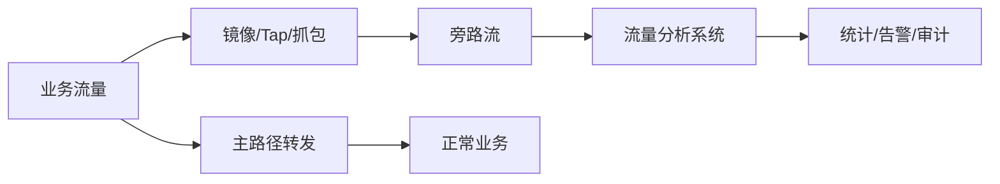
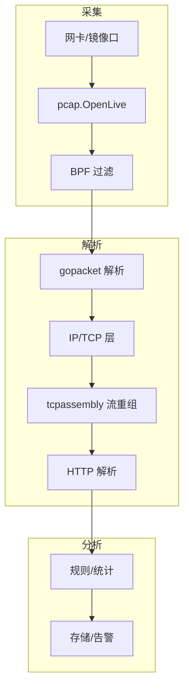

# 旁路流

## 什么是旁路流

**旁路流**（ByPass 流量 / 旁路流量）在不同场景下有两种常见含义：

### 1. 转发层面的旁路流

在网络骨干或数据中心中，**旁路流**指那些「过境」的流量——即经过本节点但**不需要在本节点做业务处理**、只需转发的流量。这类流量可以通过**旁路技术**在光层或物理层直接 bypass 核心路由器/交换机，减轻核心设备的处理压力。

- 在运营商骨干网中，旁路流常占 50% 以上。
- 通过光层与 IP 层协同，在光层旁路「过境」流量，可显著降低核心路由器负载。

### 2. 观测/分析层面的旁路流（镜像流量）

在**流量观测与安全分析**场景下，**旁路流**更多指：在不影响业务路径的前提下，通过**镜像（Mirror）/分光（Tap）**得到的、用于分析的流量副本。即「主路径正常转发，副本走旁路给分析系统」。

- **非侵入**：不修改、不拦截业务报文，只读副本。
- **旁路采集**：用 libpcap、端口镜像、分光器等在旁路抓包或收流。
- **典型用途**：流量分析、行为分析、安全审计、性能监控、基于 HTTP 等协议的机器行为识别等。

下文重点讨论**基于旁路流做流量分析**的含义与 Golang 实现。

## 旁路流的作用

基于旁路流做流量分析时，主要作用包括：

| 作用         | 说明 |
|--------------|------|
| **非侵入式监控** | 不嵌入业务代码、不代理业务流量，仅分析镜像/抓包数据，对业务无侵入。 |
| **安全与审计**   | 入侵检测、异常流量发现、合规审计、数据泄露检测等。 |
| **行为分析**     | 基于 HTTP/HTTPS 等旁路流量做机器行为识别、接口调用统计、用户行为分析。 |
| **性能与质量**   | 延迟分布、丢包、重传、流量分布等，用于容量规划与故障定位。 |
| **可扩展**       | 分析逻辑与业务解耦，可独立扩容、升级分析规则与算法。 |

整体数据流可概括为：



## 基于旁路流的流量分析流程

典型步骤为：

1. **流量采集**：在指定网卡或镜像口上抓包（如 libpcap/gopacket），或从分光/镜像设备接收流量。
2. **过滤与解析**：用 BPF 过滤关心的流量（如端口、协议），并解析以太网、IP、TCP/UDP、HTTP 等层级。
3. **会话/流重组**（可选）：对 TCP 做流重组，得到完整 HTTP 请求/响应等，便于做应用层分析。
4. **规则与指标**：在解析后的数据上做规则匹配、统计指标、行为判断，并输出到存储或告警。

## Golang 实现：基于旁路流做流量分析

Golang 中常用 **gopacket**（基于 libpcap）做旁路抓包与协议解析；也可选用纯 Go 的 **go-pcap**（无需 CGO）。下面以 gopacket 为例说明如何实现「旁路抓包 + 流量分析」。

### 依赖

```bash
go get github.com/google/gopacket
go get github.com/google/gopacket/pcap
go get github.com/google/gopacket/layers
```

（系统需安装 libpcap；Linux 上通常为 `libpcap-dev`。）

### 1. 打开网卡并设置 BPF 过滤（旁路采集）

```go
package main

import (
	"fmt"
	"log"
	"time"

	"github.com/google/gopacket"
	"github.com/google/gopacket/pcap"
	"github.com/google/gopacket/layers"
)

func main() {
	// 选择网卡，如 "eth0"、"en0" 或 "any"
	device := "any"
	snapshotLen := int32(262144)
	promisc := true
	timeout := pcap.BlockForever

	handle, err := pcap.OpenLive(device, snapshotLen, promisc, timeout)
	if err != nil {
		log.Fatal(err)
	}
	defer handle.Close()

	// 只分析关心的流量，例如 HTTP 常见端口
	if err := handle.SetBPFFilter("tcp port 80 or tcp port 443 or tcp port 8080"); err != nil {
		log.Fatal(err)
	}

	source := gopacket.NewPacketSource(handle, handle.LinkType())
	for packet := range source.Packets() {
		analyzePacket(packet)
	}
}

func analyzePacket(packet gopacket.Packet) {
	// 解析各层
	netLayer := packet.NetworkLayer()
	if netLayer == nil {
		return
	}
	transportLayer := packet.TransportLayer()
	if transportLayer == nil {
		return
	}

	srcIP := netLayer.NetworkFlow().Src().String()
	dstIP := netLayer.NetworkFlow().Dst().String()
	srcPort := transportLayer.TransportFlow().Src().String()
	dstPort := transportLayer.TransportFlow().Dst().String()

	// 简单统计：打印五元组
	fmt.Printf("[%s] %s:%s -> %s:%s\n",
		time.Now().Format("15:04:05"),
		srcIP, srcPort, dstIP, dstPort,
	)

	// 若有 TCP 层，可进一步取标志位等
	if tcp, ok := transportLayer.(*layers.TCP); ok {
		if tcp.SYN && !tcp.ACK {
			fmt.Println("  -> SYN (新连接)")
		}
	}
}
```

以上实现的是**旁路采集**：从网卡读包（或从镜像口读），不参与业务转发，只做观测。

### 2. 解析 HTTP（应用层流量分析）

若需基于旁路流做 HTTP 行为分析，需要从 TCP 流中重组出 HTTP。gopacket 提供 `tcpassembly` 做流重组，再在重组出的流上解析 HTTP。

```go
package main

import (
	"fmt"
	"log"
	"sync"

	"github.com/google/gopacket"
	"github.com/google/gopacket/layers"
	"github.com/google/gopacket/pcap"
	"github.com/google/gopacket/tcpassembly"
)

func main() {
	handle, err := pcap.OpenLive("any", 262144, true, pcap.BlockForever)
	if err != nil {
		log.Fatal(err)
	}
	defer handle.Close()

	if err := handle.SetBPFFilter("tcp port 80"); err != nil {
		log.Fatal(err)
	}

	// 流重组：将 TCP 分片重组为完整流，便于解析 HTTP
	streamPool := tcpassembly.NewStreamPool(&httpStreamFactory{})
	assembler := tcpassembly.NewAssembler(streamPool)

	source := gopacket.NewPacketSource(handle, handle.LinkType())
	for packet := range source.Packets() {
		if packet.NetworkLayer() == nil || packet.TransportLayer() == nil {
			continue
		}
		net := packet.NetworkLayer()
		transport := packet.TransportLayer()
		if tcp, ok := transport.(*layers.TCP); ok {
			assembler.AssembleWithTimestamp(
				net.NetworkFlow(),
				tcp,
				packet.Metadata().Timestamp,
			)
		}
	}
}

type httpStreamFactory struct{}

func (f *httpStreamFactory) New(net, transport gopacket.Flow) tcpassembly.Stream {
	return &httpStream{
		net:       net,
		transport: transport,
	}
}

type httpStream struct {
	net, transport gopacket.Flow
	mu             sync.Mutex
}

func (s *httpStream) Reassembled(rs []tcpassembly.Reassembly) {
	for _, r := range rs {
		// 这里得到的是 TCP 流的有序 payload，可按 HTTP 协议解析
		// 实际项目中可接入 http://github.com/google/gopacket/tcpassembly 的 StreamReader
		// 或自行解析 HTTP 请求行、Header、Body
		if len(r.Bytes) > 0 {
			fmt.Printf("[%s -> %s] len=%d\n",
				s.net.Src(), s.net.Dst(), len(r.Bytes))
			// 简单示例：打印前 200 字节（实际应解析 HTTP）
			if len(r.Bytes) <= 200 {
				fmt.Printf("  payload: %q\n", r.Bytes)
			} else {
				fmt.Printf("  payload: %q...\n", r.Bytes[:200])
			}
		}
	}
}

func (s *httpStream) ReassemblyComplete() {}
```

将 `Reassembled` 中的 `r.Bytes` 按 HTTP 格式解析，即可得到方法、URI、Host、User-Agent 等，用于「基于 HTTP 旁路流量的机器行为分析」或接口统计。

### 3. 使用 DecodingLayerParser 做高性能解析（可选）

包量很大时，可避免多次反射，用 `DecodingLayerParser` 只解析关心的层，提升性能：

```go
import (
	"github.com/google/gopacket"
	"github.com/google/gopacket/layers"
	"github.com/google/gopacket/pcap"
)

var (
	eth     layers.Ethernet
	ip4     layers.IPv4
	tcp     layers.TCP
	decoded []gopacket.LayerType
)

func init() {
	decoded = []gopacket.LayerType{}
}

func parsePacket(data []byte) {
	parser := gopacket.NewDecodingLayerParser(
		layers.LayerTypeEthernet, &eth, &ip4, &tcp,
	)
	err := parser.DecodeLayers(data, &decoded)
	if err != nil {
		return
	}
	for _, typ := range decoded {
		switch typ {
		case layers.LayerTypeIPv4:
			fmt.Printf("IP: %s -> %s\n", ip4.SrcIP, ip4.DstIP)
		case layers.LayerTypeTCP:
			fmt.Printf("TCP: %d -> %d\n", tcp.SrcPort, tcp.DstPort)
		}
	}
}

// 在 OpenLive 的循环中：
// parsePacket(packet.Data())
```

这样在旁路分析中既能保证「只读副本、不碰主路径」，又能按需解析到 IP/TCP/应用层做统计与规则匹配。

### 4. 整体架构小结



- **旁路**：只从网卡或镜像口读包，不转发业务流量。
- **流量分析**：BPF 过滤 → 多层解析 → 可选 TCP 流重组 → HTTP/应用层解析 → 规则与指标。

## 小结

- **旁路流**既可指骨干网中 bypass 核心设备的「过境流」，也可指观测场景下**镜像/抓包得到的、用于分析的流量副本**。
- 基于旁路流做流量分析的作用包括：非侵入式监控、安全审计、行为分析、性能与质量分析，并与业务解耦、易扩展。
- 在 Golang 中可用 **gopacket**（或纯 Go 的 go-pcap）在旁路抓包，配合 **BPF 过滤**、**tcpassembly 流重组**和 **HTTP 解析**，实现从链路层到应用层的流量分析；高性能场景下可使用 `DecodingLayerParser` 减少反射开销。
