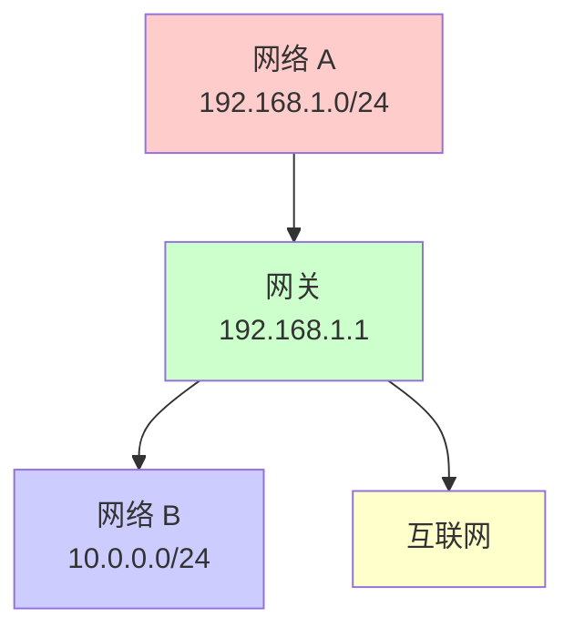
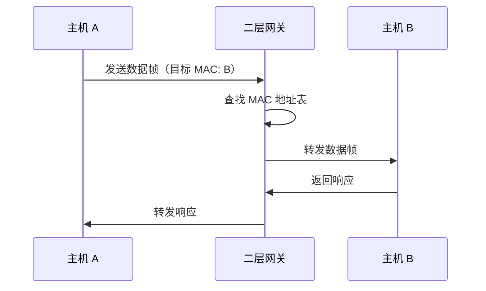
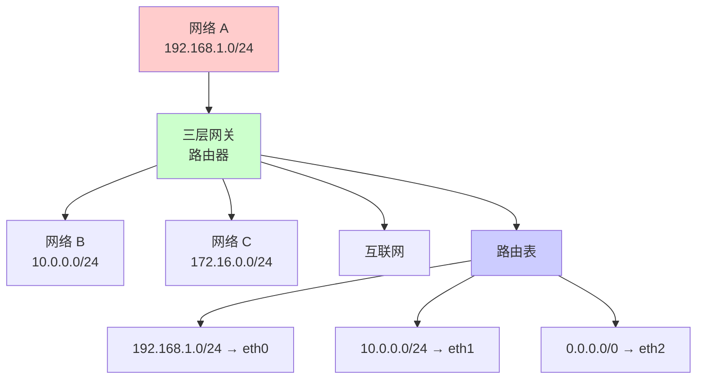
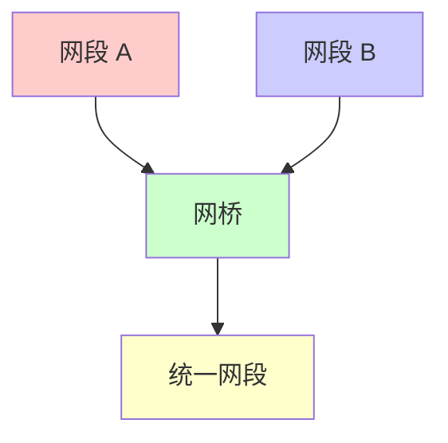
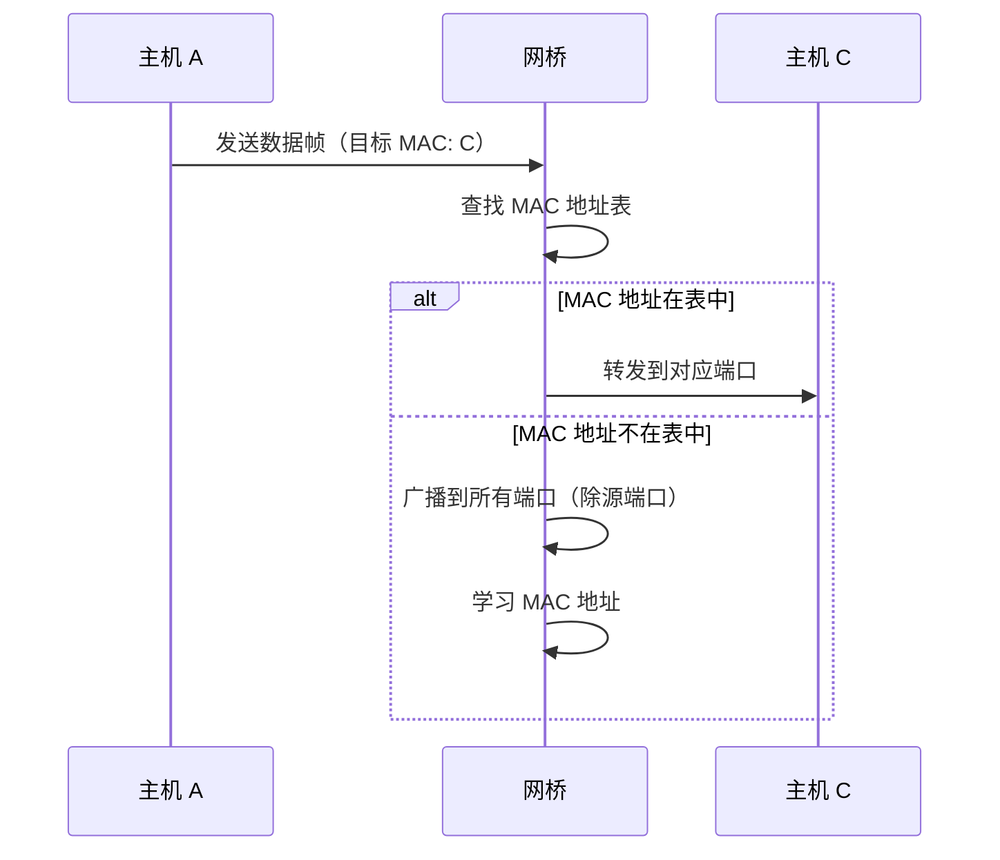
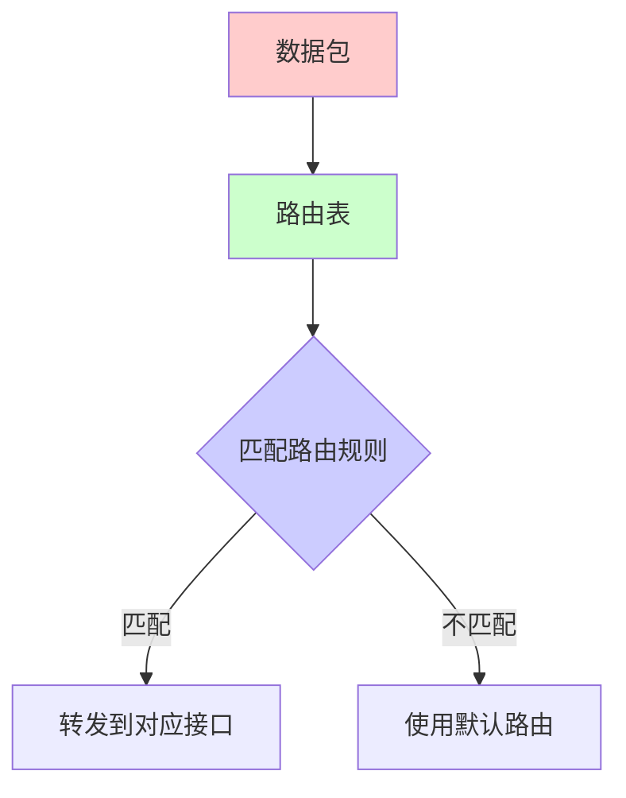
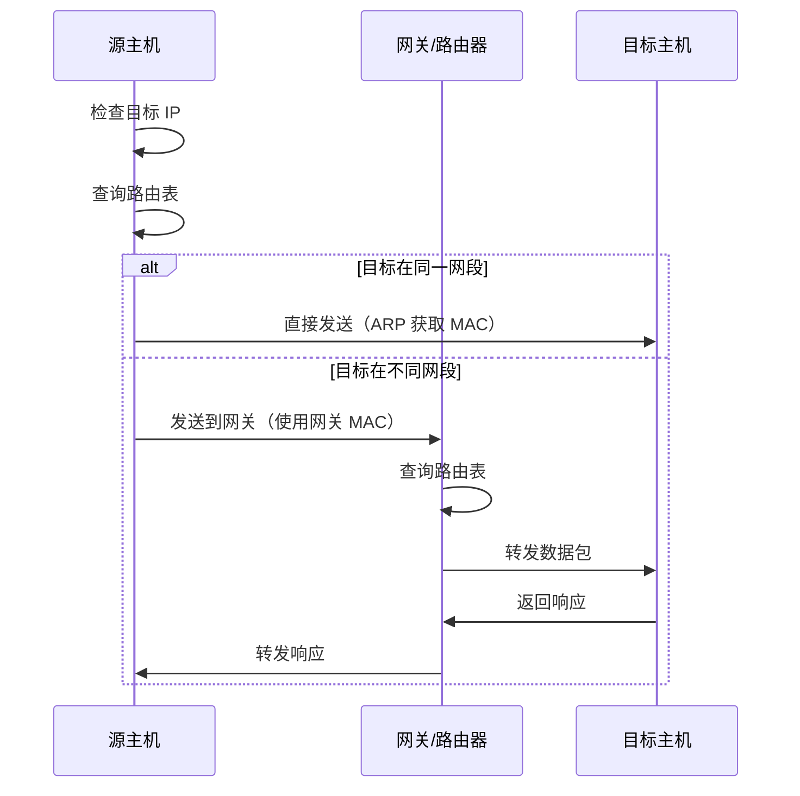

本文详细介绍网络基础设施的核心概念，包括网卡、网关、网桥和路由表，这些是理解网络通信的基础。

# 网卡

## 什么是网卡

网卡（Network Interface Card，NIC）是计算机与网络之间的物理接口，负责将数据转换为可以在网络上传输的信号。


### 网卡的功能

1. **数据封装**：将上层数据封装成帧
2. **数据发送**：将数据转换为电信号发送到网络
3. **数据接收**：接收网络信号并转换为数据
4. **地址识别**：通过 MAC 地址识别数据包
5. **错误检测**：检测数据传输错误

### 网卡的类型

- **以太网卡**：最常见的网卡类型
- **无线网卡**：Wi-Fi 网卡
- **光纤网卡**：用于高速网络
- **虚拟网卡**：软件实现的网卡

## 什么是虚拟网卡

虚拟网卡（Virtual Network Interface）是通过软件实现的网络接口，不依赖物理硬件。

### 虚拟网卡的特点

- **软件实现**：完全由软件实现
- **灵活配置**：可以动态创建和删除
- **多实例**：一台机器可以有多个虚拟网卡
- **功能扩展**：可以实现特殊功能（如隧道、VPN）

### 虚拟网卡的类型

#### 1. Loopback（回环接口）

```bash
# 查看回环接口
ip addr show lo

# 输出示例
1: lo: <LOOPBACK,UP,LOWER_UP> mtu 65536 qdisc noqueue state UNKNOWN
    inet 127.0.0.1/8 scope host lo
```

**特点**：
- 地址：127.0.0.1（IPv4）或 ::1（IPv6）
- 用途：本地进程间通信
- 特点：数据不会离开本机

#### 2. TUN/TAP

```bash
# TUN（点对点设备）
# 工作在网络层（IP 层）
ip tuntap add mode tun tun0

# TAP（以太网设备）
# 工作在数据链路层
ip tuntap add mode tap tap0
```

**用途**：
- **VPN**：OpenVPN、WireGuard 等
- **虚拟化**：KVM、QEMU 等
- **网络隧道**：各种隧道协议

#### 3. Veth Pair（虚拟以太网对）

```bash
# 创建 veth pair
ip link add veth0 type veth peer name veth1

# 配置 IP 地址
ip addr add 10.0.0.1/24 dev veth0
ip addr add 10.0.0.2/24 dev veth1

# 启用接口
ip link set veth0 up
ip link set veth1 up
```

**用途**：
- **容器网络**：Docker、Kubernetes 等
- **网络命名空间**：Linux 网络隔离
- **虚拟网络**：连接不同的网络命名空间

#### 4. Bridge（网桥接口）

见[网桥](#网桥)章节。

### 虚拟网卡的应用

#### Docker 网络

```bash
# Docker 创建的虚拟网卡
ip addr show docker0

# 输出示例
3: docker0: <BROADCAST,MULTICAST,UP,LOWER_UP> mtu 1500
    inet 172.17.0.1/16 scope global docker0
```

#### Kubernetes Pod 网络

```bash
# Pod 使用的 veth pair
ip link show type veth

# 每个 Pod 都有独立的网络命名空间和虚拟网卡
```

# 网关

## 什么是网关

网关（Gateway）是连接不同网络的设备，负责在不同网络之间转发数据包。网关通常工作在网络层（OSI 第三层）或更高层。



### 网关的功能

1. **路由转发**：在不同网络间转发数据包
2. **协议转换**：转换不同网络协议
3. **地址转换**：NAT（网络地址转换）
4. **安全控制**：防火墙、访问控制
5. **流量管理**：QoS、流量整形

### 默认网关

默认网关是当目标地址不在本地网络时，数据包发送的目标。

```bash
# 查看默认网关
ip route show default

# 输出示例
default via 192.168.1.1 dev eth0

# 或使用 route 命令
route -n
```

## 什么是二层网关

二层网关（Layer 2 Gateway）工作在网络的数据链路层（OSI 第二层），基于 MAC 地址进行转发。

### 二层网关的特点

- **MAC 地址转发**：基于 MAC 地址表转发
- **广播域**：在同一广播域内
- **透明桥接**：对上层协议透明
- **学习功能**：学习 MAC 地址和端口映射

### 二层网关的工作原理



### 二层网关的应用

- **交换机**：传统二层交换机
- **虚拟交换机**：Open vSwitch、Linux Bridge
- **VLAN 网关**：VLAN 间的通信

## 什么是三层网关

三层网关（Layer 3 Gateway）工作在网络层（OSI 第三层），基于 IP 地址进行路由转发。

### 三层网关的特点

- **IP 地址路由**：基于 IP 地址和路由表
- **跨网络通信**：可以连接不同网段
- **路由协议**：支持动态路由协议
- **NAT 功能**：网络地址转换

### 三层网关的工作原理



### 三层网关的功能

#### 1. 路由转发

```bash
# 查看路由表
ip route show

# 输出示例
192.168.1.0/24 dev eth0 proto kernel scope link src 192.168.1.1
10.0.0.0/24 via 10.0.0.1 dev eth1
default via 203.0.113.1 dev eth2
```

#### 2. NAT（网络地址转换）

```bash
# SNAT（源地址转换）
iptables -t nat -A POSTROUTING -s 192.168.1.0/24 -o eth0 -j SNAT --to-source 203.0.113.10

# DNAT（目标地址转换）
iptables -t nat -A PREROUTING -d 203.0.113.10 -p tcp --dport 80 -j DNAT --to-destination 192.168.1.100:8080
```

#### 3. 防火墙

```bash
# 允许特定流量
iptables -A FORWARD -s 192.168.1.0/24 -d 10.0.0.0/24 -j ACCEPT

# 拒绝特定流量
iptables -A FORWARD -s 192.168.1.0/24 -d 10.0.0.0/24 -j DROP
```

### 三层网关的应用

- **路由器**：传统网络路由器
- **Linux 路由器**：使用 Linux 系统作为路由器
- **云网关**：云平台的虚拟网关
- **SDN 网关**：软件定义网络网关

### 二层网关 vs 三层网关

| 特性 | 二层网关 | 三层网关 |
|------|---------|---------|
| **工作层次** | 数据链路层（L2） | 网络层（L3） |
| **转发依据** | MAC 地址 | IP 地址 |
| **广播域** | 同一广播域 | 不同广播域 |
| **路由功能** | 无 | 有 |
| **NAT 功能** | 无 | 有 |
| **典型设备** | 交换机 | 路由器 |

# 网桥

## 什么是网桥

网桥（Bridge）是连接两个或多个网段的设备，工作在数据链路层，基于 MAC 地址转发数据帧。



### 网桥的功能

1. **帧转发**：根据 MAC 地址转发数据帧
2. **帧过滤**：过滤不需要转发的帧
3. **学习功能**：学习 MAC 地址和端口映射
4. **环路防止**：STP（生成树协议）防止环路

### 网桥的工作原理



### 网桥的类型

#### 1. 透明网桥

- **特点**：对上层协议透明
- **应用**：最常见的网桥类型
- **标准**：IEEE 802.1D

#### 2. 源路由网桥

- **特点**：路由信息由源主机决定
- **应用**：Token Ring 网络
- **标准**：IEEE 802.5

## 什么是虚拟网桥

虚拟网桥（Virtual Bridge）是通过软件实现的网桥，不依赖物理硬件。

### Linux Bridge

Linux Bridge 是 Linux 内核提供的虚拟网桥实现。

#### 创建和管理

```bash
# 创建网桥
ip link add name br0 type bridge

# 启用网桥
ip link set br0 up

# 配置 IP 地址
ip addr add 192.168.1.1/24 dev br0

# 将物理网卡加入网桥
ip link set eth0 master br0

# 查看网桥信息
bridge link show

# 查看网桥 MAC 地址表
bridge fdb show
```

#### 网桥配置示例

```bash
# 创建网桥并配置
brctl addbr br0
brctl addif br0 eth0
brctl addif br0 eth1
ifconfig br0 192.168.1.1 netmask 255.255.255.0 up
```

### Open vSwitch

Open vSwitch（OVS）是功能更强大的虚拟交换机。

#### 基本操作

```bash
# 创建 OVS 网桥
ovs-vsctl add-br br0

# 添加端口
ovs-vsctl add-port br0 eth0
ovs-vsctl add-port br0 tap0

# 查看网桥
ovs-vsctl show

# 查看流表
ovs-ofctl dump-flows br0
```

### 虚拟网桥的应用

#### 1. 容器网络

```bash
# Docker 默认网桥
docker network ls

# 创建自定义网桥
docker network create --driver bridge mynetwork
```

#### 2. 虚拟化网络

```bash
# KVM 虚拟机网络
# 使用 Linux Bridge 连接虚拟机
virsh net-list
virsh net-info default
```

#### 3. Kubernetes 网络

```yaml
# CNI 插件使用网桥
# Flannel、Calico 等都使用网桥技术
apiVersion: v1
kind: Pod
metadata:
  name: nginx
spec:
  containers:
  - name: nginx
    image: nginx
```

### 网桥 vs 交换机

| 特性 | 网桥 | 交换机 |
|------|------|--------|
| **端口数** | 通常 2-4 个 | 多个端口 |
| **转发方式** | 软件转发 | 硬件转发 |
| **性能** | 较低 | 较高 |
| **成本** | 低 | 高 |
| **灵活性** | 高 | 低 |

### 网桥 vs 网关

| 对比项     | 网桥                                              | 网关                                                     |
|------------|---------------------------------------------------|----------------------------------------------------------|
| **定义**   | 连接同一网络的不同网段，实现二层转发               | 连接不同网络，实现三层及以上网络协议的连接与转换         |
| **工作层次** | 数据链路层（第二层）                             | 网络层、传输层，甚至应用层                               |
| **优点**   | <ul><li>1. 简单高效，转发速度快</li><li>2. 能实现同类型网络的隔离与互通</li><li>3. 配置灵活，可透明接入网络</li></ul> | <ul><li>1. 能连接不同类型的网络（如局域网与广域网）</li><li>2. 支持协议转换和地址转换（如 NAT）</li><li>3. 能进行访问控制和安全策略配置</li></ul> |
| **缺点**   | <ul><li>1. 只能连接同类型协议的网络，无法跨协议</li><li>2. 对大型网络广播域可能造成广播风暴</li><li>3. 无法做复杂的流量管理和安全策略</li></ul> | <ul><li>1. 转发性能通常低于网桥（要处理更复杂的协议）</li><li>2. 配置相对复杂</li><li>3. 可能成为网络瓶颈或单点故障</li></ul> |
| **典型应用** | 虚拟化网络、局域网隔离/互联、容器网络             | 出网网关、路由器、防火墙、VPN 网关                      |


# 路由表

## 什么是路由表

路由表（Routing Table）是存储路由信息的表，用于决定数据包应该发送到哪个网络接口或下一跳地址。



### 路由表的作用

1. **路径选择**：选择数据包的最佳路径
2. **网络隔离**：区分不同网段
3. **流量控制**：控制数据流向
4. **负载均衡**：在多条路径间分配流量

### 路由表的组成

路由表通常包含以下字段：

- **目标网络**：目标网络地址和子网掩码
- **网关**：下一跳地址
- **接口**：发送数据包的接口
- **度量值**：路由的优先级（metric）
- **标志**：路由的状态标志

### 查看路由表

#### Linux 系统

```bash
# 使用 ip 命令
ip route show

# 输出示例
default via 192.168.1.1 dev eth0 proto static
192.168.1.0/24 dev eth0 proto kernel scope link src 192.168.1.100
10.0.0.0/24 via 10.0.0.1 dev eth1 proto static metric 100
172.16.0.0/16 via 172.16.0.1 dev eth2 proto static metric 200
```

#### 使用 route 命令

```bash
# 查看路由表
route -n

# 输出示例
Kernel IP routing table
Destination     Gateway         Genmask         Flags Metric Ref    Use Iface
0.0.0.0         192.168.1.1     0.0.0.0         UG    0      0        0 eth0
192.168.1.0     0.0.0.0         255.255.255.0   U     0      0        0 eth0
10.0.0.0        10.0.0.1        255.255.255.0   UG    100    0        0 eth1
172.16.0.0      172.16.0.1      255.255.255.0   UG    200    0        0 eth2
```

### 路由类型

#### 1. 主机路由

```bash
# 添加主机路由
ip route add 192.168.1.50 via 10.0.0.1 dev eth1

# 删除主机路由
ip route del 192.168.1.50
```

#### 2. 网络路由

```bash
# 添加网络路由
ip route add 10.0.0.0/24 via 10.0.0.1 dev eth1

# 删除网络路由
ip route del 10.0.0.0/24
```

#### 3. 默认路由

```bash
# 添加默认路由
ip route add default via 192.168.1.1 dev eth0

# 或使用简写
ip route add default via 192.168.1.1
```

#### 4. 直连路由

```bash
# 直连路由（自动生成）
# 当配置 IP 地址时自动创建
ip addr add 192.168.1.100/24 dev eth0
# 自动创建：192.168.1.0/24 dev eth0 scope link
```

### 路由优先级

路由表按照以下顺序匹配：

1. **主机路由**：最精确的匹配
2. **网络路由**：根据子网掩码匹配
3. **默认路由**：0.0.0.0/0（最后匹配）

```bash
# 查看路由优先级
ip route show table main

# 使用 metric 设置优先级
ip route add 10.0.0.0/24 via 10.0.0.1 dev eth1 metric 100
ip route add 10.0.0.0/24 via 10.0.0.2 dev eth2 metric 200
# metric 值越小，优先级越高
```

### 多路由表

Linux 支持多个路由表。

```bash
# 查看所有路由表
ip route show table all

# 使用特定路由表
ip route show table 100

# 添加路由到特定表
ip route add 10.0.0.0/24 via 10.0.0.1 dev eth1 table 100

# 使用路由规则
ip rule add from 192.168.1.0/24 table 100
```

### 动态路由

#### 使用路由协议

```bash
# 安装 Quagga（支持 OSPF、BGP 等）
apt-get install quagga

# 配置 OSPF
vtysh
configure terminal
router ospf
network 192.168.1.0/24 area 0
```

### 路由表管理

#### 添加路由

```bash
# 添加静态路由
ip route add 10.0.0.0/24 via 10.0.0.1 dev eth1

# 添加永久路由（CentOS/RHEL）
echo "10.0.0.0/24 via 10.0.0.1 dev eth1" >> /etc/sysconfig/network-scripts/route-eth1

# 添加永久路由（Debian/Ubuntu）
echo "up ip route add 10.0.0.0/24 via 10.0.0.1 dev eth1" >> /etc/network/interfaces
```

#### 删除路由

```bash
# 删除路由
ip route del 10.0.0.0/24

# 清空路由表
ip route flush table main
```

#### 修改路由

```bash
# 修改路由（先删除再添加）
ip route del 10.0.0.0/24
ip route add 10.0.0.0/24 via 10.0.0.2 dev eth2
```

# 网络通信流程

## 数据包转发流程



## ARP 协议

ARP（Address Resolution Protocol）用于将 IP 地址解析为 MAC 地址。

```bash
# 查看 ARP 表
arp -a

# 输出示例
? (192.168.1.1) at 00:11:22:33:44:55 [ether] on eth0
? (192.168.1.100) at aa:bb:cc:dd:ee:ff [ether] on eth0

# 使用 ip 命令
ip neigh show
```

## 完整通信示例

### 同网段通信

```bash
# 主机 A: 192.168.1.100
# 主机 B: 192.168.1.200

# 1. 主机 A 查询路由表
ip route get 192.168.1.200
# 结果：192.168.1.200 dev eth0 src 192.168.1.100

# 2. 主机 A 查询 ARP 表
arp -n 192.168.1.200
# 如果不存在，发送 ARP 请求

# 3. 主机 A 直接发送数据包到主机 B
```

### 跨网段通信

```bash
# 主机 A: 192.168.1.100
# 主机 B: 10.0.0.200
# 网关: 192.168.1.1

# 1. 主机 A 查询路由表
ip route get 10.0.0.200
# 结果：10.0.0.200 via 192.168.1.1 dev eth0 src 192.168.1.100

# 2. 主机 A 查询网关 MAC 地址
arp -n 192.168.1.1

# 3. 主机 A 发送数据包到网关（目标 MAC: 网关 MAC，目标 IP: 10.0.0.200）

# 4. 网关查询路由表并转发
```

# 实际应用场景

## 场景 1：Docker 网络

```bash
# Docker 使用网桥连接容器
docker network inspect bridge

# 输出示例
[
    {
        "Name": "bridge",
        "Id": "abc123...",
        "Created": "2024-01-01T00:00:00Z",
        "Scope": "local",
        "Driver": "bridge",
        "IPAM": {
            "Config": [
                {
                    "Subnet": "172.17.0.0/16",
                    "Gateway": "172.17.0.1"
                }
            ]
        }
    }
]
```

## 场景 2：Kubernetes Pod 网络

```yaml
# Pod 网络配置
apiVersion: v1
kind: Pod
metadata:
  name: nginx
spec:
  containers:
  - name: nginx
    image: nginx
  # Pod 通过 veth pair 连接到网桥
  # 网桥作为网关转发流量
```

## 场景 3：VPN 网络

```bash
# OpenVPN 使用 TUN 设备
# 创建虚拟网卡
ip tuntap add mode tun tun0
ip addr add 10.8.0.1/24 dev tun0
ip link set tun0 up

# 配置路由
ip route add 10.8.0.0/24 dev tun0
```

## 场景 4：多网卡路由

```bash
# 服务器有多个网卡
# eth0: 192.168.1.100/24 (内网)
# eth1: 203.0.113.10/24 (公网)

# 配置路由
# 内网流量走 eth0
ip route add 192.168.0.0/16 dev eth0

# 公网流量走 eth1
ip route add default via 203.0.113.1 dev eth1

# 特定网段走特定接口
ip route add 10.0.0.0/8 via 192.168.1.1 dev eth0
```

## 场景 5：网络隔离

```bash
# 使用网桥和 VLAN 实现网络隔离
# 创建网桥
ip link add name br-vlan100 type bridge
ip link set br-vlan100 up

# 创建 VLAN 接口
ip link add link eth0 name eth0.100 type vlan id 100
ip link set eth0.100 up

# 将 VLAN 接口加入网桥
ip link set eth0.100 master br-vlan100
```

# 总结

网络基础设施是理解网络通信的基础：

## 核心概念

1. **网卡**：计算机与网络的物理/虚拟接口
2. **网关**：连接不同网络的设备（二层或三层）
3. **网桥**：连接网段的设备，基于 MAC 地址转发
4. **路由表**：决定数据包转发路径的表

## 关键理解

- **二层转发**：基于 MAC 地址，在同一广播域
- **三层转发**：基于 IP 地址，可以跨网段
- **虚拟化**：软件实现的网络设备，灵活配置
- **路由选择**：根据路由表选择最佳路径

## 实际应用

- ✅ 容器网络（Docker、Kubernetes）
- ✅ 虚拟化网络（KVM、VMware）
- ✅ VPN 和隧道
- ✅ 网络隔离和安全
- ✅ 负载均衡和高可用

掌握这些网络基础概念，能够更好地理解和管理现代网络架构。

# 参考文献

- [Linux 网络管理文档](https://www.kernel.org/doc/Documentation/networking/)
- [IEEE 802.1D 标准](https://standards.ieee.org/)
- [RFC 826 - ARP](https://tools.ietf.org/html/rfc826)
- [Docker 网络文档](https://docs.docker.com/network/)
- [Kubernetes 网络文档](https://kubernetes.io/docs/concepts/cluster-administration/networking/)
