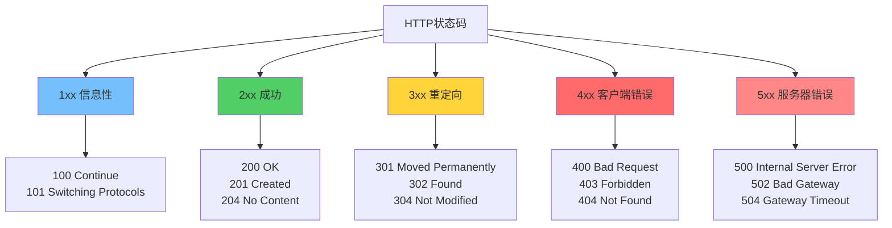
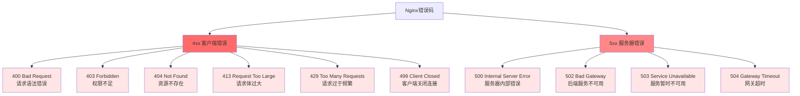
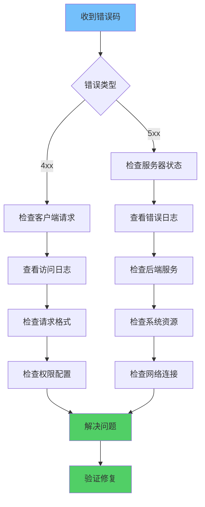

Nginx 作为高性能的 Web 服务器和反向代理服务器，在处理请求时可能会返回各种 HTTP 错误码。理解这些错误码的含义、产生原因和解决方法，对于运维和故障排查至关重要。

# Nginx HTTP错误码概述

HTTP 状态码由三位数字组成，分为五个类别：



# 4xx 客户端错误（常见）

## 400 Bad Request

**含义**：请求语法错误，服务器无法理解。

### 常见原因
- 请求头格式错误
- 请求体过大（超过 `client_max_body_size`）
- Cookie 过大
- URL 编码错误
- 请求方法不支持

### 解决方案

```nginx
# 增加请求体大小限制
http {
    client_max_body_size 10m;
    
    # 增加缓冲区大小
    client_body_buffer_size 128k;
    client_header_buffer_size 1k;
    large_client_header_buffers 4 4k;
}
```

### 排查方法
```bash
# 查看 Nginx 错误日志
tail -f /var/log/nginx/error.log

# 常见错误信息
# client sent too large body: 12345678 bytes
# client sent invalid header line
```

## 401 Unauthorized

**含义**：请求需要身份认证。

### 常见原因
- 未提供认证信息
- 认证信息无效或过期
- 认证配置错误

### 解决方案

```nginx
# Basic 认证配置
location /protected {
    auth_basic "Restricted Area";
    auth_basic_user_file /etc/nginx/.htpasswd;
}

# JWT 认证（需要第三方模块）
location /api {
    auth_jwt "Restricted";
    auth_jwt_key_file /etc/nginx/jwt.key;
}
```

## 403 Forbidden

**含义**：服务器理解请求，但拒绝执行。

### 常见原因
1. **文件权限问题**
   - 文件或目录没有读取权限
   - Nginx 用户没有访问权限

2. **目录索引被禁用**
   - `autoindex` 未启用，访问目录时返回 403

3. **访问控制**
   - IP 被拒绝
   - 用户被拒绝

4. **SELinux 限制**（Linux）

### 解决方案

```nginx
# 1. 启用目录索引
location /files {
    autoindex on;
    autoindex_exact_size off;
    autoindex_localtime on;
}

# 2. 检查文件权限
# 确保文件可读
chmod 644 /path/to/file
# 确保目录可执行
chmod 755 /path/to/directory

# 3. IP 访问控制
location /admin {
    allow 192.168.1.0/24;
    deny all;
}

# 4. SELinux 设置（CentOS/RHEL）
# 检查 SELinux 状态
getenforce
# 临时允许
setsebool -P httpd_read_user_content 1
```

### 排查方法
```bash
# 检查文件权限
ls -la /path/to/file

# 检查 Nginx 用户
ps aux | grep nginx

# 检查 SELinux 上下文
ls -Z /path/to/file
```

## 404 Not Found

**含义**：请求的资源不存在。

### 常见原因
- URL 路径错误
- 文件被删除或移动
- `root` 或 `alias` 配置错误
- 重写规则配置错误

### 解决方案

```nginx
# 1. 检查 root 配置
server {
    root /var/www/html;
    index index.html index.htm;
    
    location / {
        try_files $uri $uri/ =404;
    }
}

# 2. 使用 alias
location /images {
    alias /var/www/images;
}

# 3. 自定义 404 页面
error_page 404 /404.html;
location = /404.html {
    root /var/www/html;
    internal;
}

# 4. 重写规则
location / {
    try_files $uri $uri/ @fallback;
}

location @fallback {
    proxy_pass http://backend;
}
```

### 排查方法
```bash
# 检查文件是否存在
ls -la /var/www/html/path/to/file

# 检查 Nginx 配置
nginx -t

# 查看访问日志
tail -f /var/log/nginx/access.log | grep 404
```

## 405 Method Not Allowed

**含义**：请求方法不被允许。

### 常见原因
- 使用了不允许的 HTTP 方法（如 PUT、DELETE）
- 静态文件服务器不支持某些方法

### 解决方案

```nginx
# 限制允许的方法
location /api {
    limit_except GET POST {
        deny all;
    }
}

# 或者使用 if 判断
location /api {
    if ($request_method !~ ^(GET|POST|HEAD)$ ) {
        return 405;
    }
}
```

## 408 Request Timeout

**含义**：请求超时。

### 常见原因
- 客户端发送请求太慢
- 网络连接问题
- `client_header_timeout` 或 `client_body_timeout` 设置过短

### 解决方案

```nginx
http {
    # 增加超时时间
    client_header_timeout 60s;
    client_body_timeout 60s;
    send_timeout 60s;
    
    # 保持连接
    keepalive_timeout 65;
    keepalive_requests 100;
}
```

## 413 Request Entity Too Large

**含义**：请求实体过大。

### 常见原因
- 上传文件超过 `client_max_body_size` 限制
- 请求体过大

### 解决方案

```nginx
http {
    # 设置最大请求体大小
    client_max_body_size 100m;
    
    # 针对特定 location
    location /upload {
        client_max_body_size 500m;
    }
}
```

### 排查方法
```bash
# 查看错误日志
# client sent too large body: 12345678 bytes in /var/log/nginx/error.log
```

## 414 Request-URI Too Long

**含义**：请求 URI 过长。

### 常见原因
- URL 参数过多
- URL 编码后过长

### 解决方案

```nginx
http {
    # 增加 URI 长度限制（默认 8KB）
    large_client_header_buffers 4 16k;
}
```

## 429 Too Many Requests

**含义**：请求过于频繁。

### 常见原因
- 触发限流规则
- 被 DDoS 防护拦截

### 解决方案

```nginx
# 使用 limit_req 模块限流
http {
    limit_req_zone $binary_remote_addr zone=api_limit:10m rate=10r/s;
    
    server {
        location /api {
            limit_req zone=api_limit burst=20 nodelay;
            proxy_pass http://backend;
        }
    }
}

# 自定义 429 错误页面
error_page 429 /429.html;
location = /429.html {
    root /var/www/html;
    internal;
}
```

## 499 Client Closed Request

**含义**：客户端在服务器返回响应之前关闭了连接。

### 特点
- **Nginx 特有错误码**：这是 Nginx 自定义的错误码，不是标准 HTTP 状态码
- **客户端主动断开**：客户端在等待响应时主动关闭了连接
- **不记录为标准错误**：通常不会记录到标准错误日志，但会出现在访问日志中

### 常见原因

1. **客户端超时**
   - 客户端设置了较短的超时时间
   - 客户端认为服务器响应太慢，主动取消请求

2. **服务器响应慢**
   - 后端处理时间过长
   - 数据库查询慢
   - 网络延迟高

3. **客户端取消操作**
   - 用户点击了浏览器的停止按钮
   - 用户关闭了浏览器标签页
   - 移动端应用切换到后台

4. **网络问题**
   - 网络不稳定导致连接中断
   - 移动网络切换（WiFi 到 4G）
   - 代理服务器断开连接

5. **负载均衡器超时**
   - 上游服务器响应慢
   - 负载均衡器等待超时

### 解决方案

```nginx
# 1. 增加超时时间（减少 499 错误）
http {
    # 客户端超时设置
    client_header_timeout 60s;
    client_body_timeout 60s;
    
    # 代理超时设置
    proxy_connect_timeout 60s;
    proxy_send_timeout 300s;
    proxy_read_timeout 300s;
    
    # 保持连接
    keepalive_timeout 65;
    keepalive_requests 100;
}

# 2. 针对慢接口的特殊处理
location /slow-api {
    proxy_pass http://backend;
    
    # 增加超时时间
    proxy_connect_timeout 300s;
    proxy_send_timeout 300s;
    proxy_read_timeout 300s;
    
    # 缓冲设置
    proxy_buffering on;
    proxy_buffer_size 4k;
    proxy_buffers 8 4k;
    proxy_busy_buffers_size 8k;
    
    # 不中断连接
    proxy_ignore_client_abort on;
}

# 3. 忽略客户端断开（谨慎使用）
location /api {
    proxy_pass http://backend;
    
    # 即使客户端断开，也继续处理请求
    proxy_ignore_client_abort on;
    
    # 注意：这可能导致服务器资源浪费
}

# 4. 异步处理长时间任务
location /long-task {
    # 立即返回 202 Accepted
    return 202;
    
    # 或者使用异步处理
    proxy_pass http://backend;
    proxy_read_timeout 0;  # 不超时
}
```

### 排查方法

```bash
# 1. 查看访问日志中的 499 错误
tail -f /var/log/nginx/access.log | grep " 499 "

# 2. 统计 499 错误数量
awk '$9 == 499 {print}' /var/log/nginx/access.log | wc -l

# 3. 分析 499 错误的请求路径
awk '$9 == 499 {print $7}' /var/log/nginx/access.log | sort | uniq -c | sort -rn

# 4. 查看 499 错误的响应时间
awk '$9 == 499 {print $NF}' /var/log/nginx/access.log | sort -n

# 5. 查看特定 IP 的 499 错误
grep "192.168.1.100.* 499 " /var/log/nginx/access.log

# 6. 实时监控 499 错误
tail -f /var/log/nginx/access.log | awk '$9 == 499 {print}'
```

### 日志分析示例

```bash
# 分析 499 错误的常见模式
# 查看哪些接口经常出现 499
awk '$9 == 499 {print $7}' /var/log/nginx/access.log | \
    sort | uniq -c | sort -rn | head -10

# 查看 499 错误的时间分布
awk '$9 == 499 {print substr($4, 14, 2)}' /var/log/nginx/access.log | \
    sort | uniq -c | sort -n

# 分析 499 错误与响应时间的关系
awk '$9 == 499 {print $NF}' /var/log/nginx/access.log | \
    awk '{sum+=$1; count++} END {print "平均响应时间:", sum/count, "秒"}'
```

### 性能优化建议

```nginx
# 1. 优化后端响应速度
location /api {
    proxy_pass http://backend;
    
    # 启用缓存
    proxy_cache my_cache;
    proxy_cache_valid 200 10m;
    proxy_cache_key "$scheme$request_method$host$request_uri";
    
    # 压缩响应
    gzip on;
    gzip_types application/json application/javascript;
}

# 2. 使用异步处理
location /async-task {
    # 立即返回，后台处理
    access_log off;
    return 202 "Task accepted";
    
    # 或者使用队列系统
    # proxy_pass http://task-queue;
}

# 3. 实现请求队列
upstream backend {
    server 127.0.0.1:8080 max_conns=100;
    queue 100 timeout=60s;
}

location /api {
    proxy_pass http://backend;
    proxy_read_timeout 300s;
}
```

### 监控和告警

```nginx
# 1. 自定义日志格式，记录更多信息
log_format detailed '$remote_addr - $remote_user [$time_local] '
                    '"$request" $status $body_bytes_sent '
                    '"$http_referer" "$http_user_agent" '
                    '$request_time $upstream_response_time '
                    '$upstream_connect_time';

access_log /var/log/nginx/access.log detailed;

# 2. 分离 499 错误日志
map $status $is_499 {
    499 1;
    default 0;
}

access_log /var/log/nginx/499.log combined if=$is_499;
```

### 与其他错误码的区别

| 错误码 | 含义 | 触发方 | 场景 |
|--------|------|--------|------|
| **408** | 请求超时 | 服务器 | 服务器等待客户端请求超时 |
| **499** | 客户端关闭连接 | 客户端 | 客户端在等待响应时主动断开 |
| **502** | 网关错误 | 服务器 | 后端服务不可用或返回无效响应 |
| **504** | 网关超时 | 服务器 | 后端服务响应超时 |

### 注意事项

1. **不是真正的错误**
   - 499 通常表示客户端主动取消，不一定是服务器问题
   - 但如果大量出现，可能表示服务器响应太慢

2. **资源消耗**
   - 使用 `proxy_ignore_client_abort on` 可能导致服务器资源浪费
   - 客户端断开后，服务器仍在处理请求

3. **日志分析**
   - 499 错误不会出现在错误日志中，只在访问日志中
   - 需要单独分析访问日志来监控 499 错误

4. **优化方向**
   - 重点优化后端响应速度
   - 实现请求队列和异步处理
   - 使用缓存减少后端压力

# 5xx 服务器错误（常见）

## 500 Internal Server Error

**含义**：服务器内部错误。

### 常见原因
1. **PHP/Python 等脚本错误**
   - 语法错误
   - 运行时错误
   - 内存不足

2. **FastCGI 配置错误**
   - PHP-FPM 未运行
   - FastCGI 超时
   - 缓冲区设置不当

3. **权限问题**
   - 脚本文件无执行权限
   - 临时目录无写权限

4. **资源限制**
   - 内存不足
   - 文件描述符不足

### 解决方案

```nginx
# 1. PHP-FPM 配置
location ~ \.php$ {
    fastcgi_pass 127.0.0.1:9000;
    fastcgi_index index.php;
    fastcgi_param SCRIPT_FILENAME $document_root$fastcgi_script_name;
    include fastcgi_params;
    
    # 增加超时时间
    fastcgi_connect_timeout 300;
    fastcgi_send_timeout 300;
    fastcgi_read_timeout 300;
    
    # 增加缓冲区
    fastcgi_buffer_size 64k;
    fastcgi_buffers 4 64k;
    fastcgi_busy_buffers_size 128k;
}

# 2. 错误日志配置
error_log /var/log/nginx/error.log warn;

# 3. 自定义 500 错误页面
error_page 500 502 503 504 /50x.html;
location = /50x.html {
    root /var/www/html;
    internal;
}
```

### 排查方法
```bash
# 查看 Nginx 错误日志
tail -f /var/log/nginx/error.log

# 查看 PHP-FPM 日志
tail -f /var/log/php-fpm/error.log

# 检查 PHP-FPM 状态
systemctl status php-fpm

# 检查系统资源
free -h
df -h
ulimit -a
```

## 502 Bad Gateway

**含义**：作为网关或代理的服务器，从上游服务器收到无效响应。

### 常见原因
1. **后端服务未运行**
   - 应用服务器（如 Tomcat、Node.js）未启动
   - PHP-FPM 未运行

2. **后端服务崩溃**
   - 应用异常退出
   - 内存溢出

3. **连接问题**
   - 防火墙阻止
   - 端口错误
   - 网络不通

4. **超时设置过短**
   - `proxy_connect_timeout` 过短
   - 后端响应慢

### 解决方案

```nginx
# 1. 增加超时时间
location / {
    proxy_pass http://backend;
    
    proxy_connect_timeout 60s;
    proxy_send_timeout 60s;
    proxy_read_timeout 60s;
    
    # 缓冲设置
    proxy_buffering on;
    proxy_buffer_size 4k;
    proxy_buffers 8 4k;
    proxy_busy_buffers_size 8k;
}

# 2. 健康检查
upstream backend {
    server 127.0.0.1:8080 max_fails=3 fail_timeout=30s;
    server 127.0.0.1:8081 backup;
    
    # 健康检查（需要第三方模块）
    # health_check;
}

# 3. 错误处理
proxy_next_upstream error timeout invalid_header http_500 http_502 http_503;
proxy_next_upstream_tries 3;
proxy_next_upstream_timeout 10s;
```

### 排查方法
```bash
# 检查后端服务状态
systemctl status tomcat
systemctl status php-fpm
ps aux | grep node

# 检查端口监听
netstat -tlnp | grep 8080
ss -tlnp | grep 8080

# 测试连接
curl -v http://127.0.0.1:8080

# 查看 Nginx 错误日志
tail -f /var/log/nginx/error.log | grep 502
```

## 503 Service Unavailable

**含义**：服务暂时不可用。

### 常见原因
1. **服务器过载**
   - 请求过多
   - 资源耗尽

2. **维护模式**
   - 主动返回 503
   - 限流触发

3. **后端服务不可用**
   - 所有后端服务器都不可用
   - 健康检查失败

### 解决方案

```nginx
# 1. 维护模式
location / {
    return 503;
    add_header Retry-After 3600;
}

error_page 503 /maintenance.html;
location = /maintenance.html {
    root /var/www/html;
    internal;
}

# 2. 限流保护
http {
    limit_conn_zone $binary_remote_addr zone=conn_limit:10m;
    limit_req_zone $binary_remote_addr zone=req_limit:10m rate=10r/s;
    
    server {
        limit_conn conn_limit 10;
        limit_req zone=req_limit burst=20 nodelay;
    }
}

# 3. 后端健康检查
upstream backend {
    server 127.0.0.1:8080;
    server 127.0.0.1:8081;
    
    # 当所有服务器都不可用时返回 503
    # 需要配置 health_check
}
```

## 504 Gateway Timeout

**含义**：网关超时。

### 常见原因
- 后端服务响应时间过长
- `proxy_read_timeout` 设置过短
- 后端服务处理慢或卡死

### 解决方案

```nginx
# 增加超时时间
location / {
    proxy_pass http://backend;
    
    proxy_connect_timeout 60s;
    proxy_send_timeout 300s;
    proxy_read_timeout 300s;
    
    # 发送超时
    send_timeout 300s;
}

# 异步处理长时间任务
location /long-task {
    proxy_pass http://backend;
    proxy_read_timeout 300s;
    
    # 返回 202 Accepted，异步处理
    proxy_intercept_errors on;
    error_page 504 = @async;
}

location @async {
    return 202;
}
```

### 排查方法
```bash
# 检查后端服务响应时间
time curl http://127.0.0.1:8080/api/slow

# 查看慢查询日志
tail -f /var/log/nginx/slow.log

# 分析后端性能
top
htop
iostat
```

# 其他常见错误码

## 301/302 重定向

### 301 Moved Permanently（永久重定向）

```nginx
# HTTP 到 HTTPS 重定向
server {
    listen 80;
    server_name example.com;
    return 301 https://$server_name$request_uri;
}

# 域名重定向
server {
    server_name www.example.com;
    return 301 https://example.com$request_uri;
}
```

### 302 Found（临时重定向）

```nginx
location /old {
    return 302 /new;
}
```

## 304 Not Modified

**含义**：资源未修改，使用缓存。

```nginx
# 启用缓存
location ~* \.(jpg|jpeg|png|gif|ico|css|js)$ {
    expires 30d;
    add_header Cache-Control "public, immutable";
    
    # ETag 支持
    etag on;
}
```

# 错误码分类总结



# 故障排查流程

## 通用排查步骤



## 日志分析

### 访问日志格式

```nginx
log_format main '$remote_addr - $remote_user [$time_local] "$request" '
                '$status $body_bytes_sent "$http_referer" '
                '"$http_user_agent" "$http_x_forwarded_for"';

access_log /var/log/nginx/access.log main;
```

### 常用日志分析命令

```bash
# 统计错误码
awk '{print $9}' /var/log/nginx/access.log | sort | uniq -c | sort -rn

# 查看 502 错误
grep " 502 " /var/log/nginx/access.log | tail -20

# 查看特定 IP 的请求
grep "192.168.1.100" /var/log/nginx/access.log

# 实时监控错误
tail -f /var/log/nginx/error.log | grep -E "error|warn"

# 统计访问量
awk '{print $1}' /var/log/nginx/access.log | sort | uniq -c | sort -rn | head -10
```

# 最佳实践

## 1. 错误页面配置

```nginx
# 统一错误页面
error_page 404 /404.html;
error_page 500 502 503 504 /50x.html;

location = /404.html {
    root /var/www/html;
    internal;
}

location = /50x.html {
    root /var/www/html;
    internal;
}
```

## 2. 日志管理

```nginx
# 分离错误日志级别
error_log /var/log/nginx/error.log warn;
error_log /var/log/nginx/debug.log debug;

# 日志轮转（使用 logrotate）
# /etc/logrotate.d/nginx
/var/log/nginx/*.log {
    daily
    missingok
    rotate 52
    compress
    delaycompress
    notifempty
    create 0640 www-data adm
    sharedscripts
    postrotate
        [ -f /var/run/nginx.pid ] && kill -USR1 `cat /var/run/nginx.pid`
    endscript
}
```

## 3. 监控和告警

```nginx
# 状态页面（需要 stub_status 模块）
location /nginx_status {
    stub_status on;
    access_log off;
    allow 127.0.0.1;
    deny all;
}

# 健康检查端点
location /health {
    access_log off;
    return 200 "healthy\n";
    add_header Content-Type text/plain;
}
```

## 4. 性能优化

```nginx
http {
    # 连接优化
    keepalive_timeout 65;
    keepalive_requests 100;
    
    # 缓冲优化
    client_body_buffer_size 128k;
    client_header_buffer_size 1k;
    large_client_header_buffers 4 4k;
    
    # 超时优化
    client_body_timeout 12;
    client_header_timeout 12;
    send_timeout 10;
    
    # Gzip 压缩
    gzip on;
    gzip_vary on;
    gzip_min_length 1000;
    gzip_types text/plain text/css application/json application/javascript;
}
```

# 常见问题 FAQ

## Q1: 如何快速定位 502 错误？

**A:** 
1. 检查后端服务是否运行：`systemctl status <service>`
2. 检查端口是否监听：`netstat -tlnp | grep <port>`
3. 查看 Nginx 错误日志：`tail -f /var/log/nginx/error.log`
4. 测试后端连接：`curl http://127.0.0.1:<port>`

## Q2: 403 错误但文件权限正常？

**A:**
1. 检查 SELinux 状态：`getenforce`
2. 检查目录索引：确认 `autoindex` 配置
3. 检查 Nginx 用户权限：`ps aux | grep nginx`
4. 检查父目录权限：确保所有父目录都有执行权限

## Q3: 如何自定义错误页面？

**A:**
```nginx
error_page 404 /custom_404.html;
location = /custom_404.html {
    root /var/www/html;
    internal;
}
```

## Q4: 如何限制请求体大小？

**A:**
```nginx
http {
    client_max_body_size 10m;
    
    # 针对特定 location
    location /upload {
        client_max_body_size 100m;
    }
}
```

## Q5: 如何实现优雅降级？

**A:**
```nginx
upstream backend {
    server 127.0.0.1:8080;
    server 127.0.0.1:8081 backup;
}

location / {
    proxy_pass http://backend;
    proxy_next_upstream error timeout http_500 http_502 http_503;
    
    # 所有后端都失败时返回静态页面
    error_page 502 503 504 = @fallback;
}

location @fallback {
    root /var/www/html;
    try_files /maintenance.html =503;
}
```

# 总结

理解 Nginx HTTP 错误码对于运维和故障排查至关重要：

## 关键要点

1. **4xx 错误**：通常是客户端问题，检查请求格式、权限、资源是否存在
2. **5xx 错误**：通常是服务器问题，检查后端服务、系统资源、网络连接
3. **日志分析**：充分利用访问日志和错误日志定位问题
4. **配置优化**：合理设置超时、缓冲区、限流等参数
5. **监控告警**：建立完善的监控和告警机制

## 排查思路

- **先看日志**：错误日志和访问日志是首要信息来源
- **检查服务**：确认相关服务是否正常运行
- **验证配置**：使用 `nginx -t` 检查配置语法
- **测试连接**：使用 `curl` 等工具测试连接
- **系统资源**：检查 CPU、内存、磁盘、网络等资源

通过系统化的排查方法和合理的配置，可以有效减少和快速解决 Nginx 错误码问题，提高系统的稳定性和可用性。
