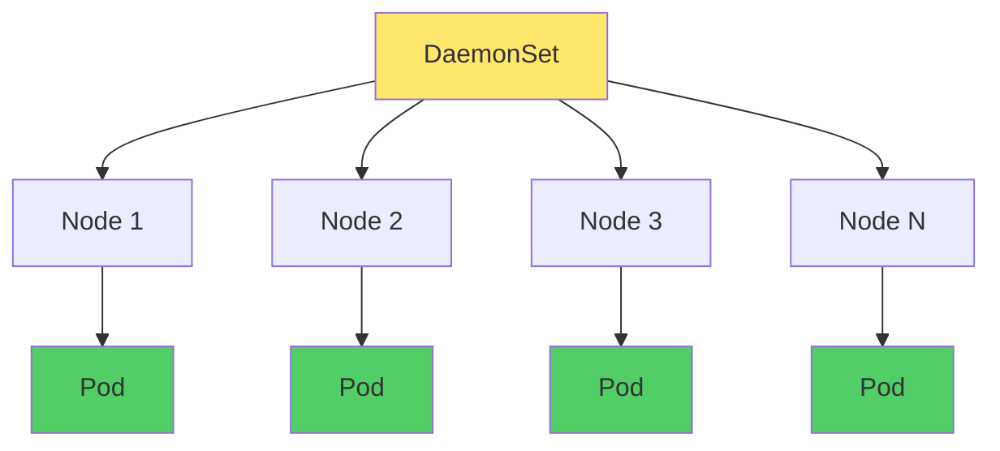

DaemonSet 是 Kubernetes 中的一种**工作负载资源**，用于在集群内**每个节点**（或满足条件的节点）上运行一个 Pod 副本。适合部署节点级基础设施组件，如日志收集、监控代理、网络插件、存储守护进程等。本文介绍 DaemonSet 的概念、用法、更新策略与最佳实践。

# 基本概念

## 什么是 DaemonSet

DaemonSet 保证所选中的**每个节点**上都有且仅有一个由该 DaemonSet 管理的 Pod 在运行：
- **新节点加入**：DaemonSet 控制器会在新节点上自动创建 Pod。
- **节点离开**：节点被从集群移除时，该节点上的 DaemonSet Pod 会被回收。
- **节点就绪**：只有节点状态为 Ready 时才会调度 DaemonSet Pod（可配合容忍度在含污点的节点上运行）。



## 核心特性

| 特性 | 说明 |
|------|------|
| **节点级部署** | 每个匹配节点上一个 Pod，不按副本数扩缩容 |
| **自动扩散** | 新节点加入时自动在新节点上创建 Pod |
| **自动回收** | 节点从集群移除时，对应 Pod 随之删除 |
| **节点选择** | 通过 `nodeSelector`、`nodeAffinity` 限制运行节点 |
| **容忍度** | 通过 `tolerations` 在含污点节点（如 master）上运行 |
| **更新策略** | 支持 `RollingUpdate` 与 `OnDelete` |

## DaemonSet 与 Deployment 对比

| 维度 | DaemonSet | Deployment |
|------|-----------|------------|
| **调度目标** | 按节点：每节点一个 Pod | 按副本数：不关心节点分布 |
| **副本数** | 由匹配节点数决定 | 由 `replicas` 指定 |
| **典型场景** | 日志、监控、网络插件、存储驱动 | 业务应用、无状态服务 |
| **扩缩容** | 随节点增减自动变化 | 手动或 HPA 修改 `replicas` |
| **更新策略** | RollingUpdate / OnDelete | RollingUpdate / Recreate |

# 使用场景

- **日志收集**：在每个节点运行 Fluentd、Filebeat 等，收集节点与容器日志并上报。
- **监控采集**：在每个节点运行 node-exporter、Datadog Agent 等，采集节点与 Pod 指标。
- **网络与安全**：Calico、Cilium、kube-proxy 等网络/策略组件常以 DaemonSet 部署。
- **存储与卷**：部分 CSI 驱动或本地存储插件在每节点运行一个组件。
- **GPU/设备**：GPU 驱动、设备插件等需在具备硬件的节点上各跑一份。
- **安全与审计**：节点级安全代理、审计日志采集等。

# 资源结构

## 最小示例

```yaml
apiVersion: apps/v1
kind: DaemonSet
metadata:
  name: fluentd-logging
  namespace: kube-system
spec:
  selector:
    matchLabels:
      name: fluentd-logging
  template:
    metadata:
      labels:
        name: fluentd-logging
    spec:
      tolerations:
        - key: node-role.kubernetes.io/master
          effect: NoSchedule
          operator: Exists
      containers:
        - name: fluentd
          image: fluent/fluentd:v1.16
          resources:
            limits:
              memory: 200Mi
            requests:
              cpu: 100m
              memory: 200Mi
          volumeMounts:
            - name: varlog
              mountPath: /var/log
      volumes:
        - name: varlog
          hostPath:
            path: /var/log
```

## 主要字段说明

- **`spec.selector`**：与 `template.metadata.labels` 一致，用于选中该 DaemonSet 管理的 Pod，创建后不可修改。
- **`spec.template`**：Pod 模板，与 Deployment 的 Pod 模板语义相同。
- **`spec.updateStrategy`**：更新策略，见下文。
- **`spec.minReadySeconds`**：Pod 就绪后至少保持就绪的秒数，再参与滚动更新进度（1.25+ 稳定）。
- **`spec.template.spec.tolerations`**：若要在 master 等带污点节点上运行，需配置对应容忍度。

# 更新策略

## RollingUpdate（默认）

按节点逐个替换 Pod，可控制一次不可用数量：

```yaml
spec:
  updateStrategy:
    type: RollingUpdate
    rollingUpdate:
      maxUnavailable: 1   # 默认 1，表示滚动时最多 1 个节点上的 Pod 不可用
  minReadySeconds: 0      # 可选，就绪后等待多久再视为可用
```

- **maxUnavailable**：滚动过程中允许“不可用”的 Pod 数量（按节点维度理解：默认 1 即一次一个节点上的 Pod 被替换）。
- **minReadySeconds**：新 Pod 变为 Ready 后，再等待该秒数才计入“已更新”，用于避免刚就绪就继续滚下一个导致抖动。

## OnDelete

不自动滚动，仅当节点上旧 Pod 被**手动删除**时，才由控制器创建新 Pod。适合对变更节奏要求严格、需人工控制的场景。

```yaml
spec:
  updateStrategy:
    type: OnDelete
```

# 节点选择与容忍度

## nodeSelector

仅调度到带指定标签的节点：

```yaml
spec:
  template:
    spec:
      nodeSelector:
        disk: ssd
```

## nodeAffinity

更复杂的节点选择（必须/优先、多条件）：

```yaml
spec:
  template:
    spec:
      affinity:
        nodeAffinity:
          requiredDuringSchedulingIgnoredDuringExecution:
            nodeSelectorTerms:
              - matchExpressions:
                  - key: node-role.kubernetes.io/worker
                    operator: Exists
```

## tolerations

在含污点节点（如 master）上运行时，需显式容忍该污点，否则 Pod 不会被调度到该节点：

```yaml
spec:
  template:
    spec:
      tolerations:
        - key: node-role.kubernetes.io/master
          effect: NoSchedule
          operator: Exists
        - key: node.kubernetes.io/unschedulable
          effect: NoSchedule
          operator: Exists
```

常见场景：在控制平面节点上运行日志或监控 DaemonSet 时，需添加对 `node-role.kubernetes.io/master` 或 `node-role.kubernetes.io/control-plane` 的容忍。

# 常用命令

```bash
# 创建
kubectl create -f daemonset.yaml
kubectl apply -f daemonset.yaml

# 查看
kubectl get daemonset -A
kubectl get ds -n kube-system
kubectl describe daemonset <name> -n <namespace>

# 查看 DaemonSet 管理的 Pod
kubectl get pods -n <namespace> -l <label-selector>

# 更新镜像
kubectl set image daemonset/<name> <container>=<image> -n <namespace>
kubectl edit daemonset <name> -n <namespace>

# 删除（会删除其管理的所有 Pod）
kubectl delete daemonset <name> -n <namespace>

# 只删除 DaemonSet 对象，保留已有 Pod（Pod 将不再被该 DaemonSet 管理）
kubectl delete daemonset <name> -n <namespace> --cascade=orphan
```

# 与节点维护的配合

执行 **`kubectl drain <node>`** 时，默认会驱逐该节点上所有 Pod。DaemonSet 的 Pod 通常**不允许被驱逐**（若不希望被驱逐，可设置 `Pod 的 tolerations` 对 `node.kubernetes.io/unschedulable` 等污点做容忍，或使用自定义污点）。

若希望在 drain 时**忽略 DaemonSet Pod**（不驱逐它们，仅驱逐其他工作负载），可使用：

```bash
kubectl drain <node-name> --ignore-daemonsets --delete-emptydir-data
```

这样节点进入维护时，DaemonSet Pod 仍可保留在该节点上，直到节点从集群移除或 DaemonSet 被更新/删除。

# 最佳实践

1. **资源限制**：为 DaemonSet 的容器设置 `requests`/`limits`，避免占满节点资源，便于调度与稳定性。
2. **容忍度**：仅在需要时在 master/控制平面节点运行（如日志、监控），并显式配置对应 `tolerations`。
3. **优先级**：对关键基础设施 DaemonSet 使用 `PriorityClass`，保证在资源紧张时优先调度。
4. **更新策略**：生产环境多用 `RollingUpdate`，并视情况设置 `minReadySeconds` 与 `maxUnavailable`，避免一次性大面积不可用。
5. **只读挂载**：访问宿主机目录时尽量 `readOnly: true`，减少安全与误写风险。
6. **与 Sidecar 区分**：节点级、与宿主机强绑定的能力用 DaemonSet；应用级、与单个业务 Pod 绑定的用 Sidecar。二者可组合（如 DaemonSet 做节点日志采集，Sidecar 做应用级日志处理）。

# 常见问题

**Q：DaemonSet Pod 为什么一直 Pending？**  
检查节点是否满足 `nodeSelector`/`nodeAffinity`，以及是否缺少对节点污点的 `tolerations`（如 master 的 `NoSchedule`）。

**Q：更新 DaemonSet 后部分节点上的 Pod 没变？**  
若使用 `OnDelete`，需要手动删除旧 Pod 才会创建新 Pod。若使用 `RollingUpdate`，可查看 `kubectl describe daemonset <name>` 中的事件与 `Desired Number Scheduled` / `Number Ready`。

**Q：drain 节点时不想驱逐 DaemonSet Pod？**  
使用 `kubectl drain <node> --ignore-daemonsets`（必要时加 `--delete-emptydir-data`）。

# 小结

| 要点 | 说明 |
|------|------|
| **定位** | 每节点一个 Pod，用于节点级系统组件 |
| **扩缩容** | 随节点数自动变化，无需设置 replicas |
| **更新** | RollingUpdate（可控）或 OnDelete（手动触发） |
| **节点控制** | nodeSelector / nodeAffinity + tolerations |
| **典型用途** | 日志、监控、网络、存储、GPU 等基础设施 |

DaemonSet 是 Kubernetes 中实现**节点级统一部署**的标准方式，与 [Sidecar 模式](/tools/docker/sidecar.html) 互补：DaemonSet 负责节点维度的能力，Sidecar 负责 Pod/应用维度的能力，二者结合可构建完整的可观测性与网络方案。

# 参考文献

- [Kubernetes DaemonSet 官方文档](https://kubernetes.io/docs/concepts/workloads/controllers/daemonset/)
- [DaemonSet API 参考](https://kubernetes.io/docs/reference/kubernetes-api/workload-resources/daemon-set-v1/)
- [Perform a Rolling Update on a DaemonSet](https://kubernetes.io/docs/tasks/manage-daemon/update-daemon-set/)
