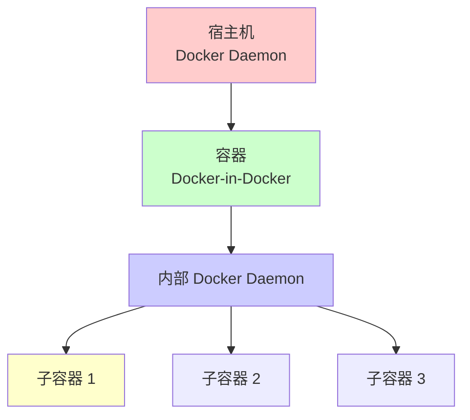
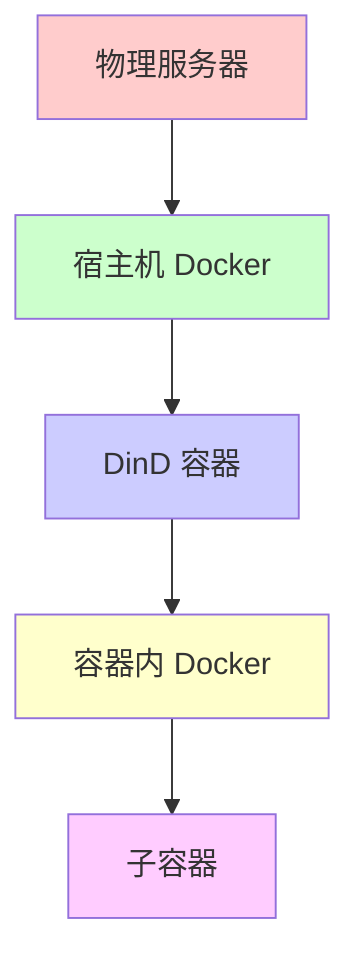

# 什么是 Docker-in-Docker

## 概念

Docker-in-Docker（DinD）是指在 Docker 容器内部运行另一个 Docker 守护进程，使得容器内的应用可以使用 Docker 命令来构建、运行和管理其他容器。



## 架构层次



## 与 Docker Socket 挂载的区别

### Docker Socket 挂载（DooD）

```bash
# 挂载 Docker Socket
docker run -v /var/run/docker.sock:/var/run/docker.sock docker:latest
```

**特点**：
- 使用宿主机的 Docker 守护进程
- 容器内运行的是 Docker 客户端
- 子容器运行在宿主机上
- 更轻量级，但安全性较低

### Docker-in-Docker（DinD）

```bash
# 使用 DinD 镜像
docker run --privileged docker:dind
```

**特点**：
- 容器内有独立的 Docker 守护进程
- 完全隔离的 Docker 环境
- 子容器运行在 DinD 容器内
- 更安全，但资源开销更大

# DinD 的作用

## 主要用途

### 1. CI/CD 流水线

在持续集成/持续部署流水线中，需要构建 Docker 镜像。

```yaml
# GitLab CI 示例
build:
  image: docker:dind
  services:
    - docker:dind
  script:
    - docker build -t myapp:latest .
    - docker push myapp:latest
```

### 2. 容器化开发环境

开发人员需要在容器化的环境中进行 Docker 相关开发。

### 3. 容器编排工具测试

测试 Kubernetes、Docker Swarm 等容器编排工具。

### 4. Docker 镜像构建服务

提供容器化的 Docker 镜像构建服务。

### 5. 多租户隔离

为不同用户提供独立的 Docker 环境。

## 使用场景对比

| 场景 | 推荐方案 | 原因 |
|------|---------|------|
| **CI/CD 构建** | DinD 或 DooD | 需要构建镜像 |
| **开发环境** | DooD | 轻量级，性能好 |
| **多租户** | DinD | 完全隔离 |
| **测试环境** | DinD | 独立环境 |
| **生产环境** | 避免使用 | 安全风险 |

# 实现方式

## 方式 1：使用 DinD 镜像

### 基本使用

```bash
# 运行 DinD 容器
docker run --privileged -d \
  --name dind \
  docker:dind

# 进入容器
docker exec -it dind sh

# 在容器内使用 Docker
docker ps
docker run hello-world
```

### 完整示例

```bash
# 启动 DinD 容器
docker run --privileged \
  --name dind \
  -e DOCKER_TLS_CERTDIR=/certs \
  -v dind-certs-ca:/certs/ca \
  -v dind-certs-client:/certs/client \
  docker:dind

# 在另一个容器中连接
docker run --rm \
  --link dind:docker \
  -e DOCKER_TLS_CERTDIR=/certs \
  -v dind-certs-client:/certs/client:ro \
  docker:latest docker version
```

## 方式 2：Docker Socket 挂载（DooD）

### 基本使用

```bash
# 挂载 Docker Socket
docker run -it \
  -v /var/run/docker.sock:/var/run/docker.sock \
  docker:latest sh

# 在容器内使用 Docker（实际使用宿主机的 Docker）
docker ps
docker run hello-world
```

### 安全考虑

```bash
# 使用非 root 用户（需要配置）
docker run -it \
  -v /var/run/docker.sock:/var/run/docker.sock \
  -u $(id -u):$(id -g) \
  docker:latest sh
```

## 方式 3：使用 Docker Compose

### DinD 配置

```yaml
version: '3.8'

services:
  dind:
    image: docker:dind
    privileged: true
    volumes:
      - dind-storage:/var/lib/docker
    environment:
      - DOCKER_TLS_CERTDIR=/certs
    networks:
      - dind-network

  docker-client:
    image: docker:latest
    depends_on:
      - dind
    volumes:
      - /var/run/docker.sock:/var/run/docker.sock
    networks:
      - dind-network
    command: sh -c "docker ps"

volumes:
  dind-storage:

networks:
  dind-network:
    driver: bridge
```

## 方式 4：Kubernetes 中的 DinD

### Pod 配置

```yaml
apiVersion: v1
kind: Pod
metadata:
  name: dind
spec:
  containers:
  - name: dind
    image: docker:dind
    securityContext:
      privileged: true
    volumeMounts:
    - name: docker-storage
      mountPath: /var/lib/docker
  volumes:
  - name: docker-storage
    emptyDir: {}
```

### 使用 Init Container

```yaml
apiVersion: v1
kind: Pod
metadata:
  name: build-pod
spec:
  initContainers:
  - name: dind
    image: docker:dind
    securityContext:
      privileged: true
  containers:
  - name: builder
    image: docker:latest
    command: ["sh", "-c"]
    args:
    - |
      docker build -t myapp:latest .
      docker push myapp:latest
```

# 实际应用场景

## 场景 1：GitLab CI/CD

### GitLab Runner 配置

```toml
# config.toml
[[runners]]
  name = "docker-runner"
  url = "https://gitlab.com/"
  token = "your-token"
  executor = "docker"
  [runners.docker]
    image = "docker:dind"
    privileged = true
    volumes = ["/cache"]
```

### GitLab CI 配置

```yaml
# .gitlab-ci.yml
stages:
  - build
  - test
  - deploy

variables:
  DOCKER_DRIVER: overlay2
  DOCKER_TLS_CERTDIR: "/certs"

services:
  - docker:dind

before_script:
  - docker info

build:
  stage: build
  script:
    - docker build -t myapp:$CI_COMMIT_SHA .
    - docker tag myapp:$CI_COMMIT_SHA myapp:latest
    - docker push myapp:$CI_COMMIT_SHA
    - docker push myapp:latest
```

## 场景 2：Jenkins Pipeline

### Jenkinsfile

```groovy
pipeline {
    agent {
        docker {
            image 'docker:dind'
            args '--privileged'
        }
    }
    
    stages {
        stage('Build') {
            steps {
                sh '''
                    docker build -t myapp:${BUILD_NUMBER} .
                    docker tag myapp:${BUILD_NUMBER} myapp:latest
                '''
            }
        }
        
        stage('Test') {
            steps {
                sh 'docker run --rm myapp:latest npm test'
            }
        }
        
        stage('Push') {
            steps {
                sh '''
                    docker login -u $DOCKER_USER -p $DOCKER_PASS
                    docker push myapp:${BUILD_NUMBER}
                    docker push myapp:latest
                '''
            }
        }
    }
}
```

## 场景 3：GitHub Actions

### GitHub Actions 工作流

```yaml
name: Build and Push Docker Image

on:
  push:
    branches: [ main ]

jobs:
  build:
    runs-on: ubuntu-latest
    steps:
    - uses: actions/checkout@v2
    
    - name: Set up Docker Buildx
      uses: docker/setup-buildx-action@v1
    
    - name: Login to Docker Hub
      uses: docker/login-action@v1
      with:
        username: ${{ secrets.DOCKER_USERNAME }}
        password: ${{ secrets.DOCKER_PASSWORD }}
    
    - name: Build and push
      uses: docker/build-push-action@v2
      with:
        context: .
        push: true
        tags: myapp:latest
```

### 使用 DinD Service

```yaml
name: Build with DinD

on: [push]

jobs:
  build:
    runs-on: ubuntu-latest
    services:
      docker:
        image: docker:dind
        options: --privileged
    steps:
    - uses: actions/checkout@v2
    - name: Build image
      run: |
        docker build -t myapp:latest .
        docker run --rm myapp:latest
```

## 场景 4：本地开发环境

### Docker Compose 开发环境

```yaml
version: '3.8'

services:
  dind:
    image: docker:dind
    privileged: true
    ports:
      - "2376:2376"
    volumes:
      - dind-storage:/var/lib/docker
    environment:
      - DOCKER_TLS_CERTDIR=/certs

  dev:
    image: node:16
    volumes:
      - .:/workspace
      - /var/run/docker.sock:/var/run/docker.sock
    working_dir: /workspace
    command: sh -c "npm install && npm run dev"
    depends_on:
      - dind
```

## 场景 5：容器化构建服务

### 构建服务 API

```python
# build_service.py
from flask import Flask, request
import docker
import subprocess

app = Flask(__name__)

@app.route('/build', methods=['POST'])
def build_image():
    data = request.json
    repo = data['repo']
    tag = data['tag']
    
    # 在 DinD 容器中构建
    cmd = f"docker build -t {repo}:{tag} ."
    result = subprocess.run(cmd, shell=True, capture_output=True)
    
    return {'status': 'success', 'output': result.stdout.decode()}

if __name__ == '__main__':
    app.run(host='0.0.0.0', port=5000)
```

### 使用示例

```bash
# 启动构建服务
docker run -d \
  --name build-service \
  --privileged \
  -v /var/run/docker.sock:/var/run/docker.sock \
  build-service:latest

# 调用构建 API
curl -X POST http://build-service:5000/build \
  -H "Content-Type: application/json" \
  -d '{"repo": "myapp", "tag": "v1.0"}'
```

# 最佳实践

## 1. 安全性

### 避免在生产环境使用

```bash
# ❌ 不推荐：生产环境使用 DinD
docker run --privileged docker:dind

# ✅ 推荐：使用专门的构建服务
# 使用 Kubernetes Jobs 或专门的 CI/CD 平台
```

### 使用非特权模式（如果可能）

```bash
# 某些场景可以使用非特权模式
docker run --security-opt seccomp=unconfined \
  docker:dind
```

### 限制资源访问

```yaml
# Docker Compose 资源限制
services:
  dind:
    image: docker:dind
    privileged: true
    deploy:
      resources:
        limits:
          cpus: '2'
          memory: 4G
```

## 2. 性能优化

### 使用 Overlay2 存储驱动

```bash
# 配置 Overlay2
docker run --privileged \
  -e DOCKER_STORAGE_DRIVER=overlay2 \
  docker:dind
```

### 使用本地卷存储

```bash
# 使用命名卷存储 Docker 数据
docker run --privileged \
  -v dind-storage:/var/lib/docker \
  docker:dind
```

### 清理未使用的资源

```bash
# 定期清理
docker exec dind docker system prune -af
```

## 3. 网络配置

### 使用独立网络

```yaml
version: '3.8'

services:
  dind:
    image: docker:dind
    privileged: true
    networks:
      - dind-network

networks:
  dind-network:
    driver: bridge
    ipam:
      config:
        - subnet: 172.20.0.0/16
```

### 端口映射

```bash
# 映射 Docker 端口
docker run --privileged \
  -p 2376:2376 \
  docker:dind
```

## 4. 数据持久化

### 使用命名卷

```bash
# 创建命名卷
docker volume create dind-storage

# 使用命名卷
docker run --privileged \
  -v dind-storage:/var/lib/docker \
  docker:dind
```

### 备份和恢复

```bash
# 备份 Docker 数据
docker run --rm \
  -v dind-storage:/data \
  -v $(pwd):/backup \
  alpine tar czf /backup/dind-backup.tar.gz /data

# 恢复
docker run --rm \
  -v dind-storage:/data \
  -v $(pwd):/backup \
  alpine tar xzf /backup/dind-backup.tar.gz -C /
```

## 5. 监控和日志

### 日志配置

```yaml
services:
  dind:
    image: docker:dind
    privileged: true
    logging:
      driver: "json-file"
      options:
        max-size: "10m"
        max-file: "3"
```

### 健康检查

```yaml
services:
  dind:
    image: docker:dind
    privileged: true
    healthcheck:
      test: ["CMD", "docker", "info"]
      interval: 30s
      timeout: 10s
      retries: 3
```

# 注意事项和限制

## 安全风险

### 1. 特权模式

```bash
# --privileged 标志会授予容器所有权限
# 包括访问所有设备、修改内核参数等
docker run --privileged docker:dind
```

**风险**：
- 容器可以访问所有硬件设备
- 可以修改内核参数
- 可以挂载宿主机文件系统

**缓解措施**：
- 仅在受信任的环境中使用
- 使用网络隔离
- 限制资源访问

### 2. Docker Socket 挂载风险

```bash
# 挂载 Docker Socket 会授予容器完全控制 Docker 的权限
-v /var/run/docker.sock:/var/run/docker.sock
```

**风险**：
- 容器可以控制宿主机的所有容器
- 可以访问宿主机文件系统
- 可以创建特权容器

**缓解措施**：
- 使用 Docker Socket 代理（如 socat）
- 限制容器权限
- 使用 Docker API 认证

## 性能考虑

### 1. 资源开销

- **内存**：DinD 容器需要额外内存运行 Docker 守护进程
- **CPU**：Docker 守护进程会消耗 CPU 资源
- **存储**：需要存储 Docker 镜像和容器数据

### 2. 启动时间

```bash
# DinD 容器启动需要时间初始化 Docker 守护进程
# 通常需要 10-30 秒
docker run --privileged docker:dind
```

### 3. 网络性能

- 嵌套容器的网络性能可能受影响
- 需要合理配置网络

## 限制

### 1. 内核版本要求

```bash
# 需要支持嵌套虚拟化的内核
# 检查支持
grep -E 'vmx|svm' /proc/cpuinfo
```

### 2. 存储驱动限制

- 某些存储驱动可能不支持嵌套
- 推荐使用 Overlay2

### 3. 平台限制

- 主要在 Linux 上支持
- Windows 和 macOS 支持有限

## 替代方案

### 1. 使用 Kaniko

```yaml
# Kaniko 不需要 Docker 守护进程
steps:
- name: Build with Kaniko
  image: gcr.io/kaniko-project/executor:latest
  args:
    - --dockerfile=Dockerfile
    - --context=.
    - --destination=myapp:latest
```

### 2. 使用 Buildah

```bash
# Buildah 可以在无守护进程的情况下构建镜像
buildah bud -t myapp:latest .
buildah push myapp:latest
```

### 3. 使用 Podman

```bash
# Podman 无需守护进程
podman build -t myapp:latest .
podman push myapp:latest
```

### 4. 使用远程 Docker

```bash
# 连接到远程 Docker 守护进程
export DOCKER_HOST=tcp://remote-docker:2376
docker build -t myapp:latest .
```

# 总结

Docker-in-Docker 是一个强大的技术，但需要谨慎使用：

## 核心要点

1. **用途**：主要用于 CI/CD 流水线和开发环境
2. **实现**：使用 DinD 镜像或 Docker Socket 挂载
3. **安全**：需要特权模式，存在安全风险
4. **性能**：有资源开销，启动时间较长

## 使用建议

- ✅ **适合**：CI/CD 流水线、开发环境、测试环境
- ❌ **不适合**：生产环境、安全要求高的场景
- ⚠️ **注意**：安全风险、性能开销、资源限制

## 替代方案

- **Kaniko**：无守护进程构建
- **Buildah**：无守护进程构建
- **Podman**：无守护进程容器
- **远程 Docker**：使用远程 Docker 守护进程

根据实际需求选择合适的方案，在安全性和便利性之间找到平衡。

# 参考文献

- [Docker-in-Docker 官方文档](https://hub.docker.com/_/docker)
- [DinD vs DooD](https://jpetazzo.github.io/2015/09/03/do-not-use-docker-in-docker-for-ci/)
- [Kaniko 文档](https://github.com/GoogleContainerTools/kaniko)
- [Buildah 文档](https://buildah.io/)
