推荐阅读：[Docker Source Code](https://github.com/moby/moby)

# Docker 底层实现概述

Docker 是一个开源的容器化平台，它基于 Linux 内核的多种技术实现了轻量级的虚拟化。理解 Docker 的底层实现对于深入掌握容器技术至关重要。

## 核心组件

Docker 的底层实现主要依赖以下 Linux 内核特性：

1. **Namespace（命名空间）**：实现资源隔离
2. **Cgroups（控制组）**：实现资源限制
3. **Union File System（联合文件系统）**：实现镜像分层和存储
4. **网络**：实现容器网络通信
5. **容器运行时**：管理容器的生命周期

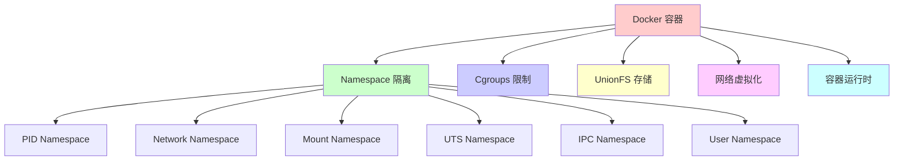

## Docker 架构

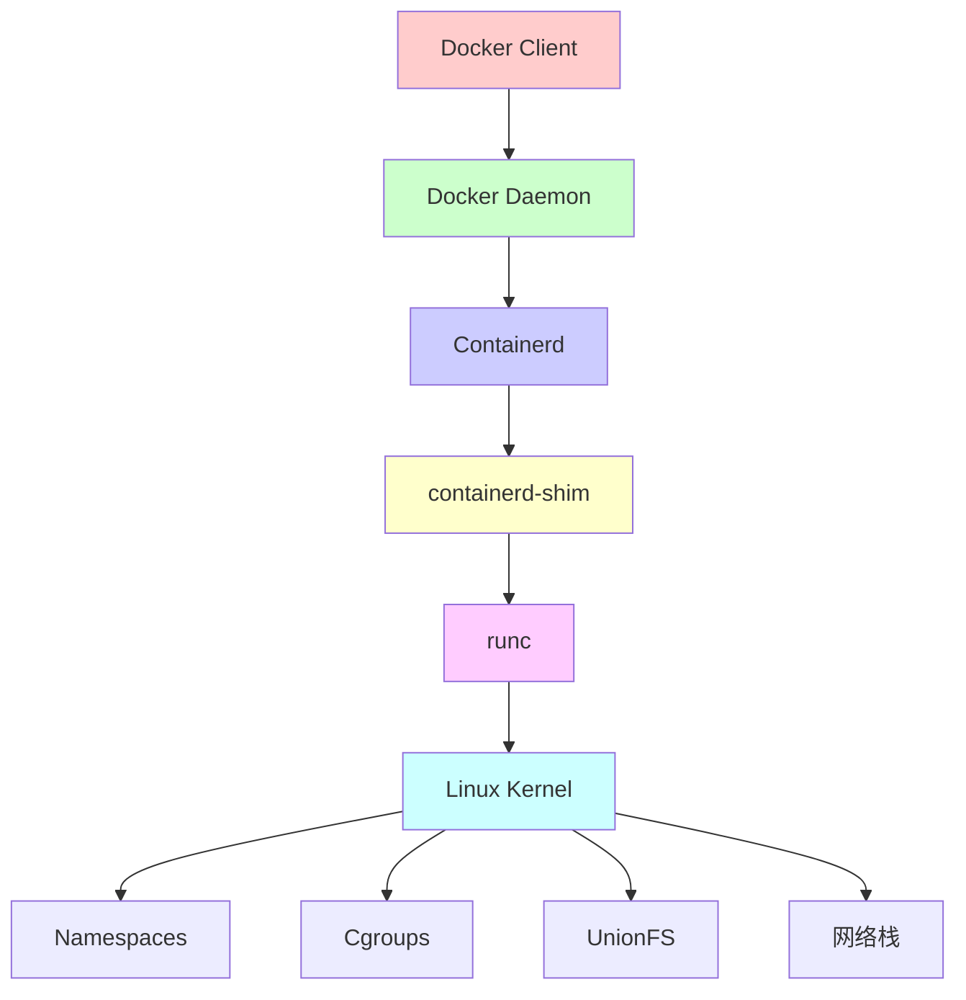

---

# Namespace（命名空间）

Namespace 是 Linux 内核提供的资源隔离机制，Docker 使用 Namespace 来实现容器的隔离。

## Namespace 类型

Docker 使用以下 6 种 Namespace：

### 1. PID Namespace（进程隔离）

PID Namespace 隔离进程 ID 空间，容器内的进程只能看到容器内的进程。

```bash
# 查看容器的 PID Namespace
docker run -d --name test nginx
docker exec test ps aux

# 在宿主机查看
ps aux | grep nginx
```

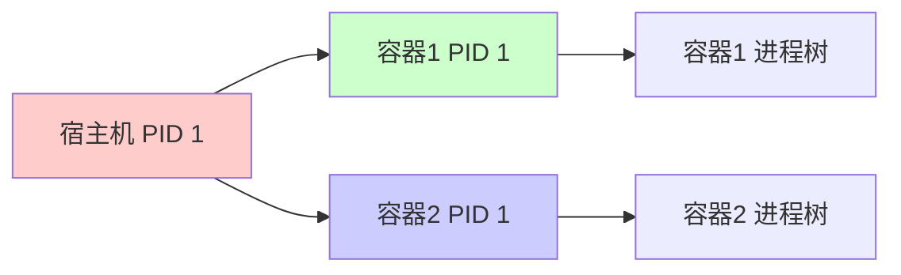

### 2. Network Namespace（网络隔离）

Network Namespace 隔离网络设备、IP 地址、端口等网络资源。

```bash
# 查看容器的网络命名空间
docker run -d --name test nginx
ip netns list

# 查看容器网络配置
docker inspect test | grep -A 20 NetworkSettings
```

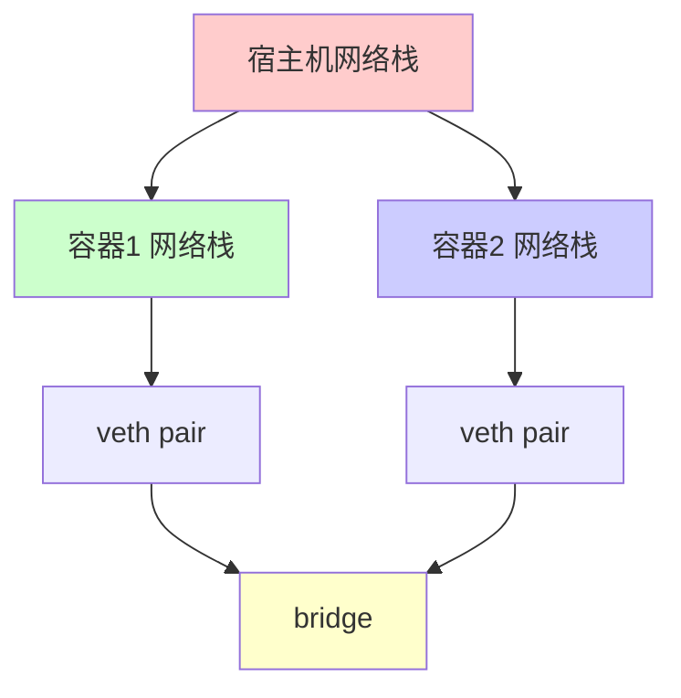

### 3. Mount Namespace（文件系统隔离）

Mount Namespace 隔离文件系统挂载点，每个容器有独立的文件系统视图。

```bash
# 查看容器的挂载点
docker run -d --name test nginx
docker exec test mount
```

### 4. UTS Namespace（主机名隔离）

UTS Namespace 隔离主机名和域名，每个容器可以有独立的主机名。

```bash
# 设置容器主机名
docker run -d --name test --hostname mycontainer nginx
docker exec test hostname
```

### 5. IPC Namespace（进程间通信隔离）

IPC Namespace 隔离 System V IPC 和 POSIX 消息队列。

```bash
# 查看 IPC 资源
docker run -d --name test nginx
docker exec test ipcs
```

### 6. User Namespace（用户隔离）

User Namespace 隔离用户和组 ID，容器内的 root 用户可以映射到宿主机的非 root 用户。

```bash
# 使用 User Namespace
docker run -d --name test --userns=host nginx
```

## Namespace 实现原理

### 创建 Namespace

```go
// 创建新的 PID Namespace
func createPIDNamespace() error {
    // 使用 unshare 系统调用创建新的 PID Namespace
    err := syscall.Unshare(syscall.CLONE_NEWPID)
    if err != nil {
        return err
    }
    
    // 在新的 Namespace 中，当前进程的 PID 为 1
    return nil
}
```

### 查看进程的 Namespace

```bash
# 查看进程的 Namespace ID
ls -l /proc/$$/ns/

# 输出示例：
# pid -> pid:[4026531836]
# net -> net:[4026531992]
# mnt -> mnt:[4026531840]
# ...
```

### Namespace 隔离示例

```bash
# 创建隔离的进程
unshare --pid --fork --mount-proc /bin/bash

# 在新 Namespace 中
ps aux  # 只能看到当前 Namespace 的进程
```

---

# Cgroups（控制组）

Cgroups 是 Linux 内核提供的资源限制和统计机制，Docker 使用 Cgroups 来限制容器的资源使用。

## Cgroups 版本

### Cgroups v1

传统的 Cgroups 实现，按资源类型分为多个子系统（subsystem）。

```bash
# 查看 Cgroups v1 子系统
ls /sys/fs/cgroup/

# 常见子系统：
# - cpu: CPU 限制
# - memory: 内存限制
# - blkio: 块设备 I/O 限制
# - devices: 设备访问控制
# - freezer: 暂停/恢复进程
```

### Cgroups v2

统一的 Cgroups 实现，所有资源控制在一个层级结构中。

```bash
# 查看 Cgroups v2（如果启用）
ls /sys/fs/cgroup/

# Cgroups v2 统一路径：
# /sys/fs/cgroup/
```

## Cgroups 资源限制

### CPU 限制

```bash
# 限制容器 CPU 使用
docker run -d --name test --cpus="1.5" nginx

# 限制 CPU 份额（相对权重）
docker run -d --name test --cpu-shares=512 nginx

# 绑定到特定 CPU 核心
docker run -d --name test --cpuset-cpus="0,1" nginx
```

### 内存限制

```bash
# 限制容器内存使用
docker run -d --name test --memory="512m" nginx

# 限制内存 + Swap
docker run -d --name test --memory="512m" --memory-swap="1g" nginx

# OOM Killer 优先级
docker run -d --name test --oom-kill-disable nginx
```

### I/O 限制

```bash
# 限制块设备 I/O
docker run -d --name test \
  --device-read-bps /dev/sda:1mb \
  --device-write-bps /dev/sda:1mb \
  nginx
```

## Cgroups 实现原理

### Cgroups v1 结构

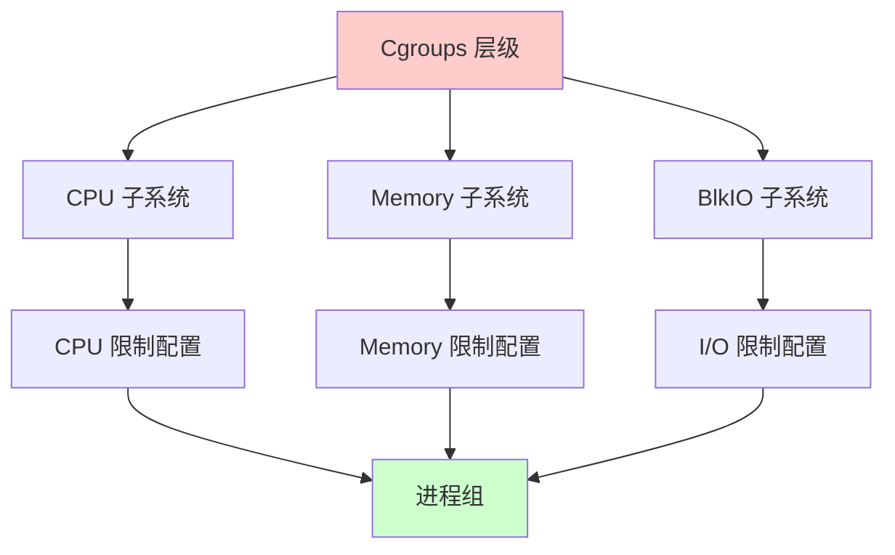

### Cgroups 文件系统操作

```bash
# 创建 Cgroup
mkdir /sys/fs/cgroup/memory/docker

# 设置内存限制（512MB）
echo 536870912 > /sys/fs/cgroup/memory/docker/memory.limit_in_bytes

# 添加进程到 Cgroup
echo $$ > /sys/fs/cgroup/memory/docker/cgroup.procs

# 查看统计信息
cat /sys/fs/cgroup/memory/docker/memory.usage_in_bytes
```

### Docker 中的 Cgroups

```bash
# 查看容器的 Cgroup 路径
docker inspect test | grep CgroupPath

# 直接查看 Cgroup 配置
cat /sys/fs/cgroup/memory/docker/<container-id>/memory.limit_in_bytes
cat /sys/fs/cgroup/cpu/docker/<container-id>/cpu.cfs_quota_us
```

---

# Union File System（联合文件系统）

UnionFS 是一种将多个文件系统（分支）合并到单个统一视图的文件系统。Docker 使用 UnionFS 实现镜像的分层存储和容器的写时复制（Copy-on-Write）。

## UnionFS 类型

Docker 支持多种存储驱动：

### 1. Overlay2（推荐）

Overlay2 是 Docker 推荐的存储驱动，性能好，支持最多 128 层。

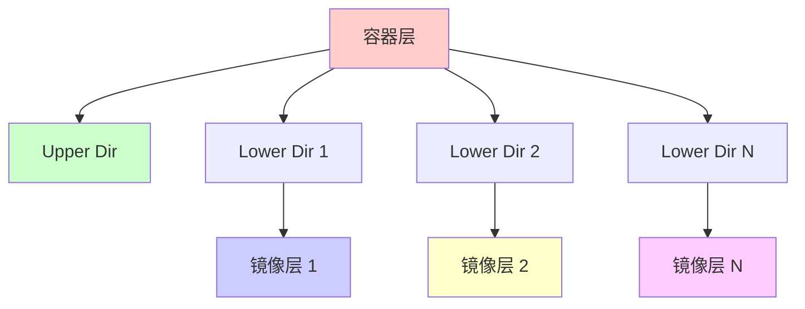

### 2. AUFS

AUFS（Another Union File System）是早期的存储驱动，现在较少使用。

### 3. Device Mapper

Device Mapper 使用块设备实现，适合生产环境。

### 4. Btrfs

Btrfs 使用 Btrfs 子卷实现，支持快照和压缩。

## Overlay2 实现原理

### 目录结构

```
/var/lib/docker/overlay2/
├── <layer-id>/
│   ├── diff/          # 该层的文件变更
│   ├── link           # 符号链接
│   ├── lower          # 下层信息
│   └── work/          # 工作目录
└── <container-id>/
    ├── diff/          # 容器可写层
    ├── link
    ├── lower          # 所有镜像层
    ├── merged/        # 合并后的视图
    └── work/
```

### 文件系统挂载

```bash
# 查看容器的 Overlay 挂载
docker run -d --name test nginx
mount | grep overlay

# 输出示例：
# overlay on /var/lib/docker/overlay2/.../merged type overlay
#   (rw,relatime,lowerdir=...,upperdir=...,workdir=...)
```

### 写时复制（Copy-on-Write）

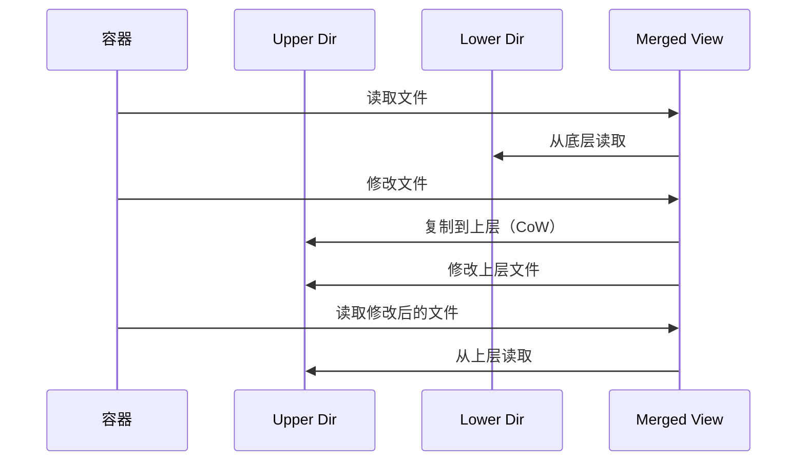

### 实际操作示例

```bash
# 创建容器
docker run -d --name test nginx

# 在容器中创建文件
docker exec test touch /tmp/test.txt
docker exec test echo "hello" > /tmp/test.txt

# 查看文件在 Overlay 中的位置
docker inspect test | grep MergedDir
# 文件实际存储在容器的 diff 目录中
```

---

# Docker 网络实现

Docker 网络使用 Linux 网络命名空间和虚拟网络设备实现容器间的网络隔离和通信。

## 网络模式

### 1. Bridge 模式（默认）

Bridge 模式是 Docker 的默认网络模式，容器通过虚拟网桥连接。

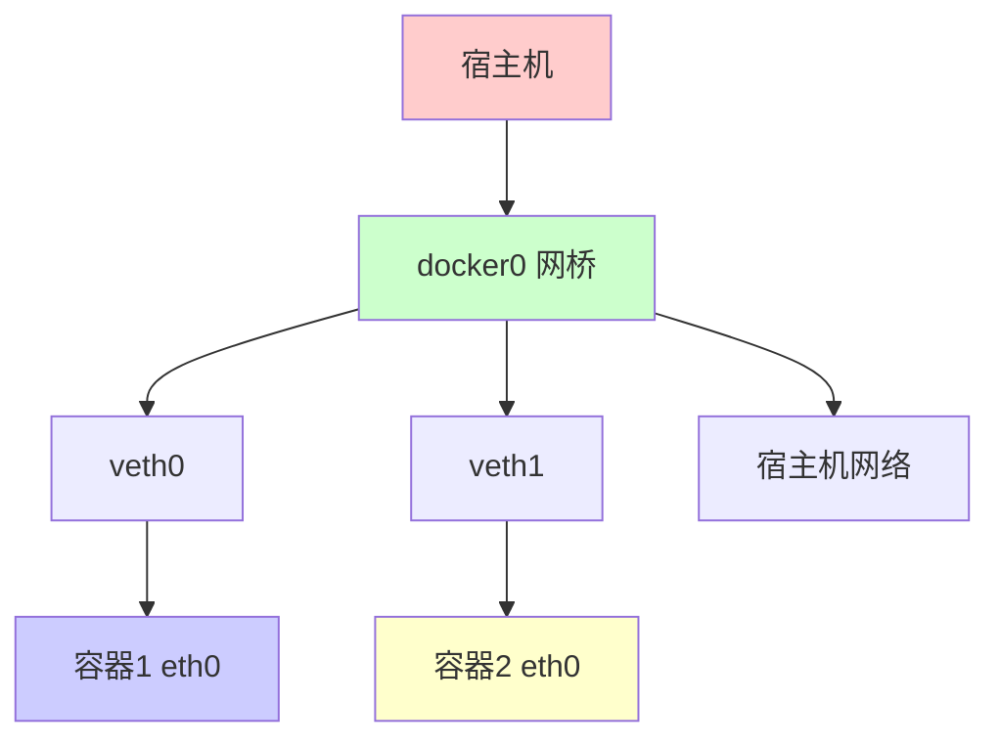

### 2. Host 模式

Host 模式直接使用宿主机的网络栈，没有网络隔离。

```bash
docker run -d --name test --network host nginx
```

### 3. None 模式

None 模式不配置网络，容器只有 loopback 接口。

```bash
docker run -d --name test --network none nginx
```

### 4. Container 模式

Container 模式共享其他容器的网络命名空间。

```bash
docker run -d --name test1 nginx
docker run -d --name test2 --network container:test1 nginx
```

## Bridge 网络实现

### 创建 Bridge 网络

```bash
# 创建自定义网络
docker network create --driver bridge mynetwork

# 查看网络
docker network inspect mynetwork
```

### veth pair

veth pair 是一对虚拟网络设备，用于连接容器和网桥。

```bash
# 查看 veth pair
ip link show type veth

# 查看容器内的网络设备
docker exec test ip addr show
```

### iptables 规则

Docker 使用 iptables 实现端口映射和防火墙规则。

```bash
# 查看 Docker 的 iptables 规则
iptables -t nat -L -n
iptables -t filter -L -n

# 端口映射规则
docker run -d --name test -p 8080:80 nginx
# Docker 会创建 DNAT 规则将宿主机 8080 端口映射到容器 80 端口
```

### 网络数据流

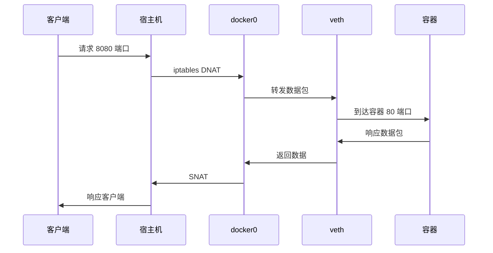

---

# 容器运行时

容器运行时负责容器的创建、启动、停止和删除。

## 运行时架构

### Docker 运行时演进

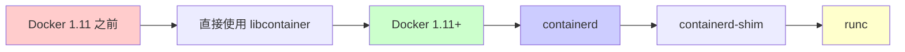

### 组件说明

1. **containerd**：容器运行时守护进程
2. **containerd-shim**：每个容器的运行时代理
3. **runc**：OCI 兼容的容器运行时

## runc 实现

runc 是 OCI（Open Container Initiative）标准的参考实现。

### 容器创建流程

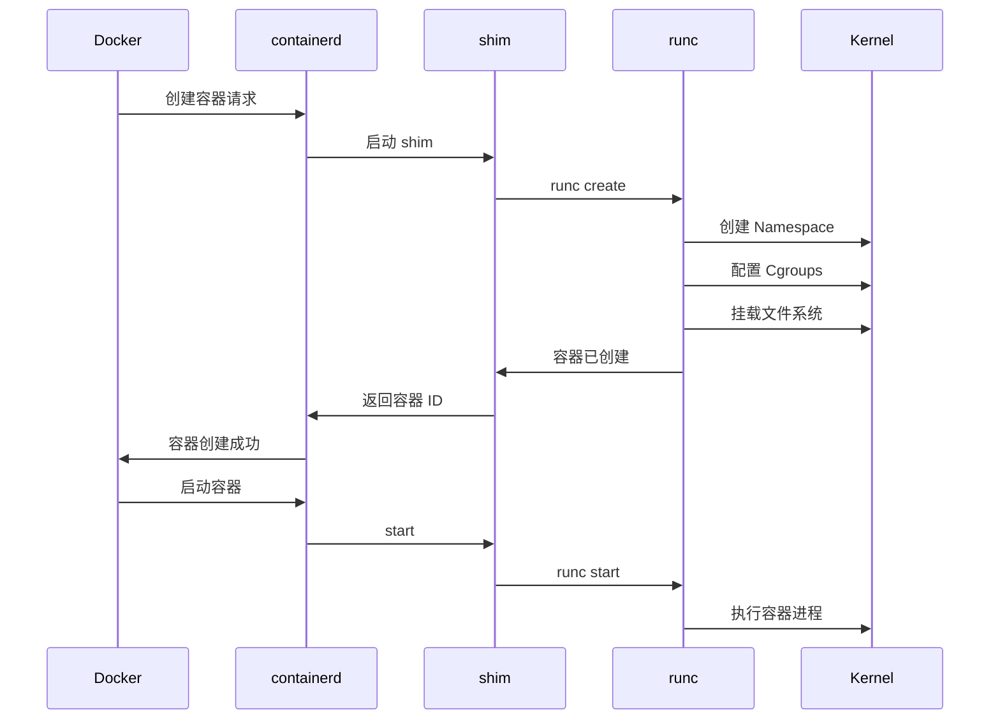

### runc 命令

```bash
# 创建容器
runc create <container-id>

# 启动容器
runc start <container-id>

# 停止容器
runc kill <container-id> SIGTERM

# 删除容器
runc delete <container-id>
```

---

# 镜像构建

Docker 镜像由多个只读层组成，通过 Dockerfile 构建。

## 镜像结构

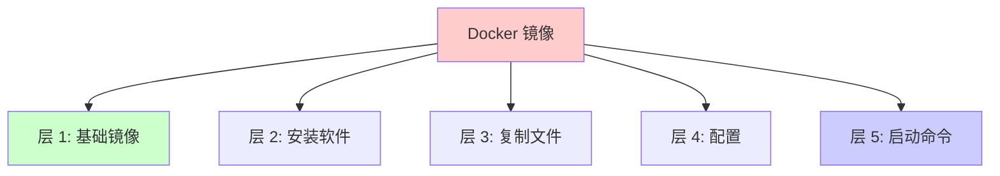

## Dockerfile 构建过程

```dockerfile
# Dockerfile 示例
FROM ubuntu:20.04
RUN apt-get update && apt-get install -y nginx
COPY index.html /var/www/html/
EXPOSE 80
CMD ["nginx", "-g", "daemon off;"]
```

### 构建过程

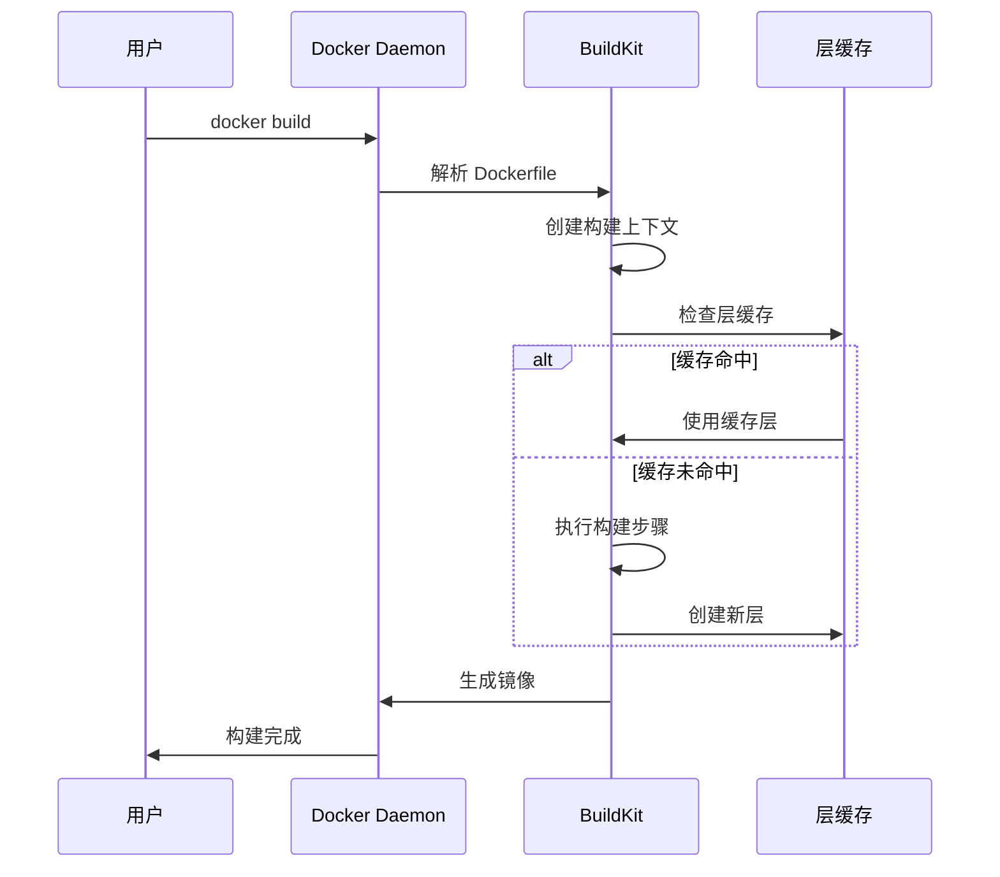

### 层缓存机制

```bash
# 查看镜像层
docker history nginx

# 查看镜像详细信息
docker inspect nginx

# 查看镜像层大小
docker images --format "table {{.Repository}}\t{{.Tag}}\t{{.Size}}"
```

---

# 存储驱动对比

## 存储驱动特性对比

| 特性 | Overlay2 | AUFS | Device Mapper | Btrfs |
|------|----------|------|---------------|-------|
| 性能 | ⭐⭐⭐⭐⭐ | ⭐⭐⭐ | ⭐⭐⭐⭐ | ⭐⭐⭐ |
| 稳定性 | ⭐⭐⭐⭐⭐ | ⭐⭐⭐ | ⭐⭐⭐⭐ | ⭐⭐⭐ |
| 支持层数 | 128 | 127 | 无限制 | 无限制 |
| 写时复制 | ✅ | ✅ | ✅ | ✅ |
| 快照 | ❌ | ❌ | ✅ | ✅ |
| 压缩 | ❌ | ❌ | ❌ | ✅ |

## 选择存储驱动

```bash
# 查看当前存储驱动
docker info | grep "Storage Driver"

# 配置存储驱动（daemon.json）
{
  "storage-driver": "overlay2"
}
```

---

# 容器生命周期

## 容器状态

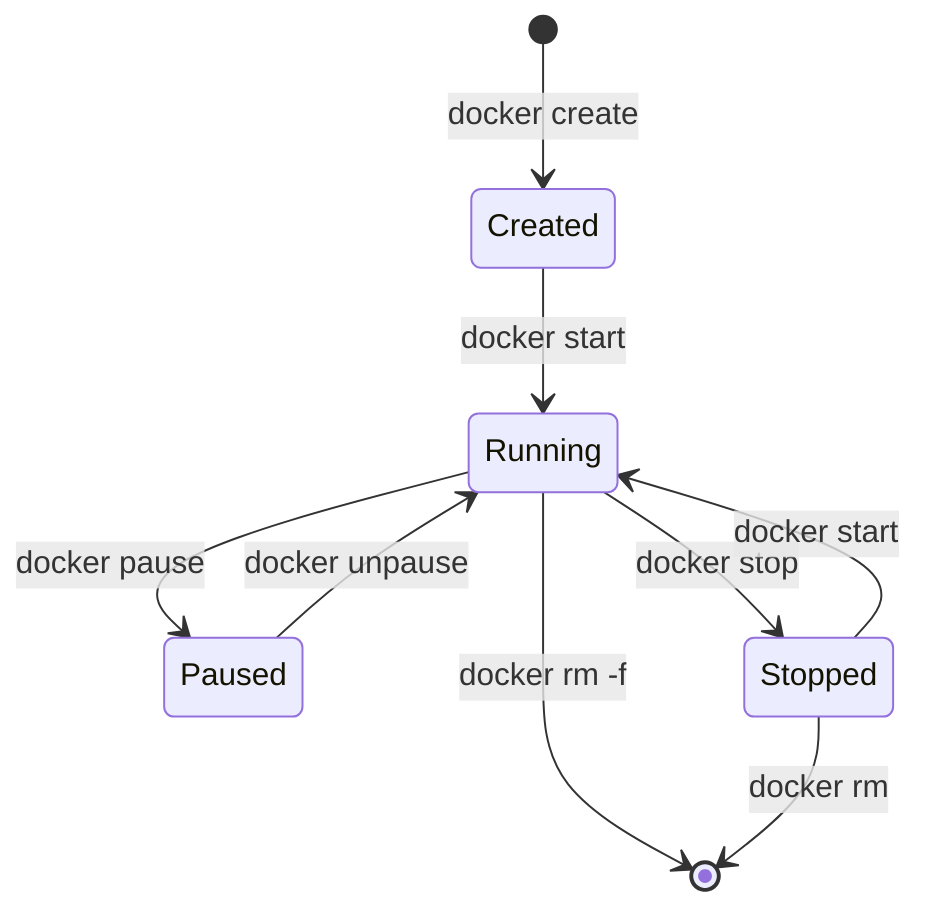

## 容器启动流程

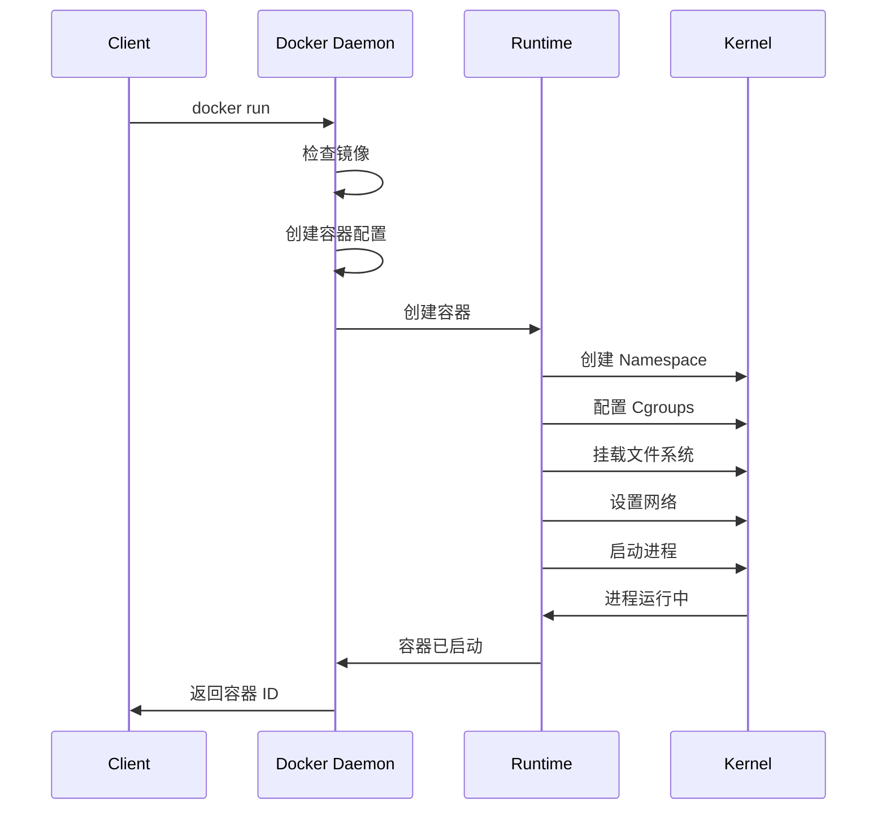

---

# 安全机制

## 安全特性

### 1. Capabilities（能力）

Linux Capabilities 提供细粒度的权限控制。

```bash
# 移除所有 capabilities，只保留必要的
docker run -d --name test --cap-drop ALL --cap-add NET_BIND_SERVICE nginx
```

### 2. Seccomp（安全计算）

Seccomp 限制容器可以使用的系统调用。

```bash
# 使用自定义 seccomp 配置
docker run -d --name test --security-opt seccomp=profile.json nginx
```

### 3. AppArmor/SELinux

使用 AppArmor 或 SELinux 提供额外的安全层。

```bash
# 使用 AppArmor
docker run -d --name test --security-opt apparmor=docker-default nginx
```

### 4. User Namespace

使用 User Namespace 隔离用户 ID。

```bash
# 启用 User Namespace
docker run -d --name test --userns=host nginx
```

## 安全最佳实践

1. ✅ 使用非 root 用户运行容器
2. ✅ 限制容器的 capabilities
3. ✅ 使用只读文件系统
4. ✅ 限制资源使用（Cgroups）
5. ✅ 定期更新镜像
6. ✅ 扫描镜像漏洞

---

# 性能优化

## 存储优化

### 1. 使用多阶段构建

```dockerfile
# 多阶段构建示例
FROM golang:1.19 AS builder
WORKDIR /app
COPY . .
RUN go build -o app .

FROM alpine:latest
WORKDIR /app
COPY --from=builder /app/app .
CMD ["./app"]
```

### 2. 优化层缓存

```dockerfile
# 好的做法：先复制依赖文件
COPY go.mod go.sum ./
RUN go mod download
COPY . .
RUN go build
```

### 3. 使用 .dockerignore

```dockerignore
# .dockerignore
node_modules
.git
*.md
```

## 网络优化

### 1. 使用自定义网络

```bash
# 创建自定义网络（性能更好）
docker network create --driver bridge --opt com.docker.network.bridge.name=mybr0 mynetwork
```

### 2. 使用 host 网络（高性能场景）

```bash
# 直接使用宿主机网络（无 NAT 开销）
docker run -d --name test --network host nginx
```

## 资源限制优化

```bash
# 合理设置资源限制
docker run -d --name test \
  --cpus="2" \
  --memory="1g" \
  --memory-swap="2g" \
  nginx
```

---

# 调试和监控

## 容器调试

### 1. 查看容器日志

```bash
# 查看容器日志
docker logs test

# 实时跟踪日志
docker logs -f test

# 查看最后 N 行
docker logs --tail 100 test
```

### 2. 进入容器

```bash
# 进入运行中的容器
docker exec -it test /bin/bash

# 使用 nsenter 进入容器的 Namespace
docker inspect --format '{{.State.Pid}}' test
nsenter -t <pid> -n -p
```

### 3. 检查容器配置

```bash
# 查看容器详细信息
docker inspect test

# 查看容器资源使用
docker stats test

# 查看容器进程
docker top test
```

## 监控工具

### 1. cAdvisor

```bash
# 运行 cAdvisor
docker run -d \
  --name=cadvisor \
  -p 8080:8080 \
  -v /:/rootfs:ro \
  -v /var/run:/var/run:ro \
  -v /sys:/sys:ro \
  -v /var/lib/docker/:/var/lib/docker:ro \
  google/cadvisor:latest
```

### 2. Prometheus + Grafana

```yaml
# docker-compose.yml
version: '3'
services:
  prometheus:
    image: prom/prometheus
    ports:
      - "9090:9090"
  
  grafana:
    image: grafana/grafana
    ports:
      - "3000:3000"
```

---

# 总结

Docker 的底层实现基于 Linux 内核的多种技术，实现了轻量级、高效的容器化方案。

## 核心技术总结

1. **Namespace**：实现资源隔离（进程、网络、文件系统等）
2. **Cgroups**：实现资源限制（CPU、内存、I/O 等）
3. **UnionFS**：实现镜像分层和存储（Overlay2）
4. **网络**：实现容器网络通信（Bridge、veth、iptables）
5. **运行时**：管理容器生命周期（containerd、runc）

## 关键要点

- ✅ Docker 不是虚拟机，而是进程隔离
- ✅ 容器共享宿主机内核
- ✅ 镜像采用分层存储，节省空间
- ✅ 网络通过虚拟设备实现隔离
- ✅ 资源限制通过 Cgroups 实现

## 参考资源

- [Docker Source Code](https://github.com/moby/moby)
- [containerd](https://github.com/containerd/containerd)
- [runc](https://github.com/opencontainers/runc)
- [Linux Namespaces](https://man7.org/linux/man-pages/man7/namespaces.7.html)
- [Linux Cgroups](https://www.kernel.org/doc/Documentation/cgroup-v1/cgroups.txt)
- [Overlay Filesystem](https://www.kernel.org/doc/Documentation/filesystems/overlayfs.txt)

