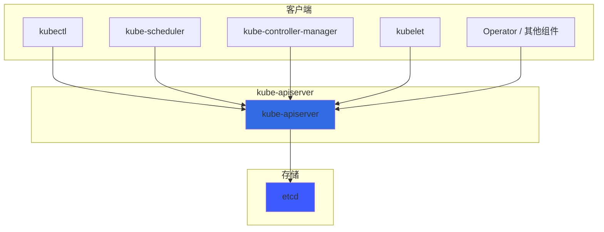
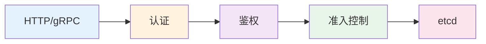
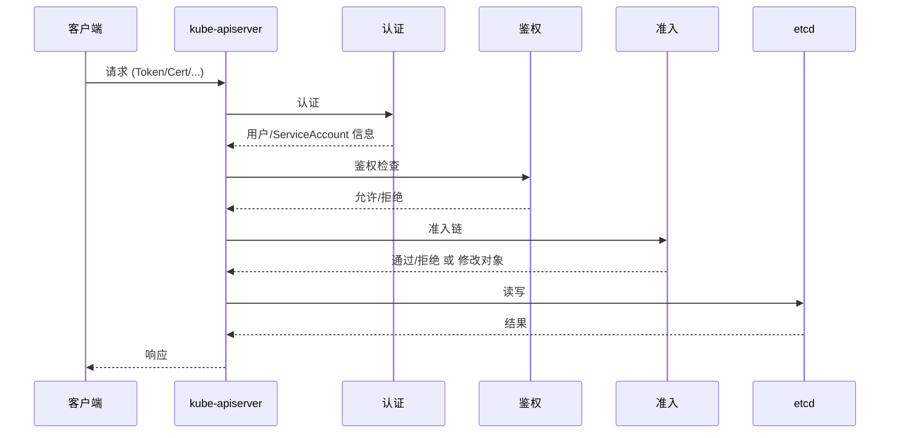
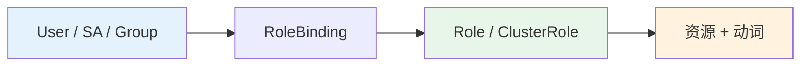
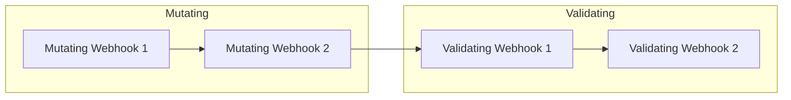
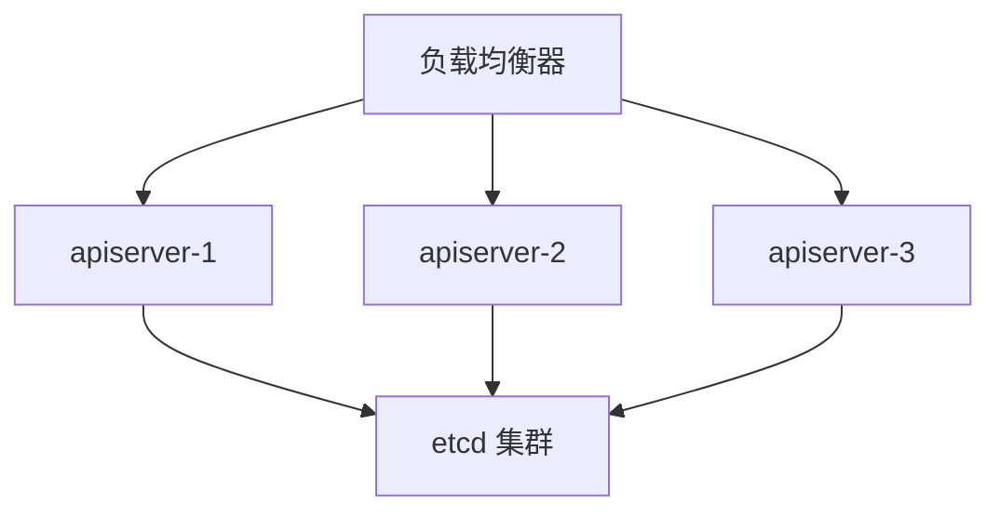
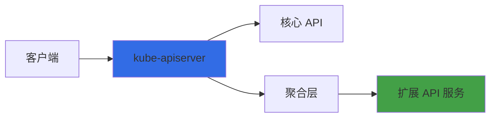

# Kubernetes API Server 详解

kube-apiserver 是 Kubernetes 控制平面的前端，是集群中所有组件交互的唯一入口。理解 API Server 的架构、请求链路和扩展机制，对运维和二次开发都至关重要。

## API Server 在集群中的角色

- **唯一入口**：kubelet、kube-scheduler、kube-controller-manager、kubectl 及各类 Operator 都只与 API Server 通信
- **集群状态存储的读写网关**：不直接写 etcd，所有读写都经 API Server，由其负责校验、转换和持久化
- **无状态服务**：可水平扩展，多副本前挂负载均衡即可实现高可用



---

# 整体架构

## 核心分层

API Server 的请求处理大致分为以下几层：

1. **HTTP 层**：接收 REST 或 gRPC（如 Aggregation）请求
2. **认证（Authentication）**：识别“是谁”
3. **鉴权（Authorization）**：判断“能否做某操作”
4. **准入控制（Admission Control）**：对创建/更新/删除的对象做校验与修改
5. **持久化**：与 etcd 交互，完成读写



## 请求处理流程概览



---

# 认证（Authentication）

API Server 支持多种认证方式，请求进入时按配置的认证器依次尝试，任一成功即视为认证通过。

## 常见认证方式

| 方式 | 说明 | 典型场景 |
|------|------|----------|
| **X.509 客户端证书** | 使用 TLS 客户端证书，CN 与 O 可映射为用户名与组 | 集群内组件、kubectl 配置 |
| **Bearer Token** | Header `Authorization: Bearer <token>` | ServiceAccount、外部集成 |
| **ServiceAccount** | 自动挂载的 JWT，本质也是 Bearer Token | Pod 内访问 API |
| **Bootstrap Token** | 节点加入集群的短期 Token | kubeadm join |
| **匿名请求** | 未通过任何认证器时，可配置为匿名或拒绝 | 需在启动参数中显式开启 |

## ServiceAccount 与 Token

每个 Namespace 下有默认 ServiceAccount，Pod 未指定时自动使用默认账号。Token 通过 Volume 挂载到 Pod 内：

```yaml
# Pod 内典型路径
/var/run/secrets/kubernetes.io/serviceaccount/token
/var/run/secrets/kubernetes.io/serviceaccount/ca.crt
/var/run/secrets/kubernetes.io/serviceaccount/namespace
```

认证通过后，请求会带上 **用户身份**（User）和 **用户组**（Group），供后续鉴权使用。

---

# 鉴权（Authorization）

认证解决“是谁”，鉴权解决“能做什么”。目前推荐使用 **RBAC**（Role-Based Access Control）。

## RBAC 核心对象

- **Role / ClusterRole**：定义“能对哪些资源做哪些动词”（如 get、list、create、delete）
- **RoleBinding / ClusterRoleBinding**：把 Role/ClusterRole 绑定到 User、Group 或 ServiceAccount



## 示例：为 Pod 内应用赋权

```yaml
# ClusterRole：允许读 Pod 和 ConfigMap
apiVersion: rbac.authorization.k8s.io/v1
kind: ClusterRole
metadata:
  name: app-reader
rules:
  - apiGroups: [""]
    resources: ["pods", "configmaps"]
    verbs: ["get", "list", "watch"]
---
# 在 default 命名空间下，将 app-reader 绑定到 default/default SA
apiVersion: rbac.authorization.k8s.io/v1
kind: RoleBinding
metadata:
  name: app-reader-binding
  namespace: default
subjects:
  - kind: ServiceAccount
    name: default
    namespace: default
roleRef:
  kind: ClusterRole
  name: app-reader
  apiGroup: rbac.authorization.k8s.io
```

---

# 准入控制（Admission Control）

准入控制在鉴权之后、写入 etcd 之前执行，分为两类：

- **Validating**：只做校验，通过或拒绝，不修改对象
- **Mutating**：可修改对象内容（如注入 Sidecar、默认值）

同一阶段内（先 Mutating 再 Validating）会按配置顺序执行多个 Webhook。



## 内置准入插件举例

- **NamespaceLifecycle**：禁止在已删除的 Namespace 下创建资源
- **LimitRanger**：根据 LimitRange 设置默认/最大资源
- **ResourceQuota**：校验是否超出 Namespace 的 ResourceQuota
- **PodSecurity**：按 Pod Security Standard 做安全校验

## 动态准入：Admission Webhook

通过 **MutatingAdmissionWebhook** 和 **ValidatingAdmissionWebhook** 调用外部 HTTP 服务，实现自定义逻辑（如注入 Sidecar、策略校验）。Webhook 在 API Server 启动时通过配置注册，请求时由 API Server 主动调用。

---

# API 版本与资源

## API Group 与版本

Kubernetes 资源按 **API Group** 和 **版本** 组织，例如：

- `v1`：核心资源（Pod、Service、ConfigMap、Secret 等）
- `apps/v1`：Deployment、StatefulSet、DaemonSet 等
- `networking.k8s.io/v1`：Ingress、NetworkPolicy
- `rbac.authorization.k8s.io/v1`：Role、ClusterRole、RoleBinding 等

同一 Group 下可有多个版本（如 `v1beta1`、`v1`），API Server 负责在存储版本与请求版本之间转换。

## 存储版本与多版本

- 集群中每种资源有一个 **存储版本**（Storage Version），etcd 中只存这一版本
- 客户端可用 **当前版本**（如 `v1`）或 **旧版本**（如 `v1beta1`）请求
- API Server 在写入时转换为存储版本，在读取时按请求版本转换后返回

---

# 与 etcd 的交互

- **读写路径**：大部分资源键为 `/registry/<resource>/<namespace>/<name>` 或集群级 `/registry/<resource>/<name>`
- **Watch**：List+Watch 是 Informer 的基础，API Server 将 etcd 的变更通过 Watch 接口推送给客户端，实现缓存与增量更新
- **一致性**：etcd 使用 Raft 保证一致性，API Server 无状态，多副本 + 负载均衡即可水平扩展

---

# 高可用与扩展

## 多副本 + 负载均衡

- 部署多个 kube-apiserver 实例，前面用负载均衡（如 LVS、云厂商 LB、HAProxy）暴露一个 VIP
- 所有控制平面组件和 kubelet 的 `--server` 指向该 VIP
- 各 API Server 实例共享同一套 etcd 集群（或 etcd 也为多副本）



## 常见启动参数

| 参数 | 说明 |
|------|------|
| `--etcd-servers` | etcd 地址列表 |
| `--authorization-mode` | 鉴权模式，如 RBAC,Node |
| `--enable-admission-plugins` | 启用的准入插件 |
| `--service-cluster-ip-range` | Service ClusterIP 网段 |
| `--request-timeout` | 请求超时时间 |
| `--max-requests-inflight` | 并发请求上限，用于限流 |

---

# 聚合层（API Aggregation）

聚合层允许在不修改 kube-apiserver 源码的前提下，注册额外的 API（如 metrics-server、自定义 CRD 的 API 服务）。扩展服务以 Deployment + Service 形式部署在集群内，通过 **APIService** 资源注册到 API Server，请求路径由 API Server 转发到对应 Service。



---

# 小结

- **kube-apiserver** 是集群唯一入口，无状态，可水平扩展，与 etcd 配合承载全部集群状态读写。
- 请求依次经过 **认证 → 鉴权 → 准入 → etcd**，认证确定身份，RBAC 做鉴权，准入做校验与注入。
- 熟悉 **RBAC、ServiceAccount、Admission Webhook** 和 **API 版本/聚合**，有助于安全配置、策略扩展和故障排查。
