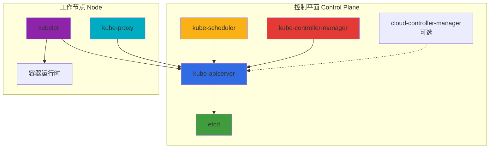
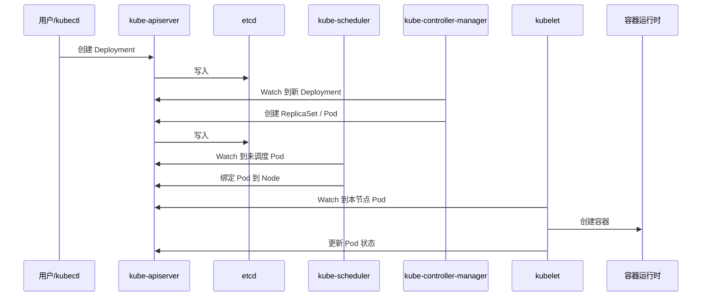

# Kubernetes 组件详解

Kubernetes 集群由**控制平面（Control Plane）**和**工作节点（Worker Node）**两大部分组成，每部分包含若干核心组件，各司其职。本文按角色逐一介绍各组件的职责与协作关系。

## 集群整体视图

---

# 控制平面组件

控制平面负责集群的全局决策：调度、副本控制、存储与网络策略等，并保存集群状态。通常部署在 Master 节点上，生产环境会多副本 + 负载均衡实现高可用。

---

## kube-apiserver

**职责**：集群的**唯一入口**，对外暴露 Kubernetes API（REST + 部分 gRPC），所有读写集群状态的操作都经过它。

- **认证 / 鉴权 / 准入**：校验请求身份、权限，执行准入插件（含 Webhook）
- **读写 etcd**：不直接对外暴露 etcd，由 API Server 统一与 etcd 交互
- **多版本与聚合**：支持多 API 版本转换、API 聚合（如 metrics-server）
- **无状态**：可水平扩展，多副本前挂负载均衡即可

其他组件（kubelet、scheduler、controller-manager、kubectl 等）都只与 API Server 通信，不直连 etcd。

---

## etcd

**职责**：分布式键值存储，保存集群的**全部持久化状态**。

- **存储内容**：Pod、Service、ConfigMap、Secret、Deployment、Node 等所有 API 资源，以及部分运行时状态
- **一致性**：基于 Raft 的强一致性，适合作为“集群唯一事实来源”
- **Watch**：支持 Watch 接口，API Server 依赖它做 List+Watch，供各组件做本地缓存与增量同步
- **部署**：生产环境通常 3 或 5 节点组成 etcd 集群，与 API Server 可同机或独立部署

控制平面其它组件不直接写 etcd，所有写操作都经由 API Server。

---

## kube-scheduler

**职责**：为**未调度的 Pod 选择运行节点**（只做“选节点”，不负责起容器）。

- **输入**：通过 List+Watch 获取未绑定节点的 Pod（`spec.nodeName` 为空）
- **输出**：为 Pod 填写 `spec.nodeName`，并写入 API Server，由对应节点上的 kubelet 实际创建容器
- **调度策略**：综合考虑资源请求/限制、节点亲和/反亲和、污点与容忍、拓扑分布等，进行打分与选择
- **可扩展**：支持调度框架（Scheduling Framework）、多调度器（通过 `spec.schedulerName` 指定）

不负责拉取镜像、不负责在节点上启停容器，只做“把这个 Pod 放到哪个 Node”的决策。

---

## kube-controller-manager

**职责**：运行一系列**控制器（Controller）**，通过“调谐循环”把集群当前状态驱向期望状态（声明式 API 的“大脑”）。

每个控制器通常：

1. 通过 List+Watch 从 API Server 获取关心资源
2. 计算“当前状态 vs 期望状态”的差异
3. 调用 API Server 执行创建/更新/删除，缩小差异

**内置控制器举例**：

| 控制器 | 职责 |
|--------|------|
| **Deployment Controller** | 根据 Deployment 维护 ReplicaSet，驱动 Pod 副本数 |
| **ReplicaSet Controller** | 根据 ReplicaSet 创建/删除 Pod，使副本数符合 spec |
| **Node Controller** | 监控节点心跳，标记 NotReady、驱逐 Pod 等 |
| **Service Account / Token Controller** | 为 Namespace 下的 ServiceAccount 创建默认 Secret 等 |
| **Endpoint Controller** | 根据 Service 与 Pod 选择器，维护 Endpoints 对象 |
| **Namespace Controller** | 处理 Namespace 删除时的级联清理 |
| **PersistentVolume Controller** | 绑定 PVC 与 PV、回收等 |
| **DaemonSet Controller** | 确保满足条件的节点上都有 DaemonSet 的 Pod |
| **Job / CronJob Controller** | 执行一次性任务与定时任务 |
| **StatefulSet Controller** | 维护有状态应用的 Pod 与 PVC 等 |
| **Replication Controller** | 旧版副本控制器，一般由 ReplicaSet 替代 |

它们都只与 API Server 交互，不直接操作 etcd 或节点。

---

## cloud-controller-manager（可选）

**职责**：把与**云厂商能力**相关的控制逻辑从 kube-controller-manager 中拆出来，便于在非云或不同云环境替换/禁用。

常见内嵌控制器：

- **Node Controller**：从云上获取节点信息、标记不可用等
- **Route Controller**：在云 VPC 中配置路由
- **Service Controller**：负责 LoadBalancer 类型 Service 的创建/更新（如 AWS ELB、GCP LB）
- **Volume Controller**：与云盘挂载/卸载相关的逻辑

在自建 IDC 或不需要云集成的环境中，可以不部署或只启用部分控制器。

---

# 节点组件

工作节点负责运行 Pod（容器），并上报状态、执行控制平面下发的指令。每个节点上通常运行：kubelet、kube-proxy、容器运行时，以及可选的 CNI、日志/监控 Agent 等。

---

## kubelet

**职责**：节点上的**“节点代理”**，是控制平面与该节点之间的桥梁，负责本节点上 Pod 与容器的生命周期。

- **注册节点**：向 API Server 注册本节点，并定期上报节点状态（条件、容量、分配等）
- **接收 Pod 清单**：通过 API Server 的 Watch 获取调度到本节点的 Pod，或从本地静态 Pod 目录读取
- **运行 Pod**：调用容器运行时（containerd、CRI-O 等）拉取镜像、创建/启停容器，按 PodSpec 配置网络、挂载卷等
- **执行探针**：执行 Pod 的 liveness/readiness/startup 探针，并更新 Pod 状态
- **上报状态**：将 Pod/Container 状态写回 API Server
- **静态 Pod**：可独立于 API Server 运行通过本地目录管理的静态 Pod（常用于部署控制平面组件）

kubelet 只与 API Server 通信，不直接连 etcd；它通过 CRI 与容器运行时交互，通过 CNI 与网络插件配合完成 Pod 网络。

---

## kube-proxy

**职责**：在节点上维护 **Service 的访问规则**，实现 ClusterIP/NodePort 等类型的转发与负载均衡。

- **监听 Service / Endpoints**：通过 API Server 的 Watch 获取 Service 与 Endpoints 变化
- **写规则**：根据模式（iptables 或 ipvs）在本机写入规则，把访问 Service ClusterIP/NodePort 的流量转发到后端 Pod
- **模式**：  
  - **iptables**：通过 iptables 规则做 DNAT 和随机/轮询，规则多时延迟与可维护性较差  
  - **ipvs**：基于内核 IPVS，支持更多负载均衡算法，适合大规模集群

kube-proxy 不负责 Pod 间直连、不负责 Ingress，只负责“到 Service 的流量如何转到 Pod”。

---

## 容器运行时（Container Runtime）

**职责**：在节点上**真正拉取镜像、创建/启停容器**的组件。

- **CRI 接口**：实现 Kubernetes 的 CRI（Container Runtime Interface），供 kubelet 通过 gRPC 调用
- **常见实现**：containerd、CRI-O，以及通过 cri-dockerd 适配的 Docker（Docker 自身已不直接实现 CRI）
- **能力**：拉取镜像、创建/删除容器、执行 exec、获取日志等，并配合 kubelet 设置资源限制、挂载、设备等

kubelet 不直接操作内核创建容器，而是通过 CRI 调用容器运行时完成。

---

# 组件协作关系简图

---

# 可选 / 插件组件

这些不是“必须跑在每台机上的核心二进制”，但典型集群都会用到，或由发行版/托管平台默认提供。

---

## DNS（CoreDNS）

**职责**：为集群内提供 **Service / Pod 的 DNS 解析**（如 `svc-name.namespace.svc.cluster.local`）。

- 以 Deployment 形式部署，由 kubelet 为 Pod 自动配置 `nameserver` 指向集群 DNS Service
- 解析 Service、Pod（可选）等，是服务发现的重要一环

---

## CNI 网络插件

**职责**：为 Pod 分配 IP、配置 Pod 网络（多节点互通、网络策略等）。

- kubelet 在创建 Pod 网络命名空间后调用 CNI 插件，由插件完成网桥/路由/ overlay 等配置
- 常见实现：Calico、Cilium、Flannel、Weave 等，有的还提供 NetworkPolicy 的实现

---

## Ingress Controller

**职责**：根据 **Ingress** 资源配置七层路由、TLS、负载均衡，把外部流量导入集群内 Service。

- 自身是集群内 Deployment + Service，通过 NodePort 或 LoadBalancer 暴露
- 常见实现：Nginx Ingress Controller、Traefik、HAProxy Ingress 等

---

## 其他常见插件

- **Metrics Server**：采集节点与 Pod 的 CPU/内存等指标，供 HPA、kubectl top、集群监控使用
- **Dashboard**：Web 管理界面，通过 API Server 代理或直接配置 RBAC 访问集群
- **日志 / 监控 Agent**：如 Fluentd、Prometheus Node Exporter 等，以 DaemonSet 等形式部署

---

# 职责对照表

| 组件 | 所在位置 | 核心职责 |
|------|----------|----------|
| **kube-apiserver** | 控制平面 | 集群唯一 API 入口，认证鉴权准入，读写 etcd |
| **etcd** | 控制平面 | 持久化存储集群全部状态，支持 Watch |
| **kube-scheduler** | 控制平面 | 为 Pod 选择运行节点（只做调度决策） |
| **kube-controller-manager** | 控制平面 | 运行各类控制器，驱动物理状态向期望状态收敛 |
| **cloud-controller-manager** | 控制平面（可选） | 与云厂商相关的节点、路由、LB、存储等逻辑 |
| **kubelet** | 节点 | 节点代理，负责本节点 Pod/容器生命周期与状态上报 |
| **kube-proxy** | 节点 | 维护 Service 转发规则（iptables/ipvs） |
| **容器运行时** | 节点 | 拉取镜像、创建/运行/停止容器（实现 CRI） |
| **CoreDNS** | 集群内 Pod | 集群内 DNS 解析 |
| **CNI** | 节点 | Pod 网络配置与策略 |
| **Ingress Controller** | 集群内 Pod | 七层入口与路由 |

---

# 小结

- **控制平面**：API Server（入口）+ etcd（存储）+ Scheduler（调度）+ Controller Manager（调谐），可选 Cloud Controller Manager 对接云。
- **节点**：kubelet（管 Pod/容器）+ kube-proxy（管 Service 流量）+ 容器运行时（真正跑容器）。
- 所有对集群状态的读写都经 **API Server**，其它组件通过 **List+Watch** 与 API Server 协作，实现声明式 API 与最终一致性。
