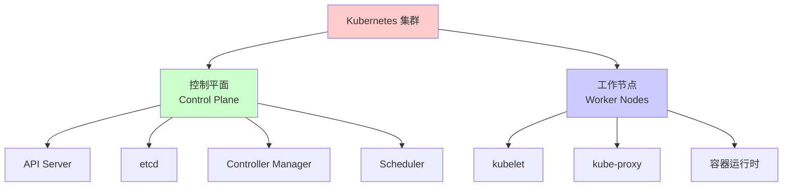
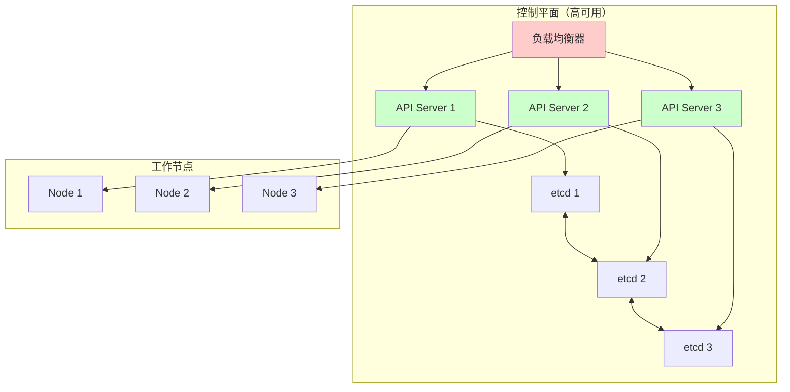
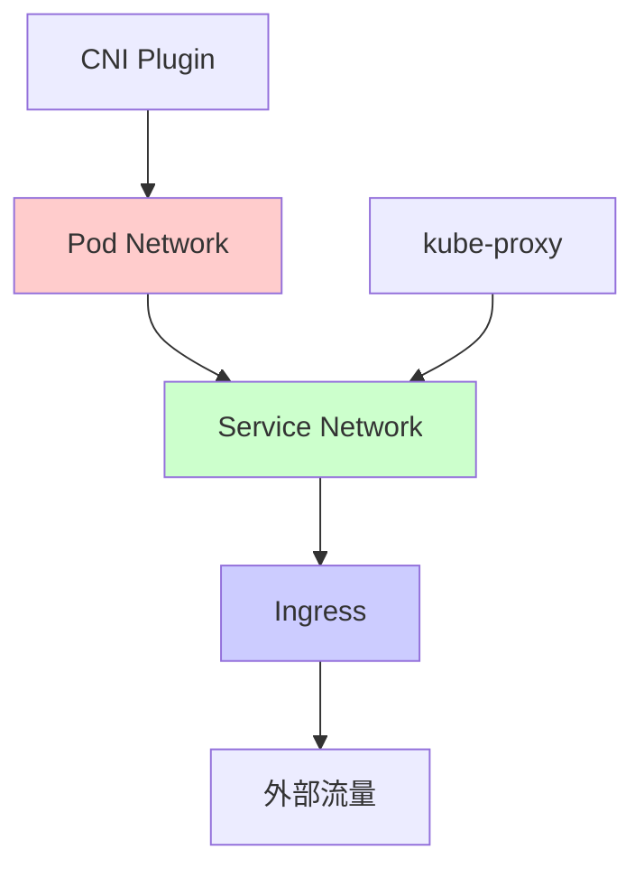

# Kubernetes 集群管理详解

Kubernetes（K8s）是一个开源的容器编排平台，用于自动化部署、扩展和管理容器化应用。本文详细介绍 Kubernetes 集群的规划、部署、管理和运维实践。

# Kubernetes 概述

## 什么是 Kubernetes

Kubernetes 是 Google 开源的容器编排系统，用于自动化容器的部署、扩展和管理。它提供了一个平台来管理容器化应用的生命周期。



## 核心特性

- **自动化部署**：自动部署和回滚应用
- **服务发现和负载均衡**：自动服务发现和负载均衡
- **存储编排**：自动挂载存储系统
- **自动扩缩容**：根据 CPU 和内存使用率自动扩缩容
- **自我修复**：自动重启失败的容器、替换和重新调度节点
- **密钥和配置管理**：管理敏感信息和配置

## 集群组件

### 控制平面组件

- **kube-apiserver**：API 服务器，集群的前端
- **etcd**：分布式键值存储，保存集群数据
- **kube-scheduler**：调度器，决定 Pod 运行在哪个节点
- **kube-controller-manager**：运行控制器进程

### 节点组件

- **kubelet**：节点代理，确保容器运行在 Pod 中
- **kube-proxy**：网络代理，维护网络规则
- **容器运行时**：负责运行容器的软件（Docker、containerd 等）

# 集群架构

## 高可用架构



## 网络架构



# 集群规划

## 节点规划

### Master 节点

- **数量**：至少 3 个（高可用）
- **配置**：4 CPU、8GB 内存（最小）
- **存储**：50GB+ SSD
- **网络**：千兆网络

### Worker 节点

- **数量**：根据工作负载确定
- **配置**：根据应用需求
- **存储**：根据数据需求
- **网络**：千兆网络

## 资源规划

### CPU 和内存

```yaml
# 节点资源规划示例
节点类型: Master
  CPU: 4 cores
  内存: 8GB
  系统预留: 1 core, 2GB
  可用资源: 3 cores, 6GB

节点类型: Worker
  CPU: 16 cores
  内存: 64GB
  系统预留: 1 core, 4GB
  Kubelet 预留: 0.5 core, 2GB
  可用资源: 14.5 cores, 58GB
```

### 存储规划

- **系统盘**：50GB+（操作系统和容器镜像）
- **数据盘**：根据应用需求
- **存储类**：SSD、HDD、网络存储

## 网络规划

### Pod 网络

- **CIDR**：10.244.0.0/16（默认）
- **每个节点子网**：/24
- **最大 Pod 数**：根据节点配置

### Service 网络

- **CIDR**：10.96.0.0/12（默认）
- **ClusterIP 范围**：10.96.0.0/12

# 集群部署

## 使用 kubeadm 部署

### 初始化 Master 节点

```bash
# 安装 kubeadm、kubelet、kubectl
apt-get update && apt-get install -y apt-transport-https
curl -s https://packages.cloud.google.com/apt/doc/apt-key.gpg | apt-key add -
echo "deb https://apt.kubernetes.io/ kubernetes-xenial main" | tee /etc/apt/sources.list.d/kubernetes.list
apt-get update
apt-get install -y kubelet kubeadm kubectl

# 初始化 Master 节点
kubeadm init \
  --pod-network-cidr=10.244.0.0/16 \
  --apiserver-advertise-address=192.168.1.100 \
  --control-plane-endpoint=192.168.1.100:6443

# 配置 kubectl
mkdir -p $HOME/.kube
cp -i /etc/kubernetes/admin.conf $HOME/.kube/config
chown $(id -u):$(id -g) $HOME/.kube/config
```

### 安装网络插件

```bash
# 安装 Flannel
kubectl apply -f https://raw.githubusercontent.com/coreos/flannel/master/Documentation/kube-flannel.yml

# 或安装 Calico
kubectl apply -f https://docs.projectcalico.org/manifests/calico.yaml
```

### 加入 Worker 节点

```bash
# 在 Worker 节点执行（使用 Master 节点输出的 join 命令）
kubeadm join 192.168.1.100:6443 \
  --token <token> \
  --discovery-token-ca-cert-hash sha256:<hash>
```

## 高可用部署

### 配置负载均衡器

```yaml
# HAProxy 配置示例
global
    log /dev/log local0
    maxconn 4096

defaults
    log global
    mode tcp
    timeout connect 5000ms
    timeout client 50000ms
    timeout server 50000ms

frontend kubernetes-frontend
    bind *:6443
    default_backend kubernetes-backend

backend kubernetes-backend
    balance roundrobin
    option tcp-check
    server master1 192.168.1.100:6443 check
    server master2 192.168.1.101:6443 check
    server master3 192.168.1.102:6443 check
```

### 多 Master 节点

```bash
# 在第一个 Master 节点
kubeadm init --control-plane-endpoint=192.168.1.200:6443

# 在其他 Master 节点
kubeadm join 192.168.1.200:6443 \
  --control-plane \
  --token <token> \
  --discovery-token-ca-cert-hash sha256:<hash> \
  --certificate-key <certificate-key>
```

## 使用工具部署

### kubeadm

- **优点**：官方推荐、简单易用
- **缺点**：需要手动配置高可用

### kops

- **优点**：自动化程度高、支持 AWS
- **缺点**：主要支持云平台

### kubespray

- **优点**：支持多平台、功能完整
- **缺点**：配置复杂

# 节点管理

## 节点状态

```bash
# 查看节点状态
kubectl get nodes

# 查看节点详细信息
kubectl describe node <node-name>

# 查看节点资源使用
kubectl top nodes
```

## 节点标签和污点

### 节点标签

```bash
# 添加标签
kubectl label nodes <node-name> disktype=ssd

# 查看标签
kubectl get nodes --show-labels

# 删除标签
kubectl label nodes <node-name> disktype-
```

### 节点污点（Taint）

```bash
# 添加污点
kubectl taint nodes <node-name> key=value:NoSchedule

# 查看污点
kubectl describe node <node-name> | grep Taint

# 删除污点
kubectl taint nodes <node-name> key:NoSchedule-
```

### Pod 容忍度（Toleration）

```yaml
apiVersion: v1
kind: Pod
metadata:
  name: nginx
spec:
  tolerations:
  - key: "key"
    operator: "Equal"
    value: "value"
    effect: "NoSchedule"
  containers:
  - name: nginx
    image: nginx
```

## 节点维护

### 驱逐节点上的 Pod

```bash
# 标记节点为不可调度
kubectl cordon <node-name>

# 驱逐节点上的 Pod
kubectl drain <node-name> --ignore-daemonsets --delete-emptydir-data

# 恢复节点
kubectl uncordon <node-name>
```

### 节点升级

```bash
# 1. 标记节点为不可调度
kubectl cordon <node-name>

# 2. 驱逐 Pod
kubectl drain <node-name> --ignore-daemonsets

# 3. 升级 kubelet 和 kubeadm
apt-get update
apt-get install -y kubelet kubeadm

# 4. 升级 kubelet
systemctl restart kubelet

# 5. 恢复节点
kubectl uncordon <node-name>
```

## 节点监控

```bash
# 查看节点资源使用
kubectl top nodes

# 查看节点事件
kubectl get events --field-selector involvedObject.kind=Node

# 查看节点条件
kubectl get nodes -o jsonpath='{.items[*].status.conditions}'
```

# 资源管理

## 命名空间（Namespace）

### 创建和管理

```bash
# 创建命名空间
kubectl create namespace production

# 查看命名空间
kubectl get namespaces

# 删除命名空间
kubectl delete namespace production
```

### 资源配额（ResourceQuota）

```yaml
apiVersion: v1
kind: ResourceQuota
metadata:
  name: compute-quota
  namespace: production
spec:
  hard:
    requests.cpu: "10"
    requests.memory: 20Gi
    limits.cpu: "20"
    limits.memory: 40Gi
    persistentvolumeclaims: "10"
    pods: "50"
```

### 限制范围（LimitRange）

```yaml
apiVersion: v1
kind: LimitRange
metadata:
  name: mem-limit-range
  namespace: production
spec:
  limits:
  - default:
      memory: "512Mi"
      cpu: "500m"
    defaultRequest:
      memory: "256Mi"
      cpu: "250m"
    type: Container
```

## 资源请求和限制

### Pod 资源定义

```yaml
apiVersion: v1
kind: Pod
metadata:
  name: nginx
spec:
  containers:
  - name: nginx
    image: nginx
    resources:
      requests:
        memory: "64Mi"
        cpu: "250m"
      limits:
        memory: "128Mi"
        cpu: "500m"
```

### 资源单位

- **CPU**：1 = 1 核，500m = 0.5 核
- **内存**：Mi = Mebibyte，Gi = Gibibyte

## 自动扩缩容

### Horizontal Pod Autoscaler (HPA)

```yaml
apiVersion: autoscaling/v2
kind: HorizontalPodAutoscaler
metadata:
  name: nginx-hpa
spec:
  scaleTargetRef:
    apiVersion: apps/v1
    kind: Deployment
    name: nginx
  minReplicas: 2
  maxReplicas: 10
  metrics:
  - type: Resource
    resource:
      name: cpu
      target:
        type: Utilization
        averageUtilization: 70
  - type: Resource
    resource:
      name: memory
      target:
        type: Utilization
        averageUtilization: 80
```

### Vertical Pod Autoscaler (VPA)

```yaml
apiVersion: autoscaling.k8s.io/v1
kind: VerticalPodAutoscaler
metadata:
  name: nginx-vpa
spec:
  targetRef:
    apiVersion: apps/v1
    kind: Deployment
    name: nginx
  updatePolicy:
    updateMode: "Auto"
  resourcePolicy:
    containerPolicies:
    - containerName: nginx
      minAllowed:
        cpu: 100m
        memory: 50Mi
      maxAllowed:
        cpu: 1
        memory: 500Mi
```

### Cluster Autoscaler

```yaml
# Cluster Autoscaler 配置示例（云平台）
apiVersion: v1
kind: ConfigMap
metadata:
  name: cluster-autoscaler-status
  namespace: kube-system
data:
  nodes.min: "3"
  nodes.max: "10"
```

# 网络管理

## 网络模型

### Pod 网络

- **每个 Pod 一个 IP**：Pod 拥有自己的 IP 地址
- **Pod 间直接通信**：Pod 可以直接通过 IP 通信
- **CNI 插件**：通过 CNI 插件实现网络

### Service 网络

```yaml
apiVersion: v1
kind: Service
metadata:
  name: nginx-service
spec:
  selector:
    app: nginx
  ports:
  - port: 80
    targetPort: 8080
  type: ClusterIP  # ClusterIP, NodePort, LoadBalancer
```

### Service 类型

- **ClusterIP**：集群内部访问
- **NodePort**：通过节点端口访问
- **LoadBalancer**：云平台负载均衡器
- **ExternalName**：外部服务别名

## Ingress

### Ingress 配置

```yaml
apiVersion: networking.k8s.io/v1
kind: Ingress
metadata:
  name: nginx-ingress
  annotations:
    nginx.ingress.kubernetes.io/rewrite-target: /
spec:
  rules:
  - host: example.com
    http:
      paths:
      - path: /api
        pathType: Prefix
        backend:
          service:
            name: api-service
            port:
              number: 80
      - path: /
        pathType: Prefix
        backend:
          service:
            name: web-service
            port:
              number: 80
```

### Ingress Controller

```bash
# 安装 Nginx Ingress Controller
kubectl apply -f https://raw.githubusercontent.com/kubernetes/ingress-nginx/controller-v1.8.1/deploy/static/provider/cloud/deploy.yaml
```

## 网络策略（NetworkPolicy）

```yaml
apiVersion: networking.k8s.io/v1
kind: NetworkPolicy
metadata:
  name: api-allow
  namespace: production
spec:
  podSelector:
    matchLabels:
      app: api
  policyTypes:
  - Ingress
  - Egress
  ingress:
  - from:
    - podSelector:
        matchLabels:
          app: frontend
    ports:
    - protocol: TCP
      port: 8080
  egress:
  - to:
    - podSelector:
        matchLabels:
          app: database
    ports:
    - protocol: TCP
      port: 5432
```

# 存储管理

## 存储卷（Volume）

### 临时卷

```yaml
apiVersion: v1
kind: Pod
metadata:
  name: nginx
spec:
  containers:
  - name: nginx
    image: nginx
    volumeMounts:
    - name: tmp
      mountPath: /tmp
  volumes:
  - name: tmp
    emptyDir: {}
```

### 持久卷（PersistentVolume）

```yaml
apiVersion: v1
kind: PersistentVolume
metadata:
  name: pv-example
spec:
  capacity:
    storage: 10Gi
  accessModes:
  - ReadWriteOnce
  persistentVolumeReclaimPolicy: Retain
  storageClassName: slow
  hostPath:
    path: /data/pv
```

### 持久卷声明（PersistentVolumeClaim）

```yaml
apiVersion: v1
kind: PersistentVolumeClaim
metadata:
  name: pvc-example
spec:
  accessModes:
  - ReadWriteOnce
  resources:
    requests:
      storage: 10Gi
  storageClassName: slow
```

### 使用 PVC

```yaml
apiVersion: v1
kind: Pod
metadata:
  name: nginx
spec:
  containers:
  - name: nginx
    image: nginx
    volumeMounts:
    - name: data
      mountPath: /data
  volumes:
  - name: data
    persistentVolumeClaim:
      claimName: pvc-example
```

## 存储类（StorageClass）

```yaml
apiVersion: storage.k8s.io/v1
kind: StorageClass
metadata:
  name: fast-ssd
provisioner: kubernetes.io/aws-ebs
parameters:
  type: gp3
  fsType: ext4
volumeBindingMode: WaitForFirstConsumer
allowVolumeExpansion: true
```

## 动态存储供应

```yaml
# 使用 StorageClass 自动创建 PV
apiVersion: v1
kind: PersistentVolumeClaim
metadata:
  name: auto-pvc
spec:
  accessModes:
  - ReadWriteOnce
  storageClassName: fast-ssd  # 自动创建 PV
  resources:
    requests:
      storage: 20Gi
```

# 安全配置

## RBAC（基于角色的访问控制）

### ServiceAccount

```yaml
apiVersion: v1
kind: ServiceAccount
metadata:
  name: app-sa
  namespace: production
```

### Role

```yaml
apiVersion: rbac.authorization.k8s.io/v1
kind: Role
metadata:
  name: pod-reader
  namespace: production
rules:
- apiGroups: [""]
  resources: ["pods"]
  verbs: ["get", "watch", "list"]
```

### RoleBinding

```yaml
apiVersion: rbac.authorization.k8s.io/v1
kind: RoleBinding
metadata:
  name: read-pods
  namespace: production
subjects:
- kind: ServiceAccount
  name: app-sa
  namespace: production
roleRef:
  kind: Role
  name: pod-reader
  apiGroup: rbac.authorization.k8s.io
```

### ClusterRole 和 ClusterRoleBinding

```yaml
apiVersion: rbac.authorization.k8s.io/v1
kind: ClusterRole
metadata:
  name: cluster-admin
rules:
- apiGroups: ["*"]
  resources: ["*"]
  verbs: ["*"]
---
apiVersion: rbac.authorization.k8s.io/v1
kind: ClusterRoleBinding
metadata:
  name: admin-binding
subjects:
- kind: User
  name: admin
  apiGroup: rbac.authorization.k8s.io
roleRef:
  kind: ClusterRole
  name: cluster-admin
  apiGroup: rbac.authorization.k8s.io
```

## Pod 安全策略（PSP）

```yaml
apiVersion: policy/v1beta1
kind: PodSecurityPolicy
metadata:
  name: restricted
spec:
  privileged: false
  allowPrivilegeEscalation: false
  requiredDropCapabilities:
    - ALL
  volumes:
    - 'configMap'
    - 'emptyDir'
    - 'projected'
    - 'secret'
    - 'downwardAPI'
    - 'persistentVolumeClaim'
  hostNetwork: false
  hostIPC: false
  hostPID: false
  runAsUser:
    rule: 'MustRunAsNonRoot'
  seLinux:
    rule: 'RunAsAny'
  fsGroup:
    rule: 'RunAsAny'
  readOnlyRootFilesystem: false
```

## 网络策略

见[网络管理](#网络管理)章节。

## Secrets 管理

### 创建 Secret

```bash
# 从文件创建
kubectl create secret generic mysecret \
  --from-file=username=./username.txt \
  --from-file=password=./password.txt

# 从字面量创建
kubectl create secret generic mysecret \
  --from-literal=username=admin \
  --from-literal=password=secret
```

### 使用 Secret

```yaml
apiVersion: v1
kind: Pod
metadata:
  name: nginx
spec:
  containers:
  - name: nginx
    image: nginx
    env:
    - name: USERNAME
      valueFrom:
        secretKeyRef:
          name: mysecret
          key: username
    - name: PASSWORD
      valueFrom:
        secretKeyRef:
          name: mysecret
          key: password
    volumeMounts:
    - name: secret-volume
      mountPath: /etc/secret
      readOnly: true
  volumes:
  - name: secret-volume
    secret:
      secretName: mysecret
```

## TLS 证书管理

### 使用 cert-manager

```yaml
# 安装 cert-manager
kubectl apply -f https://github.com/cert-manager/cert-manager/releases/download/v1.13.0/cert-manager.yaml

# 创建 ClusterIssuer
apiVersion: cert-manager.io/v1
kind: ClusterIssuer
metadata:
  name: letsencrypt-prod
spec:
  acme:
    server: https://acme-v02.api.letsencrypt.org/directory
    email: admin@example.com
    privateKeySecretRef:
      name: letsencrypt-prod
    solvers:
    - http01:
        ingress:
          class: nginx
```

# 监控和日志

## 监控方案

### Prometheus + Grafana

```yaml
# Prometheus 配置示例
apiVersion: v1
kind: ConfigMap
metadata:
  name: prometheus-config
data:
  prometheus.yml: |
    global:
      scrape_interval: 15s
    scrape_configs:
    - job_name: 'kubernetes-apiservers'
      kubernetes_sd_configs:
      - role: endpoints
    - job_name: 'kubernetes-nodes'
      kubernetes_sd_configs:
      - role: node
```

### 指标收集

- **cAdvisor**：容器指标
- **kube-state-metrics**：Kubernetes 对象指标
- **node-exporter**：节点指标

## 日志收集

### 使用 Fluentd

```yaml
apiVersion: v1
kind: ConfigMap
metadata:
  name: fluentd-config
data:
  fluent.conf: |
    <source>
      @type tail
      path /var/log/containers/*.log
      pos_file /var/log/fluentd-containers.log.pos
      tag kubernetes.*
      read_from_head true
      <parse>
        @type json
        time_format %Y-%m-%dT%H:%M:%S.%NZ
      </parse>
    </source>
    <match kubernetes.**>
      @type elasticsearch
      host elasticsearch.logging.svc.cluster.local
      port 9200
      logstash_format true
    </match>
```

### 使用 Loki

```yaml
# Loki 配置
apiVersion: v1
kind: ConfigMap
metadata:
  name: loki-config
data:
  loki.yaml: |
    auth_enabled: false
    server:
      http_listen_port: 3100
    ingester:
      lifecycler:
        address: 127.0.0.1
        ring:
          kvstore:
            store: inmemory
          replication_factor: 1
    schema_config:
      configs:
      - from: 2020-10-24
        store: boltdb-shipper
        object_store: filesystem
        schema: v11
        index:
          prefix: index_
          period: 24h
```

## 可观测性工具

- **Prometheus**：指标收集和存储
- **Grafana**：可视化
- **Jaeger**：分布式追踪
- **Loki**：日志聚合
- **Kiali**：服务网格可视化

# 备份和恢复

## etcd 备份

### 手动备份

```bash
# 备份 etcd
ETCDCTL_API=3 etcdctl snapshot save /backup/etcd-snapshot.db \
  --endpoints=https://127.0.0.1:2379 \
  --cacert=/etc/kubernetes/pki/etcd/ca.crt \
  --cert=/etc/kubernetes/pki/etcd/server.crt \
  --key=/etc/kubernetes/pki/etcd/server.key

# 查看备份
ETCDCTL_API=3 etcdctl snapshot status /backup/etcd-snapshot.db
```

### 恢复 etcd

```bash
# 停止所有 API Server
systemctl stop kube-apiserver

# 恢复 etcd
ETCDCTL_API=3 etcdctl snapshot restore /backup/etcd-snapshot.db \
  --data-dir /var/lib/etcd-backup

# 替换 etcd 数据目录
mv /var/lib/etcd /var/lib/etcd-old
mv /var/lib/etcd-backup /var/lib/etcd

# 重启 etcd
systemctl start etcd
```

## 资源备份

### 使用 Velero

```bash
# 安装 Velero
velero install \
  --provider aws \
  --plugins velero/velero-plugin-for-aws:v1.7.0 \
  --bucket my-backup-bucket \
  --secret-file ./credentials-velero

# 创建备份
velero backup create my-backup

# 恢复备份
velero restore create --from-backup my-backup
```

### 手动备份

```bash
# 备份所有资源
kubectl get all --all-namespaces -o yaml > backup.yaml

# 备份特定命名空间
kubectl get all -n production -o yaml > production-backup.yaml
```

# 故障处理

## 常见问题

### Pod 无法启动

```bash
# 查看 Pod 状态
kubectl get pods

# 查看 Pod 详细信息
kubectl describe pod <pod-name>

# 查看 Pod 日志
kubectl logs <pod-name>

# 查看事件
kubectl get events --sort-by='.lastTimestamp'
```

### 节点 NotReady

```bash
# 查看节点状态
kubectl get nodes

# 查看节点详细信息
kubectl describe node <node-name>

# 检查 kubelet 状态
systemctl status kubelet

# 查看 kubelet 日志
journalctl -u kubelet -f
```

### 网络问题

```bash
# 检查 Pod 网络
kubectl exec -it <pod-name> -- ping <target-pod-ip>

# 检查 Service
kubectl get svc
kubectl describe svc <service-name>

# 检查 Endpoints
kubectl get endpoints <service-name>
```

### 存储问题

```bash
# 检查 PV 和 PVC
kubectl get pv
kubectl get pvc

# 查看 PV 详细信息
kubectl describe pv <pv-name>

# 检查存储类
kubectl get storageclass
```

## 调试工具

### kubectl debug

```bash
# 调试 Pod
kubectl debug <pod-name> -it --image=busybox

# 调试节点
kubectl debug node/<node-name> -it --image=busybox
```

### 网络调试

```bash
# 使用 netshoot 镜像
kubectl run -it --rm debug --image=nicolaka/netshoot --restart=Never -- bash
```

# 最佳实践

## 集群规划

1. **高可用设计**：至少 3 个 Master 节点
2. **资源预留**：为系统组件预留足够资源
3. **节点标签**：使用标签组织节点
4. **命名空间隔离**：使用命名空间隔离环境

## 资源管理

1. **设置资源限制**：为所有 Pod 设置资源限制
2. **使用 HPA**：使用自动扩缩容
3. **资源配额**：使用 ResourceQuota 限制命名空间资源
4. **监控资源使用**：定期监控资源使用情况

## 安全实践

1. **RBAC**：使用 RBAC 控制访问
2. **最小权限**：遵循最小权限原则
3. **Secrets 管理**：使用 Secrets 管理敏感信息
4. **网络策略**：使用 NetworkPolicy 限制网络访问
5. **镜像扫描**：扫描容器镜像漏洞

## 监控和日志

1. **全面监控**：监控集群、节点、Pod 指标
2. **日志聚合**：集中收集和存储日志
3. **告警配置**：配置关键指标告警
4. **定期审查**：定期审查监控和日志

## 备份策略

1. **定期备份**：定期备份 etcd 和重要资源
2. **备份验证**：定期验证备份可用性
3. **灾难恢复**：制定灾难恢复计划
4. **自动化备份**：使用工具自动化备份

## 更新和维护

1. **版本管理**：保持 Kubernetes 版本更新
2. **滚动更新**：使用滚动更新策略
3. **维护窗口**：规划维护窗口
4. **测试环境**：在测试环境验证更新

## 性能优化

1. **节点优化**：优化节点配置
2. **网络优化**：选择合适的 CNI 插件
3. **存储优化**：选择合适的存储方案
4. **调度优化**：使用节点选择器和亲和性

# 总结

Kubernetes 集群管理是一个复杂的过程，需要综合考虑架构设计、资源管理、安全配置、监控日志等多个方面。

## 核心要点

1. **高可用设计**：确保集群高可用
2. **资源管理**：合理规划和管理资源
3. **安全配置**：实施完善的安全策略
4. **监控日志**：建立完善的监控和日志系统
5. **备份恢复**：制定备份和恢复策略

## 关键实践

- ✅ 使用命名空间隔离环境
- ✅ 为所有 Pod 设置资源限制
- ✅ 使用 RBAC 控制访问
- ✅ 定期备份 etcd
- ✅ 监控集群健康状态
- ✅ 使用自动化工具

## 注意事项

- ⚠️ 资源规划要充分
- ⚠️ 安全配置要完善
- ⚠️ 备份策略要可靠
- ⚠️ 监控告警要及时
- ⚠️ 更新维护要谨慎

掌握 Kubernetes 集群管理技能，能够构建稳定、安全、高效的容器化应用平台。

# 参考文献

- [Kubernetes 官方文档](https://kubernetes.io/docs/)
- [Kubernetes 最佳实践](https://kubernetes.io/docs/setup/best-practices/)
- [etcd 官方文档](https://etcd.io/docs/)
- [CNCF 项目](https://www.cncf.io/projects/)

