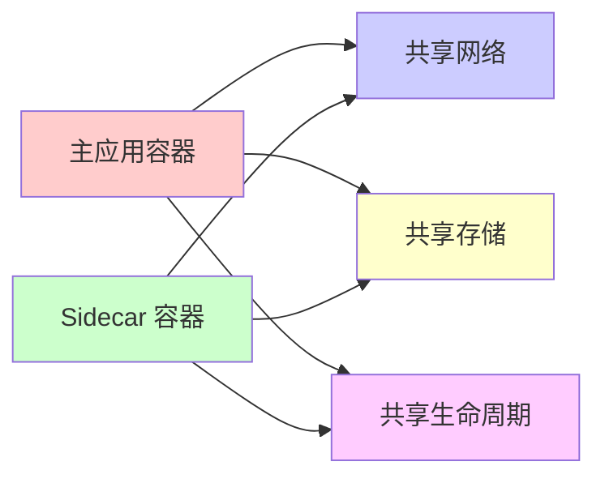
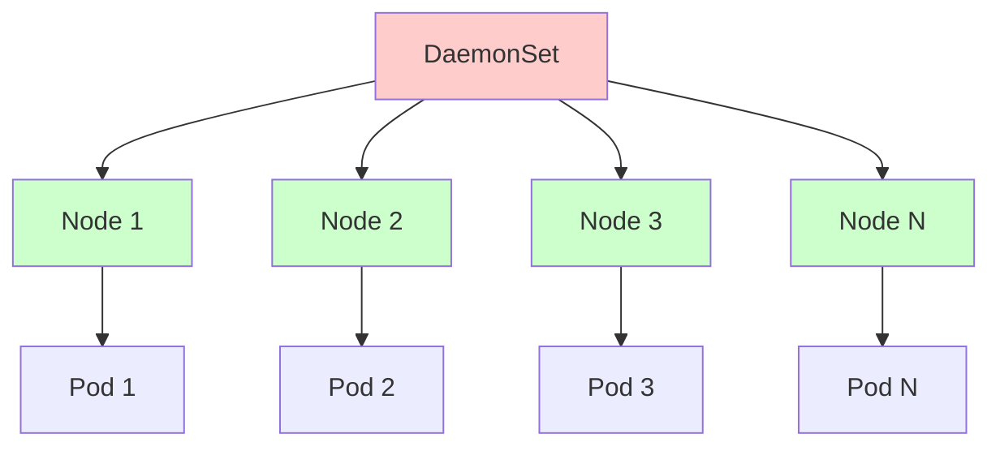

Sidecar 模式是一种容器设计模式，它将应用程序的功能分解为独立的容器，这些容器与主应用程序容器一起部署在同一个 Pod 或容器组中。Sidecar 容器为主容器提供辅助功能，如日志收集、监控、网络代理、配置管理等。

## 基本概念

### 什么是 Sidecar 模式

Sidecar 模式（边车模式）得名于摩托车边车的概念。在容器编排中，Sidecar 容器就像"边车"一样，与主应用容器（"摩托车"）紧密相连，共享相同的生命周期和网络命名空间。



### 核心特性

1. **共享网络命名空间**：Sidecar 和主容器共享同一个网络栈，可以通过 localhost 通信
2. **共享存储卷**：可以共享文件系统，实现日志、配置等数据的共享
3. **独立进程**：Sidecar 是独立的容器进程，不影响主应用的运行
4. **生命周期绑定**：Sidecar 与主容器一起启动、停止和重启
5. **职责分离**：主容器专注于业务逻辑，Sidecar 处理横切关注点

## 实现方式

### Docker Compose 实现

在 Docker Compose 中，可以通过共享网络和卷来实现 Sidecar 模式：

```yaml
version: '3.8'

services:
  # 主应用容器
  app:
    image: myapp:latest
    volumes:
      - ./logs:/var/log/app
      - ./config:/etc/app
    networks:
      - app-network
    depends_on:
      - sidecar

  # Sidecar 容器 - 日志收集
  sidecar:
    image: fluentd:latest
    volumes:
      - ./logs:/var/log/app:ro  # 只读挂载日志目录
      - ./fluentd.conf:/etc/fluentd/fluentd.conf
    networks:
      - app-network
    command: fluentd -c /etc/fluentd/fluentd.conf
```

### Kubernetes 实现

在 Kubernetes 中，Sidecar 模式通过 Pod 中的多个容器实现：

```yaml
apiVersion: v1
kind: Pod
metadata:
  name: app-with-sidecar
spec:
  containers:
    # 主应用容器
    - name: app
      image: myapp:latest
      ports:
        - containerPort: 8080
      volumeMounts:
        - name: shared-logs
          mountPath: /var/log/app
        - name: shared-config
          mountPath: /etc/app
      
    # Sidecar 容器 - 日志收集
    - name: log-collector
      image: fluent/fluentd:latest
      volumeMounts:
        - name: shared-logs
          mountPath: /var/log/app:ro
      env:
        - name: FLUENTD_CONF
          value: "fluentd.conf"
    
    # Sidecar 容器 - 监控代理
    - name: metrics-collector
      image: prom/node-exporter:latest
      ports:
        - containerPort: 9100
      volumeMounts:
        - name: proc
          mountPath: /host/proc:ro
        - name: sys
          mountPath: /host/sys:ro
  
  volumes:
    - name: shared-logs
      emptyDir: {}
    - name: shared-config
      configMap:
        name: app-config
    - name: proc
      hostPath:
        path: /proc
    - name: sys
      hostPath:
        path: /sys
```

## 使用场景

### 1. 日志收集

主应用将日志写入共享卷，Sidecar 容器负责收集、处理和转发日志到集中式日志系统。

**Go 实现示例**：

```go
package main

import (
    "context"
    "fmt"
    "io/ioutil"
    "log"
    "os"
    "path/filepath"
    "time"
    
    "github.com/fsnotify/fsnotify"
)

// 主应用：写入日志
func mainApp() {
    logDir := "/var/log/app"
    os.MkdirAll(logDir, 0755)
    
    logFile := filepath.Join(logDir, "app.log")
    f, err := os.OpenFile(logFile, os.O_APPEND|os.O_CREATE|os.O_WRONLY, 0644)
    if err != nil {
        log.Fatal(err)
    }
    defer f.Close()
    
    logger := log.New(f, "", log.LstdFlags)
    
    for i := 0; i < 10; i++ {
        logger.Printf("应用日志消息 %d: 处理用户请求\n", i)
        time.Sleep(1 * time.Second)
    }
    
    fmt.Println("主应用完成")
}

// Sidecar：监控日志文件并收集
func logCollectorSidecar() {
    logDir := "/var/log/app"
    logFile := filepath.Join(logDir, "app.log")
    
    // 创建文件监听器
    watcher, err := fsnotify.NewWatcher()
    if err != nil {
        log.Fatal(err)
    }
    defer watcher.Close()
    
    // 监听日志目录
    err = watcher.Add(logDir)
    if err != nil {
        log.Fatal(err)
    }
    
    fmt.Println("日志收集 Sidecar 已启动，监控:", logFile)
    
    // 读取现有日志
    readLogFile(logFile)
    
    // 监听文件变化
    for {
        select {
        case event, ok := <-watcher.Events:
            if !ok {
                return
            }
            if event.Op&fsnotify.Write == fsnotify.Write {
                if event.Name == logFile {
                    readLogFile(logFile)
                }
            }
        case err, ok := <-watcher.Errors:
            if !ok {
                return
            }
            log.Println("监听错误:", err)
        }
    }
}

func readLogFile(logFile string) {
    content, err := ioutil.ReadFile(logFile)
    if err != nil {
        return
    }
    
    // 模拟发送到日志聚合系统（如 ELK、Loki 等）
    fmt.Printf("[日志收集器] 收集到日志:\n%s\n", string(content))
    
    // 这里可以添加实际的日志转发逻辑
    // 例如：发送到 Elasticsearch、Kafka、Loki 等
}

func main() {
    // 根据环境变量决定运行主应用还是 Sidecar
    mode := os.Getenv("MODE")
    
    if mode == "sidecar" {
        logCollectorSidecar()
    } else {
        mainApp()
    }
}
```

### 2. 服务网格代理

Sidecar 容器作为网络代理，处理服务发现、负载均衡、熔断、限流等功能。

**Go 实现示例**：

```go
package main

import (
    "context"
    "fmt"
    "io"
    "log"
    "net"
    "net/http"
    "time"
)

// 主应用：简单的 HTTP 服务
func mainApp() {
    http.HandleFunc("/", func(w http.ResponseWriter, r *http.Request) {
        fmt.Fprintf(w, "主应用响应: %s\n", time.Now().Format(time.RFC3339))
    })
    
    fmt.Println("主应用启动在 :8080")
    log.Fatal(http.ListenAndServe(":8080", nil))
}

// Sidecar：HTTP 代理，添加监控和日志
func proxySidecar() {
    // 代理服务器配置
    proxy := &http.Server{
        Addr:    ":8081",
        Handler: http.HandlerFunc(handleProxy),
    }
    
    fmt.Println("代理 Sidecar 启动在 :8081")
    log.Fatal(proxy.ListenAndServe())
}

func handleProxy(w http.ResponseWriter, r *http.Request) {
    start := time.Now()
    
    // 记录请求日志
    log.Printf("[代理] %s %s from %s", r.Method, r.URL.Path, r.RemoteAddr)
    
    // 转发请求到主应用
    targetURL := "http://localhost:8080" + r.URL.Path
    if r.URL.RawQuery != "" {
        targetURL += "?" + r.URL.RawQuery
    }
    
    // 创建新请求
    req, err := http.NewRequest(r.Method, targetURL, r.Body)
    if err != nil {
        http.Error(w, err.Error(), http.StatusInternalServerError)
        return
    }
    
    // 复制请求头
    for key, values := range r.Header {
        for _, value := range values {
            req.Header.Add(key, value)
        }
    }
    
    // 发送请求
    client := &http.Client{Timeout: 30 * time.Second}
    resp, err := client.Do(req)
    if err != nil {
        http.Error(w, err.Error(), http.StatusBadGateway)
        return
    }
    defer resp.Body.Close()
    
    // 复制响应头
    for key, values := range resp.Header {
        for _, value := range values {
            w.Header().Add(key, value)
        }
    }
    
    // 复制响应状态码和体
    w.WriteHeader(resp.StatusCode)
    io.Copy(w, resp.Body)
    
    // 记录响应时间和状态
    duration := time.Since(start)
    log.Printf("[代理] %s %s - %d - %v", 
        r.Method, r.URL.Path, resp.StatusCode, duration)
    
    // 这里可以添加指标收集（如 Prometheus metrics）
}

func main() {
    mode := os.Getenv("MODE")
    
    if mode == "sidecar" {
        proxySidecar()
    } else {
        mainApp()
    }
}
```

### 3. 配置管理

Sidecar 容器从配置中心拉取配置，主应用从共享卷读取配置。

**Go 实现示例**：

```go
package main

import (
    "encoding/json"
    "fmt"
    "io/ioutil"
    "log"
    "os"
    "path/filepath"
    "time"
)

type AppConfig struct {
    DatabaseURL string `json:"database_url"`
    APIKey      string `json:"api_key"`
    Timeout     int    `json:"timeout"`
    Debug       bool   `json:"debug"`
}

// 主应用：读取配置
func mainApp() {
    configPath := "/etc/app/config.json"
    
    for {
        config, err := loadConfig(configPath)
        if err != nil {
            log.Printf("读取配置失败: %v，使用默认配置", err)
            config = &AppConfig{
                DatabaseURL: "localhost:5432",
                APIKey:      "default-key",
                Timeout:     30,
                Debug:       false,
            }
        }
        
        fmt.Printf("主应用使用配置: %+v\n", config)
        
        // 模拟使用配置
        time.Sleep(5 * time.Second)
    }
}

// Sidecar：从配置中心拉取配置并写入共享卷
func configSidecar() {
    configPath := "/etc/app/config.json"
    os.MkdirAll(filepath.Dir(configPath), 0755)
    
    fmt.Println("配置管理 Sidecar 已启动")
    
    for {
        // 模拟从配置中心（如 Consul、etcd、Vault）拉取配置
        config := fetchConfigFromCenter()
        
        // 写入共享卷
        configData, err := json.MarshalIndent(config, "", "  ")
        if err != nil {
            log.Printf("序列化配置失败: %v", err)
            time.Sleep(10 * time.Second)
            continue
        }
        
        err = ioutil.WriteFile(configPath, configData, 0644)
        if err != nil {
            log.Printf("写入配置失败: %v", err)
        } else {
            fmt.Printf("配置已更新: %+v\n", config)
        }
        
        // 定期拉取配置（实际场景中可以使用 watch 机制）
        time.Sleep(30 * time.Second)
    }
}

func fetchConfigFromCenter() *AppConfig {
    // 模拟从配置中心获取配置
    // 实际实现中，这里会调用 Consul、etcd、Vault 等 API
    return &AppConfig{
        DatabaseURL: "db.example.com:5432",
        APIKey:      "secret-api-key-" + time.Now().Format("20060102150405"),
        Timeout:     60,
        Debug:       true,
    }
}

func loadConfig(path string) (*AppConfig, error) {
    data, err := ioutil.ReadFile(path)
    if err != nil {
        return nil, err
    }
    
    var config AppConfig
    err = json.Unmarshal(data, &config)
    if err != nil {
        return nil, err
    }
    
    return &config, nil
}

func main() {
    mode := os.Getenv("MODE")
    
    if mode == "sidecar" {
        configSidecar()
    } else {
        mainApp()
    }
}
```

### 4. 监控和指标收集

Sidecar 容器收集主应用的指标并暴露给监控系统。

**Go 实现示例**：

```go
package main

import (
    "fmt"
    "log"
    "net/http"
    "os"
    "strconv"
    "time"
)

// 主应用：模拟业务应用
func mainApp() {
    http.HandleFunc("/health", func(w http.ResponseWriter, r *http.Request) {
        w.WriteHeader(http.StatusOK)
        w.Write([]byte("OK"))
    })
    
    http.HandleFunc("/api/data", func(w http.ResponseWriter, r *http.Request) {
        w.WriteHeader(http.StatusOK)
        w.Write([]byte(`{"data": "some data"}`))
    })
    
    fmt.Println("主应用启动在 :8080")
    log.Fatal(http.ListenAndServe(":8080", nil))
}

// Sidecar：指标收集和暴露
func metricsSidecar() {
    // 启动指标收集服务
    go collectMetrics()
    
    // 暴露 Prometheus 格式的指标
    http.HandleFunc("/metrics", handleMetrics)
    
    fmt.Println("监控 Sidecar 启动在 :9090")
    log.Fatal(http.ListenAndServe(":9090", nil))
}

var (
    requestCount    = 0
    errorCount      = 0
    lastRequestTime time.Time
)

func collectMetrics() {
    ticker := time.NewTicker(5 * time.Second)
    defer ticker.Stop()
    
    for range ticker.C {
        // 监控主应用的健康状态
        resp, err := http.Get("http://localhost:8080/health")
        if err != nil {
            errorCount++
            log.Printf("健康检查失败: %v", err)
            continue
        }
        resp.Body.Close()
        
        if resp.StatusCode != http.StatusOK {
            errorCount++
        } else {
            requestCount++
        }
        
        lastRequestTime = time.Now()
    }
}

func handleMetrics(w http.ResponseWriter, r *http.Request) {
    // 输出 Prometheus 格式的指标
    metrics := fmt.Sprintf(`# HELP app_requests_total 应用总请求数
# TYPE app_requests_total counter
app_requests_total %d

# HELP app_errors_total 应用总错误数
# TYPE app_errors_total counter
app_errors_total %d

# HELP app_last_request_time 最后请求时间（Unix 时间戳）
# TYPE app_last_request_time gauge
app_last_request_time %d

# HELP app_health_status 应用健康状态（1=健康，0=不健康）
# TYPE app_health_status gauge
app_health_status %d
`,
        requestCount,
        errorCount,
        lastRequestTime.Unix(),
        func() int {
            if errorCount == 0 {
                return 1
            }
            return 0
        }(),
    )
    
    w.Header().Set("Content-Type", "text/plain")
    w.Write([]byte(metrics))
}

func main() {
    mode := os.Getenv("MODE")
    
    if mode == "sidecar" {
        metricsSidecar()
    } else {
        mainApp()
    }
}
```

### 5. 安全代理

Sidecar 容器处理 TLS 终止、身份验证、授权等安全功能。

**Go 实现示例**：

```go
package main

import (
    "crypto/tls"
    "fmt"
    "io"
    "log"
    "net"
    "net/http"
    "os"
    "time"
)

// 主应用：HTTP 服务
func mainApp() {
    http.HandleFunc("/", func(w http.ResponseWriter, r *http.Request) {
        fmt.Fprintf(w, "主应用响应\n")
    })
    
    fmt.Println("主应用启动在 :8080 (HTTP)")
    log.Fatal(http.ListenAndServe(":8080", nil))
}

// Sidecar：TLS 终止和认证
func securitySidecar() {
    // 创建 TLS 配置
    tlsConfig := &tls.Config{
        MinVersion: tls.VersionTLS12,
        // 实际场景中应该从证书文件加载
        // Certificates: []tls.Certificate{cert},
    }
    
    // HTTPS 服务器
    server := &http.Server{
        Addr:      ":8443",
        TLSConfig: tlsConfig,
        Handler:   http.HandlerFunc(handleSecureRequest),
    }
    
    fmt.Println("安全代理 Sidecar 启动在 :8443 (HTTPS)")
    
    // 注意：实际场景中需要提供证书文件
    // log.Fatal(server.ListenAndServeTLS("cert.pem", "key.pem"))
    
    // 这里使用 HTTP 模拟（实际应该使用 HTTPS）
    log.Fatal(http.ListenAndServe(":8443", http.HandlerFunc(handleSecureRequest)))
}

func handleSecureRequest(w http.ResponseWriter, r *http.Request) {
    // 1. 身份验证
    apiKey := r.Header.Get("X-API-Key")
    if apiKey == "" {
        http.Error(w, "缺少 API Key", http.StatusUnauthorized)
        return
    }
    
    // 验证 API Key（实际场景中应该查询数据库或缓存）
    if !validateAPIKey(apiKey) {
        http.Error(w, "无效的 API Key", http.StatusUnauthorized)
        return
    }
    
    // 2. 记录请求日志
    log.Printf("[安全代理] %s %s from %s (API Key: %s)", 
        r.Method, r.URL.Path, r.RemoteAddr, apiKey[:8]+"...")
    
    // 3. 转发到主应用（HTTP，因为 TLS 已在 Sidecar 终止）
    targetURL := "http://localhost:8080" + r.URL.Path
    if r.URL.RawQuery != "" {
        targetURL += "?" + r.URL.RawQuery
    }
    
    req, err := http.NewRequest(r.Method, targetURL, r.Body)
    if err != nil {
        http.Error(w, err.Error(), http.StatusInternalServerError)
        return
    }
    
    // 复制请求头（移除敏感头）
    for key, values := range r.Header {
        if key != "X-API-Key" { // 不转发 API Key 到后端
            for _, value := range values {
                req.Header.Add(key, value)
            }
        }
    }
    
    client := &http.Client{Timeout: 30 * time.Second}
    resp, err := client.Do(req)
    if err != nil {
        http.Error(w, err.Error(), http.StatusBadGateway)
        return
    }
    defer resp.Body.Close()
    
    // 复制响应
    for key, values := range resp.Header {
        for _, value := range values {
            w.Header().Add(key, value)
        }
    }
    w.WriteHeader(resp.StatusCode)
    io.Copy(w, resp.Body)
}

func validateAPIKey(apiKey string) bool {
    // 实际场景中应该查询数据库或缓存
    // 这里简单模拟
    validKeys := map[string]bool{
        "valid-key-123": true,
        "valid-key-456": true,
    }
    return validKeys[apiKey]
}

func main() {
    mode := os.Getenv("MODE")
    
    if mode == "sidecar" {
        securitySidecar()
    } else {
        mainApp()
    }
}
```

### 6. 数据同步

Sidecar 容器负责数据备份、同步到外部存储等。

**Go 实现示例**：

```go
package main

import (
    "encoding/json"
    "fmt"
    "io/ioutil"
    "log"
    "os"
    "path/filepath"
    "time"
)

type DataRecord struct {
    ID        string    `json:"id"`
    Data      string    `json:"data"`
    Timestamp time.Time `json:"timestamp"`
}

// 主应用：写入数据
func mainApp() {
    dataDir := "/var/data/app"
    os.MkdirAll(dataDir, 0755)
    
    for i := 0; i < 10; i++ {
        record := DataRecord{
            ID:        fmt.Sprintf("record-%d", i),
            Data:      fmt.Sprintf("数据内容 %d", i),
            Timestamp: time.Now(),
        }
        
        data, _ := json.Marshal(record)
        filePath := filepath.Join(dataDir, record.ID+".json")
        ioutil.WriteFile(filePath, data, 0644)
        
        fmt.Printf("主应用写入数据: %s\n", record.ID)
        time.Sleep(2 * time.Second)
    }
}

// Sidecar：数据同步
func syncSidecar() {
    dataDir := "/var/data/app"
    backupDir := "/var/backup"
    os.MkdirAll(backupDir, 0755)
    
    fmt.Println("数据同步 Sidecar 已启动")
    
    ticker := time.NewTicker(5 * time.Second)
    defer ticker.Stop()
    
    for range ticker.C {
        // 扫描数据目录
        files, err := ioutil.ReadDir(dataDir)
        if err != nil {
            log.Printf("读取数据目录失败: %v", err)
            continue
        }
        
        for _, file := range files {
            if file.IsDir() {
                continue
            }
            
            sourcePath := filepath.Join(dataDir, file.Name())
            backupPath := filepath.Join(backupDir, file.Name())
            
            // 检查是否需要同步
            if needsSync(sourcePath, backupPath) {
                // 复制文件
                data, err := ioutil.ReadFile(sourcePath)
                if err != nil {
                    log.Printf("读取文件失败: %v", err)
                    continue
                }
                
                err = ioutil.WriteFile(backupPath, data, 0644)
                if err != nil {
                    log.Printf("备份文件失败: %v", err)
                    continue
                }
                
                fmt.Printf("[数据同步] 已同步: %s -> %s\n", file.Name(), backupPath)
                
                // 实际场景中，这里可以：
                // 1. 上传到对象存储（S3、OSS 等）
                // 2. 同步到数据库
                // 3. 发送到消息队列
                // 4. 同步到其他存储系统
            }
        }
    }
}

func needsSync(source, dest string) bool {
    // 如果目标文件不存在，需要同步
    if _, err := os.Stat(dest); os.IsNotExist(err) {
        return true
    }
    
    // 比较修改时间
    sourceInfo, err := os.Stat(source)
    if err != nil {
        return false
    }
    
    destInfo, err := os.Stat(dest)
    if err != nil {
        return true
    }
    
    return sourceInfo.ModTime().After(destInfo.ModTime())
}

func main() {
    mode := os.Getenv("MODE")
    
    if mode == "sidecar" {
        syncSidecar()
    } else {
        mainApp()
    }
}
```

## Kubernetes 完整示例

### 日志收集 Sidecar

```yaml
apiVersion: v1
kind: Pod
metadata:
  name: app-with-log-sidecar
spec:
  containers:
    - name: app
      image: myapp:latest
      volumeMounts:
        - name: shared-logs
          mountPath: /var/log/app
      command: ["/app/myapp"]
      args: ["--log-dir=/var/log/app"]
    
    - name: fluentd-sidecar
      image: fluent/fluentd:latest
      volumeMounts:
        - name: shared-logs
          mountPath: /var/log/app:ro
        - name: fluentd-config
          mountPath: /fluentd/etc
      env:
        - name: FLUENTD_CONF
          value: "fluentd.conf"
  
  volumes:
    - name: shared-logs
      emptyDir: {}
    - name: fluentd-config
      configMap:
        name: fluentd-config
```

### 服务网格 Sidecar（Istio）

```yaml
apiVersion: v1
kind: Pod
metadata:
  name: app-with-istio-sidecar
  labels:
    app: myapp
spec:
  containers:
    - name: app
      image: myapp:latest
      ports:
        - containerPort: 8080
    
    # Istio 自动注入的 Sidecar
    - name: istio-proxy
      image: istio/proxyv2:latest
      args:
        - proxy
        - sidecar
        - --configPath
        - /etc/istio/proxy
        - --binaryPath
        - /usr/local/bin/envoy
        - --serviceCluster
        - myapp
        - --drainDuration
        - 45s
        - --parentShutdownDuration
        - 1m0s
        - --discoveryAddress
        - istiod.istio-system.svc:15012
```

## 最佳实践

### 1. 资源限制

为 Sidecar 容器设置适当的资源限制，避免影响主应用：

```yaml
containers:
  - name: sidecar
    resources:
      requests:
        memory: "64Mi"
        cpu: "100m"
      limits:
        memory: "128Mi"
        cpu: "200m"
```

### 2. 健康检查

为 Sidecar 容器配置健康检查，确保其正常运行：

```yaml
containers:
  - name: sidecar
    livenessProbe:
      httpGet:
        path: /health
        port: 9090
      initialDelaySeconds: 10
      periodSeconds: 30
    readinessProbe:
      httpGet:
        path: /ready
        port: 9090
      initialDelaySeconds: 5
      periodSeconds: 10
```

### 3. 启动顺序

使用 `initContainers` 或依赖关系确保 Sidecar 在主应用之前启动：

```yaml
initContainers:
  - name: init-sidecar
    image: busybox
    command: ['sh', '-c', 'until nslookup sidecar-service; do sleep 2; done']

containers:
  - name: app
    # 主应用容器
```

### 4. 优雅关闭

实现优雅关闭机制，确保 Sidecar 在主应用关闭前完成清理工作：

```go
func gracefulShutdown(srv *http.Server) {
    quit := make(chan os.Signal, 1)
    signal.Notify(quit, os.Interrupt, syscall.SIGTERM)
    
    <-quit
    log.Println("开始优雅关闭...")
    
    ctx, cancel := context.WithTimeout(context.Background(), 30*time.Second)
    defer cancel()
    
    if err := srv.Shutdown(ctx); err != nil {
        log.Fatal("强制关闭:", err)
    }
    
    log.Println("Sidecar 已关闭")
}
```

### 5. 错误处理

实现完善的错误处理和重试机制：

```go
func retryOperation(operation func() error, maxRetries int) error {
    var err error
    for i := 0; i < maxRetries; i++ {
        err = operation()
        if err == nil {
            return nil
        }
        time.Sleep(time.Duration(i+1) * time.Second)
    }
    return err
}
```

### 6. 监控和告警

为 Sidecar 添加监控指标和告警：

```go
// 暴露 Sidecar 自身的健康指标
func exposeSidecarMetrics() {
    http.HandleFunc("/sidecar/metrics", func(w http.ResponseWriter, r *http.Request) {
        metrics := fmt.Sprintf(`sidecar_uptime_seconds %d
sidecar_processed_messages_total %d
sidecar_errors_total %d
`, 
            int(time.Since(startTime).Seconds()),
            processedCount,
            errorCount,
        )
        w.Write([]byte(metrics))
    })
}
```

## Sidecar 模式的优缺点

### 优点

1. **职责分离**：主应用专注于业务逻辑，横切关注点由 Sidecar 处理
2. **技术栈独立**：Sidecar 可以使用不同的技术栈，不受主应用限制
3. **可重用性**：同一个 Sidecar 可以服务多个主应用
4. **易于维护**：Sidecar 的更新不影响主应用
5. **资源隔离**：Sidecar 故障不会直接影响主应用

### 缺点

1. **资源开销**：每个 Pod 需要运行额外的容器
2. **网络延迟**：通过 Sidecar 代理可能增加延迟
3. **调试复杂**：需要同时调试主应用和 Sidecar
4. **启动顺序**：需要管理容器启动顺序
5. **配置复杂**：需要配置共享卷、网络等

## DaemonSet 详解

### 什么是 DaemonSet

DaemonSet 是 Kubernetes 中的一种工作负载资源，它确保集群中的每个节点（或满足特定条件的节点）都运行一个 Pod 的副本。当有新节点加入集群时，DaemonSet 会自动在新节点上创建 Pod；当节点从集群中移除时，对应的 Pod 也会被回收。



### DaemonSet 核心特性

1. **节点级部署**：确保每个节点运行一个 Pod 实例
2. **自动扩展**：新节点加入时自动创建 Pod
3. **自动回收**：节点移除时自动删除 Pod
4. **节点选择器**：可以通过 nodeSelector 或 nodeAffinity 选择特定节点
5. **更新策略**：支持 RollingUpdate 和 OnDelete 两种更新策略

### DaemonSet 使用场景

#### 1. 日志收集

在每个节点上运行日志收集代理，收集节点和 Pod 的日志。

**Go 实现示例**：

```go
package main

import (
    "fmt"
    "io/ioutil"
    "log"
    "os"
    "path/filepath"
    "time"
    
    "github.com/fsnotify/fsnotify"
)

// 日志收集 DaemonSet Pod
func logCollectorDaemonSet() {
    // 监听节点上的日志目录
    logDirs := []string{
        "/var/log/pods",      // Kubernetes Pod 日志
        "/var/log/containers", // 容器日志
        "/var/log/syslog",     // 系统日志
    }
    
    watcher, err := fsnotify.NewWatcher()
    if err != nil {
        log.Fatal(err)
    }
    defer watcher.Close()
    
    // 监听所有日志目录
    for _, dir := range logDirs {
        if _, err := os.Stat(dir); os.IsNotExist(err) {
            continue
        }
        err = watcher.Add(dir)
        if err != nil {
            log.Printf("无法监听目录 %s: %v", dir, err)
        }
    }
    
    fmt.Println("日志收集 DaemonSet 已启动")
    
    // 处理文件变化
    for {
        select {
        case event, ok := <-watcher.Events:
            if !ok {
                return
            }
            if event.Op&fsnotify.Write == fsnotify.Write {
                handleLogFile(event.Name)
            }
        case err, ok := <-watcher.Errors:
            if !ok {
                return
            }
            log.Printf("监听错误: %v", err)
        }
    }
}

func handleLogFile(filePath string) {
    // 读取日志文件
    content, err := ioutil.ReadFile(filePath)
    if err != nil {
        return
    }
    
    // 解析日志并发送到日志聚合系统
    fmt.Printf("[日志收集] 文件: %s, 大小: %d 字节\n", filePath, len(content))
    
    // 实际场景中，这里会：
    // 1. 解析日志格式
    // 2. 添加元数据（节点名、Pod 名等）
    // 3. 发送到 Elasticsearch、Loki、Kafka 等
    sendToLogAggregator(filePath, content)
}

func sendToLogAggregator(filePath string, content []byte) {
    // 模拟发送到日志聚合系统
    log.Printf("发送日志到聚合系统: %s", filePath)
}

func main() {
    logCollectorDaemonSet()
}
```

**Kubernetes 配置示例**：

```yaml
apiVersion: apps/v1
kind: DaemonSet
metadata:
  name: fluentd-log-collector
  namespace: kube-system
spec:
  selector:
    matchLabels:
      name: fluentd-log-collector
  template:
    metadata:
      labels:
        name: fluentd-log-collector
    spec:
      tolerations:
        # 允许在 master 节点上运行
        - key: node-role.kubernetes.io/master
          effect: NoSchedule
      containers:
        - name: fluentd
          image: fluent/fluentd:latest
          volumeMounts:
            - name: varlog
              mountPath: /var/log
            - name: varlibdockercontainers
              mountPath: /var/lib/docker/containers
              readOnly: true
          resources:
            limits:
              memory: 200Mi
            requests:
              cpu: 100m
              memory: 200Mi
      volumes:
        - name: varlog
          hostPath:
            path: /var/log
        - name: varlibdockercontainers
          hostPath:
            path: /var/lib/docker/containers
```

#### 2. 监控代理

在每个节点上运行监控代理，收集节点和 Pod 的指标。

**Go 实现示例**：

```go
package main

import (
    "fmt"
    "io/ioutil"
    "log"
    "net/http"
    "os"
    "path/filepath"
    "strings"
    "time"
)

// 监控代理 DaemonSet Pod
func monitoringDaemonSet() {
    // 启动指标收集服务
    go collectNodeMetrics()
    
    // 暴露 Prometheus 格式的指标
    http.HandleFunc("/metrics", handleMetrics)
    
    fmt.Println("监控代理 DaemonSet 启动在 :9100")
    log.Fatal(http.ListenAndServe(":9100", nil))
}

func collectNodeMetrics() {
    ticker := time.NewTicker(10 * time.Second)
    defer ticker.Stop()
    
    for range ticker.C {
        // 收集节点 CPU 使用率
        cpuUsage := getCPUUsage()
        
        // 收集节点内存使用率
        memUsage := getMemoryUsage()
        
        // 收集节点磁盘使用率
        diskUsage := getDiskUsage()
        
        // 收集节点网络统计
        networkStats := getNetworkStats()
        
        fmt.Printf("节点指标 - CPU: %.2f%%, 内存: %.2f%%, 磁盘: %.2f%%\n",
            cpuUsage, memUsage, diskUsage)
        
        // 实际场景中，这些指标会被发送到 Prometheus、InfluxDB 等
        sendMetrics(cpuUsage, memUsage, diskUsage, networkStats)
    }
}

func getCPUUsage() float64 {
    // 读取 /proc/stat 计算 CPU 使用率
    data, err := ioutil.ReadFile("/proc/stat")
    if err != nil {
        return 0
    }
    
    // 简化实现，实际需要计算两次采样的差值
    lines := strings.Split(string(data), "\n")
    if len(lines) > 0 {
        // 解析 CPU 统计信息
        // 实际实现会更复杂
    }
    
    return 25.5 // 模拟值
}

func getMemoryUsage() float64 {
    // 读取 /proc/meminfo 计算内存使用率
    data, err := ioutil.ReadFile("/proc/meminfo")
    if err != nil {
        return 0
    }
    
    // 解析内存信息
    // 实际实现需要解析 MemTotal、MemFree 等字段
    
    return 60.3 // 模拟值
}

func getDiskUsage() float64 {
    // 使用 df 命令或读取 /proc/diskstats
    return 45.2 // 模拟值
}

func getNetworkStats() map[string]interface{} {
    // 读取 /proc/net/dev 获取网络统计
    return map[string]interface{}{
        "bytes_sent":   1024000,
        "bytes_recv":   2048000,
        "packets_sent": 1000,
        "packets_recv": 2000,
    }
}

func sendMetrics(cpu, mem, disk float64, network map[string]interface{}) {
    // 发送指标到监控系统
    log.Printf("发送指标: CPU=%.2f%%, Mem=%.2f%%, Disk=%.2f%%", cpu, mem, disk)
}

func handleMetrics(w http.ResponseWriter, r *http.Request) {
    // 输出 Prometheus 格式的指标
    metrics := fmt.Sprintf(`# HELP node_cpu_usage CPU 使用率
# TYPE node_cpu_usage gauge
node_cpu_usage %.2f

# HELP node_memory_usage 内存使用率
# TYPE node_memory_usage gauge
node_memory_usage %.2f

# HELP node_disk_usage 磁盘使用率
# TYPE node_disk_usage gauge
node_disk_usage %.2f
`,
        getCPUUsage(),
        getMemoryUsage(),
        getDiskUsage(),
    )
    
    w.Header().Set("Content-Type", "text/plain")
    w.Write([]byte(metrics))
}

func main() {
    monitoringDaemonSet()
}
```

**Kubernetes 配置示例**：

```yaml
apiVersion: apps/v1
kind: DaemonSet
metadata:
  name: node-exporter
  namespace: monitoring
spec:
  selector:
    matchLabels:
      app: node-exporter
  template:
    metadata:
      labels:
        app: node-exporter
    spec:
      hostNetwork: true
      hostPID: true
      containers:
        - name: node-exporter
          image: prom/node-exporter:latest
          args:
            - '--path.procfs=/host/proc'
            - '--path.sysfs=/host/sys'
            - '--collector.filesystem.mount-points-exclude=^/(sys|proc|dev|host|etc)($$|/)'
          ports:
            - containerPort: 9100
              hostPort: 9100
              name: metrics
          volumeMounts:
            - name: proc
              mountPath: /host/proc
              readOnly: true
            - name: sys
              mountPath: /host/sys
              readOnly: true
          resources:
            requests:
              cpu: 100m
              memory: 180Mi
            limits:
              cpu: 200m
              memory: 220Mi
      volumes:
        - name: proc
          hostPath:
            path: /proc
        - name: sys
          hostPath:
            path: /sys
```

#### 3. 网络插件

在每个节点上运行网络插件，管理 Pod 网络。

**Kubernetes 配置示例**：

```yaml
apiVersion: apps/v1
kind: DaemonSet
metadata:
  name: kube-flannel-ds
  namespace: kube-system
spec:
  selector:
    matchLabels:
      app: flannel
  template:
    metadata:
      labels:
        app: flannel
    spec:
      hostNetwork: true
      tolerations:
        - operator: Exists
          effect: NoSchedule
      serviceAccountName: flannel
      initContainers:
        - name: install-cni
          image: quay.io/coreos/flannel:v0.14.0
          command:
            - cp
          args:
            - -f
            - /etc/kube-flannel/cni-conf.json
            - /etc/cni/net.d/10-flannel.conflist
          volumeMounts:
            - name: cni
              mountPath: /etc/cni/net.d
            - name: flannel-cfg
              mountPath: /etc/kube-flannel/
      containers:
        - name: kube-flannel
          image: quay.io/coreos/flannel:v0.14.0
          command:
            - /opt/bin/flanneld
          args:
            - --ip-masq
            - --kube-subnet-mgr
          resources:
            requests:
              cpu: 100m
              memory: 50Mi
            limits:
              cpu: 100m
              memory: 50Mi
          securityContext:
            privileged: false
            capabilities:
              add: ["NET_ADMIN", "NET_RAW"]
          env:
            - name: POD_NAME
              valueFrom:
                fieldRef:
                  fieldPath: metadata.name
            - name: POD_NAMESPACE
              valueFrom:
                fieldRef:
                  fieldPath: metadata.namespace
          volumeMounts:
            - name: run
              mountPath: /run/flannel
            - name: flannel-cfg
              mountPath: /etc/kube-flannel/
            - name: cni
              mountPath: /etc/cni/net.d
      volumes:
        - name: run
          hostPath:
            path: /run/flannel
        - name: cni
          hostPath:
            path: /etc/cni/net.d
        - name: flannel-cfg
          configMap:
            name: kube-flannel-cfg
```

#### 4. 存储插件

在每个节点上运行存储插件，管理存储卷。

**Kubernetes 配置示例**：

```yaml
apiVersion: apps/v1
kind: DaemonSet
metadata:
  name: local-volume-provisioner
  namespace: kube-system
spec:
  selector:
    matchLabels:
      app: local-volume-provisioner
  template:
    metadata:
      labels:
        app: local-volume-provisioner
    spec:
      serviceAccountName: local-storage-admin
      containers:
        - image: quay.io/external_storage/local-volume-provisioner:v2.4.0
          name: provisioner
          securityContext:
            privileged: true
          env:
            - name: MY_NODE_NAME
              valueFrom:
                fieldRef:
                  fieldPath: spec.nodeName
            - name: MY_NAMESPACE
              valueFrom:
                fieldRef:
                  fieldPath: metadata.namespace
          volumeMounts:
            - mountPath: /etc/provisioner/config
              name: provisioner-config
              readOnly: true
            - mountPath: /mnt/disks
              name: local-disks
              mountPropagation: "HostToContainer"
      volumes:
        - name: provisioner-config
          configMap:
            name: local-volume-provisioner-config
        - name: local-disks
          hostPath:
            path: /mnt/disks
```

### DaemonSet 核心命令

#### 创建 DaemonSet

```bash
kubectl create -f daemonset.yaml
```

#### 查看 DaemonSet

```bash
# 查看所有 DaemonSet
kubectl get daemonset

# 查看详细信息
kubectl describe daemonset <name>

# 查看 DaemonSet 管理的 Pod
kubectl get pods -l <label-selector>
```

#### 更新 DaemonSet

```bash
# 更新镜像
kubectl set image daemonset/<name> <container>=<new-image>

# 编辑 DaemonSet
kubectl edit daemonset <name>

# 应用更新
kubectl apply -f daemonset.yaml
```

#### 删除 DaemonSet

```bash
# 删除 DaemonSet（会删除所有 Pod）
kubectl delete daemonset <name>

# 只删除 DaemonSet，保留 Pod
kubectl delete daemonset <name> --cascade=orphan
```

### DaemonSet 更新策略

#### RollingUpdate（滚动更新）

```yaml
apiVersion: apps/v1
kind: DaemonSet
spec:
  updateStrategy:
    type: RollingUpdate
    rollingUpdate:
      maxUnavailable: 1  # 最多不可用的 Pod 数量
```

#### OnDelete（删除时更新）

```yaml
apiVersion: apps/v1
kind: DaemonSet
spec:
  updateStrategy:
    type: OnDelete  # 需要手动删除 Pod 才会更新
```

### DaemonSet 节点选择

#### 使用 nodeSelector

```yaml
apiVersion: apps/v1
kind: DaemonSet
spec:
  template:
    spec:
      nodeSelector:
        disktype: ssd  # 只在有 disktype=ssd 标签的节点上运行
```

#### 使用 nodeAffinity

```yaml
apiVersion: apps/v1
kind: DaemonSet
spec:
  template:
    spec:
      affinity:
        nodeAffinity:
          requiredDuringSchedulingIgnoredDuringExecution:
            nodeSelectorTerms:
              - matchExpressions:
                  - key: kubernetes.io/os
                    operator: In
                    values:
                      - linux
```

### DaemonSet 最佳实践

1. **资源限制**：为 DaemonSet Pod 设置适当的资源限制
2. **容忍度配置**：使用 tolerations 控制 Pod 调度
3. **更新策略**：根据需求选择合适的更新策略
4. **健康检查**：配置 liveness 和 readiness 探针
5. **优先级**：使用 PriorityClass 确保重要 DaemonSet 优先调度

## 与其他模式的对比

### Sidecar vs DaemonSet

| 特性 | Sidecar | DaemonSet |
|------|---------|-----------|
| **部署粒度** | Pod 级别（每个 Pod 一个 Sidecar） | 节点级别（每个节点一个 Pod） |
| **资源开销** | 每个 Pod 都有 Sidecar，开销较大 | 每个节点一个 Pod，开销较小 |
| **网络通信** | 共享网络命名空间，localhost 通信 | 独立网络，需要网络通信 |
| **存储共享** | 可以共享存储卷 | 通常使用 hostPath，访问节点文件系统 |
| **使用场景** | 应用级功能（日志、监控、代理） | 节点级功能（日志收集、监控代理、网络插件） |
| **生命周期** | 与主应用 Pod 绑定 | 与节点绑定 |
| **更新影响** | 更新 Sidecar 需要重启 Pod | 更新 DaemonSet 影响节点上的所有 Pod |
| **适用场景** | 微服务应用、需要应用级隔离 | 基础设施组件、需要节点级访问 |

**选择建议**：

- **使用 Sidecar**：
  - 需要为每个应用 Pod 提供独立的功能（如服务网格代理）
  - 需要与主应用紧密集成（共享网络、存储）
  - 不同应用需要不同的配置或版本

- **使用 DaemonSet**：
  - 需要在每个节点上运行系统级服务（如日志收集、监控）
  - 需要访问节点资源（如文件系统、网络接口）
  - 需要统一管理节点级功能

### Sidecar vs Ambassador

- **Sidecar**：与主应用在同一 Pod 中，共享网络和存储
- **Ambassador**：作为独立的服务，主应用通过网络调用

### Sidecar vs Adapter

- **Sidecar**：为主应用提供额外功能
- **Adapter**：转换主应用的输出格式

## 总结

### Sidecar 模式

Sidecar 模式是一种强大的容器设计模式，特别适用于微服务架构。它通过将横切关注点（日志、监控、安全等）从主应用中分离出来，实现了更好的关注点分离和可维护性。

**适用场景**：
- 需要为每个应用 Pod 提供独立功能
- 需要与主应用紧密集成（共享网络、存储）
- 不同应用需要不同的配置或版本

### DaemonSet

DaemonSet 是 Kubernetes 中用于节点级服务部署的重要资源，确保集群中的每个节点都运行特定的 Pod。它特别适合部署基础设施组件和系统级服务。

**适用场景**：
- 需要在每个节点上运行系统级服务
- 需要访问节点资源（文件系统、网络接口）
- 需要统一管理节点级功能

### 选择建议

- **选择 Sidecar**：当需要应用级别的功能隔离和紧密集成时
- **选择 DaemonSet**：当需要节点级别的统一管理和资源访问时
- **组合使用**：在实际生产环境中，Sidecar 和 DaemonSet 经常组合使用，例如 DaemonSet 负责节点级日志收集，Sidecar 负责应用级日志处理

在选择使用 Sidecar 模式或 DaemonSet 时，需要根据具体需求权衡资源开销、部署粒度和功能需求。对于需要高可靠性、可观测性和安全性的生产环境，合理使用这两种模式可以显著提升系统的可维护性和可扩展性。

## 参考文献

### Sidecar
- [Kubernetes Patterns: Sidecar](https://kubernetes.io/docs/concepts/workloads/pods/#how-pods-manage-multiple-containers)
- [Service Mesh Architecture](https://istio.io/latest/docs/concepts/what-is-istio/)
- [Container Design Patterns](https://www.redhat.com/en/topics/containers/container-design-patterns)
- [The Sidecar Pattern](https://docs.microsoft.com/en-us/azure/architecture/patterns/sidecar)

### DaemonSet
- [Kubernetes DaemonSet](https://kubernetes.io/docs/concepts/workloads/controllers/daemonset/)
- [DaemonSet 官方文档](https://kubernetes.io/docs/concepts/workloads/controllers/daemonset/)
- [DaemonSet 最佳实践](https://kubernetes.io/docs/concepts/workloads/controllers/daemonset/#daemonset-update-strategy)
