# 概述

## 什么是虚拟化

虚拟化（Virtualization）是一种资源管理技术，通过软件将物理资源抽象为虚拟资源，允许多个操作系统在同一台物理机器上运行。

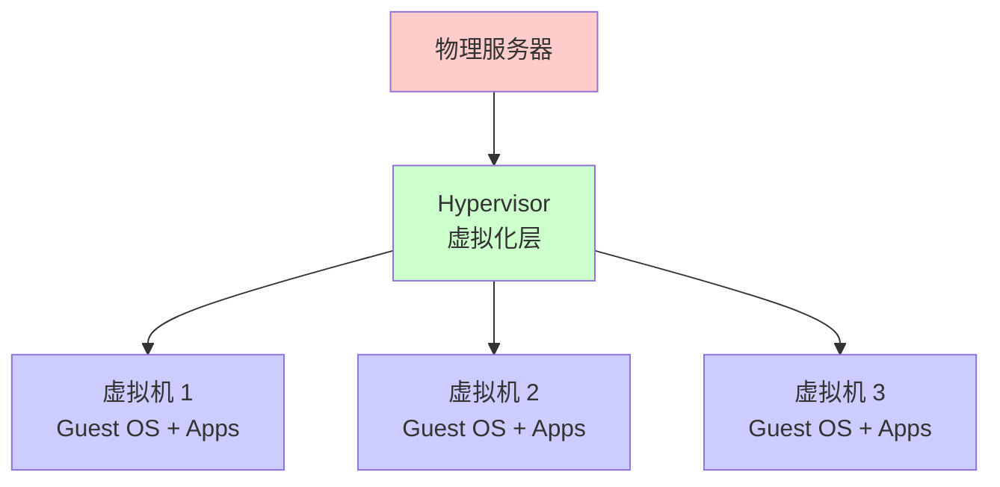

## 什么是容器化

容器化（Containerization）是一种轻量级的虚拟化技术，通过操作系统级别的虚拟化实现应用隔离，多个容器共享同一个操作系统内核。

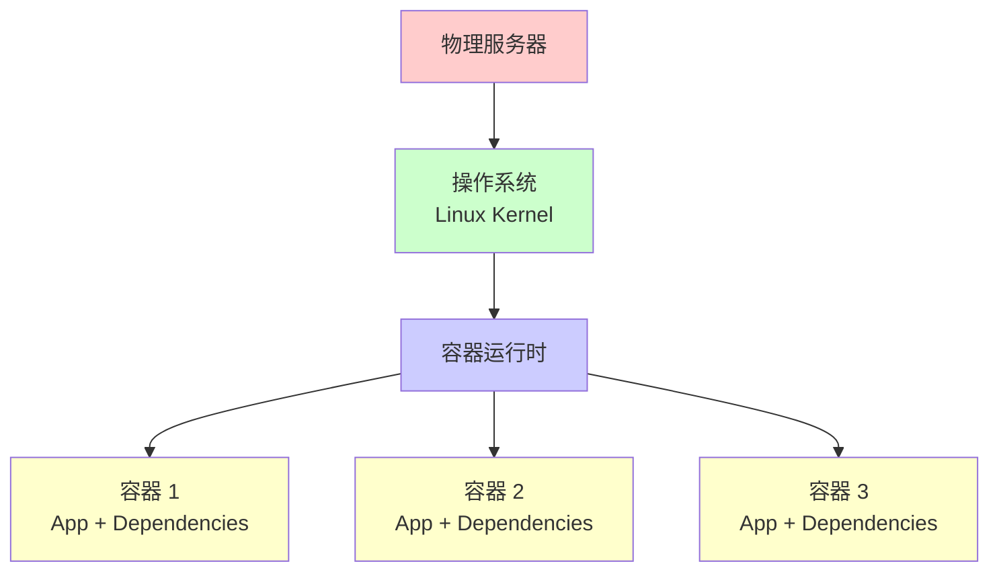

## 发展历程

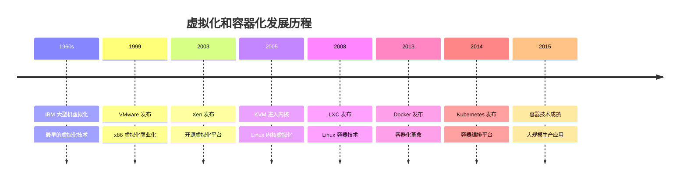

# 虚拟化技术

## 虚拟化类型

### 1. 全虚拟化（Full Virtualization）

全虚拟化在虚拟机和硬件之间添加一个虚拟化层（Hypervisor），完全模拟硬件环境。

**特点**：
- 无需修改 Guest OS
- 性能开销较大
- 兼容性好

**实现**：
- VMware ESXi
- KVM（使用 QEMU）
- VirtualBox

### 2. 半虚拟化（Paravirtualization）

半虚拟化需要修改 Guest OS，使其知道运行在虚拟环境中。

**特点**：
- 需要修改 Guest OS
- 性能开销较小
- 兼容性较差

**实现**：
- Xen（半虚拟化模式）
- 早期虚拟化方案

### 3. 硬件辅助虚拟化

利用 CPU 硬件特性（Intel VT-x、AMD-V）实现虚拟化。

**特点**：
- 硬件支持
- 性能好
- 现代虚拟化标准

**实现**：
- KVM（需要硬件支持）
- VMware（使用硬件加速）
- Hyper-V

## 虚拟化架构

### Type 1 Hypervisor（裸机虚拟化）

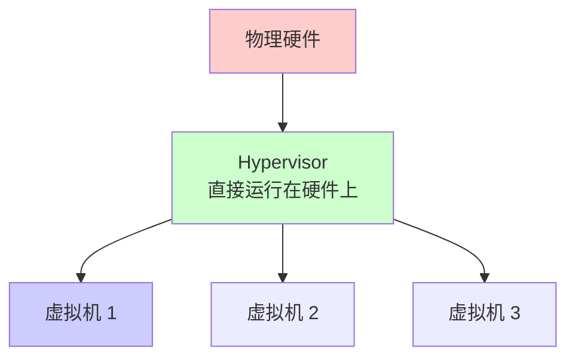

**特点**：
- 直接运行在硬件上
- 性能好
- 资源利用率高

**代表**：
- VMware ESXi
- Microsoft Hyper-V
- Citrix XenServer
- KVM（Linux 内核模块）

### Type 2 Hypervisor（宿主机虚拟化）

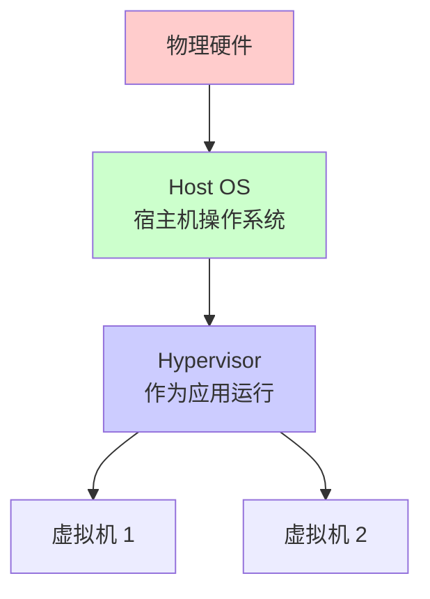

**特点**：
- 运行在操作系统之上
- 安装简单
- 性能略低

**代表**：
- VMware Workstation
- VirtualBox
- Parallels Desktop

## KVM（Kernel-based Virtual Machine）

KVM 是 Linux 内核的虚拟化模块，将 Linux 内核转换为 Hypervisor。

### KVM 架构

```mermaid
graph TB
    A[物理硬件] --> B[Linux Kernel<br/>KVM 模块]
    B --> C[QEMU<br/>用户空间]
    C --> D[虚拟机 1]
    C --> E[虚拟机 2]
    
    B --> F[/dev/kvm<br/>字符设备]
    C --> F
    
    style A fill:#ffcccc
    style B fill:#ccffcc
    style C fill:#ccccff
    style F fill:#ffffcc
```

### KVM 组件

1. **KVM 内核模块**：提供虚拟化能力
2. **QEMU**：用户空间模拟器
3. **libvirt**：虚拟化管理库

### KVM 使用示例

```bash
# 检查 CPU 虚拟化支持
egrep -c '(vmx|svm)' /proc/cpuinfo

# 安装 KVM
apt-get install qemu-kvm libvirt-daemon-system libvirt-clients bridge-utils

# 创建虚拟机
virt-install \
  --name ubuntu-vm \
  --ram 2048 \
  --disk path=/var/lib/libvirt/images/ubuntu-vm.qcow2,size=20 \
  --vcpus 2 \
  --os-type linux \
  --os-variant ubuntu20.04 \
  --network bridge=br0 \
  --graphics none \
  --console pty,target_type=serial \
  --location 'http://archive.ubuntu.com/ubuntu/dists/focal/main/installer-amd64/' \
  --extra-args 'console=ttyS0,115200n8 serial'
```

## QEMU

QEMU（Quick Emulator）是一个通用的开源机器模拟器和虚拟化器。

### QEMU 功能

- **系统模拟**：模拟完整的计算机系统
- **用户模式模拟**：运行不同架构的程序
- **虚拟化加速**：与 KVM 配合使用

### QEMU 使用示例

```bash
# 创建磁盘镜像
qemu-img create -f qcow2 ubuntu.img 20G

# 启动虚拟机
qemu-system-x86_64 \
  -enable-kvm \
  -m 2048 \
  -smp 2 \
  -hda ubuntu.img \
  -cdrom ubuntu-20.04.iso \
  -boot d \
  -netdev user,id=net0 \
  -device virtio-net,netdev=net0
```

## 其他虚拟化技术

### Xen

- **类型**：Type 1 Hypervisor
- **特点**：支持全虚拟化和半虚拟化
- **应用**：云计算平台

### Hyper-V

- **类型**：Type 1 Hypervisor
- **特点**：Windows 原生虚拟化
- **应用**：Windows 服务器虚拟化

### VMware

- **ESXi**：Type 1 Hypervisor
- **Workstation**：Type 2 Hypervisor
- **特点**：商业虚拟化解决方案

# 容器化技术

## 容器化概述

容器化是一种操作系统级别的虚拟化技术，通过共享操作系统内核实现应用隔离。

### 容器架构

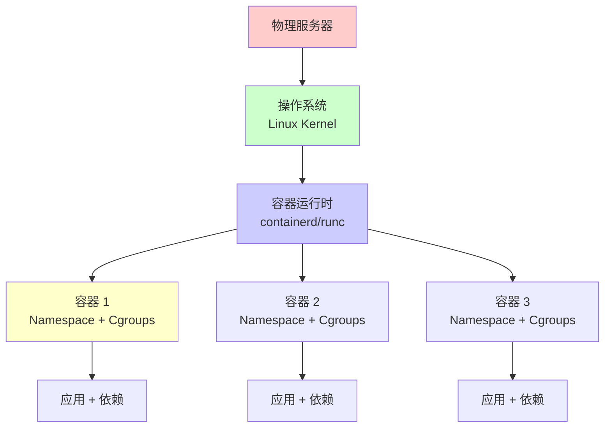

## Linux 容器技术

### LXC（Linux Containers）

LXC 是最早的 Linux 容器实现。

```bash
# 安装 LXC
apt-get install lxc

# 创建容器
lxc-create -t download -n mycontainer -- \
  --dist ubuntu --release focal --arch amd64

# 启动容器
lxc-start -n mycontainer

# 进入容器
lxc-attach -n mycontainer
```

### Docker

Docker 是最流行的容器化平台。

#### Docker 架构

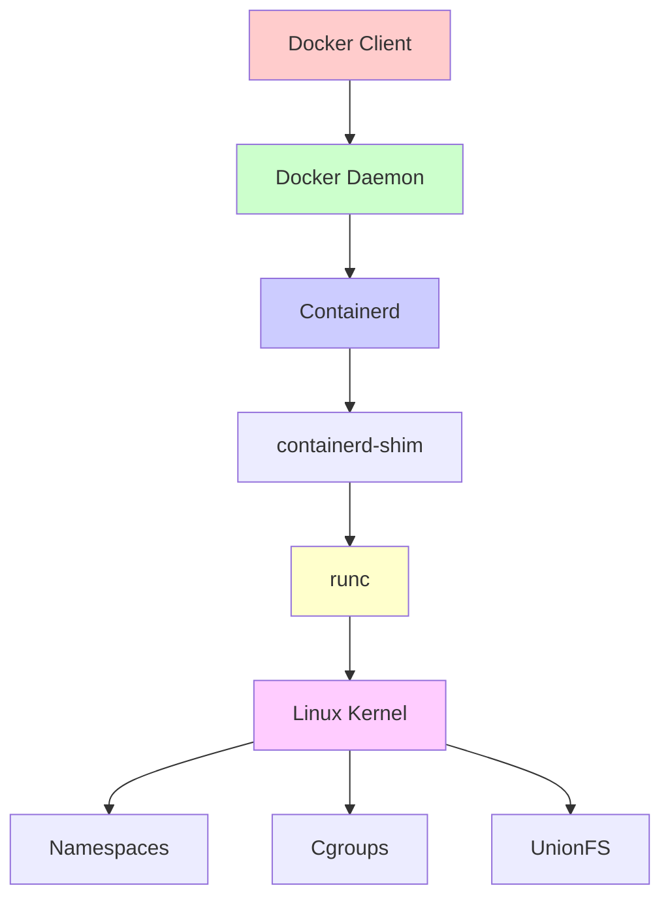

#### Docker 核心组件

1. **Namespace**：资源隔离
2. **Cgroups**：资源限制
3. **UnionFS**：镜像分层存储
4. **网络**：容器网络通信

#### Docker 使用示例

```bash
# 运行容器
docker run -d --name nginx -p 80:80 nginx

# 查看容器
docker ps

# 进入容器
docker exec -it nginx bash

# 构建镜像
docker build -t myapp:latest .

# 推送镜像
docker push myapp:latest
```

### Podman

Podman 是 Docker 的替代品，无需守护进程。

```bash
# 运行容器（无需守护进程）
podman run -d --name nginx -p 80:80 nginx

# 查看容器
podman ps

# 构建镜像
podman build -t myapp:latest .
```

## 容器运行时

### runc

runc 是 OCI（Open Container Initiative）标准的参考实现。

```bash
# 使用 runc 运行容器
runc create mycontainer
runc start mycontainer
runc list
```

### containerd

containerd 是容器运行时的高级接口。

```bash
# containerd 管理容器
ctr images pull docker.io/library/nginx:latest
ctr run docker.io/library/nginx:latest nginx
```

### CRI-O

CRI-O 是 Kubernetes 的容器运行时。

```bash
# CRI-O 管理容器
crictl pull nginx
crictl run nginx
```

# 虚拟化 vs 容器化

## 架构对比

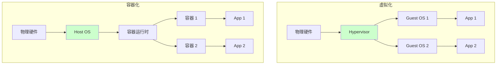

## 详细对比

| 特性 | 虚拟化 | 容器化 |
|------|--------|--------|
| **隔离级别** | 硬件级别 | 操作系统级别 |
| **资源开销** | 高（每个 VM 需要完整 OS） | 低（共享 OS 内核） |
| **启动时间** | 分钟级 | 秒级 |
| **性能** | 接近物理机（5-10% 开销） | 接近原生（1-3% 开销） |
| **可移植性** | 中等 | 高 |
| **安全性** | 高（完全隔离） | 中等（共享内核） |
| **适用场景** | 多 OS、强隔离 | 单 OS、轻量级隔离 |
| **镜像大小** | GB 级 | MB 级 |
| **密度** | 低（每台物理机 10-20 个 VM） | 高（每台物理机 100+ 容器） |

## 资源使用对比

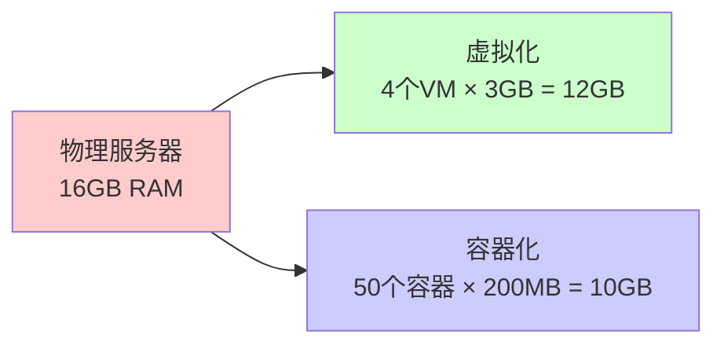

## 启动时间对比

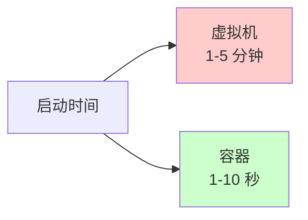

# 底层实现原理

## 虚拟化实现原理

### CPU 虚拟化

#### 1. 二进制翻译

- **原理**：将敏感指令翻译为安全指令
- **实现**：VMware（早期版本）
- **特点**：无需硬件支持，但性能较低

#### 2. 硬件辅助虚拟化

```bash
# 检查 CPU 虚拟化支持
# Intel
grep -E 'vmx' /proc/cpuinfo

# AMD
grep -E 'svm' /proc/cpuinfo
```

**原理**：
- CPU 提供虚拟化扩展（VT-x/AMD-V）
- 虚拟机直接运行在硬件上
- Hypervisor 通过 VMX root 模式管理

### 内存虚拟化

#### 1. 影子页表（Shadow Page Table）

- **原理**：为每个 VM 维护影子页表
- **特点**：性能开销大
- **应用**：早期虚拟化方案

#### 2. 扩展页表（EPT/NPT）

- **原理**：硬件支持二级地址转换
- **特点**：性能好，硬件加速
- **应用**：现代虚拟化方案

### I/O 虚拟化

#### 1. 全虚拟化 I/O

- **原理**：完全模拟硬件设备
- **特点**：兼容性好，性能较低
- **实现**：QEMU 模拟设备

#### 2. 半虚拟化 I/O

- **原理**：使用虚拟设备驱动（virtio）
- **特点**：性能好，需要 Guest OS 支持
- **实现**：virtio-net、virtio-blk

```bash
# 查看 virtio 设备
lsmod | grep virtio

# 输出示例
virtio_net             45056  0
virtio_blk             24576  2
virtio_pci             24576  0
virtio_ring            24576  2 virtio_net,virtio_blk
virtio                 16384  2 virtio_net,virtio_blk
```

## 容器化实现原理

### Namespace（命名空间）

Namespace 提供资源隔离。

#### PID Namespace

```bash
# 创建新的 PID Namespace
unshare --pid --fork bash

# 在新 Namespace 中查看进程
ps aux
# 只能看到 Namespace 内的进程
```

#### Network Namespace

```bash
# 创建网络 Namespace
ip netns add netns1

# 在 Namespace 中配置网络
ip netns exec netns1 ip addr add 10.0.0.1/24 dev lo
ip netns exec netns1 ip link set lo up
```

#### Mount Namespace

```bash
# 创建独立的文件系统视图
unshare --mount --fork bash

# 挂载文件系统（只影响当前 Namespace）
mount -t tmpfs tmpfs /tmp
```

### Cgroups（控制组）

Cgroups 提供资源限制。

#### CPU 限制

```bash
# 创建 Cgroup
mkdir /sys/fs/cgroup/cpu/mygroup

# 设置 CPU 限制（50%）
echo 50000 > /sys/fs/cgroup/cpu/mygroup/cpu.cfs_quota_us
echo 100000 > /sys/fs/cgroup/cpu/mygroup/cpu.cfs_period_us

# 将进程加入 Cgroup
echo $$ > /sys/fs/cgroup/cpu/mygroup/cgroup.procs
```

#### 内存限制

```bash
# 创建内存 Cgroup
mkdir /sys/fs/cgroup/memory/mygroup

# 设置内存限制（512MB）
echo 536870912 > /sys/fs/cgroup/memory/mygroup/memory.limit_in_bytes

# 将进程加入 Cgroup
echo $$ > /sys/fs/cgroup/memory/mygroup/cgroup.procs
```

### Union File System

UnionFS 实现镜像分层存储。

#### OverlayFS

```bash
# 创建 OverlayFS
mount -t overlay overlay \
  -o lowerdir=/lower,upperdir=/upper,workdir=/work \
  /merged

# 查看分层
ls /merged
```

#### 镜像分层示例

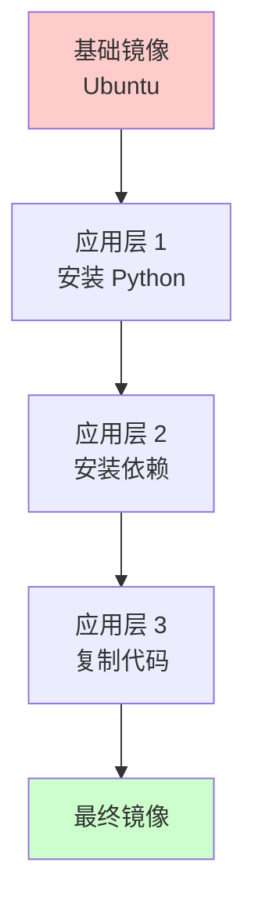

# 应用场景

## 虚拟化应用场景

### 1. 服务器虚拟化

- **场景**：将物理服务器虚拟化为多个虚拟机
- **优势**：提高资源利用率
- **工具**：VMware vSphere、KVM、Hyper-V

### 2. 桌面虚拟化

- **场景**：在单台机器上运行多个操作系统
- **优势**：开发测试、兼容性测试
- **工具**：VMware Workstation、VirtualBox

### 3. 云计算平台

- **场景**：IaaS 平台提供虚拟机服务
- **优势**：弹性伸缩、按需分配
- **平台**：AWS EC2、Azure VM、阿里云 ECS

### 4. 灾难恢复

- **场景**：虚拟机快照和迁移
- **优势**：快速恢复、业务连续性
- **工具**：VMware vMotion、KVM 迁移

## 容器化应用场景

### 1. 微服务架构

- **场景**：将应用拆分为多个微服务
- **优势**：独立部署、扩展
- **工具**：Docker、Kubernetes

### 2. CI/CD 流水线

- **场景**：构建、测试、部署自动化
- **优势**：环境一致性、快速部署
- **工具**：Jenkins、GitLab CI、GitHub Actions

### 3. 开发环境

- **场景**：本地开发环境隔离
- **优势**：环境一致性、快速启动
- **工具**：Docker Compose

### 4. 云原生应用

- **场景**：容器化应用部署到云平台
- **优势**：弹性伸缩、高可用
- **平台**：Kubernetes、Docker Swarm

## 混合使用场景

### 容器运行在虚拟机中

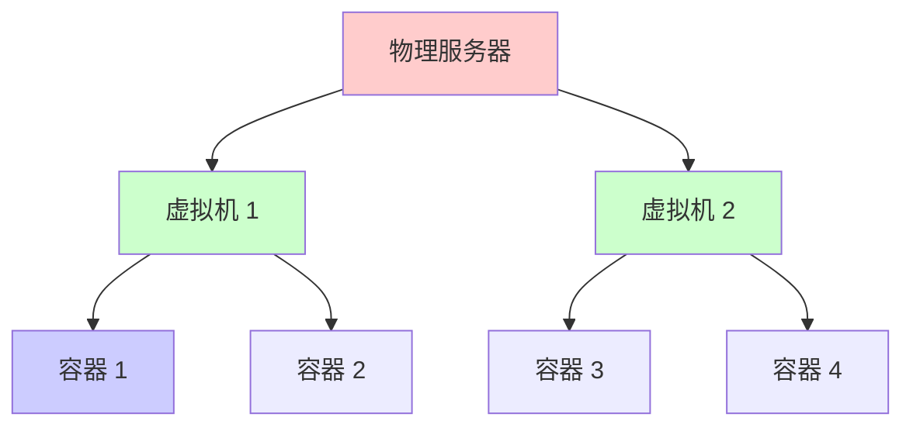

**场景**：
- 多租户隔离
- 安全隔离
- 混合工作负载

# 优缺点对比

## 虚拟化优缺点

### 优点

1. **完全隔离**：每个 VM 有独立的操作系统
2. **安全性高**：VM 之间完全隔离
3. **兼容性好**：可以运行不同操作系统
4. **成熟稳定**：技术成熟，生产环境验证

### 缺点

1. **资源开销大**：每个 VM 需要完整 OS
2. **启动慢**：需要启动完整操作系统
3. **密度低**：每台物理机 VM 数量有限
4. **管理复杂**：需要管理多个操作系统

## 容器化优缺点

### 优点

1. **轻量级**：共享操作系统内核
2. **启动快**：秒级启动
3. **密度高**：每台物理机可运行大量容器
4. **易于管理**：统一的操作系统
5. **可移植性好**：一次构建，到处运行

### 缺点

1. **隔离性较弱**：共享操作系统内核
2. **安全性较低**：内核漏洞影响所有容器
3. **操作系统限制**：容器必须与宿主机 OS 兼容
4. **调试复杂**：容器内调试相对困难

# 最佳实践

## 虚拟化最佳实践

### 1. 资源规划

```yaml
# 虚拟机资源规划示例
虚拟机类型: Web 服务器
  CPU: 2 cores
  内存: 4GB
  磁盘: 50GB SSD
  网络: 1Gbps

虚拟机类型: 数据库服务器
  CPU: 4 cores
  内存: 16GB
  磁盘: 500GB SSD
  网络: 10Gbps
```

### 2. 性能优化

- **使用硬件加速**：启用 VT-x/AMD-V
- **使用半虚拟化 I/O**：virtio 设备
- **合理分配资源**：避免过度分配
- **存储优化**：使用 SSD、RAID

### 3. 安全配置

- **网络隔离**：使用 VLAN、防火墙
- **访问控制**：限制管理接口访问
- **定期更新**：更新 Hypervisor 和 Guest OS
- **备份策略**：定期备份虚拟机

## 容器化最佳实践

### 1. 镜像优化

```dockerfile
# ❌ 不推荐：大镜像
FROM ubuntu:20.04
RUN apt-get update && apt-get install -y \
    python3 python3-pip git vim curl wget
COPY . /app
RUN pip3 install -r requirements.txt

# ✅ 推荐：多阶段构建，小镜像
FROM python:3.9-slim as builder
WORKDIR /app
COPY requirements.txt .
RUN pip install --user -r requirements.txt

FROM python:3.9-slim
WORKDIR /app
COPY --from=builder /root/.local /root/.local
COPY . .
ENV PATH=/root/.local/bin:$PATH
CMD ["python", "app.py"]
```

### 2. 资源限制

```yaml
# Docker Compose 资源限制
version: '3'
services:
  app:
    image: myapp:latest
    deploy:
      resources:
        limits:
          cpus: '1'
          memory: 512M
        reservations:
          cpus: '0.5'
          memory: 256M
```

### 3. 安全配置

- **非 root 用户**：容器内使用非 root 用户
- **只读文件系统**：使用只读根文件系统
- **最小权限**：只授予必要权限
- **镜像扫描**：扫描镜像漏洞

```dockerfile
# 使用非 root 用户
FROM node:16-alpine
RUN addgroup -g 1000 appuser && \
    adduser -D -u 1000 -G appuser appuser
USER appuser
WORKDIR /app
COPY . .
CMD ["node", "app.js"]
```

### 4. 健康检查

```dockerfile
# Dockerfile 健康检查
FROM nginx:alpine
HEALTHCHECK --interval=30s --timeout=3s \
  CMD curl -f http://localhost/ || exit 1
```

### 5. 日志管理

```yaml
# Docker Compose 日志配置
services:
  app:
    image: myapp:latest
    logging:
      driver: "json-file"
      options:
        max-size: "10m"
        max-file: "3"
```

## 选择建议

### 使用虚拟化

- ✅ 需要运行不同操作系统
- ✅ 需要强隔离（多租户、安全要求高）
- ✅ 遗留应用迁移
- ✅ 需要完整的操作系统环境

### 使用容器化

- ✅ 微服务架构
- ✅ 云原生应用
- ✅ 需要快速启动和扩展
- ✅ 开发测试环境
- ✅ CI/CD 流水线

### 混合使用

- ✅ 容器运行在虚拟机中
- ✅ 不同工作负载使用不同技术
- ✅ 逐步迁移策略

# 总结

虚拟化和容器化是两种互补的技术：

## 核心区别

1. **隔离级别**：虚拟化是硬件级别，容器化是操作系统级别
2. **资源开销**：虚拟化开销大，容器化开销小
3. **启动时间**：虚拟化分钟级，容器化秒级
4. **适用场景**：虚拟化适合多 OS、强隔离，容器化适合单 OS、轻量级隔离

## 技术选择

- **虚拟化**：多操作系统、强隔离、遗留应用
- **容器化**：微服务、云原生、快速部署
- **混合**：根据实际需求灵活选择

## 发展趋势

- **容器化**：云原生应用的主流选择
- **虚拟化**：仍然在特定场景中重要
- **融合**：两种技术相互融合，取长补短

理解虚拟化和容器化的原理和特点，能够根据实际需求选择合适的技术方案。

# 参考文献

- [KVM 官方文档](https://www.linux-kvm.org/page/Main_Page)
- [Docker 官方文档](https://docs.docker.com/)
- [Linux Namespaces](https://man7.org/linux/man-pages/man7/namespaces.7.html)
- [Linux Cgroups](https://www.kernel.org/doc/Documentation/cgroup-v1/cgroups.txt)
- [OCI 规范](https://opencontainers.org/)

