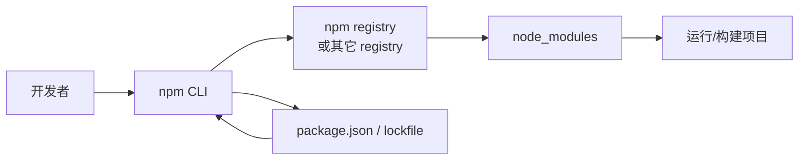

推荐阅读：[npm 官方文档](https://docs.npmjs.com/) | [npm 注册表](https://www.npmjs.com/)

# npm 是什么

**npm**（最初为 *Node Package Manager* 的缩写，现作为独立品牌保留该写法）有两层常见含义：

1. **命令行工具**：随 [Node.js](https://nodejs.org/) 一起安装的客户端，用于在项目中安装、升级、发布和管理 JavaScript 包。
2. **公共包注册表（registry）**：默认指向 `https://registry.npmjs.org/`，托管数百万个开源包，是前端与 Node 生态事实上的依赖分发中心。

日常说「用 npm 装依赖」，通常指使用 **npm CLI** 从 **npm registry**（或其它兼容源）拉取并解析依赖树。

## npm 在开发流程中的位置

# npm 能做什么

## 1. 管理项目依赖

- **`npm install`**：根据 `package.json` 安装依赖到 `node_modules`，并生成或更新锁定文件（如 `package-lock.json`），保证可重现安装。
- **`npm install <包名>`**：将指定包写入 `dependencies` 或 `devDependencies`（可用 `--save-dev` 等选项区分开发与生产依赖）。
- **`npm update` / `npm uninstall`**：升级或移除依赖。

依赖版本遵循 [语义化版本（SemVer）](https://semver.org/lang/zh-CN/)（如 `^1.2.0`、`~1.2.0`），便于表达兼容范围。

## 2. 定义与运行脚本

在 `package.json` 的 **`scripts`** 字段中定义命令，通过 **`npm run <脚本名>`** 执行，例如启动开发服务器、运行测试、构建产物、代码检查等。这样可以把复杂命令固化成团队一致的入口，并与 CI 对齐。

## 3. 发布与共享包

登录 npm 账号后，使用 **`npm publish`** 可将当前包发布到 registry，供他人在项目中 `npm install` 使用。配合 **`npm version`** 可管理包版本号。组织或团队常使用 **scope**（如 `@your-org/pkg`）管理私有或命名空间包。

## 4. 临时执行包里的可执行文件（npx）

**`npx`**（npm 5.2+ 自带）可在**不全局安装**的情况下运行指定包提供的 CLI，适合脚手架（如 `npx create-vite@latest`）、一次性工具或试用某版本的可执行文件。

## 5. 其它常用能力（简要）

| 能力 | 说明 |
| --- | --- |
| **`npm audit`** | 检查已知安全漏洞，并提示修复方式 |
| **`npm ci`** | 在 CI 场景中严格按 lockfile 安装，适合可重复构建 |
| **`npm cache`** | 管理本地缓存，加速重复安装 |
| **配置 registry** | 切换镜像或私有源（如企业内网 registry） |

## 小结

**npm** 是 Node/JavaScript 生态里的**包管理与脚本编排**核心工具：从 **安装依赖、锁定版本、运行脚本**，到 **发布包、用 npx 跑 CLI**，都围绕同一套 `package.json` 与 registry 模型工作。理解 npm 有助于阅读任意现代前端或 Node 项目的工程化配置。
