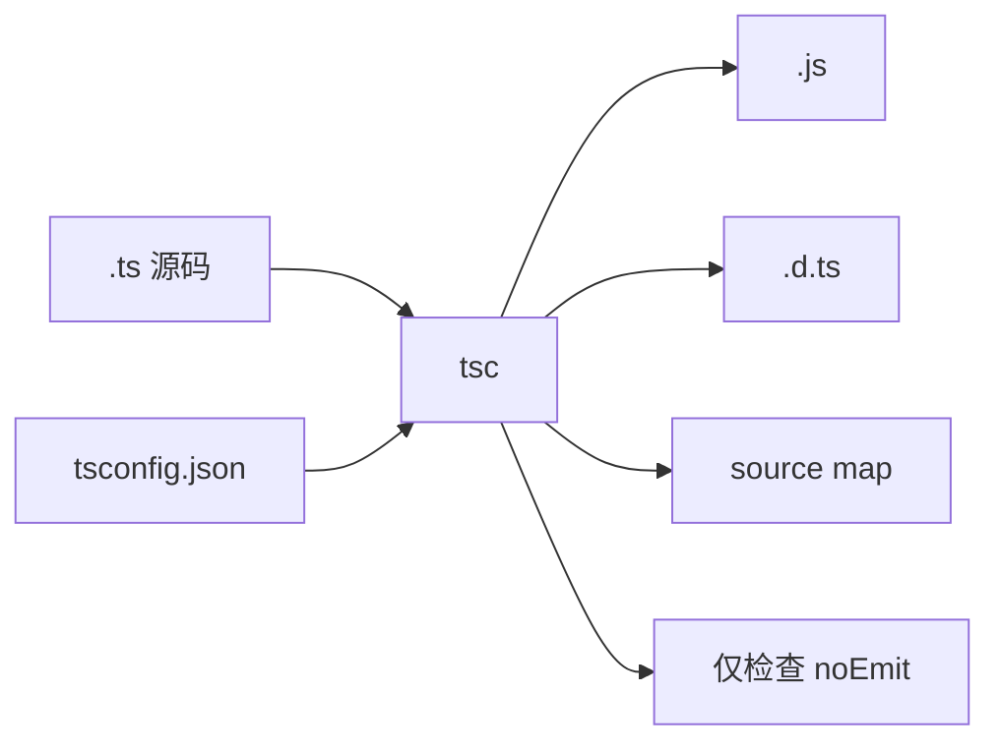

推荐阅读：[Compiler Options](https://www.typescriptlang.org/docs/handbook/compiler-options.html) | [tsconfig.json 参考](https://www.typescriptlang.org/tsconfig/)

# tsc 是什么

**`tsc`**（TypeScript Compiler）会：

1. **类型检查**：按 `compilerOptions`（及引用的类型声明）分析项目，报错或通过。
2. **可选转译**：把 `.ts` / `.tsx` 写成 `.js`，并可生成 `.d.ts`、source map 等。

项目里通常把 **`typescript`** 放在 **`devDependencies`**，用 **`npx tsc`** 调用，保证人人使用同一编译器版本。全局安装的 `tsc` 容易造成与仓库版本不一致，不推荐单独依赖。

## 在工具链中的位置



打包器（Vite / Webpack / esbuild 等）多负责**转译与分包**，**不一定**做与 `tsc` 等价的完整类型检查。常见做法是：**打包出产物 + `tsc --noEmit` 单独守门**。

# tsconfig.json：tsc 和 IDE 共同读的配置

**`tsconfig.json`**（实际常用 **JSON with Comments**，即带注释的 JSON）是 TypeScript 项目的**根配置**。**`tsc`** 与 VS Code 等编辑器里的语言服务都会按同一套文件解析**编译范围**与 **`compilerOptions`**，因此把它放进仓库并提交，才能保证「命令行、CI、本机提示」一致。

## 顶层常用字段

| 字段 | 作用 |
| --- | --- |
| **`compilerOptions`** | 目标语言版本、模块格式、是否严格、路径别名等——**对 `tsc` 行为影响最大**。 |
| **`include` / `exclude`** | 用 glob 指定纳入或排除的文件（如 `src/**/*`、排除 `node_modules`）。 |
| **`files`** | 显式文件列表；小项目或特殊入口时使用。 |
| **`extends`** | 继承另一份 JSON（团队基线、`@tsconfig/node20` 等），当前文件中的同名项**覆盖**父配置。 |
| **`references`** | **工程引用**：指向其它子项目的 `tsconfig`，供 **`tsc -b`** 按依赖顺序构建（常与 monorepo 配合）。 |

若根配置里是 **`"files": []`** 且只填 **`references`**，多表示这是**解决方案根**，真正编译在各子包自己的 `tsconfig` 里完成。

## compilerOptions 速览（按主题）

具体取值与默认值以当前 TypeScript 版本的 [tsconfig 参考](https://www.typescriptlang.org/tsconfig/) 为准。

**输出与产物**

- **`target`**：生成 JS 的 ECMAScript 版本（如 `ES2020`）。  
- **`module`**：模块格式（`commonjs`、`ESNext`、`NodeNext` 等），需与运行环境或打包器约定一致。  
- **`lib`**：类型系统里包含哪些内置 API（如 `DOM`）；不写时部分选项会随 `target` 推断。  
- **`outDir` / `rootDir`**：输出目录与源码根；仅用 `noEmit` 做检查时仍可用来对齐路径理解。  
- **`declaration` / `declarationMap`**：是否生成 **`.d.ts`**（及映射），**发 npm 库**时常开。  
- **`sourceMap`**：是否生成 source map，便于调试与错误栈映射。

**模块解析**

- **`moduleResolution`**：如何解析 `import`（如 `bundler`、`node16` / `nodenext`）。需与 **`module`**、是否 ESM 对齐。  
- **`baseUrl` + `paths`**：路径别名（如 `@/app/*`）。**注意**：这只解决 **TS/IDE 的解析与类型**；Webpack `resolve.alias`、Vite `resolve.alias` 等仍需单独配置，否则运行或打包阶段可能找不到文件。  
- **`resolveJsonModule`**：允许 `import` JSON 并得到类型。

**类型严格度**

- **`strict`**：一键开启严格族开关，**新项目建议默认打开**。  
- 子项如 **`strictNullChecks`**、**`noImplicitAny`** 可按迁移节奏逐项开启。  
- **`skipLibCheck`**：跳过对声明文件（`.d.ts`）的完整检查，**编译更快**，但可能掩盖依赖里的类型问题。

**与 JS / JSX 互操作**

- **`esModuleInterop`**：改善 CJS 默认导出与 `import` 的互操作，现代项目多为 `true`。  
- **`allowJs` / `checkJs`**：把 `.js` 纳入编译或检查，适合渐进迁移。  
- **`jsx`**：JSX 的编译方式（如 `react-jsx`、`preserve`）。

**其它高频项**

- **`isolatedModules`**：保证每个文件可被**单独转译**（与 Babel、esbuild 等一致），避免不支持的语法。  
- **`noEmit`**：只检查、**不写磁盘产物**——与命令行 **`tsc --noEmit`** 目的一致，也可写在配置里省去每次敲参数（团队常在 CI 脚本里仍显式写 `--noEmit` 以免被本地配置误改）。  
- **`types`**：限制自动纳入的 **`@types/*`**，避免全局类型污染。

## 继承与多配置文件

用 **`extends`** 抽公共选项，业务里只写差异：

```json
{
  "extends": "./tsconfig.base.json",
  "compilerOptions": {
    "outDir": "dist"
  },
  "include": ["src"]
}
```

复杂项目常见 **`tsconfig.json`**（应用源码）+ **`tsconfig.node.json`**（仅 `vite.config.ts` 等 Node 脚本），通过 **`-p`** 分别指定，避免把 Node 全局混进浏览器 `lib`。

## 与本文其它章节的关系

- **「如何选定要编译的工程」**：决定 **`tsc` 读哪一份 `tsconfig`、哪些文件算在工程里**。  
- **「`tsc -b`」与 `references`**：`tsconfig` 里声明子项目引用，命令行用 **`-b`** 驱动多包顺序与增量构建。  
- 更宏观的前端分工（npm、Webpack 与 tsc 如何串联）可见本站《前端项目里编译 TypeScript：npm、tsc、Webpack 各做什么》一文。

# 如何选定要编译的工程

- **默认**：从当前目录**向上**查找 **`tsconfig.json`**，用其中的 `include` / `exclude` / `files` 决定范围。
- **`-p` / `--project`**：指定目录或配置文件，例如 `tsc -p packages/app` 或 `tsc -p tsconfig.build.json`。
- **直接跟文件**：`tsc a.ts` 属于简化用法，**正式项目应以 `tsconfig` 为准**，否则易与 IDE、CI 行为不一致。

# 值得记住的 CLI 选项

命令行标志会参与最终生效配置；与 `compilerOptions` **同名**的项往往可覆盖配置文件，细节以当前 TypeScript 版本文档为准。

| 选项 | 作用 |
| --- | --- |
| **`--noEmit`** | 只做类型检查，**不写** `.js` 等产物；与打包器配合时极其常用。 |
| **`--watch` / `-w`** | 监听文件变更并增量重编译。 |
| **`--build` / `-b`** | **工程引用**模式：按 `references` 顺序构建多包，支持增量（需子项目 `composite` 等配置）。 |
| **`--showConfig`** | 打印合并 `extends` 后的完整配置，排错首选。 |
| **`--pretty`** | 更易读的错误输出（多数环境已友好）。 |
| **`--incremental`** | 写入/读取 `.tsbuildinfo`，加快后续完整编译（也可写在 `tsconfig` 里）。 |

**`tsc --init`**：在当前目录生成带注释的 `tsconfig.json` 模板，适合新项目起步。

# 典型用法

**CI 与本地类型门禁：**

```bash
npx tsc --noEmit
```

可在 `package.json` 中设 **`"typecheck": "tsc --noEmit"`**，与 **`build`** 串行或并行。

**库：产出 JS 与声明文件：** 在 `tsconfig` 中开启 `declaration`、`outDir` 等后执行：

```bash
npx tsc -p tsconfig.build.json
```

**Monorepo：** 根 `tsconfig` 配置 `references` 后：

```bash
npx tsc -b
```

详见 [Project References](https://www.typescriptlang.org/docs/handbook/project-references.html)。

# 与打包器怎么配合（简表）

| 目标 | 常见做法 |
| --- | --- |
| IDE 提示与跳转 | 依赖 **`tsconfig.json`**（及类型声明） |
| 禁止「能打包但类型已坏」 | **`tsc --noEmit`**（或 `-b` 在引用工程里） |
| 分包、资源、HMR | Webpack / Vite 等 + 其 TS 处理 |

# 常见问题（简要）

- **找不到 `tsc`**：确认已安装 **`typescript`**，使用 **`npx tsc`**。  
- **本地过、CI 挂**：对齐 **Node、`typescript` 版本**和 **`tsc -p`** 是否指向同一配置文件。  
- **不确定最终生效选项**：执行 **`tsc --showConfig`**。

---

**小结**：**`tsc`** 是 TypeScript 的**官方编译入口**——在 **`tsconfig`** 规则下做类型检查，并按需输出 JS/声明/map。现代前端常在打包之外单独跑 **`tsc --noEmit`**；发 npm 包与 monorepo 则大量使用 **`tsc`** 生成声明文件及 **`tsc -b`** 构建。
