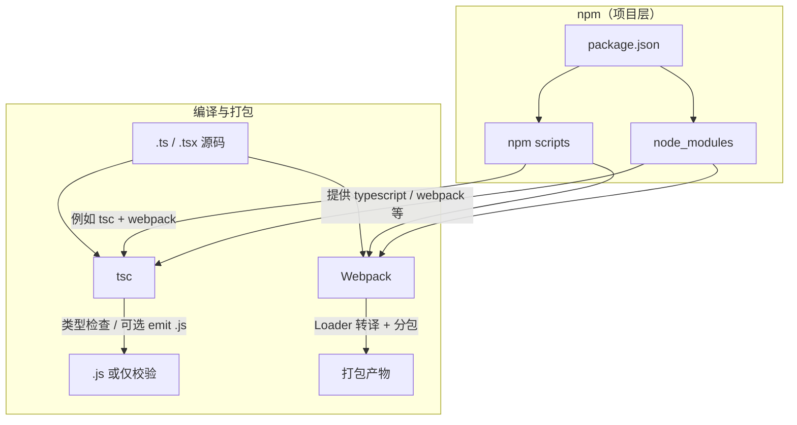

推荐阅读：[TypeScript 手册](https://www.typescriptlang.org/docs/) | [Webpack TS 指南](https://webpack.js.org/guides/typescript/)（本站前端分类下另有 **tsc**、**Webpack**、**npm** 专题，可对照阅读）

在典型前端工程里，「编译 `.ts` 文件」往往不只靠一个程序完成：**谁装工具、谁做类型检查、谁把模块打成浏览器能用的包**，常常分别由 **npm**、**tsc**、**Webpack**（或其它打包器）分担。下面按职责拆开说明，并说明它们如何拼在一起。

# 三者分别是什么角色

| 工具 | 本质 | 在「TS 编译」里最常扮演的角色 |
|------|------|------------------------------|
| **npm** | 包管理与脚本调度 | 安装 `typescript`、`webpack`、`ts-loader` 等；用 **`npm scripts`** 串联 `tsc`、`webpack` 等命令 |
| **tsc** | TypeScript 官方编译器 CLI | **类型检查**；可选把 `.ts` **转译成 `.js`**（或仅 `noEmit` 只做检查） |
| **Webpack** | 模块打包器 | 从入口解析依赖图，经 **Loader**（如 `ts-loader`、`babel-loader`）把 TS/TSX **转译并打包**成 chunk；**不替代**完整的类型检查策略 |

一句话：**npm 管「人和脚本的入口」；tsc 管「TypeScript 语言本身对不对」；Webpack 管「模块怎么连成可以给浏览器用的文件」。**

# 协作关系（概念图）

实际项目里，**「tsc 出码」和「Webpack 再打包」**可能只选一种路径负责**转译**，也可能 **tsc 只检查、Webpack 专职打包**——见下文。

# tsc 与 Webpack 的产物分别是什么

二者都可能参与「把 TS 变成 JS」，但**落盘的形态和用途**不同：tsc 偏向**按模块一一对应的编译输出**（或根本不写文件）；Webpack 偏向**面向运行时的打包结果**（多文件合成、带 hash、可拆分）。

## tsc 的产物

在 **`noEmit: false`**（默认）且通过检查的前提下，`tsc` 会按 `tsconfig.json` 把结果写到磁盘，常见包括：

| 产物 | 说明 |
|------|------|
| **`.js`** | 与 `include` 范围内的 `.ts` / `.tsx` 对应（目标语法由 `target`、`module` 等决定）；输出目录常用 **`outDir`** 控制。 |
| **`.d.ts`** | 类型声明文件；需在 `declaration`（或 `composite` 等）开启时生成，常见于**库**对外暴露类型。 |
| **`*.js.map`** | Source map；需 **`sourceMap`**（或 `inlineSourceMap`）为 `true`，便于调试对应回 TS 源码。 |
| **`.tsbuildinfo`** | 增量编译缓存；在 **`incremental`** 为 `true` 时写入，加速下一次 `tsc`，不是给业务直接引用的运行时代码。 |

若使用 **`tsc --noEmit`** 或配置 **`noEmit: true`**，则**不写上述文件**（除 `.tsbuildinfo` 在部分增量场景仍可能出现，以实际配置为准）；**「产物」只剩下终端里的诊断信息**——通过则无输出文件，失败则报错退出，适合做 CI 类型守门。

**小结**：tsc 的典型产物是 **与源码结构对应的 `.js`（及可选的 `.d.ts`、source map）**；在 `noEmit` 模式下**没有给浏览器直接用的打包文件**，只有检查结果。

## Webpack 的产物

Webpack 的产物由 **`output.path`**、**`output.filename`**（及 `chunkFilename` 等）决定，是**一次构建在输出目录里生成的静态文件集合**，例如：

| 产物 | 说明 |
|------|------|
| **JavaScript bundle / chunk** | 入口对应的 `main.js`、按 **`import()`** 拆出的异步 chunk、或用 **`SplitChunksPlugin`** 抽的 **`vendor`** 等；生产环境常见带 **content hash** 的文件名（如 `app.[contenthash].js`），利于缓存。 |
| **样式文件** | 若使用 **`MiniCssExtractPlugin`** 等，会额外生成 **`.css`**（或按入口/chunk 多个 CSS 文件），而不是只靠 JS 内联。 |
| **静态资源** | 图片、字体等经 **`asset`**、`file-loader` 等处理后的拷贝文件，或内联进 bundle，取决于规则。 |
| **辅助文件** | 如 **`index.html`**（**`HtmlWebpackPlugin`** 生成并注入 script/link）、个别插件生成的 manifest、license 文件等。 |

开发时若使用 **`webpack-dev-server`**，多数 bundle **驻留在内存**，磁盘上可能看不到完整产物，但**语义上**仍是「可被浏览器加载的一份或多份打包后的 JS（及关联资源）」。

**小结**：Webpack 的产物是**面向部署或本地预览的一整套静态资源**——核心是 **chunk 化的 JS（及可选 CSS、媒体文件、HTML）**；目录结构通常**不再与源码一对一**，而是以 **entry 与拆包策略** 为准。

**对比记忆**：tsc 像 **「按文件编译出 JS/类型声明」**；Webpack 像 **「按依赖图揉成团、再按需撕开几包」**。前端 SPA 上线给人看的，一般是 **Webpack（或同类打包器）那一侧的产物**；tsc 的 `.js` 有时是中间层或直接给 Node/库消费。

## 「tsc 打的包」和「Webpack 打的包」有何区别

口语里两种都说「打包」，但 **tsc 并不会做 Webpack 意义上的「打成一个（或几个）bundle」**：它做的是 **按文件把 TS 变成 JS（及声明等）**；Webpack 做的是 **按入口与依赖图把许多模块（含资源）合成可交付的静态资源**。下面用一张表把常见差异收拢；**`noEmit` 时 tsc 侧可以根本没有磁盘上的「包」**，只有类型检查结果。

| 维度 | tsc 侧（编译 emit） | Webpack 侧（打包 bundle） |
|------|---------------------|---------------------------|
| **典型产出长什么样** | **与源码目录大致一一对应的许多 `.js`**（如 `src/a.ts` → `dist/a.js`），外加可选 `.d.ts`、`.js.map` 等。 | **少量「胖」文件**：入口对应的主 bundle、异步 chunk、`vendor` 等，内部已合并多个模块；常带 **`[contenthash]`** 文件名。 |
| **算不算「整站能直接丢 CDN」** | **多数 SPA 不算**。多文件如何被浏览器按顺序/`type="module"` 拉起来，要看 `module`、`paths` 以及是否仍有裸Specifier；往往**还要**再经打包器或特定宿主约定。 | **配置到位时就是部署物**：`output` 下的 JS/CSS/静态资源（及常见 **`index.html`**）可直接用于静态托管（具体依赖 `publicPath` 等）。 |
| **非 TS 资源** | **不参与**：样式、图片、字体等不会经由 tsc「打进」某一份 JS。 | **参与依赖图**：经 Loader / Asset 规则变成可 `import` 的模块或独立文件。 |
| **拆包与缓存策略** | **不处理**运行时懒加载、公共依赖抽取、文件级 hash；没有 `import()` 异步 chunk 这类产物语义。 | **常规能力**：`import()` 拆 chunk、`splitChunks`、生产模式压缩与 tree shaking 等，服务于**首屏与缓存**。 |
| **和类型检查的关系** | **`tsc` 本职包含类型检查**；emit 与检查共用 `tsconfig`。 | Loader 多转译**类型擦除**后的代码；**完整类型检查**通常仍靠单独跑 **`tsc --noEmit`** 等。 |

一句话：**tsc 的「包」≈ 语言编译后的多文件 JS（+ 类型产物）**；**Webpack 的「包」≈ 面向浏览器（或指定 `target`）的应用级资源整合物**。库作者、Node 服务可以只 publish **`tsc` emit**；带大量静态资源、要拆包缓存的 **浏览器 SPA**，通常以 **Webpack（或同类工具）产物**作为用户实际加载的「包」。

# npm 起到什么作用

1. **声明依赖**：在 `package.json` 的 `devDependencies` 里放上 `typescript`、`webpack`、`ts-loader`（或 `@babel/core` + `babel-loader` + `@babel/preset-typescript`）等，版本由锁文件固定。
2. **统一入口**：通过 `scripts` 把复杂命令记下来，例如：
   - `"typecheck": "tsc --noEmit"`
   - `"build": "webpack --mode production"`
   - CI 里先跑 `typecheck` 再跑 `build`，避免「能打包但类型全错」上线。
3. **本地调用**：习惯用 `npx tsc`、`npx webpack` 或 `npm run xxx`，保证用的是**当前项目** `node_modules` 里的版本，而不是机器上全局装的老版本。

**npm 本身不解析 TypeScript 语法**；它只是让正确的工具以可复现的方式被安装和执行。

# tsc 起到什么作用

1. **类型检查**：按 `tsconfig.json` 的 `compilerOptions`、`include` 等，对工程做完整类型分析；`tsc --noEmit` 常用于**只检查、不写磁盘**，与 Webpack 并行使用很普遍。
2. **转译（可选）**：`tsc` 可以把 `.ts` 编成 `.js`（及 `.d.ts`、source map 等）。若启用 **`noEmit: true`**，则 tsc 在脚本里**只当守门员**，不负责产出给浏览器直接引用的最终包。
3. **与打包器的关系**：
   - **Webpack 内的 Loader** 往往调用 **单文件**层面的 TS/Babel 转译，**不保证**与你在 CI 里跑的 `tsc --noEmit` 范围、配置完全一致——所以许多团队仍保留 **单独跑 tsc**。
   - 少数方案会让 **tsc 先 emit**，再由 Webpack 只打已经生成的 JS；此时 tsc 既检查又出码，Webpack 更偏「资源与分包」。

**记住**：浏览器和多数运行时执行的是 **JavaScript**；tsc 的任务是**在类型系统约束下**，把 TS 合规地变成 JS（或告诉你哪里不合规）。

# Webpack 起到什么作用

1. **模块图与打包**：从 `entry` 开始解析 `import`/`require`，把许多 TS/JS/CSS/静态资源按配置合成 **bundle** 或 **code-split 的 chunk**。
2. **TS 转译入口**：常见做法是用 **`ts-loader`**（内部可配合 `transpileOnly` 提速，类型交给 IDE/tsc），或 **`babel-loader` + `@babel/preset-typescript`**（Babel 默认不做完整类型检查）。无论哪种，**真正把 TS 语法变成 ES5/ES20xx 给打包管线用的**，通常在这一环。
3. **工程能力**：代码拆分、注入环境变量、压缩、抽离 CSS、开发服务器与 HMR 等，这些是 **tsc 不会做** 的事。

**Webpack 不是 TypeScript 的「官方类型检查器」**；若在构建里关掉严格检查以换速度，就更要在流水线里用 **tsc**（或其它类型检查工具）补上。

# 常见组合方式（便于对照自己的项目）

1. **`tsc --noEmit` + Webpack 打包**  
   - 类型：`tsc` 全量检查。  
   - 产物：Webpack + Loader 负责转译与打包。  
   - 适合多数中大型前端应用。

2. **仅 `tsc` emit，Webpack 只处理已生成的 JS**  
   - 职责清晰，但两套输出路径要配置好，不如第一种常见。

3. **无 Webpack，仅用 `tsc` + 简单拷贝**  
   - 库项目或 Node 服务常见；浏览器 SPA 一般仍要打包器处理拆包与资源。

# 小结

- **npm**：安装依赖、用 **scripts** 把 `tsc` 与 `webpack`（及 `dev`/`build`）串成团队统一的工作流。  
- **tsc**：面向 **整个工程** 的 **TypeScript 类型与编译规则**；常被单独拉出来做 CI 检查，也可负责 emit。其**产物**多为与源码对应的 **`.js` / `.d.ts` / source map**（或 **`noEmit`** 下不写文件）；口语里的「包」更像**多文件编译结果**，一般不等同于 SPA 的整站 bundle。  
- **Webpack**：面向 **依赖图与浏览器交付** 的 **打包与资源管线**；其中的 Loader 负责把 TS **转译进 bundle**，但不等于可以省略 **`tsc` 类型检查**（除非你有等价策略且明确接受风险）。其**产物**是 **`output` 下的 bundle/chunk、CSS、静态资源、HTML 等**，口语里的「包」常指**可部署的一整份前端资源**。

三者叠加，才构成「能类型安全、能模块拆分、能一键构建」的前端 TS 工程；单独强调某一个都会漏掉另外两层的责任边界。
