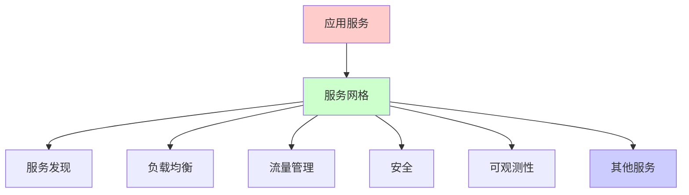
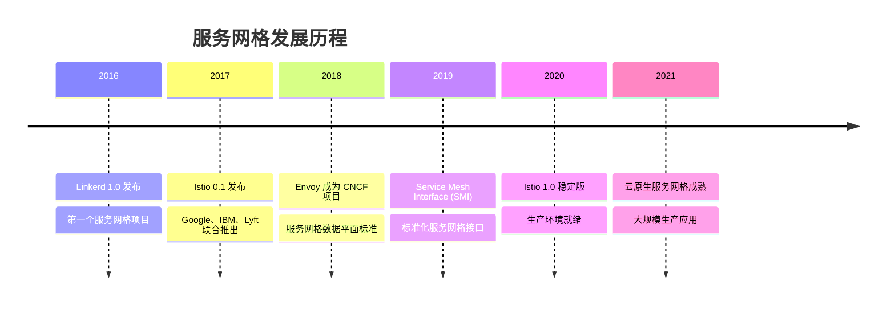
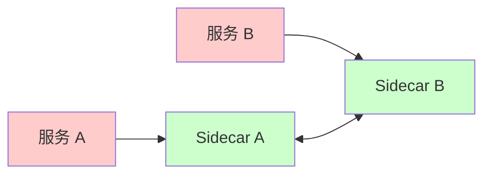
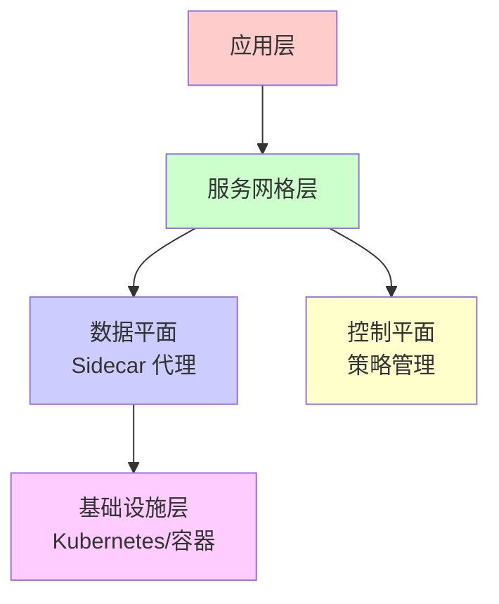
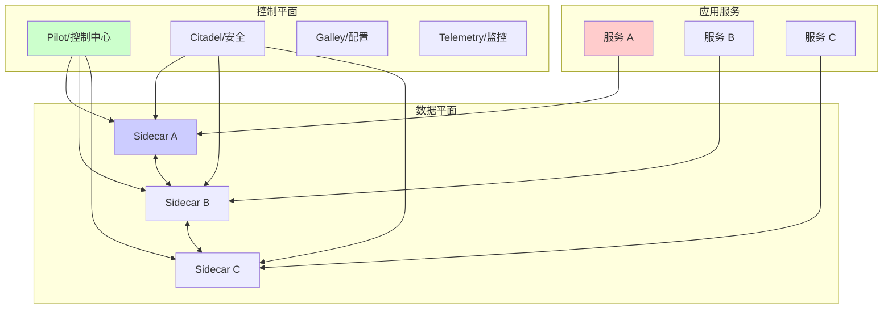
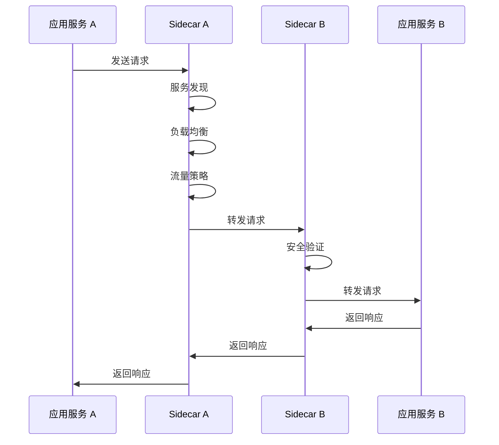
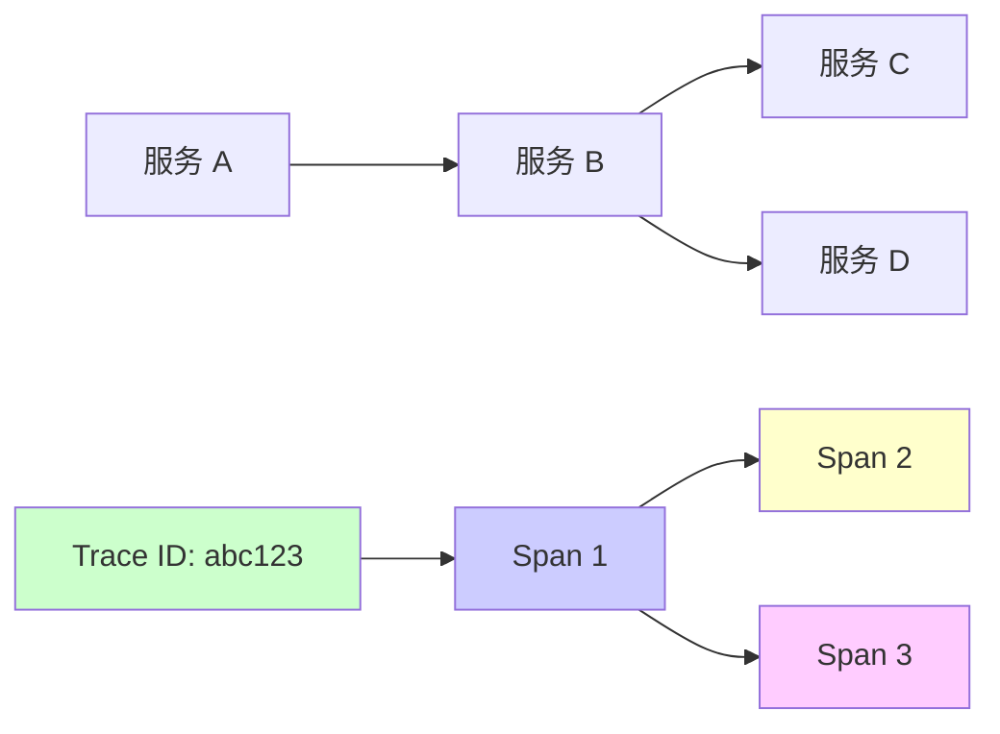

# 服务网格（Service Mesh）详解

服务网格（Service Mesh）是微服务架构中的基础设施层，用于处理服务间通信。它通过将服务间通信的复杂性从业务代码中分离出来，实现了服务治理的统一管理。

## 目录

- [服务网格概述](#服务网格概述)
- [核心概念](#核心概念)
- [架构设计](#架构设计)
- [主要功能](#主要功能)
- [主流实现](#主流实现)
- [使用场景](#使用场景)
- [优缺点分析](#优缺点分析)
- [最佳实践](#最佳实践)

# 服务网格概述

## 什么是服务网格

服务网格是一个专门用于处理服务间通信的基础设施层，它提供了一种统一的方式来管理微服务之间的网络通信，包括服务发现、负载均衡、流量管理、安全、可观测性等功能。



## 设计理念

服务网格遵循以下设计理念：

1. **关注点分离**：将服务间通信逻辑从业务代码中分离
2. **透明代理**：通过 Sidecar 模式实现透明的服务间通信
3. **统一管理**：通过控制平面统一管理所有服务间通信策略
4. **语言无关**：支持多种编程语言，无需修改业务代码

## 发展历程



# 核心概念

## Sidecar 模式

Sidecar 是服务网格的核心模式，每个服务实例都伴随一个 Sidecar 代理。



### Sidecar 特点

- **透明代理**：服务间的所有通信都通过 Sidecar
- **独立部署**：Sidecar 与业务服务独立部署
- **语言无关**：支持任何编程语言的服务
- **统一管理**：所有 Sidecar 由控制平面统一管理

## 数据平面（Data Plane）

数据平面由所有 Sidecar 代理组成，负责实际的数据转发和处理。

### 数据平面职责

- **流量转发**：转发服务间的请求和响应
- **服务发现**：发现和连接目标服务
- **负载均衡**：在多个服务实例间分配流量
- **健康检查**：检查服务实例的健康状态
- **流量策略执行**：执行路由、限流、熔断等策略

## 控制平面（Control Plane）

控制平面负责管理和配置数据平面，提供统一的策略管理。

### 控制平面职责

- **配置管理**：管理所有 Sidecar 的配置
- **策略定义**：定义流量管理、安全等策略
- **服务注册**：管理服务注册和发现
- **证书管理**：管理服务间的 TLS 证书
- **监控数据收集**：收集和聚合监控数据

## 架构层次



# 架构设计

## 整体架构



## Sidecar 注入方式

### 自动注入

```yaml
# 通过 MutatingWebhook 自动注入
apiVersion: v1
kind: Namespace
metadata:
  name: production
  labels:
    istio-injection: enabled  # 启用自动注入
```

### 手动注入

```bash
# 使用 istioctl 手动注入
istioctl kube-inject -f deployment.yaml | kubectl apply -f -
```

## 流量路径



# 主要功能

## 1. 服务发现

服务网格自动发现和管理服务实例。

### 服务注册

```yaml
# Kubernetes Service
apiVersion: v1
kind: Service
metadata:
  name: user-service
spec:
  selector:
    app: user-service
  ports:
  - port: 80
    targetPort: 8080
```

### 自动发现

- **Kubernetes**：自动发现 Service 和 Endpoint
- **Consul**：集成 Consul 服务注册中心
- **Eureka**：集成 Eureka 服务注册中心

## 2. 负载均衡

提供多种负载均衡算法。

### 负载均衡算法

- **轮询（Round Robin）**：依次分配请求
- **最少连接（Least Connection）**：分配给连接数最少的实例
- **随机（Random）**：随机分配请求
- **一致性哈希（Consistent Hash）**：基于请求特征分配

### 配置示例

```yaml
apiVersion: networking.istio.io/v1alpha3
kind: DestinationRule
metadata:
  name: user-service
spec:
  host: user-service
  trafficPolicy:
    loadBalancer:
      simple: LEAST_CONN  # 最少连接算法
```

## 3. 流量管理

### 流量路由

```yaml
apiVersion: networking.istio.io/v1alpha3
kind: VirtualService
metadata:
  name: user-service
spec:
  hosts:
  - user-service
  http:
  - match:
    - headers:
        version:
          exact: v2
    route:
    - destination:
        host: user-service
        subset: v2
      weight: 100
  - route:
    - destination:
        host: user-service
        subset: v1
      weight: 100
```

### 流量分割（A/B 测试）

```yaml
apiVersion: networking.istio.io/v1alpha3
kind: VirtualService
metadata:
  name: user-service
spec:
  hosts:
  - user-service
  http:
  - route:
    - destination:
        host: user-service
        subset: v1
      weight: 90  # 90% 流量到 v1
    - destination:
        host: user-service
        subset: v2
      weight: 10  # 10% 流量到 v2
```

### 流量镜像

```yaml
apiVersion: networking.istio.io/v1alpha3
kind: VirtualService
metadata:
  name: user-service
spec:
  hosts:
  - user-service
  http:
  - route:
    - destination:
        host: user-service
        subset: v1
      weight: 100
    mirror:
      host: user-service
      subset: v2  # 镜像流量到 v2
    mirrorPercentage:
      value: 50  # 50% 流量镜像
```

### 超时和重试

```yaml
apiVersion: networking.istio.io/v1alpha3
kind: VirtualService
metadata:
  name: user-service
spec:
  hosts:
  - user-service
  http:
  - timeout: 5s  # 超时时间
    retries:
      attempts: 3  # 重试次数
      perTryTimeout: 2s  # 每次重试超时
    route:
    - destination:
        host: user-service
```

## 4. 安全

### mTLS（双向 TLS）

```yaml
apiVersion: security.istio.io/v1beta1
kind: PeerAuthentication
metadata:
  name: default
spec:
  mtls:
    mode: STRICT  # 强制 mTLS
```

### 授权策略

```yaml
apiVersion: security.istio.io/v1beta1
kind: AuthorizationPolicy
metadata:
  name: user-service-policy
spec:
  selector:
    matchLabels:
      app: user-service
  action: ALLOW
  rules:
  - from:
    - source:
        principals: ["cluster.local/ns/default/sa/frontend"]
    to:
    - operation:
        methods: ["GET", "POST"]
```

### JWT 认证

```yaml
apiVersion: security.istio.io/v1beta1
kind: RequestAuthentication
metadata:
  name: jwt-auth
spec:
  selector:
    matchLabels:
      app: api-service
  jwtRules:
  - issuer: "https://auth.example.com"
    jwksUri: "https://auth.example.com/.well-known/jwks.json"
```

## 5. 可观测性

### 指标（Metrics）

服务网格自动收集以下指标：

- **请求速率**：QPS、RPS
- **延迟**：P50、P95、P99 延迟
- **错误率**：4xx、5xx 错误率
- **流量**：入站和出站流量

### 分布式追踪



### 日志聚合

服务网格可以自动收集和聚合日志：

- **访问日志**：HTTP 请求和响应日志
- **错误日志**：错误和异常日志
- **审计日志**：安全相关日志

### 可视化

- **Grafana**：指标可视化
- **Jaeger/Kiali**：分布式追踪可视化
- **Prometheus**：指标存储和查询

## 6. 熔断和限流

### 熔断器

```yaml
apiVersion: networking.istio.io/v1alpha3
kind: DestinationRule
metadata:
  name: user-service
spec:
  host: user-service
  trafficPolicy:
    connectionPool:
      tcp:
        maxConnections: 100
      http:
        http1MaxPendingRequests: 10
        http2MaxRequests: 100
        maxRequestsPerConnection: 2
    outlierDetection:
      consecutiveErrors: 5  # 连续错误数
      interval: 30s  # 检测间隔
      baseEjectionTime: 30s  # 基础驱逐时间
      maxEjectionPercent: 50  # 最大驱逐百分比
```

### 限流

```yaml
apiVersion: policy.istio.io/v1beta1
kind: QuotaSpec
metadata:
  name: request-count
spec:
  rules:
  - quotas:
    - charge: 1
      quota: requestcount
---
apiVersion: policy.istio.io/v1beta1
kind: QuotaSpecBinding
metadata:
  name: request-count
spec:
  quotaSpecs:
  - name: request-count
    namespace: default
  services:
  - user-service
```

# 主流实现

## Istio

Istio 是最流行的服务网格实现之一。

### 特点

- **功能完整**：提供完整的服务网格功能
- **Kubernetes 原生**：深度集成 Kubernetes
- **生产就绪**：大规模生产环境验证
- **社区活跃**：活跃的开源社区

### 架构组件

- **Pilot**：流量管理和服务发现
- **Citadel**：安全和证书管理
- **Galley**：配置管理
- **Envoy**：数据平面代理

### 安装示例

```bash
# 下载 Istio
curl -L https://istio.io/downloadIstio | sh -

# 安装 Istio
istioctl install --set profile=default

# 启用自动注入
kubectl label namespace default istio-injection=enabled
```

## Linkerd

Linkerd 是第一个服务网格项目，以轻量级和易用性著称。

### 特点

- **轻量级**：资源占用小
- **易用性**：安装和配置简单
- **性能优秀**：低延迟和高吞吐
- **Rust 实现**：使用 Rust 编写，性能优异

### 安装示例

```bash
# 安装 Linkerd CLI
curl -sL https://run.linkerd.io/install | sh

# 安装 Linkerd
linkerd install | kubectl apply -f -

# 验证安装
linkerd check
```

## Consul Connect

Consul Connect 是 HashiCorp Consul 的服务网格功能。

### 特点

- **集成 Consul**：与 Consul 服务发现深度集成
- **多平台支持**：支持 Kubernetes、Nomad 等
- **简单配置**：配置简单直观

## 对比表

| 特性 | Istio | Linkerd | Consul Connect |
|------|-------|---------|----------------|
| **复杂度** | 高 | 低 | 中 |
| **资源占用** | 高 | 低 | 中 |
| **功能完整性** | 高 | 中 | 中 |
| **Kubernetes 集成** | 优秀 | 良好 | 良好 |
| **学习曲线** | 陡峭 | 平缓 | 中等 |
| **社区活跃度** | 高 | 中 | 中 |

# 使用场景

## 1. 微服务架构

服务网格是微服务架构的理想选择：

- **服务间通信**：统一管理服务间通信
- **服务治理**：统一的服务治理策略
- **多语言支持**：支持不同编程语言的服务

## 2. 云原生应用

- **Kubernetes 集成**：深度集成 Kubernetes
- **容器化部署**：适合容器化部署场景
- **弹性伸缩**：支持服务的弹性伸缩

## 3. 混合云和多云

- **跨云通信**：统一管理跨云服务通信
- **统一策略**：统一的流量和安全策略
- **服务发现**：统一的服务发现机制

## 4. 遗留系统现代化

- **渐进式迁移**：可以渐进式迁移到服务网格
- **透明代理**：对业务代码透明
- **统一管理**：统一管理新旧系统

## 5. 安全要求高的场景

- **mTLS**：强制服务间 mTLS 通信
- **细粒度授权**：细粒度的访问控制
- **审计日志**：完整的审计日志

# 优缺点分析

## 优点

### 1. 关注点分离

- **业务代码简化**：业务代码无需处理服务间通信逻辑
- **统一管理**：统一管理所有服务间通信策略
- **降低复杂度**：降低微服务架构的复杂度

### 2. 语言无关

- **多语言支持**：支持任何编程语言
- **无需修改代码**：无需修改业务代码
- **统一标准**：统一的服务间通信标准

### 3. 统一的可观测性

- **自动监控**：自动收集监控数据
- **分布式追踪**：自动实现分布式追踪
- **统一视图**：统一的可观测性视图

### 4. 强大的流量管理

- **灵活路由**：灵活的流量路由策略
- **A/B 测试**：支持 A/B 测试和灰度发布
- **流量镜像**：支持流量镜像和回放

### 5. 安全性

- **mTLS**：自动实现服务间 mTLS
- **细粒度授权**：细粒度的访问控制
- **证书管理**：自动的证书管理

## 缺点

### 1. 复杂度增加

- **学习曲线**：需要学习新的概念和工具
- **运维复杂度**：增加了运维复杂度
- **调试困难**：问题排查可能更困难

### 2. 性能开销

- **延迟增加**：Sidecar 代理增加延迟
- **资源占用**：Sidecar 占用额外资源
- **吞吐量影响**：可能影响系统吞吐量

### 3. 资源消耗

- **内存占用**：每个 Pod 都需要 Sidecar
- **CPU 占用**：Sidecar 占用 CPU 资源
- **网络开销**：额外的网络跳转

### 4. 调试和排错

- **问题定位**：问题可能出现在多个层面
- **日志分散**：日志分散在多个组件
- **工具依赖**：需要依赖特定工具

### 5. 供应商锁定风险

- **平台依赖**：依赖特定的服务网格实现
- **迁移成本**：迁移到其他平台成本高
- **标准不统一**：不同实现标准不统一

# 最佳实践

## 1. 渐进式采用


- **从小规模开始**：先在小规模环境试用
- **逐步扩展**：逐步扩展到更多服务
- **验证效果**：验证效果后再全面采用

## 2. 性能优化

### 减少延迟

- **使用 eBPF**：使用 eBPF 加速数据平面
- **优化配置**：优化 Sidecar 配置
- **减少跳转**：减少不必要的网络跳转

### 资源优化

- **资源限制**：为 Sidecar 设置资源限制
- **自动伸缩**：根据负载自动伸缩
- **选择性注入**：只对需要的服务注入 Sidecar

## 3. 安全配置

### mTLS 策略

```yaml
# 生产环境使用 STRICT 模式
apiVersion: security.istio.io/v1beta1
kind: PeerAuthentication
metadata:
  name: default
spec:
  mtls:
    mode: STRICT
```

### 授权策略

- **最小权限原则**：只授予必要的权限
- **细粒度控制**：使用细粒度的授权策略
- **定期审查**：定期审查和更新授权策略

## 4. 监控和告警

### 关键指标

- **延迟**：P50、P95、P99 延迟
- **错误率**：4xx、5xx 错误率
- **吞吐量**：QPS、RPS
- **资源使用**：CPU、内存使用率

### 告警规则

```yaml
# Prometheus 告警规则示例
groups:
- name: service-mesh
  rules:
  - alert: HighErrorRate
    expr: rate(istio_requests_total{response_code=~"5.."}[5m]) > 0.05
    for: 5m
    annotations:
      summary: "High error rate detected"
```

## 5. 配置管理

### 版本控制

- **GitOps**：使用 GitOps 管理配置
- **配置审查**：配置变更需要审查
- **回滚机制**：建立配置回滚机制

### 环境隔离

- **命名空间隔离**：使用命名空间隔离环境
- **配置分离**：不同环境使用不同配置
- **测试验证**：在测试环境验证配置

## 6. 故障处理

### 故障隔离

- **熔断器**：使用熔断器隔离故障服务
- **超时设置**：设置合理的超时时间
- **重试策略**：配置合理的重试策略

### 降级策略

- **服务降级**：故障时自动降级
- **流量切换**：故障时切换流量
- **备用方案**：准备备用方案

## 7. 文档和培训

### 文档

- **架构文档**：详细的架构文档
- **操作手册**：操作和维护手册
- **故障处理**：故障处理指南

### 培训

- **团队培训**：培训开发团队
- **运维培训**：培训运维团队
- **最佳实践**：分享最佳实践

# 总结

服务网格是微服务架构中的重要基础设施，它通过将服务间通信的复杂性从业务代码中分离出来，实现了服务治理的统一管理。

## 核心价值

1. **简化开发**：业务代码无需处理服务间通信逻辑
2. **统一管理**：统一管理所有服务间通信策略
3. **增强可观测性**：自动实现监控、追踪和日志
4. **提升安全性**：自动实现 mTLS 和细粒度授权
5. **灵活流量管理**：支持灵活的流量路由和管理

## 适用场景

- ✅ 微服务架构
- ✅ 云原生应用
- ✅ 混合云和多云环境
- ✅ 安全要求高的场景
- ✅ 需要统一可观测性的场景

## 选择建议

- **Istio**：功能完整、生产就绪，适合大型企业
- **Linkerd**：轻量级、易用，适合中小型团队
- **Consul Connect**：已使用 Consul 的场景

## 注意事项

- ⚠️ 增加系统复杂度
- ⚠️ 带来性能开销
- ⚠️ 需要额外的资源
- ⚠️ 学习曲线较陡

服务网格不是银弹，需要根据实际场景和需求来决定是否采用。在采用时，应该遵循渐进式采用的原则，从小规模开始，逐步扩展。

# 参考文献

- [Istio 官方文档](https://istio.io/latest/docs/)
- [Linkerd 官方文档](https://linkerd.io/2.11/overview/)
- [Service Mesh Interface (SMI)](https://smi-spec.io/)
- [Envoy 官方文档](https://www.envoyproxy.io/docs)
- [The Service Mesh: What Every Software Engineer Needs to Know](https://buoyant.io/service-mesh-manifesto/)
