API网关（API Gateway）是微服务架构中的统一入口，作为客户端和微服务之间的中间层，提供路由、认证、鉴权、限流、监控等功能，屏蔽内部服务细节，简化客户端调用。

# API网关概述

## 什么是API网关？

API网关是微服务架构中的统一入口点，所有客户端请求都通过API网关路由到后端服务。它充当了客户端和后端服务之间的反向代理，提供横切关注点的统一处理。

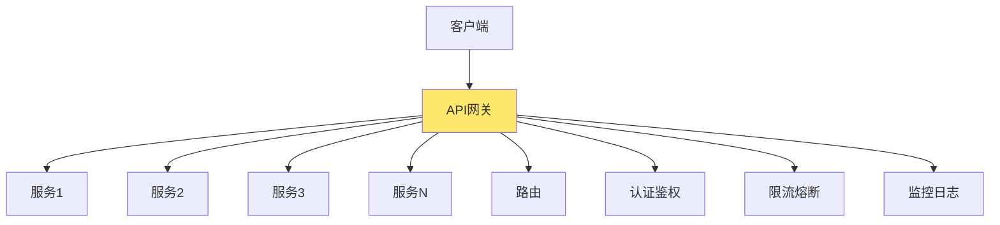

**核心作用：**
- **单点入口**：所有请求统一入口
- **屏蔽内部细节**：客户端无需知道后端服务细节
- **横切关注点**：统一处理认证、限流、监控等
- **协议转换**：支持多种协议转换

## API网关的价值

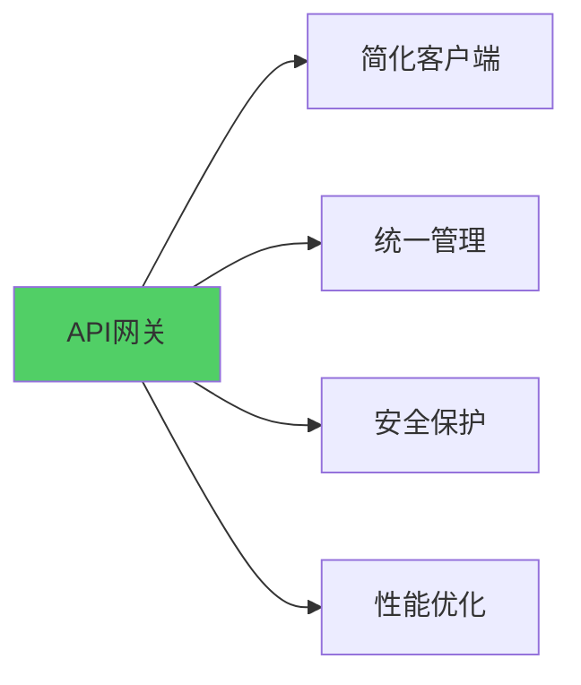

**价值体现：**
- **简化客户端**：客户端只需知道网关地址
- **统一管理**：集中管理API策略和配置
- **安全保护**：统一的安全策略和防护
- **性能优化**：缓存、负载均衡、限流等

## API网关架构

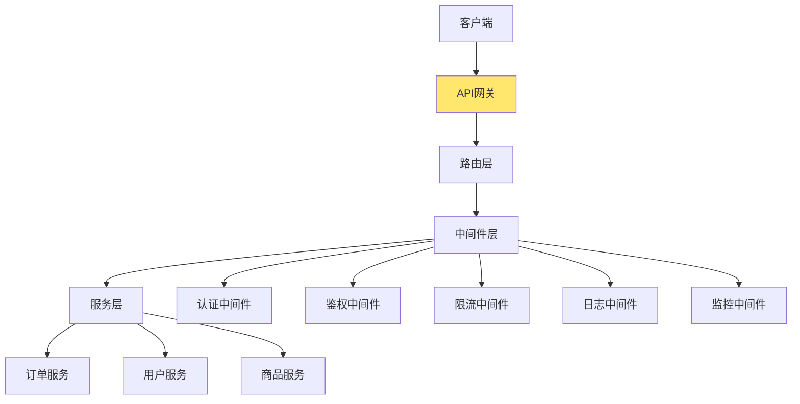

# 核心功能

## 路由

路由是API网关的核心功能，负责将请求转发到正确的后端服务。

### 路由概述

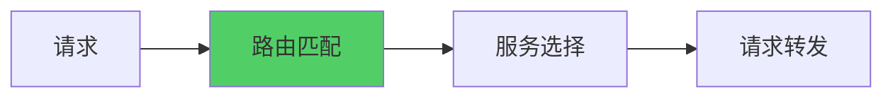

**路由功能：**
- **路径匹配**：根据URL路径匹配路由规则
- **服务发现**：动态发现后端服务
- **负载均衡**：在多个服务实例间分发请求
- **路由重写**：重写请求路径

### 路由配置

```yaml
# 路由配置示例
routes:
  - name: order-service
    path: /api/orders
    methods: [GET, POST, PUT, DELETE]
    service: order-service
    strip_path: true
    
  - name: user-service
    path: /api/users
    methods: [GET, POST]
    service: user-service
    strip_path: true
    
  - name: product-service
    path: /api/products
    methods: [GET]
    service: product-service
    strip_path: true
```

### 重写路由

路由重写允许在转发请求前修改请求路径，实现路径转换。

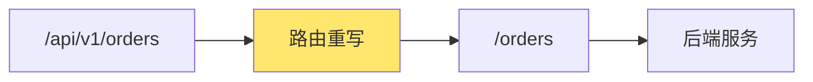

**重写规则：**
```yaml
routes:
  - name: order-service-v1
    path: /api/v1/orders
    rewrite_path: /orders  # 重写路径
    service: order-service
    
  - name: order-service-v2
    path: /api/v2/orders
    rewrite_path: /v2/orders
    service: order-service-v2
```

**实现示例：**
```go
// 路由重写中间件
func RewritePathMiddleware(next http.Handler) http.Handler {
    return http.HandlerFunc(func(w http.ResponseWriter, r *http.Request) {
        // 获取路由配置
        route := getRoute(r.URL.Path)
        if route != nil && route.RewritePath != "" {
            // 重写路径
            r.URL.Path = route.RewritePath
        }
        next.ServeHTTP(w, r)
    })
}
```

### 动态路由

```go
// 动态路由实现
type Router struct {
    routes map[string]*Route
    discovery ServiceDiscovery
}

type Route struct {
    Path        string
    Service     string
    RewritePath string
    Methods     []string
}

func (r *Router) Match(path string) (*Route, error) {
    // 1. 精确匹配
    if route, ok := r.routes[path]; ok {
        return route, nil
    }
    
    // 2. 前缀匹配
    for pattern, route := range r.routes {
        if strings.HasPrefix(path, pattern) {
            return route, nil
        }
    }
    
    // 3. 正则匹配
    for pattern, route := range r.routes {
        matched, _ := regexp.MatchString(pattern, path)
        if matched {
            return route, nil
        }
    }
    
    return nil, fmt.Errorf("no route found for path: %s", path)
}

func (r *Router) Forward(route *Route, req *http.Request) (*http.Response, error) {
    // 1. 服务发现
    instances, err := r.discovery.GetInstances(route.Service)
    if err != nil {
        return nil, err
    }
    
    // 2. 负载均衡选择实例
    instance := r.loadBalancer.Select(instances)
    
    // 3. 构建目标URL
    targetURL := fmt.Sprintf("http://%s:%d%s", 
        instance.Host, instance.Port, route.RewritePath)
    
    // 4. 转发请求
    return r.httpClient.Do(req, targetURL)
}
```

## 认证

认证（Authentication）是验证用户身份的过程，确认"你是谁"。

### 认证概述

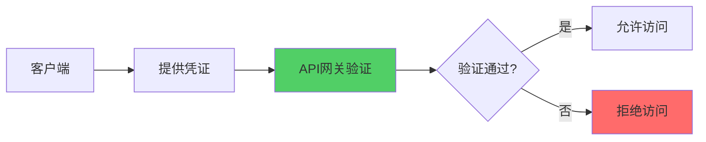

**认证方式：**
- **API Key**：简单的密钥认证
- **JWT Token**：基于Token的认证
- **OAuth 2.0**：标准授权协议
- **Basic Auth**：基础认证

### API Key认证

```go
// API Key认证
type APIKeyAuth struct {
    keys map[string]string  // key -> user_id
}

func (a *APIKeyAuth) Authenticate(req *http.Request) (string, error) {
    // 从Header获取API Key
    apiKey := req.Header.Get("X-API-Key")
    if apiKey == "" {
        return "", fmt.Errorf("API key required")
    }
    
    // 验证API Key
    userID, ok := a.keys[apiKey]
    if !ok {
        return "", fmt.Errorf("invalid API key")
    }
    
    return userID, nil
}

// 使用中间件
func APIKeyAuthMiddleware(auth *APIKeyAuth) func(http.Handler) http.Handler {
    return func(next http.Handler) http.Handler {
        return http.HandlerFunc(func(w http.ResponseWriter, r *http.Request) {
            userID, err := auth.Authenticate(r)
            if err != nil {
                http.Error(w, err.Error(), http.StatusUnauthorized)
                return
            }
            
            // 将用户ID存储到上下文
            ctx := context.WithValue(r.Context(), "user_id", userID)
            next.ServeHTTP(w, r.WithContext(ctx))
        })
    }
}
```

### JWT Token认证

```go
// JWT Token认证
import (
    "github.com/golang-jwt/jwt/v5"
)

type JWTAuth struct {
    secretKey []byte
}

func (a *JWTAuth) Authenticate(req *http.Request) (*Claims, error) {
    // 从Header获取Token
    tokenString := req.Header.Get("Authorization")
    if tokenString == "" {
        return nil, fmt.Errorf("token required")
    }
    
    // 移除"Bearer "前缀
    if strings.HasPrefix(tokenString, "Bearer ") {
        tokenString = tokenString[7:]
    }
    
    // 解析Token
    token, err := jwt.ParseWithClaims(tokenString, &Claims{}, func(token *jwt.Token) (interface{}, error) {
        return a.secretKey, nil
    })
    
    if err != nil {
        return nil, err
    }
    
    if claims, ok := token.Claims.(*Claims); ok && token.Valid {
        return claims, nil
    }
    
    return nil, fmt.Errorf("invalid token")
}

type Claims struct {
    UserID string `json:"user_id"`
    Role   string `json:"role"`
    jwt.RegisteredClaims
}

// JWT认证中间件
func JWTAuthMiddleware(auth *JWTAuth) func(http.Handler) http.Handler {
    return func(next http.Handler) http.Handler {
        return http.HandlerFunc(func(w http.ResponseWriter, r *http.Request) {
            claims, err := auth.Authenticate(r)
            if err != nil {
                http.Error(w, err.Error(), http.StatusUnauthorized)
                return
            }
            
            // 将Claims存储到上下文
            ctx := context.WithValue(r.Context(), "claims", claims)
            next.ServeHTTP(w, r.WithContext(ctx))
        })
    }
}
```

### OAuth 2.0认证

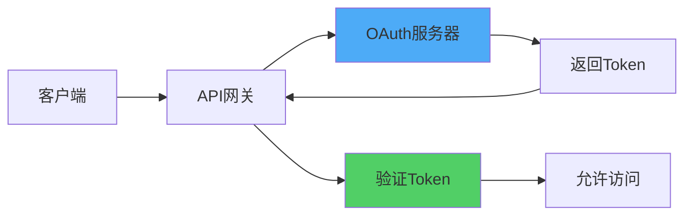

OAuth 2.0认证适用于以下典型使用场景：

- **第三方应用授权访问资源**  
  当用户希望允许第三方应用访问某些受保护的资源（如社交信息、文件等）而无需直接暴露用户名和密码时，OAuth 2.0非常适合。用户通过授权流程给应用颁发访问令牌（Access Token），实现安全、灵活的授权。

- **单点登录（SSO）**  
  通过OAuth 2.0，用户可以在一个身份认证服务中登录后，无需重复登录即可访问多个受信任的应用，实现便捷的单点登录体验。

- **开放平台API安全接入**  
  许多开放平台（如微信、支付宝、GitHub、Google等）要求第三方开发者通过OAuth 2.0标准安全地调用平台的API接口，确保数据访问权限和安全合规。

- **微服务体系下的服务认证**  
  在微服务架构中，后端各服务间也可通过OAuth 2.0协议验证和传递访问令牌，用于服务间调用的安全控制和身份识别。

- **移动端和前端分离系统**  
  OAuth 2.0因其支持Token机制，适合前后端分离、移动端、小程序、桌面客户端等多端接入场景，提高了灵活性和安全性，避免了传统Session暴露风险。

**总结**：OAuth 2.0擅长于“委托式授权”和“令牌驱动”安全访问，能够保护用户隐私，避免凭证泄露，广泛用于社交登录、开放云服务API、企业内部/跨系统认证授权等场景。


```go
// OAuth 2.0认证
type OAuth2Auth struct {
    tokenEndpoint string
    client        *http.Client
}

func (a *OAuth2Auth) Authenticate(req *http.Request) (*TokenInfo, error) {
    // 从Header获取Token
    token := req.Header.Get("Authorization")
    if !strings.HasPrefix(token, "Bearer ") {
        return nil, fmt.Errorf("invalid token format")
    }
    token = token[7:]
    
    // 验证Token
    return a.introspectToken(token)
}

func (a *OAuth2Auth) introspectToken(token string) (*TokenInfo, error) {
    req, _ := http.NewRequest("POST", a.tokenEndpoint, 
        strings.NewReader("token="+token))
    req.Header.Set("Content-Type", "application/x-www-form-urlencoded")
    
    resp, err := a.client.Do(req)
    if err != nil {
        return nil, err
    }
    defer resp.Body.Close()
    
    var info TokenInfo
    json.NewDecoder(resp.Body).Decode(&info)
    
    if !info.Active {
        return nil, fmt.Errorf("token is not active")
    }
    
    return &info, nil
}
```

## 鉴权

鉴权（Authorization）是验证用户权限的过程，确认"你能做什么"。

### 鉴权概述

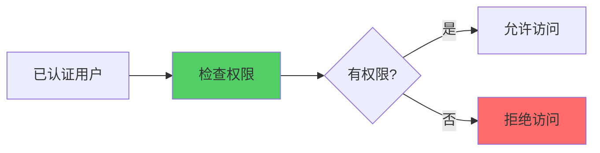

**鉴权模型：**
- **RBAC**：基于角色的访问控制
- **ABAC**：基于属性的访问控制
- **ACL**：访问控制列表

### RBAC鉴权

```go
// RBAC鉴权
type RBACAuthorizer struct {
    permissions map[string][]string  // role -> permissions
}

func (a *RBACAuthorizer) Authorize(userRole, resource, action string) bool {
    // 获取角色权限
    perms, ok := a.permissions[userRole]
    if !ok {
        return false
    }
    
    // 检查权限
    requiredPerm := fmt.Sprintf("%s:%s", resource, action)
    for _, perm := range perms {
        if perm == requiredPerm || perm == "*" {
            return true
        }
    }
    
    return false
}

// 权限配置
func NewRBACAuthorizer() *RBACAuthorizer {
    return &RBACAuthorizer{
        permissions: map[string][]string{
            "admin": {"*"},  // 管理员拥有所有权限
            "user": {
                "orders:read",
                "orders:create",
            },
            "guest": {
                "products:read",
            },
        },
    }
}

// 鉴权中间件
func RBACMiddleware(auth *RBACAuthorizer) func(http.Handler) http.Handler {
    return func(next http.Handler) http.Handler {
        return http.HandlerFunc(func(w http.ResponseWriter, r *http.Request) {
            // 从上下文获取用户角色
            claims, ok := r.Context().Value("claims").(*Claims)
            if !ok {
                http.Error(w, "unauthorized", http.StatusUnauthorized)
                return
            }
            
            // 提取资源和操作
            resource := extractResource(r.URL.Path)
            action := extractAction(r.Method)
            
            // 检查权限
            if !auth.Authorize(claims.Role, resource, action) {
                http.Error(w, "forbidden", http.StatusForbidden)
                return
            }
            
            next.ServeHTTP(w, r)
        })
    }
}

func extractResource(path string) string {
    parts := strings.Split(path, "/")
    if len(parts) >= 3 {
        return parts[2]  // /api/orders -> orders
    }
    return ""
}

func extractAction(method string) string {
    switch method {
    case "GET":
        return "read"
    case "POST":
        return "create"
    case "PUT", "PATCH":
        return "update"
    case "DELETE":
        return "delete"
    default:
        return "unknown"
    }
}
```

### ABAC鉴权

```go
// ABAC鉴权（基于属性）
type ABACAuthorizer struct {
    policies []Policy
}

type Policy struct {
    Subject   map[string]interface{}  // 用户属性
    Resource  map[string]interface{}  // 资源属性
    Action    string
    Condition func(*Request) bool
    Effect    string  // allow/deny
}

func (a *ABACAuthorizer) Authorize(req *Request) bool {
    for _, policy := range a.policies {
        // 检查主体属性
        if !a.matchSubject(policy.Subject, req.User) {
            continue
        }
        
        // 检查资源属性
        if !a.matchResource(policy.Resource, req.Resource) {
            continue
        }
        
        // 检查操作
        if policy.Action != req.Action && policy.Action != "*" {
            continue
        }
        
        // 检查条件
        if policy.Condition != nil && !policy.Condition(req) {
            continue
        }
        
        // 返回效果
        return policy.Effect == "allow"
    }
    
    return false
}
```

## 限流

限流（Rate Limiting）是控制请求速率，防止系统过载。

### 限流概述

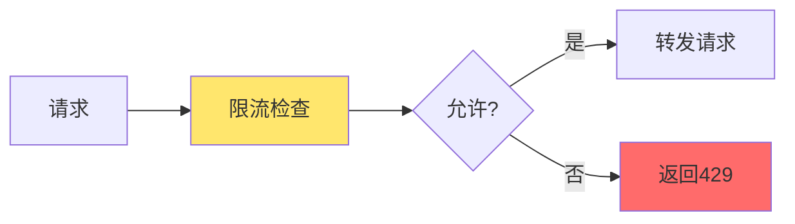

**限流算法：**
- **固定窗口**：固定时间窗口内的请求数限制
- **滑动窗口**：滑动时间窗口内的请求数限制
- **令牌桶**：令牌桶算法
- **漏桶**：漏桶算法

### 固定窗口限流

```go
// 固定窗口限流
type FixedWindowLimiter struct {
    limit    int
    window   time.Duration
    counters map[string]*Counter
    mu       sync.RWMutex
}

type Counter struct {
    count     int
    windowEnd time.Time
}

func NewFixedWindowLimiter(limit int, window time.Duration) *FixedWindowLimiter {
    return &FixedWindowLimiter{
        limit:    limit,
        window:   window,
        counters: make(map[string]*Counter),
    }
}

func (l *FixedWindowLimiter) Allow(key string) bool {
    l.mu.Lock()
    defer l.mu.Unlock()
    
    now := time.Now()
    counter, ok := l.counters[key]
    
    // 新窗口或窗口过期
    if !ok || now.After(counter.windowEnd) {
        l.counters[key] = &Counter{
            count:     1,
            windowEnd: now.Add(l.window),
        }
        return true
    }
    
    // 检查是否超过限制
    if counter.count >= l.limit {
        return false
    }
    
    counter.count++
    return true
}
```

### 令牌桶限流

```go
// 令牌桶限流
type TokenBucketLimiter struct {
    capacity int64         // 桶容量
    rate     int64         // 每秒生成令牌数
    tokens   map[string]*Bucket
    mu       sync.RWMutex
}

type Bucket struct {
    tokens   int64
    lastTime time.Time
}

func NewTokenBucketLimiter(capacity, rate int64) *TokenBucketLimiter {
    return &TokenBucketLimiter{
        capacity: capacity,
        rate:     rate,
        tokens:   make(map[string]*Bucket),
    }
}

func (l *TokenBucketLimiter) Allow(key string) bool {
    l.mu.Lock()
    defer l.mu.Unlock()
    
    now := time.Now()
    bucket, ok := l.tokens[key]
    
    if !ok {
        bucket = &Bucket{
            tokens:   l.capacity,
            lastTime: now,
        }
        l.tokens[key] = bucket
    }
    
    // 计算新增令牌数
    elapsed := now.Sub(bucket.lastTime)
    tokensToAdd := int64(elapsed.Seconds()) * l.rate
    bucket.tokens = min(bucket.tokens+tokensToAdd, l.capacity)
    bucket.lastTime = now
    
    // 检查是否有令牌
    if bucket.tokens > 0 {
        bucket.tokens--
        return true
    }
    
    return false
}
```

### 限流中间件

```go
// 限流中间件
func RateLimitMiddleware(limiter RateLimiter) func(http.Handler) http.Handler {
    return func(next http.Handler) http.Handler {
        return http.HandlerFunc(func(w http.ResponseWriter, r *http.Request) {
            // 获取限流key（可以是IP、用户ID等）
            key := getRateLimitKey(r)
            
            if !limiter.Allow(key) {
                w.Header().Set("X-RateLimit-Limit", strconv.Itoa(limiter.Limit()))
                w.Header().Set("X-RateLimit-Remaining", "0")
                w.Header().Set("Retry-After", strconv.Itoa(limiter.RetryAfter()))
                http.Error(w, "rate limit exceeded", http.StatusTooManyRequests)
                return
            }
            
            next.ServeHTTP(w, r)
        })
    }
}

func getRateLimitKey(r *http.Request) string {
    // 优先使用用户ID
    if userID := r.Context().Value("user_id"); userID != nil {
        return fmt.Sprintf("user:%s", userID)
    }
    
    // 使用IP地址
    return fmt.Sprintf("ip:%s", getClientIP(r))
}
```

## 请求处理

请求处理包括请求数据的重写、转换和过滤。

### 请求处理概述

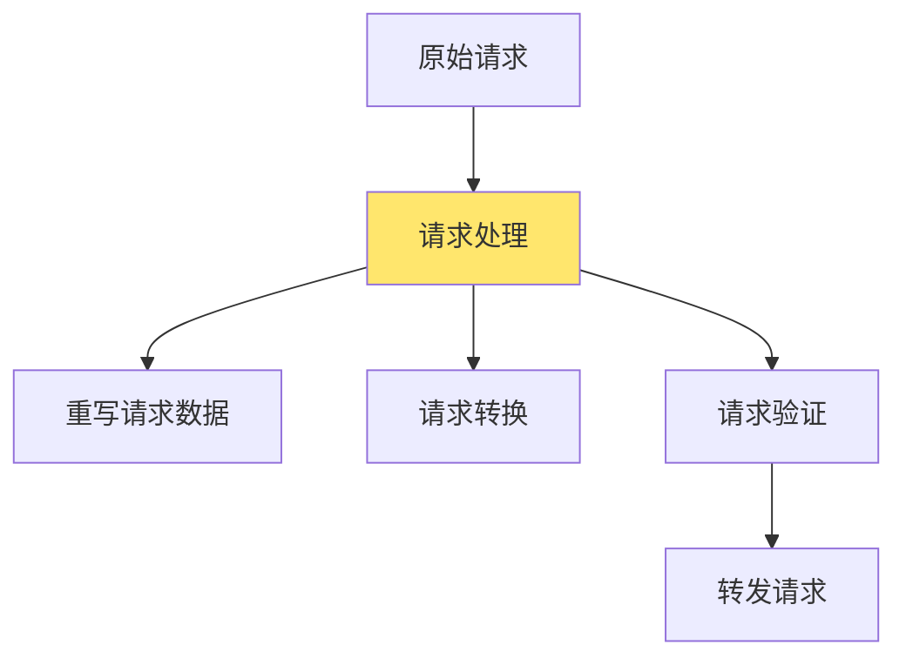

### 重写请求数据

重写请求数据允许在转发前修改请求内容。

```go
// 请求重写中间件
func RequestRewriteMiddleware(next http.Handler) http.Handler {
    return http.HandlerFunc(func(w http.ResponseWriter, r *http.Request) {
        // 1. 重写请求头
        r.Header.Set("X-Forwarded-For", getClientIP(r))
        r.Header.Set("X-Forwarded-Proto", getScheme(r))
        
        // 2. 添加自定义头
        r.Header.Set("X-Gateway-Version", "v1.0")
        
        // 3. 重写请求体（如果需要）
        if r.Body != nil {
            body, _ := io.ReadAll(r.Body)
            r.Body.Close()
            
            // 修改请求体
            modifiedBody := modifyRequestBody(body)
            
            r.Body = io.NopCloser(bytes.NewReader(modifiedBody))
            r.ContentLength = int64(len(modifiedBody))
        }
        
        next.ServeHTTP(w, r)
    })
}

func modifyRequestBody(body []byte) []byte {
    // 解析JSON
    var data map[string]interface{}
    json.Unmarshal(body, &data)
    
    // 添加字段
    data["gateway_timestamp"] = time.Now().Unix()
    
    // 重新序列化
    modified, _ := json.Marshal(data)
    return modified
}
```

### 请求验证

```go
// 请求验证中间件
func RequestValidationMiddleware(next http.Handler) http.Handler {
    return http.HandlerFunc(func(w http.ResponseWriter, r *http.Request) {
        // 1. 验证请求大小
        if r.ContentLength > maxRequestSize {
            http.Error(w, "request too large", http.StatusRequestEntityTooLarge)
            return
        }
        
        // 2. 验证Content-Type
        if r.Method == "POST" || r.Method == "PUT" {
            contentType := r.Header.Get("Content-Type")
            if !strings.HasPrefix(contentType, "application/json") {
                http.Error(w, "invalid content type", http.StatusBadRequest)
                return
            }
        }
        
        // 3. 验证必需参数
        if err := validateRequiredParams(r); err != nil {
            http.Error(w, err.Error(), http.StatusBadRequest)
            return
        }
        
        next.ServeHTTP(w, r)
    })
}
```

### 过滤响应

过滤响应允许在返回给客户端前修改响应内容。

```go
// 响应过滤中间件
type ResponseFilter struct {
    filters []ResponseFilterFunc
}

type ResponseFilterFunc func(*http.Response) error

func (f *ResponseFilter) Filter(next http.Handler) http.Handler {
    return http.HandlerFunc(func(w http.ResponseWriter, r *http.Request) {
        // 使用ResponseWriter包装器
        rw := &responseWriter{
            ResponseWriter: w,
            filters:        f.filters,
        }
        
        next.ServeHTTP(rw, r)
    })
}

type responseWriter struct {
    http.ResponseWriter
    filters []ResponseFilterFunc
    body    []byte
    status  int
}

func (rw *responseWriter) Write(b []byte) (int, error) {
    rw.body = append(rw.body, b...)
    return len(b), nil
}

func (rw *responseWriter) WriteHeader(statusCode int) {
    rw.status = statusCode
}

func (rw *responseWriter) flush() error {
    // 创建响应对象
    resp := &http.Response{
        StatusCode: rw.status,
        Header:     rw.Header(),
        Body:       io.NopCloser(bytes.NewReader(rw.body)),
    }
    
    // 应用过滤器
    for _, filter := range rw.filters {
        if err := filter(resp); err != nil {
            return err
        }
    }
    
    // 写入响应
    for k, v := range resp.Header {
        for _, val := range v {
            rw.ResponseWriter.Header().Add(k, val)
        }
    }
    rw.ResponseWriter.WriteHeader(resp.StatusCode)
    
    body, _ := io.ReadAll(resp.Body)
    rw.ResponseWriter.Write(body)
    
    return nil
}

// 响应过滤器示例
func RemoveSensitiveDataFilter(resp *http.Response) error {
    if resp.Header.Get("Content-Type") != "application/json" {
        return nil
    }
    
    body, _ := io.ReadAll(resp.Body)
    resp.Body.Close()
    
    var data map[string]interface{}
    json.Unmarshal(body, &data)
    
    // 移除敏感字段
    delete(data, "password")
    delete(data, "token")
    delete(data, "secret")
    
    modified, _ := json.Marshal(data)
    resp.Body = io.NopCloser(bytes.NewReader(modified))
    resp.ContentLength = int64(len(modified))
    
    return nil
}
```

## 其他功能

### 熔断

```go
// 熔断器
type CircuitBreaker struct {
    maxFailures int
    timeout     time.Duration
    state       CircuitState
    failures    int
    lastFailure time.Time
    mu          sync.RWMutex
}

func (cb *CircuitBreaker) Execute(fn func() error) error {
    cb.mu.Lock()
    state := cb.state
    cb.mu.Unlock()
    
    if state == StateOpen {
        if time.Since(cb.lastFailure) > cb.timeout {
            cb.mu.Lock()
            cb.state = StateHalfOpen
            cb.mu.Unlock()
        } else {
            return ErrCircuitOpen
        }
    }
    
    err := fn()
    
    cb.mu.Lock()
    if err != nil {
        cb.failures++
        cb.lastFailure = time.Now()
        if cb.failures >= cb.maxFailures {
            cb.state = StateOpen
        }
    } else {
        cb.failures = 0
        if cb.state == StateHalfOpen {
            cb.state = StateClosed
        }
    }
    cb.mu.Unlock()
    
    return err
}
```

### 缓存

```go
// 缓存中间件
func CacheMiddleware(cache Cache) func(http.Handler) http.Handler {
    return func(next http.Handler) http.Handler {
        return http.HandlerFunc(func(w http.ResponseWriter, r *http.Request) {
            // 只缓存GET请求
            if r.Method != "GET" {
                next.ServeHTTP(w, r)
                return
            }
            
            // 生成缓存key
            cacheKey := generateCacheKey(r)
            
            // 尝试从缓存获取
            if cached, ok := cache.Get(cacheKey); ok {
                w.Header().Set("X-Cache", "HIT")
                w.Write(cached)
                return
            }
            
            // 缓存未命中，执行请求并缓存响应
            rw := &cacheResponseWriter{
                ResponseWriter: w,
                cache:          cache,
                cacheKey:        cacheKey,
            }
            
            next.ServeHTTP(rw, r)
        })
    }
}
```

### 监控和日志

```go
// 监控中间件
func MonitoringMiddleware(next http.Handler) http.Handler {
    return http.HandlerFunc(func(w http.ResponseWriter, r *http.Request) {
        start := time.Now()
        
        rw := &monitoringResponseWriter{
            ResponseWriter: w,
            statusCode:     http.StatusOK,
        }
        
        next.ServeHTTP(rw, r)
        
        duration := time.Since(start)
        
        // 记录指标
        recordMetrics(r, rw.statusCode, duration)
        
        // 记录日志
        logRequest(r, rw.statusCode, duration)
    })
}

func recordMetrics(r *http.Request, status int, duration time.Duration) {
    // 记录请求数
    httpRequestsTotal.WithLabelValues(
        r.Method,
        r.URL.Path,
        strconv.Itoa(status),
    ).Inc()
    
    // 记录响应时间
    httpRequestDuration.WithLabelValues(
        r.Method,
        r.URL.Path,
    ).Observe(duration.Seconds())
}
```

# 主流API网关

## Kong

Kong是开源的API网关，基于Nginx和OpenResty。

### Kong特性

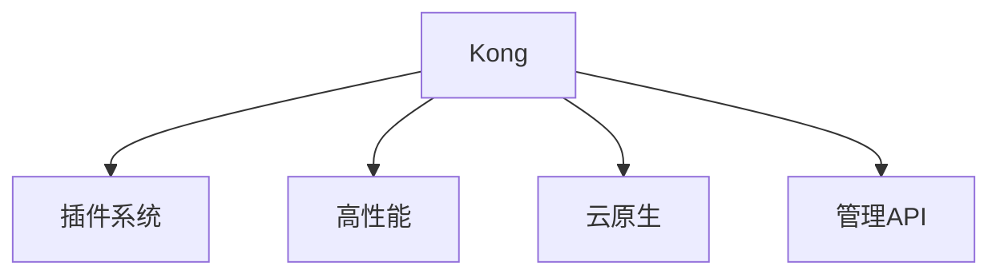

**核心特性：**
- 基于Nginx，性能优秀
- 丰富的插件生态
- 支持云原生部署
- RESTful管理API

### Kong配置

```yaml
# kong.yml
_format_version: "3.0"

services:
  - name: order-service
    url: http://order-service:8080
    routes:
      - name: order-route
        paths:
          - /api/orders
        methods:
          - GET
          - POST
        plugins:
          - name: rate-limiting
            config:
              minute: 100
          - name: jwt
            config:
              secret_is_base64: false

plugins:
  - name: cors
    config:
      origins:
        - "*"
      methods:
        - GET
        - POST
        - PUT
        - DELETE
```

## Nginx

Nginx是高性能的Web服务器和反向代理，也可以作为API网关使用。

### Nginx配置

```nginx
# nginx.conf
upstream order_service {
    server order-service-1:8080;
    server order-service-2:8080;
    server order-service-3:8080;
}

server {
    listen 80;
    server_name api.example.com;
    
    # 限流
    limit_req_zone $binary_remote_addr zone=api_limit:10m rate=10r/s;
    
    location /api/orders {
        limit_req zone=api_limit burst=20;
        
        # 认证
        auth_request /auth;
        
        # 代理
        proxy_pass http://order_service;
        proxy_set_header Host $host;
        proxy_set_header X-Real-IP $remote_addr;
        proxy_set_header X-Forwarded-For $proxy_add_x_forwarded_for;
    }
    
    # 认证端点
    location = /auth {
        internal;
        proxy_pass http://auth-service:8080/validate;
        proxy_pass_request_body off;
        proxy_set_header Content-Length "";
        proxy_set_header X-Original-URI $request_uri;
    }
}
```

## Envoy

Envoy是云原生的代理服务器，常用于服务网格和API网关。

### Envoy配置

```yaml
# envoy.yaml
static_resources:
  listeners:
    - name: listener_0
      address:
        socket_address:
          address: 0.0.0.0
          port_value: 80
      filter_chains:
        - filters:
            - name: envoy.filters.network.http_connection_manager
              typed_config:
                "@type": type.googleapis.com/envoy.extensions.filters.network.http_connection_manager.v3.HttpConnectionManager
                stat_prefix: ingress_http
                route_config:
                  name: local_route
                  virtual_hosts:
                    - name: local_service
                      domains: ["*"]
                      routes:
                        - match:
                            prefix: "/api/orders"
                          route:
                            cluster: order_service
                http_filters:
                  - name: envoy.filters.http.router
  clusters:
    - name: order_service
      connect_timeout: 0.25s
      type: LOGICAL_DNS
      lb_policy: ROUND_ROBIN
      load_assignment:
        cluster_name: order_service
        endpoints:
          - lb_endpoints:
              - endpoint:
                  address:
                    socket_address:
                      address: order-service
                      port_value: 8080
```

## Traefik

Traefik是云原生的HTTP反向代理和负载均衡器。

### Traefik特性

- 自动服务发现
- 动态配置
- Let's Encrypt集成
- 丰富的中间件

# API网关最佳实践

## 1. 网关设计原则

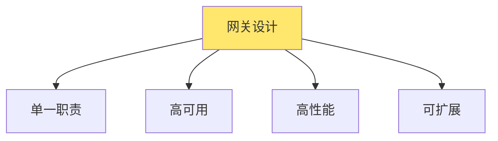

**原则：**
- **单一职责**：只处理横切关注点
- **高可用**：网关本身要高可用
- **高性能**：低延迟，高吞吐
- **可扩展**：支持水平扩展

## 2. 安全设计

- **认证**：统一认证入口
- **鉴权**：细粒度权限控制
- **加密**：HTTPS传输
- **防护**：防DDoS、防SQL注入等

## 3. 性能优化

- **缓存**：缓存响应数据
- **连接池**：复用后端连接
- **压缩**：响应数据压缩
- **限流**：防止过载

## 4. 监控和日志

- **指标监控**：请求数、延迟、错误率
- **日志记录**：完整的请求日志
- **追踪**：分布式追踪支持
- **告警**：异常告警

# 总结

API网关是微服务架构中的重要组件，提供统一入口和横切关注点的处理。

**核心功能：**
1. **路由**：请求路由和转发
2. **认证**：用户身份验证
3. **鉴权**：权限控制
4. **限流**：流量控制
5. **请求处理**：请求重写和响应过滤

**最佳实践：**
- 选择合适的网关方案
- 设计合理的路由规则
- 实现完善的认证鉴权
- 配置合理的限流策略
- 完善的监控和日志

通过系统性的API网关设计，可以构建安全、高性能、易维护的微服务系统。
