CS架构（Client-Server Architecture，客户端-服务器架构）是一种经典的分布式计算架构模式，它将应用程序分为客户端和服务器两个部分，通过网络进行通信和协作。

# CS架构概述

## 什么是CS架构？

CS架构是一种网络架构模式，其中：
- **客户端（Client）**：负责用户界面展示和用户交互，向服务器发送请求
- **服务器（Server）**：负责业务逻辑处理、数据存储和管理，响应客户端请求

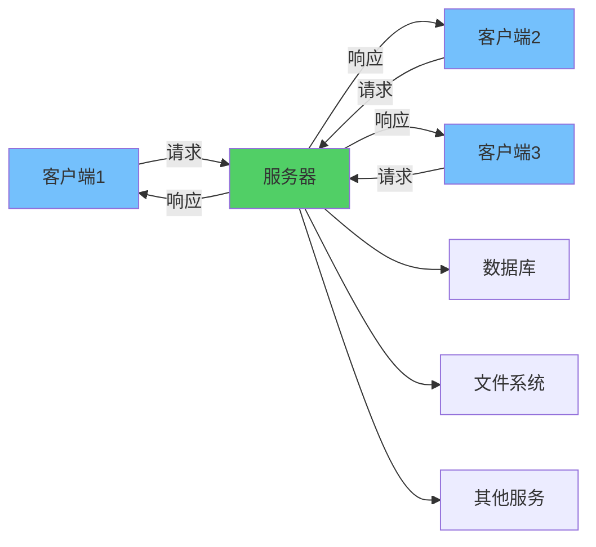

**核心特点：**
- **分离关注点**：客户端专注于用户交互，服务器专注于业务处理
- **集中管理**：数据和业务逻辑集中在服务器端
- **网络通信**：客户端和服务器通过网络协议进行通信
- **可扩展性**：支持多个客户端同时访问同一服务器

## CS架构的基本模型

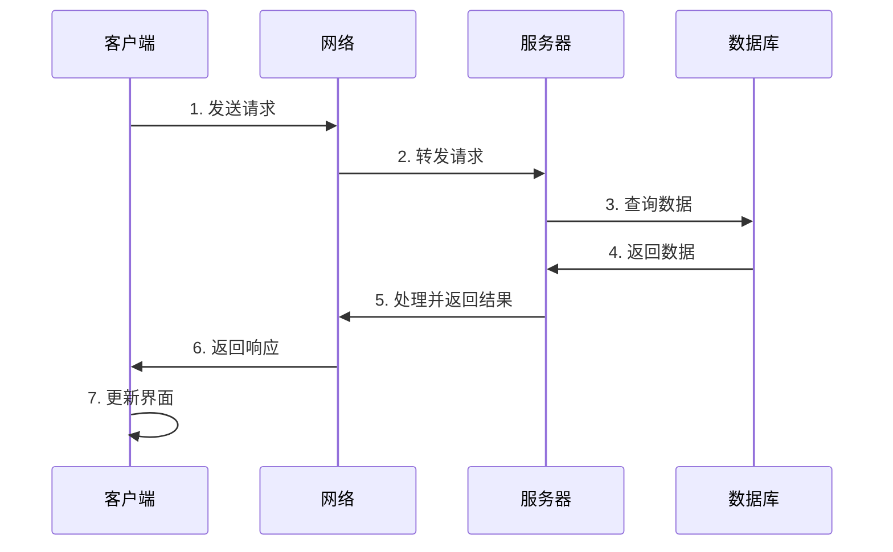

# CS架构的组成

## 客户端（Client）

客户端是用户直接交互的应用程序，主要职责包括：

### 客户端功能
- **用户界面**：提供图形化或命令行界面
- **输入验证**：对用户输入进行基本验证
- **请求发送**：向服务器发送服务请求
- **响应处理**：接收并展示服务器返回的结果
- **本地缓存**：缓存部分数据以提高性能

### 客户端类型

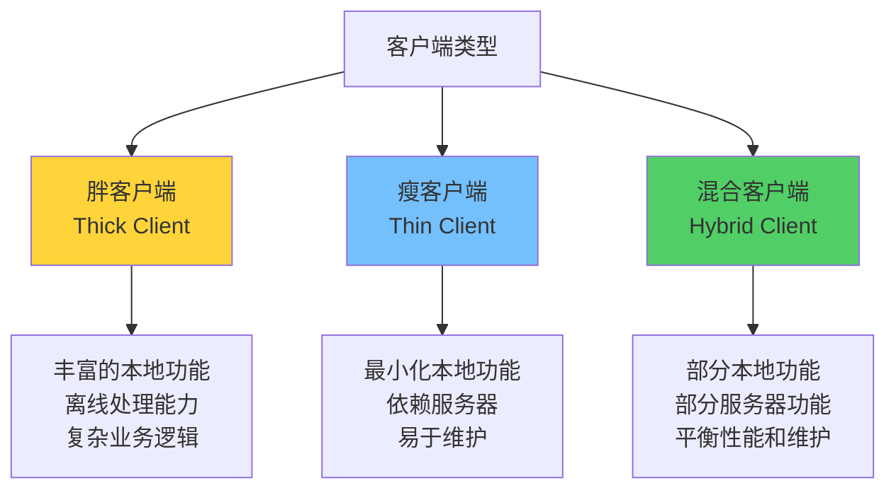

**胖客户端（Thick Client）**
- 包含大量业务逻辑和数据处理
- 可以独立运行部分功能
- 需要安装和更新客户端软件
- 例如：桌面应用程序、移动APP

**瘦客户端（Thick Client）**
- 最小化本地功能，主要依赖服务器
- 易于部署和维护
- 跨平台兼容性好
- 例如：Web浏览器、终端应用

## 服务器（Server）

服务器是提供服务和资源的后端系统，主要职责包括：

### 服务器功能
- **业务逻辑处理**：执行核心业务规则和流程
- **数据管理**：存储、查询、更新数据
- **请求处理**：接收、解析、处理客户端请求
- **资源管理**：管理计算资源、存储资源等
- **安全控制**：身份认证、授权、数据加密

### 服务器类型

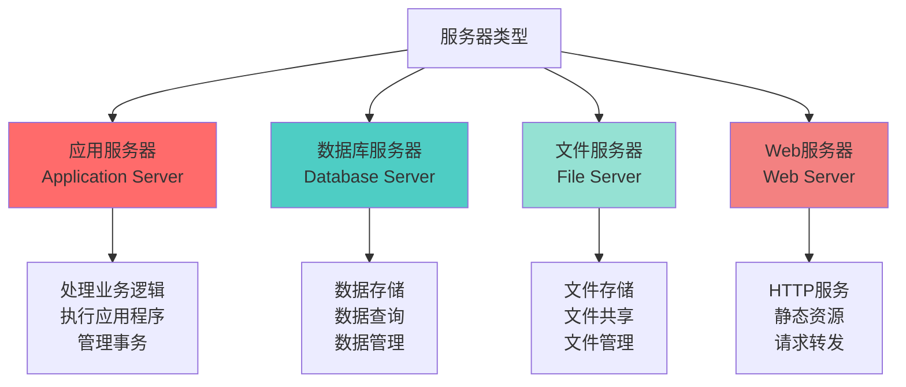

# CS架构的通信方式

## 通信协议

CS架构支持多种通信协议：

### 1. HTTP/HTTPS
- **用途**：Web应用、RESTful API
- **特点**：无状态、基于请求-响应模式
- **适用场景**：Web浏览器、移动APP、微服务

### 2. TCP/IP
- **用途**：可靠的数据传输
- **特点**：面向连接、保证数据完整性
- **适用场景**：实时通信、游戏、金融系统

### 3. WebSocket
- **用途**：双向实时通信
- **特点**：全双工通信、低延迟
- **适用场景**：聊天应用、实时协作、在线游戏

### 4. RPC（远程过程调用）
- **用途**：跨网络调用函数
- **特点**：像本地函数调用一样简单
- **适用场景**：分布式系统、微服务架构

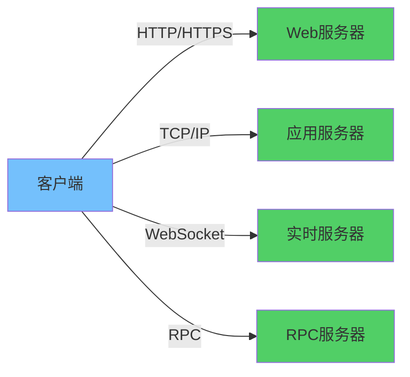

# CS架构的优缺点

## 优点

### 1. 集中管理
- **数据集中**：所有数据存储在服务器端，便于管理和备份
- **业务逻辑集中**：核心业务逻辑在服务器端，易于维护和更新
- **安全控制**：统一的安全策略和访问控制

### 2. 可扩展性
- **水平扩展**：可以增加服务器数量处理更多请求
- **负载均衡**：通过负载均衡器分发请求到多个服务器
- **客户端扩展**：可以轻松增加客户端数量

### 3. 易于维护
- **集中更新**：只需更新服务器端代码，所有客户端自动受益
- **版本管理**：服务器端统一管理版本，减少兼容性问题
- **监控和日志**：集中监控和日志管理

### 4. 资源共享
- **资源复用**：多个客户端共享服务器资源
- **成本效益**：减少客户端硬件要求
- **数据一致性**：所有客户端访问同一数据源

## 缺点

### 1. 服务器压力
- **单点故障**：服务器故障影响所有客户端
- **性能瓶颈**：服务器成为性能瓶颈
- **资源消耗**：需要强大的服务器硬件

### 2. 网络依赖
- **网络延迟**：网络延迟影响用户体验
- **网络故障**：网络中断导致服务不可用
- **带宽消耗**：大量数据传输消耗带宽

### 3. 部署复杂性
- **服务器部署**：需要专业的服务器部署和维护
- **网络配置**：需要配置网络和安全策略
- **成本较高**：服务器硬件和维护成本

### 4. 可扩展性限制
- **垂直扩展限制**：单服务器性能提升有限
- **水平扩展复杂性**：多服务器需要处理数据一致性和负载均衡

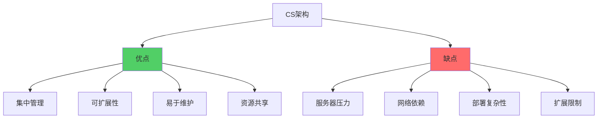

# CS架构的应用场景

## 典型应用

### 1. Web应用
- **架构**：浏览器（客户端） ↔ Web服务器（服务器）
- **协议**：HTTP/HTTPS
- **示例**：电商网站、社交网络、在线办公

### 2. 数据库应用
- **架构**：应用程序（客户端） ↔ 数据库服务器（服务器）
- **协议**：SQL、ODBC、JDBC
- **示例**：ERP系统、CRM系统、数据分析平台

### 3. 邮件系统
- **架构**：邮件客户端 ↔ 邮件服务器
- **协议**：SMTP、POP3、IMAP
- **示例**：企业邮箱、个人邮箱

### 4. 文件共享
- **架构**：文件客户端 ↔ 文件服务器
- **协议**：FTP、SMB、NFS
- **示例**：网络存储、文件服务器

### 5. 游戏应用
- **架构**：游戏客户端 ↔ 游戏服务器
- **协议**：TCP、UDP、WebSocket
- **示例**：在线游戏、多人游戏

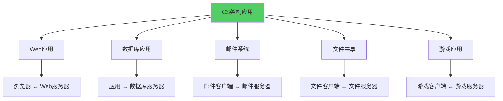

# CS架构的变体

## 多层架构（Multi-Tier Architecture）

CS架构可以扩展为多层架构：

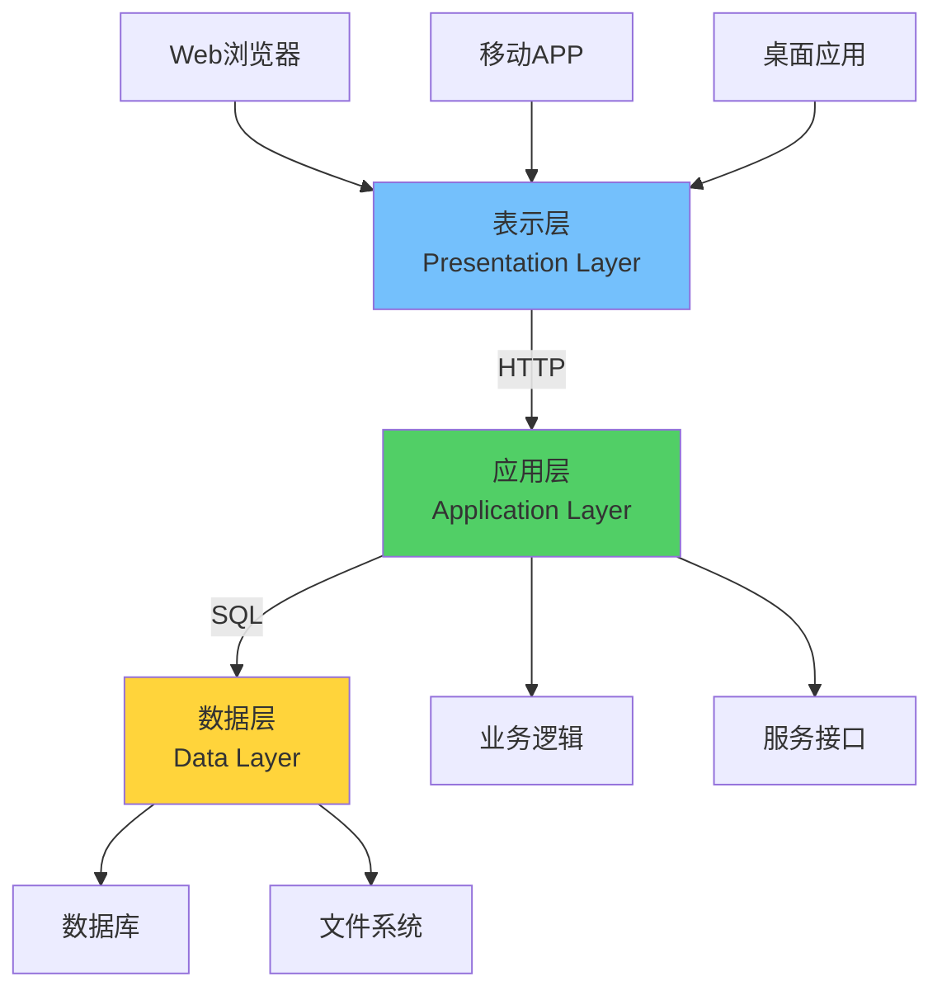

### 三层架构（3-Tier）
1. **表示层**：用户界面和交互
2. **业务逻辑层**：业务规则和处理
3. **数据访问层**：数据存储和访问

### N层架构（N-Tier）
- 可以进一步细分，如：表示层、业务逻辑层、服务层、数据访问层、数据层

## 分布式CS架构

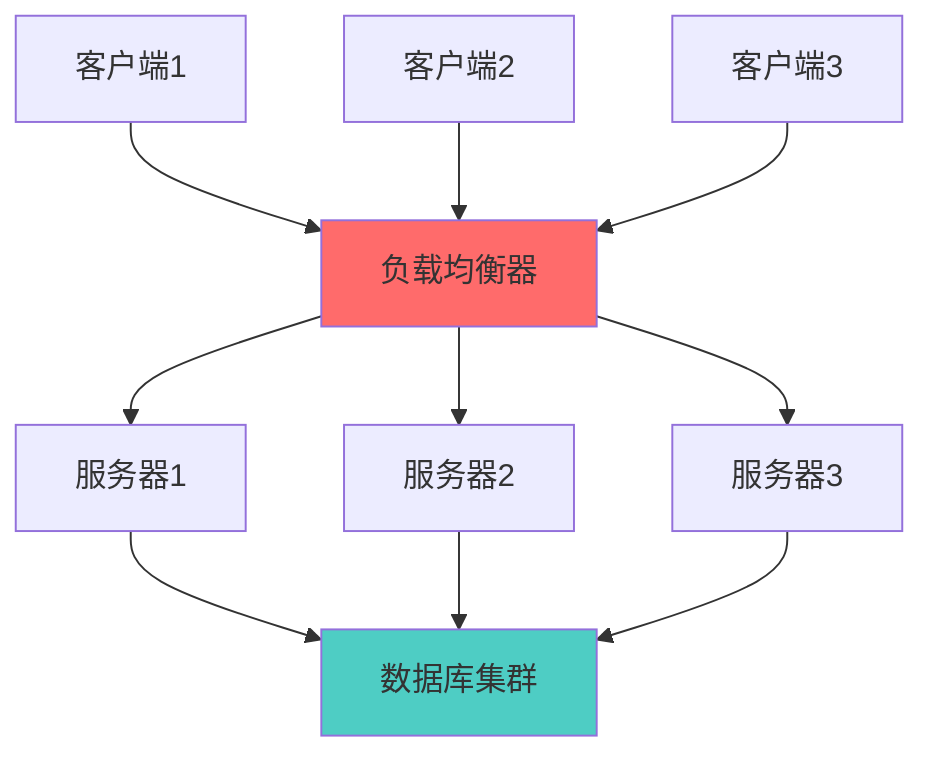

**特点：**
- 多个服务器实例处理请求
- 负载均衡器分发请求
- 数据库集群提供高可用性
- 提高系统性能和可靠性

# CS架构与其他架构的对比

## CS vs BS架构

| 特性 | CS架构 | BS架构 |
|------|--------|--------|
| 客户端 | 需要安装客户端软件 | 只需浏览器 |
| 部署 | 需要部署客户端 | 只需部署服务器 |
| 更新 | 需要更新客户端 | 服务器端更新即可 |
| 性能 | 本地处理，性能好 | 依赖网络，性能一般 |
| 跨平台 | 需要多平台版本 | 天然跨平台 |
| 离线能力 | 可以离线使用 | 需要网络连接 |

## CS vs 微服务架构

| 特性 | CS架构 | 微服务架构 |
|------|--------|------------|
| 服务粒度 | 单体或粗粒度服务 | 细粒度服务 |
| 部署 | 整体部署 | 独立部署 |
| 技术栈 | 统一技术栈 | 多技术栈 |
| 扩展性 | 整体扩展 | 按需扩展 |
| 复杂度 | 相对简单 | 相对复杂 |

# CS架构的实现要点

## 1. 接口设计

### RESTful API设计
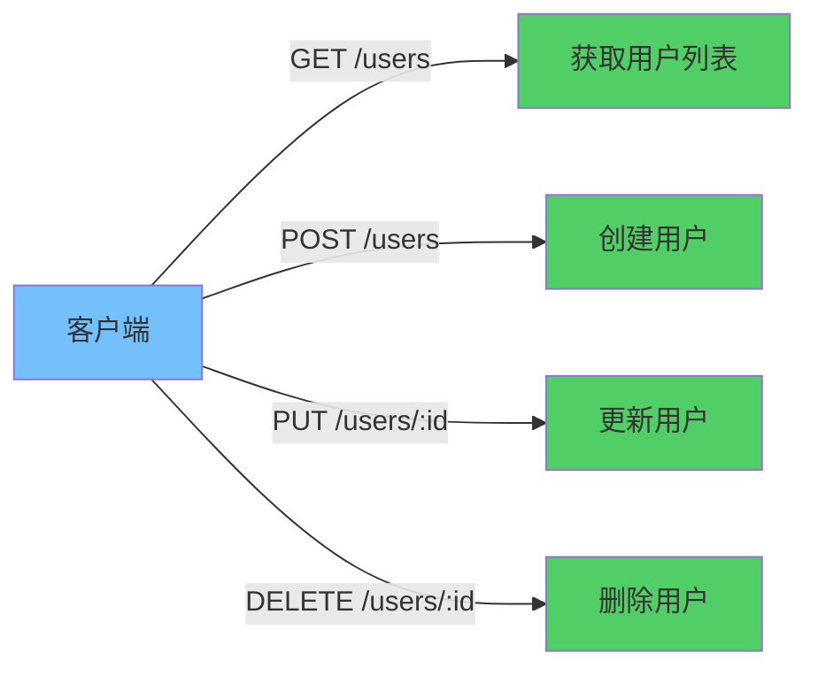

**设计原则：**
- 使用标准HTTP方法（GET、POST、PUT、DELETE）
- 使用RESTful URL设计
- 返回标准JSON格式
- 使用HTTP状态码表示结果

## 2. 错误处理

### 统一错误响应格式
```json
{
  "error": {
    "code": "ERROR_CODE",
    "message": "错误描述",
    "details": {}
  }
}
```

### 错误处理策略
- **客户端错误（4xx）**：请求格式错误、参数错误、权限不足
- **服务器错误（5xx）**：服务器内部错误、服务不可用
- **超时处理**：设置合理的超时时间
- **重试机制**：对临时错误进行重试

## 3. 安全性

### 身份认证
- **Token认证**：JWT、OAuth2
- **Session认证**：基于Session的认证
- **API密钥**：使用API Key进行认证

### 数据安全
- **HTTPS加密**：传输层加密
- **数据加密**：敏感数据加密存储
- **输入验证**：防止SQL注入、XSS攻击
- **访问控制**：基于角色的访问控制（RBAC）

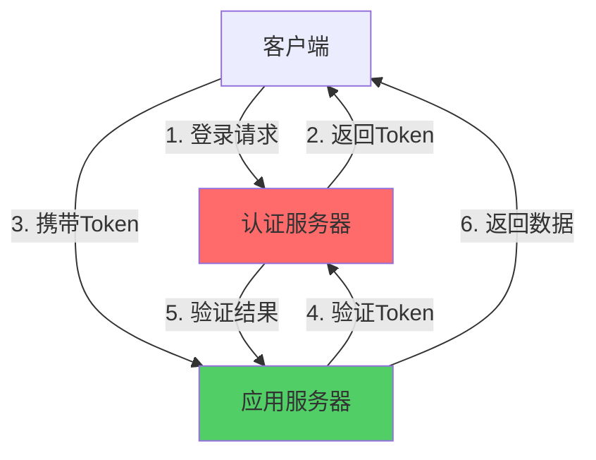

## 4. 性能优化

### 客户端优化
- **缓存策略**：本地缓存减少请求
- **请求合并**：合并多个请求减少网络开销
- **懒加载**：按需加载数据
- **压缩传输**：使用Gzip压缩

### 服务器优化
- **数据库优化**：索引、查询优化
- **缓存机制**：Redis、Memcached
- **连接池**：数据库连接池
- **异步处理**：异步处理耗时操作

### 网络优化
- **CDN加速**：静态资源CDN加速
- **负载均衡**：分发请求到多个服务器
- **压缩传输**：减少传输数据量

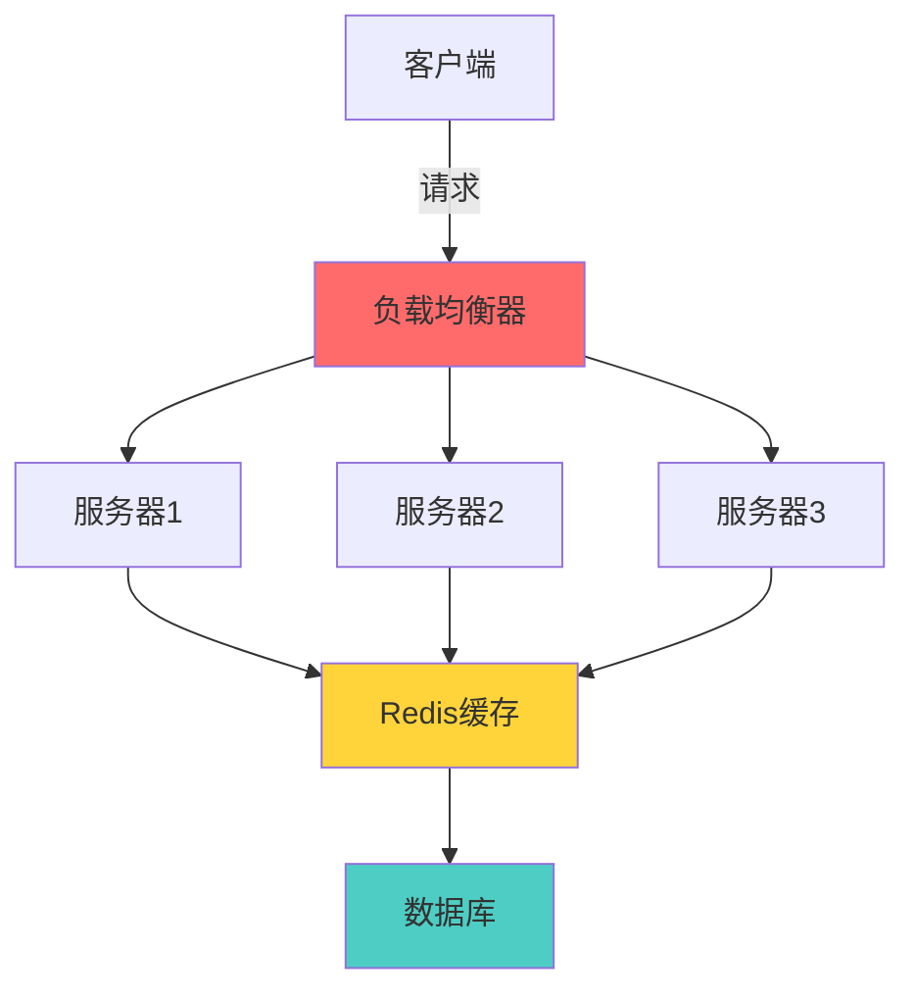

# CS架构的最佳实践

## 1. 设计原则

### 单一职责原则
- 客户端专注于用户交互
- 服务器专注于业务处理

### 接口隔离原则
- 定义清晰的API接口
- 避免过度耦合

### 依赖倒置原则
- 客户端依赖服务器接口，而非实现
- 使用抽象接口而非具体实现

## 2. 开发实践

### 版本管理
- **API版本控制**：使用URL版本（/v1/, /v2/）或Header版本
- **向后兼容**：保持向后兼容性
- **废弃策略**：明确废弃旧版本的策略

### 文档规范
- **API文档**：使用Swagger/OpenAPI
- **接口说明**：清晰的参数和返回值说明
- **示例代码**：提供调用示例

### 测试策略
- **单元测试**：客户端和服务器端单元测试
- **集成测试**：端到端集成测试
- **性能测试**：负载测试和压力测试

## 3. 监控和运维

### 监控指标
- **服务器性能**：CPU、内存、磁盘、网络
- **应用性能**：响应时间、吞吐量、错误率
- **业务指标**：用户数、请求数、成功率

### 日志管理
- **结构化日志**：使用结构化日志格式
- **日志级别**：DEBUG、INFO、WARN、ERROR
- **日志聚合**：集中收集和分析日志

### 告警机制
- **性能告警**：响应时间超过阈值
- **错误告警**：错误率超过阈值
- **资源告警**：资源使用率过高

# 总结

CS架构是一种成熟、稳定的分布式架构模式，具有以下特点：

## 核心优势
1. **清晰的职责分离**：客户端和服务器各司其职
2. **集中管理**：便于数据管理和业务逻辑维护
3. **可扩展性**：支持水平和垂直扩展
4. **成熟的技术栈**：有丰富的工具和框架支持

## 适用场景
- Web应用和移动应用
- 企业级应用系统
- 数据库应用
- 文件共享系统
- 实时通信应用

## 发展趋势
- **云原生**：向云原生架构演进
- **微服务化**：向微服务架构转型
- **Serverless**：结合Serverless技术
- **边缘计算**：结合边缘计算降低延迟

CS架构虽然是一种经典的架构模式，但在现代软件开发中仍然具有重要地位，特别是在需要集中管理和控制的场景中。理解CS架构的原理和实践，有助于设计和实现高质量的分布式系统。
